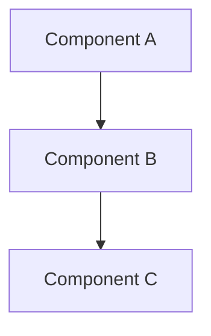

## Overview

Brief description of the epic and its goals.

## Execution Order

| Phase | Issue | Title | Blocks |
|-------|-------|-------|--------|
| X.1 | #XXX | [Phase 1 title] | ALL |
| X.2 | #XXX | [Phase 2 title] | #YYY |
| X.3 | #XXX | [Phase 3 title] | #YYY |

## Architecture

Describe the high-level architecture or provide a Mermaid diagram.



## Technical Stack

List key technologies, libraries, or frameworks.

```typescript
// Key dependencies
import { dependency } from "package";
```

## Sub-Issues

- [ ] #XXX - [Sub-issue 1]
- [ ] #XXX - [Sub-issue 2]
- [ ] #XXX - [Sub-issue 3]

## Epic Success Criteria

| Criterion | Pass Condition |
|-----------|----------------|
| Build | `pnpm build` exits with code 0 |
| Tests | All tests pass |
| Feature X | [Specific acceptance criteria] |

## Labels

`epic`, `priority-high`, `[category]`
