# Architecture

## High-Level Overview

OpenZigs is a **local-first AI agent platform** built on top of the [GitHub Copilot SDK](https://github.com/github/copilot-sdk). It follows a "Safe Agent" philosophy:

1. **Local-First Native Servers** — MCP tool servers run as native subprocesses managed by `LocalMcpServerManager`, eliminating Docker overhead. Docker Compose is retained only for the agent container, Cloudflare tunnel, and audio sidecar.
2. **Permissioned MCP Tools** — Every tool the agent can call is registered, risk-classified, and individually toggleable.
3. **Human-in-the-Loop Approvals** — High-risk actions (file writes, shell commands) pause execution until a human approves via the Web Chat or a messaging channel.
4. **MCP Host Architecture** — OpenZigs acts as an **MCP Host**, orchestrating 12 native MCP servers (social media, document intelligence, personal assistant, developer tools) as local subprocesses alongside the core Node.js agent.

The result is a "God Mode" AI assistant that **can** do anything, but only after you say it **should**.

---

## Architecture Decision: Why Copilot SDK?

OpenZigs deliberately chose the **GitHub Copilot SDK** (`@github/copilot-sdk`) over a custom LangChain/Python stack. This is the single most consequential architectural decision in the project and deserves explicit rationale.

The table below contrasts the two approaches across the four dimensions that matter most at scale.

### 1. Managed Cognitive Architecture vs. DIY Orchestration

| | DIY (LangChain / LangGraph) | Copilot SDK |
|---|---|---|
| **Agent Loop** | You manually implement the [ReAct](https://arxiv.org/abs/2210.03629) loop: prompt → parse → act → observe → repeat. Every edge case — malformed JSON tool calls, partial completions, hallucinated tool names — requires hand-written recovery code. | The **Agent Loop is a managed platform feature**. The SDK's `sendAndWait()` handles intent recognition, tool-call parsing, error recovery, and multi-step reasoning internally. We never see the raw loop. |
| **Error Handling** | You write retry logic, backoff strategies, output parsers, and fallback chains. A single missed edge case (e.g., the model returning a tool call inside a markdown block) can crash the pipeline. | The SDK retries rate-limits (429) and timeouts with exponential backoff, clears auth on 401, and surfaces structured errors via the `onErrorOccurred` hook. We focus on _policy_ ("retry" vs. "abort"), not _mechanics_. |
| **Tool Dispatch** | You build a tool executor, validate Zod/JSON schemas, handle streaming vs. non-streaming returns, and manage the tool↔model feedback loop. | We call `defineTool(name, schema, handler)`. The SDK handles schema serialization, dispatch, result injection back into the conversation, and even multi-tool-call batching. |

> **Net effect:** We write ~200 lines of tool _definitions_ instead of ~2,000 lines of orchestration _plumbing_.

### 2. Zero-Config Context Management

| | DIY (LangChain / LangGraph) | Copilot SDK |
|---|---|---|
| **Context Window** | You build a Retrieval-Augmented Generation (RAG) pipeline: chunk documents, embed them into a vector store (Pinecone, Chroma, FAISS), retrieve top-K at query time, and pray the chunking strategy doesn't split a function signature across two vectors. | The SDK **automatically packs context** with the most relevant information. IDE-aware features provide file contents, terminal history, and recent edits out of the box — no embedding pipeline required. |
| **Conversation Memory** | You implement a sliding window, token counter, summarization chain, or hybrid memory backend. Every model upgrade (new context window size) requires re-tuning. | **Infinite Sessions**: the SDK compacts context at configurable thresholds (`backgroundCompactionThreshold`, `bufferExhaustionThreshold`), preventing context window exhaustion automatically. We set two numbers; the SDK handles the rest. |
| **Multi-Turn State** | You serialize/deserialize conversation history, manage session IDs, and handle session resumption across server restarts. | `client.resumeSession()` restores persisted SDK state transparently. Sessions are cached in-memory and resumed on reconnect — zero custom serialization. |

> **Net effect:** Zero RAG infrastructure. Zero vector databases. Zero embedding models. The SDK's native context management replaces what would otherwise be an entire microservice.

### 3. Enterprise Auth & Trust

| | DIY (LangChain / LangGraph) | Copilot SDK |
|---|---|---|
| **API Key Management** | You provision OpenAI/Anthropic API keys, build a proxy server to hide them from clients, implement key rotation, and handle billing across multiple providers. | Auth is handled via the user's **GitHub Identity** (OAuth Device Flow). The token is scoped to Copilot access and stored locally at `~/.openzigs/auth.json` with `0600` permissions. No API keys to provision or rotate. |
| **Compliance** | You build your own audit trail, data-residency controls, and IP indemnity story. Enterprise customers will ask hard questions. | We inherit GitHub's **enterprise policy controls**: IP indemnity, "No Training on Code" guarantees, SOC 2 compliance, and organization-level Copilot policies — all managed by the customer's GitHub admin. |
| **SSO / RBAC** | You integrate with an Identity Provider (Okta, Azure AD, etc.) and build role-based access control from scratch. | GitHub's existing SSO/SAML integration carries forward. If you have a GitHub seat, you have Copilot access. Enterprise admins control model availability, tool permissions, and usage policies centrally. |

> **Net effect:** No API key rotation runbooks. No proxy servers. No compliance questionnaires we have to answer ourselves.

### 4. Model Agnosticism

| | DIY (LangChain / LangGraph) | Copilot SDK |
|---|---|---|
| **Model Binding** | You hardcode provider-specific APIs (`openai.chat.completions.create`, `anthropic.messages.create`). Switching from GPT-4 Turbo to Claude 3.5 requires code changes, new auth, and schema adjustments. | We program against a **standard Chat Interface** (`createSession({ model })` + `sendAndWait()`). The SDK routes to the best available backend. Switching models is a one-line config change. |
| **Model Upgrades** | GPT-5 drops? You update the SDK version, change model strings, test for behavioral regressions, and update token-counting logic. | GitHub adds the model to the Copilot model catalog → `client.listModels()` returns it → users select it in the Admin UI. **Zero code changes.** |
| **Multi-Model** | You build a router/fallback chain to try Model A, fall back to Model B, handle different response formats. | The SDK's model routing is transparent. We currently support GPT-4.1, GPT-4o, Claude Sonnet 4, Claude Sonnet 3.5, o4-mini, o3-mini, and Gemini 2.5 Pro — all through the same `chat()` interface. |

> **Net effect:** When GitHub added Claude Sonnet 4 and GPT-4.1 to the Copilot catalog, OpenZigs supported them immediately with zero code changes. A LangChain stack would have required a new provider integration each time.

### Summary

By choosing the Copilot SDK, OpenZigs operates as a **High-Level Agent Framework** rather than a low-level LLM wrapper. This reduces our maintenance surface area by ~40% and ensures instant compatibility with future model upgrades.

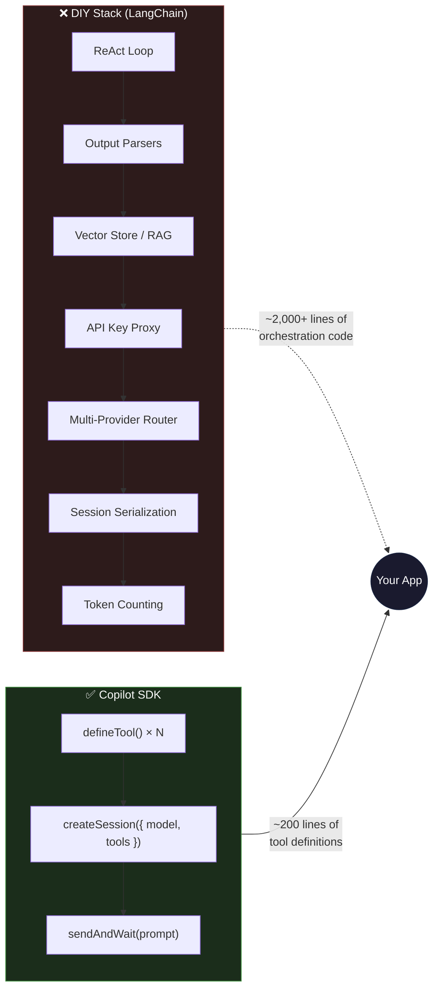

| Dimension | DIY Cost | Copilot SDK Cost | Savings |
|---|---|---|---|
| Agent loop & error handling | ~2,000 LOC | 0 (managed) | 100% |
| Context / RAG pipeline | ~1,500 LOC + infra | 0 (native) | 100% |
| Auth & key management | ~500 LOC + ops | ~50 LOC (device flow) | 90% |
| Multi-model support | ~800 LOC per provider | 1 config line per model | 95% |
| **Total** | **~4,800+ LOC** | **~250 LOC** | **~95%** |

---

## System Diagram

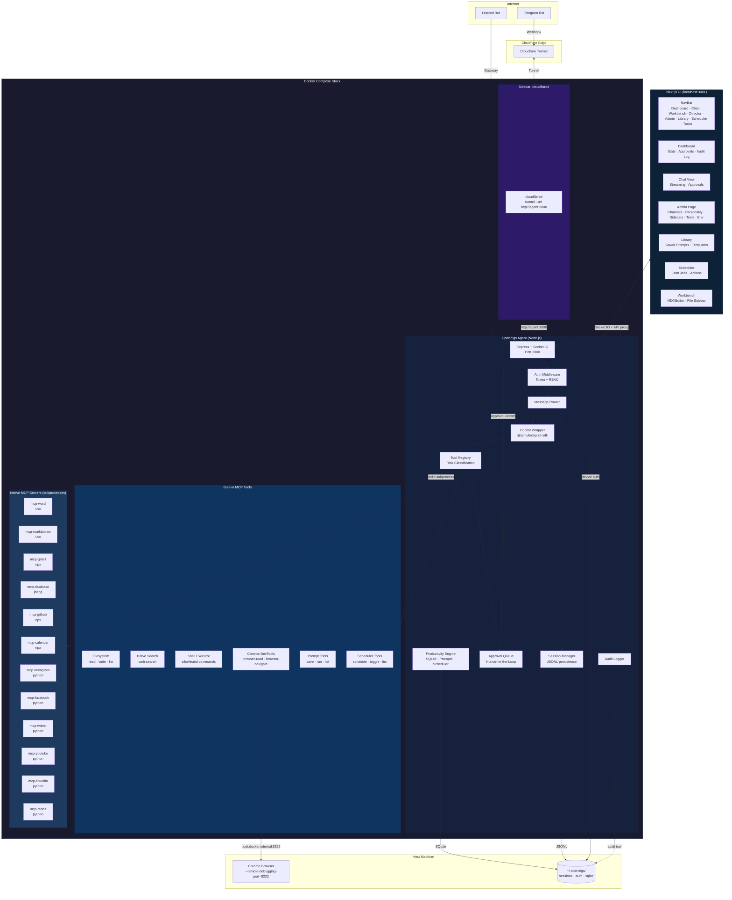

---

## UI Architecture

The frontend is a **Next.js 14 App Router** application in the `ui/` directory. It replaces the earlier vanilla JS/HTML frontend that was served via Express static middleware.

### Stack

| Technology | Purpose |
|---|---|
| **Next.js 14** (App Router) | SSR/SSG framework, file-based routing |
| **React 18** | Component model |
| **Tailwind CSS** | Utility-first styling with custom theme (ink, stone, ember, tide, moss, haze) |
| **React Query** (`@tanstack/react-query`) | Server state management, caching, mutations |
| **Socket.IO Client** | Real-time streaming (chat responses, approval events, job executions, server status) |
| **Space Grotesk + JetBrains Mono** | Typography |

### Route Map

| Route | Component | Purpose |
|---|---|---|
| `/` | `dashboard.tsx` | Snapshot stats, pending approvals, audit log |
| `/chat` | `chat-view.tsx` | Full chat with streaming, model selector, reasoning effort, file attachments, session context bar, interactive clarification prompts, approval overlay |
| `/admin` | `admin/page.tsx` | Channel config, personality settings with mode selector, model & provider configuration, custom agent management, sidecar management, native MCP server editor, tool toggles, env status |
| `/library` | `library/page.tsx` | Saved prompt CRUD with `{{variable}}` template preview and system prompt apply |
| `/presenter` | `presenter/page.tsx` | Presentation catalog — grid of rendered videos with thumbnails, search, delete |
| `/presenter/[id]` | `presenter/[id]/page.tsx` | Interactive player with FSM (Play/Pause/Quiz/Recap), chapter sidebar, Raise Hand Q&A, blackboard with Mermaid, quiz overlays, PDF recap |
| `/room/[id]` | `room/[id]/page.tsx` | Multiplayer watch party room with synced video, voice peers, Push-to-Talk, shared blackboard |
| `/invite/[token]` | `invite/[token]/page.tsx` | Guest invite redemption — verifies JWT, sets cookies, redirects to room |
| `/403` | `403/page.tsx` | Access denied page for unauthorized guests |
| `/invite-expired` | `invite-expired/page.tsx` | Expired invite link page |
| `/scheduler` | `scheduler/page.tsx` | Cron job CRUD with action types, prompt linking, model overrides, AI assist, live execution events |
| `/tasks` | `task-dashboard.tsx` | Background task queue, status filters, cancel, recursive child expansion, real-time updates |
| `/social` | `social/page.tsx` | Social Brain — unified inbox, CRM, automation rules, AI auto-reply |
| `/director` | `director/page.tsx` | Director Mode — Video Wizard tab (production pipeline) + Blog to YouTube tab (blog conversion) + My Drafts tab (browse/reopen saved drafts) |
| `/director/studio/[id]` | `director/studio/[id]/page.tsx` | Timeline Studio — @remotion/player preview, multi-track timeline, scene inspector, save/auto-save, render history |
| `/workbench` | `workbench/page.tsx` | Rich Markdown editor (MDXEditor) with file sidebar, live file system CRUD, Cmd/Ctrl+S save |

### Component Structure

```
ui/
├── app/
│   ├── layout.tsx          # Root layout with NavBar + Providers
│   ├── providers.tsx       # QueryClientProvider + SocketProvider
│   ├── page.tsx            # Dashboard route
│   ├── chat/page.tsx       # Chat route
│   ├── admin/page.tsx      # Admin route
│   ├── library/page.tsx    # Library route
│   ├── presenter/page.tsx  # Presenter catalog route
│   ├── presenter/[id]/page.tsx  # Interactive player route
│   ├── room/[id]/page.tsx       # Multiplayer watch party room
│   ├── invite/[token]/page.tsx  # Guest invite redemption
│   ├── 403/page.tsx             # Access denied (guest RBAC)
│   ├── invite-expired/page.tsx  # Expired invite page
│   ├── scheduler/page.tsx  # Scheduler route
│   ├── tasks/page.tsx      # Tasks route
│   ├── social/page.tsx     # Social Brain route
│   └── workbench/page.tsx  # Workbench route (MDXEditor + file sidebar)
├── components/
│   ├── nav-bar.tsx         # Sticky top navigation
│   ├── chat-view.tsx       # Chat with streaming + approvals + attachments + reasoning
│   ├── file-attachment.tsx # File attachment button, drop zone, chips (#141)
│   ├── reasoning-effort-selector.tsx  # Reasoning effort radio + provider badge (#142)
│   ├── user-input-prompt.tsx  # Interactive clarification prompt cards (#143)
│   ├── session-context-bar.tsx  # Session context gauge + compaction spinner (#144)
│   ├── dashboard.tsx       # Stats + approvals + audit log
│   ├── task-dashboard.tsx  # Background task queue + recursive children
│   ├── section-card.tsx    # Reusable card wrapper
│   ├── workbench/
│   │   ├── initialized-mdx-editor.tsx  # MDXEditor with full plugin config
│   │   ├── forward-ref-editor.tsx      # Dynamic SSR-safe import wrapper
│   │   └── file-sidebar.tsx            # Recursive file tree browser
│   ├── presenter/
│   │   ├── presentation-card.tsx       # Catalog grid card with thumbnail
│   │   ├── interactive-player.tsx      # HTML5 video wrapper
│   │   ├── raise-hand-button.tsx       # Floating Q&A button
│   │   ├── quiz-overlay.tsx            # Pop quiz multiple-choice overlay
│   │   ├── blackboard-overlay.tsx      # Streaming markdown + Mermaid Q&A panel
│   │   ├── mermaid-block.tsx           # Mermaid.js diagram renderer
│   │   ├── chapter-list.tsx            # Sidebar chapter navigation
│   │   ├── recap-screen.tsx            # Session recap with score ring
│   │   ├── score-ring.tsx              # SVG circular score indicator
│   │   ├── pdf-generator.ts           # jsPDF recap export
│   │   └── push-to-talk-button.tsx   # Floating PTT button (hold/click toggle)
│   ├── admin/
│   │   ├── tools-panel.tsx        # Tool list with risk badges + toggles
│   │   ├── channels-panel.tsx     # Telegram + Discord config forms
│   │   ├── sidecars-panel.tsx     # Docker sidecar management (deprecated, removed from admin page)
│   │   ├── local-servers-panel.tsx # Local MCP server status (includes all social platform servers)
│   │   ├── personality-panel.tsx  # System instruction + pre/post prompts + mode selector
│   │   ├── model-config-panel.tsx # Reasoning effort + BYOK provider configuration
│   │   ├── agents-panel.tsx       # Custom agent CRUD with tool multi-select
│   │   ├── mcp-editor-panel.tsx   # Native MCP server wizard + busy lock + reconnect
│   │   └── env-panel.tsx          # Environment variable status
│   └── director/
│       ├── director-wizard.tsx    # Multi-step video production wizard
│       ├── blog-to-video-panel.tsx # Blog URL → video conversion panel
│       ├── drafts-panel.tsx       # My Drafts tab — browse/reopen/delete saved drafts
│       ├── mode-selection-step.tsx # Production mode selector
│       ├── template-picker-step.tsx # Template selection grid
│       ├── media-upload-step.tsx   # Input media upload
│       ├── visual-assets-step.tsx  # Visual asset configuration
│       ├── sound-browser-step.tsx  # Music/SFX browser
│       ├── review-produce-step.tsx # Review + produce
│       ├── types.ts               # Director UI types
│       └── studio/
│           ├── studio-layout.tsx   # Studio page container (sidebar + preview + timeline)
│           ├── player-preview.tsx  # @remotion/player wrapper
│           ├── timeline-tracks.tsx # Multi-track visual timeline
│           ├── scene-inspector.tsx # Per-scene property editor
│           ├── studio-toolbar.tsx  # Save + Renders + Render actions with dirty indicator
│           ├── render-history.tsx  # Render history dropdown with status/progress/download
│           └── framing-panel.tsx   # 9:16 horizontal crop offset slider
└── lib/
    ├── api.ts              # Shared fetchJson utility + API_BASE
    ├── types.ts            # All shared TypeScript types
    └── socket-context.tsx  # SocketProvider + useSocket hook
├── middleware.ts            # Guest RBAC — JWT cookie verification, route gating
├── hooks/
│   ├── use-presenter-state.ts  # Presenter FSM (useReducer) with 4 states
│   ├── use-social.ts           # React Query hooks for Social Brain API
│   ├── useRoomSync.ts          # Socket.IO room protocol (join/leave/playback sync)
│   └── useVoiceRoom.ts         # PeerJS audio mesh + Push-to-Talk + transcription
```

### API Proxying

The Next.js dev server proxies API and WebSocket traffic to the Express backend. This is configured in `next.config.mjs`:

```javascript
// next.config.mjs
rewrites: async () => [
  { source: "/api/:path*", destination: `${API_BASE}/api/:path*` },
  { source: "/socket.io/:path*", destination: `${API_BASE}/socket.io/:path*` },
]
```

In development, the backend runs on port 3000 and the Next.js dev server runs on port 3001. The user accesses the UI at `http://localhost:3001`, and all `/api/*` and `/socket.io/*` requests are transparently proxied to the backend.

### Express Server (Backend Only)

The Express server (`src/server.ts`) no longer serves any static files or HTML routes. It provides only:

- REST API endpoints (`/api/*`)
- Socket.IO WebSocket server
- Health check (`/health`)

---

## Cloudflare Tunnel (Sidecar Pattern)

The Cloudflare Tunnel has moved to a **sidecar architecture**. Instead of the Node.js app spawning and managing a `cloudflared` process internally, the tunnel runs as an independent Docker Compose service:

```yaml
# docker-compose.yml (excerpt)
tunnel:
  image: cloudflare/cloudflared:2024.6.1
  container_name: openzigs-tunnel
  command: tunnel --no-autoupdate --url http://agent:3000
  depends_on:
    agent:
      condition: service_healthy
```

**Key points:**

- **`cloudflared` is NOT managed by Node.js.** It runs as a separate container alongside the agent.
- The tunnel proxies all inbound traffic from Cloudflare's edge to `http://agent:3000` using Docker's internal network.
- The internal tunnel module (`src/tunnel/cloudflare-tunnel.ts`) should be **disabled** in `config/default.json` when using the sidecar:

  ```json
  {
    "tunnel": {
      "enabled": false
    }
  }
  ```

- For Telegram webhooks, set the `webhookUrl` to your Cloudflare-routed domain (e.g., `https://agent.yourdomain.com/telegram/webhook`).

**Traffic flow:**

```
Internet → Cloudflare Edge → cloudflared sidecar → http://agent:3000 (Docker network)
```

---

## MCP Host Architecture

OpenZigs acts as an **MCP Host** — it orchestrates multiple external MCP servers to extend its capabilities beyond built-in tools.

### How It Works

1. **User sends a message** via Web Chat, Telegram, or Discord.
2. **Message Router** resolves the session and forwards only the personality + current message to the **Copilot Wrapper** along with the `conversationId`.
3. **Copilot Wrapper** reuses a cached SDK session (or creates / resumes one) via `getOrCreateSession()`. Tools are wrapped via `defineTool()` and passed to the session configuration.
4. **GitHub Copilot** (the intelligence layer) decides which tools to invoke based on the user's intent. The SDK maintains multi-turn context natively within the session.
5. **Tool execution returns to OpenZigs**, which dispatches to either a built-in handler or a stdio subprocess call to a native MCP server.
6. **Native MCP server** processes the request (e.g., posts to LinkedIn, fetches YouTube analytics) and returns the result.
7. **Result flows back** through the Copilot SDK to the user as a streamed response.

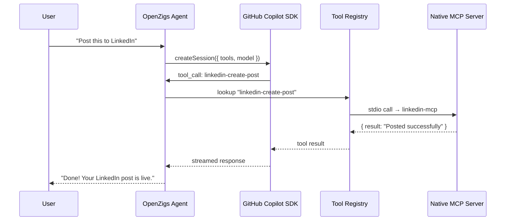

### Sidecar Registration

Native MCP servers are registered as subprocess definitions in `LocalMcpServerManager`. Each server is spawned on-demand via stdio transport:

1. Each server's tools are defined as `ToolDefinition` objects in TypeScript (e.g., `src/mcp/tools/facebook-tools.ts`).
2. At startup, `registerMcpTools()` in `src/mcp/server.ts` registers all tool definitions with the `ToolRegistry`.
3. The `CopilotWrapperService` wraps each enabled tool via the SDK's `defineTool()` function.
4. When the SDK invokes a native MCP-backed tool, the handler calls the server's tool via `LocalMcpServerManager.callTool()`.

The user does not need to manually register tools with any CLI. OpenZigs handles all registration automatically.

### Current MCP Servers

All MCP servers now run as **native subprocesses** via `LocalMcpServerManager` (stdio transport), eliminating Docker overhead:

| Service | Runtime | Platform | Category |
|---|---|---|---|
| `mcp-word` | `uvx` (Python) | Office Word | documents |
| `mcp-markitdown` | `uvx` (Python) | MarkItDown | documents |
| `mcp-gmail` | `npx` (Node.js) | Gmail | personal |
| `mcp-database` | `jbang` (Java) | JDBC Database | data |
| `mcp-github` | `npx` (Node.js) | GitHub | developer |
| `mcp-calendar` | `npx` (Node.js) | Google Calendar | personal |
| `mcp-instagram` | `python` (venv) | Instagram | social |
| `mcp-facebook` | `python` (venv) | Facebook/Meta | social |
| `mcp-twitter` | `python` (venv) | Twitter/X | social |
| `mcp-youtube` | `python` (venv) | YouTube | social |
| `mcp-linkedin` | `python` (venv) | LinkedIn | social |
| `mcp-reddit` | `python` (venv) | Reddit | social |

> **Migration note:** Docker-based MCP sidecars have been fully deprecated. The `DockerSidecarManager` class remains in the codebase with `@deprecated` JSDoc and an empty `DEFAULT_SIDECAR_DEFINITIONS` array. All MCP servers now use native subprocess management for lower overhead and simpler deployment.

### Native MCP Server Details

#### MarkItDown (`mcp-markitdown`)

**Source:** [microsoft/markitdown](https://github.com/microsoft/markitdown)

Converts various file formats (PDF, DOCX, PPTX, XLSX, HTML, images, audio) into Markdown for LLM consumption. Runs as a native subprocess via `uvx`.

**Tools:** `convert-to-markdown` (🟢 low risk)

#### Gmail (`mcp-gmail`)

**Source:** [GongRzhe/Gmail-MCP-Server](https://github.com/GongRzhe/Gmail-MCP-Server)

Reads, searches, and drafts Gmail messages. Requires Google Cloud OAuth credentials (`gcp-oauth.keys.json`). Runs via `npx`.

**Tools:** `gmail-search` (🟢 low), `gmail-read` (🟢 low), `gmail-draft` (🟡 medium), `gmail-send` (🔴 high)

#### Database / JDBC (`mcp-database`)

**Source:** [quarkiverse/quarkus-mcp-servers](https://github.com/quarkiverse/quarkus-mcp-servers/tree/main/jdbc)

Provides SQL access to any JDBC-compatible database (PostgreSQL, MySQL, SQLite, H2). Runs via `jbang`.

**Tools:** `db-query` (🔴 high), `db-describe` (🟢 low), `db-list-tables` (🟢 low)

#### GitHub (`mcp-github`)

**Source:** [github/github-mcp-server](https://github.com/github/github-mcp-server)

Full GitHub API access — repos, issues, PRs, code search, actions. Uses a GitHub Personal Access Token. Runs via `npx`.

**Tools:** `github-get-file` (🟢 low), `github-search-code` (🟢 low), `github-list-issues` (🟢 low), `github-create-issue` (🟡 medium), `github-create-pr` (🔴 high)

#### Multi-Platform Social MCP Servers

Six social platform MCP servers live under `external/` as Python applications using the official MCP SDK, each with its own virtualenv:

| Server | Directory | Tools | API | Key Capabilities |
|---|---|---|---|---|
| Instagram | `external/ig-mcp/` | 12 tools | Instagram Graph API | DMs, comment replies, post context, analytics, media publish |
| Facebook | `external/fb-mcp/` | 10 tools | Meta Graph API v24.0 | Messenger DMs, comment replies, post reads, page analytics |
| Twitter/X | `external/twitter-mcp/` | 8 tools | Twitter API v2 (OAuth 1.0a) | DMs, tweet replies, search, user lookup |
| YouTube | `external/youtube-mcp/` | 7 tools | YouTube Data API v3 | Comment replies, video search, channel analytics |
| LinkedIn | `external/linkedin-mcp/` | 8 tools | LinkedIn API v2 | DMs (partner-only), comment replies, post/company reads |
| Reddit | `external/reddit-mcp/` | 8 tools | Reddit OAuth2 | Private messages, comment replies, post/search reads |

All servers use **official platform APIs** (no scraping or unofficial endpoints). Each requires platform-specific API credentials set as environment variables. See respective `README.md` files in `external/` for setup instructions.

The `DmDispatcher` (`src/channels/social/dm-dispatcher.ts`) routes DM sends and comment replies to the correct MCP server, translating Social Brain's platform-agnostic calls into platform-specific tool invocations.

---

## Component Breakdown

### Copilot Wrapper (`src/copilot/copilot-wrapper.ts`)

Wraps `@github/copilot-sdk`'s `CopilotClient`. Responsibilities:

| Capability | Method | Description |
|---|---|---|
| **Device Auth** | `authenticate()` / `waitForAuth()` | OAuth device-flow for GitHub Copilot access. Persists token to `~/.openzigs/auth.json` with `0600` permissions. |
| **Streaming Chat** | `chat(message, options?)` | Returns an `AsyncGenerator<string>` that yields deltas as they arrive from the SDK. When `conversationId` is provided, sessions are cached and reused across calls for native multi-turn context. |
| **Native System Prompts** | `chat({ systemMessage })` | Personality instructions are passed via the SDK's native `systemMessage` field with a `mode` of `"append"` (merge with SDK defaults) or `"replace"` (fully override). This replaces the legacy approach of prepending `System: ...` to the user prompt. |
| **SDK Hooks** | Constructor `hooks` option | Lifecycle hooks (`onPreToolUse`, `onPostToolUse`, `onSessionStart`, `onSessionEnd`, `onErrorOccurred`) are wired at construction time and passed to every session. See [SDK Hooks](#sdk-hooks) below. |
| **Native Tool Scoping** | `chat({ availableTools, excludedTools })` | Per-call tool allowlists/blocklists are passed as `string[]` to the SDK, which handles filtering natively. Replaces the previous approach of filtering `ToolDefinition[]` arrays before passing to the session. |
| **Interactive Clarifications** | `chat({ onUserInputRequest })` | The SDK can request free-form or choice-based input from the user mid-execution via `onUserInputRequest`. In web chat, this surfaces as a Socket.IO prompt; background tasks auto-skip with an empty answer. |
| **Session Lifecycle** | `destroySession(id)` / `hasSession(id)` / `clearAllSessions()` | Manage cached SDK sessions. `destroySession` frees resources and resets context for a conversation. |
| **Session Resumption** | Internal | On first call with a `conversationId`, attempts `client.resumeSession()` to restore persisted SDK state, falling back to `createSession({ sessionId })` for deterministic session IDs. |
| **Infinite Sessions** | Config | When `infiniteSessions.enabled` is true, the SDK automatically compacts context at configurable thresholds (`backgroundCompactionThreshold`, `bufferExhaustionThreshold`), preventing context window exhaustion in long conversations. |
| **Model Selection** | `listModels()` | Proxies `client.listModels()` to enumerate available models (e.g., `gpt-4.1`, `claude-sonnet-4`). |
| **Tool Limit Control** | `setMaxToolsPerRequest(n)` / `getMaxToolsPerRequest()` | Get or set the maximum number of tools sent per LLM request (range: 1-128). Changes take effect on the next `chat()` call. |
| **Tool Dispatch** | Internal | When the SDK invokes a tool, the handler calls the `ToolDefinition.handler()` — which may call a native MCP server subprocess or execute locally. ALWAYS_ON_TOOLS (7 tools) are guaranteed inclusion before filling remaining slots. |
| **Retry Logic** | Internal | Automatic retries with exponential backoff for rate-limit (429) and timeout errors. Clears auth on 401. |
| **Handler Cleanup** | Internal | Per-call event handlers (`assistant.message_delta`, `session.idle`) are unsubscribed in a `finally` block after each `chat()` call, preventing handler accumulation on reused sessions. |
| **File Attachments** | `chat({ attachments })` | Passes `SdkAttachment[]` (file, directory, or selection references) alongside the prompt. The SDK reads file contents and provides them as context to the model. |
| **Working Directory** | `chat({ workingDirectory })` | Sets the base path for tool operations. Per-call override, with a server-wide default in config. Passed to `createSession({ workingDirectory })`. |
| **Reasoning Effort** | `chat({ reasoningEffort })` | Controls model reasoning depth: `"low"`, `"medium"`, `"high"`, `"xhigh"`. Higher values increase answer quality at the cost of latency. Per-call override, with a server-wide default. |
| **BYOK Provider** | Constructor `provider` option | Connects to alternative LLM providers (OpenAI-compatible, Azure, Anthropic, Ollama). Passed to `createSession({ provider })`. Changing the provider clears all cached sessions. |
| **Custom Agents** | `getCustomAgents()` / `setCustomAgents()` / `chat({ customAgents })` | Hierarchical sub-agents defined via the SDK's `customAgents` API. Each agent has a name, display name, system prompt, optional tool allowlist, and optional per-agent MCP servers. Default archetypes are loaded from `config/agents.json` and merged with user config. Per-call overrides merge by name. Changing agents clears all cached sessions. |
| **Native MCP Servers** | `getNativeMcpServers()` / `setNativeMcpServers()` / `chat({ mcpServers })` | SDK-managed MCP server connections via `mcpServers` config. Supports `stdio`/`local` (subprocess) and `http`/`sse` (remote) transports. Replaces the legacy `LocalMcpServerManager`. Per-call overrides merge by key. Changing servers clears all cached sessions. |

### Token Tracker (`src/copilot/token-tracker.ts`)

Captures and accumulates per-session token usage from the Copilot SDK's `assistant.usage` events.

| Capability | Method | Description |
|---|---|---|
| **Record Usage** | `record(event)` | Accumulates `inputTokens`, `outputTokens`, and `totalTokens` from each SDK usage event. Increments a per-session `turns` counter. |
| **Query Usage** | `getUsage()` | Returns the current `TokenUsage` snapshot: `{ inputTokens, outputTokens, totalTokens, turns }`. |
| **Clear** | `clearUsage()` | Returns the current usage and resets all counters to zero (used after persisting to SQLite). |
| **Context Window** | `getContextWindow(model)` | Looks up the model's maximum context window from `MODEL_CONTEXT_WINDOWS`. |

**Model Context Windows** (`MODEL_CONTEXT_WINDOWS`):

| Model | Context Window |
|---|---|
| `gpt-4.1` | 1,000,000 |
| `gpt-4.1-mini` | 1,000,000 |
| `gpt-4o` | 128,000 |
| `gpt-4o-mini` | 128,000 |
| `claude-sonnet-4` | 200,000 |
| `claude-sonnet-3.5` | 200,000 |
| `o3-mini` | 200,000 |
| `o4-mini` | 200,000 |
| `gemini-2.5-pro` | 1,000,000 |
| `gemini-2.5-flash` | 1,000,000 |

#### Token Tracking Data Flow

```mermaid
flowchart TB
    SDK[Copilot SDK Session] -->|assistant.usage event| CW[CopilotWrapper<br/>wireSessionEvents]
    CW --> TT[TokenTracker.record]
    TT --> EMIT[EventEmitter<br/>token:usage]
    EMIT --> SIO[Socket.IO<br/>context:usage]
    SIO --> UI[Context Fuel Gauge<br/>chat-view.tsx]

    SDK -->|compaction_start / complete| CW
    CW --> EMIT2[EventEmitter<br/>context:compaction]
    EMIT2 --> SIO2[Socket.IO<br/>context:compaction]
    SIO2 --> UI

    TW[TaskWorker<br/>on task complete/fail] -->|clearSessionUsage| TT
    TW -->|updateTokenUsage| DB[(SQLite<br/>agent_tasks.token_usage_json)]
    DB --> API[/api/tasks/:id/usage<br/>/api/tasks/usage/summary]
    API --> DASH[Token Badge<br/>task-dashboard.tsx]
```

The `CopilotWrapper` extends `EventEmitter` and wires SDK session events in `wireSessionEvents()`:

- **`assistant.usage`** → `tokenTracker.record()` + emit `token:usage` with `TokenUsageEvent`
- **`compaction_start`** → emit `context:compaction` with `{ status: "started" }`
- **`compaction_complete`** → emit `context:compaction` with `{ status: "completed" }`

The `server.ts` relays these events to Socket.IO clients:

```typescript
copilot.on("token:usage", (event) => { io.emit("context:usage", event); });
copilot.on("context:compaction", (event) => { io.emit("context:compaction", event); });
```

#### Token Persistence (Tasks)

When a background task completes or fails, the `TaskWorker` calls `copilot.clearSessionUsage()` to atomically read and reset the session's accumulated token usage, then persists it to the `agent_tasks` table via `taskRepository.updateTokenUsage()`.

The `agent_tasks` table has a `token_usage_json TEXT DEFAULT NULL` column storing `{ inputTokens, outputTokens, totalTokens, turns }` as JSON.

#### Token Usage API

| Method | Path | Description |
|---|---|---|
| `GET` | `/api/tasks/usage/summary` | Aggregate token usage across tasks in the last N hours (default: 24). Query params: `hours`, `status`, `limit`. |
| `GET` | `/api/tasks/:id/usage` | Token usage for a single task. |

The Models API (`GET /api/models`) is enriched with `contextWindow` from `MODEL_CONTEXT_WINDOWS` for each model.

### Tool Registry (`src/mcp/tool-registry.ts`)

Central registry for every tool the agent can invoke. Each tool has:

- **`name`** — Unique identifier (`read-file`, `web-search`, `shell-execute`, `social-post`, `pinterest-boards`).
- **`category`** — One of `filesystem`, `search`, `browser`, `shell`, `productivity`, `social`, `documents`.
- **`riskLevel`** — `low`, `medium`, or `high`.
- **`enabled`** — Boolean, persisted to `config/tools.json`.

The registry exposes `listEnabledTools()` which the Copilot Wrapper passes to the SDK's session configuration via `buildSessionConfig()`.

### SDK Hooks (`src/copilot/hooks.ts`)

The Copilot SDK supports lifecycle hooks that intercept tool calls, session events, and errors. OpenZigs wires these via `createHooksConfig()` at server startup, connecting them to the approval queue and audit logger.

| Hook | Trigger | OpenZigs Behavior |
|---|---|---|
| **`onPreToolUse`** | Before every tool execution | Checks `ToolRegistry` risk level. 🔴 High-risk tools are routed through the `ApprovalQueue` — execution pauses until a human approves or denies. Low/medium-risk tools are auto-allowed. |
| **`onPostToolUse`** | After every tool execution | Logs the tool name, arguments, and result to the `AuditLogger` for the security audit trail. |
| **`onSessionStart`** | When an SDK session is created | Logs session creation for lifecycle tracking. |
| **`onSessionEnd`** | When an SDK session is destroyed | Logs session teardown. |
| **`onErrorOccurred`** | When the SDK encounters an error | Returns `"retry"` for recoverable errors (network, rate-limit) and `"abort"` for non-recoverable failures. |

**Migration from manual approval wrapper:** Prior to SDK hooks, high-risk tool gating was implemented as a manual wrapper in `src/mcp/server.ts` that intercepted `CallToolRequestSchema` before dispatching. The hook-based approach is cleaner — approval logic lives in a dedicated factory function and is applied uniformly to all tool calls, including those from background tasks and agent chains.

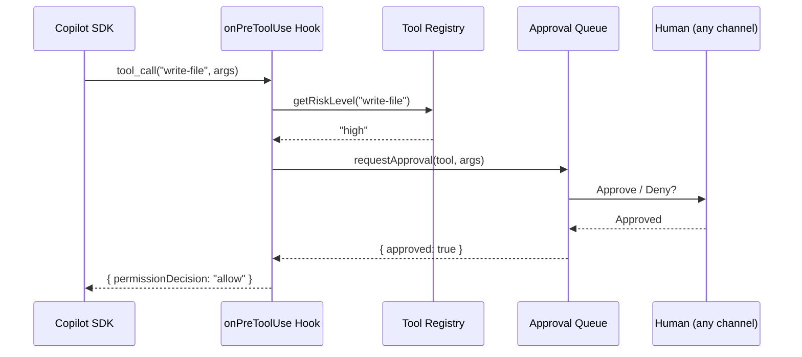

### Productivity Engine (`src/productivity/`)

Embedded SQLite-backed subsystem for saved prompts and cron scheduling:

- **Database** (`database.ts`) — Shared `better-sqlite3` singleton with WAL mode. Tables: `saved_prompts`, `scheduled_jobs`.
- **PromptManager** (`prompt-manager.ts`) — CRUD for saved prompts with `{{variable}}` template interpolation, optional pipeline stages (`stages: PipelineStage[] | null`) for multi-step execution, and preferred tool scoping (`preferredTools: string[] | null`). The `resolveWithStages()` method returns interpolated text, preferred tools, and pipeline stages in a single call — used by the scheduler to execute prompt-as-pipeline workflows.
- **Scheduler** (`scheduler.ts`) — `node-cron` v4 in-process scheduler with JSONL audit logs and `EventEmitter` hooks for Socket.IO notifications.

### Message Router (`src/routing/message-router.ts`)

Routes an `IncomingMessage` from any channel through a pipeline:

1. **Access Control** — Open / allowlist / blocklist per-channel.
2. **Session Resolution** — Finds or creates a session for the `(channelType, userId)` pair.
3. **Session Touch** — Calls `sessionManager.resumeSession()` to update `lastActiveAt` (history is retained for admin/audit views).
4. **System Message Construction** — `buildSystemMessage()` reads the personality config and produces a `SystemMessageConfig` with `content` (the personality text) and `mode` (`"append"` to merge with SDK defaults, or `"replace"` to fully override). If personality is disabled, no system message is sent.
5. **Tool Scoping** — `resolveAvailableTools()` resolves per-message tool allowlists into `string[]` (tool names), which the SDK filters natively via `availableTools`. Replaces the previous `ToolDefinition[]` filtering approach.
6. **LLM Call** — Streams the prompt through `CopilotWrapper.chat()` with `conversationId: sessionId`, `systemMessage`, `availableTools`, and `onUserInputRequest`, forwarding chunks to the channel if a `RouteOptions.onChunk` callback is provided. The SDK handles multi-turn context natively; only the current user message is sent as the prompt.
7. **Persistence** — Appends the user message and assistant response to the session's JSONL log for admin views and auditing.
8. **Session Clear** — `clearUserSession()` also calls `copilot.destroySession()` to free the cached SDK session.

### Session Manager (`src/sessions/session-manager.ts`)

Append-only session storage used for user↔session mapping, admin views, and audit trails:

- **Metadata** — `{channel, userId, chatId, username}` stored in a JSON sidecar file.
- **History** — Conversation events (user, assistant, tool_call, tool_result) appended to a JSONL file. Used for admin session viewer and auditing; **not** injected into the LLM prompt (the SDK maintains multi-turn context natively).
- **Location** — `~/.openzigs/sessions/<sessionId>/`.

### Approval Queue (`src/approvals/approval-queue.ts`)

When a tool with `riskLevel: "high"` is invoked, the SDK's `onPreToolUse` hook (wired via `src/copilot/hooks.ts`) intercepts the call:

1. The hook first checks the **per-task auto-approve list** (`activeAutoApproveTools`). If the tool is listed, it returns `"allow"` immediately, logs an audit entry (`tool_auto_approved`), and skips the approval queue entirely.
2. Otherwise, the hook checks the tool's risk level via `ToolRegistry`.
3. For 🔴 high-risk tools, it calls `ApprovalQueue.requestApproval()`.
4. An `approval:created` event is emitted.
5. Every connected channel (Web Chat, Telegram, Discord) presents an approve/deny prompt.
6. **First response wins** — the hook returns `"allow"` or `"deny"` to the SDK, which either executes or skips the tool.
7. The decision is audit-logged via the `onPostToolUse` hook.

#### Per-Task Auto-Approve Overrides

The approval override system uses a **thread-local context pattern** (same pattern as `setActiveChatContext` / `setActiveOrchestrateContext`):

- `setActiveAutoApproveTools(tools)` — set before task execution in `TaskWorker.executeTask()`
- `clearActiveAutoApproveTools()` — cleared in the `finally` block after execution
- The `onPreToolUse` hook reads the active list and bypasses approval for matching tool names

This enables fully autonomous scheduled workflows where specific tools (e.g., `shell-execute`, `write-file`) can run without human confirmation while unspecified tools still require approval.

**Data flow:**
```
ScheduledJob.autoApproveTools → TaskEngine.submit({ autoApproveTools })
  → AgentTask.autoApproveTools → TaskWorker.executeTask()
    → setActiveAutoApproveTools(task.autoApproveTools)
      → copilot.chat() → onPreToolUse hook checks activeAutoApproveTools
    → clearActiveAutoApproveTools() (finally)
```

### Social Formatter (`src/channels/social-formatter.ts`)

Converts Markdown content to platform-safe plain text using Unicode character transformations. Social platforms (LinkedIn, X/Twitter, Facebook) do not render Markdown; posting raw `**bold**` looks broken.

| Markdown | Output | Unicode Range |
|---|---|---|
| `**bold**` | **𝗯𝗼𝗹𝗱** | Mathematical Bold Sans-Serif (U+1D5D4) |
| `*italic*` | *𝑖𝑡𝑎𝑙𝑖𝑐* | Mathematical Italic (U+1D434) |
| `**123**` | 𝟭𝟮𝟯 | Bold Digits (U+1D7EC) |
| `# Heading` | 𝗛𝗘𝗔𝗗𝗜𝗡𝗚 | Bold uppercase |
| `[text](url)` | text (url) | Plain text |
| `` | [Image: alt] | Placeholder |
| `- item` | • item | Bullet |
| `> quote` | ❝quote❞ | Curly quotes |
| `---` | ───────── | Box drawing |

Used by the `social-post` tool handler in `src/mcp/tools/social-media-tools.ts` to preprocess content before dispatching to native MCP servers. The system prompt also instructs the LLM to prefer Unicode formatting for social media output.

### Channel Abstraction (`src/channels/types.ts`)

All messaging surfaces implement the `MessageChannel` interface:

```typescript
interface MessageChannel {
  readonly id: string;
  readonly type: ChannelType; // "web" | "discord" | "telegram"

  connect(): Promise<void>;
  disconnect(): Promise<void>;
  isConnected(): boolean;

  sendMessage(chatId: string, content: MessageContent): Promise<void>;
  sendApprovalRequest(chatId: string, request: ApprovalRequest): Promise<void>;

  // Optional streaming methods
  sendStreamChunk?(chatId: string, chunk: string, messageId: string): Promise<void>;
  sendStreamEnd?(chatId: string, messageId: string): Promise<void>;
  sendError?(chatId: string, error: string): Promise<void>;

  onMessage(handler: (msg: IncomingMessage) => void): void;
  onApprovalResponse(handler: (response: ApprovalResponse) => void): void;
}
```

**Implemented channels:**

| Channel | Transport | Streaming | Status |
|---|---|---|---|
| **Web Chat** | Socket.IO | Yes | ✅ Implemented |
| **Telegram** | grammY (webhooks) | No | ✅ Implemented |
| **Discord** | discord.js (gateway) | No | ✅ Implemented |
| **Slack** | — | — | *(Coming Soon)* |

---

## Voice Interface Layer

The voice subsystem adds hands-free input (wake word) and audio output (TTS) capabilities to the web chat.

### Architecture

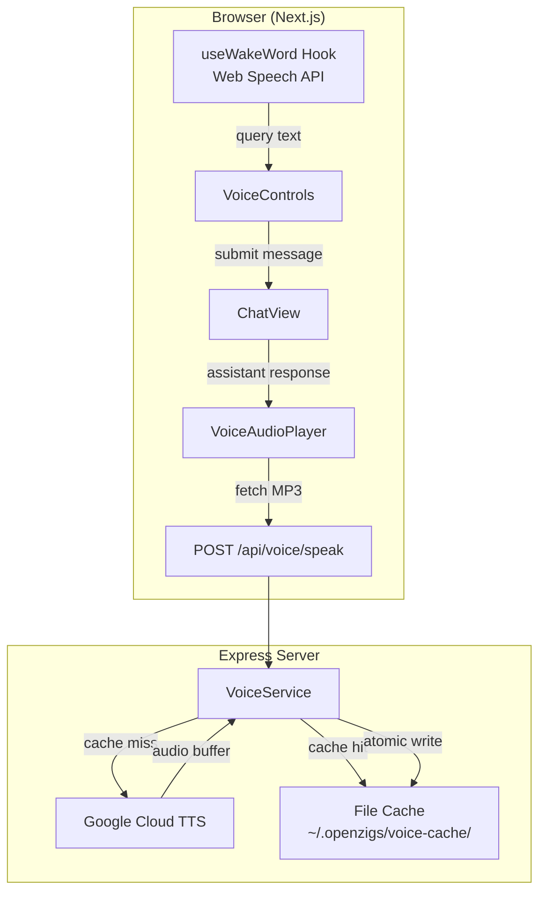

### Components

| Component | Location | Purpose |
|---|---|---|
| `VoiceService` | `src/voice/voice-service.ts` | Google Cloud TTS client with MD5-keyed file cache and LRU eviction |
| `VoiceService types` | `src/voice/types.ts` | Config, result, and cache stat type definitions |
| Voice API router | `src/api/voice.ts` | Express routes: `POST /speak`, `GET /config`, `GET /cache`, `DELETE /cache` |
| `useWakeWord` hook | `ui/lib/hooks/use-wake-word.ts` | State machine (IDLE→STANDBY→ACTIVE) with Levenshtein fuzzy matching and Chrome keep-alive |
| `VoiceControls` | `ui/components/voice/voice-controls.tsx` | Mic/speaker toggle buttons integrated into the chat header |
| `VoiceIndicator` | `ui/components/voice/voice-indicator.tsx` | Colored dot: gray (IDLE), blue-pulse (STANDBY), green-glow (ACTIVE) |
| `VoiceAudioPlayer` | `ui/components/voice/voice-audio-player.tsx` | Hidden `<audio>` element for TTS playback with interrupt support |

### Wake Word State Machine

```
IDLE ──[startListening()]──► STANDBY ──[wake word]──► ACTIVE
  ▲                              ▲                       │
  └──[stopListening()]───────────┴──[silence timeout]────┘
```

- **STANDBY**: Listening via Web Speech API continuous mode with keep-alive (restarts on Chrome auto-stop)
- **ACTIVE**: Capturing query text after wake word, with configurable silence timeout (default: 5s)
- **Fuzzy matching**: Levenshtein similarity ≥ 0.7 against variants: "hey zigs", "hey zig", "hey sig", "hey sigs"

### TTS Caching Strategy

- **Cache key**: MD5 hash of `{text, voice, speakingRate, pitch}` → `{hash}.mp3` or `{hash}.wav`
- **Writes**: Atomic (write `.tmp` → rename) to prevent corruption
- **Reads**: Touch `mtime` on hit for LRU tracking
- **Eviction**: Background LRU sweep when total size exceeds `maxCacheSizeMb`

### Audio Sidecar (Local TTS + STT)

The audio sidecar is a FastAPI Python server that provides **local** speech synthesis (TTS) via [mlx-audio](https://github.com/lucasnewman/mlx-audio) and speech-to-text (STT) via [lightning-whisper-mlx](https://github.com/mustafaaljadery/lightning-whisper-mlx). It runs on Apple Silicon (MPS) or CUDA, avoiding cloud API costs for voice operations.

#### Architecture

```
┌──────────────┐     ┌───────────────────┐     ┌──────────────┐
│  Voice       │────▶│  Audio Sidecar    │────▶│  MLX Models  │
│  Service     │     │  (FastAPI :5006)  │     │  (lazy load) │
│  (Node.js)   │     │                   │     │              │
└──────────────┘     └───────────────────┘     └──────────────┘
   POST /tts              │         │              │
   POST /transcribe       │         │         Kokoro-82M-bf16
   GET /health            │         │         distil-large-v3
   GET /voices            │         │
                          │         │
                     TTS Model   STT Model
                     (~330MB)    (~1.5GB)
```

#### Endpoints

| Method | Path | Description |
|---|---|---|
| `POST` | `/tts` | Text-to-speech synthesis → 24kHz WAV |
| `POST` | `/transcribe` | Audio file → transcript with segments/timestamps |
| `GET` | `/voices` | List 19 Kokoro voice presets |
| `GET` | `/health` | Model load status and memory info |
| `POST` | `/unload` | Unload TTS/STT models to free VRAM |

#### Key Design Decisions

- **Lazy model loading**: Models load on first use, not at startup, reducing cold-start time.
- **Independent lifecycle**: TTS and STT models can be loaded/unloaded independently.
- **Auto-unload**: Idle models are automatically unloaded after a configurable timeout (default: 300s) to free VRAM.
- **Dual provider**: `VoiceService` routes to local sidecar or Google Cloud TTS based on configuration, with the same API surface.
- **Runtime weight download**: `pip install -r requirements.txt` installs Python packages only. Model weights are downloaded on first `POST /tts` and `POST /transcribe`, then cached locally (default locations: `sidecars/audio/mlx_models/` and `sidecars/audio/.cache/huggingface/`). These artifacts are git-ignored.

#### Voice Presets

19 Kokoro voices across 4 languages (American English, British English, Japanese, Chinese) with varied genders and styles (calm, cheerful, professional, expressive, etc.).

#### Reference Audio Processing (Engine B)

When GPT-SoVITS (Engine B) receives a voice cloning request, the audio sidecar applies an automatic preprocessing pipeline to the reference audio before forwarding it to the GPT-SoVITS process. The UI/API now enforce a stricter 3–8s reference audio window (with 5–8s recommended) for more consistent cloning quality.

**Pipeline (`_trim_audio_to_max()` in `sidecars/audio/server.py`):**

```
Browser recording (.webm, up to 8s)
    ↓
POST /tts (engine=sovits, ref_audio_path=...)
    ↓
_trim_audio_to_max(file_path, max_seconds=9)
    ├─ ffprobe: measure duration
    ├─ ffmpeg: ALWAYS convert non-WAV → PCM WAV (16-bit, 44.1kHz, mono)
    ├─ ffmpeg -t 9: trim to max seconds if needed
    └─ Returns (temp_wav_path, is_temp=True)
    ↓
_synthesize_sovits(trimmed_wav, text, params)
    ├─ httpx POST → http://127.0.0.1:9880/tts
    └─ Returns WAV audio bytes
    ↓
finally: delete temp file
```

**Key constants:**

| Constant | Value | Location | Description |
|---|---|---|---|
| `_SOVITS_REF_MAX_SECONDS` | `9` | `sidecars/audio/server.py` | Max reference audio duration. Set to 9 (not 10) because GPT-SoVITS uses an exclusive upper bound on its 10s limit. |
| `SOVITS_REF_AUDIO_MAX_SECONDS` | `8` | `src/api/audio.ts` | Max recording duration accepted by the Node API (UI-facing limit). |

**GPT-SoVITS runtime dependencies** (installed by `install.sh` or manually):

| Package | Purpose |
|---|---|
| `torchcodec` | Audio decoding required by GPT-SoVITS internals |
| `averaged_perceptron_tagger_eng` (NLTK) | English part-of-speech tagging for text processing |

### Multimodal Knowledge (Audio/Video RAG)

The knowledge base supports **audio and video ingestion** via the audio sidecar's STT capabilities and **Copilot SDK vision** for keyframe description, enabling RAG over both spoken and visual content.

#### Ingestion Pipeline

**Audio-only files** (.mp3, .wav, .m4a, .ogg, .flac):
```
Audio file
    ↓
ffmpeg extract audio track
    ↓
POST /transcribe → sidecar (Whisper MLX)
    ↓
Transcript with timestamps
    ↓
Chunked + embedded in LanceDB
```

**Video files** (.mp4, .webm):
```
Video file
    ├──── ffmpeg extract audio ──────▶ POST /transcribe → sidecar
    │                                          ↓
    └──── ffmpeg extract keyframes ──▶ Copilot SDK vision (GPT-5 mini)
              (1 frame / 10s,                  ↓
               max 20 frames)          Frame descriptions
                                               ↓
                                  Interleaved transcript + visual descriptions
                                               ↓
                                  Chunked with timestamp metadata
                                               ↓
                                  Embedded + stored in LanceDB
```

#### Key Design Decisions

- **No Ollama/VLM required**: Keyframe descriptions use the Copilot SDK's built-in vision support via `CopilotWrapper.chat()` with `SdkAttachment` image files. GPT-5 mini supports vision natively and doesn't consume premium requests — eliminating the need for a separate ~8-10GB VLM model.
- **Batched vision requests**: Frames are sent in batches (up to 10 per request) using numbered prompts to minimize API calls, following the same pattern as Director Mode's `keyframe-analyzer.ts`.
- **Graceful degradation**: If CopilotWrapper is unavailable or vision fails, the converter falls back to transcript-only output (audio-only behavior).
- **Sidecar priority**: If the audio sidecar is available, it takes priority over the bundled whisper-node converter for media files.
- **Timestamp preservation**: Each chunk retains `timestampStart` and `timestampEnd` for citation formatting.
- **Document type tracking**: Chunks include `documentType` for type-aware retrieval boosting.
- **Visual markers**: Frame descriptions are tagged with `[Visual @ MM:SS]` markers and interleaved chronologically with transcript segments.

#### Multimodal Retrieval

The `multimodalSearch()` function wraps standard vector/FTS/hybrid search with:

1. **Query classification** — Detects media intent keywords ("video", "recording", "podcast") and temporal hints ("at 2:30", "minute 5").
2. **Score boosting** — Media-sourced chunks get a 1.1–1.5× score multiplier for media-intent queries.
3. **Citation formatting** — Results include timestamp citations like `[interview.mp4 @ 2:30 → 3:15]` for audio/video sources.

### Voice UI Components

| Component | Location | Purpose |
|---|---|---|
| `VoiceMicButton` | `ui/components/voice/voice-mic-button.tsx` | Push-to-talk recording button with local sidecar transcription |
| `useVoiceInput` hook | `ui/lib/hooks/use-voice-input.ts` | MediaRecorder + sidecar `/transcribe` integration |
| `VoiceStatusPanel` | `ui/components/admin/voice-status-panel.tsx` | Sidecar health, model status, voice browser with preview |

---

## Director Mode (Video Production)

Director Mode is a **full-stack video production pipeline** that transforms raw video clips into polished edits via a single-shot LLM call. The system ingests media, extracts visual/audio context, and produces a deterministic **Director Manifest** — a JSON edit decision list that a render engine compiles into the final video.

### Architecture

```
┌──────────────┐     ┌───────────────┐     ┌──────────────┐     ┌────────────┐
│  Input Clips │────▶│  Ingestion    │────▶│  Producer    │────▶│  Renderer  │
│  (video/     │     │  Pipeline     │     │  (LLM call)  │     │  (Worker   │
│   audio)     │     │  (#237)       │     │  (#239)      │     │   Thread)  │
└──────────────┘     └───────────────┘     └──────────────┘     └────────────┘
                            │                     │                    │
                     ┌──────┴──────┐        ┌─────┴─────┐       ┌─────┴──────┐
                     │ Audio       │        │ System    │       │ Remotion   │
                     │ Extraction  │        │ Prompts   │       │ SSR Engine │
                     │ Scene Det.  │        │ Templates │       │ (#243)     │
                     │ Whisper STT │        │ Manifest  │       └────────────┘
                     └─────────────┘        │ Schema    │
                                            └───────────┘
```

### Remotion Render Engine (#243)

The render pipeline uses **Remotion v4** for server-side React video rendering, replacing the previous FFmpeg-based pipeline. This enables smooth transitions, animated title cards, smart captions, lower thirds, logo watermarks, and Ken Burns effects — all as composable React components.

#### Render Pipeline (SSR)

```
Manifest ──▶ Adapter ──▶ bundle() ──▶ selectComposition() ──▶ renderMedia() ──▶ MP4
              │            │              │                       │
              │            │              ▼                       ▼
              │            │         TemplateComposition     h264/jpeg
              │            ▼         TransitionSeries        onProgress
              │       cachedServeUrl   AudioLayer             callbacks
              ▼       (reused)         Branding
         CompositionInputProps
         (Zod-validated)
```

**5 Render Phases:**

| Phase | Progress | Description |
|---|---|---|
| **Bundle** | 0–20% | Compiles Remotion entry point with esbuild. Cached via `cachedServeUrl` for subsequent renders. |
| **Adapt** | 20–25% | Transforms `DirectorManifest` → `CompositionInputProps` via `adaptManifest()`. |
| **Select** | 25–30% | `selectComposition()` resolves the target composition + dynamic metadata. |
| **Render** | 30–95% | `renderMedia()` renders each frame as React → JPEG, then encodes to H.264 MP4. |
| **Finalize** | 95–100% | Stat output file, compute duration, report completion. |

#### Remotion Module Structure

| Module | Path | Purpose |
|---|---|---|
| **Input Props** | `src/remotion/input-props.ts` | Zod schemas for `CompositionInputProps` — timeline items, audio, branding |
| **Root Entry** | `src/remotion/index.tsx` | `RemotionRoot` registering 4 compositions with `calculateMetadata` |
| **Adapter** | `src/remotion/adapter.ts` | `adaptManifest()` — DirectorManifest → CompositionInputProps transformer |
| **Media Resolver** | `src/remotion/media-resolver.ts` | Resolves relative/tilde/file:// paths to absolute paths |
| **Template Comp** | `src/remotion/compositions/template-composition.tsx` | Main `TemplateComposition` with `TransitionSeries`, audio layers, branding |
| **Transition Map** | `src/remotion/util/transition-mapper.ts` | Maps crossfade/wipe/dissolve/cut → Remotion presentations |

#### Visual Components (`src/remotion/components/`)

| Component | Description |
|---|---|
| `TitleCard` | Animated title/subtitle with fade, slide-up, or typewriter animation |
| `SmartCaptions` | Word-by-word captions with pill, underline, boxed, or karaoke styles |
| `LowerThird` | Animated name/title overlay with spring slide-in |
| `LogoWatermark` | Persistent logo overlay using Remotion's `Img`, 4 positions |
| `ProgressBar` | Frame-based progress indicator, top or bottom positioning |
| `VideoClipSegment` | `OffthreadVideo` with effects: slowZoom, fadeIn/fadeOut, blur, grayscale |

#### Quality Presets (#251)

| Preset | CRF | Use Case |
|---|---|---|
| `draft` | 32 | Fast preview, smaller files |
| `standard` | 23 | Balanced quality and file size (default) |
| `high` | 18 | High quality, larger files |
| `lossless` | 0 | Maximum quality, very large files |

### Sub-modules

| Module | Path | Purpose |
|---|---|---|
| **Manifest Schema** (#240) | `src/video/manifest/` | Zod-validated `DirectorManifest` data contract with semantic validator |
| **Render Core** (#235) | `src/video/render-orchestrator.ts`, `render-worker.ts` | Worker Thread render jobs with concurrency control and EventEmitter progress |
| **Remotion Engine** (#243) | `src/remotion/` | React SSR compositions, visual components, transitions, adapter, media resolver |
| **Template Library** (#236) | `src/video/templates/` | 4 built-in templates (Minimalist, ContentCreator, Corporate, TechDemo) with registry |
| **Ingestion Pipeline** (#237) | `src/video/ingestion/` | Audio extraction (ffmpeg), scene detection, Whisper transcription, context assembly |
| **Asset Management** (#238) | `src/video/assets/` | Local library scanner + Pixabay/Jamendo/Pexels API downloaders with attribution tracking |
| **Producer Service** (#239) | `src/video/producer/` | Single-shot CopilotWrapper.chat() call → JSON manifest with markdown-stripping parser |

### Production Modes

1. **Highlight Reel** (Mode A) — Auto-selects best moments from ingested clips based on visual scene scores and speech content
2. **Script-Driven** (Mode B) — Aligns timeline to a user-provided script; optionally generates TTS voiceover via VoiceService
3. **Presentation** (Mode C) — Generates a full video from a text topic with no input media required. The pipeline: `StoryboardEngine` (LLM) → scene plan → `ImageGenService` (Stable Diffusion / cloud fallback) → AI-generated images → per-scene TTS voiceover → Ken Burns animations → assembled `DirectorManifest` with `image_scene` timeline entries

### Mode C Architecture (Presentation Pipeline)

Mode C ("Presentation Mode") is a **zero-input video production pipeline** — the user provides only a topic string, and the system generates a complete video with AI-generated imagery, narration, transitions, and background music.

```
┌────────────┐     ┌──────────────────┐     ┌──────────────────┐     ┌──────────────┐
│  Text      │────▶│  Storyboard      │────▶│  Image Gen       │────▶│  Manifest    │
│  Topic     │     │  Engine (LLM)    │     │  Service         │     │  Builder     │
│            │     │  (#254)          │     │  (#255)          │     │  (#256-257)  │
└────────────┘     └──────────────────┘     └──────────────────┘     └──────────────┘
                          │                        │                        │
                   ┌──────┴──────┐          ┌──────┴──────┐         ┌──────┴──────┐
                   │ Scene Plan  │          │ FLUX.1/MFLUX│         │ image_scene │
                   │ title,      │          │ (local) or  │         │ timeline    │
                   │ narration,  │          │ Cloud API   │         │ entries +   │
                   │ visual desc │          │ (fallback)  │         │ Ken Burns + │
                   │ styleAnchor │          │             │         │ TTS + music │
                   └─────────────┘          └─────────────┘         └─────────────┘
```

#### Sub-modules (Mode C)

| Module | Path | Purpose |
|---|---|---|
| **StoryboardEngine** (#254) | `src/video/generators/storyboard-engine.ts` | LLM-powered scene planner. Takes a topic + optional style/audience hints, returns a structured storyboard with title, `styleAnchor`, and ordered scenes (each with `title`, `narration`, `visualDescription`, `duration`, `rawImageDescription`). |
| **ImageGenService** (#255) | `src/video/generators/image-gen-service.ts` | Multi-provider image generation (local FLUX.1 via MFLUX/MLX FastAPI sidecar, cloud GCP Imagen fallback). Supports configurable dimensions, guidance scale, inference steps. Health-checks providers at startup. |
| **Image Gen Sidecar** (#255) | `sidecars/image-gen/server.py` | FastAPI Python server wrapping [MFLUX](https://github.com/filipstrand/mflux) (native MLX) for FLUX.1 inference on Apple Silicon. Endpoints: `POST /generate`, `GET /health`, `GET /models`, `POST /model`, `POST /unload`. |
| **ImageSceneSegment** (#256) | `src/remotion/components/image-scene-segment.tsx` | Remotion component rendering a single Mode C scene: AI image with Ken Burns pan/zoom + optional per-scene `Audio` voiceover in a `Sequence`. |
| **KenBurns** (#256) | `src/remotion/components/KenBurns.tsx` | Animated Ken Burns effect using Remotion `interpolate()` — configurable `scaleFrom`/`scaleTo`, `translateX`/`translateY` ranges over the clip's duration. |

Model download behavior for Mode C image generation mirrors the audio sidecar: Python dependencies are installed via `pip`, but FLUX.1 model weights are downloaded lazily by MFLUX on first generation and cached in `~/.cache/huggingface/` (git-ignored). A HuggingFace token (`HF_TOKEN`) is required to access the gated FLUX.1 models.

#### Remote Image Generation — FluxQ Network Node (#290)

`ImageGenService` supports a **network mode** that offloads image generation to a second Mac on the local network. This is useful when the primary machine lacks GPU resources or when you want to dedicate a separate Apple Silicon Mac to diffusion workloads.

```
┌────────────────────┐      HTTP + Bearer Token       ┌────────────────────┐
│  Primary Mac       │ ─────────────────────────────▶ │  Remote Mac        │
│  OpenZigs Server   │    POST /generate              │  FluxQ Sidecar     │
│  ImageGenService   │    GET  /health                │  (FastAPI + MLX)   │
│  mode: "network"   │◀── JSON + PNG bytes ────────── │  FLUX.1 (MFLUX)    │
└────────────────────┘                                └────────────────────┘
```

**Configuration:** `imageGen.mode` in `~/.openzigs/config.json` (or via Admin UI panel):
- `"local"` (default): uses `localSidecarUrl` (typically `http://127.0.0.1:5005`)
- `"network"`: routes to `networkNodeUrl` with `Authorization: Bearer <networkNodeToken>` header

**Security:** Bearer token auth via `hmac.compare_digest` on the sidecar side. Health and model-list endpoints remain unauthenticated for LAN discovery. See [FLUXQ_SETUP.md](FLUXQ_SETUP.md) for setup instructions.

#### `image_scene` Timeline Entry

Mode C introduces a new discriminated union variant in the `DirectorManifest` timeline:

```typescript
interface ImageSceneEntry {
  type: "image_scene";
  src: string;              // absolute path to generated image
  startAtFrame: number;
  duration: number;         // frames
  voiceover?: string;       // path to per-scene TTS audio
  voiceoverVolume?: number; // 0–1, default 1
  kenBurns?: {
    scaleFrom: number;      // default 1.0
    scaleTo: number;        // default 1.15
    translateXFrom: number; // default 0
    translateXTo: number;   // default -10
    translateYFrom: number; // default 0
    translateYTo: number;   // default -5
  };
}
```

The `TimelineEntry` union becomes: `VideoClipEntry | OverlayEntry | TitleCardEntry | TransitionEntry | ImageSceneEntry`.

#### Rendering Pipeline (Mode C)

The `image_scene` entry flows through the standard Remotion pipeline:

1. **Adapter** (`src/remotion/adapter.ts`) maps `image_scene` manifest entries → `ImageScenePropsSchema` input props with media path resolution and bundle staging.
2. **TemplateComposition** (`src/remotion/compositions/template-composition.tsx`) dispatches `image_scene` items to `ImageSceneSegment` within the `TransitionSeries`.
3. **ImageSceneSegment** renders the `KenBurns` component + optional per-scene `Audio` in a `Sequence`.
4. Crossfade `TransitionEntry` items between scenes provide smooth visual flow.

#### Manifest Construction (video-tools.ts)

When `mode === "presentation"`, the `produce-video` tool handler:

1. Calls `StoryboardEngine.generate(topic)` → structured scene plan
2. Calls `ImageGenService.generate(description)` for each scene → image files
3. Calls `VoiceService.synthesize(narration)` for each scene → TTS audio files
4. Builds a `DirectorManifest` with:
   - `image_scene` entries (one per scene, with Ken Burns params alternating pan direction)
   - `transition` entries (crossfade between scenes)
   - Background music via `audioLayers` (with volume ducking for voiceover)
   - Metadata including `styleAnchor`, `totalDuration`, `mode: "presentation"`
5. Returns the manifest for rendering via the standard Remotion pipeline

### MCP Tools

| Tool | Risk | Description |
|---|---|---|
| `produce-video` | 🔴 high | Full pipeline: ingest → LLM → manifest. Returns edit decision list. |
| `list-templates` | 🟢 low | List available video templates with configurations. |
| `search-assets` | 🟢 low | Search royalty-free music/SFX across local + cloud sources. |

### Configuration (`config/default.json`)

```json
{
  "director": {
    "enabled": true,
    "outputDir": "~/.openzigs/video-output",
    "maxConcurrentRenders": 1,
    "defaultTemplate": "Minimalist",
    "assets": {
      "localLibraryPath": "~/.openzigs/media-library",
      "downloadCachePath": "~/.openzigs/asset-cache"
    },
    "ingestion": {
      "sceneThreshold": 0.4,
      "keyframeInterval": 5,
      "whisperModel": "base.en"
    }
  }
}
```

---

## Advanced Director Mode (Voice Cloning & Visual Injection)

> **Epic #268** adds two major capabilities to Director Mode: a **swappable TTS engine system** (Kokoro Engine A + GPT-SoVITS Engine B) and an **LLM-guided visual asset injection pipeline**. Both features include dedicated security controls.

### Swappable TTS Engine Architecture (SI-1)

#### Engine Registry

The audio sidecar (`sidecars/audio/server.py`) manages three TTS engines behind dedicated endpoints:

| Engine | Identifier | Technology | VRAM | Notes |
|---|---|---|---|---|
| **Engine A** | `kokoro` | mlx-audio (on-device) | ~1 GB | Default; always available on Apple Silicon |
| **Engine B** | `sovits` | GPT-SoVITS (HTTP proxy) | 6–10 GB | External process at `http://127.0.0.1:9880` |
| **Engine C** | `f5tts` | f5-tts-mlx (on-device) | ~1–2 GB | Emotion-driven voice cloning via per-clip reference audio |

#### Engine Switch Mutex

Engine switching is protected by an `asyncio.Lock` (`_engine_switch_lock`) initialized in FastAPI's `lifespan()` context manager. This prevents concurrent switch requests from causing double-load race conditions:

```python
@app.post("/switch_engine")
async def switch_engine(req: SwitchEngineRequest):
    async with _engine_switch_lock:
        # 1. Probe sovits reachability (if switching to B)
        # 2. Call _unload_tts() → mlx.core.metal.clear_cache()
        # 3. Update _active_engine and _sovits_url globals
```

#### VRAM Lifecycle

When switching from Engine A (Kokoro) to Engine B:
1. `_unload_tts()` is called — Kokoro model is released
2. `mlx.core.metal.clear_cache()` flushes the Apple Silicon Metal GPU cache
3. Engine B activates immediately (no model load — it proxies to external GPT-SoVITS process)

When switching back to Engine A:
- `_load_tts()` is called — Kokoro model loads from disk (~1–3 s)
- Engine B proxy is deactivated

#### TTS Routing

The `POST /tts` endpoint dispatches to the appropriate helper based on `_active_engine`:

```
POST /tts
    │
    ├─ _active_engine == "kokoro" → _synthesize_kokoro(req)
    │     └─ mlx-audio local inference → WAV bytes
    │
    └─ _active_engine == "sovits" → _synthesize_sovits(req)
          ├─ _trim_audio_to_max(ref_audio, 9s) → convert webm→WAV + trim
          ├─ httpx.AsyncClient POST → {_sovits_url}/tts
          │     └─ GPT-SoVITS process → WAV bytes
          └─ finally: delete temp trimmed file
```

#### Health Endpoint

`GET /health` probes both engines asynchronously and reports combined status:

```json
{
  "status": "ok",
  "active_engine": "kokoro",
  "sovits_url": "http://127.0.0.1:9880",
  "sovits_reachable": false
}
```

The `sovits_reachable` flag is checked with a 2-second timeout to avoid blocking the health check.

#### Voice Profiles (Engine B)

Voice profiles are persisted in the `voice_profiles` SQLite table (managed by `src/productivity/database.ts`). A profile captures all GPT-SoVITS synthesis parameters:

| Column | Type | Description |
|---|---|---|
| `id` | TEXT (nanoid) | Primary key |
| `name` | TEXT UNIQUE | Human-readable profile name |
| `ref_audio_path` | TEXT | Path to reference WAV/MP3 clip |
| `ref_text` | TEXT | Optional transcript of reference clip |
| `language` | TEXT | `"en"`, `"zh"`, `"ja"`, `"ko"`, `"auto"` |
| `top_p` | REAL | Top-P sampling (default 0.8) |
| `temperature` | REAL | Sampling temperature (default 1.0) |
| `text_split_method` | TEXT | `"cut5"`, `"cut3"`, `"cut2"`, etc. |
| `speed_factor` | REAL | Speech rate multiplier (default 1.0) |
| `repetition_penalty` | REAL | Repetition penalty (default 1.35) |
| `top_k` | INTEGER | Top-K sampling (default 15) |

The `src/api/audio.ts` Express router exposes full profile CRUD at `/api/admin/audio/profiles`.

#### Data Flow

```
Voice Lab UI
    │
    ├─ GET /api/admin/audio/engine/status ──▶ sidecar /health
    ├─ POST /api/admin/audio/engine/switch ──▶ sidecar /switch_engine
    │
    ├─ POST /api/admin/audio/upload/ref-audio
    │     └─ Stores to ~/.openzigs/director/ref-audio/
    │
    ├─ CRUD /api/admin/audio/profiles ──▶ SQLite voice_profiles
    │
    └─ POST /api/admin/audio/profiles/:id/test
          └─ Reads profile → Node API (no pre-flight duration check)
                → sidecar POST /tts (engine B params)
                    → _trim_audio_to_max(ref_audio, 9s)
                        → webm→WAV conversion + trim
                    → httpx POST → GPT-SoVITS :9880/tts
                    → WAV response
```

#### F5-TTS Engine C — Emotion-Driven Voice Cloning (Issue #313)

Engine C adds **multi-emotion voice cloning** via [f5-tts-mlx](https://github.com/lucasnewman/f5-tts-mlx), running natively on Apple Silicon (MLX).

**Architecture:**
- Each F5-TTS profile contains one or more **emotion clips** (Regular, Excited, Whisper, etc.)
- Each clip has its own reference audio + transcript
- Narration scripts use parenthesized emotion tags: `(Excited)Welcome to the show!`
- The sidecar splits text at emotion markers, synthesizes each segment with the matching clip, and concatenates the WAV output

**Database Schema:**

| Table | Column | Description |
|---|---|---|
| `voice_profiles` | `engine_type` | `"sovits"` (default) or `"f5tts"` |
| `f5tts_clips` | `id` | nanoid primary key |
| `f5tts_clips` | `profile_id` | FK → `voice_profiles.id` (CASCADE delete) |
| `f5tts_clips` | `emotion` | Emotion label (e.g. "Regular", "Excited") |
| `f5tts_clips` | `ref_audio_path` | Path to reference WAV/MP3 (max 15s) |
| `f5tts_clips` | `ref_text` | Transcript of reference audio |

**Synthesis Flow:**

```
POST /f5tts
    │
    ├─ Parse text → split at (EmotionTag) markers
    │     e.g. "(Regular)Hello. (Excited)Amazing news!"
    │     → [{emotion: "Regular", text: "Hello."}, {emotion: "Excited", text: "Amazing news!"}]
    │
    ├─ For each segment:
    │     ├─ Match emotion → clip ref_audio_path + ref_text
    │     ├─ Convert ref audio → 24kHz mono WAV (ffmpeg)
    │     └─ f5_tts_mlx.generate(text, ref_audio, ref_text, steps, method, ...)
    │           → 24kHz WAV segment
    │
    └─ Concatenate all WAV segments → single WAV response
```

**API Endpoints (under `/api/admin/audio`):**

| Method | Path | Description |
|---|---|---|
| GET | `/f5tts/profiles` | List all F5-TTS profiles with clips |
| POST | `/f5tts/profiles` | Create F5-TTS profile |
| GET | `/f5tts/profiles/:id` | Get profile with clips |
| DELETE | `/f5tts/profiles/:id` | Delete profile (cascades clips) |
| POST | `/f5tts/profiles/:id/clips` | Add emotion clip to profile |
| DELETE | `/f5tts/clips/:clipId` | Delete single clip |
| POST | `/f5tts/profiles/:id/test` | Test synthesis with emotion-tagged text |
| POST | `/upload/f5tts-ref-audio` | Upload ref audio (stored at `~/.openzigs/director/f5tts-ref-audio/`) |

**Process ports (local dev):**

| Process | Port | Started By |
|---|---|---|
| Node.js backend | 3000 | `pnpm dev` |
| Next.js UI | 3001 | `cd ui && pnpm dev` |
| Image-gen sidecar | 5005 | `scripts/dev-clean.sh` |
| Audio sidecar | 5006 | `scripts/dev-clean.sh` |
| GPT-SoVITS (Engine B) | 9880 | `scripts/dev-clean.sh` or `~/.openzigs/sidecars/gptsovits/start.sh` |

---

### Visual Asset Injection (SI-2)

#### Pipeline Overview

```
┌────────────────┐   ┌──────────────────┐   ┌──────────────────┐   ┌─────────────┐
│  Upload Asset  │──▶│  LLM Placement   │──▶│  Overlay         │──▶│  Output     │
│  (image/video) │   │  Suggestion      │   │  Compositor      │   │  Video      │
│  /upload-asset │   │  /assets/        │   │  /assets/overlay │   │  (MP4)      │
└────────────────┘   │  placement       │   └──────────────────┘   └─────────────┘
                     └──────────────────┘
                              │
                       CopilotWrapper.chat()
                       → AssetPlacement[]
```

#### Asset Upload

`POST /api/admin/director/files/upload-asset?kind=image|video` (in `src/api/director.ts`) uses `multer` to receive the file and stores it at:

```
~/.openzigs/director/uploads/visual/<nanoid>_<originalname>
```

Assets are served back via `GET /api/admin/director/files/:fileName` which validates the path against known upload directories before calling `res.sendFile()`.

#### LLM-Guided Placement (`POST /assets/placement`)

The placement endpoint prompts the LLM with video context + asset labels and extracts a structured `AssetPlacement[]` JSON array:

```typescript
interface AssetPlacement {
  assetId: string;
  assetPath: string;
  startSeconds: number;
  endSeconds: number;
  x: number;          // pixels from left
  y: number;          // pixels from top
  width: number;
  height: number;
  opacity: number;    // 0–1
}
```

The LLM response is collected via the `AsyncGenerator` pattern:

```typescript
const stream = copilot.chat(prompt, { tools: [] });
const chunks: string[] = [];
for await (const chunk of stream) chunks.push(chunk);
const responseText = chunks.join("");
```

A JSON extraction regex strips any markdown fences before `JSON.parse()`.

#### ffmpeg Overlay Compositor (`src/video/asset-overlay.ts`)

`overlayAssets()` builds an ffmpeg filter graph and spawns the process safely:

**Security guarantees:**
- `spawn("ffmpeg", args)` is used — no shell string interpolation, no injection surface
- All file paths are validated against `ALLOWED_ROOTS = [os.homedir(), os.tmpdir(), "/tmp", "/private/tmp"]` via `assertAllowedPath()` before being passed as arguments
- Audio is passed through unchanged (`-c:a copy`)

**Filter graph construction** (for N overlays):

```
[0:v] → [base]
[1:v] scale=W:H → [layer1:v]  overlay=x=X:y=Y:enable='between(t,S,E)' → [pass1]
[2:v] scale=W:H → [layer2:v]  overlay=x=X:y=Y:enable='between(t,S,E)' → [pass2]
...
[passN] → final output
```

Each overlay uses `ffmpeg`'s `enable` expression to activate only during `[startSeconds, endSeconds]`.

---

### Script Sanitization (SI-3)

#### Threat Model

Narration scripts are user-supplied text that flows through:
1. `ProducerService` → `POST /tts` → TTS engine synthesis

If a script contains injected LLM directives, those could manipulate the TTS system prompt or fool a downstream LLM into executing unintended actions.

#### Sanitization Pipeline

`sanitizeNarrationScript(raw: string): SanitizationResult` in `src/video/producer/script-sanitizer.ts` is a pure function (zero external imports) that applies 9 regex-based passes:

| Pass | Category | Pattern Examples |
|---|---|---|
| 1 | `system_header` | Lines starting with `SYSTEM:`, `[SYSTEM]`, `<<SYS>>` |
| 2 | `ignore_instruction` | Phrases like "ignore all previous instructions" |
| 3 | `tool_call_injection` | `<invoke>`, `<tool_call>`, XML-style tool tags |
| 4 | `code_fence` | Triple-backtick blocks + their content |
| 5 | `inline_code` | Single-backtick spans |
| 6 | `shell_metachar` | `$()`, `` `...` ``, `&&`, `||`, `;` in context |
| 7 | `shell_operator` | `>`, `>>`, `<`, `2>` (as word boundary operators) |
| 8 | `html_tag` | All `<...>` tags |
| 9 | `llm_scaffold_token` | `<\|im_start\|>`, `<\|endoftext\|>`, `[INST]`, `<<HUMAN>>` etc. |

Sanitization produces a `{ text, flagged, threats }` result. If `flagged`, the ProducerService logs a `warn`-level message listing the detected threat categories, then continues synthesis with the cleaned `text`.

#### Data Flow

```
ProducerService.produce()
    │
    ├─ fs.readFile(scriptPath)  →  rawScript
    │
    ├─ sanitizeNarrationScript(rawScript)
    │     ├─ flagged=true  → logger.warn("threats: ...")
    │     └─ returns { text: cleanedScript, ... }
    │
    └─ cleanedScript → TTS synthesis
```

---

### Voice Lab UI Architecture (SI-4)

The Voice Lab is implemented as two React components in `ui/components/voice-lab/`:

#### `EngineToggle` (`engine-toggle.tsx`)

- Polls `GET /api/admin/audio/engine/status` every 15 seconds via `useQuery`
- Renders a status badge (Engine A / Engine B) with green/yellow health indicator
- `POST /api/admin/audio/engine/switch` via `useMutation`; invalidates the status query on success

#### `VoiceLabPanel` (`voice-lab-panel.tsx`)

Three sub-sections:

1. **Engine Toggle** — Embeds `<EngineToggle />` with real-time health display
2. **Kokoro Presets** (`KokoroPresetGrid`) — Grid of preset voice cards; clicking a card calls `POST /api/voice/synthesize` to generate a preview WAV and plays it via `new Audio(url).play()`
3. **Voice Profiles** (`ProfileForm` + `ProfileCard`) — Full Engine B CRUD:
   - `ProfileForm` — name, ref audio path, language, and sliders for all 9 synthesis parameters
   - `ProfileCard` — displays profile params; **Test** button calls `POST /api/admin/audio/profiles/:id/test`, receives a WAV blob URL and plays it; **Delete** button with optimistic invalidation

The panel is registered in `ui/app/admin/page.tsx` as:

```tsx
<SectionCard title="Voice Lab" defaultOpen={false}>
  <VoiceLabPanel />
</SectionCard>
```

#### Component Tree

```
admin/page.tsx
└─ SectionCard[Voice Lab]
   └─ VoiceLabPanel
      ├─ EngineToggle          ← engine status + switch mutation
      ├─ KokoroPresetGrid      ← preset browser + audio preview
      └─ [ProfileForm | ProfileCard[]]
             ├─ ProfileForm    ← create/edit Engine B profile
             └─ ProfileCard[]  ← test + delete existing profiles
```

---

## Security Model

### Risk Classification

Every tool is classified at registration time:

| Level | Badge | Behavior | Examples |
|---|---|---|---|
| **Low** | 🟢 | Auto-approved. No user prompt. | `read-file`, `list-directory`, `web-search`, `list-prompts`, `social-profile`, `read-pdf` |
| **Medium** | 🟡 | Logged, executed without pause. | `browser-read`, `social-timeline`, `pinterest-boards`, `schedule-job`, `create-word-doc` |
| **High** | 🔴 | **Execution paused.** Requires explicit human approval. | `write-file`, `shell-execute`, `social-post`, `browser-navigate` |

### Authentication & Authorization

- **Auth Mode:** Local token auto-generated on first run, stored in `~/.openzigs/config.json`.
- **Roles:**
  - `admin` — Full access (enable/disable tools, decide approvals, view logs).
  - `operator` — Read tools/approvals/logs, decide approvals.
  - `viewer` — Read-only health.
- **Rate Limiting:** Failed auth attempts are rate-limited (default: 10 attempts per 60 s window).

### Dual-Channel Approval Flow (via SDK Hooks)

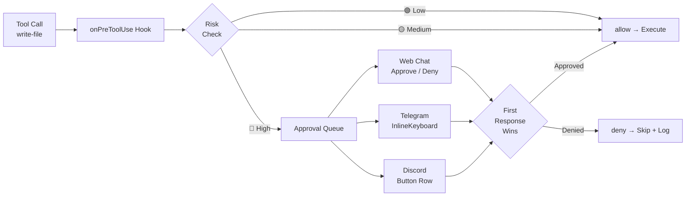

### Audit Trail

All security-relevant events are logged by `AuditLogger`:

- Tool calls (requested, approved, denied, result).
- Shell executions (command, args, exit code, duration).
- Auth failures.
- Server lifecycle events.

Logs are queryable via `GET /api/logs` with filters for `category`, `level`, `since`, `until`, and `limit`.

---

## MCP Tool Catalog

### Built-in Tools

| Tool | Category | Risk | Description |
|---|---|---|---|
| `read-file` | filesystem | 🟢 low | Read a file within allowed directories. |
| `list-directory` | filesystem | 🟢 low | List directory contents within allowed directories. |
| `write-file` | filesystem | 🔴 high | Write content to a file (path-restricted). |
| `web-search` | search | 🟢 low | Query Brave Search API. Requires `BRAVE_API_KEY`. |
| `browser-read` | browser | 🟡 medium | Read page content via Chrome DevTools Protocol (CDP). |
| `browser-navigate` | browser | 🔴 high | Control Chrome: navigate, click, type, screenshot, evaluate JS. |
| `shell-execute` | shell | 🔴 high | Run an allowlisted shell command with timeout. |

### Productivity Tools

| Tool | Category | Risk | Description |
|---|---|---|---|
| `save-prompt` | productivity | 🟢 low | Save a reusable prompt template with `{{variable}}` interpolation. |
| `get-prompt` | productivity | 🟢 low | Retrieve a saved prompt by name or ID. |
| `list-prompts` | productivity | 🟢 low | List all saved prompts with optional search. |
| `update-prompt` | productivity | 🟢 low | Update an existing saved prompt. |
| `delete-prompt` | productivity | 🟡 medium | Delete a saved prompt. |
| `run-prompt` | productivity | 🟢 low | Resolve a saved prompt with variable substitution. |
| `schedule-job` | productivity | 🟡 medium | Schedule a cron job for automated execution. |
| `list-jobs` | productivity | 🟢 low | List all scheduled jobs. |
| `get-job` | productivity | 🟢 low | Get details of a scheduled job. |
| `update-job` | productivity | 🟡 medium | Update a scheduled job's cron expression or action. |
| `delete-job` | productivity | 🟡 medium | Delete a scheduled job. |
| `toggle-job` | productivity | 🟡 medium | Enable or disable a scheduled job. |

### Agent Chaining Tools

| Tool | Category | Risk | Description |
|---|---|---|---|
| `spawn-agent` | productivity | 🟡 medium | Spawn an asynchronous background sub-agent for long-running or independent tasks. |
| `orchestrate-agents` | productivity | 🟡 medium | Fan-out/fan-in: dispatch multiple agents in parallel, wait for all results, optionally aggregate via Copilot. |

### Social Media Tools (Native MCP Servers)

Each social platform has a dedicated set of tools backed by its native MCP server:

**Instagram** (11 tools — `external/ig-mcp/`, TypeScript handler: `src/mcp/tools/instagram-tools.ts`)

| Tool | Category | Risk | Description |
|---|---|---|---|
| `instagram-get-profile` | social | 🟢 low | Get Instagram business profile info. |
| `instagram-get-posts` | social | 🟢 low | Get recent media posts with engagement metrics. |
| `instagram-get-media-insights` | social | 🟢 low | Get insights for a specific post. |
| `instagram-publish-media` | social | 🔴 high | Upload and publish image/video. |
| `instagram-get-pages` | social | 🟢 low | List connected Facebook pages. |
| `instagram-get-account-insights` | social | 🟢 low | Get account-level analytics. |
| `instagram-get-conversations` | social | 🟡 medium | List DM conversations (requires Advanced Access). |
| `instagram-get-messages` | social | 🟡 medium | Get messages in a DM conversation. |
| `instagram-send-dm` | social | 🔴 high | Send Instagram DM (24h messaging window, Advanced Access). |
| `instagram-reply-to-comment` | social | 🟡 medium | Reply to a comment on a post. |
| `instagram-get-media-comments` | social | 🟢 low | Get comments on a media post. |

**Facebook** (10 tools — `external/fb-mcp/`)

| Tool | Category | Risk | Description |
|---|---|---|---|
| `facebook-get-page-info` | social | 🟢 low | Get Facebook Page profile info. |
| `facebook-get-posts` | social | 🟢 low | Get recent page posts. |
| `facebook-get-post-insights` | social | 🟢 low | Get insights for a specific post. |
| `facebook-publish-post` | social | 🔴 high | Publish a post to the page. |
| `facebook-get-conversations` | social | 🟢 low | Get page conversations (inbox). |
| `facebook-get-messages` | social | 🟢 low | Get messages in a conversation. |
| `facebook-send-message` | social | 🔴 high | Send a Messenger message. |
| `facebook-get-page-insights` | social | 🟢 low | Get page-level analytics. |
| `facebook-get-post-comments` | social | 🟢 low | Get comments on a page post. |
| `facebook-reply-to-comment` | social | 🟡 medium | Reply to a comment on a page post. |

**Twitter/X** (8 tools — `external/twitter-mcp/`)

| Tool | Category | Risk | Description |
|---|---|---|---|
| `twitter-get-me` | social | 🟢 low | Get authenticated user profile. |
| `twitter-get-user-tweets` | social | 🟢 low | Get a user's recent tweets. |
| `twitter-search-tweets` | social | 🟢 low | Search tweets by query. |
| `twitter-get-tweet` | social | 🟢 low | Get a specific tweet by ID. |
| `twitter-post-tweet` | social | 🔴 high | Post a new tweet (also used for replies via `reply_to` param). |
| `twitter-get-dm-events` | social | 🟢 low | Get recent DM events. |
| `twitter-send-dm` | social | 🔴 high | Send a direct message. |
| `twitter-get-user` | social | 🟢 low | Get user profile by username. |

**YouTube** (7 tools — `external/youtube-mcp/`)

| Tool | Category | Risk | Description |
|---|---|---|---|
| `youtube-get-channel-info` | social | 🟢 low | Get YouTube channel info. |
| `youtube-get-channel-videos` | social | 🟢 low | List channel videos. |
| `youtube-get-video-details` | social | 🟢 low | Get video details by ID. |
| `youtube-get-video-comments` | social | 🟢 low | Get video comment threads. |
| `youtube-reply-to-comment` | social | 🟡 medium | Reply to a YouTube comment (requires OAuth). |
| `youtube-search-videos` | social | 🟢 low | Search YouTube videos. |
| `youtube-get-channel-analytics` | social | 🟢 low | Get channel analytics. |

**LinkedIn** (8 tools — `external/linkedin-mcp/`)

| Tool | Category | Risk | Description |
|---|---|---|---|
| `linkedin-get-profile` | social | 🟢 low | Get LinkedIn profile info. |
| `linkedin-get-posts` | social | 🟢 low | Get recent posts. |
| `linkedin-create-post` | social | 🔴 high | Create a LinkedIn post. |
| `linkedin-get-company` | social | 🟢 low | Get company page info. |
| `linkedin-send-message` | social | 🔴 high | Send a LinkedIn message (partner-only). |
| `linkedin-get-conversations` | social | 🟢 low | Get messaging conversations. |
| `linkedin-get-post-comments` | social | 🟢 low | Get comments on a post. |
| `linkedin-reply-to-comment` | social | 🟡 medium | Reply to a comment on a post. |

**Reddit** (8 tools — `external/reddit-mcp/`)

| Tool | Category | Risk | Description |
|---|---|---|---|
| `reddit-get-me` | social | 🟢 low | Get authenticated Reddit user. |
| `reddit-get-subreddit-posts` | social | 🟢 low | Get posts from a subreddit. |
| `reddit-get-post-comments` | social | 🟢 low | Get comments on a post. |
| `reddit-submit-post` | social | 🔴 high | Submit a new post. |
| `reddit-reply-to-comment` | social | 🟡 medium | Reply to a comment. |
| `reddit-search` | social | 🟢 low | Search Reddit. |
| `reddit-get-inbox` | social | 🟢 low | Get inbox messages. |
| `reddit-send-message` | social | 🔴 high | Send a private message. |

### Document Intelligence Tools (Native MCP Servers)

| Tool | Category | Risk | Description |
|---|---|---|---|
| `read-pdf` | documents | 🟢 low | Extract text from a PDF file with optional search. |
| `create-word-doc` | documents | 🟡 medium | Create a Word document via the Office Word MCP sidecar. |
| `calendar-list` | documents | 🟢 low | List upcoming Google Calendar events. |
| `calendar-create` | documents | 🟡 medium | Create a new Google Calendar event. |

### Personal Assistant Tools (Native MCP Servers)

| Tool | Category | Risk | Description |
|---|---|---|---|
| `convert-to-markdown` | documents | 🟢 low | Convert PDF, DOCX, PPTX, XLSX, HTML, images to Markdown via MarkItDown. |
| `gmail-search` | personal | 🟢 low | Search Gmail messages by query. |
| `gmail-read` | personal | 🟢 low | Read a specific Gmail message by ID. |
| `gmail-draft` | personal | 🟡 medium | Create a draft email in Gmail. |
| `gmail-send` | personal | 🔴 high | Send an email via Gmail. Requires human approval. |
| `db-query` | data | 🔴 high | Execute a SQL query against a JDBC database. Requires human approval. |
| `db-describe` | data | 🟢 low | Describe a database table's schema. |
| `db-list-tables` | data | 🟢 low | List all tables in the connected database. |
| `github-get-file` | developer | 🟢 low | Get file contents from a GitHub repository. |
| `github-search-code` | developer | 🟢 low | Search code across GitHub repositories. |
| `github-list-issues` | developer | 🟢 low | List issues in a GitHub repository. |
| `github-create-issue` | developer | 🟡 medium | Create a new issue in a GitHub repository. |
| `github-create-pr` | developer | 🔴 high | Create a pull request. Requires human approval. |

### Director Mode Tools (Built-in)

| Tool | Category | Risk | Description |
|---|---|---|---|
| `produce-video` | productivity | 🔴 high | Ingest clips, run single-shot LLM, and produce a Director Manifest (edit decision list). |
| `list-templates` | productivity | 🟢 low | List available video templates with default compositions and features. |
| `search-assets` | productivity | 🟢 low | Search royalty-free music, SFX, and images from local library, Pixabay, Jamendo, and Pexels. |
| `create-short` | productivity | 🔴 high | Convert a long-form video into a 30–60s YouTube Short (9:16) with new voiceover and smart framing. |
| `blog-to-video` | productivity | 🔴 high | Convert a blog post URL into a narrated video with AI imagery, voiceover, and Studio handoff. |

### Social Brain Tools (Built-in)

| Tool | Category | Risk | Description |
|---|---|---|---|
| `social-crm-lookup` | social | 🟢 low | Search CRM contacts by query, platform, or tags. |
| `social-crm-history` | social | 🟢 low | Get message history for a specific CRM contact. |
| `social-crm-tag` | social | 🟢 low | Add or remove a tag on a CRM contact. |
| `social-close-handoff` | social | 🟡 medium | Close an active human handoff for a contact. |
| `social-brain-stats` | social | 🟢 low | Get Social Brain dashboard statistics. |

### Path Restrictions

Filesystem tools, shell tools, and the File System REST API (`/api/files/*`) all enforce the same `allowedDirs` sandbox via `isPathAllowed()` from `src/mcp/tools/path-utils.ts`. Any path outside these directories is rejected with a 403 `Access denied`.

### Shell Allowlist

The shell executor uses a **command allowlist**. If the allowlist is empty, the tool returns a descriptive error. Only commands explicitly listed are permitted to run.

---

## API Surface

| Method | Path | Auth | Description |
|---|---|---|---|
| `GET` | `/health` | None | Liveness probe. |
| `GET` | `/api/health` | Token | Authenticated health check. |
| `GET` | `/api/tools` | Operator+ | List all tools, grouped by category. |
| `POST` | `/api/tools/:name/toggle` | Admin | Enable or disable a tool. |
| `GET` | `/api/approvals` | Operator+ | List approval requests (filterable by status). |
| `POST` | `/api/approvals/:id/decision` | Operator+ | Approve or reject a pending request. |
| `GET` | `/api/logs` | Token | Query audit log entries. |
| `GET` | `/api/models` | None | List available Copilot models. |
| `POST` | `/api/models/select` | None | Persist the selected model to `config/user.json`. |
| `GET` | `/api/prompts` | Token | List all saved prompts. |
| `POST` | `/api/prompts` | Token | Create a saved prompt. |
| `PUT` | `/api/prompts/:id` | Token | Update a saved prompt. |
| `DELETE` | `/api/prompts/:id` | Token | Delete a saved prompt. |
| `GET` | `/api/jobs` | Token | List all scheduled jobs. |
| `POST` | `/api/jobs` | Token | Create a scheduled job. |
| `PUT` | `/api/jobs/:id` | Token | Update a scheduled job. |
| `DELETE` | `/api/jobs/:id` | Token | Delete a scheduled job. |
| `POST` | `/api/jobs/:id/toggle` | Token | Enable or disable a scheduled job. |
| `POST` | `/api/admin/tools/:name/risk` | Admin | Override a tool's risk level. |
| `GET` | `/api/admin/sidecars/:name/tools` | Admin | List tools for a specific MCP server. |
| `PUT` | `/api/admin/sidecars/:name/tools` | Admin | Update disabled tools for a sidecar. |
| `POST` | `/api/admin/scheduler/assist` | Admin | Generate scheduler field suggestions from a natural language request. |
| `GET` | `/api/files/list?path=` | Token | List directory entries within sandbox. |
| `GET` | `/api/files/content?path=` | Token | Read file content within sandbox. |
| `POST` | `/api/files/save` | Token | Write content to a file within sandbox (auto-creates parent dirs). |
| `POST` | `/api/files/mkdir` | Token | Create a directory within sandbox. |
| `DELETE` | `/api/files?path=` | Token | Delete a file within sandbox. |
| `GET` | `/api/admin/session/config` | Admin | Get current session config (maxToolsPerRequest, totalTools, alwaysOnCount). |
| `PUT` | `/api/admin/session/config` | Admin | Update `maxToolsPerRequest` at runtime (range: 1-128). Persists to `~/.openzigs/config.json`. |
| `GET` | `/api/admin/tasks/config` | Admin | Get current task concurrency config and queue stats. |
| `PUT` | `/api/admin/tasks/config` | Admin | Update task concurrency settings at runtime. |
| `GET` | `/api/admin/models/config` | Admin | Get current model config (reasoningEffort, provider, workingDirectory). |
| `PUT` | `/api/admin/models/config` | Admin | Update model config at runtime. Persists to `~/.openzigs/config.json`. |
| `GET` | `/api/tasks` | Token | List agent tasks (filterable by status, trigger, parent). |
| `GET` | `/api/tasks/:id` | Token | Get task details including child count and token usage. |
| `POST` | `/api/tasks/:id/cancel` | Token | Cancel a queued or running task. |
| `GET` | `/api/tasks/:id/children` | Token | List direct child tasks. |
| `GET` | `/api/tasks/:id/usage` | Token | Get token usage for a specific task. |
| `GET` | `/api/tasks/stats` | Token | Aggregate task counts by status. |
| `GET` | `/api/tasks/usage/summary` | Token | Aggregate token usage across recent tasks. |
| `GET` | `/api/social/stats` | Token | Social Brain dashboard stats (contacts, messages, handoffs, connections). |
| `GET` | `/api/social/contacts` | Token | Paginated CRM contact list with search/filter. |
| `GET` | `/api/social/contacts/export` | Token | CSV export of all CRM contacts. |
| `GET/PATCH` | `/api/social/contacts/:id` | Token | Get or update a CRM contact. |
| `POST` | `/api/social/contacts/:id/tags` | Token | Add a tag to a CRM contact. |
| `DELETE` | `/api/social/contacts/:id/tags/:tag` | Token | Remove a tag from a CRM contact. |
| `GET` | `/api/social/contacts/:id/messages` | Token | Message history for a contact. |
| `GET` | `/api/social/activity` | Token | Recent messages across all contacts. |
| `GET/POST` | `/api/social/rules` | Token | List or create comment automation rules. |
| `GET/PATCH/DELETE` | `/api/social/rules/:id` | Token | Get, update, or delete an automation rule. |
| `GET` | `/api/social/rules/log` | Token | Automation trigger log. |
| `POST` | `/api/social/handoff/:contactId/close` | Token | Close an active human handoff. |
| `POST` | `/api/social/webhooks/:platform` | None | Incoming platform webhook events. |
| `GET` | `/api/social/connections` | Token | List connected platform statuses. |
| `POST` | `/api/admin/director/drafts` | Token | Create a draft from a manifest. |
| `GET` | `/api/admin/director/drafts` | Token | List all drafts (paginated). |
| `GET` | `/api/admin/director/drafts/:id` | Token | Get draft with full manifest. |
| `PUT` | `/api/admin/director/drafts/:id` | Token | Update manifest (partial or full). |
| `DELETE` | `/api/admin/director/drafts/:id` | Token | Delete a draft. |
| `POST` | `/api/admin/director/drafts/:id/render` | Token | Submit draft for render. |
| `POST` | `/api/admin/director/drafts/:id/thumbnail` | Token | Generate AI thumbnail for a draft. |
| `POST` | `/api/admin/director/scenes/:idx/regenerate` | Token | Regenerate image/voiceover for a specific scene. |
| `POST` | `/api/admin/director/enhance` | Token | Flux img2img image enhancement. |
| `POST` | `/api/admin/director/shorts` | Token | Create a YouTube Short from a long-form video. |
| `POST` | `/api/admin/director/blog-to-video` | Token | Convert a blog post URL into a video draft. |
| `POST` | `/api/admin/director/assets/upload` | Token | Upload BYOA media assets (max 200MB). |

---

## Networking

### Cloudflare Tunnel

The tunnel exposes the agent to the internet so webhook-based channels (Telegram, Discord OAuth) can reach it.

**Two runtime modes:**

| Mode | Use Case | Configuration |
|---|---|---|
| **Docker Sidecar** (recommended) | Production. `cloudflared` runs as a separate container in `docker-compose.yml`, proxying traffic to `http://agent:3000`. | Set `TUNNEL_TOKEN` env var on the `tunnel` service. Agent sets `tunnel.enabled: false` (default). |
| **Embedded** (legacy) | Development without Docker. The agent spawns `cloudflared` as a child process. | `tunnel.enabled: true`, `tunnel.mode: "quick"` or `"named"` with `credentialsFile` and `hostname`. |

> **Note:** When using the Docker sidecar pattern, the agent does not manage the tunnel process. Set `tunnel.enabled: false` (the default) and let Docker Compose handle the `cloudflared` container lifecycle.

### Docker Compose Network

Docker Compose now only contains `agent`, `tunnel`, and `audio-sidecar` services sharing the `openzigs-network` bridge network:

| Connection | From → To | Address |
|---|---|---|
| Tunnel → Agent | `tunnel` → `agent` | `http://agent:3000` |
| Agent → Audio Sidecar | `agent` → `audio-sidecar` | `http://audio-sidecar:5006` |
| Agent → Chrome | `agent` → host | `host.docker.internal:9222` |

All MCP tool servers now run as native subprocesses via `LocalMcpServerManager` (stdio transport), not Docker containers. Platform-specific API credentials are passed as environment variables directly to the subprocess.

---

## Granular Tool Configuration

OpenZigs supports **per-tool enable/disable** within each MCP server. This allows users to activate a server (e.g., Gmail) while restricting specific tools (e.g., allowing `gmail-read` but blocking `gmail-send`).

### Config Schema

Each server entry in `config/default.json` accepts an optional `disabledTools` array:

```json
{
  "mcpServers": {
    "localServers": {
      "gmail": {
        "enabled": true,
        "disabledTools": ["gmail-send"]
      },
      "database": {
        "enabled": true,
        "disabledTools": ["db-query"]
      }
    }
  }
}
```

### How It Works

1. At startup, `registerMcpTools()` loads each server's tool definitions.
2. Before registering a tool with the `ToolRegistry`, it checks whether the tool name appears in the server's `disabledTools` array.
3. Disabled tools are **never** passed to `createSession({ tools })` — the LLM does not know they exist.
4. The Admin UI's "Edit" button on the MCP settings page queries the server for its full tool list, renders each tool with a toggle switch, and persists changes to `disabledTools` in `config/default.json`.

### UI Workflow

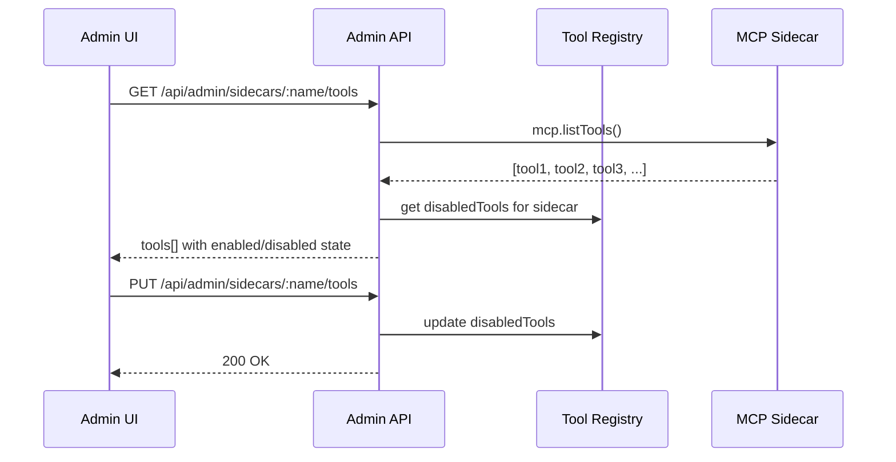

---

## Session & Context Management

As OpenZigs scales to 50+ tools, managing the LLM's context window and conversation state becomes critical.

### The Context Overload Problem

Each tool definition sent to the Copilot SDK consumes **~100-300 tokens** (name, description, JSON schema parameters). With 91 registered tools, tool definitions alone consume **9,000-27,000 tokens** — a significant fraction of the model's context window before any conversation history or system prompt is included.

#### Why Too Many Tools Hurt LLM Performance

| Factor | Impact | Details |
|---|---|---|
| **Context window consumption** | High | Tool schemas compete with conversation history and system prompts for limited context space. GPT-4.1 has 128k tokens; Claude Sonnet has 200k — but tool definitions can consume 10-20% of that budget before any user content. |
| **Provider function limits** | Hard cap | OpenAI supports a maximum of **128 functions** per request. Other providers may impose lower limits. |
| **Hallucination risk** | Medium-High | When presented with dozens of tool schemas, weaker models may "hallucinate" tool calls — invoking tools by name that exist in the schema but with incorrect parameters, or calling tools that were silently dropped from the context. |
| **Response quality degradation** | Medium | More tools = more noise in the system prompt. The model spends attention budget parsing tool schemas instead of focusing on the user's actual request. |
| **Copilot SDK** | No hard limit | The `@github/copilot-sdk` (v0.1.22) imposes **no hardcoded tool count limit** — tools are passed as a plain array to `createSession({ tools })`. The practical limit is the underlying model's context window. |

#### Token Math Example

With 91 registered tools at ~200 tokens each:

```
Tool schemas:        91 × 200 = ~18,200 tokens
System prompt:       ~500 tokens
Conversation history: 20 turns × ~300 = ~6,000 tokens
─────────────────────────────────────────
Total context used:  ~24,700 tokens (before the user's current message)
```

This is manageable for large-context models but becomes a problem when:
- Using models with smaller context windows (e.g., 8k-32k)
- Conversations grow long with tool call results in history
- Multiple tool calls in a single turn each inject result tokens

### Strategy: Tool Limiting & Dynamic Loading

OpenZigs uses a **multi-layered tool management** strategy:

#### Layer 1 — Always-On Tools (`ALWAYS_ON_TOOLS`)

A curated set of **7 critical tools** are **always** included in every LLM request, regardless of the `maxToolsPerRequest` cap. These tools are essential for core agent functionality and must never be silently dropped:

| Tool | Why It's Always-On |
|---|---|
| `read-file` | Core filesystem access for all file-based tasks |
| `list-directory` | Directory navigation — needed for exploration |
| `web-search` | Primary information retrieval capability |
| `browser-navigate` | Chrome automation — critical for browser-based tasks |
| `shell-execute` | Command execution — core agent capability |
| `spawn-agent` | Background task delegation — required for async workflows |
| `orchestrate-agents` | Multi-agent fan-out — required for parallel workflows |

Defined in `src/mcp/constants.ts` as an exported `Set<string>`.

#### Layer 2 — `maxToolsPerRequest` Cap

A configurable hard cap (default: **30**, range: **1-128**) limits the total number of tools sent per LLM request. The tool selection algorithm:

1. Start with all 7 ALWAYS_ON_TOOLS (guaranteed inclusion)
2. Fill remaining slots (`maxToolsPerRequest - 7 = 23` by default) from enabled tools in registration order
3. Tools beyond the cap are silently excluded from that request

This cap is configurable at runtime via the **Admin UI slider** or the **Session Config API** — no server restart required.

#### Layer 2.5 — Per-Entity Tool Scoping (Native SDK)

Individual scheduled jobs, saved prompts, and web chat requests can declare an **explicit tool allowlist** that restricts which tools are available for that specific execution. This supplements the global `maxToolsPerRequest` cap with fine-grained, per-context control.

| Scope | Field | Storage | Effect |
|---|---|---|---|
| **Scheduled Jobs** | `allowedTools: string[]` | SQLite `scheduled_jobs.allowed_tools` (JSON) | Only listed tools + ALWAYS_ON_TOOLS are sent to the LLM when the job fires |
| **Saved Prompts** | `preferredTools: string[]` | SQLite `saved_prompts.preferred_tools` (JSON) | Only listed tools + ALWAYS_ON_TOOLS are available when the prompt is executed |
| **Web Chat Messages** | `tools: string[]` | Transient (Socket.IO payload) | Per-message scoping from the UI — only listed tools + ALWAYS_ON_TOOLS are used |

**How scoping resolves (native SDK):**
1. The caller provides an explicit tool name list (e.g., `["web-search", "linkedin-post"]`).
2. The runtime unions that list with `ALWAYS_ON_TOOLS` (7 tools).
3. The resulting `string[]` is passed to `copilot.chat({ availableTools })` — the SDK handles filtering natively.
4. Disabled tools (from `ToolRegistry`) are excluded via `excludedTools`.

**When no explicit scoping is provided**, the default behavior applies: all enabled tools up to `maxToolsPerRequest`.

**API endpoints:**
- `POST /api/jobs` and `PUT /api/jobs/:id` accept `allowedTools: string[]` (or `null` to clear)
- `POST /api/prompts` and `PUT /api/prompts/:id` accept `preferredTools: string[]` (or `null` to clear)
- Web chat `chat:message` Socket.IO event accepts `tools: string[]`

For the full research RFC on tool selection strategies, see [docs/rfc-tool-selection-strategy.md](rfc-tool-selection-strategy.md).

#### Layer 3 — Intent Classification (future, disabled by default)

1. **Intent Classification**
   - A lightweight pre-pass classifies the user's message into tool categories (`filesystem`, `search`, `social`, `personal`, `data`, `developer`).
   - Only tools from matching categories are sent to the main LLM call.
   - Controlled by `config.session.dynamicToolLoading` (default: `false`).

### Configuration

```json
{
  "session": {
    "historyWindow": 20,
    "maxToolsPerRequest": 30,
    "dynamicToolLoading": false
  }
}
```

| Key | Type | Default | Range | Description |
|---|---|---|---|---|
| `session.historyWindow` | number | `20` | — | Max conversation turns to include in context. |
| `session.maxToolsPerRequest` | number | `30` | 1-128 | Hard cap on tools sent per LLM request. Adjustable at runtime via Admin UI or `PUT /api/admin/session/config`. |
| `session.dynamicToolLoading` | boolean | `false` | — | Enable intent-based tool filtering (Phase 3, not yet implemented). |

#### Runtime Tool Limit API

```bash
# Read current session config (includes tool counts)
curl -H "Authorization: Bearer <token>" http://localhost:3000/api/admin/session/config
# Response: { "maxToolsPerRequest": 30, "totalTools": 91, "alwaysOnCount": 7 }

# Update the tool limit at runtime (takes effect immediately)
curl -X PUT -H "Authorization: Bearer <token>" \
  -H "Content-Type: application/json" \
  -d '{"maxToolsPerRequest": 50}' \
  http://localhost:3000/api/admin/session/config
```

The Admin UI provides a **Tool Limit per Request** slider (1-128) in the Task Engine panel with ±5 increment buttons. Changes persist to `~/.openzigs/config.json` and take effect on the next LLM request without restarting the server.

### Conversation State Architecture

OpenZigs uses **native SDK session management** with long-lived, cached sessions:

1. **SDK Session Cache** — `CopilotWrapperService` maintains a `Map<conversationId, CopilotSession>`. Sessions are reused across messages within the same conversation.
2. **Session Resumption** — On the first message for a conversation, the wrapper attempts `client.resumeSession()` to restore persisted SDK state, falling back to `createSession({ sessionId })` for deterministic IDs.
3. **Infinite Sessions** — When enabled (default), the SDK automatically compacts context at configurable thresholds, preventing context window exhaustion in long conversations.
4. **JSONL Audit Trail** — The Session Manager still appends events to JSONL files for admin views and auditing, but this history is **not** injected into the LLM prompt.
5. **Session Cleanup** — `clearUserSession()` calls `copilot.destroySession()` to free the cached SDK session and reset context.

```mermaid
flowchart TB
    MSG[User Message] --> MR[Message Router]
    MR --> SM[Session Manager<br/>Touch lastActiveAt]
    MR --> CW[Copilot Wrapper<br/>getOrCreateSession]
    CW -->|conversationId| CACHE{Session Cache}
    CACHE -->|Hit| REUSE[Reuse Cached Session]
    CACHE -->|Miss| TRY[resumeSession fallback createSession]
    TRY --> REUSE
    REUSE --> SDK[sendAndWait<br/>personality + message]
    SDK --> RESP[Streamed Response]
    RESP --> SM2[Append to JSONL<br/>Admin/Audit]

    subgraph SDK Session Context
        TOOLS[Enabled Tools<br/>≤ maxToolsPerRequest]
        MULTI[Native Multi-Turn History]
        INF[Infinite Sessions<br/>Auto-Compaction]
    end

    REUSE --> SDK Session Context
```

### Recommendation

For the current Express/Node.js stack:

1. **Keep `infiniteSessions.enabled: true` (default).** The SDK handles context compaction automatically — no manual history window management needed.
2. **`historyWindow: 20` is retained** for the JSONL audit trail and admin session viewer, but no longer affects the LLM context.
3. **`maxToolsPerRequest: 30` is implemented** as a runtime-configurable safety valve. Increase to 50-80 if you need broader tool coverage per request; decrease if you hit context limits or observe hallucinated tool calls.
4. **Monitor tool-related failures.** If the model calls tools that were excluded by the cap, increase the limit or add the tool to `ALWAYS_ON_TOOLS` in `src/mcp/constants.ts`.
5. **Future: vector-based tool retrieval** — embed tool descriptions and retrieve top-K by semantic similarity to the user query. This is the long-term scalable solution. See [Epic #112](https://github.com/mgcronin/openzigs/issues/112).

---

## Interactive Clarifications (`onUserInputRequest`)

The Copilot SDK supports mid-execution user input requests — the LLM can pause and ask the user a question (free-form text or multiple-choice) before continuing. OpenZigs wires this via the `onUserInputRequest` callback.

### How It Works

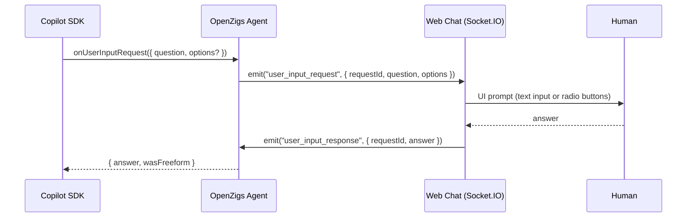

### Channel Behavior

| Channel | Behavior |
|---|---|
| **Web Chat** | Real-time Socket.IO prompt with a 60-second timeout. If the user doesn't respond, an empty answer is returned. |
| **Background Tasks** | Auto-skipped. The handler immediately returns `{ answer: "", wasFreeform: false }` so background agents never block on user input. |
| **Telegram / Discord** | Not yet wired — clarifications are auto-skipped on these channels. |

### Implementation Details

- **Web Chat** (`src/channels/web-chat.ts`): Maintains a `pendingInputRequests` map keyed by `requestId`. When a request arrives, it emits a `user_input_request` Socket.IO event and returns a promise that resolves when the client responds with `user_input_response` or the timeout elapses.
- **Chat View UI** (`ui/components/chat-view.tsx`): Listens for `user_input_request` via Socket.IO and renders an inline `UserInputPrompt` card with choice radio buttons, freeform text input, countdown timeout bar, and state transitions (active → answered / timed-out). Emits `user_input_response` when the user submits an answer.
- **Message Router** (`src/routing/message-router.ts`): Passes the `onUserInputRequest` handler from the web chat channel through to `copilot.chat()`.
- **Task Worker** (`src/tasks/task-worker.ts`): Uses a static auto-skip handler: `async () => ({ answer: "", wasFreeform: false })`.
- **Server** (`src/server.ts`): Wires the web chat's `sendUserInputRequest()` method into the `createRouter()` factory for the web channel, resolving the session's `chatId` from the `SessionManager`.

---

## Human-in-the-Loop Execution (Detailed)

The Human-in-the-Loop (HITL) system is the cornerstone of OpenZigs' "Safe Agent" philosophy. Every destructive or externally-impactful action **must** receive explicit human confirmation before execution.

### Threat Model

| Threat | Mitigation |
|---|---|
| LLM hallucination triggers destructive tool | 🔴 High-risk tools require approval |
| Prompt injection causes data exfiltration | `gmail-send`, `social-post` gated by approval |
| Unintended SQL execution | `db-query` classified as 🔴 high risk |
| Credential exposure via shell | `shell-execute` requires approval + allowlist |
| Mass GitHub operations | `github-create-pr` gated by approval |

### Confirmation Flow (Expanded)

1. **Tool Invocation** — The Copilot SDK calls a tool handler.
2. **Risk Check** — `ToolRegistry` looks up the tool's `riskLevel`.
3. **Gate Decision:**
   - 🟢 **Low** → Execute immediately, log result.
   - 🟡 **Medium** → Execute immediately, log with elevated visibility.
   - 🔴 **High** → **Pause execution.** Create an `ApprovalRequest`.
4. **Multi-Channel Broadcast** — The approval request is sent to all connected channels simultaneously (Web Chat overlay, Telegram inline keyboard, Discord button row).
5. **First-Response-Wins** — The first human to approve or deny across any channel resolves the request.
6. **Execution or Rejection** — The tool either runs and returns results to the LLM, or a denial message is returned.
7. **Audit Trail** — Every decision (approve/deny), the deciding user, timestamp, and channel are logged.

### High-Risk Tool Registry

The following tools **always** require human confirmation:

| Tool | Category | Why It's High Risk |
|---|---|---|
| `write-file` | filesystem | Modifies host filesystem |
| `shell-execute` | shell | Arbitrary command execution |
| `social-post` | social | Public-facing content creation |
| `browser-navigate` | browser | Can execute arbitrary JS |
| `gmail-send` | personal | Sends email on user's behalf |
| `db-query` | data | Arbitrary SQL execution |
| `github-create-pr` | developer | Creates public code changes |

### Admin Override

Admins can reclassify any tool's risk level via the API or Admin UI:

```bash
curl -X POST http://localhost:3000/api/admin/tools/db-query/risk \
  -H "Content-Type: application/json" \
  -d '{"riskLevel": "medium"}'
```

> **Warning:** Downgrading a high-risk tool removes the human confirmation gate. Use with extreme caution.

---

## Recursive Agent Chaining (Task Engine)

OpenZigs supports **Recursive Agent Chaining** — the ability for any agent (triggered by a user message, cron schedule, or another agent) to spawn asynchronous sub-tasks that execute independently, persist state in SQLite, and notify the user upon completion.

### The Problem

Before the Task Engine, chat and cron followed completely separate execution paths:

| Path | Flow | Limitation |
|------|------|------------|
| **Chat** | `Channel → MessageRouter → CopilotWrapper.chat()` | Synchronous, blocks until complete. No background work. |
| **Cron** | `Scheduler.executeJob() → copilot.chat()` | Fire-and-forget. No sub-tasks, no user notification. |

This meant:
- A user couldn't ask "research X in the background" — the chat would hang for minutes.
- A cron job couldn't spawn child tasks (e.g., "every morning, research 3 topics and compile a report").
- If a user closed the browser during a long operation, the result was lost.

### Unified Model: `AgentTask`

Every unit of work is now an `AgentTask`, regardless of origin:

```typescript
type AgentTask = {
  id: string;
  parentTaskId: string | null;       // null = root task
  trigger: "chat" | "cron" | "agent";
  status: "queued" | "running" | "completed" | "failed" | "cancelled";
  goal: string;                      // The instruction/prompt
  context: string;                   // Additional data passed to the sub-agent
  result: string | null;             // Final output
  depth: number;                     // Recursion depth (0 = root)
  error: string | null;
  sessionId: string | null;          // Links to chat session for notifications
  channelType: string | null;        // Where to push completion notifications
  chatId: string | null;             // Target chat for notification delivery
  model: string | null;              // Model override
  notifyOnComplete: boolean;
  tokenUsage: {                      // Accumulated token usage (null if not tracked)
    inputTokens: number;
    outputTokens: number;
    totalTokens: number;
    turns: number;
  } | null;
  createdAt: Date;
  startedAt: Date | null;
  completedAt: Date | null;
  spawnedBy: string | null;          // Job ID or tool call that created this
};
```

- A **chat message** is an `AgentTask(trigger: "chat", mode: "immediate")` — streams inline.
- A **cron job** is an `AgentTask(trigger: "cron", mode: "background")` — enqueued for the worker.
- A **sub-agent** is an `AgentTask(trigger: "agent", parentTaskId: ...)` — spawned by `spawn_agent` tool.

### Architecture

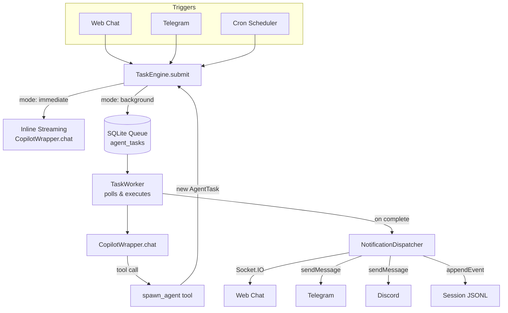

### Component Breakdown

| Component | Location | Responsibility |
|-----------|----------|----------------|
| `AgentTask` type | `src/tasks/types.ts` | Core data model, persisted in SQLite `agent_tasks` table |
| `TaskEngine` | `src/tasks/task-engine.ts` | Accepts submissions, routes immediate vs background, manages lifecycle |
| `TaskWorker` | `src/tasks/task-worker.ts` | Background polling loop, dequeues tasks, calls `CopilotWrapper.chat()` |
| `spawn_agent` tool | `src/mcp/tools/agent-tools.ts` | MCP tool the LLM calls to create child tasks |
| `NotificationDispatcher` | `src/tasks/notification-dispatcher.ts` | Routes completion alerts to the originating channel |
| Task API | `src/api/tasks.ts` | REST endpoints: list, get, cancel, stats |

### Execution Scenarios

| Scenario | What Happens |
|----------|-------------|
| **Normal chat** | `MessageRouter` creates `AgentTask(trigger: "chat", mode: "immediate")` → streams response inline |
| **Chat → background** | LLM calls `spawn_agent` → `AgentTask(trigger: "agent", mode: "background")` → "Task started" returned to chat → worker executes → notification sent |
| **Cron fires** | `Scheduler` creates `AgentTask(trigger: "cron", mode: "background")` → worker executes |
| **Cron → sub-task** | Cron task's LLM calls `spawn_agent` → child `AgentTask` → worker executes child independently |
| **Recursive** | Agent A → `spawn_agent` → Agent B → `spawn_agent` → Agent C (depth limit enforced) |

### `spawn_agent` Tool

The LLM calls this tool to offload work to a background sub-agent:

| Parameter | Type | Required | Description |
|-----------|------|----------|-------------|
| `goal` | string | Yes | The instruction for the sub-agent |
| `context` | string | No | Data to pass to the sub-agent |
| `notify_user` | boolean | No (default: true) | Push notification on completion |
| `model` | string | No | Model override for the sub-agent |

**Behavior in Chat:** Returns `"Background task started: [goal]. You'll be notified when it completes."` — chat continues immediately.

**Behavior in Cron:** Returns `"Sub-task queued: [goal]. Task ID: [id]."` — logged in audit.

**Safeguards:**
- Max recursion depth: 5 levels
- Max children per parent: 10
- Rate limit: 20 spawns/minute/session

### Database Schema

```sql
CREATE TABLE IF NOT EXISTS agent_tasks (
  id TEXT PRIMARY KEY,
  parent_task_id TEXT REFERENCES agent_tasks(id),
  trigger TEXT NOT NULL CHECK(trigger IN ('chat', 'cron', 'agent')),
  status TEXT NOT NULL DEFAULT 'queued'
    CHECK(status IN ('queued', 'running', 'completed', 'failed', 'cancelled')),
  goal TEXT NOT NULL,
  context TEXT NOT NULL DEFAULT '',
  result TEXT,
  error TEXT,
  session_id TEXT,
  channel_type TEXT,
  chat_id TEXT,
  model TEXT,
  notify_on_complete INTEGER NOT NULL DEFAULT 0,
  created_at TEXT NOT NULL,
  started_at TEXT,
  completed_at TEXT,
  spawned_by TEXT,
  depth INTEGER NOT NULL DEFAULT 0,
  token_usage_json TEXT DEFAULT NULL
);

CREATE INDEX IF NOT EXISTS idx_tasks_status ON agent_tasks(status);
CREATE INDEX IF NOT EXISTS idx_tasks_parent ON agent_tasks(parent_task_id);
```

### Task API

| Method | Path | Description |
|--------|------|-------------|
| `GET` | `/api/tasks` | List tasks (filterable by status, trigger, parentTaskId) |
| `GET` | `/api/tasks/:id` | Get task details including child count |
| `POST` | `/api/tasks/:id/cancel` | Cancel a queued or running task |
| `GET` | `/api/tasks/:id/children` | List direct child tasks |
| `GET` | `/api/tasks/stats` | Aggregate counts by status |

#### Scheduler API

| Method | Path | Description |
|--------|------|-------------|
| `GET` | `/api/admin/jobs` | List all scheduled jobs |
| `GET` | `/api/admin/jobs/:id` | Get a single job by ID |
| `POST` | `/api/admin/jobs` | Create a new scheduled job |
| `PUT` | `/api/admin/jobs/:id` | Update job (name, cron, payload, model, allowedTools, autoApproveTools, enabled) |
| `POST` | `/api/admin/jobs/:id/toggle` | Enable or disable a job |
| `DELETE` | `/api/admin/jobs/:id` | Delete a job |
| `POST` | `/api/admin/jobs/:id/run` | Trigger immediate execution (Run Now) |

### Events

**TaskEngine EventEmitter** (internal):

| Event | Payload | Description |
|-------|---------|-------------|
| `task:queued` | `AgentTask` | Task submitted to background queue |
| `task:running` | `AgentTask` | Task dequeued and execution started |
| `task:completed` | `AgentTask` | Task finished successfully |
| `task:failed` | `AgentTask` | Task execution failed |
| `task:cancelled` | `AgentTask` | Task cancelled by user |

**Socket.IO** (client-facing, via `NotificationDispatcher`):

| Event | Payload | Direction |
|-------|---------|-----------|
| `task:notification` | `{ type: "completed" \| "failed", task: AgentTask }` | Server → Client |
| `context:usage` | `TokenUsageEvent` (`{ sessionId, delta: { inputTokens, outputTokens }, cumulative: { inputTokens, outputTokens, totalTokens, turns } }`) | Server → Client |
| `context:compaction` | `CompactionEvent` (`{ sessionId, status: "started" \| "completed" }`) | Server → Client |

### Background Worker Configuration

| Key | Type | Default | Description |
|-----|------|---------|-------------|
| `tasks.maxConcurrent` | number | `2` | Max parallel background tasks. Adjustable at runtime (1–10) via Admin UI or `PUT /api/admin/tasks/config`. |
| `tasks.pollIntervalMs` | number | `2000` | How often the worker checks the queue |
| `tasks.maxRecursionDepth` | number | `5` | Max nesting depth for recursive chaining |
| `tasks.maxChildrenPerTask` | number | `10` | Max sub-tasks a single parent can spawn |

### Orchestration Engine (`orchestrate-agents`)

The `orchestrate-agents` tool implements a **fan-out / fan-in** pattern that dispatches multiple background sub-agents concurrently, waits for all to reach a terminal state, and optionally synthesizes their outputs via a Copilot aggregation call.

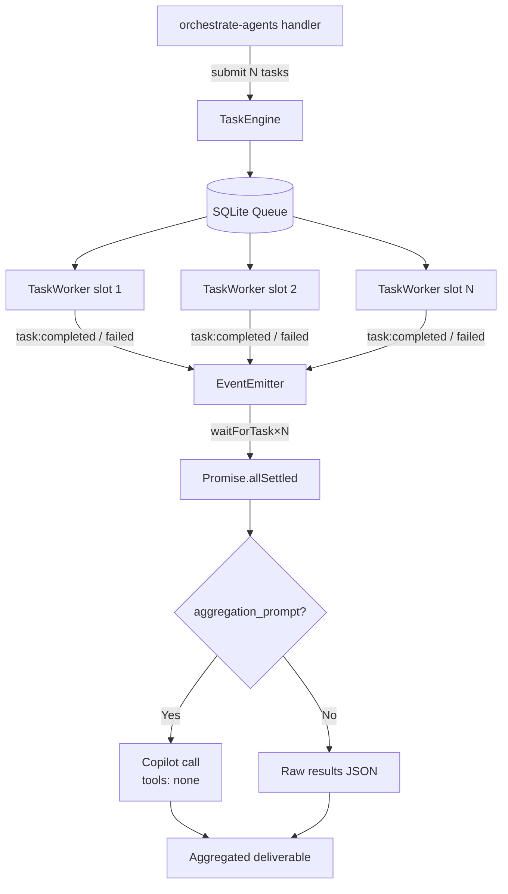

#### How It Works

1. **Fan-Out:** The handler calls `taskEngine.submit()` for each agent definition, creating background `AgentTask` entries with `notifyOnComplete: false` (the orchestrator handles notification). Each agent can specify a `model` override and `auto_approve_tools` list for per-agent control over capability and autonomy.

2. **Fan-In:** For each submitted task, a `waitForTask()` promise attaches listeners to the `TaskEngine` EventEmitter for `task:completed`, `task:failed`, and `task:cancelled`. All promises are awaited via `Promise.allSettled()` — partial failures do not abort the entire orchestration.

3. **Race Condition Guard:** Between submitting a task and attaching the listener, the task may already complete (especially for fast tasks). `waitForTask()` uses a check → listen → re-check pattern to prevent missed events.

4. **Timeout:** An `AbortController` fires after `timeout_seconds`, aborting any outstanding `waitForTask()` promises. Timed-out tasks are reported as failed in the result set.

5. **Aggregation (optional):** If `aggregation_prompt` is provided and at least one agent produced a result, a final Copilot call synthesizes the outputs. This call uses `tools: []` to prevent recursive tool calls.

#### Concurrency Configuration

The maximum number of concurrent background tasks is configurable:

- **Config file:** `config/default.json` → `tasks.maxConcurrent` (default: 2)
- **Runtime API:** `PUT /api/admin/tasks/config` → `{ "maxConcurrent": N }` (range: 1–10)
- **Admin UI:** Task Engine panel with slider + save button

Changes take effect immediately — no server restart required. The `TaskWorker.setMaxConcurrent()` method validates the range and logs the update.

```bash
# Read current concurrency config
curl -H "Authorization: Bearer <token>" http://localhost:3000/api/admin/tasks/config

# Update concurrency at runtime
curl -X PUT -H "Authorization: Bearer <token>" \
  -H "Content-Type: application/json" \
  -d '{"maxConcurrent": 4}' \
  http://localhost:3000/api/admin/tasks/config
```

### Tracking: [Epic #81](https://github.com/mgcronin/openzigs/issues/81)

---

## Native Orchestration — Hierarchical Agents

OpenZigs supports **native hierarchical orchestration** via the Copilot SDK's `customAgents` and `mcpServers` APIs. This provides SDK-level sub-agent delegation and MCP server management without custom subprocess orchestration.

### Custom Agents (`customAgents`)

Custom agents are specialized sub-agents that the primary model can delegate to. They are defined as named archetypes with dedicated system prompts and optional tool scoping.

**Data flow:**

```
config/agents.json (defaults)
        ↓
~/.openzigs/config.json (user overrides, merged by name)
        ↓
CopilotWrapperService constructor (customAgents option)
        ↓
buildSessionConfig() → createSession({ customAgents: [...] })
        ↓
SDK delegates to named agents during chat execution
```

**Merge strategy:** Default archetypes from `config/agents.json` are loaded at startup. User-configured agents in `copilot.customAgents` override defaults when they share the same `name`; remaining defaults are preserved. Per-chat `customAgents` in `ChatOptions` further override at call time.

**Session impact:** Calling `setCustomAgents()` clears all cached SDK sessions (same pattern as `setProvider()`).

### Native MCP Servers (`mcpServers`)

The SDK's built-in `mcpServers` parameter replaces the legacy `LocalMcpServerManager` for connecting to external MCP tool servers. Server definitions are passed directly to `createSession()` — the SDK handles subprocess lifecycle, connection management, and tool discovery.

**Data flow:**

```
~/.openzigs/config.json → copilot.nativeMcpServers
        ↓
CopilotWrapperService constructor (nativeMcpServers option)
        ↓
buildSessionConfig() → createSession({ mcpServers: {...} })
        ↓
SDK manages subprocess/connection lifecycle
```

**Transport types:**
- `stdio` / `local` — Spawns a subprocess, communicates via stdin/stdout
- `http` — Connects to an HTTP-based MCP server
- `sse` — Connects to a Server-Sent Events MCP server

**Migration path:** The `LocalMcpServerManager` class is now deprecated. Existing subprocess-based MCP servers (word, calendar, etc.) should migrate to `copilot.nativeMcpServers` configuration. The Docker-based `DockerSidecarManager` remains separate — it manages containerized sidecars with health checks and port mapping.

### Safe-Swap, Test, and Discovery

Native MCP server writes are protected by a **busy guard** to avoid session/tool churn during active work:

- `PUT/POST/DELETE /api/admin/native-mcp-servers*` returns `409` when `running + queued > 0` from `taskEngine.getStats()`.

Connection validation uses a dedicated test service:

- [src/mcp/native-mcp-test-service.ts](src/mcp/native-mcp-test-service.ts) creates a temporary Copilot client/session with only the candidate server, runs a bounded probe, extracts discovered tool names, and always cleans up resources.
- Discovery/test metadata is cached under `nativeMcpToolCache` and surfaced to Admin UI.

UI wiring:

- Native MCP editor uses a multi-step wizard (type/name → config → test/confirm).
- While busy, add/edit/remove actions are disabled and a warning banner displays running/queued counts.
- Discovered tools are rendered in Tools as dynamic categories: `USER MCP: <SERVER>`.

### Admin API Endpoints

| Method | Path | Description |
|--------|------|-------------|
| `GET` | `/api/admin/agents` | List all custom agents |
| `POST` | `/api/admin/agents` | Add a single agent |
| `PUT` | `/api/admin/agents` | Replace all agents |
| `DELETE` | `/api/admin/agents/:name` | Remove an agent by name |
| `GET` | `/api/admin/native-mcp-servers` | List native MCP servers |
| `PUT` | `/api/admin/native-mcp-servers` | Replace all native MCP servers |
| `POST` | `/api/admin/native-mcp-servers` | Add/update one native MCP server |
| `PUT` | `/api/admin/native-mcp-servers/:name` | Update one native MCP server by name |
| `DELETE` | `/api/admin/native-mcp-servers/:name` | Delete one native MCP server by name |
| `POST` | `/api/admin/native-mcp-servers/test` | Test a candidate native MCP server config |
| `POST` | `/api/admin/native-mcp-servers/:name/reconnect` | Re-test a saved native MCP server |
| `GET` | `/api/admin/native-mcp-servers/tool-cache` | List cached discovery/disconnect metadata |
| `GET` | `/api/admin/tasks/stats` | Task queue/running stats used for busy guard |

### Tracking: [Epic #135](https://github.com/mgcronin/openzigs/issues/135)

---

## AI-Assisted Configuration & Enterprise Webhooks

This section covers the AI-assisted configuration system, enterprise webhooks, dry-run capabilities, and self-aware documentation features added in [Epic #156](https://github.com/mgcronin/openzigs/issues/156).

### Workflow Wizard Architecture

The Workflow Wizard is a conversational assistant that guides users through creating configurations. It bridges the MCP tool layer with the interactive UI:

```
User describes intent in Chat
        ↓
AI activates Wizard persona (config/agents.json → "wizard" agent)
        ↓
Gathers details via conversation (one question at a time)
        ↓
Calls workflow-wizard MCP tool with structured preview
        ↓
Tool invokes CopilotWrapper.onUserInputRequest()
        ↓
WebChatChannel emits "user_input_request" with preview field
        ↓
ChatView renders WorkflowPreviewCard (Confirm / Edit / Test Run)
        ↓
User response flows back through socket → tool returns action string
        ↓
AI persists via create-prompt / schedule-job / etc.
```

**Key components:**

| Component | Path | Purpose |
|-----------|------|---------|
| `WorkflowPreviewCard` | `ui/components/workflow-preview-card.tsx` | Structured preview card with Confirm/Edit/Test Run buttons |
| `workflow-wizard` tool | `src/mcp/tools/wizard-tools.ts` | MCP tool that presents previews via user input mechanism |
| `create-prompt` tool | `src/mcp/tools/system-config-tools.ts` | Safe prompt creation with duplicate-name protection |
| Wizard agent | `config/agents.json` | Persona configuration with scoped tools |
| `WorkflowPreview` type | `src/copilot/copilot-wrapper.ts` + `ui/lib/types.ts` | Shared preview data shape |

### Dry-Run Architecture

Dry-run mode allows previewing job execution without side effects:

```
schedule-job(dry_run: true)  →  Returns preview JSON (no persistence)
test-job(id)                 →  Reads existing job, returns [DRY RUN] preview
POST /api/admin/jobs/:id/run?dry_run=true  →  Returns preview without execution
```

The UI renders dry-run results in an amber-bordered panel below the job card.

### Enterprise Webhooks Architecture

Webhooks enable external systems to trigger OpenZigs actions via authenticated HTTP POST:

```
External System
        ↓
POST /api/webhooks/trigger (Bearer token or HMAC signature)
        ↓
webhook-auth.ts middleware (auth + IP allowlist + rate limit)
        ↓
webhook-routes.ts handler
        ↓
TaskEngine.submit({ trigger: "webhook", goal: resolved })
        ↓
Normal task execution pipeline (approval queue, tool execution, etc.)
```

**Components:**

| Component | Path | Purpose |
|-----------|------|---------|
| `WebhookManager` | `src/webhooks/webhook-manager.ts` | CRUD, API key hashing, rate limiting, signature verification |
| `webhookAuth` | `src/webhooks/webhook-auth.ts` | Express middleware for Bearer/HMAC auth |
| `createWebhookRouter` | `src/webhooks/webhook-routes.ts` | Public trigger endpoint |
| Admin API | `src/api/admin.ts` | CRUD endpoints under `/api/admin/webhooks` |
| Webhooks UI | `ui/app/admin/webhooks/page.tsx` | Admin page for managing webhooks |

**Security model:**
- API keys use `whk_` prefix, stored as SHA-256 hashes
- Timing-safe comparison for both key and signature validation
- Per-webhook rate limits (configurable, default 60 req/min)
- Optional IP allowlisting
- Key rotation without webhook deletion

**Webhook Admin API:**

| Method | Path | Description |
|--------|------|-------------|
| `GET` | `/api/admin/webhooks` | List all webhooks |
| `POST` | `/api/admin/webhooks` | Create a webhook (returns API key once) |
| `POST` | `/api/admin/webhooks/:id/toggle` | Enable/disable |
| `POST` | `/api/admin/webhooks/:id/rotate-key` | Rotate API key |
| `DELETE` | `/api/admin/webhooks/:id` | Delete a webhook |
| `POST` | `/api/webhooks/trigger` | Public trigger endpoint |

### Self-Aware Documentation

The `query-documentation` MCP tool enables the AI to answer questions about OpenZigs itself:

```
User asks "How do tool risk levels work?"
        ↓
AI calls query-documentation(topic: "tool risk levels")
        ↓
Tool scans docs/*.md and config/*.json for matching sections
        ↓
Returns up to 5 relevant sections per file (80 lines max each)
        ↓
AI synthesizes answer citing source documents
```

A `documentation-expert` custom agent (with `infer: true`) can be automatically delegated to when the AI detects questions about the system.

### MCP Tool Catalog Updates

| Tool | Category | Risk | Description |
|------|----------|------|-------------|
| `create-prompt` | productivity | high | Create prompt with duplicate-name protection |
| `workflow-wizard` | productivity | low | Present workflow preview cards to user |
| `test-job` | productivity | medium | Dry-run an existing scheduled job |
| `query-documentation` | productivity | low | Search project documentation by topic |

### Tracking: [Epic #156](https://github.com/mgcronin/openzigs/issues/156)

---

## UX 2.0: Advanced Workflow Builder (Epic #163)

### Recursive Pipeline Schema

Pipelines now support recursive node types via a discriminated union (Zod):

```
PipelineNode = PipelineStage (type: "prompt") | ParallelGroup (type: "parallel")
```

- **PipelineStage** (`type: "prompt"`): A single LLM agent stage with prompt, tool restrictions, model override, timeout, and optional post-action.
- **ParallelGroup** (`type: "parallel"`): Contains `branches: PipelineNode[]` executed concurrently via `Promise.all`.
- **Recursion**: `ParallelGroup.branches` can contain nested `PipelineStage` or further `ParallelGroup` nodes (max depth: 4).
- **Backward Compatibility**: Legacy stages without `type` are auto-detected and normalized via `normalizeLegacyStages()`.

**Execution model in `TaskWorker`:**

```
executePipeline(task)
  → normalize legacy stages
  → for each top-level node (sequential):
      → executeNode(node)
        → if "prompt": executePromptStage() → submit child task, wait
        → if "parallel": executeParallelGroup()
          → Promise.all(branches.map(b => executeNode(b)))
```

| Component | Path | Purpose |
|-----------|------|---------|
| `pipelineNodeSchema` | `src/tasks/pipeline-schema.ts` | Zod schema with `z.lazy()` + `z.discriminatedUnion()` |
| `validatePipeline()` | `src/tasks/pipeline-schema.ts` | Schema validation + depth limit check |
| `flattenPipeline()` | `src/tasks/pipeline-schema.ts` | Flatten recursive tree to ordered stage list |
| `normalizeLegacyStages()` | `src/tasks/pipeline-schema.ts` | Add `type: "prompt"` to legacy stages |
| `executeNode()` | `src/tasks/task-worker.ts` | Recursive node dispatcher |
| `executeParallelGroup()` | `src/tasks/task-worker.ts` | Promise.all branch execution |

### Global Approval Lock Override

Global approval overrides are stored per-tool in `config/tools.json` under `globalApprovalOverrides`. When a tool has a global approval lock:

1. The lock check runs **before** auto-approve evaluation in `createHooksConfig()`.
2. Even if the tool is in the task's `autoApproveTools` list or the interactive auto-approve context, the lock **forces approval queue gating**.
3. This provides admin-level control over dangerous tools that cannot be bypassed by any automation.

```
Priority chain in onPreToolUse:
  1. requiresGlobalApproval(name) → always ask (cannot bypass)
  2. autoApproveTools list → allow (skip approval queue)
  3. requiresApproval(name) [risk-based] → ask/allow
  4. default → allow
```

| Component | Path | Purpose |
|-----------|------|---------|
| `requiresGlobalApproval()` | `src/mcp/tool-registry.ts` | Check global lock state |
| `setGlobalApprovalOverride()` | `src/mcp/tool-registry.ts` | Toggle + persist lock state |
| Lock check in hooks | `src/copilot/hooks.ts` | Priority-1 gate before auto-approve |
| Admin API endpoint | `src/api/admin.ts` | `POST /tools/:name/global-approval` |
| UI toggle | `ui/components/admin/tools-panel.tsx` | Lock/unlock icon button per tool |

### Pipeline Planner Agent

The `PipelinePlanner` class generates multi-stage pipeline definitions from natural language goals using a lightweight LLM call (defaults to `gpt-5-mini`).

```
User describes goal
  → PipelinePlanner.plan(goal, { availableTools })
  → System prompt + goal → LLM call (no tools, structured JSON output)
  → Parse + validate via pipelineNodeSchema
  → Return { pipeline, rationale }
```

| Component | Path | Purpose |
|-----------|------|---------|
| `PipelinePlanner` | `src/tasks/pipeline-planner.ts` | LLM-based pipeline generation |
| Admin API | `src/api/admin.ts` | `POST /pipeline/plan` endpoint |

### Visual Pipeline Editor

The frontend pipeline editor uses **React Flow** (`@xyflow/react`) to render an interactive DAG canvas:

- **Custom node types**: `PromptNode` (green dot, shows prompt preview + tool badges) and `ParallelNode` (dashed blue border, branch count).
- **Bidirectional conversion**: `pipelineToFlow()` converts `PipelineNode[]` → React Flow nodes/edges; `flowToPipeline()` does the reverse via topological sort.
- **Editor sidebar**: Click a node to edit its name, prompt, tools, and timeout.
- **Controls**: "Add Stage" (prompt), "Add Parallel" (group), "Save" buttons.
- **Read-only mode**: Disable editing during pipeline execution.

| Component | Path | Purpose |
|-----------|------|---------|
| `PipelineEditor` | `ui/components/pipeline/pipeline-editor.tsx` | React Flow DAG canvas |
| `WorkflowWizard` | `ui/components/pipeline/workflow-wizard.tsx` | 4-step wizard (goal → plan → edit → confirm) |

### Scheduler Pipeline Integration

The scheduler job form now supports a `pipeline` action type alongside `prompt`, `shell`, and `custom`:

- Selecting "Pipeline" shows the `PipelineEditor` inline in the job form.
- Pipeline stages are stored in `actionPayload.stages` on the scheduled job.
- Validation enforces a minimum of 2 stages before saving.

### Prompt-as-Pipeline (Library-Embedded Stages)

Saved prompts in the Library can now carry optional pipeline stages and preferred tools, making them first-class workflow definitions rather than simple text templates.

**Data model additions to `SavedPrompt`:**

| Field | Type | Storage | Description |
|-------|------|---------|-------------|
| `stages` | `PipelineStage[] | null` | SQLite `saved_prompts.stages` (JSON) | Multi-stage pipeline definition. null = single-stage prompt. |
| `preferredTools` | `string[] | null` | SQLite `saved_prompts.preferred_tools` (JSON) | Tool allowlist for the prompt. null = all enabled tools. |

**Pipeline stages on prompts include all fields from the core `PipelineStage` type:**

- `name`, `prompt`, `tools` (tool allowlist), `autoApproveTools` (bypass approval gating)
- `model` (per-stage model override), `timeoutSeconds`, `postAction` (deterministic post-actions like `create-github-issues`)

**UI integration (Library editor):**

The Library page embeds the `PipelineEditor` and `WorkflowWizard` via a collapsible accordion with progressive disclosure:

1. Collapsed by default for simple prompts — no visual clutter.
2. Auto-expands when editing a prompt that already has stages.
3. Mode chooser: Wizard (AI-generated) or Manual (visual editor).
4. Stage and tool count badges on prompt cards in the list view.

**MCP tool integration:**

The `save-prompt` and `update-prompt` MCP tools accept optional `stages` and `preferredTools` parameters, allowing the AI to create pipeline-enabled prompts programmatically. Zod schemas (`PipelineStageSchema`, `PipelinePostActionSchema`) validate the input.

**Relevant components:**

| Component | Path | Purpose |
|-----------|------|---------|
| `SavedPrompt` type (backend) | `src/productivity/prompt-manager.ts` | Stores stages/preferredTools in SQLite |
| `SavedPrompt` type (frontend) | `ui/lib/types.ts` | Mirrors backend type with `PipelineStage`, `PipelinePostAction` |
| Library page | `ui/app/library/page.tsx` | Embeds PipelineEditor, WorkflowWizard, ToolMultiSelect |
| MCP prompt tools | `src/mcp/tools/prompt-tools.ts` | Zod schemas + handler for stages/preferredTools |
| Pipeline editor | `ui/components/pipeline/pipeline-editor.tsx` | PostActionEditor, autoApproveTools, conversion functions |

### Custom Post-Actions (User-Created Action Types)

Users can create custom post-action types via a dedicated settings page (`/admin/post-actions`) without writing code. This extends the plugin-based PostActionRegistry with user-defined actions.

**Architecture:**

```
CustomPostActionManager (src/tasks/custom-post-actions.ts)
  ├─ Persistence: ~/.openzigs/custom-post-actions.json
  ├─ Template handlers: webhook (HTTP fetch), script (child_process.execFile)
  ├─ Schema builders: convert definitions → ConfigSchema → DynamicConfigForm
  └─ On initialize(): re-registers all saved definitions with PostActionRegistry
```

**Components:**

| Component | Path | Purpose |
|-----------|------|---------|
| `CustomPostActionManager` | `src/tasks/custom-post-actions.ts` | CRUD + persistence + registry integration |
| CRUD API routes | `src/api/admin.ts` | `GET/POST/PUT/DELETE /api/admin/post-actions/custom` (Zod-validated) |
| Settings page | `ui/app/admin/post-actions/page.tsx` | Template + advanced builder UI |
| Post-action registry | `src/tasks/post-action-registry.ts` | Singleton registry (built-in + custom actions) |

**Data flow:** Create via UI → Zod-validated API → `CustomPostActionManager.create()` → persist to disk → `postActionRegistry.register()` → appears in stage editor dropdown.

### Tracking: [Epic #171](https://github.com/mgcronin/openzigs/issues/171)

---

## Template Portability & Sharing (Epic #188)

### Overview

Template Portability enables users to **export** prompt templates (including pipeline stages and post-action configurations) as portable `.openzigs-template.json` files and **import** them into other OpenZigs instances. Environment-specific values (API keys, repo URLs, webhook URLs) are automatically tokenized during export and resolved via a guided placeholder form during import.

### Template File Format

Exported templates use the `openzigs-template-v1` schema:

```json
{
  "$schema": "openzigs-template-v1",
  "version": "1.0.0",
  "exportedAt": "2025-07-15T12:00:00.000Z",
  "exportedFrom": "instance-abc",
  "prompt": {
    "name": "code-review-pipeline",
    "description": "Multi-stage code review workflow",
    "template": "Review code for {{project}}",
    "tags": ["review", "pipeline"],
    "preferredTools": ["read-file", "list-directory"],
    "stages": [
      {
        "name": "analyze",
        "prompt": "Read source files for {{project}}",
        "tools": ["read-file"],
        "postAction": {
          "type": "create-github-issues",
          "config": {
            "owner": "{{stage_0_config.owner}}",
            "repo": "{{stage_0_config.repo}}",
            "labels": ["bug"]
          }
        }
      }
    ]
  },
  "placeholders": [
    {
      "key": "stage_0_config.owner",
      "path": "stages[0].postAction.config.owner",
      "description": "GitHub repository owner for issue creation",
      "type": "string",
      "required": true
    },
    {
      "key": "stage_0_config.repo",
      "path": "stages[0].postAction.config.repo",
      "description": "GitHub repository name for issue creation",
      "type": "string",
      "required": true
    }
  ]
}
```

### Sensitive Field Tokenization

The export process uses a **manifest-based tokenization** approach rather than regex pattern matching. Each registered post-action type declares its sensitive fields via `sensitiveFields` on the `PostActionDefinition`:

```
PostActionDefinition.sensitiveFields: string[]  (dot-notation paths)
```

**Built-in sensitive fields:**

| Post-Action Type | Sensitive Fields |
|---|---|
| `create-github-issues` | `config.owner`, `config.repo` |
| `send-webhook` | `config.url` |

**Tokenization flow during export:**

```
TemplateService.export(promptId)
  → PromptManager.getById(id) → deep clone prompt
  → For each stage with a postAction:
      → Look up PostActionDefinition by action.type
      → For each sensitiveField in definition:
          → Read value at dot-path within action object
          → Replace with {{stage_N_fieldName}} placeholder token
          → Build TemplatePlaceholder manifest entry
  → Return { prompt (tokenized), placeholders[] }
```

Non-sensitive configuration (e.g., `labels`, `minSeverity`, `includeOutput`) is preserved verbatim — only fields explicitly declared as sensitive are tokenized.

### Import Flow

```
Template JSON file
  ↓
POST /api/admin/templates/analyze (pre-validation)
  → Zod schema validation
  → Extract prompt metadata (name, description, stageCount, tags)
  → Return TemplateAnalysis { valid, errors[], prompt, placeholders }
  ↓
UI renders placeholder form (ImportWizard preview step)
  ↓
POST /api/admin/templates/import { template, placeholders }
  → Validate required placeholders are provided
  → JSON.stringify template → replaceAll placeholder tokens → JSON.parse
  → Handle duplicate names ("(imported)" suffix with counter)
  → Add "imported" tag
  → PromptManager.create() → saved to SQLite
  → Return { success: true, prompt }
```

### TemplateService Architecture

| Component | Path | Purpose |
|-----------|------|---------|
| `TemplateExportSchema` | `src/productivity/template-schema.ts` | Zod schema for `.openzigs-template.json` format |
| `TemplateService` | `src/productivity/template-service.ts` | Export, analyze, and import methods |
| `PostActionDefinition.sensitiveFields` | `src/tasks/post-action-registry.ts` | Declares which config fields are environment-specific |
| Export endpoint | `src/api/admin.ts` | `GET /api/admin/prompts/:id/export` |
| Analyze endpoint | `src/api/admin.ts` | `POST /api/admin/templates/analyze` |
| Import endpoint | `src/api/admin.ts` | `POST /api/admin/templates/import` |

### API Endpoints

| Method | Path | Auth | Description |
|--------|------|------|-------------|
| `GET` | `/api/admin/prompts/:id/export` | Admin | Export prompt as downloadable `.openzigs-template.json` |
| `POST` | `/api/admin/templates/analyze` | Admin | Validate and preview a template before importing |
| `POST` | `/api/admin/templates/import` | Admin | Import a template with resolved placeholder values |

### UI Components

| Component | Path | Purpose |
|-----------|------|---------|
| `ImportWizard` | `ui/components/library/import-wizard.tsx` | Multi-step import modal (upload → preview → success) |
| Export button | `ui/app/library/page.tsx` | Per-card download button triggers `/export` endpoint |
| Import button | `ui/app/library/page.tsx` | Header button opens ImportWizard modal |

**Import Wizard steps:**

1. **Upload** — Drag & drop or file browse for `.json` files. Validates JSON parse and calls analyze endpoint.
2. **Preview** — Shows prompt name, description, stage count, tags, and a form for required placeholder values.
3. **Success** — Confirmation with checkmark and prompt name.

### Tracking: [Epic #188](https://github.com/mgcronin/openzigs/issues/188)

## Sentinel — Autonomous System Monitor & SRE Agent (Epic #179 → #194)

### Overview

Sentinel is an autonomous background daemon that continuously monitors the health and performance of the OpenZigs platform. It operates on three axes: **task health review**, **prompt quality auditing**, and **daily digest generation**, with an integrated **SRE alerting** pipeline that supports multi-channel routing.

### Architecture

```
┌──────────────────────────────────────────────────────────────┐
│                       SentinelService                         │
│              (EventEmitter + node-cron v4)                     │
│         timezone, noOverlap, maxRandomDelay                   │
│                                                               │
│  ┌─────────────┐ ┌──────────────┐ ┌────────────────────────┐ │
│  │TaskReviewer  │ │PromptAuditor │ │DigestGenerator         │ │
│  │(sync, local) │ │(async, LLM)  │ │+ PromptRecommendations│ │
│  │              │ │              │ │+ status.md generation  │ │
│  └──────┬───────┘ └──────┬───────┘ └──────────┬─────────────┘ │
│         │                │                     │               │
│  ┌──────┴────────────────┴─────────────────────┴─────────────┐│
│  │                     SREAlerter                             ││
│  │   Socket.IO + ChannelManager (multi-channel routing)      ││
│  │   Configurable cooldowns (critical / warning)             ││
│  └───────────────────────────────────────────────────────────┘│
└──────────────────────────────────────────────────────────────┘
```

### Components

| File | Responsibility |
|---|---|
| `src/sentinel/sentinel-service.ts` | Core daemon. Orchestrates cron schedules with node-cron v4 (`timezone`, `noOverlap`, `maxRandomDelay`). Coordinates sub-components and exposes API. |
| `src/sentinel/task-reviewer.ts` | Synchronous review of recent task outcomes from `TaskRepository`. Calculates success rate, consecutive failures, slow/orphaned tasks, queue depth. |
| `src/sentinel/prompt-auditor.ts` | Samples recent user prompts from session JSONL files and sends them to a lightweight Copilot model for efficiency analysis. Returns per-prompt scores, suggestions, and rewrites. |
| `src/sentinel/digest-generator.ts` | Aggregates task review + prompt audit into `DigestRecord` with per-prompt `PromptRecommendation[]`. Persists to JSONL with configurable retention. Generates human-readable `status.md`. |
| `src/sentinel/sre-alerter.ts` | Multi-channel alert dispatch (`admin` via Socket.IO, external channels via `ChannelManager`). Per-type deduplication with configurable cooldowns. Only critical alerts route to external channels. |
| `src/sentinel/sentinel-state.ts` | Zod schemas, file-based state persistence (`~/.openzigs/sentinel/`), digest JSONL history, `status.md` read/write, digest pruning. |

### Scheduling

- **Task health checks**: Every N minutes (configurable, default 15) with random jitter
- **Daily digest**: Generated at a configurable hour (default 09:00)
- **Prompt audit**: Runs at a configurable hour (default 02:00)
- **Timezone**: All schedules use a configurable IANA timezone (default: UTC)
- **Overlap prevention**: `noOverlap: true` (default) prevents a cron job from firing if the previous execution is still running
- **Native jitter**: `maxRandomDelayMs` provides node-cron v4 native random delay; when 0, falls back to manual jitter via `jitterMinutes`

### Alert Types

| Type | Priority | Trigger |
|---|---|---|
| `consecutive-failures` | Critical | N consecutive task failures (default threshold: 3) |
| `queue-depth` | Warning | Task queue exceeds threshold (default: 10) |
| `orphaned-task` | Warning | Task running > 30 minutes |
| `success-rate-drop` | Critical | Success rate drops below 50% (≥3 resolved tasks) |

### Multi-Channel Alert Routing (#196)

- Alerts are dispatched to channels listed in `notifyChannels` (default: `["admin"]`)
- `"admin"` channel: Socket.IO events to the web dashboard
- External channels (e.g., `"telegram"`, `"discord"`): only receive **critical** alerts via `ChannelManager`
- Cooldowns are configurable: `criticalCooldownMinutes` (default: 5), `warningCooldownMinutes` (default: 30)

### Admin API

| Endpoint | Method | Description |
|---|---|---|
| `/api/admin/sentinel/status` | GET | Current status, config, and timing info |
| `/api/admin/sentinel/config` | PUT | Update sentinel configuration |
| `/api/admin/sentinel/toggle` | POST | Enable/disable sentinel |
| `/api/admin/sentinel/run-now` | POST | Trigger an immediate check cycle |
| `/api/admin/sentinel/digests` | GET | Retrieve digest history |
| `/api/admin/sentinel/digest-markdown` | GET | Download latest `status.md` as Markdown |

### UI

The Sentinel panel appears on the Admin page (`/admin`) under "Sentinel Monitor". It shows:
- **Status badges**: Active/Inactive, total tasks reviewed, alerts sent, consecutive failures
- **Controls**: Enable/disable toggle, "Run Check Now" button
- **Schedule info**: Last check times, next estimated check, interval/jitter/digest/audit hour, timezone, overlap setting, cooldowns, notify channels
- **Digest history**: Expandable list of past daily digests with success rates, per-prompt recommendations (with score badges), and a **Download** button for Markdown export
- **Prompt Improvements**: Expandable per-digest section showing individual prompt scores, suggestions, and suggested rewrites for low-scoring prompts

### Configuration (`config/default.json`)

```json
{
  "sentinel": {
    "enabled": false,
    "model": "gpt-4o-mini",
    "checkIntervalMinutes": 15,
    "jitterMinutes": 15,
    "digestHour": 9,
    "auditHour": 2,
    "consecutiveFailureThreshold": 3,
    "queueDepthThreshold": 10,
    "persistMarkdownDigest": true,
    "markdownDigestPath": null,
    "digestRetentionDays": 30,
    "notifyChannels": ["admin"],
    "criticalCooldownMinutes": 5,
    "warningCooldownMinutes": 30,
    "timezone": "UTC",
    "noOverlap": true,
    "maxRandomDelayMs": 0
  }
}
```

### State Persistence

- **State**: `~/.openzigs/sentinel/state.json` — tracks last check times, counters, enabled status
- **Digest history**: `~/.openzigs/sentinel/digest-history.jsonl` — append-only JSONL of daily digests (auto-pruned per `digestRetentionDays`)
- **Status report**: `~/.openzigs/sentinel/status.md` — human-readable Markdown digest (auto-generated when `persistMarkdownDigest: true`)

### Tracking: [Epic #179](https://github.com/mgcronin/openzigs/issues/179) → [Epic #194](https://github.com/mgcronin/openzigs/issues/194)

---

## Local Knowledge Base — Markdown-First RAG (Epic #215)

The Knowledge subsystem provides a **local-first Retrieval-Augmented Generation (RAG)** pipeline that indexes files from a user-managed directory into an embedded vector database. The AI can then search this knowledge base via the always-on `search-knowledge` MCP tool, grounding responses in the user's own documentation, notes, and code.

### Architecture

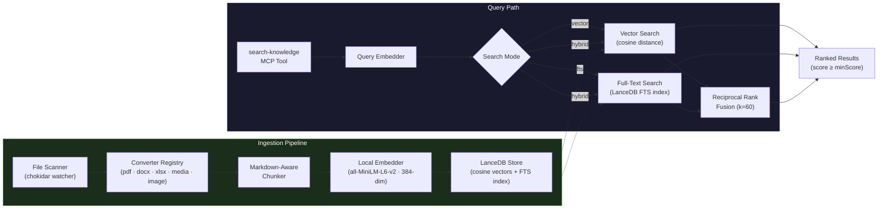

### Component Design

| Component | File | Responsibility |
|---|---|---|
| **Types** | `src/knowledge/types.ts` | `KnowledgeDocument`, `KnowledgeChunk`, `KnowledgeSearchResult`, `KnowledgeConfig`, `KnowledgeSearchMode` types and defaults |
| **Chunker** | `src/knowledge/chunker.ts` | Markdown-aware text splitting: headings → paragraphs → sentences, with configurable chunk size and overlap |
| **Embedder** | `src/knowledge/embedder.ts` | Hugging Face Transformers.js embedding (`Xenova/all-MiniLM-L6-v2`, 384-dim). Lazy-loaded singleton with hash-based fallback. |
| **LanceDB Store** | `src/knowledge/lancedb-store.ts` | Vector database wrapper: upsert chunks, vector search (cosine), full-text search (FTS index), hybrid search (RRF merging), delete by document ID, score threshold filtering |
| **Converter Registry** | `src/knowledge/converters/` | Auto-detects available converters: text, PDF (pdf-parse), DOCX (mammoth), XLSX, image OCR (tesseract.js), media (ffmpeg + whisper-node) |
| **Media Converter** | `src/knowledge/converters/media-converter.ts` | Audio/video transcription via ffmpeg → whisper-node with configurable model (tiny.en through large-v1) |
| **Ingestion Service** | `src/knowledge/knowledge-service.ts` | Central coordinator (`EventEmitter`): directory scanning, file watching (chokidar), SHA-256 change detection, document metadata persistence (JSON file), chunk→embed→store pipeline |
| **API Router** | `src/api/knowledge.ts` | REST endpoints for stats, documents, search, reindex, config (including `searchMode`, `minScore`), delete (mounted at `/api/admin/knowledge`) |
| **MCP Tool** | `src/mcp/tools/knowledge-tools.ts` | `search-knowledge` tool definition — always-on, risk level `low`, supports `mode` parameter (vector/fts/hybrid) |
| **UI Config** | `ui/components/admin/knowledge-config-panel.tsx` | Knowledge config panel: directory, watch toggle, Whisper model, search mode, min score threshold slider |

### Search Modes

The knowledge base supports three search strategies, configurable globally via `searchMode` in `KnowledgeConfig` or per-query via the `mode` parameter on `search-knowledge`:

| Mode | Strategy | Best For |
|---|---|---|
| **`hybrid`** (default) | Runs both vector and FTS searches in parallel, merges results via Reciprocal Rank Fusion (RRF, k=60). Results appearing in both lists get a score boost. | General queries — combines semantic understanding with exact keyword matching |
| **`vector`** | Pure cosine similarity against the embedding model | Conceptual/semantic queries ("how does authentication work?") |
| **`fts`** | LanceDB native full-text search index with stemming and stop-word removal | Exact keyword queries ("CORS headers", specific function names) |

**Hybrid search algorithm:**
1. Execute vector search and FTS search in parallel (3× the requested limit for candidate pool)
2. Assign each result a Reciprocal Rank score: `1 / (k + rank + 1)` where `k = 60`
3. Results appearing in both lists have their scores summed (boosted)
4. Final list is sorted by combined score, normalized to 0–1, and truncated to the requested limit
5. Results below `minScore` threshold are filtered out

### Score Threshold Filtering

All search modes support a `minScore` threshold (default: 0.25, range: 0–1). Results with a similarity/relevance score below this threshold are excluded. Set to 0 to return all results regardless of relevance. Configurable via the Admin UI slider or `PUT /api/admin/knowledge/config`.

### Embedding Strategy

The embedder uses **Hugging Face Transformers.js** with the `Xenova/all-MiniLM-L6-v2` model (~23MB ONNX):

- **384-dimensional** dense embeddings via a sentence transformer
- **Lazy-loaded singleton** — model downloads on first use, cached for subsequent calls
- **Hash-based fallback** — if the model fails to load, falls back to a deterministic FNV-1a hash + n-gram embedding (zero external dependencies, lower quality)
- **Batch embedding** — supports bulk embedding via `generateEmbeddings()` for efficient document ingestion

### FTS Index

LanceDB's built-in full-text search index is created on the `text` column with:
- **Stemming** enabled — matches morphological variants (e.g., "running" matches "run")
- **Stop-word removal** — filters common words for better precision
- **Positional indexing** — supports phrase queries
- The FTS index is rebuilt after each `addChunks()` call via `replace: true`

### Document Metadata Persistence

Document tracking metadata (file paths, content hashes, indexing status) is persisted to `~/.openzigs/knowledge-db/documents.json` using atomic write-to-temp-then-rename. This prevents full re-indexing on server restart — only new or changed files are processed.

### Change Detection

Files are tracked by a deterministic document ID (SHA-256 of the relative path). On each scan:

1. File content is hashed (SHA-256)
2. If the hash matches the stored hash → skip (no re-index)
3. If changed → delete old chunks, re-chunk, re-embed, store
4. If file deleted → remove chunks from the vector store

### Media Transcription (Whisper)

Audio and video files are transcribed via the `media-converter`:

1. **ffmpeg** extracts audio as 16kHz mono WAV
2. **whisper-node** (whisper.cpp) transcribes using the configured model
3. Output is wrapped in Markdown with `## Transcript` heading

The `resolveModelName()` function handles model name normalization:
- `"large-v3"` → `"large"` (whisper.cpp compatibility)
- `"large"` → symlinked to `ggml-large-v1.bin` when available
- Models: `tiny.en`, `base.en`, `small.en`, `medium.en`, `large-v1`, `large`

### Configuration

| Key | Type | Default | Description |
|---|---|---|---|
| `knowledge.enabled` | boolean | `true` | Enable/disable the knowledge subsystem |
| `knowledge.directory` | string | `~/.openzigs/knowledge` | Directory to watch for knowledge files |
| `knowledge.chunkSize` | number | `1000` | Maximum chunk size in characters |
| `knowledge.chunkOverlap` | number | `200` | Overlap between consecutive chunks |
| `knowledge.maxResults` | number | `10` | Default search result limit |
| `knowledge.watchEnabled` | boolean | `true` | Enable real-time file watching |
| `knowledge.mediaModel` | string | `"base.en"` | Whisper model for audio/video transcription |
| `knowledge.minScore` | number | `0.25` | Minimum similarity score threshold (0–1) |
| `knowledge.searchMode` | string | `"hybrid"` | Default search mode: `"vector"`, `"fts"`, or `"hybrid"` |

### Integration Points

- **Server startup** (`src/server.ts`): `KnowledgeIngestionService` is instantiated and started in background after the HTTP server binds
- **Graceful shutdown**: Service `stop()` is called in the shutdown handler alongside other subsystems
- **Socket.IO events**: 7 knowledge events (`document:indexed`, `document:failed`, `document:deleted`, `indexing:started`, `indexing:completed`, `watcher:ready`, `watcher:error`) are forwarded to connected clients
- **MCP registration**: `search-knowledge` is registered with `knowledgeService` reference; added to `ALWAYS_ON_TOOLS` so it's available in every conversation
- **Tool category**: New `"knowledge"` category in `ToolCategory` union type

### Data Storage

- **Knowledge directory**: `~/.openzigs/knowledge/` (user-managed files)
- **LanceDB database**: `~/.openzigs/knowledge-db/` (vector + FTS indexes, auto-created)
- **Document metadata**: `~/.openzigs/knowledge-db/documents.json` (persisted across restarts)
- **Table**: `knowledge_chunks` (columns: `id`, `documentId`, `text`, `sectionHeading`, `sourcePath`, `chunkIndex`, `vector`)

### Tracking: [Epic #215](https://github.com/mgcronin/openzigs/issues/215)

---

## Secret Vault & Browser Hardening

### Overview

The Zero-Trust Secret Vault provides AES-256-GCM encrypted local credential storage with a reference-token architecture that prevents plaintext secrets from entering any observable system surface (chat history, audit logs, Socket.IO, session files).

### Components

| Component | Path | Purpose |
|---|---|---|
| `SecretVaultService` | `src/vault/secret-vault-service.ts` | Core encryption/decryption, CRUD, PBKDF2 key derivation |
| `vault-types.ts` | `src/vault/vault-types.ts` | Shared types, `SECRET_TOKEN_PATTERN` regex, `buildSecretToken()` |
| `secret-tools.ts` | `src/mcp/tools/secret-tools.ts` | `get-secret` and `list-secrets` MCP tools |
| `vault.ts` | `src/api/vault.ts` | Admin API routes (init, unlock, lock, CRUD) |
| `vault-panel.tsx` | `ui/components/admin/vault-panel.tsx` | React admin panel (unlock, add/delete secrets) |
| `stealth.ts` | `src/browser/stealth.ts` | Anti-bot CDP injection scripts |
| `browser-navigate.ts` | `src/mcp/tools/browser-navigate.ts` | Modified to resolve `{{SECRET:uuid}}` tokens + inject stealth |

### Reference Token Flow

```
User: "Log into GitHub"
  ↓
AI calls get-secret(label="GitHub") → returns {{SECRET:abc-123}}
  ↓
AI calls browser-navigate(action="type", text="{{SECRET:abc-123}}")
  ↓
Hooks log: text="{{SECRET:abc-123}}"  ← safe, opaque token
  ↓
browser-navigate handler resolves token → "ghp_actual_secret"
  ↓
CDP Input.dispatchKeyEvent per character  ← plaintext only here
```

### Encryption

- **Algorithm**: AES-256-GCM
- **Key derivation**: PBKDF2 with SHA-512, 100,000 iterations, 32-byte key
- **Salt**: 32 random bytes per vault creation / password change
- **IV**: 16 random bytes per write operation
- **File format**: JSON with `{ version, salt, iv, tag, data }` (all hex-encoded)
- **File permissions**: `0o600` (owner read/write only)
- **Location**: `~/.openzigs/vault.enc`

### Browser Stealth

Two layers of anti-bot evasion work together to defeat reCAPTCHA Enterprise, Cloudflare, and similar bot-detection systems:

**Chrome Launch Flags** (applied at process spawn):
- `--disable-blink-features=AutomationControlled` — prevents `navigator.webdriver` being set at the C++ level
- `--disable-infobars` — hides the "controlled by automated test software" banner
- `--disable-features=EnableAutomation` — removes the `enable-automation` switch
- `--window-size=1440,900` — realistic viewport so `outerWidth`/`outerHeight` aren't zero

**CDP Script Injection** (17 scripts via `Page.addScriptToEvaluateOnNewDocument` on every `navigate` action):
- `navigator.webdriver` → `false` (JS-level belt-and-suspenders)
- `chrome.runtime` / `chrome.app` / `chrome.csi` / `chrome.loadTimes` shims
- Realistic `navigator.plugins`, `navigator.languages`, `navigator.connection`
- `navigator.hardwareConcurrency` and `navigator.deviceMemory` normalisation
- WebGL1 + WebGL2 vendor/renderer spoofing (including `WEBGL_debug_renderer_info`)
- Permissions API notifications bypass
- Canvas fingerprint noise injection (imperceptible ±1 pixel variation)
- AudioContext fingerprint noise injection
- ChromeDriver marker removal (`cdc_`, `$cdc_`, `__webdriver_evaluate`, etc.)
- `window.outerHeight` / `window.outerWidth` normalisation
- `Error.prepareStackTrace` patching to hide CDP sourceURL markers
- iframe `contentWindow` detection prevention
- Concealed `//# sourceURL` pointing to a generic Chrome extension path

### Chrome Profile

Changed from temporary `/tmp/openzigs-chrome-profile` to persistent `~/.openzigs/chrome-profile/` to preserve cookies, localStorage, and session state across server restarts.

### Configuration

```json
{
  "vault": {
    "enabled": true,
    "vaultPath": "~/.openzigs/vault.enc"
  }
}
```

### Tracking: [Epic #216](https://github.com/mgcronin/openzigs/issues/216)

---

## Presenter Mode (Interactive Playback, Blackboard & Quizzes)

Issue: [Epic #275](https://github.com/mgcronin/openzigs/issues/275)

Presenter Mode transforms rendered Director Mode videos into interactive learning experiences. After a video is rendered, it is auto-indexed into a presentation catalog. Users can play presentations with AI-powered Q&A, pop quizzes, and live blackboard overlays.

### Architecture

```
┌─────────────────────────────────────────────────────────────────┐
│  UI (Next.js)                                                   │
│  ┌─────────────┐  ┌──────────────┐  ┌───────────────────────┐  │
│  │ Catalog Page │  │ Player Page  │  │ Recap Screen          │  │
│  │ /presenter   │  │ /presenter/  │  │ Score ring + PDF      │  │
│  │              │  │   [id]       │  │ download (jsPDF)      │  │
│  └──────┬───────┘  └──────┬───────┘  └───────────────────────┘  │
│         │                 │                                      │
│         ▼                 ▼                                      │
│  ┌─────────────────────────────────────────────────────────────┐│
│  │ usePresenterState (FSM via useReducer)                      ││
│  │ States: PLAYING → PAUSED_USER_Q → PAUSED_AI_QUIZ → RECAP   ││
│  └──────────────────────────┬──────────────────────────────────┘│
│                             │ Socket.IO (presenter:ask/answer)  │
└─────────────────────────────┼───────────────────────────────────┘
                              ▼
┌─────────────────────────────────────────────────────────────────┐
│  Backend (Express + Socket.IO)                                  │
│  ┌──────────────┐  ┌───────────────┐  ┌──────────────────────┐ │
│  │ REST Router   │  │ Teacher Agent │  │ Quiz Generator       │ │
│  │ /api/         │  │ RAG Q&A via   │  │ Chapter-level MCQ    │ │
│  │ presentations │  │ CopilotWrapper│  │ generation + caching │ │
│  └──────┬────────┘  └───────────────┘  └──────────────────────┘ │
│         │                                                       │
│         ▼                                                       │
│  ┌─────────────────────────────────────────────────────────────┐│
│  │ PresentationRepository (SQLite)                             ││
│  │ Tables: presentations, quiz_cache                           ││
│  └─────────────────────────────────────────────────────────────┘│
│                                                                 │
│  ┌─────────────────────────────────────────────────────────────┐│
│  │ Post-Render Hook (render:complete event)                    ││
│  │ Auto-indexes: detectChapters → generateThumbnail → insert   ││
│  └─────────────────────────────────────────────────────────────┘│
└─────────────────────────────────────────────────────────────────┘
```

### Key Modules

| Module | Path | Purpose |
|---|---|---|
| PresentationRepository | `src/presenter/presentation-repository.ts` | SQLite CRUD for presentations + quiz_cache |
| ChapterDetector | `src/presenter/chapter-detector.ts` | Parse Director Manifest → Chapter[] |
| ThumbnailGenerator | `src/presenter/thumbnail-generator.ts` | ffmpeg frame extraction |
| TeacherAgent | `src/presenter/teacher-agent.ts` | RAG Q&A powered by CopilotWrapper |
| QuizGenerator | `src/presenter/quiz-generator.ts` | MCQ generation per chapter |
| Presenter Router | `src/api/presenter.ts` | REST API for catalog + Q&A + quiz |

### FSM States

1. **PLAYING** — Video playing normally. Raise Hand button visible.
2. **PAUSED_USER_Q** — User raised hand. Blackboard overlay with streaming answer (Mermaid diagrams supported).
3. **PAUSED_AI_QUIZ** — Pop quiz overlay with multiple choice + explanation.
4. **RECAP** — Session complete. Score ring, quiz results, Q&A transcript, PDF download.

### Socket.IO Events

| Event | Direction | Purpose |
|---|---|---|
| `presenter:ask` | client → server | Submit Q&A question with chapter context |
| `presenter:answer:start` | server → client | Signal answer streaming has begun |
| `presenter:answer:token` | server → client | Individual token for streaming display |
| `presenter:answer:done` | server → client | Answer complete |
| `presenter:answer:error` | server → client | Error during answer generation |

### Tracking: [Epic #275](https://github.com/mgcronin/openzigs/issues/275)

---

## Multiplayer Presenter Mode — P2P Watch Party & Guest Invite

Issue: [Epic #282](https://github.com/mgcronin/openzigs/issues/282)

Multiplayer extends Presenter Mode into a real-time collaborative watch party using Socket.IO rooms, JWT-based guest invites, and a PeerJS WebRTC audio mesh.

### Architecture

```
┌───────────────────────────────────────────────────────────────────┐
│  UI (Next.js)                                                     │
│  ┌──────────────┐  ┌──────────────┐  ┌────────────────────────┐  │
│  │ Invite Page   │  │ Room Page    │  │ Push-to-Talk Button    │  │
│  │ /invite/[tok] │  │ /room/[id]   │  │ (hold / click-toggle)  │  │
│  └──────┬────────┘  └──────┬───────┘  └────────────────────────┘  │
│         │                  │                                       │
│         ▼                  ▼                                       │
│  ┌────────────────────────────────────────────────────────────┐   │
│  │ useRoomSync (Socket.IO room protocol)                      │   │
│  │ useVoiceRoom (PeerJS mesh + mic + MediaRecorder)           │   │
│  └────────────────────────┬───────────────────────────────────┘   │
└───────────────────────────┼───────────────────────────────────────┘
                            │ Socket.IO + PeerJS WebSocket
                            ▼
┌───────────────────────────────────────────────────────────────────┐
│  Backend (Express + Socket.IO)                                    │
│  ┌──────────────┐  ┌───────────────┐  ┌───────────────────────┐  │
│  │ RoomManager   │  │ PeerJS Server │  │ Invite JWT (jose)     │  │
│  │ (in-memory    │  │ ExpressPeer   │  │ HS256, 24h expiry     │  │
│  │  room state)  │  │ Server        │  │ cookie-based RBAC     │  │
│  └──────┬────────┘  └───────────────┘  └───────────────────────┘  │
│         │                                                         │
│         ▼                                                         │
│  Socket.IO rooms: room:join, host:play/pause/seek,                │
│  room:audio_chunk (binary), room:transcription_preview            │
└───────────────────────────────────────────────────────────────────┘
```

### Key Modules

| Module | Path | Purpose |
|---|---|---|
| RoomManager | `src/presenter/room-manager.ts` | In-memory room state: members, host tracking, playback position, peer IDs, socket-to-room reverse index |
| Invite endpoint | `src/api/presenter.ts` | `POST /:id/invite` — generates HS256 JWT with 24h TTL |
| Invite redeem | `src/server.ts` | `GET /api/invite/redeem` — verifies JWT, sets HttpOnly cookies |
| PeerJS signaling | `src/server.ts` | `ExpressPeerServer` embedded at `/peerjs` (key: `openzigs`) |
| Guest RBAC | `ui/middleware.ts` | Next.js middleware verifying `guest_token` cookie, restricting routes |
| useRoomSync | `ui/hooks/useRoomSync.ts` | Socket.IO room join/leave, playback sync with 1.5s drift threshold |
| useVoiceRoom | `ui/hooks/useVoiceRoom.ts` | PeerJS client, full-mesh audio calls, Push-to-Talk MediaRecorder, hand raise |
| PushToTalkButton | `ui/components/presenter/push-to-talk-button.tsx` | Floating PTT UI with hold/click modes, transcription preview |

### PeerJS Integration

The PeerJS signaling server is mounted on the same Express HTTP server:

```typescript
const peerServer = ExpressPeerServer(httpServer, {
  path: "/peerjs",
  key: "openzigs",
  proxied: true,
});
app.use(peerServer);
```

- HTTP API: `/peerjs/openzigs/id`, `/peerjs/openzigs/peers`
- WebSocket upgrade: filtered by path prefix `/peerjs` in the `httpServer.on("upgrade")` handler to avoid conflicts with Socket.IO upgrades
- Client connects with matching `path` and `key`, then announces its peer ID via `room:announce_peer`

### Socket.IO Room Events

| Event | Direction | Purpose |
|---|---|---|
| `room:join` | C→S | Join room, RoomManager tracks member |
| `room:leave` | C→S | Leave room, cleanup |
| `room:announce_peer` | C→S | Register PeerJS peer ID with room |
| `room:peers_updated` | S→C | Broadcast updated peer ID list |
| `host:play` / `host:pause` / `host:seek` | C→S | Host-only playback control |
| `room:playback_sync` | S→C | Broadcast playback state to all room members |
| `room:audio_chunk` | C→S | Binary audio for STT (≤2MB, rate-limited) |
| `room:transcription_preview` | S→C | Live transcription text with speaker name |

### Tracking: [Epic #282](https://github.com/mgcronin/openzigs/issues/282)

---

## Social Brain — Unified Social Inbox, CRM & AI Automation (Epic #291)

The Social Brain subsystem provides a unified DM/comment ingestion pipeline, AI-powered auto-reply engine, contact CRM, human handoff management, and comment-to-DM automation — all wired together via EventEmitter patterns and exposed through a dedicated REST API and UI page.

### Architecture

```
┌───────────────┐     ┌───────────────────┐     ┌──────────────────┐
│  Platform      │────▶│  Ingestion        │────▶│  Social Brain    │
│  Webhooks/     │     │  Service          │     │  (RAG + LLM)     │
│  Polling       │     │  (EventEmitter)   │     │  (EventEmitter)  │
│  (IG, FB, TW,  │     │  + Platform       │     └──────────────────┘
│   YT, LI, RD)  │     │    Adapters       │            │       │
└───────────────┘     └───────────────────┘            │       ▼
                              │                        │  ┌──────────────┐
                              │                        │  │  Handoff     │
                              ▼                        │  │  Manager     │
                      ┌──────────────────┐             │  │  (threads)   │
                      │  Comment Rule    │             │  └──────────────┘
                      │  Engine          │             │
                      │  (keyword/regex) │             ▼
                      └──────────────────┘       ┌──────────────────┐
                              │                  │  Social          │
                              ▼                  │  Repository      │
                      ┌──────────────────┐       │  (SQLite CRM)    │
                      │  DM Dispatcher   │       └──────────────────┘
                      │  + Auto-Tagging  │
                      └──────────────────┘
```

### Multi-Platform Ingestion

The ingestion layer uses a **platform adapter pattern** to normalize incoming events from different platforms into a unified `IncomingSocialMessage` format:

| Adapter | Platform | Transport | Events Handled |
|---|---|---|---|
| `InstagramAdapter` | Instagram | Webhook (Meta) | DMs via messaging webhook |
| `FacebookAdapter` | Facebook | Webhook (Meta) | Page messaging + feed comments |
| `TwitterAdapter` | Twitter/X | Webhook | DM events + reply tweets |
| `LinkedInAdapter` | LinkedIn | Webhook | MESSAGING + COMMENT event types |
| `GenericPollAdapter` | YouTube, Reddit | Polling | Periodic fetch of new comments/messages |

Platform connections are configured in `config/default.json` under `socialBrain.connections` with `mode: "webhook"` or `mode: "polling"` and platform-specific polling intervals.

### Platform API Clients

Each platform has a dedicated `PlatformApiClient` implementation for fetching post context (used by the Social Brain's RAG pipeline):

| Client | Platform | API |
|---|---|---|
| `InstagramApiClient` | Instagram | Meta Graph API |
| `FacebookApiClient` | Facebook | Meta Graph API v24.0 |
| `TwitterApiClient` | Twitter/X | Twitter API v2 |
| `YouTubeApiClient` | YouTube | YouTube Data API v3 |
| `LinkedInApiClient` | LinkedIn | LinkedIn API v2 |

All clients implement the `PlatformApiClient` interface with `fetchPostContext()` and are registered with `PostContextService` when their respective environment variables are set.

### DM Dispatcher

The `DmDispatcher` class (`src/channels/social/dm-dispatcher.ts`) provides factory methods for sending DMs and replying to comments across all platforms, routing through the appropriate native MCP server. Each platform uses different parameter names; `_buildDmArgs()` and `_buildReplyArgs()` handle the translation automatically.

| Platform | DM Tool | DM Recipient Param | Comment Reply Tool |
|---|---|---|---|
| Instagram | `send_dm` | `recipient_id` | `reply_to_comment` |
| Facebook | `fb_send_message` | `recipient_id` | `fb_reply_to_comment` |
| Twitter/X | `twitter_send_dm` | `participant_id` | `twitter_post_tweet` (with `reply_to`) |
| YouTube | — (no DM API) | — | `yt_reply_to_comment` (with `parent_id`) |
| LinkedIn | `linkedin_send_message` | `recipient_urn` | `linkedin_reply_to_comment` (needs `post_urn`) |
| Reddit | `reddit_send_message` | `recipient` | `reddit_reply_to_comment` (with `thing_id`) |

The dispatcher is wired into the `CommentRuleEngine` via `setSendDm()` and `setReplyToComment()` callbacks. For LinkedIn comment replies, the parent `postId` is passed through from the `IncomingComment` to provide the required `post_urn`.

### Module Structure (`src/channels/social/`)

| Module | Purpose |
|---|---|
| `types.ts` | Shared types: `SocialPlatform`, `Contact`, `SocialMessage`, `IncomingSocialMessage`, `IncomingComment`, `CommentRule`, `AutomationLogEntry`, `BrainResult`, `EscalationContext`, `SocialBrainConfig` |
| `social-repository.ts` | SQLite CRM — 4 tables (`contacts`, `social_messages`, `comment_automation_rules`, `comment_automation_log`). Pagination, tag management, CSV export, stats. 19 unit tests. |
| `social-ingestion.ts` | `SocialIngestionService` (EventEmitter) — platform adapter pattern: `handleWebhook()`, `processMessage()`, `startPolling()`/`stopPolling()`. Ships with `InstagramAdapter`, `FacebookAdapter`, `TwitterAdapter`, `LinkedInAdapter`, and `GenericPollAdapter` (for YouTube/Reddit). |
| `platform-api-client.ts` | `PlatformApiClient` interface + `PostContextService` + per-platform API clients (Instagram, Facebook, Twitter, YouTube, LinkedIn). Each implements `fetchPostContext()` for RAG enrichment. |
| `dm-dispatcher.ts` | `DmDispatcher` — multi-platform DM sender and comment replier. Factory methods `createDmSender()` and `createCommentReplier()` route through native MCP servers via `LocalMcpServerManager.callTool()`. |
| `social-brain.ts` | `SocialBrain` (EventEmitter) — RAG pipeline: handoff check → `knowledgeService.search(query, 5, { mode: "hybrid" })` → conversation history (last 5) → `copilot.chat()` with `{ mode: "replace" }` system prompt → JSON parse → confidence routing. Emits `reply`, `escalate`, `escalated_message`. |
| `handoff-manager.ts` | `HandoffManager` (EventEmitter) — `HandoffChannel` interface with `createThread`/`postToThread`/`archiveThread`. Escalate, forward messages, handle admin replies via thread→contact reverse map, close handoffs. Emits `handoff:created`, `handoff:resolved`. |
| `comment-rule-engine.ts` | `CommentRuleEngine` (EventEmitter) — Keyword matching (word-boundary regex), regex fallback, template interpolation (`{{username}}`, `{{keyword}}`, `{{post_id}}`, `{{comment_text}}`), DM delay scheduling, auto-tagging, per-user rate limiting. Wired to `DmDispatcher` for cross-platform DM/reply delivery. Emits `rule:triggered`. |

### Event Flow (Server Wiring)

```
Ingestion "message" ──────▶ Brain.process()
                                │
                                ├─ confidence ≥ threshold ──▶ emit "reply" ──▶ Socket.IO "social:reply"
                                │       (configurable: "high" | "medium" | "low")
                                └─ confidence < threshold ──▶ emit "escalate" ──▶ Handoff.escalate()
                                                                               │
                                                                               ├─ emit "handoff:created"
                                                                               └─ Socket.IO "social:handoff:created"

Ingestion "comment" ──────▶ CommentRuleEngine.evaluate()
                                │
                                └─ match ──▶ executeRule() ──▶ emit "rule:triggered"
                                                                  │
                                                                  └─ Socket.IO "social:rule:triggered"

Brain "escalated_message" ──▶ Handoff.forwardToThread()
```

### Database Tables (SQLite)

| Table | Key Columns |
|---|---|
| `contacts` | `id`, `platform`, `platform_user_id`, `username`, `display_name`, `tags` (JSON), `notes`, `handoff_status`, `first_seen_at`, `last_seen_at` |
| `social_messages` | `id`, `contact_id` (FK), `platform`, `direction`, `content`, `message_type`, `status`, `metadata` (JSON), `created_at` |
| `comment_automation_rules` | `id`, `name`, `platform`, `enabled`, `keywords` (JSON), `regex`, `dm_template`, `dm_delay_seconds`, `max_triggers_per_user`, `auto_tag`, `trigger_count` |
| `comment_automation_log` | `id`, `rule_id` (FK), `contact_id` (FK), `comment_text`, `action_taken`, `dm_sent`, `created_at` |

### API Router (`/api/social`)

| Method | Path | Description |
|---|---|---|
| `GET` | `/stats` | Dashboard stats (contacts, messages, handoffs, automation triggers, connections) |
| `GET` | `/contacts` | Paginated contact list with search, platform, and tag filters |
| `GET` | `/contacts/export` | CSV export of all contacts |
| `GET/PATCH` | `/contacts/:id` | Get or update a contact |
| `POST` | `/contacts/:id/tags` | Add a tag to a contact |
| `DELETE` | `/contacts/:id/tags/:tag` | Remove a tag |
| `GET` | `/contacts/:id/messages` | Message history for a contact |
| `GET` | `/activity` | Recent messages across all contacts |
| `GET/POST` | `/rules` | List or create automation rules |
| `GET/PATCH/DELETE` | `/rules/:id` | Get, update, or delete a rule |
| `GET` | `/rules/log` | Automation trigger log |
| `POST` | `/handoff/:contactId/close` | Close an active human handoff |
| `GET` | `/webhooks/:platform` | Meta webhook verification |
| `POST` | `/webhooks/:platform` | Incoming platform webhook events |
| `GET` | `/connections` | List connected platform statuses |

### MCP Tools (`src/mcp/tools/social-brain-tools.ts`)

| Tool | Risk | Description |
|---|---|---|
| `social-crm-lookup` | 🟢 low | Search CRM contacts by query, platform, or tags |
| `social-crm-history` | 🟢 low | Get message history for a contact |
| `social-crm-tag` | 🟢 low | Add or remove a tag on a CRM contact |
| `social-close-handoff` | 🟡 medium | Close an active human handoff |
| `social-brain-stats` | 🟢 low | Get Social Brain dashboard statistics |

### UI (`/social`)

4-tab page: Dashboard (stat cards + connections), CRM (paginated table + detail drawer), Automations (rules CRUD + log), Activity (message feed). React Query hooks in `ui/lib/hooks/use-social.ts`.

### Tracking: [Epic #291](https://github.com/mgcronin/openzigs/issues/291)

---

## Director Mode Studio & Advanced Compositing (Epic #313)

Transforms Director Mode from a linear production wizard into an **interactive Studio** with a multi-track timeline editor, real-time `@remotion/player` preview, per-scene regeneration, and advanced compositing features including Flux img2img enhancement, text overlays, intro/outro cards, and a blog-to-YouTube conversion pipeline.

### Architectural Directives

| Directive | Rationale |
|-----------|-----------|
| **Text overlays are React components in Remotion, NOT baked into Flux images** | Flux is strictly for pixel/aesthetic generation (txt2img, img2img). Text rendering must be crisp, editable, and resolution-independent via React/CSS. |
| **TTS pacing uses `[PAUSE: Xs]` bracket syntax, NOT SSML angle brackets** | `ScriptSanitizer` strips all `<...>` tags via `HTML_TAG_RE`. Bracket syntax survives sanitization and is translated to engine-specific SSML/silence padding *after* sanitization. |
| **Drafts are the central persistence unit** | Pipeline flow: Wizard → Draft → Studio → Render. All state flows through the `DirectorManifest` persisted in `director_drafts`. |

### Draft Persistence (`director_drafts` SQLite Table)

A new SQLite table stores draft manifests, enabling the Studio to load, edit, and re-render without re-running the full production pipeline:

```sql
CREATE TABLE IF NOT EXISTS director_drafts (
  id          TEXT PRIMARY KEY,
  title       TEXT NOT NULL,
  manifest    TEXT NOT NULL,   -- JSON serialized DirectorManifest
  thumbnail   TEXT,            -- path to thumbnail image
  status      TEXT NOT NULL DEFAULT 'draft'
                CHECK(status IN ('draft','rendering','rendered','failed')),
  created_at  TEXT NOT NULL,
  updated_at  TEXT NOT NULL
);
```

New API endpoints on the Director router (`src/api/director.ts`):

| Method | Path | Description |
|--------|------|-------------|
| `POST` | `/api/admin/director/drafts` | Create a draft from a manifest |
| `GET` | `/api/admin/director/drafts` | List all drafts (paginated) |
| `GET` | `/api/admin/director/drafts/:id` | Get draft with full manifest |
| `PUT` | `/api/admin/director/drafts/:id` | Update manifest (partial or full) |
| `DELETE` | `/api/admin/director/drafts/:id` | Delete a draft |
| `POST` | `/api/admin/director/drafts/:id/render` | Submit draft for render |
| `GET` | `/api/admin/director/drafts/:id/renders` | List render history for a draft (enriched with live job status) |

### Render History (`director_renders` SQLite Table)

Tracks every render submitted from the Studio, linked to its parent draft:

```sql
CREATE TABLE IF NOT EXISTS director_renders (
  id          TEXT PRIMARY KEY,
  draft_id    TEXT NOT NULL REFERENCES director_drafts(id) ON DELETE CASCADE,
  job_id      TEXT NOT NULL,
  quality     TEXT NOT NULL DEFAULT 'preview',
  status      TEXT NOT NULL DEFAULT 'queued',
  output_path TEXT,
  error       TEXT,
  created_at  TEXT NOT NULL,
  updated_at  TEXT NOT NULL
);
```

The `POST /render` endpoint accepts an optional `draftId` — when provided, a row is inserted into `director_renders` linking the render job to the draft. The `GET /drafts/:id/renders` endpoint returns all renders for a draft, enriched with live job progress from the `renderOrchestrator`.

### Timeline Studio UI (#314)

A new route at `/director/studio/[id]` replaces the linear wizard for post-production editing. The Studio loads a draft from SQLite and renders an interactive editor with:

- **`@remotion/player` Preview Panel** — Live React preview of the current manifest state using `<Player component={TemplateComposition} inputProps={...} />`. Seek, play/pause, and frame-level scrubbing.
- **Multi-Track Timeline** — Visual representation of the `DirectorManifest.timeline` array. Tracks: Video/Image (primary), Audio (music + voiceover layers), Overlays (text, lower thirds). Drag handles for duration/position, click-to-select for inspector binding.
- **Per-Scene Inspector** — Right sidebar panel. When a timeline entry is selected, shows editable properties: narration text (re-triggers TTS on save), visual description (re-triggers image gen), transition type dropdown, Ken Burns params, overlay config.
- **Per-Scene Regeneration** — "Regenerate" button on each scene triggers a targeted `ImageGenService.generate()` or `VoiceService.synthesize()` call for that scene only, updating the manifest in-place.

### Bring Your Own Assets (BYOA) (#315)

Extends the Studio with user-uploaded media ingestion:

- **Upload Endpoint** — `POST /api/admin/director/assets/upload` (multer, max 200MB). Stores to `~/.openzigs/director/uploads/byoa/<nanoid>_<filename>`.
- **Ingestion Pipeline** — On upload: ffprobe for duration/dimensions, ffmpeg thumbnail extraction, auto-detect type (video/image/audio). Returns `ByoaAsset` metadata.
- **Studio Integration** — Uploaded assets appear in a "My Assets" panel within the Studio. Drag-to-timeline adds a new `VideoClipEntry` or `ImageSceneEntry` from the uploaded file.

### Intro/Outro Cards (#316)

New `intro_card` and `outro_card` timeline entry types with animated React compositions:

```typescript
interface IntroCardEntry {
  type: "intro_card";
  title: string;
  subtitle?: string;
  animation: "fade" | "slide-up" | "typewriter" | "zoom";
  duration: number;         // frames
  backgroundStyle: "gradient" | "solid" | "image";
  backgroundColor?: string;
  backgroundImage?: string; // optional img2img enhanced source
  enhanceWithImg2Img?: boolean;
}
```

Remotion components: `IntroCard.tsx`, `OutroCard.tsx` — pure React with CSS animations via Remotion `interpolate()` and `spring()`. When `enhanceWithImg2Img` is true, the background image is piped through the Flux img2img pipeline for aesthetic enhancement before render.

### PowerPoint-Style Text Overlays (#317)

New `text_overlay` timeline entry for positioned, styled text rendered as React components in Remotion:

```typescript
interface TextOverlayEntry {
  type: "text_overlay";
  text: string;
  startAtFrame: number;
  duration: number;
  position: { x: number; y: number };
  style: {
    fontSize: number;
    fontFamily: string;
    color: string;
    backgroundColor?: string;
    padding?: number;
    borderRadius?: number;
    textAlign?: "left" | "center" | "right";
  };
  animation: "none" | "fade-in" | "slide-left" | "slide-up" | "typewriter" | "pop";
}
```

Remotion component: `TextOverlay.tsx` — renders a `<div>` with inline styles, animated via `interpolate()` / `spring()`. The Studio Inspector provides a WYSIWYG-style editor panel for text overlay properties. Text is **never** sent to Flux — it is rendered purely as a React component at the Remotion composition level.

### Flux img2img Enhancement Pipeline (#318)

Adds image-to-image enhancement via `FluxImg2ImgPipeline` (already available in `diffusers==0.32.2`):

**Python sidecar** — New endpoint on `sidecars/image-gen/server.py`:

```
POST /img2img
  body: { prompt, image_path, strength, num_inference_steps, guidance_scale, seed, width, height }
  response: { image_path, seed }
```

Pipeline: Load source image → `FluxImg2ImgPipeline(prompt, image, strength=0.6, guidance_scale=0.0, num_inference_steps=4)` → save enhanced image.

**Node service** — `ImageGenService` gains an `enhance(sourcePath, prompt, options)` method that POSTs to the sidecar `/img2img` endpoint. Used by intro/outro card background enhancement and future per-scene "enhance" actions in the Studio.

### Blog-to-YouTube Conversion Pipeline (#319)

New pipeline mode converting blog posts/articles into narrated video:

1. **Ingest** — `extractBlog()` (in `blog-extractor.ts`) fetches URL with SSRF protection (blocked hosts, private IP detection). Extracts: title, body text, metadata, images via HTML parsing (regex-based, no external HTML parser dependency).
2. **Scene Plan** — Maps each section to a scene. Inline images become `image_scene` entries; text-only sections get AI-generated images via `ImageGenService`.
3. **Narration** — Section body text → `ScriptSanitizer` → `VoiceService.synthesize()` per scene.
4. **Manifest Build** — Auto-generates `DirectorManifest` with intro card (blog title), `image_scene` entries per section, transitions, text overlay for section headings, and outro card.
5. **Studio Handoff** — Saves as a draft → opens Studio for refinement before render.

New MCP tool: `blog-to-video` (🔴 high risk) — accepts `{ url?: string, file?: string, style?: string }`.

### Script Pacing & TTS Bracket Syntax (#320)

Extends the narration pipeline with pacing control:

**Bracket Syntax:**
- `[PAUSE: 2s]` — Insert 2 seconds of silence
- `[PAUSE: 500ms]` — Insert 500ms of silence
- `[EMPHASIS]...[/EMPHASIS]` — TTS emphasis (maps to SSML `<emphasis>`)

**Pipeline:**

```
Raw narration text
  → ScriptSanitizer (strips HTML <...> tags, brackets survive)
  → PacingParser.parse(cleanedText)
    → Extract bracket tokens → PacingDirective[]
    → Return { segments: (TextSegment | PauseSegment | EmphasisSegment)[] }
  → PacingResolver.resolve(segments, engine)
    → For Google TTS: convert to SSML (<break time="2s"/>, <emphasis>)
                       switch from { input: { text } } to { input: { ssml } }
    → For Kokoro/SoVITS: insert silence WAV padding at specified durations
  → Synthesized audio with pacing applied
```

New module: `src/voice/pacing-translator.ts` (combines parsing and engine-specific resolution).

### Sub-Issues

| Issue | Title | Dependencies |
|-------|-------|-------------|
| #314 | Timeline Studio UI with @remotion/player Preview | Draft persistence |
| #315 | Bring Your Own Assets (BYOA) with Ingestion Pipeline | None |
| #316 | Intro/Outro Cards with Animated React Components | #318 (img2img for enhance toggle) |
| #317 | PowerPoint-Style Text Overlays as React Components | None |
| #318 | Flux img2img Enhancement Pipeline | None |
| #319 | Blog-to-YouTube Conversion Pipeline | #314, #318, #320 |
| #320 | Script Pacing & TTS Bracket Syntax | None |
| #321 | Shorts Maker Pipeline (Long-form to 9:16) | #314, #318 (opt.), #320 |
| #322 | AI Clickbait Thumbnail Generator | #318 |

### Shorts Maker Pipeline (#321)

Converts horizontal long-form video into a 30–60 second YouTube Short (9:16) with new voiceover:

- **Dense Ingestion** — `scene-detector.ts` `extractIntervalFrames()` with `minInterval: 1` (1 frame/sec) vs default `5`. New `mode?: "standard" | "dense"` option on `IngestionOptions`.
- **Viral Clip Extraction** — New `src/video/shorts/viral-clip-extractor.ts`: LLM receives dense keyframe thumbnails + Whisper transcript, selects the most engaging 30–60s contiguous segment. Returns `{ startSeconds, endSeconds, rationale, suggestedHook }`.
- **Voice Dubbing** — New `src/video/shorts/shorts-voice-pipeline.ts`: LLM writes a punchy script, routed through `ScriptSanitizer` → `PacingParser` → `VoiceService.synthesize()`. Original audio ducked to ~10%.
- **Vertical Formatting** — Forces `ContentCreator` template (already 1080×1920 at `src/remotion/index.tsx:52-55`). Auto-applies `SmartCaptions` overlay with `style: "karaoke"`.
- **Smart Framing** — `OffthreadVideo` with `objectFit: 'cover'` and `objectPosition: '${xOffset}% center'` for horizontal crop control. New `horizontalCropOffset` field on `VideoClipEntry`. Studio Inspector gets a "Framing" panel with X-offset slider.
- **MCP Tool** — `create-short` (🔴 high risk): `{ source, style?, target_duration?, voice_profile? }`.
- **New files**: `src/video/shorts/viral-clip-extractor.ts`, `shorts-voice-pipeline.ts`, `shorts-pipeline.ts`, `src/mcp/tools/shorts-tools.ts`, `ui/components/director/studio/framing-panel.tsx`

### AI Clickbait Thumbnail Generator (#322)

Generates stylized YouTube thumbnails for rendered videos:

- **Frame Selection** — New `src/video/thumbnails/frame-selector.ts`: LLM receives keyframe thumbnails + manifest metadata, selects the most visually striking frame. Returns `{ framePath, timestamp, suggestedText[], textPlacement, textColor }`.
- **Flux img2img Stylization** — Selected frame → `ImageGenService.enhance()` with `strength: 0.7` and YouTube thumbnail style prompt (heavy saturation, high contrast, vibrant colors).
- **Text Compositing** — New `src/video/thumbnails/thumbnail-compositor.ts`: `@napi-rs/canvas` renders bold text with stroke/shadow on the stylized background. Text is **never** sent to Flux — only React/canvas for crisp, controllable text.
- **Output** — Saved as `thumbnail.jpg` alongside `output.mp4` in `~/.openzigs/video-output/<draft-id>/`.
- **API** — `POST /api/admin/director/drafts/:id/thumbnail` with optional `{ style?, textOverride? }`.
- **Studio UI** — "Generate Thumbnail" button in toolbar, preview panel with editable text fields and regeneration.
- **New dependency**: `@napi-rs/canvas` (headless canvas, native, no system deps).

### Implementation Order

1. **#320** — Script Pacing (standalone, enables all TTS improvements)
2. **#318** — Flux img2img (standalone, enables enhance features)
3. **#317** — Text Overlays (standalone Remotion component work)
4. **#316** — Intro/Outro Cards (uses img2img from #318)
5. **#322** — AI Clickbait Thumbnails (uses img2img from #318, standalone otherwise)
6. **#314** — Timeline Studio UI (largest, draft persistence + full UI)
7. **#315** — BYOA (extends Studio with uploads)
8. **#321** — Shorts Maker (requires Studio for framing, plus pacing + img2img)
9. **#319** — Blog-to-YouTube (integrates everything)

### File Change Summary

**New files (~24):**
- `ui/app/director/studio/[id]/page.tsx` — Studio route
- `ui/components/director/studio/timeline-tracks.tsx` — Multi-track timeline
- `ui/components/director/studio/scene-inspector.tsx` — Property editor
- `ui/components/director/studio/player-preview.tsx` — @remotion/player wrapper
- `ui/components/director/studio/studio-layout.tsx` — Studio page layout (sidebar + preview + timeline)
- `ui/components/director/studio/studio-toolbar.tsx` — Toolbar with render/thumbnail actions
- `ui/components/director/studio/framing-panel.tsx` — Horizontal crop offset slider (Shorts)
- `ui/components/director/studio/thumbnail-panel.tsx` — Thumbnail preview + generate
- `src/remotion/components/intro-card.tsx` — Animated intro composition
- `src/remotion/components/outro-card.tsx` — Animated outro composition
- `src/remotion/components/text-overlay-layer.tsx` — Positioned text composition
- `src/video/blog/blog-extractor.ts` — Blog content extractor with SSRF protection
- `src/video/blog/blog-to-video-pipeline.ts` — End-to-end blog conversion
- `src/voice/pacing-translator.ts` — Bracket syntax parsing + engine-specific resolution (Google SSML, local silence padding)
- `src/productivity/database.ts` — `director_drafts` table migration (draft CRUD in director API routes)
- `src/mcp/tools/blog-tools.ts` — blog-to-video MCP tool
- `src/video/shorts/viral-clip-extractor.ts` — LLM viral segment identification
- `src/video/shorts/shorts-voice-pipeline.ts` — Script generation + TTS + ducking
- `src/video/shorts/shorts-pipeline.ts` — End-to-end Shorts orchestrator
- `src/mcp/tools/shorts-tools.ts` — create-short MCP tool
- `src/video/thumbnails/frame-selector.ts` — LLM frame selection
- `src/video/thumbnails/thumbnail-compositor.ts` — Canvas text compositing

**Modified files (~21):**
- `src/video/manifest/manifest-types.ts` — New entry types + `horizontalCropOffset`
- `src/video/manifest/manifest-schema.ts` — Extended Zod schemas
- `src/remotion/adapter.ts` — Map new entry types to input props
- `src/remotion/input-props.ts` — New prop schemas + `horizontalCropOffset`
- `src/remotion/compositions/template-composition.tsx` — Dispatch new components
- `src/remotion/components/video-clip-segment.tsx` — Apply `objectPosition` from crop offset
- `src/remotion/index.tsx` — Register new compositions
- `src/api/director.ts` — Draft CRUD + upload + shorts + thumbnail routes
- `src/video/generators/image-gen-service.ts` — `enhance()` method
- `sidecars/image-gen/server.py` — `/img2img` endpoint
- `src/voice/voice-service.ts` — SSML support, pacing integration
- `src/video/generators/storyboard-engine.ts` — Card/overlay scene types
- `src/video/ingestion/index.ts` — `mode?: "standard" | "dense"` option
- `src/productivity/database.ts` — `director_drafts` table migration
- `src/server.ts` — Draft repository initialization
- `ui/lib/types.ts` — Studio + draft types
- `ui/app/director/page.tsx` — Wizard → draft flow
- `ui/components/director/studio/scene-inspector.tsx` — Framing panel for 9:16 clips
- `ui/components/director/studio/studio-toolbar.tsx` — Thumbnail generate button

### Tracking: [Epic #313](https://github.com/mgcronin/openzigs/issues/313)
