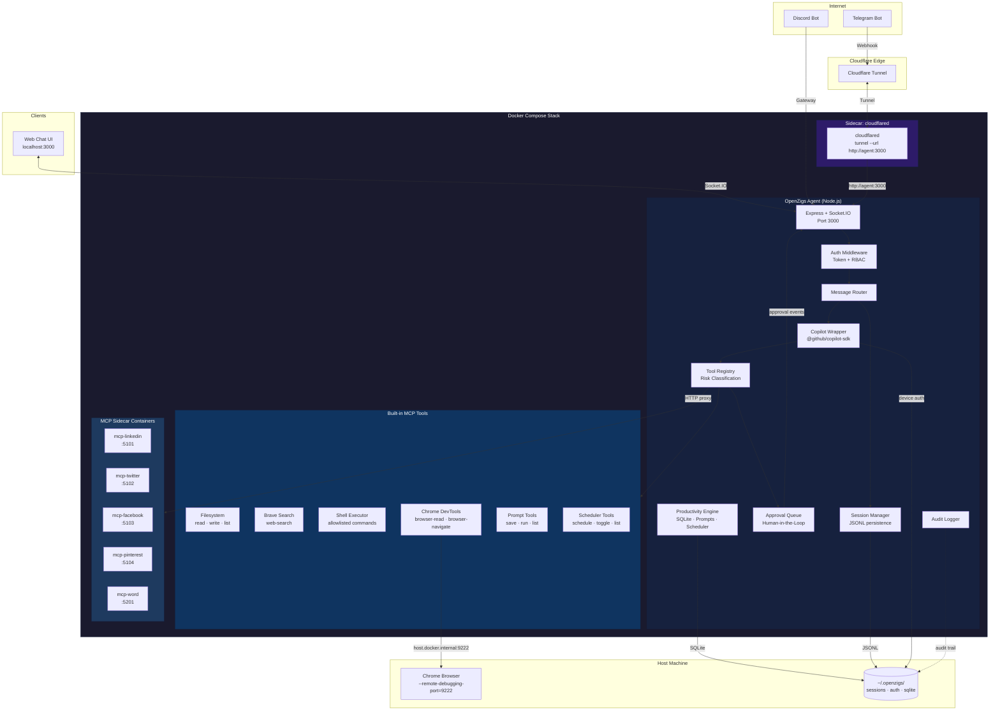
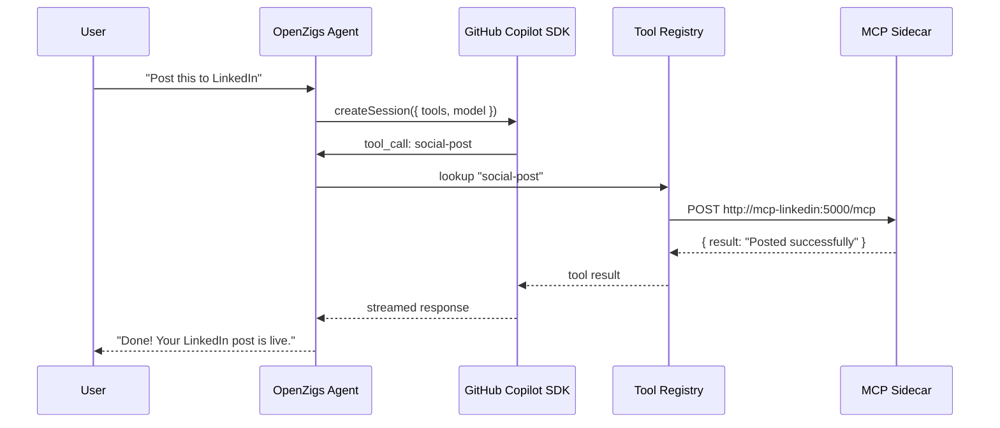
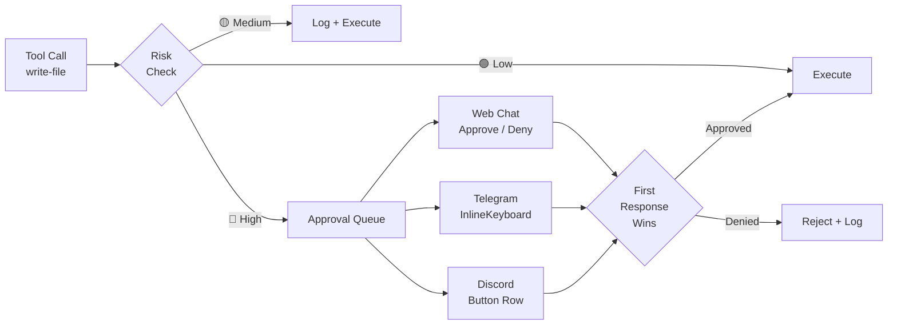
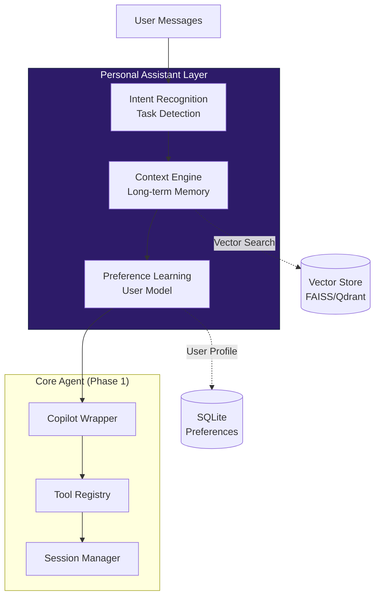
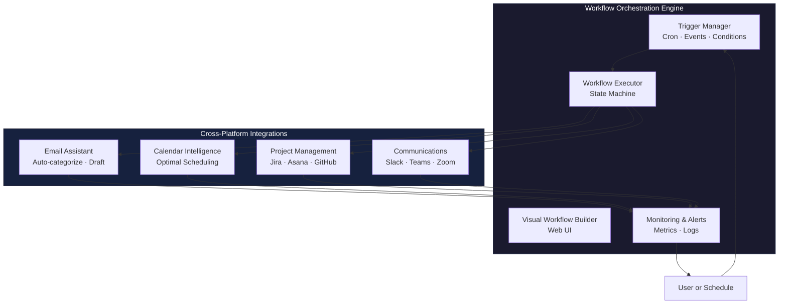
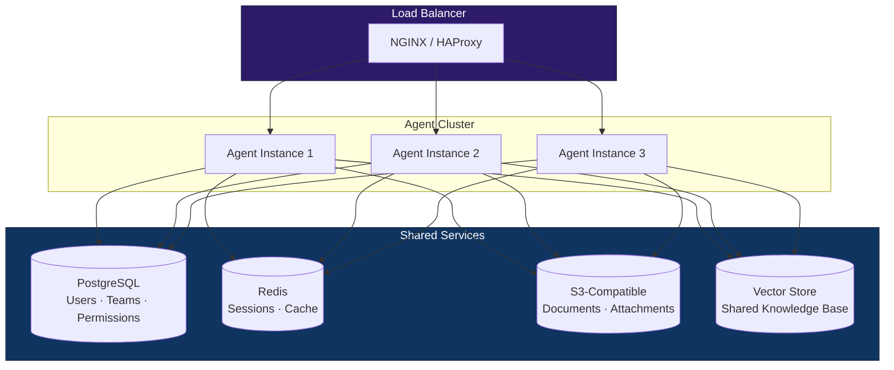

# Architecture

## Vision: Personal Assistant Platform

OpenZigs is evolving from a **secure AI agent platform** into a **comprehensive Personal Assistant** that combines the power of the [GitHub Copilot SDK](https://github.com/github/copilot-sdk) with advanced document intelligence, proactive task management, and seamless productivity automation.

### Evolution Path

| Phase | Status | Description |
|---|---|---|
| **Phase 1: Core Agent Infrastructure** | ✅ Complete | Secure, containerized AI agent with tool execution and human-in-the-loop controls |
| **Phase 2: Personal Assistant Core** | 🚧 Q2 2026 | Contextual memory, proactive task detection, preference learning |
| **Phase 3: Document Intelligence** | 📋 Q3 2026 | Multi-format reading/writing, OCR, semantic search, knowledge base |
| **Phase 4: Productivity Automation** | 📋 Q4 2026 | Workflow orchestration, email/calendar automation, cross-platform integrations |

See [ROADMAP.md](ROADMAP.md) for the complete evolution plan.

## High-Level Overview

OpenZigs is a **local-first AI agent platform** built on top of the [GitHub Copilot SDK](https://github.com/github/copilot-sdk). It follows a "Safe Agent" philosophy:

1. **Containerized Isolation** — The agent and its MCP sidecars run inside Docker containers via Docker Compose, limiting blast radius.
2. **Permissioned MCP Tools** — Every tool the agent can call is registered, risk-classified, and individually toggleable.
3. **Human-in-the-Loop Approvals** — High-risk actions (file writes, shell commands) pause execution until a human approves via the Web Chat or a messaging channel.
4. **MCP Host Architecture** — OpenZigs acts as an **MCP Host**, orchestrating external MCP servers (social media, document intelligence, Pinterest) that run as Docker sidecars alongside the core Node.js agent.

The result is a "God Mode" AI assistant that **can** do anything, but only after you say it **should**.

---

## System Diagram



---

## Cloudflare Tunnel (Sidecar Pattern)

The Cloudflare Tunnel has moved to a **sidecar architecture**. Instead of the Node.js app spawning and managing a `cloudflared` process internally, the tunnel runs as an independent Docker Compose service:

```yaml
# docker-compose.yml (excerpt)
tunnel:
  image: cloudflare/cloudflared:2024.6.1
  container_name: openzigs-tunnel
  command: tunnel --no-autoupdate --url http://agent:3000
  depends_on:
    agent:
      condition: service_healthy
```

**Key points:**

- **`cloudflared` is NOT managed by Node.js.** It runs as a separate container alongside the agent.
- The tunnel proxies all inbound traffic from Cloudflare's edge to `http://agent:3000` using Docker's internal network.
- The internal tunnel module (`src/tunnel/cloudflare-tunnel.ts`) should be **disabled** in `config/default.json` when using the sidecar:

  ```json
  {
    "tunnel": {
      "enabled": false
    }
  }
  ```

- For Telegram webhooks, set the `webhookUrl` to your Cloudflare-routed domain (e.g., `https://agent.yourdomain.com/telegram/webhook`).

**Traffic flow:**

```
Internet → Cloudflare Edge → cloudflared sidecar → http://agent:3000 (Docker network)
```

---

## MCP Host Architecture

OpenZigs acts as an **MCP Host** — it orchestrates multiple external MCP servers to extend its capabilities beyond built-in tools.

### How It Works

1. **User sends a message** via Web Chat, Telegram, or Discord.
2. **Message Router** resolves the session and forwards the prompt to the **Copilot Wrapper**.
3. **Copilot Wrapper** calls `@github/copilot-sdk`'s `createSession()` with all enabled tools wrapped via `defineTool()`.
4. **GitHub Copilot** (the intelligence layer) decides which tools to invoke based on the user's intent.
5. **Tool execution returns to OpenZigs**, which dispatches to either a built-in handler or an HTTP proxy call to an MCP sidecar container.
6. **MCP sidecar** processes the request (e.g., posts to LinkedIn, creates a Pinterest pin) and returns the result.
7. **Result flows back** through the Copilot SDK to the user as a streamed response.



### Sidecar Registration

MCP sidecars are **NOT** registered with the Copilot CLI directly. Instead:

1. Each sidecar's tools are defined as `ToolDefinition` objects in TypeScript (e.g., `src/mcp/tools/social-media-tools.ts`).
2. At startup, `registerMcpTools()` in `src/mcp/server.ts` registers all tool definitions with the `ToolRegistry`.
3. The `CopilotWrapperService` wraps each enabled tool via the SDK's `defineTool()` function and passes them to `createSession({ tools })`.
4. When the SDK invokes a sidecar-backed tool, the handler makes an HTTP `POST` to the sidecar's URL (e.g., `http://localhost:5101/mcp`).

The user does not need to manually register tools with any CLI. OpenZigs handles all registration automatically.

### Current MCP Sidecars

| Service | Container | Port | Platform | Category |
|---|---|---|---|---|
| `mcp-linkedin` | `openzigs-mcp-linkedin` | 5101 | LinkedIn | social |
| `mcp-twitter` | `openzigs-mcp-twitter` | 5102 | Twitter/X | social |
| `mcp-facebook` | `openzigs-mcp-facebook` | 5103 | Facebook | social |
| `mcp-pinterest` | `openzigs-mcp-pinterest` | 5104 | Pinterest | social |
| `mcp-word` | `openzigs-mcp-word` | 5201 | Office Word | documents |

---

## Component Breakdown

### Copilot Wrapper (`src/copilot/copilot-wrapper.ts`)

Wraps `@github/copilot-sdk`'s `CopilotClient`. Responsibilities:

| Capability | Method | Description |
|---|---|---|
| **Device Auth** | `authenticate()` / `waitForAuth()` | OAuth device-flow for GitHub Copilot access. Persists token to `~/.openzigs/auth.json` with `0600` permissions. |
| **Streaming Chat** | `chat(message, tools?, model?)` | Returns an `AsyncGenerator<string>` that yields deltas as they arrive from the SDK. Tools are wrapped via `defineTool()` and passed to `createSession({ tools })`. |
| **Model Selection** | `listModels()` | Proxies `client.listModels()` to enumerate available models (e.g., `gpt-4.1`, `claude-sonnet-4`). |
| **Tool Dispatch** | Internal | When the SDK invokes a tool, the handler calls the `ToolDefinition.handler()` — which may proxy to an MCP sidecar or execute locally. |
| **Retry Logic** | Internal | Automatic retries with exponential backoff for rate-limit (429) and timeout errors. Clears auth on 401. |

### Tool Registry (`src/mcp/tool-registry.ts`)

Central registry for every tool the agent can invoke. Each tool has:

- **`name`** — Unique identifier (`read-file`, `web-search`, `shell-execute`, `social-post`, `pinterest-boards`).
- **`category`** — One of `filesystem`, `search`, `browser`, `shell`, `productivity`, `social`, `documents`.
- **`riskLevel`** — `low`, `medium`, or `high`.
- **`enabled`** — Boolean, persisted to `config/tools.json`.

The registry exposes `listEnabledTools()` which the Copilot Wrapper passes to the SDK's `createSession({ tools })`.

### Productivity Engine (`src/productivity/`)

Embedded SQLite-backed subsystem for saved prompts and cron scheduling:

- **Database** (`database.ts`) — Shared `better-sqlite3` singleton with WAL mode. Tables: `saved_prompts`, `scheduled_jobs`.
- **PromptManager** (`prompt-manager.ts`) — CRUD for saved prompts with `{{variable}}` template interpolation.
- **Scheduler** (`scheduler.ts`) — `node-cron` v4 in-process scheduler with JSONL audit logs and `EventEmitter` hooks for Socket.IO notifications.

### Message Router (`src/routing/message-router.ts`)

Routes an `IncomingMessage` from any channel through a pipeline:

1. **Access Control** — Open / allowlist / blocklist per-channel.
2. **Session Resolution** — Finds or creates a session for the `(channelType, userId)` pair.
3. **History Retrieval** — Loads the last N conversation events from the session.
4. **LLM Call** — Streams the prompt through `CopilotWrapper.chat()`, forwarding chunks to the channel if a `RouteOptions.onChunk` callback is provided.
5. **Persistence** — Appends the user message and assistant response to the session's JSONL log.

### Session Manager (`src/sessions/session-manager.ts`)

Append-only session storage:

- **Metadata** — `{channel, userId, chatId, username}` stored in a JSON sidecar file.
- **History** — Conversation events (user, assistant, tool_call, tool_result) appended to a JSONL file.
- **Location** — `~/.openzigs/sessions/<sessionId>/`.

### Approval Queue (`src/approvals/approval-queue.ts`)

When a tool with `riskLevel: "high"` is invoked:

1. The agent pauses execution.
2. An `approval:created` event is emitted.
3. Every connected channel (Web Chat, Telegram, Discord) presents an approve/deny prompt.
4. **First response wins** — the tool either executes or is denied.
5. The decision is audit-logged.

### Channel Abstraction (`src/channels/types.ts`)

All messaging surfaces implement the `MessageChannel` interface:

```typescript
interface MessageChannel {
  readonly id: string;
  readonly type: ChannelType; // "web" | "discord" | "telegram"

  connect(): Promise<void>;
  disconnect(): Promise<void>;
  isConnected(): boolean;

  sendMessage(chatId: string, content: MessageContent): Promise<void>;
  sendApprovalRequest(chatId: string, request: ApprovalRequest): Promise<void>;

  // Optional streaming methods
  sendStreamChunk?(chatId: string, chunk: string, messageId: string): Promise<void>;
  sendStreamEnd?(chatId: string, messageId: string): Promise<void>;
  sendError?(chatId: string, error: string): Promise<void>;

  onMessage(handler: (msg: IncomingMessage) => void): void;
  onApprovalResponse(handler: (response: ApprovalResponse) => void): void;
}
```

**Implemented channels:**

| Channel | Transport | Streaming | Status |
|---|---|---|---|
| **Web Chat** | Socket.IO | Yes | ✅ Implemented |
| **Telegram** | grammY (webhooks) | No | ✅ Implemented |
| **Discord** | discord.js (gateway) | No | ✅ Implemented |
| **Slack** | — | — | *(Coming Soon)* |

---

## Security Model

### Risk Classification

Every tool is classified at registration time:

| Level | Badge | Behavior | Examples |
|---|---|---|---|
| **Low** | 🟢 | Auto-approved. No user prompt. | `read-file`, `list-directory`, `web-search`, `list-prompts`, `social-profile`, `read-pdf` |
| **Medium** | 🟡 | Logged, executed without pause. | `browser-read`, `social-timeline`, `pinterest-boards`, `schedule-job`, `create-word-doc` |
| **High** | 🔴 | **Execution paused.** Requires explicit human approval. | `write-file`, `shell-execute`, `social-post`, `browser-navigate` |

### Authentication & Authorization

- **Auth Mode:** Local token auto-generated on first run, stored in `~/.openzigs/config.json`.
- **Roles:**
  - `admin` — Full access (enable/disable tools, decide approvals, view logs).
  - `operator` — Read tools/approvals/logs, decide approvals.
  - `viewer` — Read-only health.
- **Rate Limiting:** Failed auth attempts are rate-limited (default: 10 attempts per 60 s window).

### Dual-Channel Approval Flow



### Audit Trail

All security-relevant events are logged by `AuditLogger`:

- Tool calls (requested, approved, denied, result).
- Shell executions (command, args, exit code, duration).
- Auth failures.
- Server lifecycle events.

Logs are queryable via `GET /api/logs` with filters for `category`, `level`, `since`, `until`, and `limit`.

---

## MCP Tool Catalog

### Built-in Tools

| Tool | Category | Risk | Description |
|---|---|---|---|
| `read-file` | filesystem | 🟢 low | Read a file within allowed directories. |
| `list-directory` | filesystem | 🟢 low | List directory contents within allowed directories. |
| `write-file` | filesystem | 🔴 high | Write content to a file (path-restricted). |
| `web-search` | search | 🟢 low | Query Brave Search API. Requires `BRAVE_API_KEY`. |
| `browser-read` | browser | 🟡 medium | Read page content via Chrome DevTools Protocol (CDP). |
| `browser-navigate` | browser | 🔴 high | Control Chrome: navigate, click, type, screenshot, evaluate JS. |
| `shell-execute` | shell | 🔴 high | Run an allowlisted shell command with timeout. |

### Productivity Tools

| Tool | Category | Risk | Description |
|---|---|---|---|
| `save-prompt` | productivity | 🟢 low | Save a reusable prompt template with `{{variable}}` interpolation. |
| `get-prompt` | productivity | 🟢 low | Retrieve a saved prompt by name or ID. |
| `list-prompts` | productivity | 🟢 low | List all saved prompts with optional search. |
| `update-prompt` | productivity | 🟢 low | Update an existing saved prompt. |
| `delete-prompt` | productivity | 🟡 medium | Delete a saved prompt. |
| `run-prompt` | productivity | 🟢 low | Resolve a saved prompt with variable substitution. |
| `schedule-job` | productivity | 🟡 medium | Schedule a cron job for automated execution. |
| `list-jobs` | productivity | 🟢 low | List all scheduled jobs. |
| `get-job` | productivity | 🟢 low | Get details of a scheduled job. |
| `update-job` | productivity | 🟡 medium | Update a scheduled job's cron expression or action. |
| `delete-job` | productivity | 🟡 medium | Delete a scheduled job. |
| `toggle-job` | productivity | 🟡 medium | Enable or disable a scheduled job. |

### Social Media Tools (MCP Sidecars)

| Tool | Category | Risk | Description |
|---|---|---|---|
| `social-post` | social | 🔴 high | Post content to LinkedIn, Twitter/X, Facebook, or Pinterest. |
| `social-timeline` | social | 🟡 medium | Get recent posts from a platform's timeline. |
| `social-profile` | social | 🟢 low | Get profile information from a platform. |
| `pinterest-boards` | social | 🟡 medium | List, create, or get details of Pinterest boards. |
| `pinterest-pins` | social | 🟡 medium | List, create, or get details of Pinterest pins. |

### Document Intelligence Tools (MCP Sidecars)

| Tool | Category | Risk | Description |
|---|---|---|---|
| `read-pdf` | documents | 🟢 low | Extract text from a PDF file with optional search. |
| `create-word-doc` | documents | 🟡 medium | Create a Word document via the Office Word MCP sidecar. |
| `calendar-list` | documents | 🟢 low | List upcoming Google Calendar events. |
| `calendar-create` | documents | 🟡 medium | Create a new Google Calendar event. |

### Path Restrictions

Filesystem and shell tools enforce an `allowedDirs` list. Any path outside these directories is rejected with `Access denied`.

### Shell Allowlist

The shell executor uses a **command allowlist**. If the allowlist is empty, the tool returns a descriptive error. Only commands explicitly listed are permitted to run.

---

## API Surface

| Method | Path | Auth | Description |
|---|---|---|---|
| `GET` | `/health` | None | Liveness probe. |
| `GET` | `/api/health` | Token | Authenticated health check. |
| `GET` | `/api/tools` | Operator+ | List all tools, grouped by category. |
| `POST` | `/api/tools/:name/toggle` | Admin | Enable or disable a tool. |
| `GET` | `/api/approvals` | Operator+ | List approval requests (filterable by status). |
| `POST` | `/api/approvals/:id/decision` | Operator+ | Approve or reject a pending request. |
| `GET` | `/api/logs` | Token | Query audit log entries. |
| `GET` | `/api/models` | None | List available Copilot models. |
| `POST` | `/api/models/select` | None | Persist the selected model to `config/user.json`. |
| `GET` | `/api/prompts` | Token | List all saved prompts. |
| `POST` | `/api/prompts` | Token | Create a saved prompt. |
| `PUT` | `/api/prompts/:id` | Token | Update a saved prompt. |
| `DELETE` | `/api/prompts/:id` | Token | Delete a saved prompt. |
| `GET` | `/api/jobs` | Token | List all scheduled jobs. |
| `POST` | `/api/jobs` | Token | Create a scheduled job. |
| `PUT` | `/api/jobs/:id` | Token | Update a scheduled job. |
| `DELETE` | `/api/jobs/:id` | Token | Delete a scheduled job. |
| `POST` | `/api/jobs/:id/toggle` | Token | Enable or disable a scheduled job. |

---

## Networking

### Cloudflare Tunnel

The tunnel exposes the agent to the internet so webhook-based channels (Telegram, Discord OAuth) can reach it.

**Two runtime modes:**

| Mode | Use Case | Configuration |
|---|---|---|
| **Docker Sidecar** (recommended) | Production. `cloudflared` runs as a separate container in `docker-compose.yml`, proxying traffic to `http://agent:3000`. | Set `TUNNEL_TOKEN` env var on the `tunnel` service. Agent sets `tunnel.enabled: false` (default). |
| **Embedded** (legacy) | Development without Docker. The agent spawns `cloudflared` as a child process. | `tunnel.enabled: true`, `tunnel.mode: "quick"` or `"named"` with `credentialsFile` and `hostname`. |

> **Note:** When using the Docker sidecar pattern, the agent does not manage the tunnel process. Set `tunnel.enabled: false` (the default) and let Docker Compose handle the `cloudflared` container lifecycle.

### Docker Compose Network

All services (`agent`, `tunnel`, MCP sidecars) share the `openzigs-network` bridge network. Service-to-service communication uses Docker DNS hostnames:

| Connection | From → To | Address |
|---|---|---|
| Tunnel → Agent | `tunnel` → `agent` | `http://agent:3000` |
| Agent → LinkedIn MCP | `agent` → `linkedin-mcp-server` | `http://linkedin-mcp-server:5101/mcp` |
| Agent → Twitter MCP | `agent` → `twitter-mcp-server` | `http://twitter-mcp-server:5102/mcp` |
| Agent → Facebook MCP | `agent` → `facebook-mcp-server` | `http://facebook-mcp-server:5103/mcp` |
| Agent → Pinterest MCP | `agent` → `pinterest-mcp-server` | `http://pinterest-mcp-server:5104/mcp` |
| Agent → Word MCP | `agent` → `word-mcp-server` | `http://word-mcp-server:5201/mcp` |
| Agent → Chrome | `agent` → host | `host.docker.internal:9222` |

MCP sidecar URLs are passed to the agent via environment variables (`MCP_LINKEDIN_URL`, `MCP_TWITTER_URL`, etc.) in `docker-compose.yml`.

---

## Future Architecture: Personal Assistant Platform

As OpenZigs evolves into a full Personal Assistant, the architecture will expand to include contextual awareness, proactive intelligence, and advanced document processing capabilities.

### Phase 2: Personal Assistant Core (Q2 2026)



**New Components:**

| Component | Technology | Purpose |
|---|---|---|
| **Context Engine** | FAISS/Qdrant + SQLite | Stores user preferences, project context, historical patterns. Semantic search over past conversations. |
| **Intent Recognition** | LLM-based classifier | Parses messages for actionable tasks, deadlines, and dependencies. Suggests task creation. |
| **Preference Learning** | Bayesian model | Learns from user approvals/denials, adapts communication style, predicts tool preferences. |

**Integration Points:**
- **Context Engine** injects relevant memories into every LLM call
- **Intent Recognition** runs asynchronously on incoming messages (email, chat, calendar)
- **Preference Learning** updates the user model after each interaction

### Phase 3: Advanced Document Intelligence (Q3 2026)

```mermaid
graph LR
    subgraph DocumentPipeline["Document Intelligence Pipeline"]
        WATCH[File Watcher<br/>Local + Cloud]
        EXTRACT[Content Extraction<br/>OCR · Tables · Metadata]
        INDEX[Indexing Engine<br/>Full-text + Semantic]
        QUERY[Query Interface<br/>Natural Language]
    end

    subgraph Storage["Document Storage"]
        LOCAL[(Local Files<br/>~/.openzigs/docs)]
        CLOUD[(Cloud Storage<br/>Drive · Dropbox)]
        VECTORDOCS[(Vector Store<br/>Document Embeddings)]
    end

    WATCH --> EXTRACT
    EXTRACT --> INDEX
    INDEX --> VECTORDOCS
    INDEX --> LOCAL
    CLOUD --> WATCH
    
    USER[User Query:<br/>"What did the contract say?"] --> QUERY
    QUERY --> VECTORDOCS
    VECTORDOCS --> QUERY
    QUERY --> USER
    
    style DocumentPipeline fill:#0f3460,stroke:#16213e,color:#fff
```

**New MCP Tools:**

| Tool Category | Examples | Risk Level |
|---|---|---|
| **OCR & Extraction** | `ocr-scan`, `extract-tables`, `extract-forms` | 🟢 Low |
| **Format Conversion** | `pdf-to-word`, `excel-to-json`, `markdown-to-pdf` | 🟢 Low |
| **Document Generation** | `generate-from-template`, `apply-style-guide`, `create-presentation` | 🟡 Medium |
| **Semantic Search** | `search-documents`, `find-similar`, `answer-from-docs` | 🟢 Low |
| **Cloud Sync** | `sync-google-drive`, `sync-dropbox`, `sync-onedrive` | 🟡 Medium |

**Supported Formats (Target: 20+):**
- **Office:** Word (.docx), Excel (.xlsx), PowerPoint (.pptx)
- **Documents:** PDF, Markdown, HTML, LaTeX
- **Data:** CSV, JSON, XML, YAML
- **Code:** Jupyter (.ipynb), source files with syntax highlighting
- **Media:** Images (with OCR), Audio (transcription), Video (subtitle extraction)

### Phase 4: Productivity Automation (Q4 2026)



**Workflow Capabilities:**
- **Templates:** 100+ pre-built workflows (daily standup, expense reports, meeting prep)
- **Visual Builder:** Drag-and-drop nodes for triggers, actions, conditions, loops
- **Advanced Logic:** Branching (if/else), error handling, retries, human approval checkpoints
- **Monitoring:** Real-time execution logs, success/failure metrics, performance dashboards

**Integration MCP Servers (Target: 30+):**

| Category | Platforms |
|---|---|
| **Email** | Gmail, Outlook, ProtonMail |
| **Calendar** | Google Calendar, Outlook Calendar, Apple Calendar |
| **Project Management** | Jira, Asana, Trello, Monday.com, GitHub Projects |
| **Communication** | Slack, Microsoft Teams, Zoom, Discord |
| **Finance** | QuickBooks, Expensify, Stripe, PayPal |
| **Cloud Storage** | Google Drive, Dropbox, OneDrive, Box |
| **CRM** | Salesforce, HubSpot, Pipedrive |
| **Developer Tools** | GitHub, GitLab, Bitbucket, CircleCI, Jenkins |

**Email Assistant Features:**
- Auto-categorize incoming mail (urgent, FYI, spam)
- Draft context-aware replies with tone adjustment
- Extract tasks/events and auto-add to calendar
- Summarize long email threads

**Calendar Intelligence:**
- Auto-decline meeting conflicts
- Suggest optimal meeting times based on attendee availability and user focus hours
- Generate meeting prep briefs (agenda, attendee bios, related documents)
- Post-meeting action item extraction and follow-up reminders

---

## Architectural Principles (All Phases)

As OpenZigs expands, these principles remain constant:

### 1. Security First
- **Zero Trust:** Every component assumes hostile input. All data is validated, sanitized, and permission-checked.
- **Least Privilege:** Tools run with minimal permissions. High-risk actions always require human approval.
- **Audit Everything:** All actions are logged with timestamp, user, args, and result. Queryable via API.
- **Data Privacy:** User data never leaves the local environment unless explicitly approved. No telemetry without opt-in.

### 2. Extensibility
- **MCP-First:** All new capabilities are MCP tools. Sidecars run as isolated containers.
- **Plugin Architecture:** Community-contributed tools/channels/workflows via standardized interfaces.
- **API-Driven:** Every UI feature has a corresponding REST API for automation.

### 3. User Control
- **Transparency:** The agent explains its reasoning and shows its work.
- **Configurability:** Every feature can be toggled, customized, or disabled.
- **Ownership:** Users own their data, can export/delete it, and control retention policies.

### 4. Performance
- **Streaming:** All LLM interactions stream results word-by-word for immediate feedback.
- **Caching:** Frequently accessed data (documents, user preferences) is cached in-memory.
- **Async Processing:** Long-running tasks (OCR, indexing) run asynchronously with progress updates.

### 5. Reliability
- **Idempotency:** Tool calls can be retried safely without side effects.
- **Graceful Degradation:** If a sidecar is down, the agent still functions with remaining tools.
- **State Persistence:** All workflows and jobs survive restarts. No data loss on crash.

---

## Technology Roadmap

### Current Stack (Phase 1)
- **Runtime:** Node.js 22+ / TypeScript (ESM)
- **AI:** GitHub Copilot SDK (GPT-4.1, Claude Sonnet)
- **Tools:** MCP servers (filesystem, search, browser, shell, social, documents)
- **Channels:** Web (Socket.IO), Telegram (grammY), Discord (discord.js)
- **Infrastructure:** Docker, Cloudflare Tunnel
- **Persistence:** SQLite (prompts, jobs, audit logs), JSONL (sessions)

### Planned Additions

#### Phase 2 (Q2 2026)
- **Vector Store:** FAISS or Qdrant for semantic search and long-term memory
- **User Model Store:** SQLite tables for preferences, habits, and learned patterns
- **Intent Classifier:** Fine-tuned LLM or rule-based NLP for task detection

#### Phase 3 (Q3 2026)
- **OCR Engine:** Tesseract for scanned document reading
- **Speech-to-Text:** OpenAI Whisper for audio transcription
- **Document Indexer:** Apache Tika or custom extraction pipeline
- **Cloud Storage SDKs:** Google Drive API, Dropbox SDK, OneDrive SDK

#### Phase 4 (Q4 2026)
- **Workflow Engine:** Temporal.io or custom state machine with SQLite persistence
- **Message Queue:** Redis or RabbitMQ for async job distribution
- **Monitoring:** Prometheus + Grafana for metrics and dashboards
- **Integration SDKs:** Jira API, Slack SDK, Zoom API, Gmail API, etc.

---

## Deployment Evolution

### Current: Single-User Local Deployment
- Docker Compose on a single host
- Data persisted to `~/.openzigs/`
- Cloudflare Tunnel for public access

### Future: Multi-User Deployment (Phase 7 — Q3 2027)


**Enterprise Features:**
- **Multi-Tenancy:** Workspace isolation with per-team resources
- **SSO/SAML:** Integration with corporate identity providers
- **Compliance:** SOC 2, GDPR, HIPAA logging and retention policies
- **High Availability:** Horizontal scaling with shared state
- **Monitoring:** Centralized logging, metrics, and alerting
