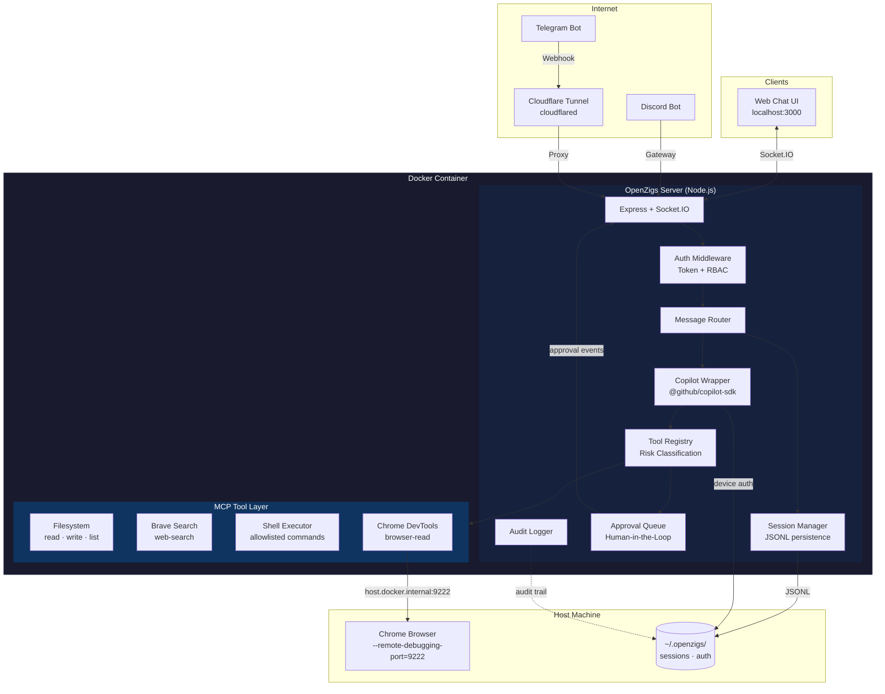
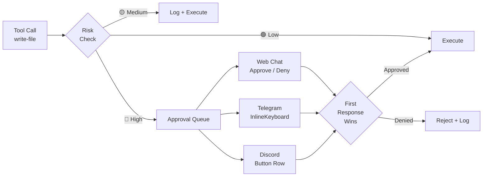

# Architecture

## High-Level Overview

OpenZigs is a **local-first AI agent platform** built on top of the [GitHub Copilot SDK](https://github.com/github/copilot-sdk). It follows a "Safe Agent" philosophy:

1. **Containerized Isolation** — The agent runs inside a Docker container, limiting blast radius.
2. **Permissioned MCP Tools** — Every tool the agent can call is registered, risk-classified, and individually toggleable.
3. **Human-in-the-Loop Approvals** — High-risk actions (file writes, shell commands) pause execution until a human approves via the Web Chat or a messaging channel.

The result is a "God Mode" AI assistant that **can** do anything, but only after you say it **should**.

---

## System Diagram



---

## Component Breakdown

### Copilot Wrapper (`src/copilot/copilot-wrapper.ts`)

Wraps `@github/copilot-sdk`'s `CopilotClient`. Responsibilities:

| Capability | Method | Description |
|---|---|---|
| **Device Auth** | `authenticate()` / `waitForAuth()` | OAuth device-flow for GitHub Copilot access. Persists token to `~/.openzigs/auth.json` with `0600` permissions. |
| **Streaming Chat** | `chat(message, tools?, model?)` | Returns an `AsyncGenerator<string>` that yields deltas as they arrive from the SDK. |
| **Model Selection** | `listModels()` | Proxies `client.listModels()` to enumerate available models (e.g., `gpt-4.1`, `claude-sonnet-4`). |
| **Retry Logic** | Internal | Automatic retries with exponential backoff for rate-limit (429) and timeout errors. Clears auth on 401. |

### Tool Registry (`src/mcp/tool-registry.ts`)

Central registry for every tool the agent can invoke. Each tool has:

- **`name`** — Unique identifier (`read-file`, `web-search`, `shell-execute`).
- **`category`** — One of `filesystem`, `search`, `browser`, `shell`.
- **`riskLevel`** — `low`, `medium`, or `high`.
- **`enabled`** — Boolean, persisted to `config/tools.json`.

The registry exposes `listEnabledTools()` which the Copilot Wrapper passes to the SDK's `createSession({ tools })`.

### Message Router (`src/routing/message-router.ts`)

Routes an `IncomingMessage` from any channel through a pipeline:

1. **Access Control** — Open / allowlist / blocklist per-channel.
2. **Session Resolution** — Finds or creates a session for the `(channelType, userId)` pair.
3. **History Retrieval** — Loads the last N conversation events from the session.
4. **LLM Call** — Streams the prompt through `CopilotWrapper.chat()`, forwarding chunks to the channel if a `RouteOptions.onChunk` callback is provided.
5. **Persistence** — Appends the user message and assistant response to the session's JSONL log.

### Session Manager (`src/sessions/session-manager.ts`)

Append-only session storage:

- **Metadata** — `{channel, userId, chatId, username}` stored in a JSON sidecar file.
- **History** — Conversation events (user, assistant, tool_call, tool_result) appended to a JSONL file.
- **Location** — `~/.openzigs/sessions/<sessionId>/`.

### Approval Queue (`src/approvals/approval-queue.ts`)

When a tool with `riskLevel: "high"` is invoked:

1. The agent pauses execution.
2. An `approval:created` event is emitted.
3. Every connected channel (Web Chat, Telegram, Discord) presents an approve/deny prompt.
4. **First response wins** — the tool either executes or is denied.
5. The decision is audit-logged.

### Channel Abstraction (`src/channels/types.ts`)

All messaging surfaces implement the `MessageChannel` interface:

```typescript
interface MessageChannel {
  readonly id: string;
  readonly type: ChannelType; // "web" | "discord" | "telegram"

  connect(): Promise<void>;
  disconnect(): Promise<void>;
  isConnected(): boolean;

  sendMessage(chatId: string, content: MessageContent): Promise<void>;
  sendApprovalRequest(chatId: string, request: ApprovalRequest): Promise<void>;

  // Optional streaming methods
  sendStreamChunk?(chatId: string, chunk: string, messageId: string): Promise<void>;
  sendStreamEnd?(chatId: string, messageId: string): Promise<void>;
  sendError?(chatId: string, error: string): Promise<void>;

  onMessage(handler: (msg: IncomingMessage) => void): void;
  onApprovalResponse(handler: (response: ApprovalResponse) => void): void;
}
```

**Implemented channels:**

| Channel | Transport | Streaming | Status |
|---|---|---|---|
| **Web Chat** | Socket.IO | Yes | ✅ Implemented |
| **Telegram** | grammY (webhooks) | No | ✅ Implemented |
| **Discord** | discord.js (gateway) | No | ✅ Implemented |
| **Slack** | — | — | *(Coming Soon)* |

---

## Security Model

### Risk Classification

Every tool is classified at registration time:

| Level | Badge | Behavior | Examples |
|---|---|---|---|
| **Low** | 🟢 | Auto-approved. No user prompt. | `read-file`, `list-directory`, `web-search` |
| **Medium** | 🟡 | Logged, executed without pause. | `browser-read` (Chrome DevTools) |
| **High** | 🔴 | **Execution paused.** Requires explicit human approval. | `write-file`, `shell-execute` |

### Authentication & Authorization

- **Auth Mode:** Local token auto-generated on first run, stored in `~/.openzigs/config.json`.
- **Roles:**
  - `admin` — Full access (enable/disable tools, decide approvals, view logs).
  - `operator` — Read tools/approvals/logs, decide approvals.
  - `viewer` — Read-only health.
- **Rate Limiting:** Failed auth attempts are rate-limited (default: 10 attempts per 60 s window).

### Dual-Channel Approval Flow



### Audit Trail

All security-relevant events are logged by `AuditLogger`:

- Tool calls (requested, approved, denied, result).
- Shell executions (command, args, exit code, duration).
- Auth failures.
- Server lifecycle events.

Logs are queryable via `GET /api/logs` with filters for `category`, `level`, `since`, `until`, and `limit`.

---

## MCP Tool Catalog

| Tool | Category | Risk | Description |
|---|---|---|---|
| `read-file` | filesystem | 🟢 low | Read a file within allowed directories. |
| `list-directory` | filesystem | 🟢 low | List directory contents within allowed directories. |
| `write-file` | filesystem | 🔴 high | Write content to a file (path-restricted). |
| `web-search` | search | 🟢 low | Query Brave Search API. Requires `BRAVE_API_KEY`. |
| `browser-read` | browser | 🟡 medium | Read page content via Chrome DevTools Protocol (CDP). |
| `shell-execute` | shell | 🔴 high | Run an allowlisted shell command with timeout. |

### Path Restrictions

Filesystem and shell tools enforce an `allowedDirs` list. Any path outside these directories is rejected with `Access denied`.

### Shell Allowlist

The shell executor uses a **command allowlist**. If the allowlist is empty, the tool returns a descriptive error. Only commands explicitly listed are permitted to run.

---

## API Surface

| Method | Path | Auth | Description |
|---|---|---|---|
| `GET` | `/health` | None | Liveness probe. |
| `GET` | `/api/health` | Token | Authenticated health check. |
| `GET` | `/api/tools` | Operator+ | List all tools, grouped by category. |
| `POST` | `/api/tools/:name/toggle` | Admin | Enable or disable a tool. |
| `GET` | `/api/approvals` | Operator+ | List approval requests (filterable by status). |
| `POST` | `/api/approvals/:id/decision` | Operator+ | Approve or reject a pending request. |
| `GET` | `/api/logs` | Token | Query audit log entries. |
| `GET` | `/api/models` | None | List available Copilot models. |
| `POST` | `/api/models/select` | None | Persist the selected model to `config/user.json`. |

---

## Networking

### Cloudflare Tunnel (`src/tunnel/cloudflare-tunnel.ts`)

Two modes:

| Mode | Use Case | Configuration |
|---|---|---|
| **Quick** | Development. Generates a temporary `trycloudflare.com` URL. | `tunnel.mode: "quick"` |
| **Named** | Production. Uses a pre-configured tunnel with a custom hostname. | `tunnel.mode: "named"`, plus `credentialsFile` and `hostname`. |

The tunnel is optional. It is only needed when external services (Telegram webhooks, Discord OAuth redirects) must reach the agent.

### Docker Networking

Inside Docker, the agent connects to the host machine's Chrome instance via `host.docker.internal:9222`. The Chrome DevTools tool addresses this automatically.
