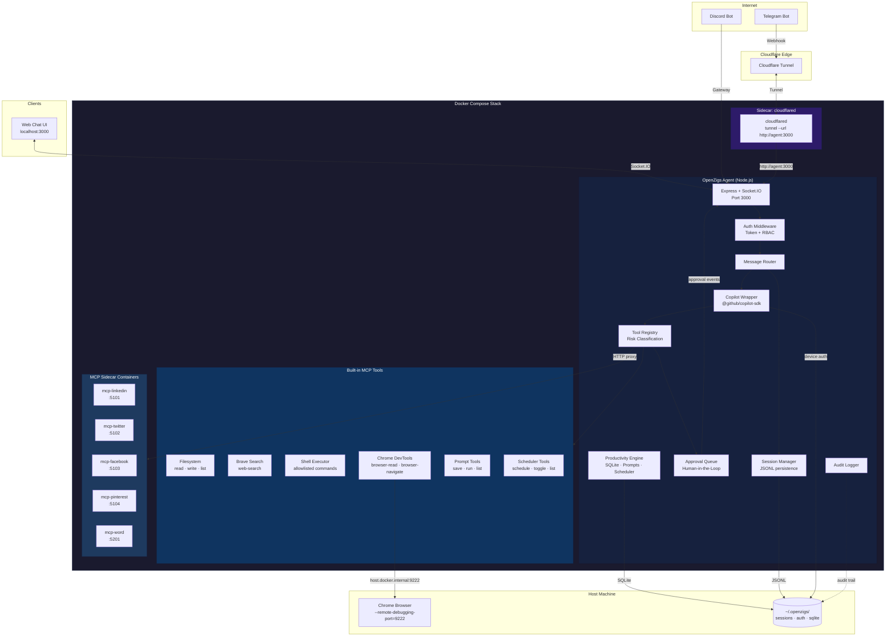
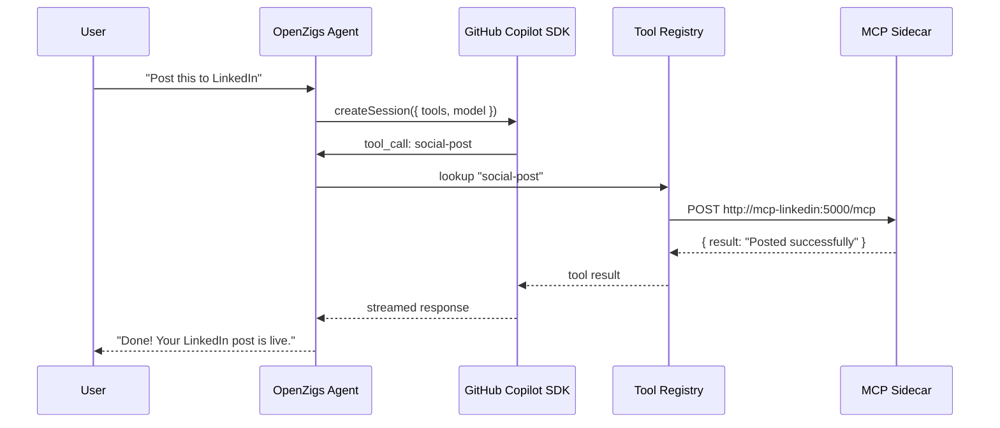
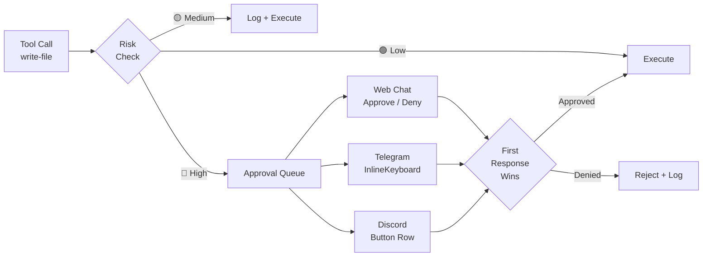
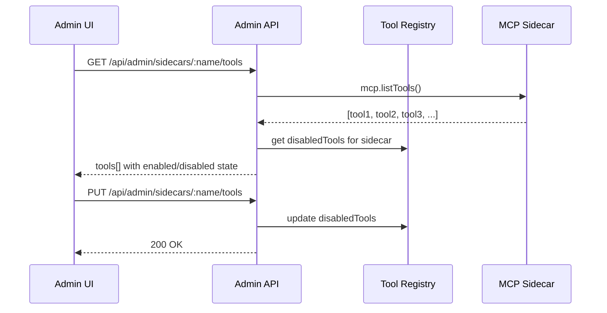

# Architecture

## High-Level Overview

OpenZigs is a **local-first AI agent platform** built on top of the [GitHub Copilot SDK](https://github.com/github/copilot-sdk). It follows a "Safe Agent" philosophy:

1. **Containerized Isolation** — The agent and its MCP sidecars run inside Docker containers via Docker Compose, limiting blast radius.
2. **Permissioned MCP Tools** — Every tool the agent can call is registered, risk-classified, and individually toggleable.
3. **Human-in-the-Loop Approvals** — High-risk actions (file writes, shell commands) pause execution until a human approves via the Web Chat or a messaging channel.
4. **MCP Host Architecture** — OpenZigs acts as an **MCP Host**, orchestrating external MCP servers (social media, document intelligence, Pinterest) that run as Docker sidecars alongside the core Node.js agent.

The result is a "God Mode" AI assistant that **can** do anything, but only after you say it **should**.

---

## System Diagram



---

## Cloudflare Tunnel (Sidecar Pattern)

The Cloudflare Tunnel has moved to a **sidecar architecture**. Instead of the Node.js app spawning and managing a `cloudflared` process internally, the tunnel runs as an independent Docker Compose service:

```yaml
# docker-compose.yml (excerpt)
tunnel:
  image: cloudflare/cloudflared:2024.6.1
  container_name: openzigs-tunnel
  command: tunnel --no-autoupdate --url http://agent:3000
  depends_on:
    agent:
      condition: service_healthy
```

**Key points:**

- **`cloudflared` is NOT managed by Node.js.** It runs as a separate container alongside the agent.
- The tunnel proxies all inbound traffic from Cloudflare's edge to `http://agent:3000` using Docker's internal network.
- The internal tunnel module (`src/tunnel/cloudflare-tunnel.ts`) should be **disabled** in `config/default.json` when using the sidecar:

  ```json
  {
    "tunnel": {
      "enabled": false
    }
  }
  ```

- For Telegram webhooks, set the `webhookUrl` to your Cloudflare-routed domain (e.g., `https://agent.yourdomain.com/telegram/webhook`).

**Traffic flow:**

```
Internet → Cloudflare Edge → cloudflared sidecar → http://agent:3000 (Docker network)
```

---

## MCP Host Architecture

OpenZigs acts as an **MCP Host** — it orchestrates multiple external MCP servers to extend its capabilities beyond built-in tools.

### How It Works

1. **User sends a message** via Web Chat, Telegram, or Discord.
2. **Message Router** resolves the session and forwards the prompt to the **Copilot Wrapper**.
3. **Copilot Wrapper** calls `@github/copilot-sdk`'s `createSession()` with all enabled tools wrapped via `defineTool()`.
4. **GitHub Copilot** (the intelligence layer) decides which tools to invoke based on the user's intent.
5. **Tool execution returns to OpenZigs**, which dispatches to either a built-in handler or an HTTP proxy call to an MCP sidecar container.
6. **MCP sidecar** processes the request (e.g., posts to LinkedIn, creates a Pinterest pin) and returns the result.
7. **Result flows back** through the Copilot SDK to the user as a streamed response.



### Sidecar Registration

MCP sidecars are **NOT** registered with the Copilot CLI directly. Instead:

1. Each sidecar's tools are defined as `ToolDefinition` objects in TypeScript (e.g., `src/mcp/tools/social-media-tools.ts`).
2. At startup, `registerMcpTools()` in `src/mcp/server.ts` registers all tool definitions with the `ToolRegistry`.
3. The `CopilotWrapperService` wraps each enabled tool via the SDK's `defineTool()` function and passes them to `createSession({ tools })`.
4. When the SDK invokes a sidecar-backed tool, the handler makes an HTTP `POST` to the sidecar's URL (e.g., `http://localhost:5101/mcp`).

The user does not need to manually register tools with any CLI. OpenZigs handles all registration automatically.

### Current MCP Sidecars

| Service | Container | Port | Platform | Category | Runtime |
|---|---|---|---|---|---|
| `mcp-linkedin` | `openzigs-mcp-linkedin` | 5101 | LinkedIn | social | Docker (Python) |
| `mcp-twitter` | `openzigs-mcp-twitter` | 5102 | Twitter/X | social | Docker (Python) |
| `mcp-facebook` | `openzigs-mcp-facebook` | 5103 | Facebook | social | Docker (Python) |
| `mcp-pinterest` | `openzigs-mcp-pinterest` | 5104 | Pinterest | social | Docker (Python) |
| `mcp-word` | `openzigs-mcp-word` | 5201 | Office Word | documents | Docker (Python) |
| `mcp-markitdown` | `openzigs-mcp-markitdown` | 5301 | MarkItDown | documents | Docker (Python) |
| `mcp-gmail` | `openzigs-mcp-gmail` | 5302 | Gmail | personal | Docker (Node.js) |
| `mcp-database` | `openzigs-mcp-database` | 5303 | JDBC Database | data | JBang (Java) |
| `mcp-github` | `openzigs-mcp-github` | 5304 | GitHub | developer | Docker (Go) |

### New MCP Server Details

#### MarkItDown (`mcp-markitdown`)

**Source:** [microsoft/markitdown](https://github.com/microsoft/markitdown)

Converts various file formats (PDF, DOCX, PPTX, XLSX, HTML, images, audio) into Markdown for LLM consumption. Runs as a Docker container with volume mounts for file access.

```yaml
# docker-compose.yml excerpt
markitdown-mcp-server:
  image: markitdown-mcp:latest
  container_name: openzigs-mcp-markitdown
  volumes:
    - /data:/workdir
  networks:
    - openzigs-network
```

**Tools:** `convert-to-markdown` (🟢 low risk)

#### Gmail (`mcp-gmail`)

**Source:** [GongRzhe/Gmail-MCP-Server](https://github.com/GongRzhe/Gmail-MCP-Server)

Reads, searches, and drafts Gmail messages. Requires Google Cloud OAuth credentials (`gcp-oauth.keys.json`).

```yaml
# docker-compose.yml excerpt
gmail-mcp-server:
  image: mcp/gmail:latest
  container_name: openzigs-mcp-gmail
  volumes:
    - gmail-credentials:/gmail-server
    - ${HOME}/.gmail-mcp/gcp-oauth.keys.json:/gcp-oauth.keys.json:ro
  environment:
    GMAIL_OAUTH_PATH: /gcp-oauth.keys.json
    GMAIL_CREDENTIALS_PATH: /gmail-server/credentials.json
  networks:
    - openzigs-network
```

**Tools:** `gmail-search` (🟢 low), `gmail-read` (🟢 low), `gmail-draft` (🟡 medium), `gmail-send` (🔴 high)

#### Database / JDBC (`mcp-database`)

**Source:** [quarkiverse/quarkus-mcp-servers](https://github.com/quarkiverse/quarkus-mcp-servers/tree/main/jdbc)

Provides SQL access to any JDBC-compatible database (PostgreSQL, MySQL, SQLite, H2). Requires Java/JBang runtime.

```yaml
# docker-compose.yml excerpt (or run via JBang locally)
database-mcp-server:
  image: openzigs-mcp-database:latest
  container_name: openzigs-mcp-database
  environment:
    JDBC_URL: jdbc:postgresql://host.docker.internal:5432/mydb
    DB_USER: postgres
    DB_PASSWORD: ${DB_PASSWORD}
  networks:
    - openzigs-network
```

**Alternative (JBang, no Docker):**
```bash
jbang jdbc@quarkiverse/quarkus-mcp-servers jdbc:postgresql://localhost:5432/mydb -u postgres -p secret
```

**Tools:** `db-query` (🔴 high), `db-describe` (🟢 low), `db-list-tables` (🟢 low)

#### GitHub (`mcp-github`)

**Source:** [github/github-mcp-server](https://github.com/github/github-mcp-server)

Full GitHub API access — repos, issues, PRs, code search, actions. Uses a GitHub Personal Access Token.

```yaml
# docker-compose.yml excerpt
github-mcp-server:
  image: ghcr.io/github/github-mcp-server:latest
  container_name: openzigs-mcp-github
  environment:
    GITHUB_PERSONAL_ACCESS_TOKEN: ${GITHUB_PERSONAL_ACCESS_TOKEN}
    GITHUB_TOOLSETS: repos,issues,pull_requests,code_security
  networks:
    - openzigs-network
```

**Tools:** `github-get-file` (🟢 low), `github-search-code` (🟢 low), `github-list-issues` (🟢 low), `github-create-issue` (🟡 medium), `github-create-pr` (🔴 high)

---

## Component Breakdown

### Copilot Wrapper (`src/copilot/copilot-wrapper.ts`)

Wraps `@github/copilot-sdk`'s `CopilotClient`. Responsibilities:

| Capability | Method | Description |
|---|---|---|
| **Device Auth** | `authenticate()` / `waitForAuth()` | OAuth device-flow for GitHub Copilot access. Persists token to `~/.openzigs/auth.json` with `0600` permissions. |
| **Streaming Chat** | `chat(message, tools?, model?)` | Returns an `AsyncGenerator<string>` that yields deltas as they arrive from the SDK. Tools are wrapped via `defineTool()` and passed to `createSession({ tools })`. |
| **Model Selection** | `listModels()` | Proxies `client.listModels()` to enumerate available models (e.g., `gpt-4.1`, `claude-sonnet-4`). |
| **Tool Dispatch** | Internal | When the SDK invokes a tool, the handler calls the `ToolDefinition.handler()` — which may proxy to an MCP sidecar or execute locally. |
| **Retry Logic** | Internal | Automatic retries with exponential backoff for rate-limit (429) and timeout errors. Clears auth on 401. |

### Tool Registry (`src/mcp/tool-registry.ts`)

Central registry for every tool the agent can invoke. Each tool has:

- **`name`** — Unique identifier (`read-file`, `web-search`, `shell-execute`, `social-post`, `pinterest-boards`).
- **`category`** — One of `filesystem`, `search`, `browser`, `shell`, `productivity`, `social`, `documents`.
- **`riskLevel`** — `low`, `medium`, or `high`.
- **`enabled`** — Boolean, persisted to `config/tools.json`.

The registry exposes `listEnabledTools()` which the Copilot Wrapper passes to the SDK's `createSession({ tools })`.

### Productivity Engine (`src/productivity/`)

Embedded SQLite-backed subsystem for saved prompts and cron scheduling:

- **Database** (`database.ts`) — Shared `better-sqlite3` singleton with WAL mode. Tables: `saved_prompts`, `scheduled_jobs`.
- **PromptManager** (`prompt-manager.ts`) — CRUD for saved prompts with `{{variable}}` template interpolation.
- **Scheduler** (`scheduler.ts`) — `node-cron` v4 in-process scheduler with JSONL audit logs and `EventEmitter` hooks for Socket.IO notifications.

### Message Router (`src/routing/message-router.ts`)

Routes an `IncomingMessage` from any channel through a pipeline:

1. **Access Control** — Open / allowlist / blocklist per-channel.
2. **Session Resolution** — Finds or creates a session for the `(channelType, userId)` pair.
3. **History Retrieval** — Loads the last N conversation events from the session.
4. **LLM Call** — Streams the prompt through `CopilotWrapper.chat()`, forwarding chunks to the channel if a `RouteOptions.onChunk` callback is provided.
5. **Persistence** — Appends the user message and assistant response to the session's JSONL log.

### Session Manager (`src/sessions/session-manager.ts`)

Append-only session storage:

- **Metadata** — `{channel, userId, chatId, username}` stored in a JSON sidecar file.
- **History** — Conversation events (user, assistant, tool_call, tool_result) appended to a JSONL file.
- **Location** — `~/.openzigs/sessions/<sessionId>/`.

### Approval Queue (`src/approvals/approval-queue.ts`)

When a tool with `riskLevel: "high"` is invoked:

1. The agent pauses execution.
2. An `approval:created` event is emitted.
3. Every connected channel (Web Chat, Telegram, Discord) presents an approve/deny prompt.
4. **First response wins** — the tool either executes or is denied.
5. The decision is audit-logged.

### Channel Abstraction (`src/channels/types.ts`)

All messaging surfaces implement the `MessageChannel` interface:

```typescript
interface MessageChannel {
  readonly id: string;
  readonly type: ChannelType; // "web" | "discord" | "telegram"

  connect(): Promise<void>;
  disconnect(): Promise<void>;
  isConnected(): boolean;

  sendMessage(chatId: string, content: MessageContent): Promise<void>;
  sendApprovalRequest(chatId: string, request: ApprovalRequest): Promise<void>;

  // Optional streaming methods
  sendStreamChunk?(chatId: string, chunk: string, messageId: string): Promise<void>;
  sendStreamEnd?(chatId: string, messageId: string): Promise<void>;
  sendError?(chatId: string, error: string): Promise<void>;

  onMessage(handler: (msg: IncomingMessage) => void): void;
  onApprovalResponse(handler: (response: ApprovalResponse) => void): void;
}
```

**Implemented channels:**

| Channel | Transport | Streaming | Status |
|---|---|---|---|
| **Web Chat** | Socket.IO | Yes | ✅ Implemented |
| **Telegram** | grammY (webhooks) | No | ✅ Implemented |
| **Discord** | discord.js (gateway) | No | ✅ Implemented |
| **Slack** | — | — | *(Coming Soon)* |

---

## Security Model

### Risk Classification

Every tool is classified at registration time:

| Level | Badge | Behavior | Examples |
|---|---|---|---|
| **Low** | 🟢 | Auto-approved. No user prompt. | `read-file`, `list-directory`, `web-search`, `list-prompts`, `social-profile`, `read-pdf` |
| **Medium** | 🟡 | Logged, executed without pause. | `browser-read`, `social-timeline`, `pinterest-boards`, `schedule-job`, `create-word-doc` |
| **High** | 🔴 | **Execution paused.** Requires explicit human approval. | `write-file`, `shell-execute`, `social-post`, `browser-navigate` |

### Authentication & Authorization

- **Auth Mode:** Local token auto-generated on first run, stored in `~/.openzigs/config.json`.
- **Roles:**
  - `admin` — Full access (enable/disable tools, decide approvals, view logs).
  - `operator` — Read tools/approvals/logs, decide approvals.
  - `viewer` — Read-only health.
- **Rate Limiting:** Failed auth attempts are rate-limited (default: 10 attempts per 60 s window).

### Dual-Channel Approval Flow



### Audit Trail

All security-relevant events are logged by `AuditLogger`:

- Tool calls (requested, approved, denied, result).
- Shell executions (command, args, exit code, duration).
- Auth failures.
- Server lifecycle events.

Logs are queryable via `GET /api/logs` with filters for `category`, `level`, `since`, `until`, and `limit`.

---

## MCP Tool Catalog

### Built-in Tools

| Tool | Category | Risk | Description |
|---|---|---|---|
| `read-file` | filesystem | 🟢 low | Read a file within allowed directories. |
| `list-directory` | filesystem | 🟢 low | List directory contents within allowed directories. |
| `write-file` | filesystem | 🔴 high | Write content to a file (path-restricted). |
| `web-search` | search | 🟢 low | Query Brave Search API. Requires `BRAVE_API_KEY`. |
| `browser-read` | browser | 🟡 medium | Read page content via Chrome DevTools Protocol (CDP). |
| `browser-navigate` | browser | 🔴 high | Control Chrome: navigate, click, type, screenshot, evaluate JS. |
| `shell-execute` | shell | 🔴 high | Run an allowlisted shell command with timeout. |

### Productivity Tools

| Tool | Category | Risk | Description |
|---|---|---|---|
| `save-prompt` | productivity | 🟢 low | Save a reusable prompt template with `{{variable}}` interpolation. |
| `get-prompt` | productivity | 🟢 low | Retrieve a saved prompt by name or ID. |
| `list-prompts` | productivity | 🟢 low | List all saved prompts with optional search. |
| `update-prompt` | productivity | 🟢 low | Update an existing saved prompt. |
| `delete-prompt` | productivity | 🟡 medium | Delete a saved prompt. |
| `run-prompt` | productivity | 🟢 low | Resolve a saved prompt with variable substitution. |
| `schedule-job` | productivity | 🟡 medium | Schedule a cron job for automated execution. |
| `list-jobs` | productivity | 🟢 low | List all scheduled jobs. |
| `get-job` | productivity | 🟢 low | Get details of a scheduled job. |
| `update-job` | productivity | 🟡 medium | Update a scheduled job's cron expression or action. |
| `delete-job` | productivity | 🟡 medium | Delete a scheduled job. |
| `toggle-job` | productivity | 🟡 medium | Enable or disable a scheduled job. |

### Social Media Tools (MCP Sidecars)

| Tool | Category | Risk | Description |
|---|---|---|---|
| `social-post` | social | 🔴 high | Post content to LinkedIn, Twitter/X, Facebook, or Pinterest. |
| `social-timeline` | social | 🟡 medium | Get recent posts from a platform's timeline. |
| `social-profile` | social | 🟢 low | Get profile information from a platform. |
| `pinterest-boards` | social | 🟡 medium | List, create, or get details of Pinterest boards. |
| `pinterest-pins` | social | 🟡 medium | List, create, or get details of Pinterest pins. |

### Document Intelligence Tools (MCP Sidecars)

| Tool | Category | Risk | Description |
|---|---|---|---|
| `read-pdf` | documents | 🟢 low | Extract text from a PDF file with optional search. |
| `create-word-doc` | documents | 🟡 medium | Create a Word document via the Office Word MCP sidecar. |
| `calendar-list` | documents | 🟢 low | List upcoming Google Calendar events. |
| `calendar-create` | documents | 🟡 medium | Create a new Google Calendar event. |

### Personal Assistant Tools (MCP Sidecars — Planned)

| Tool | Category | Risk | Description |
|---|---|---|---|
| `convert-to-markdown` | documents | 🟢 low | Convert PDF, DOCX, PPTX, XLSX, HTML, images to Markdown via MarkItDown. |
| `gmail-search` | personal | 🟢 low | Search Gmail messages by query. |
| `gmail-read` | personal | 🟢 low | Read a specific Gmail message by ID. |
| `gmail-draft` | personal | 🟡 medium | Create a draft email in Gmail. |
| `gmail-send` | personal | 🔴 high | Send an email via Gmail. Requires human approval. |
| `db-query` | data | 🔴 high | Execute a SQL query against a JDBC database. Requires human approval. |
| `db-describe` | data | 🟢 low | Describe a database table's schema. |
| `db-list-tables` | data | 🟢 low | List all tables in the connected database. |
| `github-get-file` | developer | 🟢 low | Get file contents from a GitHub repository. |
| `github-search-code` | developer | 🟢 low | Search code across GitHub repositories. |
| `github-list-issues` | developer | 🟢 low | List issues in a GitHub repository. |
| `github-create-issue` | developer | 🟡 medium | Create a new issue in a GitHub repository. |
| `github-create-pr` | developer | 🔴 high | Create a pull request. Requires human approval. |

### Path Restrictions

Filesystem and shell tools enforce an `allowedDirs` list. Any path outside these directories is rejected with `Access denied`.

### Shell Allowlist

The shell executor uses a **command allowlist**. If the allowlist is empty, the tool returns a descriptive error. Only commands explicitly listed are permitted to run.

---

## API Surface

| Method | Path | Auth | Description |
|---|---|---|---|
| `GET` | `/health` | None | Liveness probe. |
| `GET` | `/api/health` | Token | Authenticated health check. |
| `GET` | `/api/tools` | Operator+ | List all tools, grouped by category. |
| `POST` | `/api/tools/:name/toggle` | Admin | Enable or disable a tool. |
| `GET` | `/api/approvals` | Operator+ | List approval requests (filterable by status). |
| `POST` | `/api/approvals/:id/decision` | Operator+ | Approve or reject a pending request. |
| `GET` | `/api/logs` | Token | Query audit log entries. |
| `GET` | `/api/models` | None | List available Copilot models. |
| `POST` | `/api/models/select` | None | Persist the selected model to `config/user.json`. |
| `GET` | `/api/prompts` | Token | List all saved prompts. |
| `POST` | `/api/prompts` | Token | Create a saved prompt. |
| `PUT` | `/api/prompts/:id` | Token | Update a saved prompt. |
| `DELETE` | `/api/prompts/:id` | Token | Delete a saved prompt. |
| `GET` | `/api/jobs` | Token | List all scheduled jobs. |
| `POST` | `/api/jobs` | Token | Create a scheduled job. |
| `PUT` | `/api/jobs/:id` | Token | Update a scheduled job. |
| `DELETE` | `/api/jobs/:id` | Token | Delete a scheduled job. |
| `POST` | `/api/jobs/:id/toggle` | Token | Enable or disable a scheduled job. |

---

## Networking

### Cloudflare Tunnel

The tunnel exposes the agent to the internet so webhook-based channels (Telegram, Discord OAuth) can reach it.

**Two runtime modes:**

| Mode | Use Case | Configuration |
|---|---|---|
| **Docker Sidecar** (recommended) | Production. `cloudflared` runs as a separate container in `docker-compose.yml`, proxying traffic to `http://agent:3000`. | Set `TUNNEL_TOKEN` env var on the `tunnel` service. Agent sets `tunnel.enabled: false` (default). |
| **Embedded** (legacy) | Development without Docker. The agent spawns `cloudflared` as a child process. | `tunnel.enabled: true`, `tunnel.mode: "quick"` or `"named"` with `credentialsFile` and `hostname`. |

> **Note:** When using the Docker sidecar pattern, the agent does not manage the tunnel process. Set `tunnel.enabled: false` (the default) and let Docker Compose handle the `cloudflared` container lifecycle.

### Docker Compose Network

All services (`agent`, `tunnel`, MCP sidecars) share the `openzigs-network` bridge network. Service-to-service communication uses Docker DNS hostnames:

| Connection | From → To | Address |
|---|---|---|
| Tunnel → Agent | `tunnel` → `agent` | `http://agent:3000` |
| Agent → LinkedIn MCP | `agent` → `linkedin-mcp-server` | `http://linkedin-mcp-server:5101/mcp` |
| Agent → Twitter MCP | `agent` → `twitter-mcp-server` | `http://twitter-mcp-server:5102/mcp` |
| Agent → Facebook MCP | `agent` → `facebook-mcp-server` | `http://facebook-mcp-server:5103/mcp` |
| Agent → Pinterest MCP | `agent` → `pinterest-mcp-server` | `http://pinterest-mcp-server:5104/mcp` |
| Agent → Word MCP | `agent` → `word-mcp-server` | `http://word-mcp-server:5201/mcp` |
| Agent → Chrome | `agent` → host | `host.docker.internal:9222` |

MCP sidecar URLs are passed to the agent via environment variables (`MCP_LINKEDIN_URL`, `MCP_TWITTER_URL`, etc.) in `docker-compose.yml`.

| Agent → MarkItDown MCP | `agent` → `markitdown-mcp-server` | `http://markitdown-mcp-server:5301/mcp` |
| Agent → Gmail MCP | `agent` → `gmail-mcp-server` | `http://gmail-mcp-server:5302/mcp` |
| Agent → Database MCP | `agent` → `database-mcp-server` | `http://database-mcp-server:5303/mcp` |
| Agent → GitHub MCP | `agent` → `github-mcp-server` | `http://github-mcp-server:5304/mcp` |

---

## Granular Tool Configuration

OpenZigs supports **per-tool enable/disable** within each MCP server. This allows users to activate a server (e.g., Gmail) while restricting specific tools (e.g., allowing `gmail-read` but blocking `gmail-send`).

### Config Schema

Each sidecar entry in `config/default.json` accepts an optional `disabledTools` array:

```json
{
  "mcpServers": {
    "sidecars": {
      "gmail": {
        "enabled": true,
        "disabledTools": ["gmail-send"]
      },
      "database": {
        "enabled": true,
        "disabledTools": ["db-query"]
      }
    }
  }
}
```

### How It Works

1. At startup, `registerMcpTools()` loads each sidecar's tool definitions.
2. Before registering a tool with the `ToolRegistry`, it checks whether the tool name appears in the sidecar's `disabledTools` array.
3. Disabled tools are **never** passed to `createSession({ tools })` — the LLM does not know they exist.
4. The Admin UI's "Edit" button on the MCP settings page queries the server for its full tool list via `mcp.listTools()`, renders each tool with a toggle switch, and persists changes to `disabledTools` in `config/default.json`.

### UI Workflow



---

## Session & Context Management

As OpenZigs scales to 50+ tools, managing the LLM's context window and conversation state becomes critical.

### The Context Overload Problem

Each tool definition sent to the Copilot SDK consumes ~200-500 tokens (name, description, JSON schema). With 50+ tools, tool definitions alone consume **10,000-25,000 tokens** — a significant fraction of the context window before any conversation history is included.

### Strategy: Dynamic Tool Loading

OpenZigs implements (or will implement) a **two-phase tool resolution** strategy:

1. **Phase 1 — Intent Classification (current: disabled by default)**
   - A lightweight pre-pass classifies the user's message into tool categories (`filesystem`, `search`, `social`, `personal`, `data`, `developer`).
   - Only tools from matching categories are sent to the main LLM call.
   - Controlled by `config.session.dynamicToolLoading` (default: `false`).

2. **Phase 2 — Always-Available Core Tools**
   - A small set of "always-on" tools (e.g., `web-search`, `read-file`, `list-directory`) are included in every request regardless of classification.
   - High-frequency tools that the LLM needs across all contexts.

### Configuration

```json
{
  "session": {
    "historyWindow": 20,
    "maxToolsPerRequest": 30,
    "dynamicToolLoading": false
  }
}
```

| Key | Type | Default | Description |
|---|---|---|---|
| `session.historyWindow` | number | `20` | Max conversation turns to include in context. |
| `session.maxToolsPerRequest` | number | `30` | Hard cap on tools sent per LLM request. |
| `session.dynamicToolLoading` | boolean | `false` | Enable intent-based tool filtering. |

### Conversation State Architecture

OpenZigs uses a **stateful session model** with a sliding window:

1. **Session Manager** persists all conversation events to JSONL files (`~/.openzigs/sessions/<sessionId>/`).
2. **Message Router** loads the last `historyWindow` turns before each LLM call.
3. **Tool call results** are included in history so the LLM has continuity across multi-step tasks.
4. **Session pruning** — older events beyond the window are retained on disk but not sent to the LLM.

```mermaid
flowchart TB
    MSG[User Message] --> MR[Message Router]
    MR --> SM[Session Manager]
    SM --> HIST[Load last N turns]
    HIST --> CW[Copilot Wrapper]
    CW --> SDK[createSession<br/>tools + history + message]
    SDK --> RESP[Streamed Response]
    RESP --> SM2[Append to JSONL]

    subgraph Context Window
        TOOLS[Enabled Tools<br/>≤ maxToolsPerRequest]
        HIST2[Conversation History<br/>≤ historyWindow turns]
        SYSP[System Prompt]
    end

    CW --> Context Window
```

### Recommendation

For the current Express/Node.js stack:

1. **Keep `dynamicToolLoading: false` initially.** With < 30 tools, full tool lists fit comfortably. Enable when crossing ~40 tools.
2. **Set `historyWindow: 20`** as default — sufficient for multi-step tasks without exhausting context.
3. **Implement `maxToolsPerRequest: 30`** as a safety valve immediately.
4. **Future: vector-based tool retrieval** — embed tool descriptions and retrieve top-K by semantic similarity to the user query. This is the long-term scalable solution.

---

## Human-in-the-Loop Execution (Detailed)

The Human-in-the-Loop (HITL) system is the cornerstone of OpenZigs' "Safe Agent" philosophy. Every destructive or externally-impactful action **must** receive explicit human confirmation before execution.

### Threat Model

| Threat | Mitigation |
|---|---|
| LLM hallucination triggers destructive tool | 🔴 High-risk tools require approval |
| Prompt injection causes data exfiltration | `gmail-send`, `social-post` gated by approval |
| Unintended SQL execution | `db-query` classified as 🔴 high risk |
| Credential exposure via shell | `shell-execute` requires approval + allowlist |
| Mass GitHub operations | `github-create-pr` gated by approval |

### Confirmation Flow (Expanded)

1. **Tool Invocation** — The Copilot SDK calls a tool handler.
2. **Risk Check** — `ToolRegistry` looks up the tool's `riskLevel`.
3. **Gate Decision:**
   - 🟢 **Low** → Execute immediately, log result.
   - 🟡 **Medium** → Execute immediately, log with elevated visibility.
   - 🔴 **High** → **Pause execution.** Create an `ApprovalRequest`.
4. **Multi-Channel Broadcast** — The approval request is sent to all connected channels simultaneously (Web Chat overlay, Telegram inline keyboard, Discord button row).
5. **First-Response-Wins** — The first human to approve or deny across any channel resolves the request.
6. **Execution or Rejection** — The tool either runs and returns results to the LLM, or a denial message is returned.
7. **Audit Trail** — Every decision (approve/deny), the deciding user, timestamp, and channel are logged.

### High-Risk Tool Registry

The following tools **always** require human confirmation:

| Tool | Category | Why It's High Risk |
|---|---|---|
| `write-file` | filesystem | Modifies host filesystem |
| `shell-execute` | shell | Arbitrary command execution |
| `social-post` | social | Public-facing content creation |
| `browser-navigate` | browser | Can execute arbitrary JS |
| `gmail-send` | personal | Sends email on user's behalf |
| `db-query` | data | Arbitrary SQL execution |
| `github-create-pr` | developer | Creates public code changes |

### Admin Override

Admins can reclassify any tool's risk level via the API or Admin UI:

```bash
curl -X POST http://localhost:3000/api/admin/tools/db-query/risk \
  -H "Content-Type: application/json" \
  -d '{"riskLevel": "medium"}'
```

> **Warning:** Downgrading a high-risk tool removes the human confirmation gate. Use with extreme caution.
