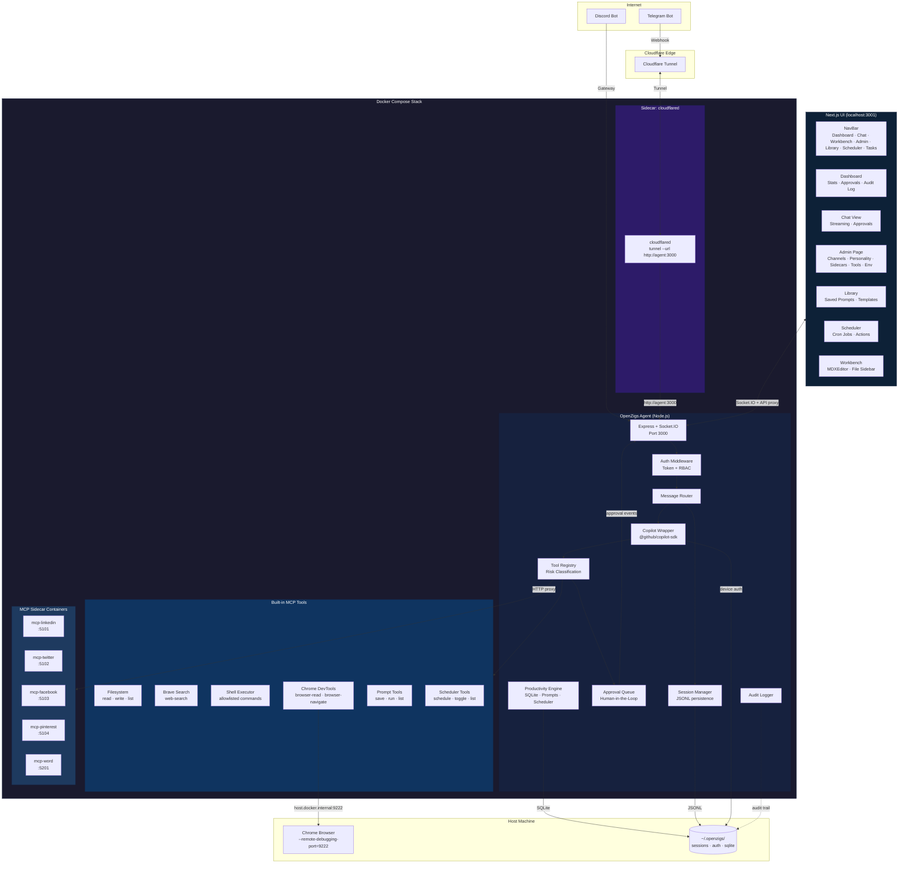
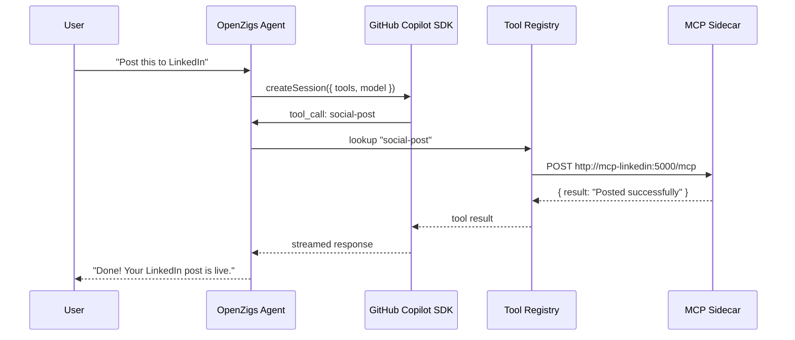
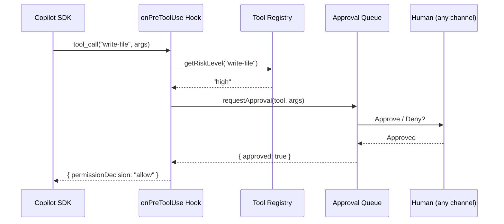
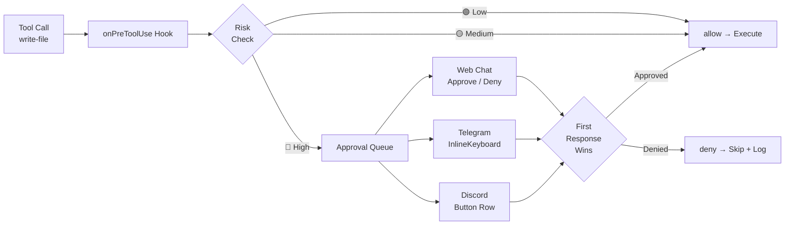
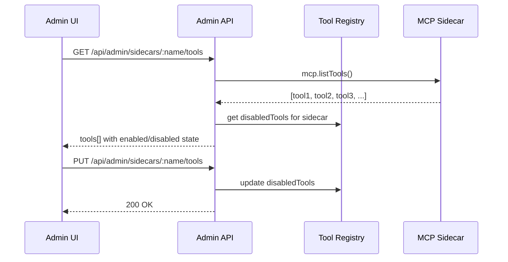
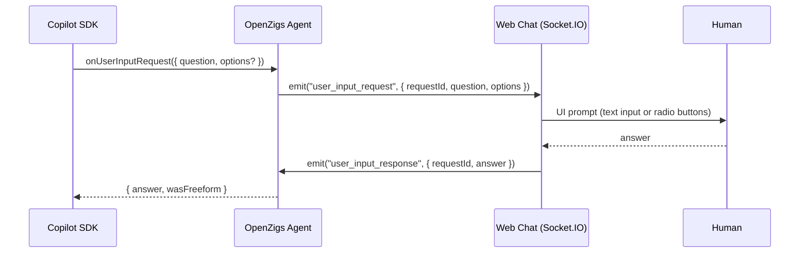
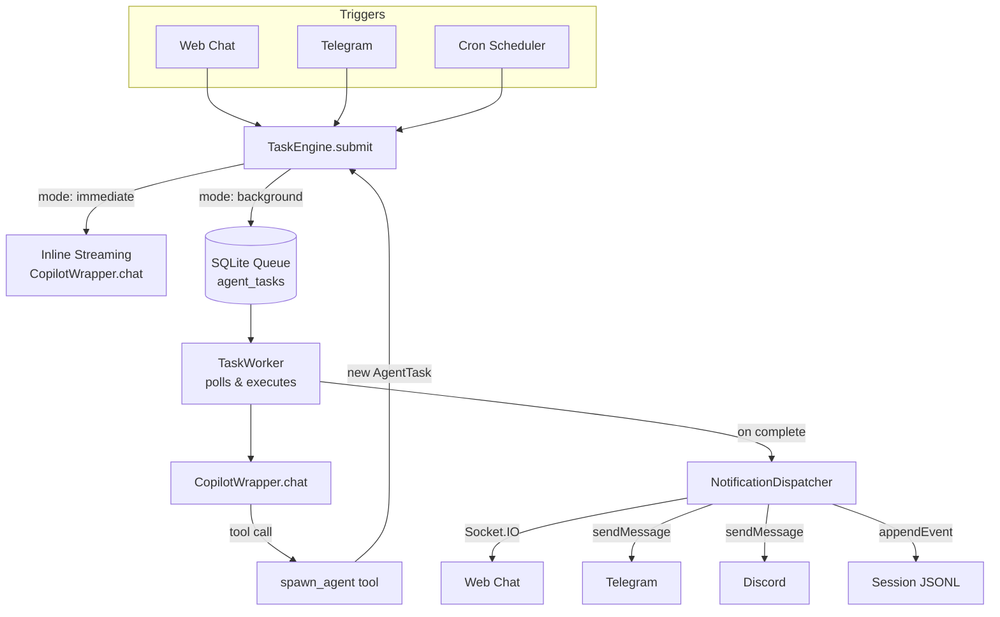
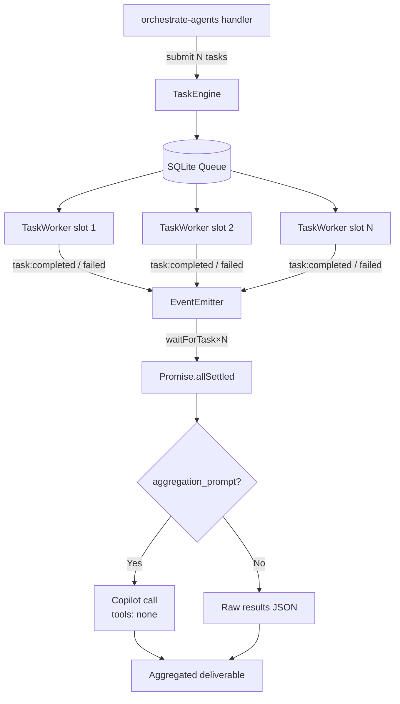

# Architecture

## High-Level Overview

OpenZigs is a **local-first AI agent platform** built on top of the [GitHub Copilot SDK](https://github.com/github/copilot-sdk). It follows a "Safe Agent" philosophy:

1. **Containerized Isolation** — The agent and its MCP sidecars run inside Docker containers via Docker Compose, limiting blast radius.
2. **Permissioned MCP Tools** — Every tool the agent can call is registered, risk-classified, and individually toggleable.
3. **Human-in-the-Loop Approvals** — High-risk actions (file writes, shell commands) pause execution until a human approves via the Web Chat or a messaging channel.
4. **MCP Host Architecture** — OpenZigs acts as an **MCP Host**, orchestrating external MCP servers (social media, document intelligence, Pinterest) that run as Docker sidecars alongside the core Node.js agent.

The result is a "God Mode" AI assistant that **can** do anything, but only after you say it **should**.

---

## System Diagram



---

## UI Architecture

The frontend is a **Next.js 14 App Router** application in the `ui/` directory. It replaces the earlier vanilla JS/HTML frontend that was served via Express static middleware.

### Stack

| Technology | Purpose |
|---|---|
| **Next.js 14** (App Router) | SSR/SSG framework, file-based routing |
| **React 18** | Component model |
| **Tailwind CSS** | Utility-first styling with custom theme (ink, stone, ember, tide, moss, haze) |
| **React Query** (`@tanstack/react-query`) | Server state management, caching, mutations |
| **Socket.IO Client** | Real-time streaming (chat responses, approval events, job executions, server status) |
| **Space Grotesk + JetBrains Mono** | Typography |

### Route Map

| Route | Component | Purpose |
|---|---|---|
| `/` | `dashboard.tsx` | Snapshot stats, pending approvals, audit log |
| `/chat` | `chat-view.tsx` | Full chat with streaming, model selector, reasoning effort, file attachments, session context bar, interactive clarification prompts, approval overlay |
| `/admin` | `admin/page.tsx` | Channel config, personality settings with mode selector, model & provider configuration, custom agent management, sidecar management, native MCP server editor, tool toggles, env status |
| `/library` | `library/page.tsx` | Saved prompt CRUD with `{{variable}}` template preview and system prompt apply |
| `/scheduler` | `scheduler/page.tsx` | Cron job CRUD with action types, prompt linking, model overrides, AI assist, live execution events |
| `/tasks` | `task-dashboard.tsx` | Background task queue, status filters, cancel, recursive child expansion, real-time updates |
| `/workbench` | `workbench/page.tsx` | Rich Markdown editor (MDXEditor) with file sidebar, live file system CRUD, Cmd/Ctrl+S save |

### Component Structure

```
ui/
├── app/
│   ├── layout.tsx          # Root layout with NavBar + Providers
│   ├── providers.tsx       # QueryClientProvider + SocketProvider
│   ├── page.tsx            # Dashboard route
│   ├── chat/page.tsx       # Chat route
│   ├── admin/page.tsx      # Admin route
│   ├── library/page.tsx    # Library route
│   ├── scheduler/page.tsx  # Scheduler route
│   ├── tasks/page.tsx      # Tasks route
│   └── workbench/page.tsx  # Workbench route (MDXEditor + file sidebar)
├── components/
│   ├── nav-bar.tsx         # Sticky top navigation
│   ├── chat-view.tsx       # Chat with streaming + approvals + attachments + reasoning
│   ├── file-attachment.tsx # File attachment button, drop zone, chips (#141)
│   ├── reasoning-effort-selector.tsx  # Reasoning effort radio + provider badge (#142)
│   ├── user-input-prompt.tsx  # Interactive clarification prompt cards (#143)
│   ├── session-context-bar.tsx  # Session context gauge + compaction spinner (#144)
│   ├── dashboard.tsx       # Stats + approvals + audit log
│   ├── task-dashboard.tsx  # Background task queue + recursive children
│   ├── section-card.tsx    # Reusable card wrapper
│   ├── workbench/
│   │   ├── initialized-mdx-editor.tsx  # MDXEditor with full plugin config
│   │   ├── forward-ref-editor.tsx      # Dynamic SSR-safe import wrapper
│   │   └── file-sidebar.tsx            # Recursive file tree browser
│   └── admin/
│       ├── tools-panel.tsx        # Tool list with risk badges + toggles
│       ├── channels-panel.tsx     # Telegram + Discord config forms
│       ├── sidecars-panel.tsx     # Docker sidecar management
│       ├── local-servers-panel.tsx # Local MCP server status
│       ├── personality-panel.tsx  # System instruction + pre/post prompts + mode selector
│       ├── model-config-panel.tsx # Reasoning effort + BYOK provider configuration
│       ├── agents-panel.tsx       # Custom agent CRUD with tool multi-select
│       ├── mcp-editor-panel.tsx   # Native MCP server definition editor (Local/HTTP/SSE)
│       └── env-panel.tsx          # Environment variable status
└── lib/
    ├── api.ts              # Shared fetchJson utility + API_BASE
    ├── types.ts            # All shared TypeScript types
    └── socket-context.tsx  # SocketProvider + useSocket hook
```

### API Proxying

The Next.js dev server proxies API and WebSocket traffic to the Express backend. This is configured in `next.config.mjs`:

```javascript
// next.config.mjs
rewrites: async () => [
  { source: "/api/:path*", destination: `${API_BASE}/api/:path*` },
  { source: "/socket.io/:path*", destination: `${API_BASE}/socket.io/:path*` },
]
```

In development, the backend runs on port 3000 and the Next.js dev server runs on port 3001. The user accesses the UI at `http://localhost:3001`, and all `/api/*` and `/socket.io/*` requests are transparently proxied to the backend.

### Express Server (Backend Only)

The Express server (`src/server.ts`) no longer serves any static files or HTML routes. It provides only:

- REST API endpoints (`/api/*`)
- Socket.IO WebSocket server
- Health check (`/health`)

---

## Cloudflare Tunnel (Sidecar Pattern)

The Cloudflare Tunnel has moved to a **sidecar architecture**. Instead of the Node.js app spawning and managing a `cloudflared` process internally, the tunnel runs as an independent Docker Compose service:

```yaml
# docker-compose.yml (excerpt)
tunnel:
  image: cloudflare/cloudflared:2024.6.1
  container_name: openzigs-tunnel
  command: tunnel --no-autoupdate --url http://agent:3000
  depends_on:
    agent:
      condition: service_healthy
```

**Key points:**

- **`cloudflared` is NOT managed by Node.js.** It runs as a separate container alongside the agent.
- The tunnel proxies all inbound traffic from Cloudflare's edge to `http://agent:3000` using Docker's internal network.
- The internal tunnel module (`src/tunnel/cloudflare-tunnel.ts`) should be **disabled** in `config/default.json` when using the sidecar:

  ```json
  {
    "tunnel": {
      "enabled": false
    }
  }
  ```

- For Telegram webhooks, set the `webhookUrl` to your Cloudflare-routed domain (e.g., `https://agent.yourdomain.com/telegram/webhook`).

**Traffic flow:**

```
Internet → Cloudflare Edge → cloudflared sidecar → http://agent:3000 (Docker network)
```

---

## MCP Host Architecture

OpenZigs acts as an **MCP Host** — it orchestrates multiple external MCP servers to extend its capabilities beyond built-in tools.

### How It Works

1. **User sends a message** via Web Chat, Telegram, or Discord.
2. **Message Router** resolves the session and forwards only the personality + current message to the **Copilot Wrapper** along with the `conversationId`.
3. **Copilot Wrapper** reuses a cached SDK session (or creates / resumes one) via `getOrCreateSession()`. Tools are wrapped via `defineTool()` and passed to the session configuration.
4. **GitHub Copilot** (the intelligence layer) decides which tools to invoke based on the user's intent. The SDK maintains multi-turn context natively within the session.
5. **Tool execution returns to OpenZigs**, which dispatches to either a built-in handler or an HTTP proxy call to an MCP sidecar container.
6. **MCP sidecar** processes the request (e.g., posts to LinkedIn, creates a Pinterest pin) and returns the result.
7. **Result flows back** through the Copilot SDK to the user as a streamed response.



### Sidecar Registration

MCP sidecars are **NOT** registered with the Copilot CLI directly. Instead:

1. Each sidecar's tools are defined as `ToolDefinition` objects in TypeScript (e.g., `src/mcp/tools/social-media-tools.ts`).
2. At startup, `registerMcpTools()` in `src/mcp/server.ts` registers all tool definitions with the `ToolRegistry`.
3. The `CopilotWrapperService` wraps each enabled tool via the SDK's `defineTool()` function and passes them to `createSession({ tools })`.
4. When the SDK invokes a sidecar-backed tool, the handler makes an HTTP `POST` to the sidecar's URL (e.g., `http://localhost:5101/mcp`).

The user does not need to manually register tools with any CLI. OpenZigs handles all registration automatically.

### Current MCP Sidecars

| Service | Container | Port | Platform | Category | Runtime |
|---|---|---|---|---|---|
| `mcp-linkedin` | `openzigs-mcp-linkedin` | 5101 | LinkedIn | social | Docker (Python) |
| `mcp-twitter` | `openzigs-mcp-twitter` | 5102 | Twitter/X | social | Docker (Python) |
| `mcp-facebook` | `openzigs-mcp-facebook` | 5103 | Facebook | social | Docker (Python) |
| `mcp-pinterest` | `openzigs-mcp-pinterest` | 5104 | Pinterest | social | Docker (Python) |
| `mcp-word` | `openzigs-mcp-word` | 5201 | Office Word | documents | Docker (Python) |
| `mcp-markitdown` | `openzigs-mcp-markitdown` | 5301 | MarkItDown | documents | Docker (Python) |
| `mcp-gmail` | `openzigs-mcp-gmail` | 5302 | Gmail | personal | Docker (Node.js) |
| `mcp-database` | `openzigs-mcp-database` | 5303 | JDBC Database | data | JBang (Java) |
| `mcp-github` | `openzigs-mcp-github` | 5304 | GitHub | developer | Docker (Go) |

### New MCP Server Details

#### MarkItDown (`mcp-markitdown`)

**Source:** [microsoft/markitdown](https://github.com/microsoft/markitdown)

Converts various file formats (PDF, DOCX, PPTX, XLSX, HTML, images, audio) into Markdown for LLM consumption. Runs as a Docker container with volume mounts for file access.

```yaml
# docker-compose.yml excerpt
mcp-markitdown:
  image: markitdown-mcp:latest
  container_name: openzigs-mcp-markitdown
  volumes:
    - /data:/workdir
  networks:
    - openzigs-network
```

**Tools:** `convert-to-markdown` (🟢 low risk)

#### Gmail (`mcp-gmail`)

**Source:** [GongRzhe/Gmail-MCP-Server](https://github.com/GongRzhe/Gmail-MCP-Server)

Reads, searches, and drafts Gmail messages. Requires Google Cloud OAuth credentials (`gcp-oauth.keys.json`).

```yaml
# docker-compose.yml excerpt
mcp-gmail:
  image: mcp/gmail:latest
  container_name: openzigs-mcp-gmail
  volumes:
    - gmail-credentials:/gmail-server
    - ${GMAIL_OAUTH_KEYS_PATH:-./.gmail-mcp/gcp-oauth.keys.json}:/gcp-oauth.keys.json:ro
  environment:
    GMAIL_OAUTH_PATH: /gcp-oauth.keys.json
    GMAIL_CREDENTIALS_PATH: /gmail-server/credentials.json
  networks:
    - openzigs-network
```

**Tools:** `gmail-search` (🟢 low), `gmail-read` (🟢 low), `gmail-draft` (🟡 medium), `gmail-send` (🔴 high)

#### Database / JDBC (`mcp-database`)

**Source:** [quarkiverse/quarkus-mcp-servers](https://github.com/quarkiverse/quarkus-mcp-servers/tree/main/jdbc)

Provides SQL access to any JDBC-compatible database (PostgreSQL, MySQL, SQLite, H2). Requires Java/JBang runtime.

```yaml
# docker-compose.yml excerpt (or run via JBang locally)
mcp-database:
  image: openzigs-mcp-database:latest
  container_name: openzigs-mcp-database
  environment:
    JDBC_URL: jdbc:postgresql://host.docker.internal:5432/mydb
    DB_USER: postgres
    DB_PASSWORD: ${DB_PASSWORD}
  networks:
    - openzigs-network
```

**Alternative (JBang, no Docker):**
```bash
jbang jdbc@quarkiverse/quarkus-mcp-servers jdbc:postgresql://localhost:5432/mydb -u postgres -p secret
```

**Tools:** `db-query` (🔴 high), `db-describe` (🟢 low), `db-list-tables` (🟢 low)

#### GitHub (`mcp-github`)

**Source:** [github/github-mcp-server](https://github.com/github/github-mcp-server)

Full GitHub API access — repos, issues, PRs, code search, actions. Uses a GitHub Personal Access Token.

```yaml
# docker-compose.yml excerpt
mcp-github:
  image: ghcr.io/github/github-mcp-server:latest
  container_name: openzigs-mcp-github
  environment:
    GITHUB_PERSONAL_ACCESS_TOKEN: ${GITHUB_PERSONAL_ACCESS_TOKEN}
    GITHUB_TOOLSETS: repos,issues,pull_requests,code_security
  networks:
    - openzigs-network
```

**Tools:** `github-get-file` (🟢 low), `github-search-code` (🟢 low), `github-list-issues` (🟢 low), `github-create-issue` (🟡 medium), `github-create-pr` (🔴 high)

---

## Component Breakdown

### Copilot Wrapper (`src/copilot/copilot-wrapper.ts`)

Wraps `@github/copilot-sdk`'s `CopilotClient`. Responsibilities:

| Capability | Method | Description |
|---|---|---|
| **Device Auth** | `authenticate()` / `waitForAuth()` | OAuth device-flow for GitHub Copilot access. Persists token to `~/.openzigs/auth.json` with `0600` permissions. |
| **Streaming Chat** | `chat(message, options?)` | Returns an `AsyncGenerator<string>` that yields deltas as they arrive from the SDK. When `conversationId` is provided, sessions are cached and reused across calls for native multi-turn context. |
| **Native System Prompts** | `chat({ systemMessage })` | Personality instructions are passed via the SDK's native `systemMessage` field with a `mode` of `"append"` (merge with SDK defaults) or `"replace"` (fully override). This replaces the legacy approach of prepending `System: ...` to the user prompt. |
| **SDK Hooks** | Constructor `hooks` option | Lifecycle hooks (`onPreToolUse`, `onPostToolUse`, `onSessionStart`, `onSessionEnd`, `onErrorOccurred`) are wired at construction time and passed to every session. See [SDK Hooks](#sdk-hooks) below. |
| **Native Tool Scoping** | `chat({ availableTools, excludedTools })` | Per-call tool allowlists/blocklists are passed as `string[]` to the SDK, which handles filtering natively. Replaces the previous approach of filtering `ToolDefinition[]` arrays before passing to the session. |
| **Interactive Clarifications** | `chat({ onUserInputRequest })` | The SDK can request free-form or choice-based input from the user mid-execution via `onUserInputRequest`. In web chat, this surfaces as a Socket.IO prompt; background tasks auto-skip with an empty answer. |
| **Session Lifecycle** | `destroySession(id)` / `hasSession(id)` / `clearAllSessions()` | Manage cached SDK sessions. `destroySession` frees resources and resets context for a conversation. |
| **Session Resumption** | Internal | On first call with a `conversationId`, attempts `client.resumeSession()` to restore persisted SDK state, falling back to `createSession({ sessionId })` for deterministic session IDs. |
| **Infinite Sessions** | Config | When `infiniteSessions.enabled` is true, the SDK automatically compacts context at configurable thresholds (`backgroundCompactionThreshold`, `bufferExhaustionThreshold`), preventing context window exhaustion in long conversations. |
| **Model Selection** | `listModels()` | Proxies `client.listModels()` to enumerate available models (e.g., `gpt-4.1`, `claude-sonnet-4`). |
| **Tool Limit Control** | `setMaxToolsPerRequest(n)` / `getMaxToolsPerRequest()` | Get or set the maximum number of tools sent per LLM request (range: 1-128). Changes take effect on the next `chat()` call. |
| **Tool Dispatch** | Internal | When the SDK invokes a tool, the handler calls the `ToolDefinition.handler()` — which may proxy to an MCP sidecar or execute locally. ALWAYS_ON_TOOLS (7 tools) are guaranteed inclusion before filling remaining slots. |
| **Retry Logic** | Internal | Automatic retries with exponential backoff for rate-limit (429) and timeout errors. Clears auth on 401. |
| **Handler Cleanup** | Internal | Per-call event handlers (`assistant.message_delta`, `session.idle`) are unsubscribed in a `finally` block after each `chat()` call, preventing handler accumulation on reused sessions. |
| **File Attachments** | `chat({ attachments })` | Passes `SdkAttachment[]` (file, directory, or selection references) alongside the prompt. The SDK reads file contents and provides them as context to the model. |
| **Working Directory** | `chat({ workingDirectory })` | Sets the base path for tool operations. Per-call override, with a server-wide default in config. Passed to `createSession({ workingDirectory })`. |
| **Reasoning Effort** | `chat({ reasoningEffort })` | Controls model reasoning depth: `"low"`, `"medium"`, `"high"`, `"xhigh"`. Higher values increase answer quality at the cost of latency. Per-call override, with a server-wide default. |
| **BYOK Provider** | Constructor `provider` option | Connects to alternative LLM providers (OpenAI-compatible, Azure, Anthropic, Ollama). Passed to `createSession({ provider })`. Changing the provider clears all cached sessions. |
| **Custom Agents** | `getCustomAgents()` / `setCustomAgents()` / `chat({ customAgents })` | Hierarchical sub-agents defined via the SDK's `customAgents` API. Each agent has a name, display name, system prompt, optional tool allowlist, and optional per-agent MCP servers. Default archetypes are loaded from `config/agents.json` and merged with user config. Per-call overrides merge by name. Changing agents clears all cached sessions. |
| **Native MCP Servers** | `getNativeMcpServers()` / `setNativeMcpServers()` / `chat({ mcpServers })` | SDK-managed MCP server connections via `mcpServers` config. Supports `stdio`/`local` (subprocess) and `http`/`sse` (remote) transports. Replaces the legacy `LocalMcpServerManager`. Per-call overrides merge by key. Changing servers clears all cached sessions. |

### Tool Registry (`src/mcp/tool-registry.ts`)

Central registry for every tool the agent can invoke. Each tool has:

- **`name`** — Unique identifier (`read-file`, `web-search`, `shell-execute`, `social-post`, `pinterest-boards`).
- **`category`** — One of `filesystem`, `search`, `browser`, `shell`, `productivity`, `social`, `documents`.
- **`riskLevel`** — `low`, `medium`, or `high`.
- **`enabled`** — Boolean, persisted to `config/tools.json`.

The registry exposes `listEnabledTools()` which the Copilot Wrapper passes to the SDK's session configuration via `buildSessionConfig()`.

### SDK Hooks (`src/copilot/hooks.ts`)

The Copilot SDK supports lifecycle hooks that intercept tool calls, session events, and errors. OpenZigs wires these via `createHooksConfig()` at server startup, connecting them to the approval queue and audit logger.

| Hook | Trigger | OpenZigs Behavior |
|---|---|---|
| **`onPreToolUse`** | Before every tool execution | Checks `ToolRegistry` risk level. 🔴 High-risk tools are routed through the `ApprovalQueue` — execution pauses until a human approves or denies. Low/medium-risk tools are auto-allowed. |
| **`onPostToolUse`** | After every tool execution | Logs the tool name, arguments, and result to the `AuditLogger` for the security audit trail. |
| **`onSessionStart`** | When an SDK session is created | Logs session creation for lifecycle tracking. |
| **`onSessionEnd`** | When an SDK session is destroyed | Logs session teardown. |
| **`onErrorOccurred`** | When the SDK encounters an error | Returns `"retry"` for recoverable errors (network, rate-limit) and `"abort"` for non-recoverable failures. |

**Migration from manual approval wrapper:** Prior to SDK hooks, high-risk tool gating was implemented as a manual wrapper in `src/mcp/server.ts` that intercepted `CallToolRequestSchema` before dispatching. The hook-based approach is cleaner — approval logic lives in a dedicated factory function and is applied uniformly to all tool calls, including those from background tasks and agent chains.



### Productivity Engine (`src/productivity/`)

Embedded SQLite-backed subsystem for saved prompts and cron scheduling:

- **Database** (`database.ts`) — Shared `better-sqlite3` singleton with WAL mode. Tables: `saved_prompts`, `scheduled_jobs`.
- **PromptManager** (`prompt-manager.ts`) — CRUD for saved prompts with `{{variable}}` template interpolation.
- **Scheduler** (`scheduler.ts`) — `node-cron` v4 in-process scheduler with JSONL audit logs and `EventEmitter` hooks for Socket.IO notifications.

### Message Router (`src/routing/message-router.ts`)

Routes an `IncomingMessage` from any channel through a pipeline:

1. **Access Control** — Open / allowlist / blocklist per-channel.
2. **Session Resolution** — Finds or creates a session for the `(channelType, userId)` pair.
3. **Session Touch** — Calls `sessionManager.resumeSession()` to update `lastActiveAt` (history is retained for admin/audit views).
4. **System Message Construction** — `buildSystemMessage()` reads the personality config and produces a `SystemMessageConfig` with `content` (the personality text) and `mode` (`"append"` to merge with SDK defaults, or `"replace"` to fully override). If personality is disabled, no system message is sent.
5. **Tool Scoping** — `resolveAvailableTools()` resolves per-message tool allowlists into `string[]` (tool names), which the SDK filters natively via `availableTools`. Replaces the previous `ToolDefinition[]` filtering approach.
6. **LLM Call** — Streams the prompt through `CopilotWrapper.chat()` with `conversationId: sessionId`, `systemMessage`, `availableTools`, and `onUserInputRequest`, forwarding chunks to the channel if a `RouteOptions.onChunk` callback is provided. The SDK handles multi-turn context natively; only the current user message is sent as the prompt.
7. **Persistence** — Appends the user message and assistant response to the session's JSONL log for admin views and auditing.
8. **Session Clear** — `clearUserSession()` also calls `copilot.destroySession()` to free the cached SDK session.

### Session Manager (`src/sessions/session-manager.ts`)

Append-only session storage used for user↔session mapping, admin views, and audit trails:

- **Metadata** — `{channel, userId, chatId, username}` stored in a JSON sidecar file.
- **History** — Conversation events (user, assistant, tool_call, tool_result) appended to a JSONL file. Used for admin session viewer and auditing; **not** injected into the LLM prompt (the SDK maintains multi-turn context natively).
- **Location** — `~/.openzigs/sessions/<sessionId>/`.

### Approval Queue (`src/approvals/approval-queue.ts`)

When a tool with `riskLevel: "high"` is invoked, the SDK's `onPreToolUse` hook (wired via `src/copilot/hooks.ts`) intercepts the call:

1. The hook first checks the **per-task auto-approve list** (`activeAutoApproveTools`). If the tool is listed, it returns `"allow"` immediately, logs an audit entry (`tool_auto_approved`), and skips the approval queue entirely.
2. Otherwise, the hook checks the tool's risk level via `ToolRegistry`.
3. For 🔴 high-risk tools, it calls `ApprovalQueue.requestApproval()`.
4. An `approval:created` event is emitted.
5. Every connected channel (Web Chat, Telegram, Discord) presents an approve/deny prompt.
6. **First response wins** — the hook returns `"allow"` or `"deny"` to the SDK, which either executes or skips the tool.
7. The decision is audit-logged via the `onPostToolUse` hook.

#### Per-Task Auto-Approve Overrides

The approval override system uses a **thread-local context pattern** (same pattern as `setActiveChatContext` / `setActiveOrchestrateContext`):

- `setActiveAutoApproveTools(tools)` — set before task execution in `TaskWorker.executeTask()`
- `clearActiveAutoApproveTools()` — cleared in the `finally` block after execution
- The `onPreToolUse` hook reads the active list and bypasses approval for matching tool names

This enables fully autonomous scheduled workflows where specific tools (e.g., `shell-execute`, `write-file`) can run without human confirmation while unspecified tools still require approval.

**Data flow:**
```
ScheduledJob.autoApproveTools → TaskEngine.submit({ autoApproveTools })
  → AgentTask.autoApproveTools → TaskWorker.executeTask()
    → setActiveAutoApproveTools(task.autoApproveTools)
      → copilot.chat() → onPreToolUse hook checks activeAutoApproveTools
    → clearActiveAutoApproveTools() (finally)
```

### Social Formatter (`src/channels/social-formatter.ts`)

Converts Markdown content to platform-safe plain text using Unicode character transformations. Social platforms (LinkedIn, X/Twitter, Facebook) do not render Markdown; posting raw `**bold**` looks broken.

| Markdown | Output | Unicode Range |
|---|---|---|
| `**bold**` | **𝗯𝗼𝗹𝗱** | Mathematical Bold Sans-Serif (U+1D5D4) |
| `*italic*` | *𝑖𝑡𝑎𝑙𝑖𝑐* | Mathematical Italic (U+1D434) |
| `**123**` | 𝟭𝟮𝟯 | Bold Digits (U+1D7EC) |
| `# Heading` | 𝗛𝗘𝗔𝗗𝗜𝗡𝗚 | Bold uppercase |
| `[text](url)` | text (url) | Plain text |
| `` | [Image: alt] | Placeholder |
| `- item` | • item | Bullet |
| `> quote` | ❝quote❞ | Curly quotes |
| `---` | ───────── | Box drawing |

Used by the `social-post` tool handler in `src/mcp/tools/social-media-tools.ts` to preprocess content before dispatching to MCP sidecars. The system prompt also instructs the LLM to prefer Unicode formatting for social media output.

### Channel Abstraction (`src/channels/types.ts`)

All messaging surfaces implement the `MessageChannel` interface:

```typescript
interface MessageChannel {
  readonly id: string;
  readonly type: ChannelType; // "web" | "discord" | "telegram"

  connect(): Promise<void>;
  disconnect(): Promise<void>;
  isConnected(): boolean;

  sendMessage(chatId: string, content: MessageContent): Promise<void>;
  sendApprovalRequest(chatId: string, request: ApprovalRequest): Promise<void>;

  // Optional streaming methods
  sendStreamChunk?(chatId: string, chunk: string, messageId: string): Promise<void>;
  sendStreamEnd?(chatId: string, messageId: string): Promise<void>;
  sendError?(chatId: string, error: string): Promise<void>;

  onMessage(handler: (msg: IncomingMessage) => void): void;
  onApprovalResponse(handler: (response: ApprovalResponse) => void): void;
}
```

**Implemented channels:**

| Channel | Transport | Streaming | Status |
|---|---|---|---|
| **Web Chat** | Socket.IO | Yes | ✅ Implemented |
| **Telegram** | grammY (webhooks) | No | ✅ Implemented |
| **Discord** | discord.js (gateway) | No | ✅ Implemented |
| **Slack** | — | — | *(Coming Soon)* |

---

## Security Model

### Risk Classification

Every tool is classified at registration time:

| Level | Badge | Behavior | Examples |
|---|---|---|---|
| **Low** | 🟢 | Auto-approved. No user prompt. | `read-file`, `list-directory`, `web-search`, `list-prompts`, `social-profile`, `read-pdf` |
| **Medium** | 🟡 | Logged, executed without pause. | `browser-read`, `social-timeline`, `pinterest-boards`, `schedule-job`, `create-word-doc` |
| **High** | 🔴 | **Execution paused.** Requires explicit human approval. | `write-file`, `shell-execute`, `social-post`, `browser-navigate` |

### Authentication & Authorization

- **Auth Mode:** Local token auto-generated on first run, stored in `~/.openzigs/config.json`.
- **Roles:**
  - `admin` — Full access (enable/disable tools, decide approvals, view logs).
  - `operator` — Read tools/approvals/logs, decide approvals.
  - `viewer` — Read-only health.
- **Rate Limiting:** Failed auth attempts are rate-limited (default: 10 attempts per 60 s window).

### Dual-Channel Approval Flow (via SDK Hooks)



### Audit Trail

All security-relevant events are logged by `AuditLogger`:

- Tool calls (requested, approved, denied, result).
- Shell executions (command, args, exit code, duration).
- Auth failures.
- Server lifecycle events.

Logs are queryable via `GET /api/logs` with filters for `category`, `level`, `since`, `until`, and `limit`.

---

## MCP Tool Catalog

### Built-in Tools

| Tool | Category | Risk | Description |
|---|---|---|---|
| `read-file` | filesystem | 🟢 low | Read a file within allowed directories. |
| `list-directory` | filesystem | 🟢 low | List directory contents within allowed directories. |
| `write-file` | filesystem | 🔴 high | Write content to a file (path-restricted). |
| `web-search` | search | 🟢 low | Query Brave Search API. Requires `BRAVE_API_KEY`. |
| `browser-read` | browser | 🟡 medium | Read page content via Chrome DevTools Protocol (CDP). |
| `browser-navigate` | browser | 🔴 high | Control Chrome: navigate, click, type, screenshot, evaluate JS. |
| `shell-execute` | shell | 🔴 high | Run an allowlisted shell command with timeout. |

### Productivity Tools

| Tool | Category | Risk | Description |
|---|---|---|---|
| `save-prompt` | productivity | 🟢 low | Save a reusable prompt template with `{{variable}}` interpolation. |
| `get-prompt` | productivity | 🟢 low | Retrieve a saved prompt by name or ID. |
| `list-prompts` | productivity | 🟢 low | List all saved prompts with optional search. |
| `update-prompt` | productivity | 🟢 low | Update an existing saved prompt. |
| `delete-prompt` | productivity | 🟡 medium | Delete a saved prompt. |
| `run-prompt` | productivity | 🟢 low | Resolve a saved prompt with variable substitution. |
| `schedule-job` | productivity | 🟡 medium | Schedule a cron job for automated execution. |
| `list-jobs` | productivity | 🟢 low | List all scheduled jobs. |
| `get-job` | productivity | 🟢 low | Get details of a scheduled job. |
| `update-job` | productivity | 🟡 medium | Update a scheduled job's cron expression or action. |
| `delete-job` | productivity | 🟡 medium | Delete a scheduled job. |
| `toggle-job` | productivity | 🟡 medium | Enable or disable a scheduled job. |

### Agent Chaining Tools

| Tool | Category | Risk | Description |
|---|---|---|---|
| `spawn-agent` | productivity | 🟡 medium | Spawn an asynchronous background sub-agent for long-running or independent tasks. |
| `orchestrate-agents` | productivity | 🟡 medium | Fan-out/fan-in: dispatch multiple agents in parallel, wait for all results, optionally aggregate via Copilot. |

### Social Media Tools (MCP Sidecars)

| Tool | Category | Risk | Description |
|---|---|---|---|
| `social-post` | social | 🔴 high | Post content to LinkedIn, Twitter/X, Facebook, or Pinterest. |
| `social-timeline` | social | 🟡 medium | Get recent posts from a platform's timeline. |
| `social-profile` | social | 🟢 low | Get profile information from a platform. |
| `pinterest-boards` | social | 🟡 medium | List, create, or get details of Pinterest boards. |
| `pinterest-pins` | social | 🟡 medium | List, create, or get details of Pinterest pins. |

### Document Intelligence Tools (MCP Sidecars)

| Tool | Category | Risk | Description |
|---|---|---|---|
| `read-pdf` | documents | 🟢 low | Extract text from a PDF file with optional search. |
| `create-word-doc` | documents | 🟡 medium | Create a Word document via the Office Word MCP sidecar. |
| `calendar-list` | documents | 🟢 low | List upcoming Google Calendar events. |
| `calendar-create` | documents | 🟡 medium | Create a new Google Calendar event. |

### Personal Assistant Tools (MCP Sidecars — Planned)

| Tool | Category | Risk | Description |
|---|---|---|---|
| `convert-to-markdown` | documents | 🟢 low | Convert PDF, DOCX, PPTX, XLSX, HTML, images to Markdown via MarkItDown. |
| `gmail-search` | personal | 🟢 low | Search Gmail messages by query. |
| `gmail-read` | personal | 🟢 low | Read a specific Gmail message by ID. |
| `gmail-draft` | personal | 🟡 medium | Create a draft email in Gmail. |
| `gmail-send` | personal | 🔴 high | Send an email via Gmail. Requires human approval. |
| `db-query` | data | 🔴 high | Execute a SQL query against a JDBC database. Requires human approval. |
| `db-describe` | data | 🟢 low | Describe a database table's schema. |
| `db-list-tables` | data | 🟢 low | List all tables in the connected database. |
| `github-get-file` | developer | 🟢 low | Get file contents from a GitHub repository. |
| `github-search-code` | developer | 🟢 low | Search code across GitHub repositories. |
| `github-list-issues` | developer | 🟢 low | List issues in a GitHub repository. |
| `github-create-issue` | developer | 🟡 medium | Create a new issue in a GitHub repository. |
| `github-create-pr` | developer | 🔴 high | Create a pull request. Requires human approval. |

### Path Restrictions

Filesystem tools, shell tools, and the File System REST API (`/api/files/*`) all enforce the same `allowedDirs` sandbox via `isPathAllowed()` from `src/mcp/tools/path-utils.ts`. Any path outside these directories is rejected with a 403 `Access denied`.

### Shell Allowlist

The shell executor uses a **command allowlist**. If the allowlist is empty, the tool returns a descriptive error. Only commands explicitly listed are permitted to run.

---

## API Surface

| Method | Path | Auth | Description |
|---|---|---|---|
| `GET` | `/health` | None | Liveness probe. |
| `GET` | `/api/health` | Token | Authenticated health check. |
| `GET` | `/api/tools` | Operator+ | List all tools, grouped by category. |
| `POST` | `/api/tools/:name/toggle` | Admin | Enable or disable a tool. |
| `GET` | `/api/approvals` | Operator+ | List approval requests (filterable by status). |
| `POST` | `/api/approvals/:id/decision` | Operator+ | Approve or reject a pending request. |
| `GET` | `/api/logs` | Token | Query audit log entries. |
| `GET` | `/api/models` | None | List available Copilot models. |
| `POST` | `/api/models/select` | None | Persist the selected model to `config/user.json`. |
| `GET` | `/api/prompts` | Token | List all saved prompts. |
| `POST` | `/api/prompts` | Token | Create a saved prompt. |
| `PUT` | `/api/prompts/:id` | Token | Update a saved prompt. |
| `DELETE` | `/api/prompts/:id` | Token | Delete a saved prompt. |
| `GET` | `/api/jobs` | Token | List all scheduled jobs. |
| `POST` | `/api/jobs` | Token | Create a scheduled job. |
| `PUT` | `/api/jobs/:id` | Token | Update a scheduled job. |
| `DELETE` | `/api/jobs/:id` | Token | Delete a scheduled job. |
| `POST` | `/api/jobs/:id/toggle` | Token | Enable or disable a scheduled job. |
| `POST` | `/api/admin/tools/:name/risk` | Admin | Override a tool's risk level. |
| `GET` | `/api/admin/sidecars/:name/tools` | Admin | List tools for a specific MCP sidecar. |
| `PUT` | `/api/admin/sidecars/:name/tools` | Admin | Update disabled tools for a sidecar. |
| `POST` | `/api/admin/scheduler/assist` | Admin | Generate scheduler field suggestions from a natural language request. |
| `GET` | `/api/files/list?path=` | Token | List directory entries within sandbox. |
| `GET` | `/api/files/content?path=` | Token | Read file content within sandbox. |
| `POST` | `/api/files/save` | Token | Write content to a file within sandbox (auto-creates parent dirs). |
| `POST` | `/api/files/mkdir` | Token | Create a directory within sandbox. |
| `DELETE` | `/api/files?path=` | Token | Delete a file within sandbox. |
| `GET` | `/api/admin/session/config` | Admin | Get current session config (maxToolsPerRequest, totalTools, alwaysOnCount). |
| `PUT` | `/api/admin/session/config` | Admin | Update `maxToolsPerRequest` at runtime (range: 1-128). Persists to `~/.openzigs/config.json`. |
| `GET` | `/api/admin/tasks/config` | Admin | Get current task concurrency config and queue stats. |
| `PUT` | `/api/admin/tasks/config` | Admin | Update task concurrency settings at runtime. |
| `GET` | `/api/admin/models/config` | Admin | Get current model config (reasoningEffort, provider, workingDirectory). |
| `PUT` | `/api/admin/models/config` | Admin | Update model config at runtime. Persists to `~/.openzigs/config.json`. |
| `GET` | `/api/tasks` | Token | List agent tasks (filterable by status, trigger, parent). |
| `GET` | `/api/tasks/:id` | Token | Get task details including child count. |
| `POST` | `/api/tasks/:id/cancel` | Token | Cancel a queued or running task. |
| `GET` | `/api/tasks/:id/children` | Token | List direct child tasks. |
| `GET` | `/api/tasks/stats` | Token | Aggregate task counts by status. |

---

## Networking

### Cloudflare Tunnel

The tunnel exposes the agent to the internet so webhook-based channels (Telegram, Discord OAuth) can reach it.

**Two runtime modes:**

| Mode | Use Case | Configuration |
|---|---|---|
| **Docker Sidecar** (recommended) | Production. `cloudflared` runs as a separate container in `docker-compose.yml`, proxying traffic to `http://agent:3000`. | Set `TUNNEL_TOKEN` env var on the `tunnel` service. Agent sets `tunnel.enabled: false` (default). |
| **Embedded** (legacy) | Development without Docker. The agent spawns `cloudflared` as a child process. | `tunnel.enabled: true`, `tunnel.mode: "quick"` or `"named"` with `credentialsFile` and `hostname`. |

> **Note:** When using the Docker sidecar pattern, the agent does not manage the tunnel process. Set `tunnel.enabled: false` (the default) and let Docker Compose handle the `cloudflared` container lifecycle.

### Docker Compose Network

All services (`agent`, `tunnel`, MCP sidecars) share the `openzigs-network` bridge network. Service-to-service communication uses Docker DNS hostnames:

| Connection | From → To | Address |
|---|---|---|
| Tunnel → Agent | `tunnel` → `agent` | `http://agent:3000` |
| Agent → LinkedIn MCP | `agent` → `mcp-linkedin` | `http://mcp-linkedin:5000/mcp` |
| Agent → Twitter MCP | `agent` → `mcp-twitter` | `http://mcp-twitter:5000/mcp` |
| Agent → Facebook MCP | `agent` → `mcp-facebook` | `http://mcp-facebook:5000/mcp` |
| Agent → Pinterest MCP | `agent` → `mcp-pinterest` | `http://mcp-pinterest:3052/mcp` |
| Agent → Word MCP | `agent` → `mcp-word` | `http://mcp-word:5000/mcp` |
| Agent → MarkItDown MCP | `agent` → `mcp-markitdown` | `http://mcp-markitdown:5000/mcp` |
| Agent → Gmail MCP | `agent` → `mcp-gmail` | `http://mcp-gmail:5000/mcp` |
| Agent → Database MCP | `agent` → `mcp-database` | `http://mcp-database:5000/mcp` |
| Agent → GitHub MCP | `agent` → `mcp-github` | `http://mcp-github:5000/mcp` |
| Agent → Chrome | `agent` → host | `host.docker.internal:9222` |

MCP sidecar URLs are passed to the agent via environment variables (`MCP_LINKEDIN_URL`, `MCP_TWITTER_URL`, `MCP_MARKITDOWN_URL`, `MCP_GMAIL_URL`, `MCP_DATABASE_URL`, `MCP_GITHUB_URL`, etc.) in `docker-compose.yml`.

---

## Granular Tool Configuration

OpenZigs supports **per-tool enable/disable** within each MCP server. This allows users to activate a server (e.g., Gmail) while restricting specific tools (e.g., allowing `gmail-read` but blocking `gmail-send`).

### Config Schema

Each sidecar entry in `config/default.json` accepts an optional `disabledTools` array:

```json
{
  "mcpServers": {
    "sidecars": {
      "gmail": {
        "enabled": true,
        "disabledTools": ["gmail-send"]
      },
      "database": {
        "enabled": true,
        "disabledTools": ["db-query"]
      }
    }
  }
}
```

### How It Works

1. At startup, `registerMcpTools()` loads each sidecar's tool definitions.
2. Before registering a tool with the `ToolRegistry`, it checks whether the tool name appears in the sidecar's `disabledTools` array.
3. Disabled tools are **never** passed to `createSession({ tools })` — the LLM does not know they exist.
4. The Admin UI's "Edit" button on the MCP settings page queries the server for its full tool list via `mcp.listTools()`, renders each tool with a toggle switch, and persists changes to `disabledTools` in `config/default.json`.

### UI Workflow



---

## Session & Context Management

As OpenZigs scales to 50+ tools, managing the LLM's context window and conversation state becomes critical.

### The Context Overload Problem

Each tool definition sent to the Copilot SDK consumes **~100-300 tokens** (name, description, JSON schema parameters). With 91 registered tools, tool definitions alone consume **9,000-27,000 tokens** — a significant fraction of the model's context window before any conversation history or system prompt is included.

#### Why Too Many Tools Hurt LLM Performance

| Factor | Impact | Details |
|---|---|---|
| **Context window consumption** | High | Tool schemas compete with conversation history and system prompts for limited context space. GPT-4.1 has 128k tokens; Claude Sonnet has 200k — but tool definitions can consume 10-20% of that budget before any user content. |
| **Provider function limits** | Hard cap | OpenAI supports a maximum of **128 functions** per request. Other providers may impose lower limits. |
| **Hallucination risk** | Medium-High | When presented with dozens of tool schemas, weaker models may "hallucinate" tool calls — invoking tools by name that exist in the schema but with incorrect parameters, or calling tools that were silently dropped from the context. |
| **Response quality degradation** | Medium | More tools = more noise in the system prompt. The model spends attention budget parsing tool schemas instead of focusing on the user's actual request. |
| **Copilot SDK** | No hard limit | The `@github/copilot-sdk` (v0.1.22) imposes **no hardcoded tool count limit** — tools are passed as a plain array to `createSession({ tools })`. The practical limit is the underlying model's context window. |

#### Token Math Example

With 91 registered tools at ~200 tokens each:

```
Tool schemas:        91 × 200 = ~18,200 tokens
System prompt:       ~500 tokens
Conversation history: 20 turns × ~300 = ~6,000 tokens
─────────────────────────────────────────
Total context used:  ~24,700 tokens (before the user's current message)
```

This is manageable for large-context models but becomes a problem when:
- Using models with smaller context windows (e.g., 8k-32k)
- Conversations grow long with tool call results in history
- Multiple tool calls in a single turn each inject result tokens

### Strategy: Tool Limiting & Dynamic Loading

OpenZigs uses a **multi-layered tool management** strategy:

#### Layer 1 — Always-On Tools (`ALWAYS_ON_TOOLS`)

A curated set of **7 critical tools** are **always** included in every LLM request, regardless of the `maxToolsPerRequest` cap. These tools are essential for core agent functionality and must never be silently dropped:

| Tool | Why It's Always-On |
|---|---|
| `read-file` | Core filesystem access for all file-based tasks |
| `list-directory` | Directory navigation — needed for exploration |
| `web-search` | Primary information retrieval capability |
| `browser-navigate` | Chrome automation — critical for browser-based tasks |
| `shell-execute` | Command execution — core agent capability |
| `spawn-agent` | Background task delegation — required for async workflows |
| `orchestrate-agents` | Multi-agent fan-out — required for parallel workflows |

Defined in `src/mcp/constants.ts` as an exported `Set<string>`.

#### Layer 2 — `maxToolsPerRequest` Cap

A configurable hard cap (default: **30**, range: **1-128**) limits the total number of tools sent per LLM request. The tool selection algorithm:

1. Start with all 7 ALWAYS_ON_TOOLS (guaranteed inclusion)
2. Fill remaining slots (`maxToolsPerRequest - 7 = 23` by default) from enabled tools in registration order
3. Tools beyond the cap are silently excluded from that request

This cap is configurable at runtime via the **Admin UI slider** or the **Session Config API** — no server restart required.

#### Layer 2.5 — Per-Entity Tool Scoping (Native SDK)

Individual scheduled jobs, saved prompts, and web chat requests can declare an **explicit tool allowlist** that restricts which tools are available for that specific execution. This supplements the global `maxToolsPerRequest` cap with fine-grained, per-context control.

| Scope | Field | Storage | Effect |
|---|---|---|---|
| **Scheduled Jobs** | `allowedTools: string[]` | SQLite `scheduled_jobs.allowed_tools` (JSON) | Only listed tools + ALWAYS_ON_TOOLS are sent to the LLM when the job fires |
| **Saved Prompts** | `preferredTools: string[]` | SQLite `saved_prompts.preferred_tools` (JSON) | Only listed tools + ALWAYS_ON_TOOLS are available when the prompt is executed |
| **Web Chat Messages** | `tools: string[]` | Transient (Socket.IO payload) | Per-message scoping from the UI — only listed tools + ALWAYS_ON_TOOLS are used |

**How scoping resolves (native SDK):**
1. The caller provides an explicit tool name list (e.g., `["web-search", "linkedin-post"]`).
2. The runtime unions that list with `ALWAYS_ON_TOOLS` (7 tools).
3. The resulting `string[]` is passed to `copilot.chat({ availableTools })` — the SDK handles filtering natively.
4. Disabled tools (from `ToolRegistry`) are excluded via `excludedTools`.

**When no explicit scoping is provided**, the default behavior applies: all enabled tools up to `maxToolsPerRequest`.

**API endpoints:**
- `POST /api/jobs` and `PUT /api/jobs/:id` accept `allowedTools: string[]` (or `null` to clear)
- `POST /api/prompts` and `PUT /api/prompts/:id` accept `preferredTools: string[]` (or `null` to clear)
- Web chat `chat:message` Socket.IO event accepts `tools: string[]`

For the full research RFC on tool selection strategies, see [docs/rfc-tool-selection-strategy.md](rfc-tool-selection-strategy.md).

#### Layer 3 — Intent Classification (future, disabled by default)

1. **Intent Classification**
   - A lightweight pre-pass classifies the user's message into tool categories (`filesystem`, `search`, `social`, `personal`, `data`, `developer`).
   - Only tools from matching categories are sent to the main LLM call.
   - Controlled by `config.session.dynamicToolLoading` (default: `false`).

### Configuration

```json
{
  "session": {
    "historyWindow": 20,
    "maxToolsPerRequest": 30,
    "dynamicToolLoading": false
  }
}
```

| Key | Type | Default | Range | Description |
|---|---|---|---|---|
| `session.historyWindow` | number | `20` | — | Max conversation turns to include in context. |
| `session.maxToolsPerRequest` | number | `30` | 1-128 | Hard cap on tools sent per LLM request. Adjustable at runtime via Admin UI or `PUT /api/admin/session/config`. |
| `session.dynamicToolLoading` | boolean | `false` | — | Enable intent-based tool filtering (Phase 3, not yet implemented). |

#### Runtime Tool Limit API

```bash
# Read current session config (includes tool counts)
curl -H "Authorization: Bearer <token>" http://localhost:3000/api/admin/session/config
# Response: { "maxToolsPerRequest": 30, "totalTools": 91, "alwaysOnCount": 7 }

# Update the tool limit at runtime (takes effect immediately)
curl -X PUT -H "Authorization: Bearer <token>" \
  -H "Content-Type: application/json" \
  -d '{"maxToolsPerRequest": 50}' \
  http://localhost:3000/api/admin/session/config
```

The Admin UI provides a **Tool Limit per Request** slider (1-128) in the Task Engine panel with ±5 increment buttons. Changes persist to `~/.openzigs/config.json` and take effect on the next LLM request without restarting the server.

### Conversation State Architecture

OpenZigs uses **native SDK session management** with long-lived, cached sessions:

1. **SDK Session Cache** — `CopilotWrapperService` maintains a `Map<conversationId, CopilotSession>`. Sessions are reused across messages within the same conversation.
2. **Session Resumption** — On the first message for a conversation, the wrapper attempts `client.resumeSession()` to restore persisted SDK state, falling back to `createSession({ sessionId })` for deterministic IDs.
3. **Infinite Sessions** — When enabled (default), the SDK automatically compacts context at configurable thresholds, preventing context window exhaustion in long conversations.
4. **JSONL Audit Trail** — The Session Manager still appends events to JSONL files for admin views and auditing, but this history is **not** injected into the LLM prompt.
5. **Session Cleanup** — `clearUserSession()` calls `copilot.destroySession()` to free the cached SDK session and reset context.

```mermaid
flowchart TB
    MSG[User Message] --> MR[Message Router]
    MR --> SM[Session Manager<br/>Touch lastActiveAt]
    MR --> CW[Copilot Wrapper<br/>getOrCreateSession]
    CW -->|conversationId| CACHE{Session Cache}
    CACHE -->|Hit| REUSE[Reuse Cached Session]
    CACHE -->|Miss| TRY[resumeSession fallback createSession]
    TRY --> REUSE
    REUSE --> SDK[sendAndWait<br/>personality + message]
    SDK --> RESP[Streamed Response]
    RESP --> SM2[Append to JSONL<br/>Admin/Audit]

    subgraph SDK Session Context
        TOOLS[Enabled Tools<br/>≤ maxToolsPerRequest]
        MULTI[Native Multi-Turn History]
        INF[Infinite Sessions<br/>Auto-Compaction]
    end

    REUSE --> SDK Session Context
```

### Recommendation

For the current Express/Node.js stack:

1. **Keep `infiniteSessions.enabled: true` (default).** The SDK handles context compaction automatically — no manual history window management needed.
2. **`historyWindow: 20` is retained** for the JSONL audit trail and admin session viewer, but no longer affects the LLM context.
3. **`maxToolsPerRequest: 30` is implemented** as a runtime-configurable safety valve. Increase to 50-80 if you need broader tool coverage per request; decrease if you hit context limits or observe hallucinated tool calls.
4. **Monitor tool-related failures.** If the model calls tools that were excluded by the cap, increase the limit or add the tool to `ALWAYS_ON_TOOLS` in `src/mcp/constants.ts`.
5. **Future: vector-based tool retrieval** — embed tool descriptions and retrieve top-K by semantic similarity to the user query. This is the long-term scalable solution. See [Epic #112](https://github.com/mgcronin/openzigs/issues/112).

---

## Interactive Clarifications (`onUserInputRequest`)

The Copilot SDK supports mid-execution user input requests — the LLM can pause and ask the user a question (free-form text or multiple-choice) before continuing. OpenZigs wires this via the `onUserInputRequest` callback.

### How It Works



### Channel Behavior

| Channel | Behavior |
|---|---|
| **Web Chat** | Real-time Socket.IO prompt with a 60-second timeout. If the user doesn't respond, an empty answer is returned. |
| **Background Tasks** | Auto-skipped. The handler immediately returns `{ answer: "", wasFreeform: false }` so background agents never block on user input. |
| **Telegram / Discord** | Not yet wired — clarifications are auto-skipped on these channels. |

### Implementation Details

- **Web Chat** (`src/channels/web-chat.ts`): Maintains a `pendingInputRequests` map keyed by `requestId`. When a request arrives, it emits a `user_input_request` Socket.IO event and returns a promise that resolves when the client responds with `user_input_response` or the timeout elapses.
- **Chat View UI** (`ui/components/chat-view.tsx`): Listens for `user_input_request` via Socket.IO and renders an inline `UserInputPrompt` card with choice radio buttons, freeform text input, countdown timeout bar, and state transitions (active → answered / timed-out). Emits `user_input_response` when the user submits an answer.
- **Message Router** (`src/routing/message-router.ts`): Passes the `onUserInputRequest` handler from the web chat channel through to `copilot.chat()`.
- **Task Worker** (`src/tasks/task-worker.ts`): Uses a static auto-skip handler: `async () => ({ answer: "", wasFreeform: false })`.
- **Server** (`src/server.ts`): Wires the web chat's `sendUserInputRequest()` method into the `createRouter()` factory for the web channel, resolving the session's `chatId` from the `SessionManager`.

---

## Human-in-the-Loop Execution (Detailed)

The Human-in-the-Loop (HITL) system is the cornerstone of OpenZigs' "Safe Agent" philosophy. Every destructive or externally-impactful action **must** receive explicit human confirmation before execution.

### Threat Model

| Threat | Mitigation |
|---|---|
| LLM hallucination triggers destructive tool | 🔴 High-risk tools require approval |
| Prompt injection causes data exfiltration | `gmail-send`, `social-post` gated by approval |
| Unintended SQL execution | `db-query` classified as 🔴 high risk |
| Credential exposure via shell | `shell-execute` requires approval + allowlist |
| Mass GitHub operations | `github-create-pr` gated by approval |

### Confirmation Flow (Expanded)

1. **Tool Invocation** — The Copilot SDK calls a tool handler.
2. **Risk Check** — `ToolRegistry` looks up the tool's `riskLevel`.
3. **Gate Decision:**
   - 🟢 **Low** → Execute immediately, log result.
   - 🟡 **Medium** → Execute immediately, log with elevated visibility.
   - 🔴 **High** → **Pause execution.** Create an `ApprovalRequest`.
4. **Multi-Channel Broadcast** — The approval request is sent to all connected channels simultaneously (Web Chat overlay, Telegram inline keyboard, Discord button row).
5. **First-Response-Wins** — The first human to approve or deny across any channel resolves the request.
6. **Execution or Rejection** — The tool either runs and returns results to the LLM, or a denial message is returned.
7. **Audit Trail** — Every decision (approve/deny), the deciding user, timestamp, and channel are logged.

### High-Risk Tool Registry

The following tools **always** require human confirmation:

| Tool | Category | Why It's High Risk |
|---|---|---|
| `write-file` | filesystem | Modifies host filesystem |
| `shell-execute` | shell | Arbitrary command execution |
| `social-post` | social | Public-facing content creation |
| `browser-navigate` | browser | Can execute arbitrary JS |
| `gmail-send` | personal | Sends email on user's behalf |
| `db-query` | data | Arbitrary SQL execution |
| `github-create-pr` | developer | Creates public code changes |

### Admin Override

Admins can reclassify any tool's risk level via the API or Admin UI:

```bash
curl -X POST http://localhost:3000/api/admin/tools/db-query/risk \
  -H "Content-Type: application/json" \
  -d '{"riskLevel": "medium"}'
```

> **Warning:** Downgrading a high-risk tool removes the human confirmation gate. Use with extreme caution.

---

## Recursive Agent Chaining (Task Engine)

OpenZigs supports **Recursive Agent Chaining** — the ability for any agent (triggered by a user message, cron schedule, or another agent) to spawn asynchronous sub-tasks that execute independently, persist state in SQLite, and notify the user upon completion.

### The Problem

Before the Task Engine, chat and cron followed completely separate execution paths:

| Path | Flow | Limitation |
|------|------|------------|
| **Chat** | `Channel → MessageRouter → CopilotWrapper.chat()` | Synchronous, blocks until complete. No background work. |
| **Cron** | `Scheduler.executeJob() → copilot.chat()` | Fire-and-forget. No sub-tasks, no user notification. |

This meant:
- A user couldn't ask "research X in the background" — the chat would hang for minutes.
- A cron job couldn't spawn child tasks (e.g., "every morning, research 3 topics and compile a report").
- If a user closed the browser during a long operation, the result was lost.

### Unified Model: `AgentTask`

Every unit of work is now an `AgentTask`, regardless of origin:

```typescript
type AgentTask = {
  id: string;
  parentTaskId: string | null;       // null = root task
  trigger: "chat" | "cron" | "agent";
  status: "queued" | "running" | "completed" | "failed" | "cancelled";
  goal: string;                      // The instruction/prompt
  context: string;                   // Additional data passed to the sub-agent
  result: string | null;             // Final output
  depth: number;                     // Recursion depth (0 = root)
  error: string | null;
  sessionId: string | null;          // Links to chat session for notifications
  channelType: string | null;        // Where to push completion notifications
  chatId: string | null;             // Target chat for notification delivery
  model: string | null;              // Model override
  notifyOnComplete: boolean;
  createdAt: Date;
  startedAt: Date | null;
  completedAt: Date | null;
  spawnedBy: string | null;          // Job ID or tool call that created this
};
```

- A **chat message** is an `AgentTask(trigger: "chat", mode: "immediate")` — streams inline.
- A **cron job** is an `AgentTask(trigger: "cron", mode: "background")` — enqueued for the worker.
- A **sub-agent** is an `AgentTask(trigger: "agent", parentTaskId: ...)` — spawned by `spawn_agent` tool.

### Architecture



### Component Breakdown

| Component | Location | Responsibility |
|-----------|----------|----------------|
| `AgentTask` type | `src/tasks/types.ts` | Core data model, persisted in SQLite `agent_tasks` table |
| `TaskEngine` | `src/tasks/task-engine.ts` | Accepts submissions, routes immediate vs background, manages lifecycle |
| `TaskWorker` | `src/tasks/task-worker.ts` | Background polling loop, dequeues tasks, calls `CopilotWrapper.chat()` |
| `spawn_agent` tool | `src/mcp/tools/agent-tools.ts` | MCP tool the LLM calls to create child tasks |
| `NotificationDispatcher` | `src/tasks/notification-dispatcher.ts` | Routes completion alerts to the originating channel |
| Task API | `src/api/tasks.ts` | REST endpoints: list, get, cancel, stats |

### Execution Scenarios

| Scenario | What Happens |
|----------|-------------|
| **Normal chat** | `MessageRouter` creates `AgentTask(trigger: "chat", mode: "immediate")` → streams response inline |
| **Chat → background** | LLM calls `spawn_agent` → `AgentTask(trigger: "agent", mode: "background")` → "Task started" returned to chat → worker executes → notification sent |
| **Cron fires** | `Scheduler` creates `AgentTask(trigger: "cron", mode: "background")` → worker executes |
| **Cron → sub-task** | Cron task's LLM calls `spawn_agent` → child `AgentTask` → worker executes child independently |
| **Recursive** | Agent A → `spawn_agent` → Agent B → `spawn_agent` → Agent C (depth limit enforced) |

### `spawn_agent` Tool

The LLM calls this tool to offload work to a background sub-agent:

| Parameter | Type | Required | Description |
|-----------|------|----------|-------------|
| `goal` | string | Yes | The instruction for the sub-agent |
| `context` | string | No | Data to pass to the sub-agent |
| `notify_user` | boolean | No (default: true) | Push notification on completion |
| `model` | string | No | Model override for the sub-agent |

**Behavior in Chat:** Returns `"Background task started: [goal]. You'll be notified when it completes."` — chat continues immediately.

**Behavior in Cron:** Returns `"Sub-task queued: [goal]. Task ID: [id]."` — logged in audit.

**Safeguards:**
- Max recursion depth: 5 levels
- Max children per parent: 10
- Rate limit: 20 spawns/minute/session

### Database Schema

```sql
CREATE TABLE IF NOT EXISTS agent_tasks (
  id TEXT PRIMARY KEY,
  parent_task_id TEXT REFERENCES agent_tasks(id),
  trigger TEXT NOT NULL CHECK(trigger IN ('chat', 'cron', 'agent')),
  status TEXT NOT NULL DEFAULT 'queued'
    CHECK(status IN ('queued', 'running', 'completed', 'failed', 'cancelled')),
  goal TEXT NOT NULL,
  context TEXT NOT NULL DEFAULT '',
  result TEXT,
  error TEXT,
  session_id TEXT,
  channel_type TEXT,
  chat_id TEXT,
  model TEXT,
  notify_on_complete INTEGER NOT NULL DEFAULT 0,
  created_at TEXT NOT NULL,
  started_at TEXT,
  completed_at TEXT,
  spawned_by TEXT,
  depth INTEGER NOT NULL DEFAULT 0
);

CREATE INDEX IF NOT EXISTS idx_tasks_status ON agent_tasks(status);
CREATE INDEX IF NOT EXISTS idx_tasks_parent ON agent_tasks(parent_task_id);
```

### Task API

| Method | Path | Description |
|--------|------|-------------|
| `GET` | `/api/tasks` | List tasks (filterable by status, trigger, parentTaskId) |
| `GET` | `/api/tasks/:id` | Get task details including child count |
| `POST` | `/api/tasks/:id/cancel` | Cancel a queued or running task |
| `GET` | `/api/tasks/:id/children` | List direct child tasks |
| `GET` | `/api/tasks/stats` | Aggregate counts by status |

#### Scheduler API

| Method | Path | Description |
|--------|------|-------------|
| `GET` | `/api/admin/jobs` | List all scheduled jobs |
| `GET` | `/api/admin/jobs/:id` | Get a single job by ID |
| `POST` | `/api/admin/jobs` | Create a new scheduled job |
| `PUT` | `/api/admin/jobs/:id` | Update job (name, cron, payload, model, allowedTools, autoApproveTools, enabled) |
| `POST` | `/api/admin/jobs/:id/toggle` | Enable or disable a job |
| `DELETE` | `/api/admin/jobs/:id` | Delete a job |
| `POST` | `/api/admin/jobs/:id/run` | Trigger immediate execution (Run Now) |

### Events

**TaskEngine EventEmitter** (internal):

| Event | Payload | Description |
|-------|---------|-------------|
| `task:queued` | `AgentTask` | Task submitted to background queue |
| `task:running` | `AgentTask` | Task dequeued and execution started |
| `task:completed` | `AgentTask` | Task finished successfully |
| `task:failed` | `AgentTask` | Task execution failed |
| `task:cancelled` | `AgentTask` | Task cancelled by user |

**Socket.IO** (client-facing, via `NotificationDispatcher`):

| Event | Payload | Direction |
|-------|---------|-----------|
| `task:notification` | `{ type: "completed" \| "failed", task: AgentTask }` | Server → Client |

### Background Worker Configuration

| Key | Type | Default | Description |
|-----|------|---------|-------------|
| `tasks.maxConcurrent` | number | `2` | Max parallel background tasks. Adjustable at runtime (1–10) via Admin UI or `PUT /api/admin/tasks/config`. |
| `tasks.pollIntervalMs` | number | `2000` | How often the worker checks the queue |
| `tasks.maxRecursionDepth` | number | `5` | Max nesting depth for recursive chaining |
| `tasks.maxChildrenPerTask` | number | `10` | Max sub-tasks a single parent can spawn |

### Orchestration Engine (`orchestrate-agents`)

The `orchestrate-agents` tool implements a **fan-out / fan-in** pattern that dispatches multiple background sub-agents concurrently, waits for all to reach a terminal state, and optionally synthesizes their outputs via a Copilot aggregation call.



#### How It Works

1. **Fan-Out:** The handler calls `taskEngine.submit()` for each agent definition, creating background `AgentTask` entries with `notifyOnComplete: false` (the orchestrator handles notification). Each agent can specify a `model` override and `auto_approve_tools` list for per-agent control over capability and autonomy.

2. **Fan-In:** For each submitted task, a `waitForTask()` promise attaches listeners to the `TaskEngine` EventEmitter for `task:completed`, `task:failed`, and `task:cancelled`. All promises are awaited via `Promise.allSettled()` — partial failures do not abort the entire orchestration.

3. **Race Condition Guard:** Between submitting a task and attaching the listener, the task may already complete (especially for fast tasks). `waitForTask()` uses a check → listen → re-check pattern to prevent missed events.

4. **Timeout:** An `AbortController` fires after `timeout_seconds`, aborting any outstanding `waitForTask()` promises. Timed-out tasks are reported as failed in the result set.

5. **Aggregation (optional):** If `aggregation_prompt` is provided and at least one agent produced a result, a final Copilot call synthesizes the outputs. This call uses `tools: []` to prevent recursive tool calls.

#### Concurrency Configuration

The maximum number of concurrent background tasks is configurable:

- **Config file:** `config/default.json` → `tasks.maxConcurrent` (default: 2)
- **Runtime API:** `PUT /api/admin/tasks/config` → `{ "maxConcurrent": N }` (range: 1–10)
- **Admin UI:** Task Engine panel with slider + save button

Changes take effect immediately — no server restart required. The `TaskWorker.setMaxConcurrent()` method validates the range and logs the update.

```bash
# Read current concurrency config
curl -H "Authorization: Bearer <token>" http://localhost:3000/api/admin/tasks/config

# Update concurrency at runtime
curl -X PUT -H "Authorization: Bearer <token>" \
  -H "Content-Type: application/json" \
  -d '{"maxConcurrent": 4}' \
  http://localhost:3000/api/admin/tasks/config
```

### Tracking: [Epic #81](https://github.com/mgcronin/openzigs/issues/81)

---

## Native Orchestration — Hierarchical Agents

OpenZigs supports **native hierarchical orchestration** via the Copilot SDK's `customAgents` and `mcpServers` APIs. This provides SDK-level sub-agent delegation and MCP server management without custom subprocess orchestration.

### Custom Agents (`customAgents`)

Custom agents are specialized sub-agents that the primary model can delegate to. They are defined as named archetypes with dedicated system prompts and optional tool scoping.

**Data flow:**

```
config/agents.json (defaults)
        ↓
~/.openzigs/config.json (user overrides, merged by name)
        ↓
CopilotWrapperService constructor (customAgents option)
        ↓
buildSessionConfig() → createSession({ customAgents: [...] })
        ↓
SDK delegates to named agents during chat execution
```

**Merge strategy:** Default archetypes from `config/agents.json` are loaded at startup. User-configured agents in `copilot.customAgents` override defaults when they share the same `name`; remaining defaults are preserved. Per-chat `customAgents` in `ChatOptions` further override at call time.

**Session impact:** Calling `setCustomAgents()` clears all cached SDK sessions (same pattern as `setProvider()`).

### Native MCP Servers (`mcpServers`)

The SDK's built-in `mcpServers` parameter replaces the legacy `LocalMcpServerManager` for connecting to external MCP tool servers. Server definitions are passed directly to `createSession()` — the SDK handles subprocess lifecycle, connection management, and tool discovery.

**Data flow:**

```
~/.openzigs/config.json → copilot.nativeMcpServers
        ↓
CopilotWrapperService constructor (nativeMcpServers option)
        ↓
buildSessionConfig() → createSession({ mcpServers: {...} })
        ↓
SDK manages subprocess/connection lifecycle
```

**Transport types:**
- `stdio` / `local` — Spawns a subprocess, communicates via stdin/stdout
- `http` — Connects to an HTTP-based MCP server
- `sse` — Connects to a Server-Sent Events MCP server

**Migration path:** The `LocalMcpServerManager` class is now deprecated. Existing subprocess-based MCP servers (word, calendar, etc.) should migrate to `copilot.nativeMcpServers` configuration. The Docker-based `DockerSidecarManager` remains separate — it manages containerized sidecars with health checks and port mapping.

### Admin API Endpoints

| Method | Path | Description |
|--------|------|-------------|
| `GET` | `/api/admin/agents` | List all custom agents |
| `POST` | `/api/admin/agents` | Add a single agent |
| `PUT` | `/api/admin/agents` | Replace all agents |
| `DELETE` | `/api/admin/agents/:name` | Remove an agent by name |
| `GET` | `/api/admin/native-mcp-servers` | List native MCP servers |
| `PUT` | `/api/admin/native-mcp-servers` | Replace all native MCP servers |

### Tracking: [Epic #135](https://github.com/mgcronin/openzigs/issues/135)
