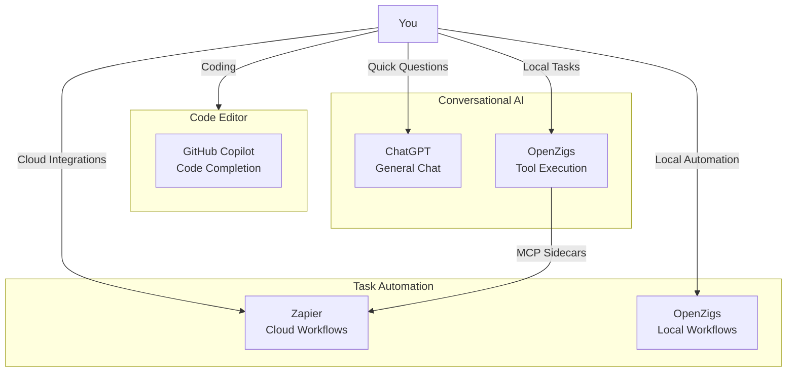

# OpenZigs vs. Other AI Assistants

**Last Updated:** February 8, 2026

This document compares OpenZigs to other AI assistant platforms to help you understand when OpenZigs is the right choice.

---

## Quick Comparison Table

| Feature | OpenZigs | ChatGPT | GitHub Copilot | AutoGPT | LangChain Agents |
|---------|----------|---------|----------------|---------|------------------|
| **Local-First** | ✅ Yes | ❌ Cloud only | ❌ Cloud only | ✅ Yes | ✅ Yes |
| **Human-in-the-Loop** | ✅ Risk-based | ❌ No | ❌ No | ⚠️ Partial | ⚠️ Partial |
| **Tool Execution** | ✅ MCP-based | ⚠️ Limited | ❌ No | ✅ Python-based | ✅ Custom tools |
| **Multi-Channel** | ✅ Web/Telegram/Discord | ✅ Web/Mobile | ✅ IDE only | ❌ CLI only | ❌ No built-in |
| **Document Intelligence** | 🚧 Planned Q3 2026 | ⚠️ Basic | ❌ No | ⚠️ Basic | ⚠️ Custom |
| **Workflow Automation** | 🚧 Planned Q4 2026 | ❌ No | ❌ No | ⚠️ Limited | ✅ Yes |
| **Containerized** | ✅ Docker Compose | N/A | N/A | ⚠️ Optional | ⚠️ Optional |
| **Session Persistence** | ✅ JSONL | ✅ Cloud sync | ✅ Cloud sync | ⚠️ Basic | ❌ No built-in |
| **Open Source** | ✅ MIT | ❌ Proprietary | ❌ Proprietary | ✅ MIT | ✅ MIT |
| **Audit Logging** | ✅ Full | ❌ No | ❌ No | ⚠️ Basic | ❌ No built-in |

Legend: ✅ Full support, ⚠️ Partial/Limited, ❌ Not supported, 🚧 In development

---

## Detailed Comparisons

### OpenZigs vs. ChatGPT

**When to choose OpenZigs:**
- You need **local execution** for privacy/security
- You want **full control** over tool permissions (approve/deny each action)
- You need to **integrate with local files** and shell commands
- You want **multi-channel access** (Web + messaging apps)
- You need **audit logs** for compliance

**When to choose ChatGPT:**
- You want the **simplest setup** (just sign in, no installation)
- You primarily need **conversational AI** without tool execution
- You're okay with **cloud-based** processing
- You want **mobile access** (official apps)

**Key Differences:**
```
OpenZigs:
✅ Runs locally in Docker
✅ You control which tools the AI can use
✅ High-risk actions require your approval
✅ All data stays on your machine (or private cloud)
✅ Extensible via MCP sidecars

ChatGPT:
✅ No installation needed
✅ Mobile apps for iOS/Android
✅ Larger context window (128K tokens)
⚠️ Limited tool execution (web search, code interpreter)
⚠️ Data sent to OpenAI's servers
```

---

### OpenZigs vs. GitHub Copilot

**When to choose OpenZigs:**
- You need an AI assistant for **general tasks** (not just coding)
- You want **tool execution** (file operations, web search, shell commands)
- You need **multi-channel access** (not just your IDE)
- You want to **automate workflows** beyond code completion

**When to choose GitHub Copilot:**
- You want **in-editor code completion** (autocomplete, inline suggestions)
- You primarily work **inside an IDE** (VS Code, JetBrains)
- You want the **simplest setup** for coding assistance

**Key Differences:**
```
OpenZigs:
✅ General-purpose AI assistant
✅ Tool execution (filesystem, shell, browser, social media)
✅ Works across multiple interfaces (Web, Telegram, Discord)
✅ Workflow automation (scheduled tasks, saved prompts)
✅ Built on Copilot SDK (same AI models)

GitHub Copilot:
✅ Best-in-class code completion
✅ Deeply integrated into IDEs
✅ Simpler setup (just an IDE extension)
⚠️ Code-focused only
⚠️ No tool execution
```

**Note:** OpenZigs **uses** the GitHub Copilot SDK for its AI reasoning, so you get the same high-quality models (GPT-4.1, Claude Sonnet), but with added tool execution and multi-channel capabilities.

---

### OpenZigs vs. AutoGPT

**When to choose OpenZigs:**
- You want **human approval** for high-risk actions (not fully autonomous)
- You need **production-ready** deployment (Docker, monitoring, audit logs)
- You want **multi-channel access** (Web UI + messaging apps)
- You need **scheduled automation** and **saved workflows**

**When to choose AutoGPT:**
- You want **fully autonomous** agent behavior (no approvals)
- You're comfortable with **experimental, research-focused** software
- You prefer **Python-based** extensibility
- You want to run **long-running autonomous tasks** (hours/days)

**Key Differences:**
```
OpenZigs:
✅ Human-in-the-loop for safety (approve/deny high-risk actions)
✅ Production-ready (Docker, health checks, audit logs)
✅ Multi-channel (Web, Telegram, Discord)
✅ MCP-based tools (standardized protocol)
✅ Session persistence (JSONL + SQLite)

AutoGPT:
✅ Fully autonomous (runs without user input)
✅ Python-based plugins
⚠️ Experimental/research-focused
⚠️ CLI-only interface
⚠️ Less production-ready
```

---

### OpenZigs vs. LangChain Agents

**When to choose OpenZigs:**
- You want a **complete application** (not a library to build on)
- You need **out-of-the-box tools** (filesystem, browser, social media)
- You want **multi-channel deployment** without writing code
- You need **human-in-the-loop** safety controls built-in

**When to choose LangChain:**
- You're **building a custom AI application** from scratch
- You need **maximum flexibility** in tool design and orchestration
- You're comfortable with **Python development**
- You want to **embed agents** into your existing app

**Key Differences:**
```
OpenZigs:
✅ Complete application (install and run)
✅ Pre-built tools and integrations
✅ Multi-channel UI (Web, Telegram, Discord)
✅ Human-in-the-loop safety built-in
✅ TypeScript/Node.js

LangChain:
✅ Python library (maximum flexibility)
✅ Build custom tools and chains
✅ Huge ecosystem of integrations
⚠️ You build the UI and safety controls
⚠️ More development effort required
```

---

## Use Case Matrix

| Use Case | Best Choice | Why |
|----------|-------------|-----|
| **Code completion in IDE** | GitHub Copilot | Deeply integrated, real-time suggestions |
| **General chat assistant** | ChatGPT | Simplest setup, mobile apps |
| **Local file automation** | OpenZigs | Local execution, human approval, audit logs |
| **Social media posting** | OpenZigs | Built-in social media MCP sidecars |
| **Document processing** | OpenZigs (Q3 2026) | OCR, semantic search, multi-format support |
| **Fully autonomous tasks** | AutoGPT | No human approval needed |
| **Custom AI app development** | LangChain | Library for building, not a product |
| **Team productivity automation** | OpenZigs (Q4 2026) | Workflow builder, email/calendar integration |
| **Research & experimentation** | AutoGPT or LangChain | Flexible, research-focused |
| **Enterprise compliance** | OpenZigs (Q3 2027) | Audit logs, SSO, multi-user, GDPR |

---

## Migration Paths

### From ChatGPT to OpenZigs

If you're currently using ChatGPT and want more control:

1. **Install OpenZigs** (see [User Guide](USER_GUIDE.md))
2. **Connect your Telegram bot** (optional, for mobile-like access)
3. **Enable tools gradually** (start with low-risk tools like `read-file`, `web-search`)
4. **Approve high-risk actions** (OpenZigs will ask before writing files or running commands)

**You retain:**
- Conversational AI (same models via Copilot SDK)
- Chat history (session persistence)

**You gain:**
- Local execution (data stays on your machine)
- Tool execution (filesystem, browser, shell)
- Human-in-the-loop safety
- Audit logging

### From AutoGPT to OpenZigs

If you're using AutoGPT but want more production-ready tooling:

1. **Deploy OpenZigs via Docker** (`docker compose up -d`)
2. **Migrate your custom tools** to MCP sidecars (see [Architecture](ARCHITECTURE.md#mcp-host-architecture))
3. **Configure approval settings** (set `riskLevel: "low"` for auto-approved tools)
4. **Set up monitoring** (audit logs, health checks)

**You retain:**
- Autonomous task execution (set tools to `riskLevel: "low"`)
- Custom tools (via MCP sidecars)

**You gain:**
- Production deployment (Docker, Cloudflare Tunnel)
- Multi-channel access (Web, Telegram, Discord)
- Human-in-the-loop when needed
- Session persistence
- Audit logs

### From LangChain to OpenZigs

If you've built a LangChain agent and want to reduce maintenance:

1. **Package your custom tools** as MCP servers (see [MCP SDK](https://github.com/modelcontextprotocol/sdk))
2. **Deploy OpenZigs** and register your MCP sidecars in `docker-compose.yml`
3. **Test tool execution** via the Web Chat UI
4. **Decommission your custom UI** (use OpenZigs Web/Telegram/Discord)

**You retain:**
- Custom tool logic (via MCP sidecars)
- Flexibility (MCP protocol is extensible)

**You gain:**
- No UI development needed
- Multi-channel support
- Session persistence
- Audit logs
- Human-in-the-loop

---

## Ecosystem Integration

OpenZigs is designed to **complement**, not replace, other tools:



**Recommended Setup:**
- **GitHub Copilot** for code completion in your IDE
- **ChatGPT** for quick questions on mobile
- **OpenZigs** for tool execution, local automation, and document processing
- **Zapier/Make** for cloud-based workflows (can integrate with OpenZigs via webhooks)

---

## Future Positioning

As OpenZigs evolves, it will become more competitive in these areas:

| Area | Current | Q2 2026 | Q3 2026 | Q4 2026 |
|------|---------|---------|---------|---------|
| **vs ChatGPT** | Tool execution | Memory system | Document intelligence | - |
| **vs AutoGPT** | Production-ready | Contextual awareness | Knowledge base | Workflow automation |
| **vs LangChain** | Complete app | Proactive tasks | Semantic search | Visual workflow builder |

See [ROADMAP.md](ROADMAP.md) for detailed timelines.

---

## Frequently Asked Questions

### Can I use OpenZigs alongside ChatGPT?

**Yes!** Many users do. Use ChatGPT for quick questions on mobile, and OpenZigs for tasks requiring tool execution (file operations, shell commands, social media posting).

### Can I use OpenZigs with GitHub Copilot?

**Yes!** OpenZigs is **built on** the GitHub Copilot SDK, so they're complementary:
- Use **GitHub Copilot** in your IDE for code completion
- Use **OpenZigs** for general tasks, file automation, and workflow orchestration

Both require a GitHub Copilot subscription.

### Is OpenZigs faster than ChatGPT?

**Depends on the task:**
- **Conversational AI:** Similar speed (both use frontier models)
- **Tool execution:** OpenZigs is faster (runs locally, no round-trip to cloud)
- **File operations:** OpenZigs is **much faster** (direct filesystem access)

### Can I run OpenZigs in the cloud?

**Yes!** Deploy the Docker Compose stack on any cloud provider (AWS, GCP, Azure). The "local-first" philosophy means you control where it runs — not that it must run on your laptop.

### Will OpenZigs replace AutoGPT?

**Different goals:**
- **AutoGPT:** Fully autonomous research agent (experimental)
- **OpenZigs:** Practical, production-ready assistant with human oversight

If you want maximum autonomy, stick with AutoGPT. If you want a reliable daily-driver assistant, choose OpenZigs.

---

*Have questions? Open an issue on [GitHub](https://github.com/mgcronin/openzigs/issues) or join our Discord (coming Q2 2026).*
