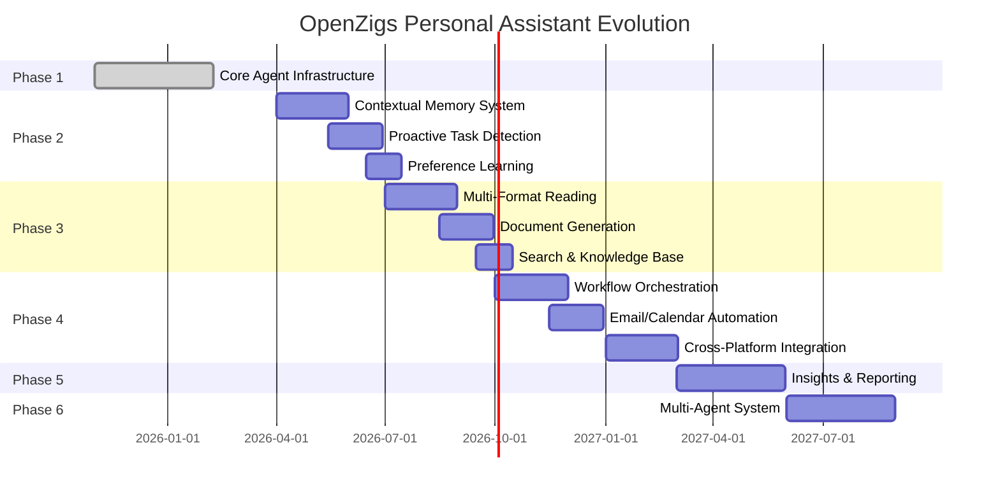

# OpenZigs Implementation Timeline

**Last Updated:** February 8, 2026  
**Planning Horizon:** 18 months (Q1 2026 - Q3 2027)

---

## Timeline Overview



---

## Detailed Quarter-by-Quarter Plan

### Q1 2026 (Jan - Mar) ✅ COMPLETE

**Epic 1: Core Agent Infrastructure**

| Week | Milestone | Status |
|------|-----------|--------|
| W1-2 | TypeScript project setup, MCP integration | ✅ Done |
| W3-4 | Tool registry, CopilotClient wrapper | ✅ Done |
| W5-6 | Session management, human-in-the-loop | ✅ Done |
| W7-8 | Multi-channel support (Web, Telegram, Discord) | ✅ Done |
| W9-10 | Productivity engine (prompts, scheduler) | ✅ Done |
| W11-12 | Containerization, Cloudflare Tunnel | ✅ Done |

**Deliverables:**
- [x] Working agent with 79 tests
- [x] 4 built-in tool categories
- [x] 5 MCP sidecars (social + documents)
- [x] Docker Compose stack
- [x] Complete documentation

---

### Q2 2026 (Apr - Jun) 🚧 IN PLANNING

**Epic 2: Personal Assistant Core**

#### April 2026

| Week | Phase | Focus Areas | Key Deliverables |
|------|-------|-------------|------------------|
| W1-2 | 2.1 | Vector store research & selection | Architecture decision record (FAISS vs Qdrant) |
| W3-4 | 2.1 | Vector store integration | Embedding generation pipeline, semantic search API |
| W5-6 | 2.1 | User preference storage | SQLite schema, CRUD API, migration from config |
| W7-8 | 2.1 | Memory injection pipeline | Context retrieval on chat, relevance scoring |

**April Exit Criteria:**
- [ ] Vector store integrated and tested with 10K+ memories
- [ ] Semantic search returns results in <500ms
- [ ] User preferences migrated from config to SQLite
- [ ] Memory injection adds <200ms to response latency

#### May 2026

| Week | Phase | Focus Areas | Key Deliverables |
|------|-------|-------------|------------------|
| W1-2 | 2.1 | Privacy controls | "Forget this" command, retention policies, privacy dashboard |
| W3-4 | 2.2 | Intent recognition engine | Fine-tuned LLM for task extraction |
| W5-6 | 2.2 | Email/message parser | Extract tasks, deadlines, dependencies |
| W7-8 | 2.2 | Task suggestion UI | Web Chat overlay, Telegram/Discord keyboards |

**May Exit Criteria:**
- [ ] "Forget this" command removes memories from vector store
- [ ] Intent classifier achieves 80%+ accuracy on test corpus
- [ ] Task suggestions appear in Web Chat with approve/deny buttons

#### June 2026

| Week | Phase | Focus Areas | Key Deliverables |
|------|-------|-------------|------------------|
| W1-2 | 2.2 | Calendar integration | Google Calendar MCP, deadline detection |
| W3-4 | 2.2 | Smart reminders | Context-based notifications, snooze logic |
| W5-6 | 2.3 | User model training | Track approvals, detect communication style |
| W7-8 | 2.3 | Adaptive tool selection | Predict tools, auto-configure parameters |

**Q2 Exit Criteria:**
- [ ] Contextual memory system live in production
- [ ] Proactive task suggestions with 80%+ accuracy
- [ ] User model converges within 2 weeks
- [ ] 50%+ reduction in repetitive tool configuration

---

### Q3 2026 (Jul - Sep) 📋 PLANNED

**Epic 3: Advanced Document Intelligence**

#### July 2026

| Week | Phase | Focus Areas | Key Deliverables |
|------|-------|-------------|------------------|
| W1-2 | 3.1 | OCR integration | Tesseract setup, scanned document reading |
| W3-4 | 3.1 | Table extraction | Parse tables into JSON/CSV/Excel |
| W5-6 | 3.1 | Office suite - Excel | Read/write spreadsheets, formula execution |
| W7-8 | 3.1 | Office suite - PowerPoint | Slide generation, template application |

#### August 2026

| Week | Phase | Focus Areas | Key Deliverables |
|------|-------|-------------|------------------|
| W1-2 | 3.1 | Code formats | Jupyter execution, Markdown/HTML rendering, LaTeX compilation |
| W3-4 | 3.1 | Media files | Image analysis, audio transcription (Whisper) |
| W5-6 | 3.2 | Template engine | Reusable templates, variable interpolation |
| W7-8 | 3.2 | Format conversion | PDF/Word/Markdown/HTML converters |

#### September 2026

| Week | Phase | Focus Areas | Key Deliverables |
|------|-------|-------------|------------------|
| W1-2 | 3.2 | Collaborative editing | Track changes, version comparison |
| W3-4 | 3.3 | Local document indexing | File watcher, full-text search |
| W5-6 | 3.3 | Semantic search | Vector embeddings, cross-document Q&A |
| W7-8 | 3.3 | Cloud storage integration | Google Drive, Dropbox, OneDrive connectors |

**Q3 Exit Criteria:**
- [ ] Support 15+ document formats (read/write)
- [ ] OCR accuracy 95%+ on tables and text
- [ ] Semantic search <5s for 10K documents
- [ ] Real-time cloud storage sync

---

### Q4 2026 (Oct - Dec) 📋 PLANNED

**Epic 4: Productivity Automation**

#### October 2026

| Week | Phase | Focus Areas | Key Deliverables |
|------|-------|-------------|------------------|
| W1-2 | 4.1 | Workflow UI design | Figma mockups, user research |
| W3-4 | 4.1 | Visual workflow builder | Drag-and-drop nodes (React Flow) |
| W5-6 | 4.1 | Advanced triggers | Cron, calendar events, conditional triggers |
| W7-8 | 4.1 | Multi-step actions | Branching (if/else), loops, error handling |

#### November 2026

| Week | Phase | Focus Areas | Key Deliverables |
|------|-------|-------------|------------------|
| W1-2 | 4.1 | Workflow templates | 50+ pre-built templates |
| W3-4 | 4.2 | Email assistant | Auto-categorize, draft replies |
| W5-6 | 4.2 | Email task extraction | Extract tasks/events, add to calendar |
| W7-8 | 4.2 | Calendar intelligence | Auto-decline conflicts, optimal scheduling |

#### December 2026

| Week | Phase | Focus Areas | Key Deliverables |
|------|-------|-------------|------------------|
| W1-2 | 4.2 | Meeting prep & follow-up | Prep briefs, action item extraction |
| W3-4 | 4.3 | Project management integrations | Jira, Asana, GitHub (5 platforms) |
| W5-6 | 4.3 | Communication integrations | Slack, Teams, Zoom (5 platforms) |
| W7-8 | 4.3 | Finance integrations | QuickBooks, Expensify (3 platforms) |

**Q4 Exit Criteria:**
- [ ] 100+ workflow templates available
- [ ] 75%+ reduction in email triage time
- [ ] 20+ platform integrations
- [ ] 99%+ workflow success rate

---

### Q1 2027 (Jan - Mar) 🔮 FUTURE

**Epic 5: Intelligent Insights & Reporting**

| Month | Focus | Deliverables |
|-------|-------|--------------|
| January | Personal productivity analytics | Time tracking, completion rates, focus patterns dashboard |
| February | Team collaboration insights | Communication frequency, blocker detection |
| March | Automated reporting | Weekly summaries, NL data queries, anomaly detection |

**Q1 2027 Exit Criteria:**
- [ ] Personal productivity dashboard live
- [ ] Natural language data queries ("Show me Q4 sales by region")
- [ ] Automated weekly reports

---

### Q2 2027 (Apr - Jun) 🔮 FUTURE

**Epic 6: Multi-Agent Collaboration**

| Month | Focus | Deliverables |
|-------|-------|--------------|
| April | Agent marketplace infrastructure | Registry, discovery, installation |
| May | Specialized agents | Legal review, code review, design feedback agents |
| June | Inter-agent communication | Delegation protocol, accountability tracking |

**Q2 2027 Exit Criteria:**
- [ ] Agent marketplace with 10+ community agents
- [ ] Delegation system with handoff tracking
- [ ] Agent performance metrics

---

### Q3 2027 (Jul - Sep) 🔮 FUTURE

**Epic 7: Enterprise Readiness**

| Month | Focus | Deliverables |
|-------|-------|--------------|
| July | Multi-user & workspaces | User isolation, team resources |
| August | SSO & compliance | SAML, SOC 2, GDPR logging |
| September | High availability | Horizontal scaling, load balancing |

**Q3 2027 Exit Criteria:**
- [ ] Multi-user deployment tested with 100+ users
- [ ] SOC 2 compliance achieved
- [ ] 99.9% uptime SLA

---

## Resource Allocation

### Team Structure (Current)

| Role | Allocation | Focus |
|------|------------|-------|
| Lead Developer | 100% | Architecture, core features |
| Community Contributors | Variable | Bug fixes, documentation, tools |

### Team Structure (Target by Q3 2026)

| Role | Allocation | Focus |
|------|------------|-------|
| Lead Developer | 80% code, 20% planning | Core agent features |
| ML Engineer | 100% | Memory system, preference learning |
| Frontend Developer | 100% | Workflow builder, Web UI |
| Integration Engineer | 100% | MCP sidecars, platform integrations |
| Technical Writer | 50% | Documentation, tutorials |

---

## Risk Management

### High-Risk Items

| Risk | Impact | Mitigation | Owner |
|------|--------|------------|-------|
| Vector store performance at scale | High | Early load testing, benchmark at 100K memories | ML Engineer |
| LLM task extraction accuracy | Medium | Curated training set, human-in-loop for low-confidence | ML Engineer |
| OAuth complexity for 20+ integrations | Medium | Reusable auth library, OAuth playground | Integration Engineer |
| Workflow builder UX complexity | High | User testing at each milestone, iterative design | Frontend Developer |
| Cloud storage API rate limits | Low | Implement exponential backoff, caching | Integration Engineer |

---

## Success Metrics (Cumulative)

| Metric | Q1 2026 | Q2 2026 | Q3 2026 | Q4 2026 | Q2 2027 |
|--------|---------|---------|---------|---------|---------|
| Active Users | 100 | 1,000 | 5,000 | 10,000 | 25,000 |
| Document Formats | 2 | 5 | 15 | 20 | 25 |
| Workflow Templates | 0 | 10 | 50 | 100 | 150 |
| Platform Integrations | 4 | 8 | 15 | 20 | 30 |
| Avg Time Saved (hrs/week) | 2 | 5 | 8 | 10 | 12 |
| Test Coverage | 79% | 82% | 85% | 88% | 90% |

---

## Communication Plan

### Internal Updates

- **Weekly:** Engineering standup (Mon 9am)
- **Bi-weekly:** Demo to stakeholders (Fri 2pm)
- **Monthly:** Roadmap review and prioritization

### External Updates

- **Quarterly:** Blog post with release highlights
- **Monthly:** GitHub Discussions post with progress update
- **Continuous:** GitHub Issues for feature requests and bugs

### Community Engagement

- **Beta Program:** Launch in Q2 2026 for early feature access
- **Discord Server:** Community support and feedback (launch Q2 2026)
- **Video Tutorials:** YouTube series (1 video per major feature)

---

## Appendix: Dependencies & Prerequisites

### Phase 2 Dependencies

```bash
# Vector store
npm install faiss-node  # or @qdrant/qdrant-js

# Embeddings
npm install @langchain/openai

# User model
npm install --save-dev @types/better-sqlite3
```

### Phase 3 Dependencies

```bash
# OCR
npm install tesseract.js

# Audio transcription
npm install whisper-node

# Office formats
npm install xlsx pptxgenjs officegen

# PDF manipulation
npm install pdf-lib

# Cloud storage
npm install @googleapis/drive dropbox-v2-api
```

### Phase 4 Dependencies

```bash
# Workflow engine
npm install @temporalio/client  # optional

# Job queue
npm install ioredis bull

# Integrations
npm install jira-client @slack/web-api @microsoft/microsoft-graph-client
```

---

*This timeline is a living document and will be updated quarterly based on progress and changing priorities.*
