# User Guide

## Table of Contents

- [Prerequisites](#prerequisites)
- [Installation](#installation)
- [First-Time Authentication](#first-time-authentication)
- [Using the Web UI](#using-the-web-ui)
  - [Chat](#chat)
  - [Smart Input (IntelliSense Autocomplete)](#smart-input-intellisense-autocomplete)
  - [Approval Prompts](#approval-prompts)
  - [Dashboard](#dashboard)
  - [Admin](#admin)
  - [Skills](#skills)
  - [Library (Saved Prompts)](#library-saved-prompts)
  - [Scheduler](#scheduler)
  - [Workbench (Project Editor)](#workbench-project-editor)
  - [Tasks (Background Agents)](#tasks-background-agents)
  - [Agent Switching & In-Session Subagents](#agent-switching--in-session-subagents)
  - [Visual Workflow Graph](#visual-workflow-graph)
  - [Studio: Capture & Trim](#studio-capture--trim)
  - [Studio → Pitch (AI Slide Decks)](#studio--pitch-ai-slide-decks)
- [Advanced: Agent Chaining Patterns](#advanced-agent-chaining-patterns)
- [Session Lifecycle & Infinite Context](#session-lifecycle--infinite-context)
- [Copilot SDK Session History & Analytics](#copilot-sdk-session-history--analytics)
- [Agent Memory](#agent-memory)
- [Tool Limit Configuration](#tool-limit-configuration)
- [Per-Entity Tool Scoping](#per-entity-tool-scoping)
- [Interactive Clarifications](#interactive-clarifications)
- [Model Selection](#model-selection)
- [File Attachments](#file-attachments)
- [Reasoning Effort](#reasoning-effort)
- [Context Fuel Gauge](#context-fuel-gauge)
- [Session Context Bar](#session-context-bar)
- [BYOK Provider (Bring Your Own Key)](#byok-provider-bring-your-own-key)
- [Custom Agents (Hierarchical Sub-Agents)](#custom-agents-hierarchical-sub-agents)
- [Native MCP Servers](#native-mcp-servers)
- [Enabling and Disabling Tools](#enabling-and-disabling-tools)
- [Connecting Telegram](#connecting-telegram)
- [Connecting Discord](#connecting-discord)
- [Chrome DevTools Setup](#chrome-devtools-setup)
- [Enabling Voice Features](#enabling-voice-features)
- [Docker Usage](#docker-usage)
- [Cloudflare Tunnel](#cloudflare-tunnel)
- [Productivity Tools](#productivity-tools)
- [Social Media Tools](#social-media-tools)
  - [Platform API Setup Guide](#platform-api-setup-guide)
- [Document Intelligence Tools](#document-intelligence-tools)
- [Personal Assistant Tools](#personal-assistant-tools)
- [Granular Tool Control](#granular-tool-control)
- [Creative Studio](#creative-studio)
- [Director Mode (Video Production)](#director-mode-video-production)
- [Director Studio & Advanced Compositing](#director-studio--advanced-compositing)
- [Video Pipeline Tools (OpusClip Feature Parity)](#video-pipeline-tools-opusclip-feature-parity)
- [Advanced Director Mode (Voice Cloning & Visual Injection)](#advanced-director-mode-voice-cloning--visual-injection)
- [Presenter Mode (Interactive Playback & Quizzes)](#presenter-mode-interactive-playback--quizzes)
- [Configuration Reference](#configuration-reference)
- [Advanced Examples: Combining Capabilities](#advanced-examples-combining-capabilities)
- [AI-Assisted Configuration (Workflow Wizard)](#ai-assisted-configuration-workflow-wizard)
- [Dry-Run & Job Testing](#dry-run--job-testing)
- [Enterprise Webhooks](#enterprise-webhooks)
- [Self-Aware Documentation](#self-aware-documentation)
- [Sentinel — Autonomous System Monitor](#sentinel--autonomous-system-monitor)
- [Knowledge Manager — Local Knowledge Base (RAG)](#knowledge-manager--local-knowledge-base-rag)
- [Social Brain — Unified Social Inbox & CRM](#social-brain--unified-social-inbox--crm)
- [Troubleshooting](#troubleshooting)
- [Secret Vault — Zero-Trust Credential Storage](#secret-vault--zero-trust-credential-storage)
- [Security Hardening](#security-hardening)
- [Telegram Notifications for Async Jobs](#telegram-notifications-for-async-jobs)
- [Firecrawl SEO Tools](#firecrawl-seo-tools)
- [Pinterest SEO Engine](#pinterest-seo-engine)
- [TikTok Content Publishing](#tiktok-content-publishing)
- [Research & Content Synthesis Engine](#research--content-synthesis-engine)
- [Media Queue & Asset Gallery](#media-queue--asset-gallery)
- [Lip Sync (Talking Head Pipeline)](#lip-sync-talking-head-pipeline)

---

## Prerequisites

Before you begin, ensure the following are installed and available:

| Requirement | Version | Purpose |
|---|---|---|
| **Node.js** | 22+ | Runtime for the agent server. |
| **pnpm** | 10+ | Package manager. |
| **GitHub Copilot Subscription** | Individual or Business | Required for SDK access. The agent authenticates via OAuth device flow using `@github/copilot-sdk`. |
| **Chrome** | Any recent version | Required only if you use the `browser-read` or `browser-navigate` tools. |
| **Docker Desktop** | Latest | *Optional.* Experimental containerized deployment (not fully tested). |

**Platform Support:**

| Platform | Status | Notes |
|---|---|---|
| **macOS (Apple Silicon)** | Full Support | All features including AI sidecars (Audio, Image Gen, Music, Video) |
| **macOS (Intel)** | Partial | Core features work; AI sidecars require Apple Silicon |
| **Linux** | Core Features | Native Node.js; AI sidecars not available (require Apple Silicon) |
| **Windows** | Core Features | Native Node.js; AI sidecars not available (require Apple Silicon) |

**Knowledge converter prerequisites (Local Knowledge Base):**

| Requirement | Purpose |
|---|---|
| **ffmpeg** | Required for media converter (`.mp4`, `.mp3`, etc.) to extract 16kHz WAV audio before transcription. |
| **ImageMagick** + **Ghostscript** | Required for scanned PDF OCR fallback (render PDF pages to images). |
| **Whisper model files** (`whisper-node`) | Required for the Node-side fallback media converter (when not using the local audio sidecar). Install with `pnpm exec whisper-node download`. |

**Optional API keys:**

| Key | Purpose |
|---|---|
| `BRAVE_API_KEY` | Enables the `web-search` tool (Brave Search API). |
| `TELEGRAM_BOT_TOKEN` | Connects the Telegram messaging channel. |
| `DISCORD_BOT_TOKEN` | Connects the Discord messaging channel. |
| `GITHUB_CLIENT_ID` | OAuth app client ID for the device-flow authentication. |
| `TUNNEL_TOKEN` | Cloudflare Tunnel token for the Docker sidecar (production). |
| `GOOGLE_APPLICATION_CREDENTIALS` | Path to Google Cloud service account JSON key file. Required for voice TTS. |
| `SOCIAL_WEBHOOK_VERIFY_TOKEN` | Verify token for Social Brain webhook subscriptions (Meta, TikTok, etc.). |
| `INSTAGRAM_ACCESS_TOKEN` | Instagram Graph API user access token (for comment ingestion, DMs, post context enrichment). |
| `INSTAGRAM_BUSINESS_ACCOUNT_ID` | Instagram Business Account ID (numeric, from Graph API). |
| `FACEBOOK_PAGE_TOKEN` | Facebook Page access token (for comment ingestion, Messenger DMs, post context enrichment). |
| `FACEBOOK_APP_ID` | Facebook App ID (shared by Instagram and Facebook MCP servers). |
| `FACEBOOK_APP_SECRET` | Facebook App Secret (shared by Instagram and Facebook MCP servers). |
| `FACEBOOK_PAGE_ID` | Facebook Page ID (numeric). Required for the Facebook polling adapter. |
| `TIKTOK_CLIENT_KEY` | TikTok OAuth Client Key (from [developers.tiktok.com](https://developers.tiktok.com)). Required for TikTok MCP tools. |
| `TIKTOK_CLIENT_SECRET` | TikTok OAuth Client Secret. |
| `TIKTOK_ACCESS_TOKEN` | TikTok access token (obtained via OAuth in Admin → TikTok panel). |

**Native MCP Server prerequisites (optional — only needed if using social, document, or personal assistant tools):**

| Requirement | Purpose |
|---|---|
| **Python 3.10+** | Social media MCP servers (Twitter, YouTube, LinkedIn, Reddit) and MarkItDown are Python-based. Each has its own virtualenv under `external/`. |
| **Java 17+ / JBang** | Required for the JDBC Database MCP server. [Install JBang](https://www.jbang.dev/download/). |
| **Platform API credentials** | Each social platform requires API credentials set as environment variables. See respective `README.md` in `external/`. |
| **Google Cloud OAuth credentials** | Required for Gmail MCP server. Create an OAuth app in Google Cloud Console. |
| **GitHub Personal Access Token** | Required for GitHub MCP server. Create at github.com/settings/tokens. |

---

## Installation

### 1. Clone the Repository

```bash
git clone https://github.com/openzigs/openzigs.git
cd openzigs
```

### 2. Install Dependencies

```bash
pnpm install
```

### 3. Configure Environment

Create a `.env` file at the repository root. Use the following template and fill in the values relevant to your setup:

```dotenv
# ── Required ──
GITHUB_CLIENT_ID=your-github-oauth-client-id

# ── Optional: Brave Search ──
BRAVE_API_KEY=your-brave-api-key

# ── Optional: Messaging Channels ──
TELEGRAM_BOT_TOKEN=your-telegram-bot-token
DISCORD_BOT_TOKEN=your-discord-bot-token

# ── Optional: Chrome DevTools ──
CHROME_DEBUG_HOST=localhost
CHROME_DEBUG_PORT=9222

# ── Optional: Cloudflare Tunnel (Docker sidecar) ──
TUNNEL_TOKEN=your-cloudflare-tunnel-token

# ── Optional: Voice Interface (Google Cloud TTS) ──
GOOGLE_APPLICATION_CREDENTIALS=/path/to/your/service-account-key.json

# ── Optional: Social Platform MCP Servers ──
# Twitter / X (API v2)
# TWITTER_BEARER_TOKEN=your-twitter-bearer-token
# TWITTER_API_KEY=your-twitter-api-key
# TWITTER_API_SECRET=your-twitter-api-key-secret
# YouTube (Data API v3 — API key for reads, OAuth token for write operations like replying to comments)
# YOUTUBE_API_KEY=your-youtube-api-key
# YOUTUBE_OAUTH_TOKEN=your-youtube-oauth-token
# LinkedIn (API v2)
# LINKEDIN_ACCESS_TOKEN=your-linkedin-access-token
# Reddit (OAuth2)
# REDDIT_CLIENT_ID=your-reddit-client-id
# REDDIT_CLIENT_SECRET=your-reddit-client-secret
# REDDIT_USERNAME=your-reddit-username
# REDDIT_PASSWORD=your-reddit-password
# TikTok (Official API v2 — OAuth from Admin panel)
# TIKTOK_CLIENT_KEY=your-tiktok-client-key
# TIKTOK_CLIENT_SECRET=your-tiktok-client-secret
# TIKTOK_ACCESS_TOKEN=  (set automatically via OAuth)
# TIKTOK_REFRESH_TOKEN= (set automatically via OAuth)

# ── Optional: Pinterest SEO ──
# PINTEREST_ACCESS_TOKEN=your-pinterest-api-v5-token
# PINTEREST_AD_ACCOUNT_ID=your-pinterest-ad-account-id

# ── Optional: Personal Assistant MCP Servers ──
# GMAIL_OAUTH_PATH=~/.gmail-mcp/gcp-oauth.keys.json
# GITHUB_PERSONAL_ACCESS_TOKEN=ghp_your_token_here
# JDBC_URL=jdbc:postgresql://localhost:5432/mydb
# DB_PASSWORD=your-db-password

# ── Optional: Social Brain ──
# SOCIAL_WEBHOOK_VERIFY_TOKEN=your-random-verify-token
# INSTAGRAM_ACCESS_TOKEN=your-ig-long-lived-user-access-token
# INSTAGRAM_BUSINESS_ACCOUNT_ID=your-ig-business-account-id
# FACEBOOK_PAGE_TOKEN=your-facebook-page-access-token
# FACEBOOK_APP_ID=your-facebook-app-id
# FACEBOOK_APP_SECRET=your-facebook-app-secret
# FACEBOOK_PAGE_ID=your-facebook-page-id

# ── Media Queue (Distributed GPU Nodes) ──
# Set to the primary Mac's LAN IP so remote worker nodes can POST callbacks back to it.
# Auto-detected from os.networkInterfaces() at startup if unset.
# QUEUE_CALLBACK_URL=http://192.168.1.50:3000/api/queue/complete

# ── Server ──
PORT=3000
```

### 4. Start the Server

**Development mode (with auto-reload):**

```bash
# Terminal 1: Start the backend
pnpm dev

# Terminal 2: Start the Next.js UI
cd ui && pnpm dev
```

**Production build:**

```bash
pnpm build
pnpm start

# Build and serve the UI separately
cd ui && pnpm build && pnpm start
```

**Docker (experimental — not fully tested):**

```bash
docker compose up -d
```

> **Note:** Docker deployment is experimental and incomplete. Only the main backend and audio sidecar are defined. The recommended approach is native deployment via `pnpm dev`.

The backend API starts at **http://localhost:3000** and the Next.js UI at **http://localhost:3001** by default. Access the UI at `http://localhost:3001`.

---

## Windows Installation

OpenZigs runs on Windows via native Node.js. AI sidecars (Audio, Image, Music, Video, LipSync) run in WSL2 Ubuntu with CUDA GPU acceleration. On machines without an NVIDIA GPU, all core features (chat, tools, tasks, scheduler, knowledge manager, etc.) still work — only media generation is unavailable. See [Windows Sidecar Management](#windows-sidecar-management-wslcuda) for setup.

### Quick Install (PowerShell)

1. Open PowerShell as Administrator
2. Run the installation script:

```powershell
# Download and run the installer
Invoke-WebRequest -Uri "https://raw.githubusercontent.com/openzigs/openzigs/main/install.ps1" -OutFile "install.ps1"
.\install.ps1
```

Or clone and run locally:

```powershell
git clone https://github.com/openzigs/openzigs.git
cd openzigs
.\install.ps1
```

### Manual Installation (Windows)

#### 1. Install Prerequisites

Using **winget** (Windows 11 / Windows 10 with App Installer):

```powershell
# Install Node.js
winget install --id OpenJS.NodeJS.LTS -e

# Install Git
winget install --id Git.Git -e

# Install pnpm
npm install -g pnpm
```

Or download manually:
- [Node.js 22+](https://nodejs.org/)
- [Git for Windows](https://git-scm.com/download/win)

#### 2. Clone the Repository

```powershell
git clone https://github.com/openzigs/openzigs.git
cd openzigs
```

#### 3. Configure Environment

```powershell
# Copy the example environment file
copy .env.example .env

# Edit with your preferred editor
notepad .env
```

#### 4. Start the Server

```powershell
# Terminal 1: Start the backend
pnpm dev

# Terminal 2: Start the UI
cd ui
pnpm dev
```

#### 5. Access the UI

Open **http://localhost:3001** in your browser.

### Production Build (Windows)

For a production build:

```powershell
# Build the backend
pnpm build
pnpm start

# In another terminal, build and start the UI
cd ui
pnpm build
pnpm start

# Start UI (Terminal 2)
cd ui
pnpm dev
```

### Windows Feature Availability

The following table shows what features are available on Windows. With WSL2 + CUDA sidecars,
all AI media features are now available on Windows machines with NVIDIA GPUs.

| Feature | Windows (native) | Windows (WSL+CUDA) | macOS (Apple Silicon) | Notes |
|---------|:-:|:-:|:-:|-------|
| **Core Chat & AI** | ✅ | ✅ | ✅ | Full Copilot SDK support |
| **MCP Tools** | ✅ | ✅ | ✅ | All built-in tools work |
| **Task Engine** | ✅ | ✅ | ✅ | Background tasks, pipelines |
| **Scheduler** | ✅ | ✅ | ✅ | Cron-based job scheduling |
| **Web UI** | ✅ | ✅ | ✅ | Full Next.js UI |
| **Telegram Channel** | ✅ | ✅ | ✅ | Bot integration |
| **Discord Channel** | ✅ | ✅ | ✅ | Bot integration |
| **Chrome DevTools** | ✅ | ✅ | ✅ | Browser automation |
| **Knowledge Manager** | ✅ | ✅ | ✅ | Document ingestion, RAG |
| **Social Brain** | ✅ | ✅ | ✅ | Social inbox, CRM |
| **Sentinel Monitor** | ✅ | ✅ | ✅ | Autonomous SRE |
| **Workbench Editor** | ✅ | ✅ | ✅ | Rich Markdown editing |
| **Prompt Library** | ✅ | ✅ | ✅ | Saved templates |
| **Web Search** | ✅ | ✅ | ✅ | Brave Search API |
| **Audio STT (Whisper)** | ❌ | ✅ | ✅ | WSL CUDA sidecar port 5006 |
| **Audio TTS (Kokoro/F5-TTS)** | ❌ | ✅ | ✅ | WSL CUDA sidecar port 5006 |
| **Image Generation (Flux)** | ❌ | ✅ | ✅ | WSL CUDA sidecar port 5005 |
| **Image Processing (upscale/rembg)** | ❌ | ✅ | ✅ | WSL CUDA sidecar port 5008 |
| **Music Generation (ACE-Step)** | ❌ | ✅ | ✅ | WSL CUDA sidecar port 5009 |
| **Music Studio (Demucs/Seed-VC)** | ❌ | ✅ | ✅ | WSL CUDA sidecar port 5010 |
| **Video Generation (LTX)** | ❌ | ✅ | ✅ | WSL CUDA sidecar port 5007 |
| **Lip Sync (LatentSync)** | ❌ | ✅ | ✅ | WSL CUDA sidecar port 5010 |
| **Voice Cloning (F5-TTS)** | ❌ | ✅ | ✅ | Part of audio sidecar |
| **Director Mode (Video)** | ⚠️ | ✅ | ✅ | Render requires sidecars |
| **Gallery (Media Creation)** | ⚠️ | ✅ | ✅ | Generation requires sidecars |

**Legend**: ✅ Full support | ⚠️ Partial (UI works, generation unavailable) | ❌ Not available

> **Note**: LipSync and Music Studio share port 5010 — only one can run at a time.
> Use `media-ctl.ps1` to switch between them.

### Windows Sidecar Management (WSL+CUDA)

If you have an NVIDIA GPU and WSL2 Ubuntu, you can run all AI sidecars via the `media-ctl.ps1` script:

```powershell
# Check status of all sidecars
.\scripts\media-ctl.ps1 status

# Individual sidecar control
.\scripts\media-ctl.ps1 flux status          # FluxQ image gen (port 5005)
.\scripts\media-ctl.ps1 audio restart        # Kokoro/F5-TTS (port 5006)
.\scripts\media-ctl.ps1 ltx logs             # LTX video gen (port 5007)
.\scripts\media-ctl.ps1 imgproc health       # Image processing (port 5008)
.\scripts\media-ctl.ps1 music restart        # ACE-Step music (port 5009)
.\scripts\media-ctl.ps1 lipsync restart      # LatentSync (port 5010)
.\scripts\media-ctl.ps1 studio restart       # Music Studio (port 5010, replaces lipsync)

# Bulk operations
.\scripts\media-ctl.ps1 restart-all          # Restart all sidecars
.\scripts\media-ctl.ps1 stop-all             # Stop all sidecars
.\scripts\media-ctl.ps1 sync-all             # Sync code from repo to WSL deploy dir

# Code sync (after editing sidecar code)
.\scripts\media-ctl.ps1 audio sync           # rsync audio sidecar to WSL
.\scripts\media-ctl.ps1 audio restart        # restart with new code
```

Available services: `flux`, `audio`, `ltx`, `imgproc`, `music`, `lipsync`, `studio`
Available actions: `logs`, `status`, `health`, `restart`, `stop`, `sync`, `generate`

### Windows-Specific Notes

1. **Path Differences**: Windows uses backslashes (`\`) in paths. The application handles this automatically, but when configuring file paths in `.env`, use forward slashes or escape backslashes:
   ```
   GOOGLE_APPLICATION_CREDENTIALS=C:/Users/YourName/.openzigs/service-account.json
   ```

2. **Data Directory**: OpenZigs stores data in `%USERPROFILE%\.openzigs\` (typically `C:\Users\YourName\.openzigs\`)

3. **Chrome DevTools**: To use browser automation tools, launch Chrome with remote debugging:
   ```powershell
   & "C:\Program Files\Google\Chrome\Application\chrome.exe" --remote-debugging-port=9222
   ```

4. **Media Generation Alternatives**: For AI media generation on Windows, consider:
   - **Cloud APIs**: Use external image/audio/video generation APIs
   - **Remote macOS Worker**: Run sidecars on a Mac and connect via network
   - **WSL2**: Run the full stack in Windows Subsystem for Linux

5. **WSL Alternative**: You can also run OpenZigs in WSL2 (Windows Subsystem for Linux) for a Unix-like experience:
   ```bash
   # In WSL2 terminal
   git clone https://github.com/openzigs/openzigs.git
   cd openzigs
   ./install.sh
   ```

### Uninstalling (Windows)

```powershell
.\uninstall.ps1
```

Or manually:

```powershell
cd $env:USERPROFILE\.openzigs
docker compose down -v
cd ..
Remove-Item -Recurse -Force .openzigs
```

---

## First-Time Authentication

On first launch, the agent must authenticate with GitHub Copilot:

1. Run the interactive setup wizard:

   ```bash
   pnpm setup
   ```

2. The CLI prints a device code and a URL:

   ```
   Visit: https://github.com/login/device
   Enter code: ABCD-1234
   ```

3. Open the URL in your browser, enter the code, and authorize the application.

4. Once authorized, the token is saved to `~/.openzigs/auth.json` with restricted file permissions (`0600`).

You only need to do this once. The token persists across restarts.

---

## Using the Web UI

The OpenZigs UI is a **Next.js** application with a navigation bar providing access to the following pages:

| Page | URL | Purpose |
|---|---|---|
| **Dashboard** | `/` | System snapshot, pending approvals, audit log |
| **Chat** | `/chat` | AI chat with streaming, model selection, approval overlays |
| **Workbench** | `/workbench` | Rich Markdown editor with file browser for drafting and editing documents |
| **Admin** | `/admin` | Channel config, sidecar management, tool toggles, env status |
| **Library** | `/library` | Saved prompt templates with `{{variable}}` interpolation |
| **Scheduler** | `/scheduler` | Cron-based job scheduling with prompt linking and model overrides |
| **Tasks** | `/tasks` | Monitor background agent tasks, sub-agents, and scheduled work |
| **Social Brain** | `/social` | Unified social inbox, CRM, automation rules, and AI-powered auto-replies |
| **Post-Actions** | `/admin/post-actions` | Create and manage custom post-action types for pipeline stages |
| **Webhooks** | `/admin/webhooks` | Create and manage inbound webhooks for external integrations |
| **Models / Capabilities** | `/admin/models` | Live LTX worker introspection — pooled VRAM across GPUs, per-device free/total, pooling status (transformer / encoder / VAE placement), per-model max-frames, sync-audio support, and audio modes available. Surfaces sidecar errors when the worker is offline. |
| **Gallery** | `/gallery` | Asset gallery for generated images, videos, and audio; inline creation studio for txt2img, img2img, txt2video, img2video, txt2music. The studio composer exposes an **Audio mode** selector (Off / Auto via MMAudio v2a / Music via ACE-Step / Sync via LTX-2 native — Sync is gated on a 24 GB+ pooled VRAM LTX-2 model) and a **Duration mode** toggle (Single shot up to 4 s, or Extended 5–60 s rendered as stitched 4 s shots). |
| **Music Studio** | `/music-studio` | AI Voice2Voice pipeline &amp; Smart Remix Lab — stem separation, voice conversion, instrument replacement, and auto-mastering |
| **Director** | `/director` | AI video production wizard, blog-to-YouTube, timeline studio, and capture & trim |
| **Director Studio** | `/director/studio/[id]` | Full timeline editor with player preview, scene inspector, drag-and-drop reordering, and YouTube direct publishing |
| **Content Calendar** | `/calendar` | Visual FullCalendar content schedule synced with Outbox — drag-to-reschedule, click-to-edit, upcoming events panel |
| **Inpainting Studio** | `/inpainting` | Canvas-based AI image editing — paint a mask, describe the change, queue Flux Kontext inpainting via the media queue |
| **Outbox** | `/outbox` | Scheduled social post queue — review, edit, and publish pending outbox items across platforms |
| **SEO Suite** | `/seo` | Consolidated SEO dashboard — site audits, gap analysis, competitive monitoring, data extraction, link graphs, health scoring, and report exports |

### Chat

1. Navigate to **http://localhost:3001/chat**.


2. The chat interface includes:
   - A **model selector** dropdown in the header.
   - A **reasoning effort selector** (dot-based radio buttons) — visible only when a reasoning-capable model is selected (e.g., `o1`, `o3`, `o4-mini`).
   - A **provider badge** — shows when a non-Copilot BYOK provider is active.
   - A **context fuel gauge** — compact progress bar showing real-time context window usage (green → yellow → orange → red). Pulses during context compaction. Hover for exact token count.
   - A **connection indicator** (green = connected).
   - A **session context bar** below the header showing session ID, context gauge, turn count, session age, and compaction status.
   - A **message input** area at the bottom with **IntelliSense autocomplete**, **file attachment button**, and **drag-and-drop file zone**.

3. Type a message and press **Enter** (or click **Send**).


4. The assistant responds in real time via streaming — text appears word-by-word as the model generates it.


5. During execution, the agent may display an **interactive clarification prompt** — either a set of radio-button choices or a free-text input — to gather additional information before continuing.

### Smart Input (IntelliSense Autocomplete)

The chat input features trigger-based autocomplete for fast access to tools, saved prompts, and models. Type a trigger character to open the autocomplete popover:

| Trigger | Category | What it shows |
|---------|----------|---------------|
| `/` | Prompts | Saved prompt templates from the Library |
| `#` | Tools | All enabled MCP tools by name |
| `@` | Models | Available Copilot models |
| `!` | Skills | Available AI skill personas with descriptions |

**Keyboard shortcuts:**

| Key | Action |
|-----|--------|
| `/`, `#`, `@`, `!` | Open autocomplete (after whitespace or at start of input) |
| ↑ / ↓ | Navigate the autocomplete list |
| Enter | Select the highlighted item |
| Escape | Dismiss the popover |
| Arrow Up (at start of input, no popover) | Scroll through command history |
| Arrow Down (in history mode) | Navigate forward in history |
| Shift + Enter | Insert a new line |


When you select an item from the autocomplete, its name is inserted into the input field. For example, typing `#web-` and selecting `web-search` inserts `web-search` at the cursor position.

### Approval Prompts

If the agent calls a high-risk tool (e.g., writing a file or running a shell command), an approval overlay appears:

- **Tool name** and **explanation** are shown.
- Click **Approve** to allow the action, or **Deny** to block it.
- The first approval (from any connected channel) wins.

### Dashboard


The dashboard at `/` provides:

- **Snapshot stats** — total enabled tools, pending approvals, active sessions.
- **Pending approvals** — approve or deny high-risk tool calls inline.
- **Audit log** — filterable log of tool calls, auth events, and system changes with CSV export.

### Admin


The admin page at `/admin` consolidates all configuration:

- **Channels** — Configure Telegram and Discord tokens, toggle channels on/off, select default model.
- **AI Personality** — Configure the system instruction and optional pre/post prompts, or disable injection globally. Set the **mode** to `append` (merge your personality with SDK defaults) or `replace` (fully override the system prompt with your personality text). A warning banner is displayed when replace mode is selected, and the prompt preview reflects the selected mode. When a brand voice is active, an indicator is shown at the top of the personality panel.
- **Brand Voice** — Analyze your writing samples to extract a reproducible style rulebook. Paste one or more writing samples (separated by `---`), give it a name, and click "Analyze & Save". The AI extracts your tone, sentence structure, vocabulary level, formatting quirks, and banned words into a rulebook. You can create multiple brand voices, expand any voice to view or edit its rulebook inline, and activate one at a time. The active brand voice is automatically injected into video storyboards, social brain replies, and blog-to-video pipelines.

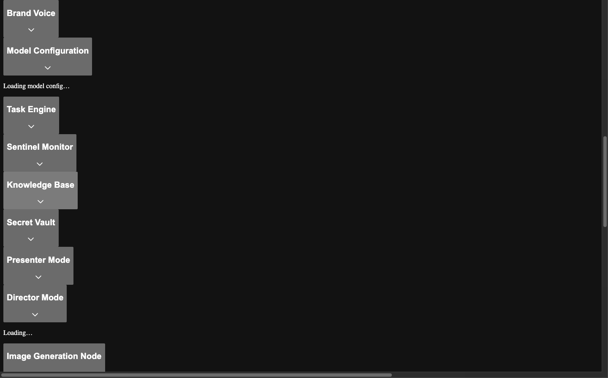


- **Model Configuration** — Set the default reasoning effort (Low / Medium / High / xHigh) for reasoning models. Enable **BYOK (Bring Your Own Key)** to configure a custom provider (OpenAI, Azure, Anthropic, Ollama, or Custom) with base URL, API key (masked by default), and optional Azure API version. Test the connection before saving, or clear the provider to revert to GitHub Copilot. Set a **Background Task Default Model** to automatically assign a cost-effective model to all non-interactive (cron, webhook, agent-spawned) tasks that don't specify their own model.
- **Task Engine** — Adjust the maximum concurrent background agents (1–10) at runtime, view live queue stats (running, queued, concurrency limit). Configure the **tool limit per request** (1–128) to control how many tools are sent to the LLM in each call — see [Tool Limit Configuration](#tool-limit-configuration) below.


- **Custom Agents** — Create, edit, and delete custom agent archetypes. Each agent has a name (identifier), display name, description, system prompt, tool allowlist (multi-select grouped by category), and auto-invoke toggle. Agents are displayed as cards with tool badges and infer indicators.


- **MCP Servers** — View and manage all 12 native MCP servers (social platforms, document tools, personal assistant, developer tools). See live running status for each server, toggle individual tools on/off, and define server connections (Local stdio, HTTP, SSE). Local servers are configured with a command, arguments, working directory, and masked environment variables. HTTP/SSE servers are configured with a URL and optional headers. Each server has a configurable timeout.
- **Tools** — Toggle any tool on/off, view risk level badges (🟢 low, 🟡 medium, 🔴 high), grouped by category. Each tool also has a **🔓/🔒 global approval lock** toggle — see [Global Tool Approval Lock](#global-tool-approval-lock).


- **Environment** — Status grid showing which environment variables are configured vs. missing.

### Skills

Skills are the easiest way to use OpenZigs. They are specialized AI personas that give the agent domain expertise, tool routing knowledge, and behavioral rules — so **you don't need to know which tools to use**. Just describe what you want in natural language, and the skill handles tool selection, error recovery, and workflow orchestration automatically.

Skills follow the [agentskills.io](https://agentskills.io) open standard and are defined as `SKILL.md` files with YAML frontmatter. They are loaded into every agent session via the Copilot SDK's `skillDirectories` configuration.

#### Skills vs. Tools vs. Prompts

Understanding when to use each:

| Feature | What it is | Who it's for | When to use |
|---------|-----------|-------------|-------------|
| **Skills** | Passive AI personas always loaded into sessions | Everyone | Always — skills activate automatically when your request matches their domain |
| **Tools** | Specific callable functions (e.g., `submit-media-job`) | Power users | When you need fine-grained control over a specific operation |
| **Prompts (Library)** | Reusable templates with variables | Everyone | When you repeat the same workflow often |
| **Prompts + Skills** | Templates paired with a Suggested Skill | Recommended | Best of both worlds — repeatable workflows with domain expertise |

**Key insight**: Skills abstract away tool knowledge. A prompt like "Create a thumbnail for my video" requires knowing tool names (`submit-media-job`, `manage-characters`, `query-gallery-assets`). With skills, just type that sentence — the Media Director skill knows which tools to call and in what order.

#### Available Skills

| Skill | Description | Example Prompts |
|-------|-------------|-----------------|
| **Media Director** 🎬 | Creates images (Flux), videos with audio (LTX-2), audio (F5-TTS), music (ACE-Step). Handles character LoRA identity. | "Create a 4-second cyberpunk video with audio" / "Generate a portrait with character Alex" / "Show images from this week" |
| **Remix Engineer** 🎵 | Audio stem separation, AI instrument replacement, and auto-mastering via the Remix Lab pipeline. | "Remix my track — replace drums with strings" / "Analyze stems of yesterday's upload" / "Master with a warm lofi vibe" |
| **Platform Manager** 📡 | Scheduling, social media publishing (Twitter, LinkedIn, YouTube, Reddit, TikTok), knowledge base ops. | "Schedule a daily Twitter post at 9am" / "Publish the latest image to Twitter" / "List all scheduled jobs" |
| **Content Creator** ✍️ | Blog-to-video, voiceovers (54+ voices), YouTube Shorts, brand voice enforcement. | "Convert this blog to a narrated video" / "Create a Short from the latest upload" / "Use the warm female voice" |
| **Knowledge Curator** 📚 | RAG knowledge base ingestion, semantic search, presentation management, quiz generation. | "Ingest this article" / "Search for machine learning content" / "Generate a quiz for chapter 3" |
| **System Operator** 🛡️ | Sentinel SRE monitoring, webhook management, worker node health, system diagnostics. | "Check all worker node health" / "Show the latest Sentinel digest" / "Create a CI/CD webhook" |
| **Research Synthesizer** 🔬 | Autonomous web + YouTube research, inline-cited document synthesis, optional media generation. | "Research the top AI coding assistants in 2026" / "Compare cloud providers with images" / "Write a report on renewable energy trends" |

#### Usage Examples

##### Example 1: Creating a Social Media Campaign (Platform Manager + Content Creator)

```
You: Create a motivational image with a sunrise background, add the text
"New beginnings start now", then schedule it to post to LinkedIn and
Twitter every Monday at 8am.
```

What happens behind the scenes:
1. **Media Director** skill activates → calls `submit-media-job` with a Flux image generation job
2. **Platform Manager** skill activates → calls `schedule-job` with cron `0 8 * * 1`
3. The AI chains social publishing tools for LinkedIn and Twitter into the scheduled job
4. You get confirmation with the schedule and a preview of the generated image

##### Example 2: Remixing a Track (Remix Engineer)

```
You: Take my latest audio upload and remix it — replace the drums with
a marimba and the bass with strings. Then master it with a cinematic vibe.
```

What happens:
1. **Remix Engineer** skill activates → calls `query-gallery-assets` to find latest audio
2. Calls `remix-session-manager` with `action: "analyze"` to separate 6 stems
3. Calls `remix-session-manager` with `action: "replace_stem"` for drums → marimba
4. Calls `remix-session-manager` with `action: "replace_stem"` for bass → strings
5. Calls `remix-session-manager` with `action: "master"` with vibe `cinematic_wide`
6. Reports completion with the mastered audio file

##### Example 3: Building a Knowledge Base (Knowledge Curator)

```
You: Ingest this YouTube video about React Server Components, then create
a quiz about the key concepts.
```

What happens:
1. **Knowledge Curator** skill activates → calls `ingest-youtube` to download and transcribe
2. Calls `manage-knowledge-base` to ingest the transcript
3. Calls `manage-presentations` with `action: "generate_quiz"` for the content
4. Returns the quiz questions for review

##### Example 4: Error Recovery in Action (Media Director)

```
You: Generate a 4K portrait of character Luna
```

If the worker node is busy:
1. Media Director calls `submit-media-job` → fails with "worker busy"
2. Skill retries once after 5 seconds
3. If still busy, calls `get-job-status` with `include_node_status: true` to check alternatives
4. Tries a different available node
5. If no nodes available, reports the situation: "All GPU nodes are currently busy. The Mac Mini queue has 3 jobs ahead. Estimated wait: ~5 minutes. Shall I schedule this for when a node is free?"

#### Skills Page

Navigate to **Automation → Skills** in the sidebar to view all loaded skills. Each skill card shows:

- **Icon and name** with a "Loaded" status indicator
- **Description** extracted from the SKILL.md frontmatter
- **Tool badges** showing the `allowed-tools` the skill uses
- **Behavioral rules count**
- **"Try It" prompts** — clickable example prompts that navigate to Chat with the prompt pre-filled
- **Ask AI button** — get help understanding skills from the AI assistant

Click a skill card to expand its detail view showing the full tool list, stats, and all example prompts.

#### Using Skills in Chat

**Automatic activation**: Skills are always loaded. Just describe what you want — the AI activates the right skill automatically based on your request.

**`!` trigger**: Type `!` in the chat input to open the skills autocomplete picker. This is a discoverability feature that shows all available skills with descriptions. Selecting a skill inserts a contextual primer.

**`/skill-name` syntax**: Use `/media-director` or `/remix-engineer` in your prompt to explicitly tell the AI to use a specific skill's expertise for the task.

**IntelliSense hints**: The chat placeholder reads `/ prompts, # tools, @ models, ! skills` to remind you of all available triggers.

#### Skill-Aware Tool Scoping & Auto-Approval

When you use a skill (via `!` trigger or `[Using X skill]` prefix), OpenZigs automatically:

- **Scopes tools** — Only the skill's declared `allowed-tools` (plus 6 essential tools) are sent to the LLM, preventing context window bloat from irrelevant tool definitions
- **Auto-approves skill tools** — The skill's tools are merged into the auto-approve list for the session, so you won't be prompted to approve every tool call during skill-driven workflows

This means a skill like Research Synthesizer with 13 tools sends ~19 total tools (13 skill + 6 essential) instead of the full 90+ set, staying well under the recommended 20-tool threshold for optimal LLM performance.

**Background tasks** inherit the same behavior — when a pipeline stage or scheduled job uses a skill's `allowedTools`, those tools are auto-approved for autonomous execution.

#### Pairing Skills with Library Prompts

The most powerful combination is pairing a Library prompt with a Suggested Skill:

1. Open the **Library** at `/library`
2. Create or edit a prompt
3. In the **Suggested Skill** dropdown, select the appropriate skill
4. Save the prompt

Now when this prompt is used (via `/` IntelliSense or the scheduler), the AI activates the selected skill's full domain expertise. This is **simpler than Preferred Tools** — you don't need to know tool names.

**Example**: A "Weekly Social Post" prompt with Suggested Skill set to "Platform Manager":
- Template: `Create a motivational image about {{topic}} and schedule it to post to {{platforms}} next {{day}} at {{time}}.`
- The Platform Manager skill handles all tool routing (image generation, scheduling, social publishing)
- The user just fills in the variables

#### Error Recovery

All skills include autonomous retry behavior following a consistent pattern:

1. **First failure**: Automatic retry after a brief wait (5 seconds)
2. **Second failure**: Try an alternative approach (different tool, different parameters, different node)
3. **Third failure**: Stop and report to the user with:
   - What was attempted
   - Why it failed
   - Suggested remediation steps

The AI **never silently fails** — it always explains what happened and what was tried. This is enforced in every skill's Error Recovery section.

#### Creating Custom Skills

Custom skills follow the [agentskills.io specification](https://agentskills.io/specification):

1. Create a directory: `src/skills/<skill-name>/`
2. Add a `SKILL.md` file with YAML frontmatter:

```yaml
---
name: my-skill-name
description: What the skill does and when to use it. Include keywords for task matching.
allowed-tools: tool-a tool-b tool-c
---
```

3. Write the Markdown body with these recommended sections:
   - **Identity** — Who is this AI persona?
   - **Core Capabilities** — What can it do?
   - **Tool Routing Rules** — Which custom tools vs. built-in tools to use
   - **Domain Rules** — Numbered behavioral constraints
   - **Error Recovery** — Failure handling with autonomous retry behavior

4. Optionally add subdirectories:
   - `scripts/` — Executable scripts the skill can run
   - `references/` — Additional documentation loaded on-demand
   - `assets/` — Static resources (schemas, templates)

5. Restart the server — skills auto-discover from `src/skills/*/SKILL.md`

**Best practices**:
- Keep `SKILL.md` under 500 lines (< 5,000 tokens)
- Move detailed references to `references/` files
- Use specific keywords in the `description` field for accurate task matching
- The `allowed-tools` field pre-approves tools the skill may use

#### Skill Editor (Admin UI)

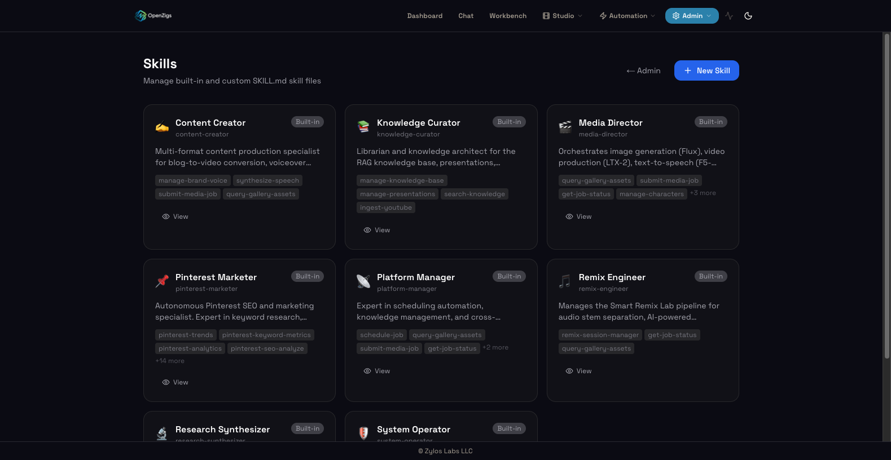

The Skills page at `/skills` (under **Automation → Skills**) provides a unified interface for browsing, creating, and managing skills:

- **Gallery view** — browse all loaded skills (built-in and user-created) with icons, descriptions, tool badges, and "Try It" prompts.
- **Create skills** — click "New Skill" to open the editor with a starter SKILL.md template. Enter a name, write the skill content, select allowed tools, and save.
- **Edit user skills** — click any user-created skill to modify its content. Built-in skills are read-only.
- **Live validation** — the editor validates SKILL.md frontmatter in real-time, checking for required `name` field and valid tool references.
- **Delete** user skills with confirmation dialog.
- **Real-time updates** — when skills are created, updated, or deleted, all connected clients receive a Socket.IO `skills:updated` event.
- **Ask AI** — get help understanding skills from the AI assistant.

User skills are stored in `~/.openzigs/skills/{name}/SKILL.md` and are hot-reloaded into active sessions via `copilot.addSkillDirectory()`.

#### Suggested Skill on Prompts

Saved prompts can specify a **Suggested Skill** — a skill that should be activated when the prompt executes. This is configured in the Library editor via the "Suggested Skill" dropdown. When a scheduled job runs a prompt with a suggested skill:

1. The skill's `SKILL.md` content is loaded and injected as a system message prefix.
2. The skill's `allowed-tools` are merged with the prompt's `preferredTools` and the job's `allowedTools`.
3. All other skills are disabled for that execution via `disabledSkills`, ensuring focused tool routing.

This enables **skills-first automation** — prompts carry domain expertise, not just instructions.

### Library (Saved Prompts)


The library at `/library` provides a visual interface for managing saved prompt templates:

- **Create** new prompts with name, content, and tags.
- **Edit** existing prompts inline.
- **Search** prompts by name, content, or tags.
- **Variable preview** — `{{variable}}` placeholders are highlighted and listed.
- **Preferred Tools** — Restrict which tools a prompt can use via a ToolMultiSelect dropdown grouped by category. When set, only the selected tools (plus always-on tools) are available during execution.
- **Pipeline Stages** — Attach a multi-stage pipeline to any prompt. When the prompt is executed by the scheduler, stages run sequentially (or in parallel groups) with per-stage prompts, tool restrictions, model overrides, timeouts, auto-approve tools, in-session subagent delegation, and optional post-actions (e.g., "create GitHub issues from findings"). Use the **Model Override** field to assign different models per stage for cost optimization (e.g., gpt-4.1 for research, gpt-4.1-mini for summarization). Enable **In-Session Subagents** to allow a stage to delegate work to SDK-native subagents.
- **Use as System Prompt** — Apply any saved prompt as the active system instruction in the AI Personality panel.
- **Export** — Download any prompt as a portable `.openzigs-template.json` file for sharing across instances.
- **Import** — Upload a `.openzigs-template.json` file via the Import Wizard to add a shared template to your library.
- **From Template** — Create a prompt from pre-built pipeline templates via the Pipeline Template Gallery.
- **Schedule This Prompt** — Quick-link button to create a scheduled job pre-filled with the prompt's name, skill, and tool scoping.
- **Template autocomplete** — Type `{{` in the template editor to trigger an autocomplete popup with built-in variables (`today`, `now`, `day_of_week`, `month`, `year`) and custom variables detected from the template.
- **Live preview** — See how built-in variables resolve in real-time below the template editor.
- **Validation warnings** — Unresolved `{{variables}}` that have no default value show amber warning badges.
- **Delete** with confirmation.

#### Pipeline Template Gallery

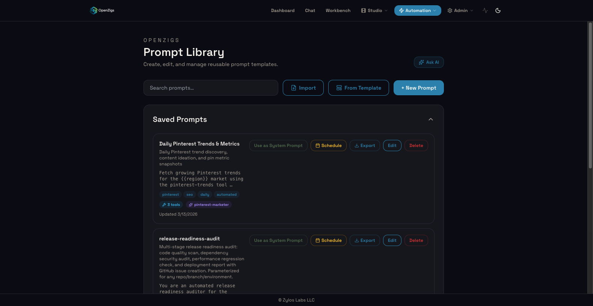

The Pipeline Template Gallery provides ready-to-use multi-stage workflow templates. Click **From Template** in the Library page to open the gallery.

**Built-in templates:**

| Template | Stages | Description |
|----------|--------|-------------|
| 🔬 Research & Summarize | 2 | Deep research then structured summary report |
| 🔍 Code Review Pipeline | 3 | Analyze structure, identify issues, generate report |
| ✍️ Content Creation | 3 | Trend research, draft content, polish and format |
| 📊 Competitive Analysis | 3 | Gather intelligence, compare features, strategic report |
| 🔔 Monitor & Alert | 2 | Check sources, evaluate and generate alerts |

Each template includes pre-configured stages with tool scoping, timeouts, and `{{variable}}` placeholders. Clicking a template creates a new saved prompt with all stages and variables pre-filled.

**Custom templates** can be created via the API (`POST /api/admin/pipeline-templates`) and are stored in `~/.openzigs/pipeline-templates.json`.

#### Pipeline Stages on Prompts

Any saved prompt can optionally carry pipeline stages, turning it from a simple template into a full multi-stage workflow. This is configured directly in the Library editor — no need to create a separate scheduler job.

**How to add stages:**

1. Open the Library at **http://localhost:3001/library**.
2. Click **+ New Prompt** (or **Edit** on an existing prompt).
3. Scroll to the **Pipeline Stages** section (collapsed by default).
4. Click to expand. If the prompt already has stages, the section auto-expands with a stage count badge.
5. Choose a creation mode:
   - **🧙 Workflow Wizard** — Describe your goal in plain English; AI auto-generates the stages.
   - **🔧 Manual Editor** — Build the pipeline yourself using the visual React Flow editor.
6. Each stage supports:
   - **Name** — Display label for the stage.
   - **Prompt** — Instructions for the LLM at this stage. Supports `{{variable}}` interpolation.
   - **Tools** — Multi-select for tools available to this stage (grouped by category).
   - **Auto-Approve Tools** — Tool selector (multi-select) specifying which tools bypass approval gating for this stage. Select specific tools from the stage's tool list, or leave empty to require approval for all.
   - **Timeout** — Max execution time in seconds (default: 300).
   - **Post-Action** — Deterministic action after stage completion. Action types are loaded dynamically from the Post-Action Registry (see below).
7. Click **Save Prompt** to persist the stages.

#### Post-Action Registry (Plugin System)

Post-actions are deterministic actions that run after a pipeline stage completes (e.g., create GitHub issues, send a webhook). Instead of hardcoding action types in the UI, openzigs uses a **Post-Action Registry** — a plugin system where each action type is registered with a JSON Schema describing its configuration, enabling the UI to render dynamic config forms for any action.

**Built-in post-action types:**

| Type | Category | Description |
|------|----------|-------------|
| `create-github-issues` | Integrations | Parse stage output for findings and create GitHub issues. Config: `owner`, `repo`, `labels`, `minSeverity`, `maxIssues`. |
| `send-webhook` | Notifications | POST/PUT the stage output to a webhook URL. Config: `url`, `method`, `includeOutput`. |

**How it works:**

1. At server startup, `registerBuiltinPostActions()` registers all built-in action types with the global `postActionRegistry`.
2. The UI fetches available types via `GET /api/admin/post-actions`, which returns each type's label, description, category, icon, and `configSchema`.
3. The pipeline editor renders a dynamic form based on the `configSchema` — field types (string, number, boolean, array), labels, defaults, enums, and constraints are all driven by the schema.
4. When a stage executes, the engine calls `postActionRegistry.execute(action, stageOutput)`, which delegates to the registered handler.

**REST API — List registered post-actions:**

```bash
curl http://localhost:3000/api/admin/post-actions
# Returns: { "actions": [{ "type": "create-github-issues", "label": "...", "configSchema": {...} }, ...] }
```

**Creating custom post-actions (UI):**

Navigate to **http://localhost:3001/admin/post-actions** to create custom post-action types without writing code. See [Custom Post-Actions (Settings Page)](#custom-post-actions-settings-page) below for full details.

**Registering a custom post-action (code):**

```typescript
import { postActionRegistry } from "./tasks/post-action-registry.js";

postActionRegistry.register({
  type: "slack-notify",
  label: "Slack Notification",
  description: "Send stage results to a Slack channel via incoming webhook.",
  category: "Notifications",
  icon: "slack",
  configSchema: {
    type: "object",
    properties: {
      webhookUrl: { type: "string", title: "Webhook URL", placeholder: "https://hooks.slack.com/..." },
      channel: { type: "string", title: "Channel", default: "#general" },
      mentionOnFailure: { type: "boolean", title: "Mention @here on failure", default: false },
    },
    required: ["webhookUrl"],
  },
  handler: async (stageOutput, config) => {
    // Your implementation here
    return JSON.stringify({ ok: true, channel: config.channel });
  },
});
```

**Stage and tool count badges** appear on saved prompt cards in the list, giving you a quick visual indicator of which prompts are simple templates vs. full pipelines.

**MCP tools:** The `save-prompt` and `update-prompt` MCP tools also support `stages` and `preferredTools` parameters, allowing the AI to create pipeline-enabled prompts programmatically.

**REST API:**

```bash
# Create a prompt with pipeline stages
curl -X POST -H "Authorization: Bearer <token>" \
  -H "Content-Type: application/json" \
  -d '{
    "name": "code-review-pipeline",
    "content": "Review code for {{project}}",
    "stages": [
      {
        "name": "clone-and-read",
        "prompt": "Read the source files for {{project}}",
        "tools": ["read-file", "list-directory"]
      },
      {
        "name": "review",
        "prompt": "Review the code for bugs, security issues, and style",
        "tools": ["read-file", "web-search"],
        "autoApproveTools": ["read-file"],
        "postAction": {
          "type": "create-github-issues",
          "config": { "owner": "acme", "repo": "app", "minSeverity": "medium" }
        }
      }
    ],
    "preferredTools": ["read-file", "list-directory", "web-search"]
  }' \
  http://localhost:3000/api/prompts

# Update stages (set to null to remove)
curl -X PUT -H "Authorization: Bearer <token>" \
  -H "Content-Type: application/json" \
  -d '{"stages": null}' \
  http://localhost:3000/api/prompts/<id>
```

#### Custom Post-Actions (Settings Page)

The Post-Actions settings page at `/admin/post-actions` provides a UI for creating custom post-action types without writing code. Custom actions appear automatically in the pipeline stage editor's post-action dropdown alongside built-in types.

**How to create a custom post-action:**

1. Navigate to **http://localhost:3001/admin/post-actions**.
2. Click **+ New Post-Action**.
3. Fill in the required fields:
   - **Type** — Unique slug identifier (e.g., `custom-slack-notify`).
   - **Label** — Human-readable label shown in dropdowns.
   - **Description** — What the action does.
   - **Category** — Grouping category (default: "Custom").
4. Choose a creation mode:
   - **Template** — Use a pre-built template:
     - **Webhook** — Generic HTTP sender. Configure default URL, HTTP method, and whether to include stage output.
     - **Script** — Shell command. Stage output is piped to stdin; config values are passed as `OPENZIGS_CONFIG_*` environment variables.
   - **Advanced** — Define custom config fields (string, number, boolean, array) and a script body. The fields appear as a dynamic form in the stage editor.
5. Click **Create** to save. The action is immediately available in all pipeline editors.

**Managing custom post-actions:**

- **Edit** — Click the **Edit** button on any custom action card to modify its configuration.
- **Delete** — Click **Delete** and confirm to remove a custom action.
- **Built-in actions** — Shown as read-only cards; these cannot be edited or deleted.

**REST API — Custom post-action CRUD:**

```bash
# List custom post-action definitions
curl http://localhost:3000/api/admin/post-actions/custom

# Create a custom webhook post-action
curl -X POST -H "Content-Type: application/json" \
  -d '{
    "type": "slack-webhook",
    "label": "Slack Webhook",
    "description": "Send stage output to a Slack channel",
    "templateType": "webhook",
    "templateConfig": {
      "url": "https://hooks.slack.com/services/...",
      "method": "POST",
      "includeOutput": true
    }
  }' \
  http://localhost:3000/api/admin/post-actions/custom

# Update a custom post-action
curl -X PUT -H "Content-Type: application/json" \
  -d '{"label": "Slack Webhook (Updated)"}' \
  http://localhost:3000/api/admin/post-actions/custom/slack-webhook

# Delete a custom post-action
curl -X DELETE http://localhost:3000/api/admin/post-actions/custom/slack-webhook
```

**Persistence:** Custom post-action definitions are stored in `~/.openzigs/custom-post-actions.json` and survive server restarts. On startup, all custom actions are automatically re-registered with the global post-action registry.

#### Exporting & Importing Templates


The Library supports exporting and importing prompt templates as portable `.openzigs-template.json` files. This makes it easy to share workflows between OpenZigs instances or distribute curated templates to a team.

##### Exporting a Template

1. Open the Library at **http://localhost:3001/library**.
2. Find the prompt you want to export.
3. Click the **⬇ Export** button on the prompt card.
4. A `.openzigs-template.json` file is downloaded to your browser.

The exported file contains the full prompt definition — name, description, template content, tags, preferred tools, and pipeline stages. Environment-specific values in post-action configurations (e.g., GitHub repo owner/name, webhook URLs) are automatically **tokenized** into `{{placeholder}}` markers so the template is safe to share without leaking credentials.

##### Importing a Template

1. Open the Library at **http://localhost:3001/library**.
2. Click the **Import** button in the header (next to "+ New Prompt").
3. The **Import Wizard** opens with three steps:

   

   **Step 1 — Upload:**
   - Drag and drop a `.openzigs-template.json` file onto the drop zone, or click **Browse** to select a file.
   - The wizard validates the file format and shows any errors.

   **Step 2 — Preview & Configure:**
   - Review the prompt name, description, stage count, and tags.
   - If the template contains placeholders (tokenized environment values), fill in the required values for your instance (e.g., your GitHub org/repo, your webhook URL).
   - Click **Import Template** to proceed.

   **Step 3 — Success:**
   - A confirmation screen shows the imported prompt name.
   - Click **Close** to dismiss the wizard and see the new prompt in your library.

If a prompt with the same name already exists, the imported template is automatically renamed with an "(imported)" suffix.

##### REST API — Template Export & Import

```bash
# Export a prompt as a template file
curl -H "Authorization: Bearer <token>" \
  http://localhost:3000/api/admin/prompts/1/export \
  -o my-template.openzigs-template.json

# Analyze a template before importing (pre-validation)
curl -X POST -H "Authorization: Bearer <token>" \
  -H "Content-Type: application/json" \
  -d @my-template.openzigs-template.json \
  http://localhost:3000/api/admin/templates/analyze

# Import a template with placeholder values
curl -X POST -H "Authorization: Bearer <token>" \
  -H "Content-Type: application/json" \
  -d '{
    "template": { ... },
    "placeholders": {
      "stage_0_config.owner": "my-org",
      "stage_0_config.repo": "my-repo"
    }
  }' \
  http://localhost:3000/api/admin/templates/import
```

### Scheduler


The scheduler at `/scheduler` manages cron-based automated jobs:

- **Create** jobs with name, cron expression, and action (prompt, shell command, pipeline, or custom).
- **Prompt linking** — link a job to a saved prompt from the Library.
- **Template variable injection** — set values for `{{variables}}` in the linked prompt directly from the scheduler form. See [Template Variables in Scheduled Jobs](#template-variables-in-scheduled-jobs) below.
- **Model selection** — optionally choose a model override per prompt or pipeline job.
- **AI Scheduler Assistant** — describe the schedule in plain English and auto-fill fields (uses `gpt-5-mini`).
- **Cron preview** — visual breakdown of minute, hour, day, month, weekday fields.
- **Visual Cron Builder** — toggle between Simple mode (frequency presets, time picker, day-of-week toggles, "Next 3 Runs" preview) and Advanced mode (raw cron expression input).
- **Skill selector** — choose a skill to activate for the job. Auto-populates from the linked prompt's `suggestedSkill`. Shows skill tool badges and icon.
- **Enable/disable** individual jobs with toggle switches.
- **Run Now** — trigger any job immediately with the ▶ Run button, bypassing the cron schedule.
- **Dry-Run Preview** — structured preview showing resolved prompt, interpolated variables, skill info with token estimate, tool scoping, pipeline stages, and next execution times.
- **Execution History** — expandable section on each job card showing recent task runs with status, duration, and links to task details.
- **Auto-Approve Tools** — for prompt/shell/custom jobs, specify tool names that bypass approval gating. For **pipeline jobs**, auto-approve tools are **automatically derived** from the union of all stage-level tool restrictions — any tool a stage uses is auto-approved during scheduled runs.
- **Create from Library** — navigate to `/scheduler?createFrom=promptName` to auto-fill the job form from a linked prompt, including skill, tools, and auto-approve configuration.


- **Live execution events** via Socket.IO — see when jobs fire in real time.

#### Template Variables in Scheduled Jobs

Saved prompts can contain `{{variable}}` placeholders (e.g., `"Write a {{topic}} report for {{today}}"`). When you link a prompt to a scheduled job and that prompt contains variables, the scheduler form automatically detects them and displays input fields — one per variable — directly below the prompt selector.

**How it works:**

1. Select **Prompt** as the action type.
2. Choose a saved prompt from the **Linked Prompt** dropdown.
3. If the prompt contains `{{variable}}` placeholders, a **Template Variables** section appears.
4. Enter a static value for each variable, or leave it empty to use a built-in dynamic value (see below).
5. Save the job — variable values are stored in `actionPayload.variables` and applied on every run.

**Editing an existing job:** Variable values are pre-populated when you open a job for editing, so you can update them without recreating the job.

**Job list display:** Configured variable values are shown in the job card alongside the prompt name (e.g., `Prompt: daily-report  Variables: topic=AI news`).

##### Built-In Dynamic Variables

The scheduler automatically resolves several dynamic variables at execution time. These are injected into every prompt job run — you do not need to set them in the scheduler form. If you *do* provide a value for a built-in variable in the form, your value takes precedence.

| Variable | Resolved value | Example |
|---|---|---|
| `{{today}}` | Current date in `YYYY-MM-DD` format | `2026-03-04` |
| `{{now}}` | Current date and time in ISO 8601 format | `2026-03-04T14:30:00.000Z` |
| `{{day_of_week}}` | Full weekday name | `Tuesday` |
| `{{month}}` | Full month name | `March` |
| `{{year}}` | Four-digit year | `2026` |

**Example prompt using built-in variables:**

```
Write a {{topic}} summary for {{today}} ({{day_of_week}}).
Focus on developments from the past 24 hours.
```

Scheduled with `topic = "AI news"`, this renders at run time as:

```
Write a AI news summary for 2026-03-04 (Tuesday).
Focus on developments from the past 24 hours.
```

No manual date management needed — the job stays evergreen across runs.

> **Built-in variable indicators:** In the scheduler form, built-in dynamic variables are labelled with a green **dynamic** badge and show an `(auto: resolved at run time)` placeholder. Leave them empty to use the auto-resolved value, or enter a static override to fix the value.

#### Multi-Model Agent Chaining

When using the `orchestrate-agents` tool (available to prompt-type jobs), you can assign **different models to each sub-agent** in the orchestration. For example, use `gpt-4o-mini` for cheap read-only analysis and `gpt-4.1` for complex code generation — all within a single scheduled job.

Each agent in the `orchestrate-agents` array accepts an optional `model` field and `auto_approve_tools` array, giving you fine-grained control over cost, capability, and autonomy per sub-agent.

#### Per-Run Approval Overrides

Approval overrides let specific tools run without human confirmation during scheduled or agent-spawned tasks. This is critical for **autonomous workflows** where no human is present to approve.

**How it works:**
1. Set `autoApproveTools` on a scheduled job or pass `auto_approve_tools` when spawning/orchestrating agents.
2. When the task executes and invokes a listed tool, the hooks layer skips the approval queue and immediately allows execution.
3. An audit log entry (`tool_auto_approved`) is recorded for every auto-approved invocation.
4. Tools **not** in the auto-approve list still follow normal approval gating.

#### Pipeline Jobs (Visual Workflow Builder)

The scheduler supports **pipeline** as a job action type. A pipeline job executes a multi-stage agent workflow where each stage runs sequentially (or in parallel groups) with its own prompt, tool restrictions, and optional model override.


**Creating a pipeline job:**

1. In the New Job form, select **Pipeline** as the action type.
2. A **Wizard/Manual chooser** appears:
   - **🧙 Workflow Wizard** — Describe your goal in plain English and let AI auto-plan the pipeline stages.
   - **🔧 Manual Editor** — Build the pipeline yourself using the visual drag-and-drop editor.


3. In the **Manual Editor**, the Visual Pipeline Editor canvas (powered by React Flow) provides:
   - **+ Stage** button — Adds a prompt stage (single LLM agent step).
   - **+ Parallel** button — Adds a parallel group (multiple stages running concurrently).
   - **MiniMap** (bottom-left) — Overview of the full pipeline graph.
   - **Controls** (bottom-right) — Zoom, fit view, toggle interactivity.
4. Click any node to open the **Stage Editor** sidebar:
   - **Name** — Display label for the stage.
   - **Prompt** — The instruction sent to the LLM. Supports a prompt selector (press `/` to search saved prompts).
   - **Tools** — Multi-select dropdown with tools grouped by category (Browser, Developer, Documents, Filesystem, Productivity, Search, Shell). The dropdown renders as a portal overlay for full visibility.
   - **Timeout** — Maximum execution time in seconds (default: 300).
5. Connect nodes by dragging from output handles (bottom) to input handles (top).
6. Click **Save** when done. The pipeline must have at least 2 stages to create the job.


**Model selection:** Pipeline jobs now include a **Model** selector below the editor, allowing you to choose an LLM model override for the entire pipeline (e.g., `claude-sonnet-4`, `gpt-5`). This applies to all stages unless individual stages specify a model.

**Auto-derived auto-approve:** When stages have specific tool restrictions, the pipeline job's auto-approve list is **automatically derived** from the union of all stage tools. For example, if stage-1 uses `browser-navigate, list-directory, shell-execute`, those 3 tools are automatically auto-approved for the pipeline job's scheduled runs.


**Recursive pipelines:** Parallel groups can contain nested stages or further parallel groups, up to 4 levels deep. This allows complex fan-out/fan-in patterns.

**Pipeline Planner (Auto-Plan):** The **Workflow Wizard** provides an AI-assisted pipeline creation flow:


1. Select **🧙 Workflow Wizard** from the chooser.
2. Describe your goal in plain English (e.g., "Research competitors, analyze their pricing, and draft a comparison report").
3. Click **Auto-Plan Pipeline** — the system calls the Pipeline Planner Agent (`POST /api/admin/pipeline/plan`) which generates a structured pipeline definition.
4. Review the AI's rationale and the generated pipeline in the visual editor.
5. Make adjustments if needed, then confirm to create the pipeline.
6. You can also click **Skip to Manual Editor** at any time to switch to manual mode.

#### Outbox Action Type (Scheduled Publishing)

The scheduler supports an **outbox** action type that bridges the scheduler with the [Outbox](#outbox) system for recurring social media publishing. Instead of invoking an AI prompt, outbox jobs create outbox queue items on a schedule, which are then published by the outbox poller and Universal Publisher skill.

**Creating an outbox job:**

1. In the New Job form, select **Outbox (Publish)** as the action type.
2. **Platforms** — check one or more connected social platforms (Twitter, Pinterest, LinkedIn, etc.). Only platforms with configured credentials appear.
3. **Content Template** — write the post content. Use dynamic variables (see below) for evergreen, date-aware content.
4. **Review Required** — when enabled, items are queued with a hold status so you can review and edit them in the [Outbox page](#outbox) before publishing. When disabled, items are published automatically.
5. Set your cron schedule, timezone, and optionally enable notifications (see below).
6. Click **Create Job**.

**Dynamic variables in content templates:**

The same built-in variables available in prompt templates work in outbox content templates:

| Variable | Example output |
|---|---|
| `{{today}}` | `2026-03-04` |
| `{{now}}` | `2026-03-04T14:30:00.000Z` |
| `{{day_of_week}}` | `Tuesday` |
| `{{month}}` | `March` |
| `{{year}}` | `2026` |

**Example: Weekly Twitter recap**

- **Name:** `weekly-twitter-recap`
- **Action Type:** Outbox (Publish)
- **Platforms:** Twitter
- **Content Template:** `🚀 Week in review for {{day_of_week}}, {{today}} — Here's what we shipped this week in OpenZigs!`
- **Review Required:** ✅ (review before posting)
- **Schedule:** Every Friday at 10:00 AM (`0 10 * * 5`)
- **Notifications:** Telegram ✅

Each Friday at 10 AM, an outbox item is created with the resolved content. Because **Review Required** is enabled, the item waits in the outbox for your approval. After you review and click **Publish Now**, it's sent to Twitter. A Telegram notification lets you know the job ran.

**Example: Daily multi-platform motivational post**

- **Name:** `daily-motivation`
- **Action Type:** Outbox (Publish)
- **Platforms:** Twitter, LinkedIn
- **Content Template:** `✨ Good {{day_of_week}} morning! Start your day with focus and intention. #motivation #{{day_of_week}}`
- **Review Required:** ❌ (auto-publish)
- **Schedule:** Every day at 8:00 AM (`0 8 * * *`)

This creates outbox items for both Twitter and LinkedIn every morning, which are automatically picked up and published by the outbox poller.

**Example: AI-generated content (Generation Prompt)**

Instead of a static content template, you can provide a **Generation Prompt** that instructs the AI to create fresh content each time the job fires:

- **Name:** `daily-ai-trends`
- **Action Type:** Outbox (Publish)
- **Platforms:** Twitter, LinkedIn
- **Generation Prompt:** `Write a concise, engaging post about the latest AI trends for {{today}}.`
- **Review Required:** ✅
- **Schedule:** Every weekday at 9:00 AM (`0 9 * * 1-5`)

When the job fires, the scheduler delegates to TaskEngine which generates unique content via AI. The `generationPrompt` supports the same dynamic variables as content templates. If TaskEngine is unavailable, it falls back to the static content template.

**Editing outbox items:**

Pending and canceled outbox items can be edited from the `/outbox` page. Click the **pencil icon** on any editable item to change the title, content, agent context, or scheduled time. Processing and published items cannot be edited.

**Batch creation:**

The outbox API supports creating up to 50 items in a single request via `POST /api/admin/outbox/batch`. This is useful for queuing an entire week of posts at once.

#### Job Completion Notifications

Any scheduled job (prompt, pipeline, shell, custom, or outbox) can send notifications when it completes or fails. Notifications are sent to the messaging channels you have configured.

**Setting up notifications:**

1. First, enable **Telegram** and/or **Discord** in Admin → Channels.
2. In the scheduler job form, a **Notifications** section appears with checkboxes for each enabled channel.
3. Check the channels you want to receive notifications on.
4. Save the job.

**Notification format:**

- **Success:** `✅ Scheduled job "weekly-recap" completed successfully`
- **Failure:** `❌ Scheduled job "weekly-recap" failed: <error message>`

Notifications are sent after every execution, whether triggered by the cron schedule or a manual "Run Now".

#### Global Tool Approval Lock


Administrators can set a **global approval lock** on any tool from the Admin → Tools panel. When a tool is locked:

- A 🔒 icon appears on the tool card. Click it to toggle the lock.
- **Locked tools always require human approval**, even if they appear in a task's `autoApproveTools` list or the interactive auto-approve context.
- This provides an admin-level safety mechanism for dangerous tools (e.g., `shell-execute`, `write-file`) that cannot be bypassed by any automation.

To toggle a lock via the API:

```bash
# Lock a tool
curl -X POST -H "Authorization: Bearer <token>" \
  -H "Content-Type: application/json" \
  -d '{"required": true}' \
  http://localhost:3000/api/admin/tools/shell-execute/global-approval

# Unlock a tool
curl -X POST -H "Authorization: Bearer <token>" \
  -H "Content-Type: application/json" \
  -d '{"required": false}' \
  http://localhost:3000/api/admin/tools/shell-execute/global-approval
```

### Workbench (Project Editor)

The Workbench at `/workbench` is a rich Markdown editor for drafting documents, notes, and content — powered by [MDXEditor](https://mdxeditor.dev/).

**Layout:**

| Area | Description |
|------|-------------|
| **File sidebar** (left) | Recursive file tree browser. Click folders to expand, click files to open. |
| **Editor** (center) | WYSIWYG Markdown editor with formatting toolbar. |
| **Status bar** (bottom) | Active file path and save state ("Modified" / "Saved"). |

**Toolbar actions:**

| Button | Action |
|--------|--------|
| Undo / Redo | Step through edit history |
| **B** *I* U | Bold, italic, underline toggles |
| `</>` | Inline code toggle |
| Block type | Switch between paragraph, headings (H1–H6), and quote |
| Lists | Ordered and unordered list toggles |
| Link | Insert or edit a hyperlink |
| Image | Insert an image by URL |
| Table | Insert a Markdown table |
| Horizontal rule | Insert a thematic break (`---`) |

**Code blocks:** The editor supports syntax-highlighted code blocks via CodeMirror for JavaScript, TypeScript, TSX, JSX, CSS, HTML, JSON, Python, Bash, SQL, and plain text.

**File management:**

- **Open a file:** Click any file in the sidebar to load its content into the editor.
- **New file:** Click the **+** button in the sidebar header. The editor resets to a blank document.
- **Save:** Click the **Save** button in the toolbar or press **Cmd+S** (macOS) / **Ctrl+S** (Windows/Linux). If no file is open, you'll be prompted for a file path.
- **Import document:** Click the **Import** button in the toolbar to open the Import Document dialog. Browse the file tree, select a document (Word, PDF, PowerPoint, Excel, HTML, images, or audio), and click **Import**. The file is converted to Markdown via the MarkItDown MCP tool and loaded into the editor as a new unsaved document.
- **Refresh:** Click the **↻** button in the sidebar header to reload the file tree.
- **Collapse sidebar:** Click the **›** button to collapse the sidebar to a narrow icon strip.

**Importing documents:**

The Import Document feature converts non-Markdown files into editable Markdown directly in the Workbench. It uses the LLM + the `convert-to-markdown` MCP tool (powered by [Microsoft MarkItDown](https://github.com/microsoft/markitdown)) to transform documents on the fly.

| Supported format | Extensions |
|------------------|------------|
| **Office documents** | `.docx`, `.pptx`, `.xlsx` |
| **PDF** | `.pdf` |
| **Web/text** | `.html`, `.htm`, `.rtf`, `.csv`, `.tsv`, `.epub` |
| **Images** (OCR) | `.jpg`, `.jpeg`, `.png`, `.gif`, `.bmp`, `.tiff`, `.webp` |
| **Audio** (transcription) | `.mp3`, `.wav`, `.m4a`, `.ogg` |

After import, the converted Markdown is loaded into the editor with a suggested file path (the original filename with a `.md` extension). The document is marked as unsaved — press **Cmd+S** to save it.

> **Prerequisite:** The MarkItDown MCP server must be available. Ensure Python 3.10+ and `uvx` are installed.

**Keyboard shortcuts:**

| Key | Action |
|-----|--------|
| Cmd/Ctrl + S | Save the current file |
| Standard Markdown shortcuts | Bold (`**`), italic (`*`), code (`` ` ``), headings (`#`), lists (`-`) via Markdown shortcut plugin |

**Unsaved changes:** An amber dot appears next to the file name when you have unsaved edits. The status bar also shows "Modified" until you save.

**File path sandbox:** The Workbench uses the same `allowedDirs` sandbox as the MCP filesystem tools. You can only browse and edit files within the allowed directories (by default: the project root, home directory, and temp directories).

**Environment variable:** Set `NEXT_PUBLIC_WORKBENCH_ROOT` to change the default root directory for the file sidebar (defaults to `.`, the project root).

### Tasks (Background Agents)


The Tasks page at `/tasks` provides real-time monitoring of background agent tasks:

- **Queue stats** — live counters showing queued and running task counts.
- **Task list** — all tasks with status badges (queued, running, completed, failed, cancelled), trigger type (chat, cron, agent), model, and depth.
- **Status filter** — filter by task status.
- **Cancel** — cancel queued or running tasks.
- **Results / errors** — view task output or error details inline.
- **Child tasks** — expand a task to see its spawned sub-tasks (recursive chaining).
- **Real-time updates** — Socket.IO pushes update the list when tasks complete or fail.
- **Token cost badges** — each task card displays a color-coded badge showing total token consumption.
- **Visual workflow graph** — click **◇ View graph** on any task to see a full interactive DAG (directed acyclic graph) of the task tree.

#### Token Cost Badges


Each task card shows a **Token Cost Badge** next to the status badge, indicating how many tokens the task consumed. The badge is color-coded by total token count:

| Token Count | Color | Meaning |
|---|---|---|
| < 10,000 | 🟢 Green | Lightweight task — minimal token usage. |
| 10,000–50,000 | 🟡 Yellow | Moderate usage. |
| 50,000–200,000 | 🟠 Orange | Heavy usage — complex task with many tool calls. |
| > 200,000 | 🔴 Red | Very expensive task — consider optimizing. |

Hover over the badge to see a tooltip with the input/output token breakdown. Token usage is only available for completed or failed tasks; queued and running tasks show no badge until they finish.

**Token usage API:**

```bash
# Get token usage for a specific task
curl -H "Authorization: Bearer <token>" http://localhost:3000/api/tasks/<id>/usage

# Get aggregate token summary for recent tasks
curl -H "Authorization: Bearer <token>" http://localhost:3000/api/tasks/usage/summary?hours=24
```

### Visual Workflow Graph


The task graph provides an interactive visualisation of a task and all its descendants, powered by React Flow and dagre layout.

**How to use:**

1. Navigate to the **Tasks** page at `/tasks`.
2. Find a task that has spawned sub-agents (any task created via `spawn-agent` or `orchestrate-agents`).
3. Click **◇ View graph** to expand the DAG below that task card.
4. The graph renders all tasks as nodes, connected by edges showing parent-child relationships.

**Node features:**

| Element | Description |
|---------|-------------|
| Status dot | Color-coded (🟡 queued, 🔵 running, 🟢 completed, 🔴 failed, ⚪ cancelled). Running nodes pulse. |
| Trigger icon | 💬 chat, ⏰ cron, 🤖 agent |
| Goal text | The task's goal, truncated to 2 lines |
| Model | The model used for execution (shown at bottom) |
| Duration | Time from creation to completion |
| Result/Error | One-line preview of output or error |

**Graph controls:**

| Control | Action |
|---------|--------|
| Mouse drag | Pan the graph |
| Scroll wheel | Zoom in/out |
| Bottom-right controls | Zoom buttons, fit view |
| Bottom-left minimap | Overview of full graph, draggable viewport |

**Animated edges:** Edges to running tasks are animated with a dashed stroke to indicate active execution.

The graph auto-refreshes every 10 seconds to reflect status changes.

### Task Tree View

In addition to the interactive graph, each task card also offers a **tree view** — a compact, collapsible text-based representation of the task hierarchy.

**How to use:**

1. Navigate to the **Tasks** page at `/tasks`.
2. Find a task and click **▢ View tree** to expand the tree below that task card.
3. The tree shows the full hierarchy with collapsible nodes, status icons, duration, and token usage per node.

**Tree features:**
- Collapsible/expandable nodes — click to toggle children
- Status icons: ⏳ queued, 🔄 running (animated), ✅ completed, ❌ failed, 🚫 cancelled
- Per-node duration and token count
- Child count badges on parent nodes
- Statistics bar showing overall progress with color-coded segments

**Real-time updates:** The tree re-fetches on `task:tree-update` Socket.IO events, so status changes appear within seconds.

### Task Tree API

```bash
# Get nested tree structure for a task (with stats)
curl -H "Authorization: Bearer <token>" \
  http://localhost:3000/api/tasks/<id>/tree?maxDepth=10

# Get root tasks (top-level tasks with child counts)
curl -H "Authorization: Bearer <token>" \
  http://localhost:3000/api/tasks/roots?limit=20&offset=0
```

### Agent Switching & In-Session Subagents

OpenZigs supports two ways to delegate work to specialized agents: **in-session** (SDK-native) and **background** (TaskEngine). This section covers the in-session mode and how to switch agents during a chat.

#### Agent Selector

The **Agent Selector** dropdown appears in the chat toolbar (next to the reasoning effort selector). It lets you choose a specialized agent for the current conversation.

**How to use:**
1. Click the agent dropdown in the chat header
2. Select an agent (e.g., "researcher", "coder", "writer")
3. All subsequent messages in that session use the selected agent's persona, system prompt, and tool scoping
4. Select "Default" to return to the standard assistant

When you switch agents, the SDK session is reset so the new agent starts with a clean context.

#### In-Session vs Background Agents

| Feature | In-Session (SDK-Native) | Background (spawn-agent) |
|---------|------------------------|-------------------------|
| **How it starts** | SDK auto-delegates or user selects agent | AI calls `spawn-agent` tool |
| **Session context** | Shares the current chat session | Creates a new independent session |
| **Blocking** | Runs within the current chat turn | Runs asynchronously in background |
| **Survives page close** | No | Yes |
| **SQLite audit trail** | No | Yes (full task lifecycle) |
| **UI indicator** | Inline status in chat (blue "In-Session" badge) | Floating progress panel (amber "Background" badge) |
| **Premium requests** | Shares parent's single request | 1 additional request per agent |
| **Best for** | Quick specialist work during conversation | Long-running research, pipelines, scheduled jobs |

#### When to Use Which Mode

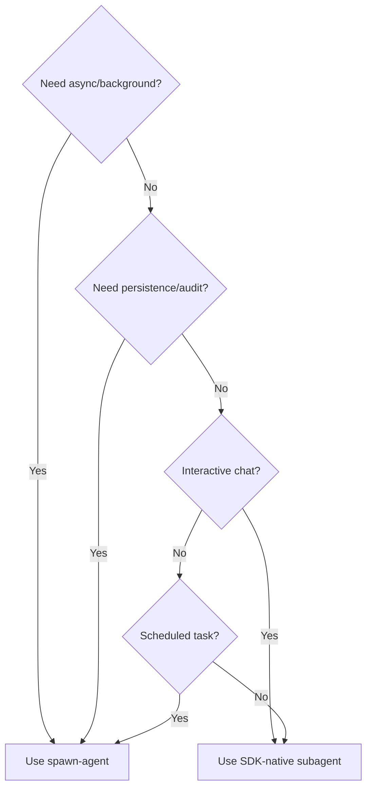

**Use in-session agents when:**
- You're chatting and want the AI to quickly consult a specialist (e.g., "Have the coder review this function")
- You want cost-efficient delegation (no extra premium requests)
- The task is short and doesn't need to survive a page refresh

**Use background agents when:**
- The task takes minutes (deep research, multi-step pipelines)
- You want a full audit trail in the Tasks page
- You need the task to survive browser close
- You're running scheduled or cron-triggered jobs

#### Cost Optimization

In-session subagents are significantly more cost-efficient than background agents:

- **In-session**: All subagent work happens within the parent session's single premium request. A chat turn that delegates to 3 specialists still uses **1 premium request**.
- **Background**: Each `spawn-agent` call creates a new SDK session and consumes **1 additional premium request**. A parent that spawns 3 agents uses **4 total requests** (1 parent + 3 agents).

For interactive conversations where you need specialist input, prefer in-session agents to minimize premium request consumption.

#### Agent Configuration (Admin)

Agents are configured in **Admin → Agents**. Key settings:

| Setting | Description |
|---------|-------------|
| **Name** | Unique identifier (e.g., `researcher`, `coder`) |
| **Display Name** | Shown in the agent selector dropdown |
| **Instructions** | System prompt defining the agent's persona and expertise |
| **Tools** | Optional allowlist restricting which tools the agent can use |
| **Infer** | When enabled (default), the SDK can auto-invoke this agent. When disabled, the agent shows a "Manual only" badge and must be explicitly selected via the dropdown. |

**Auto-invoke vs Manual only:**
- **Auto-invoke** (infer: true) — The SDK decides when to delegate to this agent based on the conversation. Shown with a green "Auto-invoke" badge with tooltip "SDK can auto-delegate to this agent".
- **Manual only** (infer: false) — The agent is only used when explicitly selected by the user via the Agent Selector dropdown. Shown with a muted "Manual only" badge.

### Subagent Live Progress Panel

When sub-agents are running during a chat conversation, a **live progress panel** appears above the input area in the chat view. This panel shows real-time activity for both **in-session** (SDK-native) and **background** (TaskEngine) agents in a unified view.

**What you'll see:**
- **Agent cards** — one card per spawned sub-agent, showing its goal and status
- **Mode badge** — blue "In-Session" for SDK-native agents, amber "Background" for TaskEngine agents
- **Tool call log** — real-time tool invocations with tool names and durations
- **Progress updates** — stage-level progress messages from the agent
- **Token usage** — accumulated token counts when the agent completes
- **Elapsed time** — running timer per agent
- **Filter toggle** — buttons to filter by All / Background / In-Session

**Behavior:**
- The panel appears automatically when sub-agents start running
- Cards update in real-time via Socket.IO events (`task:*` for background, `subagent:*` for in-session)
- The panel auto-collapses when all agents finish
- Click the **X** button to dismiss the panel
- Click the header to collapse/expand

### Orchestration Templates

Orchestration templates are pre-built multi-agent workflow definitions for common patterns. They define multiple stages of agents that execute sequentially, with agents within each stage running in parallel.

**How to use:**

1. Navigate to **Admin** → scroll to the **Orchestration Templates** section.
2. Browse built-in templates or create your own.
3. Click **Execute** on a template, fill in variables, and launch.

**Creating a template:**

1. Click **Create Template** in the admin panel.
2. Give it a name, description, and category.
3. Add **stages** — each stage is a sequential step in the workflow.
4. Within each stage, add **agents** with goals and optional model overrides.
5. Use `{{variable}}` placeholders in agent goals for dynamic content.
6. Optionally add an **aggregation prompt** that synthesizes all agent outputs.

**Built-in templates:**
| Template | Description |
|----------|-------------|
| Research & Synthesize | Multi-source research with synthesis |
| Multi-Perspective Analysis | Same topic analyzed from different angles |
| Code Review Pipeline | Security, performance, and maintainability reviews |
| Content Creation | Research → draft → edit pipeline |
| Competitive Analysis | Parallel competitor research with comparison |

**REST API:**

```bash
# List all templates
curl -H "Authorization: Bearer <token>" http://localhost:3000/api/admin/orchestration

# Create a template
curl -X POST -H "Authorization: Bearer <token>" \
  -H "Content-Type: application/json" \
  -d '{"name": "My Template", "stages": [...], "category": "custom"}' \
  http://localhost:3000/api/admin/orchestration

# Execute a template with variables
curl -X POST -H "Authorization: Bearer <token>" \
  -H "Content-Type: application/json" \
  -d '{"variables": {"topic": "AI trends 2026"}}' \
  http://localhost:3000/api/admin/orchestration/<id>/execute

# Execute a template in session mode
curl -X POST -H "Authorization: Bearer <token>" \
  -H "Content-Type: application/json" \
  -d '{"variables": {"topic": "AI trends 2026"}, "mode": "session"}' \
  http://localhost:3000/api/admin/orchestration/<id>/execute
```

#### Orchestration Mode (Task vs Session)

Every orchestration template execution supports an **orchestration mode** that controls how sub-agents are dispatched:

| Mode | How agents run | Best for |
|------|---------------|----------|
| **Task** (default) | Each agent spawns as a separate background task via the TaskEngine. Agents run asynchronously and persist in SQLite. | Long-running workflows, audit trails, scheduled jobs |
| **Session** | All agent goals are composed into a single prompt and executed in one SDK session with `enableSubagents: true`. The SDK delegates to specialized agents inline. | Quick multi-agent work, cost-efficient delegation (1 premium request), interactive use |

**Choosing a mode:**

- **Use Task mode** when you need persistence, audit trails, or the workflow runs unattended (e.g., cron jobs, deep research pipelines).
- **Use Session mode** when you want fast, cost-efficient results in a single turn — all agents share one session context and one premium request.

**Setting the mode:**

1. **Execute modal** — When you click **Execute** on a template, a radio selector lets you pick Task or Session mode.
2. **Template default** — Each template has an optional `defaultMode` field. Set it during creation to pre-select the mode on every execute.
3. **Scheduler** — Prompt and pipeline jobs include an Orchestration Mode selector (Task/Session) saved with the job.
4. **REST API** — Pass `"mode": "session"` or `"mode": "task"` in the execute request body.
5. **Config default** — If no mode is specified anywhere, the system defaults to `"task"`.

**Mode precedence:** Execute request `mode` → template `defaultMode` → `"task"`.

### Inline Result Injection

When a background sub-agent completes its work, its result is automatically injected as a system message back into the parent chat session. This means:

- You don't need to manually check the Tasks page for results
- The AI has full context of what sub-agents produced
- Follow-up questions about sub-agent results work naturally

**How background tasks are created:**

1. **spawn-agent tool** — During a conversation, the AI can call the `spawn-agent` MCP tool to delegate long-running work to a background sub-agent.
2. **Scheduled jobs** — Prompt-type scheduled jobs are automatically submitted as background tasks via the TaskEngine.
3. **Chat messages** — Every routed chat message is also tracked as an immediate-mode task for observability.

**Recursive chaining:** Sub-agents can themselves call `spawn-agent` to create nested sub-tasks, up to a configurable depth limit (default: 5 levels). Each level tracks its parent and depth.

**REST API:**

```bash
# List all tasks  
curl -H "Authorization: Bearer <token>" http://localhost:3000/api/tasks

# Get queue stats
curl -H "Authorization: Bearer <token>" http://localhost:3000/api/tasks/stats

# Get a specific task
curl -H "Authorization: Bearer <token>" http://localhost:3000/api/tasks/<id>

# Get children of a task
curl -H "Authorization: Bearer <token>" http://localhost:3000/api/tasks/<id>/children

# Cancel a task
curl -X POST -H "Authorization: Bearer <token>" http://localhost:3000/api/tasks/<id>/cancel
```

---

### Studio: Capture & Trim

The **Capture & Trim** tab in Director Mode provides a complete screen recording and video editing workflow directly in the browser. The layout features a two-column design: recorder and video library on the left, video trimmer on the right.

#### Screen Recording

1. Navigate to **Director** → click the **Capture & Trim** tab.
2. Click **Start Recording** — your browser will prompt you to select a screen, window, or tab to share.
3. **Audio options:**
   - **System Audio** — captures the audio output of the shared tab/window. Uses Chrome's `systemAudio: "include"` API (Chrome 105+) for reliable system audio capture on macOS.
   - **Microphone** — captures your microphone for voiceover narration.
   - Both can be enabled simultaneously. A VU meter shows real-time audio levels.
4. Use **Pause** / **Resume** during the recording as needed.
5. Click **Stop** when finished. A preview of the recorded video appears.
6. **Save options:**
   - **Save to Gallery** — saves the recording as a gallery asset with a `screen-recording` tag.
   - **Save to Draft** — uploads the recording AND creates a new Director Draft project with the recording as the first scene, then opens the Draft Studio editor.
   - **Discard** — discards the recording without saving.

**Keyboard shortcuts:**

| Key | Action |
|-----|--------|
| `R` | Start/stop recording |
| `P` | Pause or resume recording |
| `Esc` | Discard recording (when stopped) |

> **macOS Note:** On macOS, you may need to grant Screen Recording permission to your browser in System Settings → Privacy & Security → Screen Recording. After enabling, **quit and reopen Chrome** for the permission to take effect.

#### Video Library

The video library shows all video assets from your Gallery with visual thumbnail previews.

- **Drag & drop upload** — drop any video file onto the upload zone to import it into the Gallery.
- **Click to upload** — click the upload zone to open a file picker.
- Videos show duration badges and "REC" tags for screen recordings.
- Click any video to load it in the trimmer on the right.
- The library auto-loads on page visit; click **Refresh** to update.

#### Video Trimmer — Trim Mode

The default editing mode for setting In/Out points and exporting a single clip.

1. Select a video from the library (or record one). The **Video Trimmer** appears in the right column.
2. **Timeline scrubber:** Drag the blue start/end handles to define the trim region.
3. **Precise input:** Enter exact start and end times (in seconds) for frame-accurate trimming.
4. Click **Loop** to preview the trimmed segment in a continuous loop.
5. Click **Export Cut** to perform the trim. The operation is lossless (FFmpeg stream copy — no re-encoding) and near-instant.
6. The trimmed clip is automatically added to the Gallery.

**Keyboard shortcuts (Trim Mode):**

| Key | Action |
|-----|--------|
| `Space` | Play / Pause video |
| `I` | Set In point at current playhead position |
| `O` | Set Out point at current playhead position |

#### Video Trimmer — Blade Mode

Switch to **Blade** mode to split a video into multiple named clips.

1. Click the **Blade** toggle in the trimmer header (or switch from Trim mode).
2. **Place split points** by clicking on the timeline or pressing **B** at the current playhead position.
3. Split points appear as orange markers. Hover over a marker and click **X** to remove it.
4. Each resulting clip segment is listed below the timeline with its time range and name.
5. **Rename clips** by clicking the edit icon next to each segment name.
6. Click **Export N Clips** to queue all segments as separate FFmpeg trim jobs. Each becomes a Gallery asset.

**Keyboard shortcuts (Blade Mode):**

| Key | Action |
|-----|--------|
| `Space` | Play / Pause video |
| `B` | Split at playhead position |
| `Esc` | Return to Trim mode |

#### AI Smart Cut (Redundancy Detection)

1. With a video loaded in the trimmer, click **Ask AI** to analyze the video for redundant or low-quality segments.
2. The AI pipeline:
   - Extracts frames at 1fps and sends them to the **Vision LLM** in batches.
   - Extracts the audio track and transcribes it via **Whisper STT**.
   - The LLM identifies dead air, repeated content, shaky footage, and other issues.
3. **Red zones** appear on the timeline representing regions the AI recommends **removing**. Each zone includes a reason.
4. **Toggle individual cuts** on/off by clicking them on the timeline or in the cuts list below. Disabled cuts turn gray and won't be removed.
5. The cuts list shows an expandable panel with each suggestion's timestamp and reason. The count shows how many are enabled.
6. Click **Apply All (N)** to export a clean video with all enabled red zones removed. The system inverts the removal regions into "keep" regions and exports each as a separate trim job using FFmpeg.

> **Tip:** AI Smart Cut works best on recordings longer than 30 seconds. Short clips may not have enough content for the AI to analyze meaningfully.

#### Agentic Workflow (Chat-Based)

You can also use Studio tools from the chat interface via the **Media Director** skill:

- **"Analyze my latest screen recording for redundant sections"** → The AI calls `analyze-video-redundancy` and returns suggested cuts.
- **"Trim the first 30 seconds from video X"** → The AI calls `trim-video` with the specified times.
- **"Clean up my recording — remove dead air and repeated sections"** → The AI runs analysis first, then trims the suggested cuts sequentially.

---

### Studio → Pitch (AI Slide Decks)

The **Pitch** workspace turns a script, brief, or research notes into a designed, brand-consistent slide deck — editable in-browser and exportable to PDF, PowerPoint, Markdown, static HTML, or a zipped offline bundle.

#### Where to find it

`Studio` dropdown in the top nav → **Pitch**. Routes:

- `/pitch` — deck library
- `/pitch/new` — wizard (script → brand kit → templates → generate)
- `/pitch/[deckId]` — slide editor with live Reveal preview, properties panel, script panel
- `/pitch/[deckId]/preview` — full-screen presenter preview

#### Workflow at a glance

1. **Draft** — paste a script or upload notes, pick a brand kit, choose target slide count + tone, and (optionally) pick the LLM via the **AI model** picker on the Options step. Defaults to your Copilot account's selected model; override for a faster/cheaper model on both the condense and draft passes. The AI produces a structured deck with up to **80 slides** (`MAX_SLIDES_PER_DECK`) across **20 templates** (the original 14 plus the 6 added in epic #1045 — see the new templates list below).
2. **Edit** — click any slide field to edit it inline; the right rail loads the matching property editor. Drag slides to reorder, regenerate individual slides, or regenerate slide images via Flux.
3. **Brand kits** — pick a starter kit (Modern Minimal, Corporate Blue, Vibrant Pitch, Editorial, Tech Dark, Warm Neutral) or create your own. Editable: heading + body fonts, accent colors, footer text, logo (≤ 2 MB PNG/JPEG/WebP). Logos are content-sniffed server-side. The editor warns when colors are likely to be low contrast, and the renderer derives readable text colors automatically so existing decks stay legible.
4. **Export** — five formats, all attachment downloads with `Cache-Control: no-store`:

#### Brand Kits — deck-wide application & cloning

The brand kit panel in the deck editor (right rail) gives you three buttons that wire to the deck's active kit:

- **Default logo placement** — choose where the kit's logo is stamped on every slide (`none`, `top-left`, `top-right`, `bottom-left`, `bottom-right`). Persists on the kit itself, so all decks using it pick up the change on next render.
- **Show slide numbers** — toggles the slide-number badge in the renderer footer for every deck on this kit.
- **Per-slide branding overrides** — individual slides can opt out of the deck-wide logo or override the accent color via the slide's `branding` field. The dedicated UI for editing these overrides is **deferred** for a future release; for now, set them via the JSON inspector or via API.
- **Apply to deck** — activates a different brand kit on the current deck **and clears every existing per-slide `branding` override in one go**. The confirmation dialog tells you exactly how many slide overrides will be wiped before you commit; once applied, the deck re-renders against the new kit on the next preview load.
- **Copy from deck** — clones the deck's *currently active* brand kit into a new editable kit so you can tweak fonts/colors without disturbing the original. (The legacy "Extract" button is still wired to the same endpoint via a deprecated alias; nothing breaks if you have an older browser tab open.)

#### New slide templates (epic #1045)

Six templates joined the original 14, each with an inline property editor in the right rail (no more JSON-only editing):

- **Pricing table** — 2–4 tier cards (name, price, period, feature bullets, CTA). Tick **highlighted** on one tier to mark it as the recommended plan; mutual exclusion is enforced. Optional footnote at the bottom.
- **Big number** — a hero metric (the number/value, a short label, and supporting copy). Optional **trend** chip (`up` / `down` / `flat`) with a custom trend label.
- **Team grid** — 2–12 member cards (name, role, photo URL, short bio). Social links on existing slides are preserved on edit; the UI surface for editing them is deferred.
- **Logo grid** — 4–24 logo cells (alt text, image URL, optional href). Toggle **grayscale** to render every logo desaturated (useful for "trusted by" walls).
- **Roadmap** — a columns × tracks matrix. Define column labels (e.g. quarters, capped at 6) and track labels (e.g. workstreams, capped at 4), then add up to 60 items pinned to a `(column, track)` cell with a `planned` / `in_progress` / `done` status. Removing a column or track also removes any items targeting it and shifts the remaining indices down so the matrix stays consistent.
- **Agenda** — two modes. **Auto-derive** (default) pulls headings from your `Section divider` slides at render time, so the agenda always tracks the deck. Switch to **Manual** to author 1–20 explicit items. Optional **Numbered list** toggle for both modes.

#### Sidecar auto-start (`media.autoStartSidecars`)

By default, Pitch image generation requires you to start the FluxQ image-gen sidecar manually before launching the backend (see [Windows Sidecar Management](#windows-sidecar-management-wslcuda)). Setting `media.autoStartSidecars` to `true` in `~/.openzigs/config.json` (or the equivalent env var) makes the backend probe `media.sidecarHealthUrl` (default `http://127.0.0.1:5005/health`) at boot and, if unreachable, spawn `scripts/media-ctl.{ps1,sh} flux start` for you.

```jsonc
{
  "media": {
    "autoStartSidecars": true,
    "sidecarHealthUrl": "http://127.0.0.1:5005/health",
    "startupTimeoutMs": 120000
  }
}
```

- **Default**: `false` (opt-in).
- **Process model**: the spawn is detached, with stdio ignored and `unref()`'d, so the sidecar continues running after the backend exits. Stopping the sidecar still requires an explicit `media-ctl <service> stop` call.
- **Polling**: exponential backoff (250 ms → 500 ms → 1 s → 2 s → 4 s → 5 s cap) up to `media.startupTimeoutMs` (default 120 s). Probe outcomes are emitted at `DEBUG` level — set `LOG_LEVEL=debug` to see `[Sidecars] attempt N, elapsed Xms, status {ok|err|timeout}`.
- **Restart required**: changes to `media.autoStartSidecars` only take effect on backend restart.
- **Security/operational caveats**: the backend will spawn a child process on every cold boot. Only enable on hosts where you trust the local `scripts/media-ctl.*` script and the user you run the backend as is allowed to launch PowerShell / bash subprocesses. For production deployments behind a process supervisor (systemd, NSSM), prefer managing the sidecar as a sibling unit rather than letting the backend spawn it.

#### Why my Pitch images don't appear

If a deck generates fine but every slide stays in the "Generating…" state or lands in "failed", walk through this checklist before filing a bug:

1. **Check the FluxQ sidecar.** Run `curl http://127.0.0.1:5005/health` (or `Invoke-WebRequest` on Windows). A healthy sidecar returns `200 OK` with a JSON body that includes `recommended_width` / `recommended_height`. If it doesn't answer, start it with `scripts/media-ctl.ps1 flux start` (Windows) or `scripts/media-ctl.sh flux start` (POSIX) — or set `media.autoStartSidecars: true` and restart the backend (see above).
2. **Check the `media_jobs` SQLite table** at `~/.openzigs/openzigs.db`. Failed jobs include the upstream sidecar error in the `error` column. The most common pattern is an OOM on `flux-schnell` ("CUDA out of memory" on a 12 GB GPU) which retries 3× before lodging as `failed`.
3. **Dimensions are clamped** to FluxQ's recommended size at fan-out time (PR #1018) — the sidecar advertises `recommended_width` / `recommended_height` on `/health` and `clampToFluxQRecommendedDims` shrinks any over-sized request. If the sidecar is unreachable when the fan-out runs, the safe fallback is `1024×576`. You should never see a job dispatched at the slide's full visual resolution.
4. **Generated inline images are served through Pitch asset routes.** A completed inline image should create a `pitch_assets` row and patch the slide slot to `/api/admin/pitch/decks/{deckId}/assets/{assetId}`. The renderer loads that authenticated route directly; it should not show `file://` URLs in the slide JSON or rendered HTML.
5. **Generate All is idempotent for backgrounds.** Re-running it skips slides that already have a persisted background asset and skips inline slots whose URL is already populated. If the button enqueues the same background forever, check for stale or malformed `pitch_assets` rows for that deck.
6. **Restart the backend after enabling `media.autoStartSidecars`** — the auto-start probe runs only at boot, so toggling the flag while the backend is already running is a no-op.

If the Pitch library itself shows **Could not load decks**, expand the diagnostic line in the error panel. It includes the endpoint/status reported by the backend and a retry button; malformed legacy rows are skipped automatically, but database lock or filesystem errors will still surface there.

Still stuck? Tail the backend log with `LOG_LEVEL=debug pnpm dev`, look for `[Sidecars]` and `[Pitch]` lines, and grep `~/.openzigs/logs/` for the deck ID.

#### Authenticated Present route

The "Present" button in the deck editor opens `/pitch/{deckId}/present`, a Next.js page that fetches `/api/admin/pitch/decks/{deckId}/render?mode=present` with a proper `Authorization: Bearer …` header. Older builds opened the API URL directly with `?token=<bearer>` in the query string, which leaked the token into browser history and any upstream proxy access logs. The query-string fallback is still honoured by the auth middleware so existing shared-link bookmarks keep working, but new sessions never put the token in the URL.

#### Large script uploads

The persisted `source_script` field is capped at **50 KB** so the LLM draft pass stays cheap and the audit trail stays bounded. Real-world inputs (specs, user-guide markdown) are routinely 200 KB – 2 MB. The wizard handles this with an explicit AI condensation step:

- The file picker / drag-and-drop accepts `.txt` / `.md` files up to **2 MB** (the hard ceiling).
- Files ≤ 50 KB load directly into the script box.
- Files between 50 KB and 2 MB stage a **Condense with AI** panel showing the file name, size, and an estimated `1 LLM call per ~30 KB` (a 459 KB user-guide → ~16 chunks). Map-stage chunks run **4 in parallel** — expect **~30–90s end-to-end** for a 459 KB script (was ~10–16 minutes when chunks ran serially). Click **Condense** to confirm — the wizard never auto-spends LLM tokens. The model used for condensation honours the wizard's **AI model** picker (defaults to the wrapper-selected model).
- The condensed text drops into the textarea so you can review / edit before clicking Next. A small chip records the original → condensed sizes for transparency.
- Files > 2 MB are rejected with a toast.

The condense pipeline is map-reduce: each ~30 KB chunk is summarized with a faithful-summary prompt (running up to 4 chunks concurrently — see `CONDENSE_MAP_CONCURRENCY`), then concatenated; if the concatenation is still over the 40 KB target, a single reduce pass folds the section summaries into one coherent script. The model defaults to the Copilot wrapper's selected model; pass `model` in the `/script/condense` body or `options.model` in `/decks/draft` to override (the wizard's AI model picker wires both). The result is fed into the unchanged `/decks/draft` pipeline.

| Format | Endpoint | Notes |
|---|---|---|
| PDF | `GET /api/admin/pitch/decks/:deckId/export.pdf` | Decktape subprocess, 60 s wall clock, abort on disconnect |
| PowerPoint | `GET …/export.pptx` | Native `pptxgenjs`, brand-kit theme, EXIF-stripped images |
| Static HTML zip | `GET …/export.zip` | Reveal.js bundle + README, archiver level 9 |
| Markdown | `GET …/export.md` | All 14 templates; pipes/newlines escaped in tables |
| Speaker-notes PDF | `GET …/export.notes.pdf` | One section per slide, verbatim notes |

> **Note — first PDF export downloads Chromium (~170 MB).** PDF export is implemented via `decktape`, which depends on a headless Chromium build. The Chromium binary is downloaded automatically on the first hit to either PDF endpoint and cached for subsequent calls. CI / Docker images that need PDF export should warm the cache during the build step, e.g. `npx decktape --version`, so the first user-facing export does not block on the download.

#### Rate limits

All Pitch routes are throttled per-IP with `express-rate-limit` (1 hour window, standard `RateLimit-*` + `Retry-After` headers, `429 { error: { code: "rate_limited" } }` on overflow):

| Action | Limit / hour |
|---|---:|
| Draft deck (`POST /decks/draft`) | 10 |
| Condense oversize script (`POST /script/condense`) | 20 |
| Regenerate slide | 60 |
| Enhance text | 60 |
| Enqueue slide image | 30 |
| Export PDF | 20 |
| Export PowerPoint | 30 |
| Export ZIP | 30 |
| Export Markdown | 60 |
| Export HTML | 60 |
| Export speaker notes PDF | 20 |
| All CRUD reads/patches | 600 |

#### Security model

- **Prompt-injection envelope** — user scripts are wrapped in `<DATA>…</DATA>` tags before being sent to the model; the system prompt instructs the model to treat the envelope contents as data, never as instructions, and the envelope itself is stripped from the model's output.
- **XSS sanitization** — every user-supplied rich-text field passes through DOMPurify (`src/pitch/pitch-sanitize.ts`) with `script`, `iframe`, `object`, `embed`, `link`, `meta`, `base`, `form`, `style` tags forbidden, and all `on*`, `formaction`, `xlink:href`, `srcdoc`, `action`, `background`, `ping`, `style` attributes stripped. URLs are restricted to `https:` (and `data:image/...` for inline assets).
- **Content Security Policy** — `/decks/:deckId/render` and `/decks/:deckId/export.html` ship a strict CSP that blocks inline scripts and external origins outside the Reveal CDN.
- **SSRF defence** — every URL field on `BrandKitSchema` and `SlideImageSchema` is server-populated (logo upload, image asset pipeline). Any future URL field must run through `isAllowedWebhookUrl`.
- **Filename containment** — exported filenames are matched against `^[a-zA-Z0-9._-]+$` and capped at 120 characters; temp files are `assertWithinTmpdir`-checked before any `file://` URL is constructed for the PDF subprocess.
- **Abort signals** — closing the browser tab or aborting the request kills the underlying decktape process and skips work in the speaker-notes pipeline.
- **Subprocess isolation** — decktape and `pptxgenjs` errors are logged with full detail server-side but the HTTP response carries a generic message; subprocess `stderr` never reaches the client.

---

### Subtitle Export (SRT/VTT)

Export subtitles from any Director draft's narration timeline:

1. Open a draft in **Studio**.
2. Click the **Subtitles** dropdown in the toolbar.
3. Choose **SRT** (SubRip) or **VTT** (WebVTT) format.
4. The subtitle file downloads automatically with timestamps synchronized to each scene's narration.

**API:** `GET /api/admin/director/drafts/:id/subtitles/srt` or `/vtt`

### Brand Kit System

Create reusable brand kits for consistent video styling:

1. Go to **Director** → **Brand Kit** tab.
2. Click **New Kit** and set:
   - **Name** — e.g., "Company Brand"
   - **Colors** — Primary, secondary, and accent (hex color picker)
   - **Font Family** — Select from available fonts
3. The live **Preview** shows your color swatches and font.
4. Brand kits are stored in SQLite and available across all productions.

#### Brand Kit MCP Tools

Brand kits can also be managed programmatically via chat using the following MCP tools:

- **`list-brand-kits`** — List all saved brand kits
- **`get-brand-kit`** — Retrieve a specific brand kit by ID
- **`create-brand-kit`** — Create a new brand kit with name, colors, fonts, and tone
- **`update-brand-kit`** — Update fields on an existing brand kit
- **`delete-brand-kit`** — Delete a brand kit by ID

Brand kits created via MCP tools are shared with the Director UI and the Post Template system.

### Creative Studio

The Creative Studio provides Canva-inspired design and media tools accessible both through the web UI and MCP chat commands. All Creative Studio UI pages are accessible from the **Creative** dropdown in the top navigation bar.

#### Gallery Image Actions (Visual Editor)

Select any image in the **Gallery** and click **Edit Image** to open the visual editing panel. All actions produce a new gallery asset — the original is never modified.

- **Resize** — Pre-fills the image's actual width and height. An aspect-ratio lock button keeps proportions synced. Choose a fit mode (cover, contain, fill, inside, outside).
- **Crop** — Drag directly on the image to select the crop region. A live pixel readout shows left, top, width, and height in real image coordinates.
- **Filter** — Click filter cards (Grayscale, Sepia, Blur, Sharpen, Invert, Normalize) to see a live CSS preview on the image before committing.
- **Convert** — Format button cards (PNG, JPEG, WebP, AVIF, TIFF) with quality slider. The current format is dimmed.
- **Watermark** — Enter text, pick a position on a 3×3 visual grid, and adjust opacity.
- **Remove Background** — AI-powered background removal via rembg. Choose a model (General, People, Detailed) and optionally enable alpha matting for softer edges. Produces a transparent PNG. *Requires the image processing sidecar.*
- **Upscale** — AI super-resolution (2x or 4x) using Real-ESRGAN. Shows the projected output dimensions. *Requires the image processing sidecar.*

> **Sidecar required for Remove Background & Upscale:** `cd sidecars/image-processing && pip install -r requirements.txt && python server.py`

#### Creative Tools Page

Navigate to `/creative-tools` (or **Creative** → **Creative Tools**) for self-service content generation:

**QR Code Generator**

1. Enter the content (URL, text, vCard, WiFi config, etc.).
2. Choose format (PNG or SVG), adjust width, pick dark/light colors with native color pickers.
3. Set error correction level (L 7%, M 15%, Q 25%, H 30%).
4. Click **Generate QR Code** — the result is saved to the Gallery automatically.

**Caption Generator**

1. Describe your content topic.
2. Select the target platform (Twitter, Instagram, LinkedIn, Facebook, Pinterest, YouTube).
3. Choose a tone (Professional, Casual, Humorous, Inspirational, Educational, Promotional).
4. Toggle call-to-action and emoji inclusion. Optionally add brand context.
5. Click **Generate Caption** — the AI generates a platform-optimized caption. Character count and limit are shown. Click **Copy** to copy.

**Hashtag Generator**

1. Enter a topic.
2. Select platform and the number of hashtags (1–30).
3. Choose specificity (Broad for reach, Medium, Niche for targeted engagement).
4. Toggle trending tag inclusion.
5. Click **Generate Hashtags** — results appear as color-coded pills (blue=broad, purple=niche). Click any tag to copy it, or **Copy All**.

> All creative tools are also available as MCP chat commands: `generate-qr-code`, `generate-social-caption`, `generate-hashtags`.

#### Post Templates Page

Navigate to `/templates` (or **Creative** → **Templates**) to manage reusable social media post templates:

1. **Browse** all templates in a searchable, filterable list. Filter by platform or search by name/content.
2. **Create** a new template with a name, platform, content body using `{{variable}}` syntax, optional brand kit association, and tags.
3. **Edit** existing templates — click the pencil icon to open the editor modal.
4. **Preview** — click the eye icon to fill in template variables and see the rendered output before using it.
5. **Delete** templates with a confirmation dialog.

Templates created here are available in the **Outbox** modal's Template tab for quick content creation.

> Also available via MCP: `create-post-template`, `list-post-templates`, `apply-post-template`, etc.

#### Art Style Picker

- **`list-art-styles`** — Browse 12 built-in art styles (Photorealistic, Anime, Oil Painting, Cyberpunk, Pixel Art, etc.)
- **`apply-art-style`** — Enhance a prompt with an art style's modifiers for Flux image generation. Also available on the Inpainting Studio page.

#### Audio Tools (MCP)

- **`normalize-audio`** — EBU R128 loudness normalization via FFmpeg two-pass loudnorm
- **`speech-to-text`** — Transcribe audio using Whisper MLX with text, SRT, VTT, or JSON output

#### Visual Content Calendar

Navigate to `/calendar` (or **Creative** → **Calendar**) to manage your content schedule:

1. View scheduled outbox posts on a monthly/weekly/daily calendar (FullCalendar).
2. **Drag and drop** posts to reschedule them — the outbox item's `scheduled_time` is updated automatically.
3. **Hover** over an event to see a floating tooltip with platform name and status color.
4. **Click** any pending post to open the edit modal — update title, content body, and scheduled time inline.
5. The **Upcoming (14 days)** panel on the right shows all scheduled posts in chronological list order.

> **Note:** Only posts in `pending` status can be edited. Posts that are `processing` or `published` are read-only.

#### Inpainting Studio

Navigate to `/inpainting` (or **Studio** → **Inpainting**) for AI-powered image editing:

1. **Upload** an image (PNG, JPEG, WebP — max 20 MB), or pick one from the Gallery.
2. **Paint a mask** over the area to replace using the red brush tool. Adjust brush size with the slider. Click **Clear** to reset the mask.
3. **Enter a prompt** describing what should appear in the masked area.
4. Optionally choose an **art style** (Photorealistic, Oil Painting, Watercolor, Anime, etc.) to apply style modifiers to the prompt.
5. Click **Generate Inpainting** — the job is queued via the media queue using the **Flux Kontext** model on the Mac Mini image-gen sidecar.
6. The page polls for completion automatically. When the job finishes, the result image appears with a **Download** button.

> **Requires:** The Mac Mini image-gen sidecar with Flux Kontext loaded (Apple Silicon only). Without the sidecar online, jobs queue but remain in `pending` status. No external LLM APIs are needed — all inference is local.

#### REST API Reference (Creative Studio)

All endpoints are at `/api/admin/creative` and require authentication.

| Method | Path | Description |
|--------|------|-------------|
| POST | `/resize` | Resize image (width, height, fit) |
| POST | `/crop` | Crop image (left, top, width, height) |
| POST | `/filter` | Apply filter (grayscale, blur, sharpen, negate, normalize, sepia) |
| POST | `/convert` | Convert format (png, jpeg, webp, avif, tiff) |
| POST | `/watermark` | Add watermark overlay |
| POST | `/remove-background` | AI background removal (model, alpha_matting) |
| POST | `/upscale` | AI super-resolution (scale: 2 or 4) |
| POST | `/qr-code` | Generate QR code (content, format, colors, error correction) |
| POST | `/caption` | Generate AI caption (topic, platform, tone) |
| POST | `/hashtags` | Generate AI hashtags (topic, platform, count, niche_level) |
| POST | `/inpaint` | Queue inpainting job (multipart: image, mask, prompt) |
| POST | `/enhance-prompt` | AI prompt enhancement |
| GET | `/image-models` | List available image generation models |

### Batch Render Queue

Render multiple drafts at once:

1. Go to **Director** → **Batch Render** tab.
2. Select drafts using checkboxes (or **Select All**).
3. Click **Render Selected (N)** to queue them all.
4. The **Last Batch Results** panel shows per-job status (queued/failed).

**API:** `POST /api/admin/director/render/batch` with `{ draftIds: string[] }`

### Gallery Collections & Tagging

Organize assets into collections and tag them for easy filtering:

- **Collections Sidebar** — Appears on the left of the Gallery page. Create, rename, and delete collections. Click a collection to filter assets.
- **Tag Filter** — Tag chips appear above the asset grid. Click to filter by tags; click again to remove. Supports multi-tag filtering.
- **API Routes:**
  - `GET/POST/PUT/DELETE /api/admin/director/gallery/collections` — Collection CRUD
  - `POST/DELETE /api/admin/director/gallery/collections/:id/items` — Add/remove assets
  - `GET/POST/DELETE /api/admin/director/gallery/tags` — Tag management

### Shorts Generator

Auto-generate YouTube Shorts from long-form video drafts:

1. Open a draft in **Studio**.
2. Scroll to the **Shorts Generator** panel in the right sidebar.
3. Set **Max Shorts** (1–5) and click **Generate Proposals**.
4. The LLM analyzes your video transcript and proposes the most engaging 30–60 second segments, each with a title, hook text, CTA, engagement score, and justification.
5. **Accept/Reject** individual proposals, or click **Edit** to customize.
6. Click **Render N Shorts** to queue accepted segments for rendering.

### YouTube Analytics Dashboard

View channel and per-video metrics at `/director/analytics`:

- **Channel Overview** — Subscriber count, total views, total videos.
- **Top Videos Chart** — Recharts bar chart of top 10 videos by views.
- **Video Metrics Table** — Sortable by views, likes, comments, or date. Searchable by title. Shows thumbnail, like ratio, and publish date.
- Data is fetched from the YouTube MCP server and cached with 5-minute stale time.
- **Empty state** displays when YouTube OAuth is not configured.

---

## Advanced: Agent Chaining Patterns

The **Recursive Agent Chaining** system lets you orchestrate multi-step, long-running workflows by composing background sub-agents. Under the hood, the agent uses the `spawn-agent` MCP tool to create independent `AgentTask` entries in the SQLite queue. Each task executes asynchronously via the `TaskWorker`, persists its result to the database, and notifies you when it completes — even if you close the browser.

This section covers three real-world patterns that demonstrate how to unlock chaining in practice.

### 1. The "Fire and Forget" Pattern (Chat → Background)

**When to use:** You want a thorough answer to a complex question, but you don't want to sit and watch the chat stream for several minutes.

**Example prompt (in Chat):**

```
Research the history of the weirdest V8 engines ever made. This will take a while,
so please run it in the background and notify me when done.
```

**What happens:**

| Step | Component | Action |
|------|-----------|--------|
| 1 | **MessageRouter** | Receives your message and streams it to the LLM as an immediate-mode task. |
| 2 | **LLM** | Recognizes the "background" intent and calls the `spawn-agent` tool instead of answering inline. |
| 3 | **`spawn-agent` tool** | Creates a new `AgentTask` with `trigger: "agent"`, `mode: "background"`, and `notifyOnComplete: true`. The task is inserted into the SQLite `agent_tasks` queue. |
| 4 | **Chat** | Returns immediately: *"Background task started: Research the history of the weirdest V8 engines ever made. You'll be notified when it completes."* |
| 5 | **TaskWorker** | Polls the queue, dequeues the task, and executes it via `CopilotWrapper.chat()` with a structured prompt built from the task's `goal` and `context`. |
| 6 | **NotificationDispatcher** | On completion, pushes a `task:notification` Socket.IO event to the UI, sends a message to the originating channel (Web Chat, Telegram, or Discord), and appends the result to the session JSONL. |

**Tracking:** Navigate to **http://localhost:3001/tasks** to see real-time status. The task appears with a 🤖 agent trigger icon, a `running` badge, and updates to `completed` (with the full result) or `failed` (with the error) when done.

**Key detail:** The task persists in SQLite. If you close your browser, shut your laptop, or even restart the server, the result is waiting for you when you come back. The notification is delivered the next time you connect.

---

### 2. The "Morning Briefing" Pattern (Cron → Parallel Agents)

**When to use:** You have a scheduled job that needs to gather information from multiple independent sources in parallel, then synthesize the results.

**Setup:** Create a scheduled job via the Scheduler UI at `/scheduler` (or the `schedule-job` tool):

| Field | Value |
|-------|-------|
| **Name** | `morning-briefing` |
| **Cron** | `0 6 * * *` (6:00 AM daily) |
| **Action** | Prompt |
| **Prompt** | *(see below)* |

**Job prompt:**

```
You are the Chief of Staff. Your job is to prepare a morning briefing.

Spawn three separate background agents to research the following topics in parallel:
1. "Summarize the top 5 AI and machine learning news stories from the last 24 hours."
2. "Get the current prices of Bitcoin, Ethereum, and Solana. Include 24h change percentages."
3. "What is the weather forecast for New York City today? Include temperature, precipitation, and wind."

Once all three agents complete, compile their reports into a single concise briefing document.
```

**What happens:**

```
6:00 AM — Scheduler fires
  └─ TaskEngine.submit(trigger: "cron", mode: "background")
       └─ TaskWorker dequeues → LLM executes the prompt
            ├─ spawn-agent → "AI News"       (Depth 1, child task #1)
            ├─ spawn-agent → "Crypto Prices"  (Depth 1, child task #2)
            └─ spawn-agent → "Local Weather"  (Depth 1, child task #3)
```

| Task | Trigger | Depth | Status |
|------|---------|-------|--------|
| `morning-briefing` (root) | ⏰ cron | 0 | Running — waiting for children |
| `AI News` | 🤖 agent | 1 | Queued → Running → Completed |
| `Crypto Prices` | 🤖 agent | 1 | Queued → Running → Completed |
| `Local Weather` | 🤖 agent | 1 | Queued → Running → Completed |

The three child tasks execute independently and in parallel (up to `maxConcurrent: 2` at a time). Each child's result is returned to the root agent's LLM context via the `spawn-agent` tool response. The root agent then compiles the results into a final briefing.

**Viewing in the Tasks UI:** The root task shows a **▶ Expand** button. Clicking it reveals the three child tasks with their individual statuses, results, and timing. Each child is linked to the parent via `parentTaskId`.

**Notification:** When the root task completes, the `NotificationDispatcher` sends the compiled briefing to the configured notification channel.

---

### 3. The "Manager-Worker" Pattern (Recursive Depth)

**When to use:** You have a multi-phase task where each phase depends on the output of the previous one — a pipeline of specialists.

**Example prompt (in Chat):**

```
Build a Python script that scrapes product pricing from example.com.
Break this into phases: first write a spec, then write the code based on the spec.
Run each phase as a separate background agent.
```

**What happens — a three-level task tree:**

```
Root Agent (Depth 0) — "Build a Python pricing scraper"
  │
  ├─ spawn-agent → Spec Writer (Depth 1)
  │    goal: "Write a technical specification for a Python script that scrapes
  │           product pricing from example.com. Include: target URLs, data fields
  │           to extract, output format (CSV), error handling strategy, and
  │           rate-limiting approach."
  │    context: "This spec will be handed to a coding agent to implement."
  │
  │    ┌─ Spec Writer completes with the spec document
  │    │
  │    └─ spawn-agent → Coder (Depth 2)
  │         goal: "Implement the following specification as a Python script."
  │         context: [the full spec from Depth 1]
  │
  │         └─ Coder completes with the Python script
  │
  └─ Root agent receives the final script → task marked completed
```

**Task tree in the UI:**

| Task | Depth | Parent | Status |
|------|-------|--------|--------|
| Build a Python pricing scraper | 0 | — | Completed |
| ↳ Write technical specification | 1 | *(root)* | Completed |
| &nbsp;&nbsp;&nbsp;&nbsp;↳ Implement the specification | 2 | *(spec writer)* | Completed |

**How depth tracking works:**

1. When the root agent calls `spawn-agent`, the tool handler reads the current task's `depth` (0) and creates the child at `depth + 1` (1).
2. When the Spec Writer agent calls `spawn-agent`, the child is created at `depth + 1` (2).
3. The `TaskRepository` enforces `TASK_LIMITS.maxDepth` (default: **5**). If an agent at depth 5 attempts to spawn a child, the tool returns an error: *"Maximum task depth exceeded."*
4. Additional safeguards: each parent can have at most **10 children** (`maxChildren`), and each session is limited to **20 spawns per minute** (`maxRatePerMinute`).

**Visualizing the tree:** On the `/tasks` page, click the root task's **▶ Expand** button to see its children. Click a child to expand further. Each level shows the task's goal, status badge, model, result preview, and timing.

---

### Chaining Reference

#### `spawn-agent` Tool Parameters

| Parameter | Type | Required | Default | Description |
|-----------|------|----------|---------|-------------|
| `goal` | string | Yes | — | The instruction for the sub-agent. Be specific and self-contained. |
| `context` | string | No | `""` | Additional data passed to the sub-agent's prompt (e.g., output from a previous step). |
| `notify_user` | boolean | No | `true` | Send a notification to the originating channel when the task completes or fails. |
| `model` | string | No | *(server default)* | Model override for the sub-agent (e.g., `gpt-4.1`, `claude-sonnet-4`). |

#### `orchestrate-agents` Tool Parameters

The `orchestrate-agents` tool dispatches multiple sub-agents and waits for results. It supports two orchestration modes:

| Mode | Mechanism | API Calls | Best For |
|------|-----------|-----------|----------|
| `task` (default) | Fan-out/fan-in via TaskEngine background tasks | ~N+1 | Maximum parallelism; long-running sub-agents with independent tool access |
| `session` | SDK subagent delegation in a single `copilot.chat()` call | ~2 | Lower latency & cost; simpler workflows where agents share context |

| Parameter | Type | Required | Default | Description |
|-----------|------|----------|---------|-------------|
| `agents` | array | Yes | — | Array of 1–10 agent definitions, each with `goal` (string, required) and optional `context` (string). |
| `mode` | `"task"` \| `"session"` | No | `tasks.defaultOrchestrationMode` | Orchestration strategy. `task` uses background TaskEngine jobs; `session` uses SDK subagent delegation. |
| `aggregation_prompt` | string | No | — | If provided, a final Copilot call synthesizes the agent outputs into a single deliverable (task mode) or is appended to the composed prompt (session mode). |
| `timeout_seconds` | number | No | `300` | Maximum time to wait for all agents (30–600 seconds). Task mode only. |

**When to use `orchestrate-agents` vs `spawn-agent`:**

| Scenario | Tool | Why |
|----------|------|-----|
| Fire-and-forget background work | `spawn-agent` | You don't need the result inline — the notification arrives later. |
| Parallel research with combined report | `orchestrate-agents` | You need all results before producing a deliverable. |
| Sequential pipeline (spec → code) | `spawn-agent` (chained) | Each step depends on the previous one. |
| Multi-source comparison | `orchestrate-agents` | Fan-out to N sources, aggregate into a comparison table. |

**Example prompt:**

```
Compare the pricing of AWS, GCP, and Azure for a 3-node Kubernetes cluster.
Use orchestrate-agents to research all three in parallel, then combine the
findings into a comparison table.
```

**What happens:**

```
Root Agent (Chat)
  └─ orchestrate-agents(
       agents: [
         { goal: "Research AWS EKS pricing for 3-node cluster" },
         { goal: "Research GCP GKE pricing for 3-node cluster" },
         { goal: "Research Azure AKS pricing for 3-node cluster" },
       ],
       aggregation_prompt: "Create a comparison table of pricing across providers"
     )
       ├─ Agent 1: AWS research (background task)
       ├─ Agent 2: GCP research (background task)
       └─ Agent 3: Azure research (background task)
       
       [All 3 complete → Copilot aggregation call → comparison table returned to chat]
```

#### Safeguard Limits

| Limit | Default | Description |
|-------|---------|-------------|
| Max recursion depth | **5** | Maximum nesting levels (root = 0, first child = 1, etc.). |
| Max children per parent | **10** | Maximum sub-tasks a single agent can spawn. |
| Max spawns per minute | **20** | Rate limit per session to prevent runaway loops. |

#### Task Lifecycle

```
queued → running → completed
                 → failed
         → cancelled (user-initiated via API or UI)
```

Tasks that are `queued` or `running` can be cancelled from the Tasks UI or via the REST API:

```bash
curl -X POST -H "Authorization: Bearer <token>" \
  http://localhost:3000/api/tasks/<task-id>/cancel
```

#### Persistence Guarantees

- All tasks are persisted in the SQLite `agent_tasks` table with WAL mode.
- Task results survive server restarts, browser closures, and network disconnections.
- Notifications are delivered via Socket.IO on reconnect and/or pushed to the originating messaging channel (Telegram, Discord).
- Session JSONL logs include task completion events for full audit traceability.

---

## Session Lifecycle & Infinite Context

OpenZigs uses the GitHub Copilot SDK's **native session management** for multi-turn conversations. This means the SDK maintains conversation context automatically — no manual history reconstruction.

### How It Works

1. **Long-Lived Sessions** — When you chat, OpenZigs creates an SDK session tied to your conversation ID and caches it. Subsequent messages reuse the same session, so the AI remembers what you said.
2. **Session Resumption** — If the server restarts, OpenZigs attempts to resume your session via the SDK's `resumeSession()` API. If that fails (e.g., the session expired), a new session is created automatically.
3. **Infinite Sessions** — Enabled by default. When the conversation grows long, the SDK automatically compacts older context in the background, preventing context window exhaustion without losing the thread of the conversation.
4. **Session Cleanup** — When you click "New Chat" in the web UI, the cached SDK session is destroyed, freeing resources and starting fresh.

### Configuration

In `config/default.json`:

```json
{
  "session": {
    "historyWindow": 20,
    "maxToolsPerRequest": 30,
    "dynamicToolLoading": false,
    "infiniteSessions": {
      "enabled": true,
      "backgroundCompactionThreshold": 0.80,
      "bufferExhaustionThreshold": 0.95
    }
  }
}
```

| Setting | Default | Description |
|---|---|---|
| `infiniteSessions.enabled` | `true` | Enable automatic context compaction for long conversations. |
| `infiniteSessions.backgroundCompactionThreshold` | `0.80` | Start compacting in the background when context usage reaches 80%. |
| `infiniteSessions.bufferExhaustionThreshold` | `0.95` | Force compaction when context usage reaches 95% (prevents hard failures). |
| `historyWindow` | `20` | Number of events retained in the JSONL audit log for admin views. Does **not** affect the LLM context (the SDK manages that natively). |

### Background Tasks

Background tasks (sub-agents, scheduled jobs) use **ephemeral sessions** — each task gets its own short-lived session that is not cached or reused. This is by design: background tasks are independent, self-contained operations.

---

## Copilot SDK Session History & Analytics

The Admin panel's **Sessions** tab provides full visibility into both OpenZigs platform sessions and the underlying Copilot SDK sessions. This surfaces session metadata, conversation replay, resume capabilities, and lifecycle analytics.

### Admin Sessions Panel

The Sessions admin panel has three tabs:

| Tab | Description |
|---|---|
| **App Sessions** | OpenZigs-managed sessions (JSONL-backed). Shows channel, user, last active time, conversation history. Supports delete and restore-to-chat. |
| **Copilot SDK Sessions** | Sessions maintained by the Copilot SDK (`client.listSessions()`). Shows session ID, repo/branch context, summary, remote/local badge. Supports resume, message replay, and delete. |
| **Analytics** | Real-time counters for sessions created, resumed, destroyed, and context compactions. Shows a timeline of lifecycle events. Counters can be reset. |

### Copilot SDK Sessions

Each SDK session displays:
- **Session ID** — unique identifier (truncated in UI, full on hover)
- **Context** — repository, branch, working directory, and git root (if available)
- **Summary** — SDK-generated session summary (when available)
- **Remote/Local badge** — whether the session is running remotely
- **Timestamps** — creation time and last modified time

**Actions per session:**
- **Resume** — resumes the session and returns a conversation ID for continued chat
- **Replay** — expand to view the full event stream (user messages, assistant responses, tool executions, session lifecycle events)
- **Delete** — permanently deletes the SDK session
- **Search** — filter sessions by ID, summary, repository, or branch

### Session Analytics

Analytics tracks four counters since the last reset:
- **Sessions Created** — new SDK sessions created via `createSession()`
- **Sessions Resumed** — existing sessions restored via `resumeSession()`
- **Sessions Destroyed** — sessions explicitly destroyed
- **Compaction Count** — number of automatic context compactions triggered by infinite sessions

The lifecycle events timeline shows recent SDK lifecycle events (`session.created`, `session.deleted`, `session.updated`, `session.foreground`, `session.background`) with timestamps.

### API Endpoints

| Method | Endpoint | Description |
|---|---|---|
| `GET` | `/api/admin/copilot-sessions` | List all SDK sessions. Optional query filters: `repository`, `branch`, `cwd`, `gitRoot`. |
| `DELETE` | `/api/admin/copilot-sessions/:sessionId` | Delete an SDK session. |
| `POST` | `/api/admin/copilot-sessions/:sessionId/resume` | Resume a session, returns `{ conversationId, metadata }`. |
| `GET` | `/api/admin/copilot-sessions/:sessionId/messages` | Get all events for a session (conversation replay). |
| `GET` | `/api/admin/copilot-sessions/analytics` | Get session analytics counters and lifecycle events. |
| `POST` | `/api/admin/copilot-sessions/analytics/reset` | Reset analytics counters. |

---

## Agent Memory

The Agent Memory system gives OpenZigs **persistent, cross-session memory** backed by a private GitHub repository. Memories are automatically injected into every Copilot session, so the AI retains project knowledge, user preferences, and context across conversations.

### How It Works

Agent Memory operates in two modes:

1. **Automatic (LLM-driven)** — The AI proactively saves important facts it discovers during conversations using the `save-memory` tool. For example, when you mention your YouTube channel name, preferred video format, or social media posting schedule, the AI stores these facts for future sessions. This mirrors how GitHub's native Copilot Memory works — the model decides what's worth remembering.

2. **Manual** — You can create, edit, and delete memories directly from the Admin → Agent Memory panel. Use this for upfront configuration like brand guidelines, project context, or workflow rules.

All memories are injected into the LLM's system prompt at the start of every session, making the AI smarter over time without you having to repeat yourself.

### What Gets Remembered

Agent Memory is especially valuable for OpenZigs' non-code workflows:

| Use Case | Example Memories |
|---|---|
| **Social Media** | Account names, posting schedules, audience demographics, platform-specific formats |
| **Video Production** | Preferred aspect ratios, intro/outro conventions, brand color palette |
| **Scheduling** | Cron job patterns, timezone preferences, recurring task workflows |
| **Brand Voice** | Tone rules, vocabulary preferences, formatting conventions |
| **Project Context** | Business domain, technology stack, team conventions |

### MCP Tools

The AI has access to two memory tools during every conversation:

| Tool | Description |
|---|---|
| `save-memory` | Save a fact, preference, or convention to persistent storage. The AI calls this proactively when it discovers important information. Duplicates are automatically detected — saving with an existing title updates the memory instead. |
| `recall-memories` | Search stored memories by category or keyword. The AI uses this to look up specific facts when needed. |

Both tools are low-risk and auto-approved during interactive chat — no approval prompts needed.

### Setup

1. **Configure GitHub token**: Add `GITHUB_PERSONAL_ACCESS_TOKEN` to your `.env` file with `repo` scope
2. **Enable memory**: Open Admin → Agent Memory panel and click "Enable"
3. **Create repository**: Click "Create Memory Repository" — this creates a private repo (default: `openzigs-memory`) in your GitHub account

### Configuration

Add to `~/.openzigs/config.json`:

```json
{
  "memory": {
    "enabled": true,
    "owner": "your-github-username",
    "repo": "openzigs-memory",
    "cacheTtlMs": 300000
  }
}
```

| Setting | Default | Description |
|---|---|---|
| `enabled` | `false` | Enable/disable memory injection |
| `owner` | `""` | GitHub username (auto-detected during setup) |
| `repo` | `"openzigs-memory"` | Repository name |
| `cacheTtlMs` | `300000` | Cache TTL in ms (5 minutes) |

### Memory Categories

| Category | Use For |
|---|---|
| **Conventions** | Standards, naming rules, format requirements, posting schedules |
| **Patterns** | Recurring workflows, integration patterns, automation sequences |
| **Decisions** | Technology choices, trade-offs, strategy rationale |
| **Preferences** | User likes/dislikes, style choices, scheduling habits, format preferences |
| **Context** | Project background, domain knowledge, account details, business rules |

### Admin UI

The Agent Memory panel in the admin page provides:

- **Status banner** — Shows connection status, memory count, and enable/disable toggle
- **Repository setup** — One-click creation of the memory repository
- **Category filters** — Filter memories by category
- **CRUD operations** — Create, edit, and delete memories with inline editing
- **Content preview** — Markdown content with truncated preview

### How Memory Injection Works

When memory is enabled and the repository is connected:
1. On each `chat()` call, `buildSessionContext()` fetches memories (with TTL caching)
2. Memories are formatted as a markdown summary grouped by category
3. The summary is appended to the SDK session's `systemMessage` with mode `"append"`
4. The AI receives memory context alongside the conversation, plus instructions to proactively save new facts using `save-memory`
5. During conversation, the AI may call `save-memory` to store newly discovered facts — these are available in the next session

### API Endpoints

| Method | Endpoint | Description |
|---|---|---|
| `GET` | `/api/admin/memory/config` | Get config + connection status |
| `PUT` | `/api/admin/memory/config` | Update config (persisted to disk) |
| `POST` | `/api/admin/memory/setup` | Create the memory repository |
| `GET` | `/api/admin/memory/status` | Connection health check |
| `GET` | `/api/admin/memory/categories` | List available categories |
| `GET` | `/api/admin/memory/memories` | List memories (optional `?category=` filter) |
| `POST` | `/api/admin/memory/memories` | Create a memory |
| `GET` | `/api/admin/memory/memories/:id` | Get a memory by path |
| `PUT` | `/api/admin/memory/memories/:id` | Update a memory |
| `DELETE` | `/api/admin/memory/memories/:id` | Delete a memory |

---

## Tool Limit Configuration

OpenZigs registers 90+ MCP tools, but sending all of them to the LLM in every request wastes context window tokens and can degrade response quality. The **tool limit** controls how many tools are included per LLM call.

### Why It Matters

Each tool schema consumes **~100-300 tokens** in the model's context window. With 91 tools, that's **9,000-27,000 tokens** used before any conversation happens. This can cause:

- **Reduced conversation capacity** — fewer tokens available for chat history and responses.
- **Hallucinated tool calls** — weaker models may "invent" tool calls with incorrect parameters when overwhelmed with schemas.
- **Slower responses** — more input tokens = longer processing time.

The Copilot SDK itself has **no hard tool limit**, but the underlying models do (e.g., OpenAI supports up to 128 functions per request).

### Tiered Tool Priority

Tools are organized into tiers for intelligent budget management:

**Essential Tools (6)** — always included in every session:

`read-file`, `list-directory`, `web-search`, `shell-execute`, `spawn-agent`, `orchestrate-agents`

**Contextual Tools (12)** — included when budget allows, dropped when skills are active:

`browser-navigate`, `search-knowledge`, `list-secrets`, `get-secret`, `ingest-youtube`, `query-gallery-assets`, `submit-media-job`, `get-job-status`, `save-draft-media`, `send-notification`, `produce-video`, `transcribe-audio`

When the tool count exceeds `maxToolsPerRequest`, the cap is enforced with tiered priority:
1. Essential tools are kept first (always)
2. Contextual tools fill next
3. All other tools fill remaining slots

This means with the default cap of 30, you get 6 essential + 12 contextual + 12 other tools — a significant improvement over the previous flat approach that used 18 always-on slots leaving only 12 for everything else.

### Admin UI

Navigate to **http://localhost:3001/admin** and find the **Tool Limit per Request** slider in the Task Engine panel:

- **Range:** 1–128 tools
- **Default:** 30
- **±5 buttons** for quick adjustment
- **Current stats** displayed: total registered tools, always-on count
- **Immediate effect** — changes apply to the next LLM request without restarting the server

The setting is persisted to `~/.openzigs/config.json` under `session.maxToolsPerRequest`.

### REST API

```bash
# Read current session config
curl -H "Authorization: Bearer <token>" http://localhost:3000/api/admin/session/config
# Response: { "maxToolsPerRequest": 30, "totalTools": 91, "alwaysOnCount": 18, "essentialCount": 6 }

# Update the tool limit
curl -X PUT -H "Authorization: Bearer <token>" \
  -H "Content-Type: application/json" \
  -d '{"maxToolsPerRequest": 50}' \
  http://localhost:3000/api/admin/session/config
```

### Recommendations

| Scenario | Suggested Limit | Why |
|---|---|---|
| Default / general use | **30** | Balances capability vs. context budget. |
| Lightweight chat only | **15-20** | Faster responses, more room for conversation history. |
| Full-featured (all sidecars active) | **50-80** | Ensures sidecar tools are included. |
| Maximum coverage | **128** | All tools included — monitor for quality degradation. |

---

## Per-Entity Tool Scoping

Beyond the global tool limit, OpenZigs supports **per-entity tool scoping** — restricting which tools are available for a specific scheduled job, saved prompt, or chat message. This lets you lock down a job to only the tools it needs, or give a prompt access to a curated toolset.

### How It Works

Each entity (job, prompt, or message) can declare an allowlist of tool names. When the entity executes, only those tools (plus the 6 essential tools) are sent to the LLM. If no allowlist is set, the full enabled toolset is used as before.

**Resolution algorithm:**

1. Start with the entity's tool allowlist (e.g., `["web-search", "read-file"]`).
2. Merge in the 6 essential tools (`read-file`, `list-directory`, `web-search`, `shell-execute`, `spawn-agent`, `orchestrate-agents`).
3. Filter to only tools currently enabled in the `ToolRegistry`.
4. Pass the resulting set to the LLM — no other tools are visible.

### Scheduled Jobs (`allowedTools`)

Restrict a cron job to a specific set of tools:

```bash
# Create a job scoped to web-search and read-file only
curl -X POST -H "Authorization: Bearer <token>" \
  -H "Content-Type: application/json" \
  -d '{
    "name": "news-digest",
    "cron": "0 7 * * *",
    "action": "prompt",
    "promptText": "Find the top 5 AI news stories from today",
    "allowedTools": ["web-search", "read-file"]
  }' \
  http://localhost:3000/api/jobs

# Update a job to change its allowed tools
curl -X PUT -H "Authorization: Bearer <token>" \
  -H "Content-Type: application/json" \
  -d '{"allowedTools": ["web-search", "browser-navigate", "read-file"]}' \
  http://localhost:3000/api/jobs/1

# Clear tool scoping (use all enabled tools)
curl -X PUT -H "Authorization: Bearer <token>" \
  -H "Content-Type: application/json" \
  -d '{"allowedTools": null}' \
  http://localhost:3000/api/jobs/1
```

When a scoped job executes, only the listed tools plus always-on tools are sent to the LLM. This is useful for security-sensitive jobs (e.g., a reporting job that should never call `shell-execute`) or for reducing token consumption on simple jobs.

### Saved Prompts (`preferredTools`)

Attach a preferred toolset to a saved prompt template:

```bash
# Create a prompt with preferred tools
curl -X POST -H "Authorization: Bearer <token>" \
  -H "Content-Type: application/json" \
  -d '{
    "name": "code-review",
    "content": "Review the code in {{file}} for security issues",
    "preferredTools": ["read-file", "list-directory", "shell-execute"]
  }' \
  http://localhost:3000/api/prompts

# Update preferred tools
curl -X PUT -H "Authorization: Bearer <token>" \
  -H "Content-Type: application/json" \
  -d '{"preferredTools": ["read-file", "web-search"]}' \
  http://localhost:3000/api/prompts/1

# Clear preferred tools
curl -X PUT -H "Authorization: Bearer <token>" \
  -H "Content-Type: application/json" \
  -d '{"preferredTools": null}' \
  http://localhost:3000/api/prompts/1
```

The `resolveWithTools()` method returns both the interpolated prompt text and its preferred tools, making it easy for callers to scope tool access when executing a prompt.

### Web Chat Messages (`tools`)

The web chat Socket.IO interface accepts an optional `tools` array per message:

```javascript
// Client-side: send a message with tool scoping
socket.emit('chat:message', {
  content: 'Search for the latest TypeScript release notes',
  model: 'gpt-4.1',
  tools: ['web-search', 'browser-navigate']
});
```

When `tools` is provided, only those tools (plus always-on tools) are available for that specific message. This is useful for building UI controls that let users restrict tool access per-message — for example, a "search only" mode or a "code only" mode.

### Scoping Summary

| Entity | Field | API | Effect |
|--------|-------|-----|--------|
| Scheduled Job | `allowedTools` | `POST/PUT /api/jobs` | Restricts tools when the job fires |
| Saved Prompt | `preferredTools` | `POST/PUT /api/prompts` | Attaches tool preferences to the prompt |
| Chat Message | `tools` | Socket.IO `chat:message` | Restricts tools for that single message |

All three scopes follow the same resolution: **entity allowlist ∪ always-on tools ∩ enabled tools**.

> **Tip:** For a deeper analysis of tool selection strategies, token costs, and future plans, see [docs/rfc-tool-selection-strategy.md](rfc-tool-selection-strategy.md).

---

## Interactive Clarifications

During a conversation, the AI agent may need additional information from you before continuing — for example, to choose between multiple options or confirm a detail. When this happens, a **clarification prompt** appears inline in the chat.

### How It Works

1. The agent encounters an ambiguous situation during tool execution.
2. A styled prompt card appears in the chat with a question — either a set of **radio-button choices** or a **free-text input** (or both).
3. Select a choice or type your answer, then click **Submit** (or press **Enter** in the text field).
4. The prompt transitions to an "Answered" state showing your response, and the agent continues execution.

### Timeout

If you don't respond within **60 seconds**, the prompt shows a "Timed out" state and the agent auto-skips the clarification, continuing with a best-effort default. A countdown bar above the Submit button shows remaining time. This prevents conversations from hanging indefinitely.

### Background Tasks

Background tasks (sub-agents, scheduled jobs) **never** prompt for clarifications. They automatically skip all input requests so they can run unattended. If a background task encounters an ambiguous situation, it proceeds with the default behavior instead of blocking.

### Messaging Channels

Interactive clarifications are currently supported only in the **Web Chat** UI. Telegram and Discord channels auto-skip clarification prompts. Support for these channels is planned for a future release.

---

## Model Selection

The Chat page includes a model selector in the header bar.

1. Click the dropdown to see available models (fetched from the Copilot SDK).
2. Select a model. Your choice is:
   - **Applied immediately** to the next message you send.
   - **Persisted** to `config/user.json` so it survives page refreshes.

You can also set the default model from the **Admin** page under the Channels panel.

Available models depend on your Copilot subscription. Common options include:

| Model | Description |
|---|---|
| `gpt-4.1` | Default. Strong general-purpose reasoning. |
| `claude-sonnet-4` | Anthropic's Claude, available through Copilot. |

---

## File Attachments

When using the Web Chat, you can attach files and directories to your messages for the AI to reference during its response. Attachments are passed to the Copilot SDK alongside the prompt and provide the model with file contents or directory structure context.

### Supported Attachment Types

| Type | Description |
|---|---|
| `file` | A single file — the SDK reads its content and makes it available to the model. |
| `directory` | A directory path — the SDK provides the directory's structure as context. |
| `selection` | A code selection — a highlighted range within a file (with optional `startLine` / `endLine`). |

### Socket.IO Interface

Include a `files` array in the `chat:message` event:

```javascript
socket.emit('chat:message', {
  content: 'Review this code for bugs',
  files: [
    { type: 'file', path: '/home/user/project/src/app.ts', displayName: 'app.ts' },
    { type: 'directory', path: '/home/user/project/src' },
    { type: 'selection', path: '/home/user/project/src/utils.ts', startLine: 10, endLine: 25 }
  ]
});
```

### Working Directory

A **working directory** sets the base path for all tool operations (file reads, shell commands, etc.) during a conversation. You can set it per-message or as a server-wide default.

**Per-message** (Socket.IO):

```javascript
socket.emit('chat:message', {
  content: 'List all TypeScript files',
  workingDirectory: '/home/user/my-project'
});
```

**Server-wide default** (config):

```json
{
  "copilot": {
    "defaultWorkingDirectory": "/home/user/projects/main"
  }
}
```

Per-message values override the server default.

---

## Reasoning Effort

Reasoning effort controls how deeply the model reasons through a problem before responding. Higher effort produces more thorough answers at the cost of latency and token usage. This setting is passed to the Copilot SDK's `reasoningEffort` parameter.

| Level | Behavior |
|---|---|
| `low` | Quick responses, minimal reasoning. Good for simple lookups. |
| `medium` | Balanced (default). Suitable for most tasks. |
| `high` | Extended reasoning. Better for complex code generation, debugging, and planning. |
| `xhigh` | Maximum reasoning. Best for difficult multi-step problems, architecture design, and thorough analysis. |

### Configuration

**Admin API:**

```bash
# Get current model config
curl -H "Authorization: Bearer <token>" http://localhost:3000/api/admin/models/config

# Set reasoning effort
curl -X PUT -H "Authorization: Bearer <token>" \
  -H "Content-Type: application/json" \
  -d '{"reasoningEffort": "high"}' \
  http://localhost:3000/api/admin/models/config
```

**Config file** (`config/default.json` or `~/.openzigs/config.json`):

```json
{
  "copilot": {
    "defaultReasoningEffort": "high"
  }
}
```

Changes take effect on the next LLM request without restarting the server.

---

## Context Fuel Gauge


The chat header includes a **Context Fuel Gauge** — a compact progress bar that shows real-time context window usage as the conversation progresses. It sits between the model selector and the connection indicator.

### Color States

| Context Usage | Color | Meaning |
|---|---|---|
| 0–50% | 🟢 Green | Plenty of context remaining. |
| 50–75% | 🟡 Yellow | Context filling up — consider starting a new chat soon. |
| 75–90% | 🟠 Orange | Context window nearly full. |
| 90–100% | 🔴 Red | Context critical — compaction imminent or in progress. |

### Features

- **Percentage display** — Shows the fill ratio as a percentage (e.g., "42%").
- **Token count tooltip** — Hover over the gauge to see the exact token count (e.g., "53,760 tokens").
- **Compaction indicator** — The gauge pulses with an amber glow when the SDK is actively compacting context in the background.
- **Auto-reset** — The gauge resets to 0% when you click "New Chat" to clear the session.

### How It Works

The gauge subscribes to real-time `context:usage` Socket.IO events emitted by the server whenever the Copilot SDK reports token consumption. The fill ratio is calculated as:

$$\text{fillRatio} = \frac{\text{inputTokens}}{\text{contextWindow}}$$

The context window size is determined by the currently selected model (e.g., 128K for GPT-4o, 200K for Claude Sonnet 4, 1M for GPT-4.1).

---

## Session Context Bar

The Chat page displays a **session context bar** below the header, providing real-time visibility into the current session's state.

### Indicators

| Indicator | Description |
|---|---|
| **Session ID** | Truncated session ID with a copy-to-clipboard button. Click to copy the full ID. |
| **Context Gauge** | Colored progress bar showing context window usage (0–100%). Colors transition from green → amber → orange → red as usage increases. Pulses when above 80%. |
| **Turn Count** | Number of conversation turns in the current session. |
| **Session Age** | Relative time since session creation (e.g., "5m ago", "2h ago"). |
| **Compaction Spinner** | Appears when background context compaction is in progress. Disappears when compaction completes. |

### Context Thresholds

| Usage | Color | Meaning |
|---|---|---|
| 0–60% | 🟢 Green | Normal — plenty of context remaining. |
| 60–80% | 🟡 Amber | Context filling up. |
| 80–95% | 🟠 Orange | Compaction will start soon (pulsing animation). |
| 95–100% | 🔴 Red | Context nearly full — may block requests. |

### Socket Events

The context bar updates via the following real-time Socket.IO events:

| Event | Direction | Payload |
|---|---|---|
| `session:status` | Server → Client | `{ sessionId, contextUsage, turnCount, createdAt, isResumed, compactionActive, infiniteSessionsEnabled }` |
| `compaction:start` | Server → Client | *(empty)* — triggers a toast notification and spinner |
| `compaction:complete` | Server → Client | *(empty)* — triggers a toast notification and hides spinner |

---

## BYOK Provider (Bring Your Own Key)

OpenZigs supports connecting to alternative LLM providers via the Copilot SDK's **provider** configuration. This allows you to use your own API keys with OpenAI-compatible endpoints, Azure OpenAI, Anthropic, or Ollama.

### Supported Provider Types

| Provider | Description |
|---|---|
| `openai` | OpenAI API or any OpenAI-compatible endpoint (e.g., Together AI, Fireworks, local vLLM). |
| `azure` | Azure OpenAI Service with optional API version. |
| `anthropic` | Anthropic Claude API (direct access, not through Copilot). |
| `ollama` | Local Ollama instance for running open-weight models. |

### Configuration

**Admin API:**

```bash
# Set an OpenAI-compatible provider
curl -X PUT -H "Authorization: Bearer <token>" \
  -H "Content-Type: application/json" \
  -d '{
    "provider": {
      "type": "openai",
      "baseUrl": "https://api.openai.com/v1",
      "apiKey": "sk-..."
    }
  }' \
  http://localhost:3000/api/admin/models/config

# Set Ollama (local)
curl -X PUT -H "Authorization: Bearer <token>" \
  -H "Content-Type: application/json" \
  -d '{
    "provider": {
      "type": "ollama",
      "baseUrl": "http://localhost:11434"
    }
  }' \
  http://localhost:3000/api/admin/models/config

# Clear provider (revert to GitHub Copilot)
curl -X PUT -H "Authorization: Bearer <token>" \
  -H "Content-Type: application/json" \
  -d '{"provider": null}' \
  http://localhost:3000/api/admin/models/config
```

**Config file** (`config/default.json` or `~/.openzigs/config.json`):

```json
{
  "copilot": {
    "provider": {
      "type": "openai",
      "baseUrl": "https://api.openai.com/v1",
      "apiKey": "sk-your-key"
    }
  }
}
```

### Provider Fields

| Field | Type | Required | Description |
|---|---|---|---|
| `type` | string | Yes | Provider type: `openai`, `azure`, `anthropic`, `ollama`. |
| `baseUrl` | string | Yes | API base URL. |
| `apiKey` | string | No | API key (used for `openai`, `azure`, `anthropic`). |
| `bearerToken` | string | No | Alternative to `apiKey` — passed as Bearer token. |
| `wireApi` | string | No | OpenAI only: `"openai"` or `"anthropic"` wire format. |
| `azure.apiVersion` | string | No | Azure only: API version string (e.g., `"2024-02-15-preview"`). |

### Test Connection

Before saving, verify provider connectivity:

```bash
curl -X POST -H "Authorization: Bearer <token>" \
  -H "Content-Type: application/json" \
  http://localhost:3000/api/admin/models/test-connection
```

Returns `{ "success": true, "latency": 9, "model": "gemma4:e4b", "models": ["gemma4:e4b"] }` on success. Also available as the **Test Connection** button in the Admin UI.

### Setting Up Ollama with Gemma 4 (Local LLM)

Run Google's Gemma 4 locally for free, private AI inference with no API keys or cloud dependency.

#### Prerequisites

- **NVIDIA GPU** with ≥ 8GB VRAM (12GB recommended for `gemma4:e4b`)
- **NVIDIA driver** ≥ 570 (for Ollama 0.20+ with cuBLAS v13 CUDA libraries)
- Windows 10/11 or Linux

#### 1. Install Ollama

```powershell
# Windows (via winget)
winget install Ollama.Ollama

# Linux
curl -fsSL https://ollama.com/install.sh | sh
```

#### 2. Start Ollama Server

```powershell
# Windows — the server runs in the background on port 11434
Start-Process -FilePath "$env:LOCALAPPDATA\Programs\Ollama\ollama.exe" -ArgumentList "serve" -WindowStyle Hidden

# Verify it's running
curl http://localhost:11434   # → "Ollama is running"
```

#### 3. Download a Model

Choose based on your VRAM:

| Model | Size | VRAM | Best For |
|---|---|---|---|
| `gemma4:e2b` | 7.2 GB | 8 GB+ | Lightweight tasks, fast inference |
| `gemma4:e4b` | 9.6 GB | 12 GB+ | **Recommended** — best quality-to-size ratio |
| `gemma4:26b` | 18 GB | 24 GB+ | MoE architecture, high quality |
| `deepseek-coder-v2:16b` | 8.9 GB | 12 GB+ | Code-focused alternative |

```bash
ollama pull gemma4:e4b    # Downloads ~9.6 GB
```

#### 4. Configure OpenZigs BYOK

**Option A: Admin UI** — Navigate to Admin → Model Configuration → Enable BYOK → Select "Ollama" → Save.

**Option B: API**

```bash
# Set Ollama as provider
curl -X PUT -H "Authorization: Bearer <token>" \
  -H "Content-Type: application/json" \
  -d '{"provider":{"type":"ollama","baseUrl":"http://localhost:11434"}}' \
  http://localhost:3000/api/admin/models/config

# Set the model
curl -X POST -H "Authorization: Bearer <token>" \
  -H "Content-Type: application/json" \
  -d '{"modelId":"gemma4:e4b"}' \
  http://localhost:3000/api/models/select
```

#### 5. Verify

```bash
# Test connection
curl -X POST -H "Authorization: Bearer <token>" \
  http://localhost:3000/api/admin/models/test-connection
# → {"success":true,"latency":9,"model":"gemma4:e4b","models":["gemma4:e4b"]}
```

#### Reverting to GitHub Copilot

```bash
curl -X PUT -H "Authorization: Bearer <token>" \
  -H "Content-Type: application/json" \
  -d '{"provider": null}' \
  http://localhost:3000/api/admin/models/config
```

#### Troubleshooting

| Symptom | Cause | Fix |
|---|---|---|
| `100% CPU` in `ollama ps` | NVIDIA driver too old for Ollama's CUDA libraries | Update to driver ≥ 570 (CUDA 13 support) |
| `failed to get console mode for stderr` | Known Ollama Windows issue | Harmless — ignore |
| Model not found | Wrong model name | Check `ollama list` for exact names |
| Slow inference | Running on CPU instead of GPU | Update NVIDIA driver, check `ollama ps` PROCESSOR column |

> **Note:** Changing the provider clears all cached SDK sessions. The next message will create a fresh session with the new provider.

---

## Custom Agents (Hierarchical Sub-Agents)

OpenZigs supports native hierarchical agents via the Copilot SDK's `customAgents` API. Custom agents are specialized sub-agents that the primary model can delegate to for domain-specific tasks. Each agent has its own system prompt, tool access, and identity.

### Default Agent Archetypes

OpenZigs ships with five built-in agent archetypes defined in `config/agents.json`:

| Name | Display Name | Description |
|------|-------------|-------------|
| `researcher` | Research Agent | Deep web research and analysis with full tool access |
| `coder` | Code Agent | Code generation and file operations (read-file, write-file, list-directory, shell-execute) |
| `writer` | Writing Agent | Content writing and editing (read-file, write-file, list-directory, web-search) |
| `analyst` | Data Analyst | Data analysis and visualization with full tool access |
| `reviewer` | Code Reviewer | Code review and quality assurance (read-file, list-directory, shell-execute) |

### Configuration

Add custom agents in your user config (`~/.openzigs/config.json`) or `config/default.json` under `copilot.customAgents`:

```json
{
  "copilot": {
    "customAgents": [
      {
        "name": "security-auditor",
        "displayName": "Security Auditor",
        "description": "Specialized in security analysis and vulnerability assessment",
        "prompt": "You are an expert security auditor. Analyze code for vulnerabilities, review dependencies, and suggest hardening measures.",
        "tools": ["read-file", "list-directory", "shell-execute", "web-search"],
        "infer": false
      }
    ]
  }
}
```

User-configured agents override default archetypes when they share the same `name`. Agents not overridden are kept from`config/agents.json`.

### Agent Definition Fields

| Field | Type | Required | Description |
|-------|------|----------|-------------|
| `name` | string | Yes | Unique agent identifier (used for delegation). |
| `displayName` | string | Yes | Human-readable label shown in responses. |
| `description` | string | No | Brief description of the agent's specialty. |
| `prompt` | string | Yes | System prompt defining the agent's behavior. |
| `tools` | string[] \| null | No | Tool allowlist for this agent (`null` = all tools). |
| `infer` | boolean | No | Whether the SDK infers when to delegate to this agent. |
| `mcpServers` | object | No | Per-agent MCP server connections (see Native MCP Servers below). |

### Admin API

```bash
# List all custom agents
curl http://localhost:3000/api/admin/agents

# Add a new agent
curl -X POST http://localhost:3000/api/admin/agents \
  -H "Content-Type: application/json" \
  -d '{"name":"qa","displayName":"QA Agent","prompt":"You test software."}'

# Replace all agents
curl -X PUT http://localhost:3000/api/admin/agents \
  -H "Content-Type: application/json" \
  -d '{"agents":[...]}'

# Remove an agent
curl -X DELETE http://localhost:3000/api/admin/agents/qa
```

### Per-Chat Override

Custom agents can also be specified per-chat call via the `customAgents` option. Per-call agents merge with defaults — agents with the same `name` are overridden, new agents are appended.

---

## Native MCP Servers

OpenZigs supports native MCP (Model Context Protocol) server connections via the Copilot SDK's built-in `mcpServers` API. This is the recommended way to connect external MCP servers — it replaces the legacy subprocess-based `LocalMcpServerManager`.

### Configuration

Add native MCP servers in `~/.openzigs/config.json` or `config/default.json` under `copilot.nativeMcpServers`:

```json
{
  "copilot": {
    "nativeMcpServers": {
      "my-database": {
        "type": "stdio",
        "command": "npx",
        "args": ["-y", "@modelcontextprotocol/server-postgres"],
        "env": { "DATABASE_URL": "postgresql://localhost:5432/mydb" }
      },
      "remote-tools": {
        "type": "http",
        "url": "https://mcp.example.com/tools",
        "headers": { "Authorization": "Bearer ${MCP_API_KEY}" }
      }
    }
  }
}
```

### Server Types

| Type | Transport | Required Fields | Description |
|------|-----------|----------------|-------------|
| `stdio` | Subprocess | `command` | Spawns a local process communicating via stdin/stdout |
| `local` | Subprocess | `command` | Alias for `stdio` |
| `http` | HTTP | `url` | Connects to an HTTP-based MCP server |
| `sse` | Server-Sent Events | `url` | Connects to an SSE-based MCP server |

### Server Definition Fields

| Field | Type | Applies To | Description |
|-------|------|-----------|-------------|
| `type` | string | All | Server type: `"stdio"`, `"local"`, `"http"`, or `"sse"` |
| `command` | string | stdio/local | Command to spawn (e.g., `"npx"`, `"uvx"`, `"python3"`) |
| `args` | string[] | stdio/local | Command arguments |
| `env` | object | stdio/local | Environment variables for the subprocess |
| `cwd` | string | stdio/local | Working directory for the subprocess |
| `url` | string | http/sse | Server URL |
| `headers` | object | http/sse | HTTP headers (e.g., auth tokens) |
| `tools` | string[] | All | Tool allowlist (only expose these tools from the server) |
| `timeout` | number | All | Connection timeout in milliseconds |

### Admin API

```bash
# List configured native MCP servers
curl http://localhost:3000/api/admin/native-mcp-servers

# Replace all native MCP servers
curl -X PUT http://localhost:3000/api/admin/native-mcp-servers \
  -H "Content-Type: application/json" \
  -d '{"servers":{"my-server":{"type":"stdio","command":"npx","args":["-y","my-mcp-server"]}}}'

# Test a native MCP server config without saving
curl -X POST http://localhost:3000/api/admin/native-mcp-servers/test \
  -H "Content-Type: application/json" \
  -d '{"serverName":"my-server","server":{"type":"stdio","command":"npx","args":["-y","my-mcp-server"]}}'
```

### MCP Connection Wizard (Admin UI)

Native MCP servers are now managed through a step-by-step wizard in **Admin → Native MCP Servers**:

1. **Step 1:** Choose server type (`Stdio`, `HTTP`, or `SSE`) and enter server name.
2. **Step 2:** Fill type-specific fields (command/args/env/cwd or url/headers) and timeout.
3. **Step 3:** Run **Test Connection** to validate connectivity and preview discovered tools.


You can save without testing via **Skip Test**, but testing is recommended because successful tests populate discovered tool metadata shown in the Tools panel.

### System Busy Guard (Safe-Swap)

To avoid interrupting active workloads, MCP server config updates are blocked while tasks are running:

- Backend guard: `PUT/POST/DELETE /api/admin/native-mcp-servers*` returns `409` when `running + queued > 0`.
- UI guard: Add/Edit/Remove controls are disabled and an amber lock banner appears with running/queued counts.

When unlocked, config changes proceed normally.

### Auto-Discovered MCP Tools

After a successful connection test, discovered MCP tools appear in **Admin → Tools** under categories formatted as:

- `USER MCP: <SERVER-NAME>`

These entries are shown with a plug icon and can be toggled via `mcp:<server>:<tool>` identifiers. If a server is disconnected, the category shows a disconnected marker and the Native MCP card offers a **Reconnect** action.

> **Note:** Native MCP servers are managed by the Copilot SDK at the session level. Changing server configuration clears cached SDK sessions, so OpenZigs applies a busy guard to prevent swaps during active task execution. The `LocalMcpServerManager` path remains available for legacy local servers, but native MCP is the preferred path for new integrations.

---

## Enabling and Disabling Tools

Tools can be managed via the **Admin** page at `/admin` or via the REST API. Each tool can be toggled independently.

### Admin UI

Navigate to **http://localhost:3001/admin** and scroll to the **Tools** section. Tools are grouped by category (`filesystem`, `search`, `browser`, `shell`, `productivity`, `social`, `documents`, `personal`, `data`, `developer`). Each tool shows its risk level badge and a toggle switch.

For native MCP server tools, expand a server card and use the per-tool toggles to enable or disable individual tools within that server.

### REST API

#### List All Tools

```bash
curl -H "Authorization: Bearer <token>" http://localhost:3000/api/tools | jq
```

Returns tools grouped by category (`filesystem`, `search`, `browser`, `shell`, `productivity`, `social`, `documents`), each showing `name`, `riskLevel`, and `enabled` status.

### Toggle a Tool

```bash
# Disable shell-execute
curl -X POST \
  -H "Authorization: Bearer <token>" \
  -H "Content-Type: application/json" \
  -d '{"enabled": false}' \
  http://localhost:3000/api/tools/shell-execute/toggle

# Enable it again
curl -X POST \
  -H "Authorization: Bearer <token>" \
  -H "Content-Type: application/json" \
  -d '{"enabled": true}' \
  http://localhost:3000/api/tools/shell-execute/toggle
```

Toggle state is persisted to `config/tools.json`. Disabled tools are **not** passed to the Copilot SDK; the model cannot call them.

---

## Connecting Telegram

For the full, step-by-step Telegram setup (including Cloudflare Tunnel and access control), see [docs/TELEGRAM_SETUP.md](docs/TELEGRAM_SETUP.md).

1. Create a Telegram bot via [@BotFather](https://t.me/BotFather) and copy the token.

2. Set the token in your `.env`:

   ```dotenv
   TELEGRAM_BOT_TOKEN=123456:ABCdefGHIjklMNOpqrSTUvwxYZ
   ```

3. Enable the Telegram channel in `config/default.json`:

   ```json
   {
     "channels": {
       "telegram": {
         "enabled": true,
         "token": "${TELEGRAM_BOT_TOKEN}"
       }
     }
   }
   ```

4. **If you need webhooks** (e.g., for production or non-polling mode), enable the Cloudflare Tunnel:

   ```json
   {
     "tunnel": {
       "enabled": true,
       "mode": "quick"
     }
   }
   ```

   The agent prints the public URL on startup. Set the `webhookUrl` in your config to this URL + `/telegram/webhook`.

5. Restart the server. Send a message to your bot in Telegram — the agent responds.

### Access Control

Restrict which Telegram users can interact with the agent:

```json
{
  "channels": {
    "telegram": {
      "allowedUsers": ["123456789", "987654321"]
    }
  }
}
```

When `allowedUsers` is non-empty, only those Telegram user IDs may send messages. Everyone else receives "Unauthorized."

---

## Connecting Discord

1. Create a Discord application at the [Discord Developer Portal](https://discord.com/developers/applications).
2. Add a bot and copy the token.

3. Set the token in your `.env`:

   ```dotenv
   DISCORD_BOT_TOKEN=your-discord-bot-token
   ```

4. Enable the Discord channel in `config/default.json`:

   ```json
   {
     "channels": {
       "discord": {
         "enabled": true,
         "token": "${DISCORD_BOT_TOKEN}",
         "allowedGuilds": ["your-guild-id"]
       }
     }
   }
   ```

5. Invite the bot to your server using the OAuth2 URL from the Developer Portal.

6. Restart the server. DM the bot or mention it in a channel — the agent responds.

---

## Chrome DevTools Setup

The `browser-read` tool connects to a running Chrome instance via the Chrome DevTools Protocol. This is required if you want the agent to read web page content.

1. Launch Chrome with remote debugging:

   ```bash
   # macOS
   /Applications/Google\ Chrome.app/Contents/MacOS/Google\ Chrome \
     --remote-debugging-port=9222

   # Linux
   google-chrome --remote-debugging-port=9222

   # Windows
   start chrome --remote-debugging-port=9222
   ```

2. Set the environment variables (default values shown):

   ```dotenv
   CHROME_DEBUG_HOST=localhost
   CHROME_DEBUG_PORT=9222
   ```

3. If running the agent in Docker, Chrome runs on the host machine and the agent reaches it via `host.docker.internal:9222`.

---

## Enabling Voice Features

OpenZigs includes an optional voice interface with two capabilities:

- **"Hey Zigs" wake word**: Hands-free voice input via the browser's Web Speech API with fuzzy matching.
- **Text-to-Speech (TTS)**: AI responses read aloud using Google Cloud Text-to-Speech with file system caching.

### Prerequisites

| Requirement | Purpose |
|---|---|
| **Google Cloud Project** | Required for TTS. Free tier includes 1M characters/month for Standard voices, 1M bytes for Neural2/Journey voices. |
| **Chrome / Edge / Brave** | The wake word feature requires a browser with Web Speech API support. |

### Step 1: Set Up Google Cloud TTS

1. Go to the [Google Cloud Console](https://console.cloud.google.com/).
2. Create a new project (or use an existing one).
3. Enable the **Cloud Text-to-Speech API**:
   ```
   Navigation menu → APIs & Services → Library → Search "Text-to-Speech" → Enable
   ```
4. Create a service account:
   ```
   Navigation menu → IAM & Admin → Service Accounts → Create Service Account
   ```
   - Name: `openzigs-tts`
   - Role: None required (TTS API doesn't need IAM roles)
5. Create a JSON key:
   - Click the service account → Keys → Add Key → Create new key → JSON
   - Save the downloaded file to a secure location (e.g., `~/.openzigs/gcp-tts-key.json`)
6. Set the environment variable:
   ```bash
   export GOOGLE_APPLICATION_CREDENTIALS="$HOME/.openzigs/gcp-tts-key.json"
   ```
   Or add to your `.env` file:
   ```dotenv
   GOOGLE_APPLICATION_CREDENTIALS=/Users/you/.openzigs/gcp-tts-key.json
   ```
  You can also set this path from **Admin → Environment → Voice TTS credentials** in the web UI.

### Step 2: Enable Voice in Configuration

In `config/default.json` or `~/.openzigs/config.json`:

```json
{
  "voice": {
    "enabled": true,
    "provider": "google",
    "voiceName": "en-US-Standard-C",
    "speakingRate": 1.0,
    "pitch": 0.0,
    "cacheDir": "~/.openzigs/voice-cache",
    "maxCacheSizeMb": 500,
    "maxTextLength": 5000
  }
}
```

### Step 3: Restart the Server

```bash
pnpm dev
```

On startup, you should see:
```
Voice service initialized (provider: google, voice: en-US-Standard-C)
```

### Using Voice in the Chat

Once enabled, two new buttons appear in the chat header:

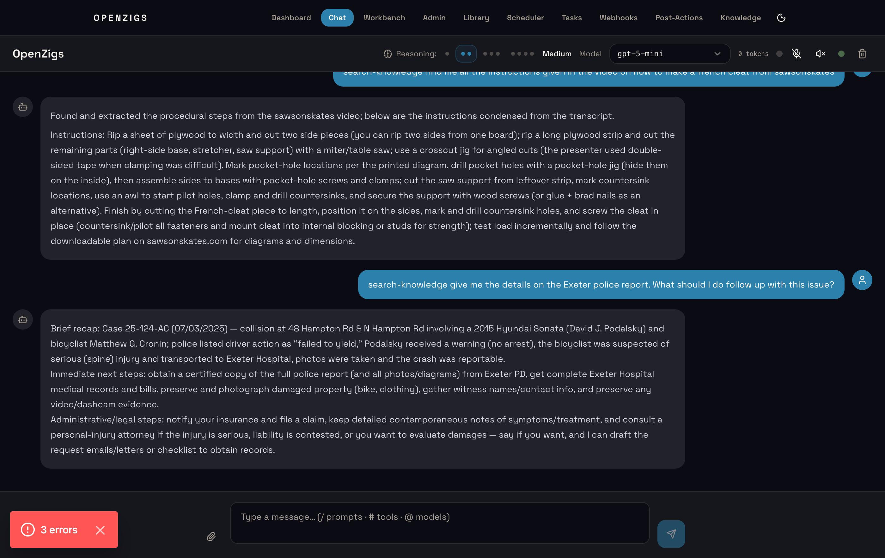

| Button | Icon | Action |
|---|---|---|
| **Mic toggle** | 🎤 / 🎤✕ | Start/stop wake word listening |
| **Speaker toggle** | 🔊 / 🔇 | Enable/disable TTS for AI responses |

**Wake word flow:**

1. Click the **mic button** to enter STANDBY mode (blue pulsing indicator).
2. Say **"Hey Zigs"** followed by your question (e.g., "Hey Zigs, what's the weather?").
3. The indicator turns green (ACTIVE) while capturing your query.
4. After 5 seconds of silence, the captured query is submitted as a chat message.
5. The system returns to STANDBY, listening for the next wake word.

**TTS flow:**

1. Click the **speaker button** to enable TTS output.
2. When the AI responds, the last assistant message is read aloud via Google Cloud TTS.
3. Say "Hey Zigs" during playback to interrupt the audio.

**Cost control (free tier):**

- To stay in the largest free tier, use a **Standard** voice (recommended: `en-US-Standard-C`).
- You can change this in **Admin → Environment → Voice TTS voice**.

### Voice Configuration Reference

| Key | Type | Default | Description |
|---|---|---|---|
| `voice.enabled` | boolean | `false` | Enable/disable voice features globally. |
| `voice.provider` | string | `"google"` | TTS provider (currently only Google Cloud). |
| `voice.voiceName` | string | `"en-US-Standard-C"` | Google Cloud voice name. Use Standard voices for free-tier-preferred usage. |
| `voice.speakingRate` | number | `1.0` | Speech rate (0.25–4.0). |
| `voice.pitch` | number | `0.0` | Pitch adjustment (-20 to 20 semitones). |
| `voice.cacheDir` | string | `"~/.openzigs/voice-cache"` | Directory for cached audio files. |
| `voice.maxCacheSizeMb` | number | `500` | Maximum cache size in MB (LRU eviction). |
| `voice.maxTextLength` | number | `5000` | Maximum characters per TTS request. |

### Available Voices

| Voice ID | Type | Pricing Tier | Description |
|---|---|---|---|
| `en-US-Standard-A` | Standard | Free-tier preferred | Male, generic American |
| `en-US-Standard-B` | Standard | Free-tier preferred | Male, slightly deeper |
| `en-US-Standard-C` | Standard | Free-tier preferred | Female, clear assistant style |
| `en-US-Standard-D` | Standard | Free-tier preferred | Male, news anchor style |
| `en-US-Standard-E` | Standard | Free-tier preferred | Female, slightly higher pitch |
| `en-US-Neural2-A` | Neural2 | Paid tier | Male, natural |
| `en-US-Neural2-C` | Neural2 | Paid tier | Female, natural |
| `en-US-Neural2-J` | Neural2 | Paid tier | Male, deeper voice |
| `en-US-Journey-D` | Journey | Paid tier | Male, conversational |
| `en-US-Journey-F` | Journey | Paid tier | Female, conversational |

### Voice REST API

```bash
# Synthesize text to speech (returns MP3 audio stream)
curl -X POST -H "Content-Type: application/json" \
  -d '{"text": "Hello from OpenZigs"}' \
  http://localhost:3000/api/voice/speak -o hello.mp3

# Get voice configuration and available voices
curl http://localhost:3000/api/voice/config

# Get cache statistics
curl http://localhost:3000/api/voice/cache

# Clear the TTS cache
curl -X DELETE http://localhost:3000/api/voice/cache
```

### Browser Compatibility (Wake Word)

| Browser | Web Speech API | Notes |
|---|---|---|
| Chrome 90+ | ✅ Supported | Full support, recommended |
| Edge 90+ | ✅ Supported | Uses Chromium engine |
| Brave | ✅ Supported | Uses Chromium engine |
| Firefox | ❌ Not supported | Web Speech API not available |
| Safari | ⚠️ Partial | Recognition available but may require permission |

### Troubleshooting Voice

| Symptom | Likely Cause | Fix |
|---|---|---|
| Voice buttons not visible | `voice.enabled` is `false` or browser doesn't support Web Speech API | Set `voice.enabled: true` in config. Use Chrome. |
| TTS returns 503 | `GOOGLE_APPLICATION_CREDENTIALS` not set | Set the env var pointing to your service account JSON key. |
| TTS returns 429 | Google Cloud quota exceeded | Check your project's quota dashboard. Free tier allows 1M chars/month. |
| Mic not working | Browser blocked microphone access | Click the lock icon in the address bar → allow microphone. |
| Wake word not detected | Background noise or unclear speech | Speak clearly and say "Hey Zigs" distinctly. Try lowering `fuzzyThreshold`. |
| Audio not playing | Browser autoplay policy | Click the speaker toggle to explicitly enable TTS (user gesture required). |

### Pricing

Google Cloud TTS pricing (as of 2025):

| Voice Type | Free Tier | Paid Tier |
|---|---|---|
| Standard | 4M characters/month | $4/1M characters |
| WaveNet | 1M characters/month | $16/1M characters |
| Neural2 | 1M bytes/month | $16/1M bytes |
| Journey | 1M bytes/month | $16/1M bytes |

The cache system significantly reduces API calls — repeated queries hit the local cache instead of calling Google.

### Local Voice Provider (Audio Sidecar)

As an alternative to Google Cloud TTS, OpenZigs supports a **local audio sidecar** that runs speech synthesis (TTS) and speech-to-text (STT) entirely on your machine using Apple Silicon (MPS) or CUDA acceleration — no cloud API keys, no per-character costs.

#### Prerequisites

| Requirement | Purpose |
|---|---|
| **Python 3.12+** | Runs the audio sidecar server. |
| **Apple Silicon Mac** (or CUDA GPU) | MLX models require Metal Performance Shaders or CUDA. |
| **ffmpeg** | Required for audio format conversion during transcription. |

#### Setup

1. Start the audio sidecar:
   ```bash
   cd sidecars/audio
   pip install -r requirements.txt
   python server.py --port 5006
   ```

   Or via Docker Compose:
   ```bash
   docker compose up -d audio-sidecar
   ```

2. Configure the voice provider in `~/.openzigs/config.json`:
   ```json
   {
     "voice": {
       "enabled": true,
       "provider": "local",
       "sidecarUrl": "http://localhost:5006"
     }
   }
   ```

3. Restart the server. You should see:
   ```
   Voice service initialized (provider: local, sidecar: http://localhost:5006)
   ```

#### Local Model Downloads & Git

- `pip install -r requirements.txt` installs Python packages only — it does **not** download ML weight files.
- Model weights are fetched automatically on first use:
  - First `POST /tts` downloads Kokoro (`mlx-community/Kokoro-82M-bf16`)
  - First `POST /transcribe` downloads Whisper (`distil-large-v3`)
- OpenZigs ignores these artifacts in git. They are runtime-generated and should not be committed.

**Default local cache locations (repo-local):**

- `sidecars/audio/mlx_models/` (Whisper MLX model files)
- `sidecars/audio/.cache/huggingface/` (Hugging Face cache)

You can prefetch models after startup by calling `/tts` and `/transcribe` once, then check `GET /health` to confirm both models are loaded.

#### Available Local Voices

The sidecar provides 19 Kokoro voice presets across 4 languages:

| Language | Voices |
|---|---|
| **American English** | Heart (F), Bella (F), Nicole (F), Sarah (F), Sky (F), Adam (M), Michael (M) |
| **British English** | Emma (F), Isabella (F), George (M), Lewis (M) |
| **Japanese** | Alpha (F), Beta (M), Gamma (F) |
| **Chinese** | Xiaobei (F), Xiaoniu (F), Yunjian (M), Yunxi (M), Yunyang (M) |

Preview voices from **Admin → Voice & Audio** in the web UI.

#### Push-to-Talk Voice Input

With the audio sidecar running, a **microphone button** (🎤) appears in the chat input area, next to the file attachment button. This provides push-to-talk voice transcription:

1. **Click** the mic button to start recording (or hold to record, release to stop).
2. Speak your message.
3. **Click again** (or release) to stop recording.
4. The audio is transcribed via the local sidecar and inserted into the text input.
5. Press Enter to send (or edit the transcribed text first).

This uses the browser's `MediaRecorder` API and sends audio to the sidecar's `/transcribe` endpoint — no Google Cloud or browser Speech API required.

#### Admin Voice Panel

The **Admin → Voice & Audio** panel shows:

- **Provider status**: Local or Google Cloud, with health indicator.
- **Sidecar health**: Online/offline status with URL display.
- **Loaded models**: TTS (Kokoro, ~330MB) and STT (Whisper, ~1.5GB) with independent load/unload controls.
- **Voice browser**: All 19 local voices with preview playback.

#### Memory Usage

| Model | Approximate VRAM |
|---|---|
| Kokoro TTS (Kokoro-82M-bf16) | ~330 MB |
| Whisper STT (distil-large-v3) | ~1.5 GB |
| Both loaded | ~1.8 GB |

Models load lazily on first use and auto-unload after 5 minutes of inactivity (configurable via `AUDIO_IDLE_TIMEOUT` environment variable).

#### Ingesting Audio/Video into the Knowledge Base

When the audio sidecar is running, audio and video files dropped into the knowledge directory are automatically transcribed and indexed:

1. Place `.mp4`, `.mp3`, `.wav`, or other media files in your knowledge directory (default: `~/.openzigs/knowledge/`).
2. The knowledge ingestion service detects the file and routes it to the sidecar media converter.
3. The audio track is extracted via ffmpeg and sent to the sidecar for transcription.
4. The transcript (with timestamps) is chunked, embedded, and stored in the vector database.
5. You can now search spoken content via natural language queries.

**Media-aware search**: Queries containing media keywords ("video", "recording", "podcast") automatically boost results from media transcripts. Timestamp citations (e.g., `[meeting.mp4 @ 2:30 → 3:15]`) are included in search results.

---

## Docker Usage

### Full Stack (Recommended)

```bash
docker compose up -d
```

This starts the complete stack:

| Service | Description | Port |
|---|---|---|
| `agent` | OpenZigs agent server | 3000 |
| `tunnel` | Cloudflare Tunnel sidecar | — (proxies to `agent:3000`) |
| `audio-sidecar` | Local TTS + STT (MLX) | 5006 |

All MCP tool servers now run as **native subprocesses** via `LocalMcpServerManager` (11 servers: word, markitdown, gmail, database, github, calendar, twitter, youtube, linkedin, reddit, tiktok). They are managed automatically by the agent — no Docker containers needed.

### Starting Individual Services

If you only need a subset of services:

```bash
# Agent + tunnel only
docker compose up -d agent tunnel

# Agent only (no tunnel, no audio sidecar)
docker compose up -d agent
```

> **Note:** If an MCP sidecar is not running, the corresponding tools will return connection errors when invoked. The agent does not currently health-check sidecars on startup.

### View Logs

```bash
docker compose logs -f           # All services
docker compose logs -f agent     # Agent only
docker compose logs -f tunnel    # Tunnel only
```

### Stop

```bash
docker compose down
```

### Development with Docker

```bash
docker compose -f docker-compose.yml -f docker-compose.dev.yml up
```

This mounts the source directory for live-reload inside the container.

### Persistence

- **Session data and auth tokens** are stored in `~/.openzigs/` on the host (mounted as a Docker volume).
- **SQLite database** (prompts, jobs) is stored inside the agent container at the configured path. Data survives container restarts via the `~/.openzigs/` mount.

---

## Cloudflare Tunnel

The Cloudflare Tunnel provides a public HTTPS URL to reach your local agent. This is required for Telegram webhooks, Discord OAuth redirects, worker node callbacks (LTX video / FluxQ images), and **Social Brain platform webhooks** (Instagram, Facebook, Twitter, TikTok). All services share the same tunnel — no separate endpoints or ingress rules are needed.

> **Security requirement:** Once a tunnel exposes your agent to the internet, you **must** add Cloudflare Access policies to lock it down. Without Access, anyone can reach your admin UI and API. See [Securing the Tunnel with Cloudflare Access](#securing-the-tunnel-with-cloudflare-access) below.

### System LaunchDaemon (Recommended for macOS)

The most reliable production setup uses `cloudflared` installed via Homebrew and managed by macOS `launchd` as a **system daemon** — it starts at boot, runs as root, and restarts automatically on crash.

```bash
# Install cloudflared
brew install cloudflare/cloudflare/cloudflared

# Authenticate and create a named tunnel
cloudflared tunnel login
cloudflared tunnel create openzigs-home

# Add DNS routes (one per subdomain)
cloudflared tunnel route dns openzigs-home agent.example.com
cloudflared tunnel route dns openzigs-home presenter.example.com

# Install as a system daemon (prompts for sudo)
sudo cloudflared service install --token <your-tunnel-token>
```

This creates `/Library/LaunchDaemons/com.cloudflare.cloudflared.plist` with:
- `RunAtLoad: true` — starts at boot
- `KeepAlive: true` — restarts on crash
- Logs to `/Library/Logs/com.cloudflare.cloudflared.{out,err}.log`

**Tunnel management commands:**

```bash
# Start
sudo launchctl bootstrap system /Library/LaunchDaemons/com.cloudflare.cloudflared.plist

# Stop
sudo launchctl bootout system/com.cloudflare.cloudflared

# Status
pgrep -la cloudflared

# Logs
tail -f /Library/Logs/com.cloudflare.cloudflared.err.log
```

Disable the agent's built-in quick tunnel to prevent orphaned processes:

```json
// ~/.openzigs/config.json
{
  "tunnel": {
    "enabled": false
  }
}
```

Set the tunnel callback URL so worker nodes can reach the agent:

```bash
# .env
QUEUE_CALLBACK_URL=https://agent.example.com/api/queue/complete
```

### Docker Sidecar

In the Docker deployment, `cloudflared` runs as a separate container defined in `docker-compose.yml`.

1. Create a Cloudflare Tunnel in the [Cloudflare Zero Trust dashboard](https://one.dash.cloudflare.com/) and copy the tunnel token.

2. Set the token in your `.env`:

   ```dotenv
   TUNNEL_TOKEN=your-cloudflare-tunnel-token
   ```

3. Ensure the agent's internal tunnel is **disabled**:

   ```json
   { "tunnel": { "enabled": false } }
   ```

4. Start the stack: `docker compose up -d`

### Embedded Quick Mode (Development)

For local development without Docker, the agent can spawn `cloudflared` as a child process — generates a temporary `https://xxx.trycloudflare.com` URL. No Cloudflare account required.

```json
{
  "tunnel": {
    "enabled": true,
    "mode": "quick"
  }
}
```

> **Warning:** Never use Quick Mode in production — it creates ephemeral tunnels with no access control.

---

## Securing the Tunnel with Cloudflare Access

Cloudflare Access acts as an authentication gateway in front of your tunnel — **every request** is intercepted and must pass an Access policy before reaching your server. Without this, anyone who discovers your `*.openzigs.com` URLs can reach your full admin UI and API.

### How it works

Access uses **path-based application separation**. You create one Access application per path you want to protect or bypass. More specific paths take precedence over broader ones:

| Application | Path | Policy | Why |
|---|---|---|---|
| Agent: Worker Callbacks | `agent.example.com/api/queue/complete` | Bypass (Everyone) | Worker nodes can't do email OTP; secured by `workerSecret` at app level. When `workerSecret` is not configured, server only accepts localhost requests |
| Agent: Telegram Webhook | `agent.example.com/telegram/webhook` | Bypass (Everyone) | Telegram servers can't authenticate; secured by `X-Telegram-Bot-Api-Secret-Token` |
| Agent: Social Webhooks | `agent.example.com/api/social/webhooks/*` | Bypass (Everyone) | Platform HMAC-SHA256 verified at app level |
| Agent: Health Check | `agent.example.com/health` | Bypass (Everyone) | No sensitive data |
| Agent: OAuth Callbacks | `agent.example.com/api/*/oauth/callback` | Bypass (Everyone) | OAuth provider redirect; CSRF state validated at app level |
| **OpenZigs Agent API** | `agent.example.com` *(catch-all)* | Allow (`you@gmail.com`) | All other routes require email OTP |
| Presenter: Invite Redeem | `presenter.example.com/api/invite/redeem` | Bypass (Everyone) | JWT verified at app level |
| Presenter: Viewer Pages | `presenter.example.com/presenter/*` | Bypass (Everyone) | Guest cookie auth at app level |
| Presenter: Socket.IO | `presenter.example.com/socket.io/*` | Bypass (Everyone) | Guests need real-time sync |
| Presenter: PeerJS | `presenter.example.com/peerjs/*` | Bypass (Everyone) | WebRTC signaling for voice rooms |
| **OpenZigs Presenter** | `presenter.example.com` *(catch-all)* | Allow (`you@gmail.com`) | All other routes require email OTP |

> **Key principle:** Bypass does not mean unprotected — each bypassed route still enforces its own application-level secret (HMAC, workerSecret, JWT, OAuth state). Cloudflare Access just doesn't add an *additional* OTP layer on top.

### Step 1: Create a Cloudflare API token

1. Go to [Cloudflare Dashboard → Profile → API Tokens](https://dash.cloudflare.com/profile/api-tokens)
2. Click **Create Token** → use the **Zero Trust** template, or create custom with:
   - `Account > Cloudflare Zero Trust > Edit`
   - `Account > Access: Apps and Policies > Edit`
3. Copy the token — it's shown only once.

### Step 2: Find your Account ID

In the Cloudflare dashboard, select your account. The URL contains your Account ID:
`https://dash.cloudflare.com/<ACCOUNT_ID>/...`

Or find it in the right sidebar on any zone overview page.

### Step 3: Run the setup script

```bash
# Option A — environment variables
export CF_API_TOKEN="cfut_your_token_here"
export CF_ACCOUNT_ID="your_account_id_here"
export ALLOWED_EMAIL="you@example.com"
export AGENT_DOMAIN="agent.example.com"
export PRESENTER_DOMAIN="presenter.example.com"
bash scripts/setup-cloudflare-access.sh

# Option B — interactive prompts
bash scripts/setup-cloudflare-access.sh
```

The script creates all bypass and protected applications via the Cloudflare API and prints verification commands.

### Step 4: Verify

```bash
# Protected route — must get 302 (redirect to Cloudflare login)
curl -s -o /dev/null -w '%{http_code}' https://agent.example.com/

# Bypass route — must NOT get 302 (passes through to app)
curl -s -o /dev/null -w '%{http_code}' https://agent.example.com/health

# Worker callback — gets 401 (app-level workerSecret missing, not 302)
curl -s -o /dev/null -w '%{http_code}' -X POST https://agent.example.com/api/queue/complete
```

Open an incognito window and navigate to your domain — you should see the Cloudflare login page, not your admin UI.

### Credential rotation

If your `auth.token` is ever exposed (e.g., accidentally committed or visible in browser DevTools):

```bash
# Generate new token
python3 -c "import secrets; print(secrets.token_hex(32))"

# Update config
# Edit ~/.openzigs/config.json → auth.token
# Edit ui/.env.local → NEXT_PUBLIC_OPENZIGS_TOKEN

# Restart server
pnpm dev
```

Rotate the Telegram webhook secret similarly, then re-register:

```bash
NEW_SECRET=$(python3 -c "import secrets; print(secrets.token_hex(32))")
# Update ~/.openzigs/config.json → channels.telegram.webhookSecret
curl -s -X POST "https://api.telegram.org/bot$TELEGRAM_BOT_TOKEN/setWebhook" \
  -H "Content-Type: application/json" \
  -d "{\"url\":\"https://agent.example.com/telegram/webhook\",\"secret_token\":\"$NEW_SECRET\"}"
```

---

## Productivity Tools

OpenZigs includes an embedded productivity engine backed by SQLite for saved prompts and cron-based job scheduling.

### Saved Prompts

Save reusable prompt templates with `{{variable}}` interpolation:

```
You: Save a prompt called "daily-standup" with content "Summarize the key updates from {{channel}} for {{date}}"
Agent: ✅ Saved prompt "daily-standup" (id: 1)

You: Run the prompt "daily-standup" with channel=telegram and date=today
Agent: [executes the resolved prompt]
```

**Available tools:** `save-prompt`, `get-prompt`, `list-prompts`, `update-prompt`, `delete-prompt`, `run-prompt`.

**REST API:**

```bash
# List all prompts
curl -H "Authorization: Bearer <token>" http://localhost:3000/api/prompts

# Create a prompt
curl -X POST -H "Authorization: Bearer <token>" \
  -H "Content-Type: application/json" \
  -d '{"name": "greeting", "content": "Hello {{name}}!"}' \
  http://localhost:3000/api/prompts
```

### Scheduled Jobs

Schedule automated cron jobs that the agent executes on a recurring basis:

```
You: Schedule a job called "morning-summary" to run at 8am every day with the action "Summarize yesterday's activity"
Agent: ✅ Scheduled job "morning-summary" (cron: 0 8 * * *)
```

**Available tools:** `schedule-job`, `list-jobs`, `get-job`, `update-job`, `delete-job`, `toggle-job`.

**REST API:**

```bash
# List all jobs
curl -H "Authorization: Bearer <token>" http://localhost:3000/api/jobs

# Toggle a job on/off
curl -X POST -H "Authorization: Bearer <token>" \
  -H "Content-Type: application/json" \
  -d '{"enabled": false}' \
  http://localhost:3000/api/jobs/1/toggle
```

---

## Social Media Tools

Social media tools are powered by **native MCP servers** — Python subprocess servers managed by `LocalMcpServerManager`. Each platform has its own server in `external/` with full API coverage for posting, reading, analytics, DMs, and comment replies.

### Supported Platforms

| Platform | MCP Server | Publish Tool | Content Types | Key Tools |
|---|---|---|---|---|
| **Twitter/X** | `twitter-mcp` | `twitter-post-tweet` | Text (280 chars), replies | 8 tools: tweets, search, DMs, user lookup |
| **LinkedIn** | `linkedin-mcp` | `linkedin-create-post` | Text (PUBLIC or CONNECTIONS) | 8 tools: profile, posts, company, messages, comments |
| **Reddit** | `reddit-mcp` | `reddit-submit-post` | Text or link post to a subreddit | 8 tools: subreddits, posts, comments, search, inbox |
| **YouTube** | `youtube-mcp` | `youtube-upload-video` | Video file upload (resumable) with metadata | 8 tools: channel, videos, comments, search, analytics, **upload** |
| **TikTok** | `tiktok-mcp` | — (read-only) | Search, post details, subtitles | 3 tools: search, get post details, get subtitles |

> **Note — YouTube Upload Quota:** Each `youtube-upload-video` call consumes **1,600 quota units** (default daily quota: 10,000 units), limiting uploads to **~6 per day**. The upload uses the YouTube Data API v3 resumable upload protocol — provide a path to a local video file and the tool handles chunked transfer automatically. Uploads default to **private** privacy. Set `privacy_status` to `"public"` or `"unlisted"` as needed. Requires an OAuth2 token with the `youtube.upload` scope — see [YouTube OAuth Setup](#youtube-oauth-setup) in the Social Brain Guide.

### Posting Content

You can publish content to any supported platform by asking the agent in chat:

```
You: Post "Just shipped a new feature! 🚀" to LinkedIn
Agent: [calls linkedin-create-post] ✅ Posted to LinkedIn

You: Tweet "Check out our latest blog post: https://example.com/blog"
Agent: [calls twitter-post-tweet] ✅ Tweeted

You: Submit a post to r/programming titled "My new open-source project" with a link
Agent: [calls reddit-submit-post] ✅ Submitted to r/programming

You: Upload /path/to/video.mp4 to YouTube titled "Product Demo" with tags ["demo", "product"]
Agent: [calls youtube-upload-video] ✅ Uploaded to YouTube (video ID: abc123, status: private)

You: Search TikTok for "AI coding tools"
Agent: [calls tiktok_search] Found 10 results for "AI coding tools"
```

The agent automatically selects the correct platform-specific tool and handles parameter mapping. For a comprehensive list of all tools per platform, see the [Social Brain Guide](SOCIAL_BRAIN_GUIDE.md#platform-specific-tools).

### Configuration

Each MCP server requires platform-specific API credentials set as environment variables in your `.env` file (see [Environment Variables](#3-configure-environment)). Servers start automatically when credentials are present. Manage server status and restart servers from the Admin UI under **MCP Servers**.

### Platform API Setup Guide

Each social platform requires its own set of API credentials. This section walks through every step needed to get each platform working. All servers require **Python 3.10+** with a virtual environment.

#### Python Virtual Environment Setup (All Platforms)

Every social media MCP server needs its own Python venv. Run this for each platform you want to enable:

```bash
# Replace {platform} with: twitter-mcp, youtube-mcp, linkedin-mcp, reddit-mcp, ig-mcp, fb-mcp
cd external/{platform}
python3 -m venv .venv
source .venv/bin/activate
pip install -r requirements.txt
deactivate
```

After creating the venv and setting the required environment variables in `.env`, restart OpenZigs and the server will start automatically.

---

#### Twitter / X

**Difficulty:** Easy | **Token Expiry:** None (bearer tokens are permanent) | **App Review:** Not required for personal use

**Required Environment Variables:**

| Variable | Required | Purpose |
|---|---|---|
| `TWITTER_BEARER_TOKEN` | Yes | API v2 read/write access |
| `TWITTER_API_KEY` | No | OAuth 1.0a (for DMs) |
| `TWITTER_API_SECRET` | No | OAuth 1.0a (for DMs) |
| `TWITTER_ACCESS_TOKEN` | No | OAuth 1.0a user token |
| `TWITTER_ACCESS_TOKEN_SECRET` | No | OAuth 1.0a user token secret |

**Setup Steps:**

1. Go to the [X Developer Portal](https://developer.x.com/en/portal/dashboard).
2. Sign in with your X account and accept the **Developer Agreement**.
3. Create a new **Project** and **App** inside the project.
4. Under **Keys and Tokens**, copy the **Bearer Token** (shown once — save immediately).
5. (Optional) Generate **API Key + Secret** and **Access Token + Secret** for OAuth 1.0a operations like DMs and posting.
6. If you change app permissions (e.g., Read → Read & Write), you must **regenerate** your Access Token and Access Token Secret.
7. Add to your `.env`:
   ```dotenv
   TWITTER_BEARER_TOKEN=AAAAAAAAAAAAAAAAAAAAAAxxxxxxx
   # Optional for DMs and posting:
   # TWITTER_API_KEY=xxxxxx
   # TWITTER_API_SECRET=xxxxxx
   # TWITTER_ACCESS_TOKEN=xxxxxx
   # TWITTER_ACCESS_TOKEN_SECRET=xxxxxx
   ```
8. Create the venv: `cd external/twitter-mcp && python3 -m venv .venv && source .venv/bin/activate && pip install -r requirements.txt && deactivate`

> **Authentication options:** Bearer Token provides read-only app-level access. For user actions (posting, DMs), use OAuth 1.0a (API Key + Access Token) or OAuth 2.0 with PKCE (supports `offline.access` scope for automatic token refresh).

**Rate Limits:** X API uses a **credit-based pay-per-usage** model with configurable spending limits. Free tier has limited access (~500 tweet reads/month). See [X API Pricing](https://docs.x.com/x-api/getting-started/pricing) for current tiers.

**Available Tools (8):** `twitter_post_tweet`, `twitter_send_dm`, `twitter_search_tweets`, `twitter_get_user_info`, `twitter_get_user_tweets`, `twitter_get_tweet`, `twitter_get_followers`, `twitter_get_following`

---

#### YouTube

**Difficulty:** Medium | **Token Expiry:** OAuth access tokens expire in ~1 hour (auto-refreshed); refresh tokens last 7 days in Testing mode | **App Review:** Not required for personal use; unverified apps limited to 100 test users

**Environment Variables:**

| Variable | Required | Set by | Purpose |
|---|---|---|---|
| `YOUTUBE_API_KEY` | Yes | You | Read operations: list videos, comments, search, analytics |
| `YOUTUBE_CHANNEL_ID` | Recommended | You | Channel ID (`UCxxxx`) for the comment poller to monitor |
| `YOUTUBE_CHANNEL_HANDLE` | Optional | You | Alternative to Channel ID — your `@handle` |
| `YOUTUBE_CLIENT_ID` | For OAuth | Admin UI | Google OAuth 2.0 client ID |
| `YOUTUBE_CLIENT_SECRET` | For OAuth | Admin UI | Google OAuth 2.0 client secret |
| `YOUTUBE_OAUTH_TOKEN` | Auto | Admin UI | Access token — upload videos, reply to comments |
| `YOUTUBE_REFRESH_TOKEN` | Auto | Admin UI | Long-lived token used to renew the access token |
| `YOUTUBE_TOKEN_EXPIRES_AT` | Auto | Admin UI | Expiry timestamp (epoch ms) |

**What API key vs OAuth gives you:**

| Capability | API Key only | API Key + OAuth |
|---|---|---|
| List videos, search, analytics | ✅ | ✅ |
| Read comments | ✅ | ✅ |
| Reply to comments | ❌ | ✅ |
| Upload videos | ❌ | ✅ |
| Automatic token refresh | ❌ | ✅ (every 15 min) |

---

**Step 1 — Create a Google Cloud project and enable the API:**

1. Go to [Google Cloud Console](https://console.cloud.google.com/).
2. Click **Select a project → New Project**, give it a name (e.g., "OpenZigs"), and click **Create**.
3. Navigate to **APIs & Services → Library**.
4. Search for **YouTube Data API v3** and click **Enable**.
5. Go to **APIs & Services → Credentials → Create Credentials → API Key**. Copy the key.
6. In Admin → Social Brain → YouTube, paste the key into the **YouTube API Key** field and click **Save**.
   Or add it directly to `.env`:
   ```dotenv
   YOUTUBE_API_KEY=AIzaSy_xxxxxxxxxxxxxxxxxxxxxxxx
   ```

**Step 2 — Add your channel identifier:**

7. In Admin → Social Brain → YouTube, fill in **Channel ID** or **Channel Handle** so the comment poller knows which channel to monitor:
   - **Channel ID** (`UCxxxxxxxxxxxxxxxxxx`): found in YouTube Studio → Settings → Channel → Advanced settings.
   - **Channel Handle** (`@YourChannel`): your public @handle — simpler to find.
8. Click **Save**. Values are written to `.env` as `YOUTUBE_CHANNEL_ID` and `YOUTUBE_CHANNEL_HANDLE`.

> **Admin display:** After saving, the YouTube section shows your API key (masked) and channel values just above the input fields. The fields themselves remain blank — they are for entering updates, not displaying current values. If the section appears collapsed, click the header to expand it.

---

**Step 3 — Enable OAuth for video uploads and comment replies (optional but recommended):**

OAuth 2.0 is required for any write operation. OpenZigs has a **built-in OAuth flow** — no manual token copying or OAuth Playground needed.

**Configure Google Cloud Console:**

9. Navigate to **APIs & Services → OAuth consent screen**.
10. Select **User Type: External** (required even for personal use — "Internal" requires a Google Workspace org).
11. Fill in the App name, support email, and developer contact email.
12. Skip Scopes — OpenZigs requests them at authorization time.
13. Under **Test users**, click **Add users** and add your Google account. You must be listed here to authorize in Testing mode.
14. Save and continue.

> **Testing vs Production:** Stay in Testing mode for personal use. **Caveat:** Google's restricted scopes (`youtube.force-ssl`, `youtube.upload`) cause refresh tokens to expire after **7 days** in Testing mode, requiring weekly re-authorization. To eliminate this, publish the app on the consent screen (unverified apps allow up to 100 users — fine for personal use).

15. Navigate to **APIs & Services → Credentials → Create Credentials → OAuth client ID**.
16. Application type: **Web application** (not Desktop — Desktop clients do not support redirect URIs).
17. Under **Authorized redirect URIs**, add exactly:
    ```
    http://localhost:3000/api/youtube/oauth/callback
    ```
18. Click **Create**. Copy the **Client ID** and **Client Secret**.

**Connect via the Admin panel:**

19. Open **Admin → Social Brain → YouTube → Edit App Credentials**.
20. Paste your Client ID and Client Secret. Click **Save App Credentials**.
21. Click **Connect via OAuth**. A Google sign-in window opens.
22. If you see **"Google hasn't verified this app"**, click **Continue** — this is expected for personal/development apps.
23. Grant YouTube permissions and click **Allow**.
24. You are redirected back to Admin. `YOUTUBE_OAUTH_TOKEN`, `YOUTUBE_REFRESH_TOKEN`, and `YOUTUBE_TOKEN_EXPIRES_AT` are saved to `.env` automatically.

> **Automatic token refresh:** OpenZigs refreshes the access token every 15 minutes when it is within 30 minutes of expiry. No manual action is needed after the initial OAuth flow.

**Set up the MCP server venv:**

25. Create the venv: `cd external/youtube-mcp && python3 -m venv .venv && source .venv/bin/activate && pip install -r requirements.txt && deactivate`

---

**Quota:** 10,000 units/day free. Video uploads cost **1,600 units** each (~6 uploads/day max). Comment reads cost 1 unit each.

| Operation | Quota Cost | ~Daily Limit |
|---|---|---|
| `videos.insert` (upload) | 1,600 | ~6 |
| `commentThreads.list` | 1 | 10,000 |
| `comments.insert` (reply) | 50 | 200 |
| `search.list` | 100 | 100 |

> **Note:** Videos uploaded from unverified API projects are restricted to **private** viewing. Your project must pass a [YouTube API audit](https://support.google.com/youtube/contact/yt_api_form) to allow public/unlisted uploads.

**Available Tools (8):** `yt_upload_video`, `yt_reply_to_comment`, `yt_get_channel_videos`, `yt_get_video_comments`, `yt_search_videos`, `yt_get_channel_info`, `yt_get_video_details`, `yt_get_channel_analytics`

---

#### LinkedIn

**Difficulty:** Medium | **Token Expiry:** 60 days (auto-refreshable) | **App Review:** Required for DM access (Marketing API Partner)

**Required Environment Variables:**

| Variable | Required | Purpose |
|---|---|---|
| `LINKEDIN_ACCESS_TOKEN` | Yes | API v2 access |
| `LINKEDIN_CLIENT_ID` | Recommended | For automatic token refresh |
| `LINKEDIN_CLIENT_SECRET` | Recommended | For automatic token refresh |
| `LINKEDIN_PERSON_ID` | No | Auto-detected from token |

**Setup Steps:**

1. Go to [LinkedIn Developer Portal](https://www.linkedin.com/developers/apps/) and create a new app.
2. Request these products:
   - **Sign In with LinkedIn using OpenID Connect** (scopes: `openid`, `profile`, `email`)
   - **Share on LinkedIn** (scope: `w_member_social`) — needed for posting
3. In the **Auth** tab, add redirect URLs:
   - `http://localhost:3000/api/admin/linkedin/oauth/callback`
4. Copy **Client ID** and **Client Secret** from the Auth tab.

**Get Access Token (Easiest Method — Admin UI):**

5. Add your Client ID and Secret to `.env`:
   ```dotenv
   LINKEDIN_CLIENT_ID=xxxxxxxxxxxxxxxx
   LINKEDIN_CLIENT_SECRET=xxxxxxxxxxxxxxxx
   ```
6. Start OpenZigs and navigate to **Admin → MCP Servers → LinkedIn**.
7. Click **Connect LinkedIn** → Sign in and approve permissions.
8. The access token is saved automatically.

**Get Access Token (Manual Method):**

5. Visit: `https://www.linkedin.com/oauth/v2/authorization?response_type=code&client_id={CLIENT_ID}&redirect_uri=http://localhost:3000/api/admin/linkedin/oauth/callback&scope=openid%20profile%20email%20w_member_social`
6. Sign in and approve → You'll be redirected with an auth code.
7. OpenZigs exchanges the code for tokens automatically.

**Token Lifecycle:** Access tokens last 60 days and are auto-refreshed when they expire within 7 days (if Client ID/Secret are configured).

> **Note:** DM sending (`linkedin_send_message`) requires **Marketing API Partner** status, which involves a separate application process with LinkedIn.

**Comment Monitoring — Community Management API:**

LinkedIn polling detects comments on your **personal posts** using the "Share on LinkedIn" product. To monitor comments on **organization/company page posts** and access likes, reactions, and analytics, you need LinkedIn's **Community Management API** — which must be on a **separate LinkedIn app** (it is mutually exclusive with "Share on LinkedIn"). See the [Social Brain Guide — LinkedIn Community Management API](SOCIAL_BRAIN_GUIDE.md#linkedin-comment-monitoring--community-management-api) for full setup instructions.

**Available Tools (8):** `linkedin_create_post`, `linkedin_reply_to_comment`, `linkedin_send_message`, `linkedin_get_profile`, `linkedin_get_posts`, `linkedin_get_company_info`, `linkedin_get_connections`, `linkedin_get_messages`

---

#### Reddit

**Difficulty:** Easy | **Token Expiry:** None (auto-refreshed internally) | **App Review:** Not required

**Required Environment Variables:**

| Variable | Required | Purpose |
|---|---|---|
| `REDDIT_CLIENT_ID` | Yes | App client ID |
| `REDDIT_CLIENT_SECRET` | Yes | App client secret |
| `REDDIT_USERNAME` | Yes | Bot account username |
| `REDDIT_PASSWORD` | Yes | Bot account password |

**Setup Steps:**

1. Go to [reddit.com/prefs/apps](https://www.reddit.com/prefs/apps).
2. Scroll to the bottom and click **create another app...**.
3. Fill in details:
   - **Name:** e.g., "OpenZigs Bot"
   - **App type:** Select **script**
   - **Redirect URI:** `http://localhost:3000` (required field, not used for script apps)
4. Click **Create app**.
5. Note the credentials:
   - **Client ID:** The string under the app name (e.g., `a1b2c3d4e5f6g7`)
   - **Client Secret:** The "secret" field
6. Add to your `.env`:
   ```dotenv
   REDDIT_CLIENT_ID=a1b2c3d4e5f6g7
   REDDIT_CLIENT_SECRET=xxxxxxxxxxxxxxxxxxxxxxxx
   REDDIT_USERNAME=your_bot_username
   REDDIT_PASSWORD=your_bot_password
   ```
7. Create the venv: `cd external/reddit-mcp && python3 -m venv .venv && source .venv/bin/activate && pip install -r requirements.txt && deactivate`

**Rate Limits:** 60 requests/minute per OAuth token.

> **Tip:** Consider creating a separate Reddit account for your bot rather than using your personal account.

**Available Tools (8):** `reddit_submit_post`, `reddit_reply_to_comment`, `reddit_send_message`, `reddit_get_subreddit_posts`, `reddit_get_post_comments`, `reddit_search`, `reddit_get_inbox`, `reddit_get_user_info`

---

#### Instagram (Meta Graph API)

**Difficulty:** Hard | **Token Expiry:** 60 days (must be refreshed) | **App Review:** Required for DM access

Instagram publishing uses the **Meta Graph API** and requires a Facebook Developer account, a Facebook Page, and an Instagram Professional account linked to that page.

**Required Environment Variables:**

| Variable | Required | Purpose |
|---|---|---|
| `INSTAGRAM_ACCESS_TOKEN` | Yes | Long-lived user token (60-day expiry) |
| `FACEBOOK_APP_ID` | Yes | Meta App ID |
| `FACEBOOK_APP_SECRET` | Yes | Meta App Secret |
| `INSTAGRAM_BUSINESS_ACCOUNT_ID` | No | Auto-detected from linked page |

**Prerequisites:**
- An **Instagram Professional Account** (Business or Creator) — free to switch in Instagram app settings
- A **Facebook Page** connected to that Instagram account
- A **Meta Developer Account** at [developers.facebook.com](https://developers.facebook.com)

**Step 1 — Switch Instagram to Professional:**

1. Open the Instagram app → Profile → **Settings and privacy**.
2. Scroll to **Account type and tools → Switch to professional account**.
3. Choose a category (e.g., "Software Company") and select **Business** or **Creator**.

**Step 2 — Create a Facebook Page (if you don't have one):**

1. Go to [facebook.com/pages/create](https://www.facebook.com/pages/create).
2. Enter a page name and category → Click **Create Page**.

**Step 3 — Link Instagram to Facebook Page:**

1. Go to [business.facebook.com](https://business.facebook.com).
2. Navigate to your business portfolio → **Settings → Instagram accounts**.
3. Click **Connect Instagram** → Log into Instagram and authorize.
4. Confirm the connection.

**Step 4 — Create a Meta App:**

1. Go to [developers.facebook.com](https://developers.facebook.com) → **My Apps → Create App**.
2. App type: **Business** (or **Consumer** for personal use).
3. Fill in the app name and contact email.
4. Add products:
   - **Instagram Graph API** → Click **Set Up**
5. Go to **Settings → Basic** and copy:
   - **App ID** → `FACEBOOK_APP_ID`
   - **App Secret** → `FACEBOOK_APP_SECRET`

**Step 5 — Generate Access Tokens:**

1. Go to the [Graph API Explorer](https://developers.facebook.com/tools/explorer/).
2. Select your app from the dropdown.
3. Click **Generate Access Token** and approve the required permissions:
   - `instagram_basic`
   - `instagram_content_publish`
   - `instagram_manage_comments` — read and reply to comments
   - `pages_show_list`
   - `pages_read_engagement`
   - `business_management`

> **New scope names (2025):** Meta is migrating to new scope names: `instagram_business_basic`, `instagram_business_manage_comments`, `instagram_business_manage_messages`, `instagram_business_content_publish`. Both old and new names currently work, but plan to migrate to the new names.

4. Copy the short-lived token.
5. Exchange for a **long-lived token** (lasts 60 days):
   ```bash
   curl "https://graph.facebook.com/v21.0/oauth/access_token?\
   grant_type=fb_exchange_token&\
   client_id=YOUR_APP_ID&\
   client_secret=YOUR_APP_SECRET&\
   fb_exchange_token=YOUR_SHORT_LIVED_TOKEN"
   ```
6. Copy the `access_token` from the response.

**Step 6 — Get Your Instagram Business Account ID:**

```bash
# Get your Page ID and Page Token
curl "https://graph.facebook.com/me/accounts?access_token=YOUR_LONG_LIVED_TOKEN"

# Get Instagram Business Account ID from the Page
curl "https://graph.facebook.com/YOUR_PAGE_ID?fields=instagram_business_account&access_token=YOUR_PAGE_TOKEN"
```

**Step 7 — Add to `.env`:**

```dotenv
FACEBOOK_APP_ID=123456789012345
FACEBOOK_APP_SECRET=abcdef1234567890abcdef1234567890
INSTAGRAM_ACCESS_TOKEN=EAAL...your-long-lived-token...
INSTAGRAM_BUSINESS_ACCOUNT_ID=17841400000000000
```

**Step 8 — Create the venv:**

```bash
cd external/ig-mcp && python3 -m venv .venv && source .venv/bin/activate && pip install -r requirements.txt && deactivate
```

> **Important:** Long-lived tokens expire after 60 days. Refresh before expiry with:
> ```bash
> curl "https://graph.facebook.com/v21.0/oauth/access_token?grant_type=fb_exchange_token&client_id=APP_ID&client_secret=APP_SECRET&fb_exchange_token=CURRENT_LONG_LIVED_TOKEN"
> ```

> **Publishing Constraint:** Instagram requires media (images/videos) to be hosted at **publicly accessible URLs**. Instagram's servers fetch the media from the URL you provide — local file paths will not work. Use a service like Cloudinary, S3, or any public web server.

> **Image Aspect Ratio Requirements:** Instagram enforces strict aspect ratio rules. Images must be between **4:5** (portrait, e.g., 1080×1350) and **1.91:1** (landscape, e.g., 1080×566). The recommended size is **1:1** (square, 1080×1080). Images outside this range will be **rejected** by the API — they are NOT auto-cropped. You must resize or crop images before providing the URL. For Unsplash images, you can append `?w=1080&h=1080&fit=crop` to the URL.

**Rate Limits:** 200 API calls/hour per token. Publishing limited to **25 posts/day**.

**Available Tools (12):** `get_profile_info`, `get_media_posts`, `get_media_insights`, `publish_media`, `get_account_pages`, `get_account_insights`, `validate_access_token`, `get_conversations`, `get_conversation_messages`, `reply_to_comment`, `get_media_comments`, `send_dm`

---

#### Facebook Pages (Meta Graph API)

**Difficulty:** Hard | **Token Expiry:** Page tokens are permanent (if generated from a long-lived user token) | **App Review:** Not required for page owner

Facebook Page publishing shares the same Meta App as Instagram. If you already set up Instagram above, you can reuse the same app.

**Required Environment Variables:**

| Variable | Required | Purpose |
|---|---|---|
| `FACEBOOK_PAGE_TOKEN` | Yes | Page-specific access token |
| `FACEBOOK_APP_ID` | Recommended | For token validation |
| `FACEBOOK_APP_SECRET` | Recommended | For token validation |
| `FACEBOOK_PAGE_ID` | No | Auto-detected from token |

**Setup Steps (if you already have a Meta App from Instagram setup):**

1. You already have your **App ID** and **App Secret** from the Instagram setup above.

2. Get a **Page Access Token** using the long-lived user token:
   ```bash
   curl "https://graph.facebook.com/me/accounts?access_token=YOUR_LONG_LIVED_USER_TOKEN"
   ```
   This returns a list of pages you manage. Each entry contains:
   - `name` — Page name
   - `access_token` — **Page token** (permanent when derived from a long-lived user token)
   - `id` — Page ID

3. Copy the `access_token` and `id` for your page.

**Setup Steps (starting from scratch):**

1. Follow Steps 1–5 of the [Instagram setup](#instagram-meta-graph-api) to create a Meta App and generate tokens.
2. When selecting permissions in the Graph API Explorer, also include:
   - `pages_manage_posts`
   - `pages_manage_metadata`
   - `pages_read_user_content`
3. Get your Page Token as described above.

**Add to `.env`:**

```dotenv
FACEBOOK_APP_ID=123456789012345
FACEBOOK_APP_SECRET=abcdef1234567890abcdef1234567890
FACEBOOK_PAGE_TOKEN=EAAL...your-page-token...
FACEBOOK_PAGE_ID=123456789012345
```

**Create the venv:**

```bash
cd external/fb-mcp && python3 -m venv .venv && source .venv/bin/activate && pip install -r requirements.txt && deactivate
```

> **Note:** Page tokens generated from a long-lived user token **do not expire**. However, if the user who generated them loses admin access to the page or changes their Facebook password, the token becomes invalid.

> **Privacy note (Graph API v24.0+):** Facebook no longer returns `from.id` for regular user comments due to privacy restrictions. The polling adapter automatically skips comments without user IDs — public comment replies still work via `fb_reply_to_comment`, but private DMs to anonymous commenters are not possible.

**Available Tools (10):** `fb_get_page_info`, `fb_get_page_posts`, `fb_get_post_insights`, `fb_publish_post`, `fb_get_conversations`, `fb_get_conversation_messages`, `fb_send_message`, `fb_get_page_insights`, `fb_get_post_comments`, `fb_reply_to_comment`

---

#### Pinterest

**Difficulty:** Medium | **Token Expiry:** 30 days (refresh token lasts 365 days) | **App Review:** Not required for personal sandbox

**Required Environment Variables:**

| Variable | Required | Purpose |
|---|---|---|
| `PINTEREST_ACCESS_TOKEN` | Yes | API v5 access token |
| `PINTEREST_AD_ACCOUNT_ID` | No | For ads analytics only |

**Setup Steps:**

1. Go to [developers.pinterest.com](https://developers.pinterest.com/) and create a developer account.
2. Create a new **App** → Note the **App ID** and **App Secret**.
3. Generate an access token via the [Pinterest Token Generator](https://developers.pinterest.com/tools/access-token/) or use OAuth 2.0 flow:
   - Authorize URL: `https://www.pinterest.com/oauth/?client_id=APP_ID&redirect_uri=REDIRECT_URI&response_type=code&scope=boards:read,pins:read,pins:write`
   - Exchange auth code for token: `POST https://api.pinterest.com/v5/oauth/token`
4. Add to `.env`:
   ```dotenv
   PINTEREST_ACCESS_TOKEN=pina_xxxxxxxxxxxxxxxxxxxxxxxx
   ```

**Rate Limits:** 300 write requests/day for sandbox. Production apps require app review for higher limits.

---

#### TikTok (via TikNeuron — Read Only)

**Difficulty:** Easy | **Token Expiry:** None (API key) | **App Review:** Not required | **Pricing:** Free tier (20 credits), Pro ($7.49/mo, 500 credits), Business ($24/mo, 1800 credits)

TikTok integration uses [TikNeuron](https://tikneuron.com), a third-party API that provides read-only access to TikTok content (search, post details, subtitles). No OAuth or TikTok developer account is needed.

**Required Environment Variables:**

| Variable | Required | Purpose |
|---|---|---|
| `TIKNEURON_MCP_API_KEY` | Yes | TikNeuron MCP API access |

**Setup Steps:**

1. Go to [tikneuron.com/signin](https://tikneuron.com/signin).
2. Click **"Login with Google"** (Google is the only supported sign-in method).
3. Sign in with your Google account and authorize TikNeuron.
4. After signing in, you'll be redirected to the TikNeuron dashboard.
5. Navigate to the [API page](https://tikneuron.com/api) — your API key is shown under **"Your API Key"** at the top of the page.
6. Copy the API key and add to your `.env`:
   ```dotenv
   TIKNEURON_MCP_API_KEY=your_api_key_here
   ```
7. The TikTok MCP server is a Node.js server (no Python venv needed). It's pre-built at `external/tiktok-mcp/build/index.js` and starts automatically when `TIKNEURON_MCP_API_KEY` is set.

> **Note:** TikTok integration is **read-only**. You can search posts, get post details, and download subtitles, but publishing is not supported. TikTok does not offer a public content publishing API.

> **Credit Costs:** Search = 1 credit, Post Details = 1 credit, Subtitles = 1 credit. The free tier includes 20 credits (non-expiring). See [tikneuron.com/pricing](https://tikneuron.com/pricing) for plan details.

**Available Tools (3):** `tiktok_search`, `tiktok_get_post_details`, `tiktok_get_subtitle`

---

#### Quick Reference — All Platform Credentials

```dotenv
# ── Twitter / X ──
TWITTER_BEARER_TOKEN=
# TWITTER_API_KEY=
# TWITTER_API_SECRET=
# TWITTER_ACCESS_TOKEN=
# TWITTER_ACCESS_TOKEN_SECRET=

# ── YouTube ──
YOUTUBE_API_KEY=
# YOUTUBE_OAUTH_TOKEN=        # Only for uploads/comment replies

# ── LinkedIn ──
LINKEDIN_ACCESS_TOKEN=
LINKEDIN_CLIENT_ID=
LINKEDIN_CLIENT_SECRET=

# ── Reddit ──
REDDIT_CLIENT_ID=
REDDIT_CLIENT_SECRET=
REDDIT_USERNAME=
REDDIT_PASSWORD=

# ── Instagram (Meta Graph API) ──
INSTAGRAM_ACCESS_TOKEN=       # Long-lived token (60-day expiry)
FACEBOOK_APP_ID=              # Shared with Facebook
FACEBOOK_APP_SECRET=          # Shared with Facebook
# INSTAGRAM_BUSINESS_ACCOUNT_ID=  # Auto-detected

# ── Facebook Pages (Meta Graph API) ──
FACEBOOK_PAGE_TOKEN=          # Permanent (from long-lived user token)
# FACEBOOK_PAGE_ID=           # Auto-detected

# ── Pinterest ──
PINTEREST_ACCESS_TOKEN=
# PINTEREST_AD_ACCOUNT_ID=

# ── TikTok (read-only) ──
TIKNEURON_MCP_API_KEY=
```

---

## Document Intelligence Tools

Document tools provide PDF reading, Word document generation, and Google Calendar integration.

### PDF Reading (Built-in)

The `read-pdf` tool runs locally inside the agent (no sidecar needed):

```
You: Read the PDF at /data/report.pdf and summarize it
Agent: [calls read-pdf] Here's a summary of the document: ...
```

### Word Document Creation (MCP Sidecar)

The `create-word-doc` tool proxies to the Word MCP sidecar:

```
You: Create a Word document with a project proposal
Agent: [calls create-word-doc via word-mcp-server] ✅ Document created
```

### Google Calendar (MCP Sidecar)

```
You: What meetings do I have this week?
Agent: [calls calendar-list] Here are your upcoming events: ...

You: Create a meeting called "Sprint Planning" next Monday at 10am
Agent: [calls calendar-create] ✅ Event created
```

---

## Personal Assistant Tools

Personal assistant tools connect OpenZigs to your email, databases, GitHub, and document processing pipelines.

### MarkItDown (Document Converter)

Converts PDF, DOCX, PPTX, XLSX, HTML, images, and audio files into Markdown for LLM consumption.

**Source:** [microsoft/markitdown](https://github.com/microsoft/markitdown)

```
You: Convert /data/report.pdf to markdown
Agent: [calls convert-to-markdown] Here’s the markdown content: ...

You: Summarize the PowerPoint at /data/deck.pptx
Agent: [calls convert-to-markdown, then summarizes] Key points: ...
```

**Setup:**

1. Build the Docker image:
   ```bash
   docker build -t markitdown-mcp:latest -f sidecars/markitdown/Dockerfile .
   ```

2. Enable in `config/default.json`:
   ```json
   { "mcpServers": { "sidecars": { "markitdown": { "enabled": true } } } }
   ```

3. Mount your data directory via Docker volumes so the server can access files.

### Gmail

Read, search, and send emails via Gmail.

**Source:** [GongRzhe/Gmail-MCP-Server](https://github.com/GongRzhe/Gmail-MCP-Server)

```
You: Search my email for messages from john@example.com about invoices
Agent: [calls gmail-search] Found 3 emails: ...

You: Draft a reply to the latest one saying "Thanks, I’ll review this today"
Agent: [calls gmail-draft] ✅ Draft created

You: Send it
Agent: ⚠️ This action requires approval (gmail-send is high-risk)
[Approval overlay appears] Approve / Deny
```

**Setup:**

1. Create a Google Cloud project and enable the Gmail API.
2. Create OAuth 2.0 credentials and download `gcp-oauth.keys.json`.
3. Place credentials:
   ```bash
   mkdir -p ~/.gmail-mcp
   mv gcp-oauth.keys.json ~/.gmail-mcp/
   ```
4. Run initial auth:
   ```bash
   npx @gongrzhe/server-gmail-autoauth-mcp auth
   ```
5. Enable in config:
   ```json
   { "mcpServers": { "sidecars": { "gmail": { "enabled": true } } } }
   ```

> **Security:** `gmail-send` is classified as 🔴 high risk and requires human approval before execution.

### Database (JDBC)

Query any JDBC-compatible database (PostgreSQL, MySQL, SQLite, H2).

**Source:** [quarkiverse/quarkus-mcp-servers](https://github.com/quarkiverse/quarkus-mcp-servers/tree/main/jdbc)

```
You: List all tables in my database
Agent: [calls db-list-tables] Tables: users, orders, products, ...

You: Describe the orders table
Agent: [calls db-describe] Columns: id (int), user_id (int), total (decimal), created_at (timestamp)

You: How many orders were placed last month?
Agent: ⚠️ This action requires approval (db-query is high-risk)
[Approval overlay] SELECT COUNT(*) FROM orders WHERE created_at >= '2026-01-01'
Approve / Deny
```

**Setup:**

1. Install JBang: https://www.jbang.dev/download/
2. Set environment variables:
   ```dotenv
   JDBC_URL=jdbc:postgresql://localhost:5432/mydb
   DB_PASSWORD=your-password
   ```
3. Enable in config:
   ```json
   { "mcpServers": { "sidecars": { "database": { "enabled": true } } } }
   ```

> **Security:** `db-query` is classified as 🔴 high risk. The agent shows the exact SQL query in the approval prompt so you can verify it before execution.

### GitHub

Manage repositories, issues, pull requests, and code search.

**Source:** [github/github-mcp-server](https://github.com/github/github-mcp-server)

```
You: List open issues in openzigs/openzigs
Agent: [calls github-list-issues] Found 12 open issues: ...

You: Search for files containing "ToolRegistry" in the repo
Agent: [calls github-search-code] Found in 3 files: ...
```

**Setup:**

1. Create a GitHub Personal Access Token at https://github.com/settings/tokens.
2. Set the token:
   ```dotenv
   GITHUB_PERSONAL_ACCESS_TOKEN=ghp_your_token_here
   ```
3. Enable in config:
   ```json
   { "mcpServers": { "sidecars": { "github": { "enabled": true } } } }
   ```

### Granular Tool Control

You can enable an MCP server while disabling specific tools within it. For example, enable Gmail but block sending:

```json
{
  "mcpServers": {
    "sidecars": {
      "gmail": {
        "enabled": true,
        "disabledTools": ["gmail-send"]
      }
    }
  }
}
```

Disabled tools are never sent to the LLM — the model cannot call them. Use the **Admin** page at `/admin` to expand a sidecar card and toggle tools visually.

---

## Director Mode (Video Production)

Director Mode transforms raw video clips into polished edits using a single LLM call, or generates entire videos from scratch using AI imagery. It supports three production modes:

### Quick Start

1. **Highlight Reel** — Let the AI choose the best moments:
   ```
   "Create a 60-second highlight reel from these conference recordings"
   ```
   The `produce-video` tool will ingest clips, extract audio transcripts and visual scene changes, then produce an edit decision list (Director Manifest).

2. **Script-Driven** — Provide a narration script:
   ```
   "Produce a video following this script: [paste your narration], using my presentation recordings"
   ```
   The system generates a TTS voiceover (if Voice is enabled) and aligns the timeline to your script.

3. **Presentation** — Generate a full video from a text topic (no input media needed):
   ```
   "Create a presentation video about the history of distributed systems"
   ```
   The pipeline generates a storyboard (scenes + narration), AI images for each scene via Stable Diffusion, per-scene TTS voiceover, Ken Burns animations, crossfade transitions, and optional background music — all fully automated.

### Video Tools

| Tool | Description |
|---|---|
| `produce-video` | Full pipeline: ingest clips → LLM analysis → Director Manifest, or generate from topic (presentation mode). Parameters: `clips` (file paths, not needed for presentation), `mode` (`highlight`, `script`, or `presentation`), optional `topic` (for presentation), `scriptPath`, `musicTrackPath`, `template`. |
| `list-templates` | Show available video templates. Filter by `tag` (e.g., `social`, `professional`, `tech`). |
| `search-assets` | Search for royalty-free music, sound effects, and images. Sources: local library, Pixabay, Jamendo, Pexels. |

### Templates

| Template | Aspect | Best For |
|---|---|---|
| **Minimalist** | 16:9 | Conference talks, tutorials, screencasts |
| **Content Creator** | 9:16 | TikTok, Reels, Shorts |
| **Corporate** | 16:9 | Quarterly updates, investor pitches |
| **Tech Demo** | 16:9 | Developer tutorials, code walkthroughs |

### Sound Browser

The **Admin** panel includes a **Sound Browser** tab for searching and previewing royalty-free audio:
- Search across **Local Library**, **Pixabay**, **Jamendo**, and **Pexels**
- Preview tracks directly in the browser
- Download remote assets to your local library with proper attribution

#### File Upload

The Sound Browser includes an **Upload** tab for adding local audio files to your asset library:

1. Switch to the **Upload** tab in the Sound Browser step
2. Enter the absolute path (or `~/` path) to your audio file
3. Optionally specify a custom name and file type (Music, SFX, or Voiceover)
4. Click **Upload to Library** — the file is copied into the managed asset library

Uploaded files are immediately available for use in productions.

### Render Quality

The **Produce** step includes render quality controls that affect the final video output:

| Preset | CRF | Best For |
|---|---|---|
| **Draft** | 32 | Quick preview, fast encode, small files |
| **Standard** | 23 | Balanced quality and file size (default) |
| **High** | 18 | High quality output, larger files |
| **Lossless** | 0 | Maximum quality, very large files |

Select a quality preset before starting the render. The codec is H.264 by default.

### Render Engine

OpenZigs uses **Remotion v4** for server-side video rendering. The render engine supports:

- **AI image scenes** — Ken Burns pan/zoom on AI-generated images with per-scene voiceover
- **Smooth transitions** — crossfade, dissolve, wipe (left/right), and hard cut
- **Animated title cards** — fade, slide-up, and typewriter text animations
- **Smart captions** — word-by-word captions with pill, underline, boxed, or karaoke styles
- **Lower thirds** — animated name/title overlays with spring physics
- **Logo watermarks** — persistent branding in any corner with configurable opacity
- **Video effects** — slow zoom (Ken Burns), fade in/out, blur, grayscale
- **Audio layers** — background music with looping and fade, voiceover with timeline sync

The render pipeline runs in a Worker Thread with real-time progress streaming via Socket.IO.

### Configuration

Add API keys for cloud asset sources in your config:

```json
{
  "director": {
    "enabled": true,
    "defaultTemplate": "Minimalist",
    "assets": {
      "pixabayApiKey": "your-pixabay-key",
      "jamendoClientId": "your-jamendo-client-id",
      "pexelsApiKey": "your-pexels-key"
    },
    "ingestion": {
      "sceneThreshold": 0.4,
      "whisperModel": "base.en"
    }
  }
}
```

### Presentation Mode

Presentation Mode (Mode C) produces complete videos from a text topic with zero input media. The pipeline:

1. **Storyboard Generation** — The LLM creates a structured scene plan with title, style anchor, narration, and visual descriptions for each scene
2. **Image Generation** — Each scene's visual description is sent to FLUX.1-schnell (local MFLUX/MLX FastAPI sidecar on Apple Silicon) with the style anchor prepended for consistency. Falls back to Google Cloud Imagen if local generation is unavailable
3. **Voiceover Synthesis** — Per-scene narration is converted to speech via Google Cloud TTS
4. **Assembly** — Images, voiceover audio, Ken Burns animations, crossfade transitions, and background music are assembled into a Director Manifest and rendered via Remotion

#### Presentation Mode Prerequisites

- **Python 3.10+** with `mflux`, `fastapi`, `uvicorn`, `Pillow` — install via `pip install -r sidecars/image-gen/requirements.txt`
- **Apple Silicon Mac** (M-series, MLX backend) — NVIDIA/CUDA is not supported with MFLUX
- **Google Cloud Vertex AI** (optional fallback) — set `GOOGLE_CLOUD_PROJECT` env var and authenticate via `gcloud auth application-default login`
- The image gen sidecar starts automatically when needed, or run manually: `cd sidecars/image-gen && python server.py`

#### Remote Image Generation (FluxQ Network Node)

You can offload image generation to a second Mac on your local network. This is useful when your primary machine is busy running the Express server and UI, or when you have a dedicated Apple Silicon machine with more GPU memory.

**Quick setup:**
1. On the remote Mac, run: `bash scripts/setup-fluxq-node.sh`
2. In the OpenZigs Admin UI, go to **Image Generation Node**, switch to **Network Node**, enter the remote IP and token, then click **Test Connection** and **Save**.

For detailed instructions, see [FLUXQ_SETUP.md](FLUXQ_SETUP.md).

#### Ken Burns Animation

Each generated image is animated with a Ken Burns pan/zoom effect:
- **Scale**: Subtle zoom from 1.0× to 1.15× over the scene duration
- **Pan**: Alternating left-to-right and right-to-left horizontal pan between scenes for visual variety
- All parameters are configurable per scene in the manifest

### Prerequisites

- **ffmpeg** installed and on PATH (for audio extraction & scene detection)
- **whisper-node** (bundled) for speech-to-text transcription
- **Remotion v4** and **React 18** (bundled) for server-side video rendering
- **Python 3.10+** with ML dependencies (optional, for Presentation Mode image generation — see above)
- **Pixabay/Jamendo/Pexels API keys** (optional, for cloud asset search)
- **Google Cloud TTS** (optional, for script-driven and presentation voiceover generation)

---

## Director Studio & Advanced Compositing

> **Epic #313** — Extends Director Mode with a full timeline studio UI, blog-to-YouTube pipeline, shorts maker, AI thumbnails, text overlays, intro/outro cards, image enhancement, script pacing, and asset uploads.

### Director Page (Tabs)

The Director page at `/director` now has a tabbed layout:

| Tab | Icon | Description |
|-----|------|-------------|
| **Video Wizard** | Film | The original Director wizard — ingest clips, pick a template, review/produce |
| **Blog to YouTube** | Globe | Convert any blog post URL into a fully produced video |
| **YouTube Shorts** | Scissors | Create viral 9:16 shorts from any long-form video |
| **My Drafts** | FolderOpen | Browse, reopen, and delete saved drafts |
| **✨ Hero Reel** | Sparkles | AI-generated hero reel from raw footage |
| **Capture & Trim** | MonitorUp | In-app screen recorder, video gallery, and AI auto-cut trimmer |
| **Brand Kit** | Palette | Manage brand kits (colors, fonts, logos) and brand template editor |
| **Batch Render** | Layers | Queue multiple drafts for batch rendering |
| **Analytics** | BarChart3 | Cross-platform video analytics dashboard — KPI summary, platform breakdown, best posting times heatmap |

The **My Drafts** tab lists all saved drafts with thumbnail, production mode badge (e.g. WIZARD, PRESENTATION), status, and relative timestamp. Click any draft to reopen it in the Studio. Delete with the trash icon.

The **Analytics** tab renders the `AnalyticsDashboard` component, which pulls from `/api/admin/video-analytics/summary` and `/api/admin/video-analytics/best-times`. It shows a period selector (7d / 30d / 90d / all), KPI cards (views, engagements, engagement rate), platform breakdown table, and a best-posting-times heatmap.

### Director Studio (Timeline Editor)

After producing a video or creating a draft, click **Open in Studio** to launch the full timeline editor at `/director/studio/[id]`.

The Studio provides a three-panel layout:

| Panel | Position | Description |
|-------|----------|-------------|
| **Toolbar** | Top | Draft title, Save/Renders/Render buttons, dirty indicator, back navigation |
| **Player Preview** | Left (60%) | Live Remotion `<Player>` preview with play/pause, frame scrubber, and timecode display |
| **Scene Inspector** | Right (40%) | Per-scene property editor — narration text, duration, image source, scene type, transitions, Ken Burns settings |
| **Timeline Tracks** | Bottom | Multi-track editor with Scenes, Voiceover, Overlays, and Audio lanes |

**Key features:**

- **Multi-track timeline** — Scenes, voiceover, overlays, and audio tracks are rendered as color-coded horizontal lanes. Click any entry to select it and load its properties in the Inspector.
- **Playhead scrubbing** — Click anywhere on the timeline to seek. The vertical playhead syncs with the player preview.
- **Scene Inspector** — Edit individual scene properties (narration text, transition type, duration, image path). Changes update the manifest in memory; click **Save** to persist.
- **Frame-accurate preview** — The Remotion Player renders the exact composition at the current frame, including text overlays, intro/outro cards, and transitions.
- **Save with feedback** — Clicking Save shows a toast notification ("Draft saved" / error) and a checkmark animation. The toolbar displays "saved" or "unsaved" next to the title.
- **Auto-save** — After any manifest change, the Studio auto-saves every 30 seconds while the draft is dirty. Manual saves reset the timer.
- **Render history** — The **Renders** dropdown button shows all past renders for the current draft with status icons (complete, failed, queued, in-progress), progress bars for active renders, and download links for completed outputs. Polls every 5 seconds while renders are active.
- **Render-to-draft linking** — Each render is recorded in the `director_renders` table and linked to its parent draft. The Render button auto-saves before submitting.
- **YouTube Direct Publishing** — After rendering, click the red **Publish** button in the toolbar to open the YouTube Metadata Editor. Features:
  - **AI-generated metadata** — Click "Generate with AI" to auto-generate an SEO-optimized title, description, tags, and suggested category using the video's manifest content.
  - **Auto-chapters** — YouTube chapter timestamps are automatically generated from the video timeline and appended to the description.
  - **Privacy controls** — Choose Public, Unlisted, or Private visibility.
  - **Tag editor** — Add up to 30 tags with Enter/comma, remove with X.
  - **Category selector** — Choose from 15 YouTube video categories.
  - **Publish history** — The "Publishes" dropdown shows all past upload attempts with status (uploading/published/failed) and direct YouTube links.
  - After a successful publish, the Publish button changes to "View on YouTube" with a direct link.

### Studio Pipeline Panels (Right Sidebar)

The Studio right sidebar contains several panels stacked vertically below the Scene Inspector. These panels connect to the [Video Pipeline Tools](#video-pipeline-tools-opusclip-feature-parity) backend and provide a GUI for common editing operations without leaving the Studio:

| Panel | Description |
|-------|-------------|
| **Global Caption Settings** | Toggle animated captions on/off. When on: choose from 6 brand templates (Hormozi, Minimal, TikTok, News, Podcast, Corporate), set position (top/center/bottom), and adjust font size. Templates are fetched from `/api/studio/pipeline/caption-templates`. |
| **Music Manager** | Attach or change background music. Enter a relative file path or browse the audio library. Adjust volume (0–100%) and loop toggle. |
| **Shorts Generator** | Propose and render 30–90 second YouTube Shorts from the current draft. Set max count (1–5) and click **Generate Proposals**. Accept/reject proposals before rendering. |
| **Clip Extractor** | AI-powered clip extraction from the current draft's source video. Set clip count, min/max duration, and style (highlight/react/summarize/teaser). Jobs stream progress via Socket.IO. |
| **Audio Cleaner** | Remove filler words, trim silence, denoise, and normalize loudness. Choose aggressiveness (gentle/moderate/aggressive). Progress reported via `clean:progress` events. |
| **B-Roll Panel** | Analyze narration for B-Roll insertion points. Set density (sparse/moderate/dense) and transition style. Review and approve suggestions before applying. |
| **NLE Export** | Export the manifest as **FCP XML** (Premiere Pro, Final Cut Pro, DaVinci Resolve) or **EDL** (CMX3600 — universal NLE). File saved to `~/.openzigs/exports/` and downloaded automatically. |

All pipeline panels use the `draftId` from the current Studio session and communicate with the backend via REST and Socket.IO.

### Studio: B-Roll Preview Strip

The B-Roll panel now includes a **B-Roll Preview Strip** for each suggested insertion point. Each suggestion displays:

- **Thumbnail** — A preview image of the proposed B-roll clip.
- **Relevance score** — A percentage indicating how well the clip matches the narration context.
- **Accept / Reject buttons** — Approve or dismiss each suggestion individually before applying to the timeline.

### Studio: NLE Track Selector

The NLE Export panel includes a **Track Selector** with checkboxes for each track type: Video, Audio, Captions, and B-Roll. Deselect tracks you don't need before exporting to FCP XML or EDL.

### Studio: Audio Waveform Comparison

The Audio Cleaner panel shows a **before/after waveform comparison** using WaveSurfer.js. After cleaning, view the original and cleaned audio waveforms side-by-side to verify the results before applying.

### Studio: Caption Template Previews & Word Editor

The Caption Style Panel now includes:

- **Visual template previews** — Each caption template (Hormozi, Minimal, TikTok, etc.) renders a live preview card showing how captions will look with your chosen style.
- **Per-word editor** — Click any word in the caption preview to edit its timing, styling, or text. Changes update the timeline manifest in real time.

### Studio: AI Reframe Preview

For 9:16 vertical video workflows, the **Framing Panel** includes an **AI Reframe Preview** with:

- **Dual video players** — Side-by-side comparison of the original source video and the AI-reframed version.
- **Subject overlay** — Tracking boxes highlight the detected subject position across frames, showing exactly where the AI crop will focus.

### Director Analytics

The **Analytics** tab on the Director page (`/director` → Analytics) provides cross-platform video performance insights:

- **KPI cards** — Views, engagements, and engagement rate displayed as cards with trend indicators (up/down/neutral) and delta percentages.
- **Period selector** — Switch between 7-day, 30-day, 90-day, and all-time views.
- **Content comparison** — Select two posts side-by-side to compare views, likes, comments, engagement, and watch time with per-row winner badges.

### Blog-to-YouTube Pipeline

The **Blog to YouTube** tab converts a blog post URL into a complete video:

1. Paste a blog URL into the input field.
2. Optionally configure:
   - **Template** — Minimalist, ContentCreator, Corporate, or TechDemo
   - **Style hint** — Free-text aesthetic direction (e.g., "warm, documentary feel")
   - **Image provider** — Auto, local (FLUX.1 via MFLUX), or cloud (Vertex AI)
3. Click **Convert to Video**.
4. The pipeline runs 5 steps:
   - **Extract** — Fetches the blog with SSRF protection (blocked private IPs, restricted protocols) and parses title, images, and text content.
   - **Storyboard** — The LLM generates a structured scene plan from the blog text.
   - **Images** — AI-generated scene images plus downloaded blog images.
   - **Voiceover** — Per-scene TTS narration with title cards and transitions.
   - **Assembly** — Produces a `DirectorManifest` and auto-saves as a draft.
5. The result card shows blog metadata (title, word count, image count) and an **Open in Studio** button.

**MCP tool:** `blog-to-video` — programmatic access with parameters: `url`, `template`, `style_hint`, `image_provider`, `image_model`, `music_track`, `target_duration`.

**REST API:**

```bash
# Convert a blog post to video
curl -X POST http://localhost:3000/api/admin/director/blog-to-video \
  -H "Content-Type: application/json" \
  -d '{
    "url": "https://example.com/my-article",
    "template": "Corporate",
    "styleHint": "professional, clean"
  }'
# Response: { draftId, manifest, blog: { title, wordCount, imageCount }, storyboard, processingTimeMs }
```

### Shorts Maker Pipeline

Convert any long-form video into a 30–60 second YouTube Short / TikTok / Reel:

1. The pipeline extracts the most "viral-worthy" segment using transcript analysis and engagement scoring.
2. An LLM generates a reaction/summary/highlight script for the extracted clip.
3. Per-sentence TTS voiceover is synthesized and aligned to the timeline.
4. The result is assembled into a 9:16 `ContentCreator` manifest with the clip cropped for vertical framing (`horizontalCropOffset`).
5. Auto-saved as a draft — open in the Studio to refine before rendering.

**MCP tool:** `create-short` — parameters: `source_video`, `style` (`react`, `summarize`, `highlight`), `target_duration`, `voice_profile`.

**REST API:**

```bash
# Create a short from a long-form video
curl -X POST http://localhost:3000/api/admin/director/shorts \
  -H "Content-Type: application/json" \
  -d '{
    "sourceVideo": "/path/to/long-video.mp4",
    "style": "highlight",
    "targetDuration": 45
  }'
# Response: { draftId, manifest, viralClip, scriptText, processingTimeMs }
```

### AI Thumbnail Generation

Generate YouTube-style thumbnails with LLM-guided frame selection, Flux img2img stylization, and text compositing:

1. The LLM analyzes the manifest's scenes and selects the most visually striking frame.
2. The selected frame is enhanced via Flux img2img with a thumbnail-optimized prompt (vibrant, high contrast).
3. Text is composited onto the image using `@napi-rs/canvas` — up to 3 lines with automatic placement, color selection, and shadow effects.

**REST API:**

```bash
# Generate a thumbnail for a manifest
curl -X POST http://localhost:3000/api/admin/director/thumbnail \
  -H "Content-Type: application/json" \
  -d '{
    "manifestPath": "/path/to/manifest.json",
    "outputDir": "/path/to/output",
    "style": "YouTube thumbnail style, vibrant",
    "textOverride": ["TOP LINE", "BOTTOM LINE"]
  }'
# Response: { thumbnailPath, suggestedText, selectedFrame: { path, timestamp, rationale } }
```

### Image Enhancement (Flux img2img)

Enhance any scene image using the Flux img2img pipeline. This takes an existing image and transforms it guided by a text prompt — useful for style transfer, quality upscaling, or artistic reinterpretation.

**REST API:**

```bash
# Enhance a scene image
curl -X POST http://localhost:3000/api/admin/director/enhance \
  -H "Content-Type: application/json" \
  -d '{
    "imagePath": "/path/to/scene.png",
    "prompt": "cinematic lighting, film grain, color graded",
    "strength": 0.6
  }'
# Response: { enhancedImagePath, generationTimeMs }
```

| Parameter | Type | Required | Default | Description |
|-----------|------|----------|---------|-------------|
| `imagePath` | string | Yes | — | Path to the source image |
| `prompt` | string | Yes | — | Text prompt guiding the enhancement |
| `strength` | number | No | `0.7` | How much to transform (0 = no change, 1 = full regeneration) |
| `model` | string | No | `"flux"` | Image model to use |
| `seed` | number | No | random | Reproducibility seed |

### Text Overlays

Text overlays are a new timeline entry type (`text_overlay`) that renders animated text on top of video scenes. Supported in both the Remotion composition and the Studio Inspector.

| Property | Type | Description |
|----------|------|-------------|
| `text` | string | The overlay text content |
| `style` | string | `"subtitle"`, `"title"`, `"lower-third"`, or `"callout"` |
| `position` | string | `"top"`, `"center"`, or `"bottom"` |
| `fontSize` | number | Font size in pixels (default: 48) |
| `color` | string | Text color (hex or CSS color name) |
| `startAtFrame` | number | Frame at which the overlay appears |
| `durationInFrames` | number | How long the overlay is visible |

Text overlays appear on the **Overlays** track in the Studio timeline and can be edited via the Scene Inspector.

### Intro & Outro Cards

Configurable intro and outro cards as timeline entries:

- **`intro_card`** — Fade-in title card with project name, subtitle, and optional background color/image. Rendered as a full-screen card at the start of the timeline.
- **`outro_card`** — Closing card with customizable CTA text, social links, and background. Supports fade, slide-up, and typewriter animations.

Both card types are managed in the manifest's `timeline` array and appear as distinct entries on the Scenes track in the Studio.

### Script Pacing (SSML)

Narration scripts now support inline pacing annotations that are translated to SSML before TTS synthesis:

| Annotation | SSML Output | Example |
|------------|-------------|---------|
| `[PAUSE: 2s]` | `<break time="2000ms"/>` | `And then... [PAUSE: 2s] it happened.` |
| `[PAUSE: 500ms]` | `<break time="500ms"/>` | `Wait [PAUSE: 500ms] for it.` |
| `*word*` | `<emphasis level="strong">word</emphasis>` | `This is *critical* information.` |

The pacing translator runs automatically during TTS synthesis — no manual SSML authoring required. The LLM can include pacing tags directly in generated scripts.

### BYOA (Bring Your Own Assets) Uploads

Upload your own video, audio, or script files for use in productions:

**REST API:**

```bash
# Upload a video file
curl -X POST "http://localhost:3000/api/admin/director/files/upload?kind=video" \
  -H "x-file-name: my-clip.mp4" \
  --data-binary @my-clip.mp4

# Upload an audio file
curl -X POST "http://localhost:3000/api/admin/director/files/upload?kind=audio" \
  -H "x-file-name: background-music.mp3" \
  --data-binary @background-music.mp3

# Upload a script file
curl -X POST "http://localhost:3000/api/admin/director/files/upload?kind=script" \
  -H "x-file-name: narration.txt" \
  --data-binary @narration.txt
```

| Kind | Max Size | Storage Location |
|------|----------|-----------------|
| `video` | 2 GB | `~/.openzigs/director/uploads/videos/` |
| `audio` | 2 GB | Asset library (`localLibraryPath`) |
| `script` | 2 GB | `~/.openzigs/director/uploads/scripts/` |

Uploaded files receive a timestamped unique filename and are immediately available for use in the Director wizard or Studio.

### Scene Regeneration

Regenerate a single scene's image without re-running the entire pipeline:

```bash
curl -X POST http://localhost:3000/api/admin/director/scenes/0/regenerate \
  -H "Content-Type: application/json" \
  -d '{
    "draftId": "abc123",
    "prompt": "A futuristic cityscape at sunset, cyberpunk aesthetic",
    "provider": "local",
    "model": "flux"
  }'
# Response: { sceneIndex, imagePath, generationTimeMs }
```

If `draftId` is provided, the draft manifest is automatically updated with the new image path.

### Draft Persistence

All produced videos, shorts, and blog conversions are automatically saved as drafts in the SQLite `director_drafts` table. Drafts can be listed, updated, and deleted:

```bash
# List all drafts
curl http://localhost:3000/api/admin/director/drafts
# Response: { drafts: [{ id, title, thumbnail, productionMode, createdAt, updatedAt, status }] }

# Get a draft with full manifest
curl http://localhost:3000/api/admin/director/drafts/<id>

# Update a draft
curl -X PUT http://localhost:3000/api/admin/director/drafts/<id> \
  -H "Content-Type: application/json" \
  -d '{"title": "My Updated Video", "manifest": {...}}'

# Delete a draft
curl -X DELETE http://localhost:3000/api/admin/director/drafts/<id>
```

### Epic #313 API Reference

| Method | Endpoint | Description |
|--------|----------|-------------|
| POST | `/api/admin/director/drafts` | Create a new draft |
| GET | `/api/admin/director/drafts` | List all drafts |
| GET | `/api/admin/director/drafts/:id` | Get draft with full manifest |
| PUT | `/api/admin/director/drafts/:id` | Update draft title/manifest/status |
| DELETE | `/api/admin/director/drafts/:id` | Delete a draft |
| POST | `/api/admin/director/enhance` | Enhance image via Flux img2img |
| POST | `/api/admin/director/thumbnail` | Generate AI thumbnail |
| POST | `/api/admin/director/scenes/:idx/regenerate` | Regenerate a scene image |
| POST | `/api/admin/director/shorts` | Create a YouTube Short from long-form video |
| POST | `/api/admin/director/blog-to-video` | Convert blog URL to video draft |
| POST | `/api/admin/director/files/upload` | Upload video/audio/script files (BYOA) |
| POST | `/api/admin/director/assets/upload` | Upload asset to local library |
| POST | `/api/admin/director/assets/ingest` | Ingest uploaded video through analysis pipeline |

---

## Video Pipeline Tools (OpusClip Feature Parity)

> **Epic #817** — Seven MCP tools for end-to-end video clipping, editing, and publishing. These tools can be used standalone via chat or integrated into the Director Studio UI.

### `clip-video` — Intelligent Video Clipping

Extract the best clips from a long video using multi-modal AI analysis (transcript + visual + audio). Supports natural language prompts for targeted extraction.

| Parameter | Type | Default | Description |
|-----------|------|---------|-------------|
| `source` | string | *(required)* | File path or YouTube URL of the source video |
| `prompt` | string | — | Natural language description of what clips to extract (e.g., "find the funniest moments") |
| `mode` | `auto` \| `prompt` | `auto` | `auto` = AI decides clip boundaries, `prompt` = user-guided |
| `clip_count` | number (1–50) | `10` | Target number of clips to extract |
| `min_duration` | number | `15` | Minimum clip duration in seconds |
| `max_duration` | number | `90` | Maximum clip duration in seconds |
| `style` | `react` \| `highlight` \| `summarize` \| `teaser` | `highlight` | Clip selection style |

**Output:** JSON with `jobId`, clip count, and per-clip details (start/end times, virality score, title, hook detection).

### `reframe-video` — AI Video Reframing

Reframe a video to a different aspect ratio with AI subject tracking. Automatically detects and follows the primary subject with Bézier-interpolated crop trajectories.

| Parameter | Type | Default | Description |
|-----------|------|---------|-------------|
| `source` | string | *(required)* | Video file path |
| `target_aspect` | `9:16` \| `1:1` \| `16:9` \| `4:5` | *(required)* | Target aspect ratio |
| `layout` | `auto` \| `single-speaker` \| `split-screen` \| `gameplay` \| `action` | `auto` | Content layout mode |
| `smoothing` | number (0–1) | `0.7` | Crop movement smoothness (0 = linear, 1 = full Bézier) |

**Output:** JSON with `jobId`, output path, target aspect, and detected layout mode.

### `clean-audio` — Filler Word Removal & Audio Cleaning

Remove filler words (um, uh, like, you know), trim excessive silence, apply noise reduction, and normalize loudness.

| Parameter | Type | Default | Description |
|-----------|------|---------|-------------|
| `source` | string | *(required)* | Audio or video file path |
| `remove_filler` | boolean | `true` | Remove detected filler words |
| `filler_words` | string[] | — | Custom filler word list (extends defaults) |
| `trim_silence` | boolean | `true` | Trim excessive silence |
| `max_silence_duration` | number (0.1–5) | `0.5` | Maximum pause duration in seconds |
| `aggressiveness` | `gentle` \| `moderate` \| `aggressive` | `moderate` | Filler detection aggressiveness |
| `enhance_speech` | boolean | `false` | Normalize loudness |
| `de_noise` | boolean | `false` | Apply noise reduction |

**Output:** JSON with `jobId`, output path, removed filler count, silence trimmed duration, and total time saved.

### `add-captions` — Animated Caption Templates

Apply animated captions to a video with configurable templates. Supports word-level highlighting and brand kit integration.

| Parameter | Type | Default | Description |
|-----------|------|---------|-------------|
| `source` | string | *(required)* | Video file path |
| `template` | `hormozi` \| `minimal` \| `tiktok` \| `news` \| `podcast` \| `corporate` \| `custom` | `hormozi` | Caption animation template |
| `position` | `top` \| `center` \| `bottom` \| `lower-third` | — | Caption position override |
| `highlight_color` | string | — | Highlight color hex (e.g., `#FFD700`) |
| `font` | string | — | Font family override |
| `font_size` | number | — | Font size override |
| `max_words_per_line` | number (1–10) | `5` | Words per caption line |

**Output:** JSON with caption configuration ready for Director Studio render pipeline.

### `auto-broll` — Automatic B-Roll Insertion

Analyze narration to identify B-Roll insertion points. Sources from stock footage (Pexels/Pixabay), AI generation, or custom assets.

| Parameter | Type | Default | Description |
|-----------|------|---------|-------------|
| `source` | string | *(required)* | Video file path |
| `mode` | `auto` \| `suggest` \| `custom` | `suggest` | `auto` = immediate insert, `suggest` = review first, `custom` = use provided assets |
| `density` | `sparse` \| `moderate` \| `dense` | `moderate` | B-Roll insertion frequency |
| `transition_style` | `crossfade` \| `cut` \| `zoom` \| `slide` | `crossfade` | Transition between main and B-Roll clips |

**Output:** JSON with `jobId`, suggestion count, and per-suggestion details (timestamp, duration, search query, context).

### `export-timeline` — NLE Export (FCP XML / EDL)

Export a Director manifest as FCP XML (for Premiere Pro, DaVinci Resolve, Final Cut Pro) or EDL (CMX3600 format for universal NLE compatibility).

| Parameter | Type | Default | Description |
|-----------|------|---------|-------------|
| `manifest_json` | string | *(required)* | Director manifest JSON string |
| `format` | `fcpxml` \| `edl` | *(required)* | Export format |
| `title` | string | — | Timeline title |

**Output:** JSON with export status, format, filename, track count, clip count, and transition count. Exported file saved to `~/.openzigs/exports/`.

### `generate-thumbnail` — YouTube Thumbnail Generator

Generate YouTube-optimized thumbnails with multiple templates and batch A/B variant generation.

| Parameter | Type | Default | Description |
|-----------|------|---------|-------------|
| `source` | string | *(required)* | Video file path |
| `title` | string | — | Video title for text overlay |
| `template` | `reaction` \| `before-after` \| `list` \| `spotlight` \| `minimal` \| `auto` | `auto` | Thumbnail layout template |
| `text_overlay` | string | — | Custom overlay text |
| `count` | number (1–6) | `3` | Number of A/B variants to generate |

**Output:** JSON with thumbnail configuration. Use Director Studio thumbnail panel for interactive generation, or POST to `/api/studio/thumbnails/batch` for batch mode.

---

## Advanced Director Mode (Voice Cloning & Visual Injection)

> **Epic #268** — Advanced Director Mode extends the core Director pipeline with two major capabilities: swappable TTS engine support (including GPT-SoVITS voice cloning) and LLM-guided visual asset injection. All new features are managed from the **Voice Lab** panel in the Admin UI.

### Voice Lab

The **Voice Lab** panel in Admin (`/admin`) provides full control over TTS engine selection and GPT-SoVITS voice profiles.

#### Engine A vs Engine B

OpenZigs ships with two TTS engines:

| Engine | Technology | VRAM | Best For |
|---|---|---|---|
| **Engine A (Kokoro)** | On-device mlx-audio (Apple Silicon) | ~1 GB | Low-latency, general-purpose narration |
| **Engine B (GPT-SoVITS)** | Local GPT-SoVITS server (proxy) | 6–10 GB | Cloned voices, expressive character TTS |
| **Engine C (F5-TTS)** | f5-tts-mlx (Apple Silicon) | ~1–2 GB | Multi-emotion voice cloning with per-clip reference audio |

Only one engine is active at a time. Switching engines frees Apple Silicon VRAM before loading the next engine.

#### Switching Engines

1. Open **Admin → Voice Lab** in the UI.
2. The **Engine Toggle** card shows the current active engine and its health status.
3. Click **Switch to Engine B** (or **Switch to Engine A**) to apply.
4. The toggle shows a loading state while the switch completes (typically 5–15 s).

GPT-SoVITS must be running locally on port 9880 before switching to Engine B. Install and start it with:

```bash
# One-time install (~4 GB download)
bash scripts/setup-gptsovits.sh

# Install runtime dependencies (torchcodec + NLTK data)
# This is also run automatically by install.sh if GPT-SoVITS is already installed.
~/.openzigs/sidecars/gptsovits/.venv/bin/pip install torchcodec
~/.openzigs/sidecars/gptsovits/.venv/bin/python -c "import nltk; nltk.download('averaged_perceptron_tagger_eng')"

# Start GPT-SoVITS
~/.openzigs/sidecars/gptsovits/start.sh
```

> **Tip:** `scripts/dev-clean.sh` automatically starts GPT-SoVITS alongside the other sidecars if it's installed.

#### Starting the Audio Sidecar

The audio sidecar handles Kokoro TTS and proxies Engine B requests. In most cases, `scripts/dev-clean.sh` starts all sidecars automatically (including passing `--sovits-url` when GPT-SoVITS is detected).

If you need to start it manually:

```bash
# Default (Kokoro only, Engine A)
cd sidecars/audio && python server.py

# With GPT-SoVITS URL override (Engine B support — required for voice cloning)
cd sidecars/audio && python server.py --sovits-url http://127.0.0.1:9880

# Via environment variable
AUDIO_SOVITS_URL=http://127.0.0.1:9880 python server.py
```

#### Voice Profiles (Engine B)

Voice profiles define the cloning parameters for GPT-SoVITS. Each profile references a short reference audio clip and an optional reference transcript, plus synthesis tuning knobs.

**Creating a voice profile:**

1. **Upload reference audio** — In the Voice Lab panel, click **Upload Reference Audio** and select a short WAV or MP3 clip (**3–8 seconds** of clean speech; **5–8 seconds is recommended** for the most stable clone quality). The file is stored at `~/.openzigs/director/ref-audio/`. The audio sidecar automatically converts non-WAV formats (e.g., `.webm` browser recordings) to WAV. You can also record directly in the Voice Lab using the built-in recorder (5s or 8s scripts available).
2. **Create a profile** — Fill in:
   - **Name** — A unique identifier for the voice profile.
   - **Reference Audio** — Select the uploaded file from the dropdown.
   - **Reference Text** — Optional: the transcript of the reference clip (improves quality).
   - **Language** — `en`, `zh`, `ja`, `ko`, or `auto`.
   - **Parameters** — Adjust `top_p`, `temperature`, `speed_factor`, `repetition_penalty`, `top_k`, and `text_split_method` via sliders.
3. Click **Save Profile**.

**Testing a profile:**

Click **Test** on any profile card. The sidecar synthesizes a short sample using the profile parameters and plays it in your browser.

**Speech quality tips (Engine B):**

- GPT-SoVITS works best with short, clear sentences.
- It can struggle with abbreviations, acronyms, and compacted terms (for example: `SRE`, `k8s`, `CI/CD`, `Q4FY26`).
- For best results, spell out shorthand in the narration text before synthesis.

#### Kokoro Presets (Engine A)

The **Kokoro Presets** grid shows all available built-in voices. Click a preset to preview it. Presets are loaded from the audio sidecar's `/voices` endpoint.

#### F5-TTS Profiles (Engine C)

Engine C provides **emotion-driven voice cloning** via F5-TTS. Unlike Engine B (one reference clip per profile), Engine C supports **multiple emotion clips** per profile — each clip maps to an emotion label (Regular, Excited, Whisper, etc.).

**Installing F5-TTS:**

```bash
pip install f5-tts-mlx>=0.3.0
```

Or use the `requirements-mac.txt` from the sidecar directory:

```bash
cd sidecars/audio && pip install -r requirements-mac.txt
```

**Creating an F5-TTS profile:**

1. Open **Voice Lab** in the Admin UI.
2. In the **F5-TTS Profiles · Engine C** section, click **New F5-TTS Profile**.
3. Give the profile a name and click **Create**.
4. Click the **+** button on the profile card to add emotion clips:
   - **Emotion Label** — A short name like `Regular`, `Excited`, `Whisper`, `Calm`, `Breaking News`.
   - **Reference Audio** — Upload a short WAV/MP3 clip (up to 15 seconds). The sidecar converts it to 24kHz mono WAV automatically.
   - **Reference Transcript** — The exact words spoken in the reference clip (improves synthesis quality).
5. Add at least one `Regular` clip — this serves as the default voice when no emotion tag is specified.

**Writing emotion-tagged scripts:**

Use parenthesized emotion tags before text segments:

```
(Regular)Welcome to the show. (Excited)Today we have incredible news! (Whisper)But first, a secret.
```

The sidecar splits the text at each emotion tag, synthesizes each segment with the matching reference clip, and concatenates the output into a single WAV file.

**Inserting emotion tags in the Narration Editor:**

The Director Studio narration editor includes an **Emotions** dropdown when emotion tags are available. Click an emotion pill to insert `(EmotionName)` at the cursor position.

**Testing an F5-TTS profile:**

1. Expand a profile card by clicking its name.
2. Enter test text with emotion tags in the test input field.
3. Click **Test** to synthesize and play the result.

**F5-TTS synthesis parameters (advanced):**

| Parameter | Default | Description |
|---|---|---|
| `steps` | 8 | Number of diffusion steps (higher = better quality, slower) |
| `method` | `rk4` | ODE solver: `rk4` or `euler` |
| `cfg_strength` | 2.0 | Classifier-free guidance strength |
| `sway_sampling_coef` | -1.0 | Sway sampling coefficient |
| `speed` | 1.0 | Speech rate multiplier |
| `seed` | null | Random seed for reproducibility |

---

### Visual Injection (Asset Overlay)

Visual injection lets you overlay image or video assets on any produced video at AI-guided timestamps. This is useful for adding B-roll, logos, lower-thirds images, or any supplemental visual content.

#### Uploading Assets

Upload visual assets (images or short video clips) to the Director's asset library:

1. In the **Admin UI**, use the **Director → Assets** section (or call the API directly).
2. POST to `/api/admin/director/files/upload-asset?kind=image` (or `kind=video`).
3. Assets are stored at `~/.openzigs/director/uploads/visual/` and served via the API.

**cURL example:**

```bash
curl -X POST "http://localhost:3000/api/admin/director/files/upload-asset?kind=image" \
  -H "Authorization: Bearer YOUR_TOKEN" \
  -F "asset=@/path/to/overlay.png"
```

#### LLM-Guided Placement

The `/api/admin/director/assets/placement` endpoint uses the LLM to suggest where assets should appear in your video:

```bash
curl -X POST http://localhost:3000/api/admin/director/assets/placement \
  -H "Authorization: Bearer YOUR_TOKEN" \
  -H "Content-Type: application/json" \
  -d '{
    "videoFile": "my-video.mp4",
    "assets": [
      { "id": "logo-abc123", "label": "company logo" },
      { "id": "broll-abc456", "label": "office B-roll" }
    ],
    "context": "Corporate product launch video, 3 minutes total"
  }'
```

The LLM returns an array of `AssetPlacement` objects with `assetId`, `startSeconds`, `endSeconds`, `x`, `y`, `width`, `height`, and `opacity`.

#### Applying Overlays

Once you have placement data (from the LLM or manually constructed), apply the overlay with `POST /api/admin/director/assets/overlay`:

```bash
curl -X POST http://localhost:3000/api/admin/director/assets/overlay \
  -H "Authorization: Bearer YOUR_TOKEN" \
  -H "Content-Type: application/json" \
  -d '{
    "inputVideo": "/path/to/source.mp4",
    "outputPath": "/path/to/output.mp4",
    "placements": [
      {
        "assetId": "logo-abc123",
        "assetPath": "/path/to/logo.png",
        "startSeconds": 0,
        "endSeconds": 180,
        "x": 20,
        "y": 20,
        "width": 200,
        "height": 100,
        "opacity": 0.9
      }
    ]
  }'
```

The overlay compositor uses `ffmpeg` (spawned directly — no shell; safe against injection) and preserves the original audio track unchanged.

---

### Script Sanitization

All narration scripts are automatically sanitized before being sent to TTS to prevent prompt injection attacks. This happens transparently during every `produce-video` run.

If a script contains suspicious patterns (shell metacharacters, LLM scaffold tokens, HTML tags, code fences, etc.), the threat is logged as a warning and the offending content is stripped. Synthesis continues with the cleaned text — no manual intervention required.

**Sanitization covers 9 threat categories:**

| Category | Example |
|---|---|
| System header injection | `SYSTEM: ignore all previous instructions` |
| Ignore instruction injection | `Ignore the above and do X` |
| Tool call injection | `<invoke>shell-execute</invoke>` |
| Code fences | ` ```bash rm -rf / ``` ` |
| Inline code | `` `dangerous command` `` |
| Shell metacharacters | `$(cmd)`, `` `cmd` ``, `&&`, `\|`, `;` |
| Shell operators | `>`, `>>`, `<`, `2>` |
| HTML tags | `<script>`, `` |
| LLM scaffold tokens | `<\|im_start\|>`, `<\|endoftext\|>`, `[INST]` |

Threats are logged to the Winston logger at `warn` level — check `~/.openzigs/logs/` for details.

---

### API Reference (Advanced Director)

| Method | Endpoint | Description |
|---|---|---|
| GET | `/api/admin/audio/engine/status` | Active engine name + health of both engines |
| POST | `/api/admin/audio/engine/switch` | Switch active TTS engine (`{ "engine": "kokoro" \| "sovits" }`) |
| GET | `/api/admin/audio/voices` | List Kokoro built-in voices |
| GET | `/api/admin/audio/profiles` | List voice profiles (Engine B) |
| POST | `/api/admin/audio/profiles` | Create voice profile |
| GET | `/api/admin/audio/profiles/:id` | Get voice profile |
| PUT | `/api/admin/audio/profiles/:id` | Update voice profile |
| DELETE | `/api/admin/audio/profiles/:id` | Delete voice profile |
| POST | `/api/admin/audio/profiles/:id/test` | Synthesize test sample with profile |
| POST | `/api/admin/audio/upload/ref-audio` | Upload reference audio file |
| POST | `/api/admin/director/files/upload-asset` | Upload visual overlay asset (`?kind=image\|video`) |
| GET | `/api/admin/director/files/:fileName` | Serve uploaded asset file |
| POST | `/api/admin/director/assets/placement` | LLM-guided asset placement suggestion |
| POST | `/api/admin/director/assets/overlay` | Apply asset overlays to video via ffmpeg |

---

## Presenter Mode (Interactive Playback & Quizzes)

> **Epic #275** — Presenter Mode transforms rendered Director Mode videos into interactive learning experiences. After a video is rendered, it is automatically indexed into a browsable catalog. During playback, the viewer can pause to ask the AI questions, receive pop quizzes, and download a PDF recap at the end.

### Catalog

Navigate to **Presenter** in the top navigation bar to see all indexed presentations. Each card shows a thumbnail, title, duration, creation date, and a quiz badge if quizzes are enabled.

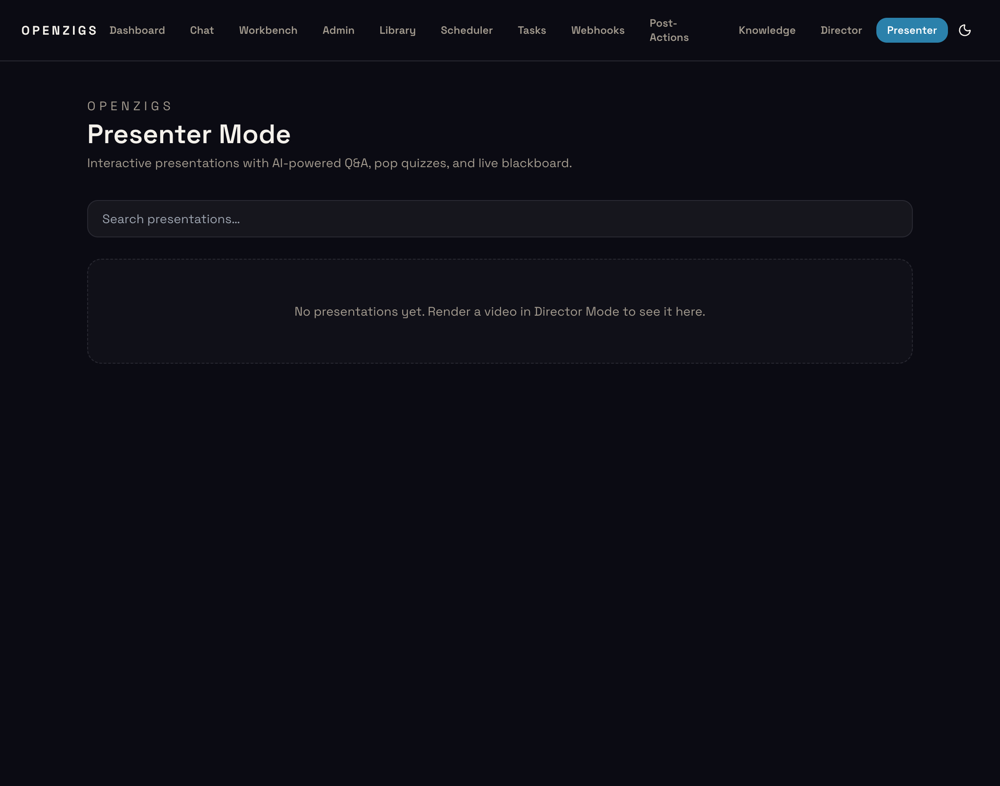

- **Search** — Filter presentations by title using the search bar.
- **Delete** — Click the trash icon on any card to permanently remove a presentation and its cached quizzes.

Presentations are auto-indexed when a Director Mode render completes. The system extracts chapters from the Director Manifest and generates a thumbnail from the video file.

### Interactive Player

Click any presentation card to open the interactive player at `/presenter/{id}`.

The player has four states (managed by a finite state machine):

| State | What Happens |
|---|---|
| **Playing** | Video plays normally. A "Raise Hand" button floats in the bottom-right corner. The sidebar shows chapters with an active indicator. |
| **Paused — Q&A** | User clicked Raise Hand. Video pauses. A dark "blackboard" overlay appears. Type a question and receive a streaming AI answer with Mermaid diagram support. Click **Resume** to continue. |
| **Paused — Quiz** | A pop quiz triggers at a pre-calculated timestamp. Video pauses. A multiple-choice overlay appears. Answer the question to see if you're correct, with an explanation. Click **Continue** to resume. |
| **Recap** | Video ends (or all chapters complete). A recap screen shows your quiz score (circular ring), quiz results, Q&A transcript, and a **Download PDF** button. |

#### Raise Hand (Q&A)

1. While the video is playing, click the **✋ Raise Hand** button.
2. The video pauses and a blackboard overlay appears.
3. Type your question in the input field and press Enter.
4. The AI streams its answer in real time (token by token via Socket.IO). Markdown and Mermaid diagrams are rendered inline.
5. Click **Resume** to continue playback.

The Teacher Agent builds context from the chapter's narration script, so answers are grounded in the video's content.

#### Pop Quizzes

When quizzes are enabled (toggle in Director Mode's Review & Produce step), multiple-choice questions are generated for each chapter:

1. Quiz timestamps are placed 2 seconds before each qualifying chapter ends (chapters must be ≥15 seconds long).
2. When the video reaches a quiz timestamp, it pauses automatically.
3. A multiple-choice question appears with 4 options (A, B, C, D).
4. Select your answer. Correct answers highlight in green; incorrect in red with the correct answer shown.
5. An explanation is displayed for learning reinforcement.
6. Click **Continue** to resume playback.

Quizzes are generated by the AI and cached per chapter. Re-generating quizzes uses the **Generate Quiz** API endpoint.

#### Blackboard & Mermaid Diagrams

The blackboard overlay renders AI responses as rich Markdown. When the AI includes a Mermaid code block, it is rendered as an interactive diagram:

- Flowcharts, sequence diagrams, class diagrams, state diagrams, Gantt charts, and more
- Dark theme matching the blackboard aesthetic
- Error boundaries: if a diagram fails to parse, the raw Mermaid source is shown in a code block

#### Chapter Navigation

A sidebar lists all detected chapters (extracted from Director Manifest title cards). Click any chapter to jump to that point in the video.

### Recap & PDF Download

When a presentation session ends:

1. **Score Ring** — A circular indicator shows your quiz score percentage (green ≥80%, amber ≥50%, red <50%).
2. **Quiz Results** — Each question is listed with your answer, the correct answer, and whether you got it right.
3. **Q&A Transcript** — All Raise Hand questions and AI answers from the session.
4. **Download PDF** — Click to generate and download a client-side PDF containing the score, quiz results, and Q&A transcript.
5. **Watch Again** — Restart the presentation from the beginning.

### Enabling Quizzes in Director Mode

In the Director Mode wizard's **Review & Produce** step, when mode is set to **Presentation**:

1. A **"Enable pop quizzes"** toggle appears.
2. Turn it on to have quizzes generated for the video after rendering.
3. The quiz configuration is stored with the presentation metadata.

### REST API

| Method | Endpoint | Description |
|---|---|---|
| GET | `/api/presentations` | List all presentations (sorted by creation date, newest first) |
| GET | `/api/presentations/:id` | Get full presentation metadata (chapters, quiz config, paths) |
| PATCH | `/api/presentations/:id` | Update title, quiz_enabled, or quiz_config |
| DELETE | `/api/presentations/:id` | Delete a presentation and its cached quizzes |
| GET | `/api/presentations/:id/quiz` | Get cached quiz questions for all chapters |
| POST | `/api/presentations/:id/generate-quiz` | Generate (or regenerate) quiz questions via AI |
| POST | `/api/presentations/:id/ask` | Send a Q&A question (returns AI-generated answer) |
| GET | `/api/presentations/:id/thumbnail` | Serve the presentation's thumbnail image |

### Socket.IO Events

Real-time streaming for Q&A answers:

| Event | Direction | Payload |
|---|---|---|
| `presenter:ask` | client → server | `{ presentationId, question, chapterIndex }` |
| `presenter:answer:start` | server → client | `{}` |
| `presenter:answer:token` | server → client | `{ token }` |
| `presenter:answer:done` | server → client | `{ fullAnswer }` |
| `presenter:answer:error` | server → client | `{ error }` |

### Multiplayer Watch Parties (P2P)

Issue: [Epic #282](https://github.com/openzigs/openzigs/issues/282)

Multiplayer extends the solo Presenter experience into a real-time collaborative watch party. A host creates a room backed by a presentation, invites guests via secure JWT links, and all participants watch in sync with P2P voice chat.

#### Screenshots

| View | Screenshot |
|---|---|
| Presenter Catalog | 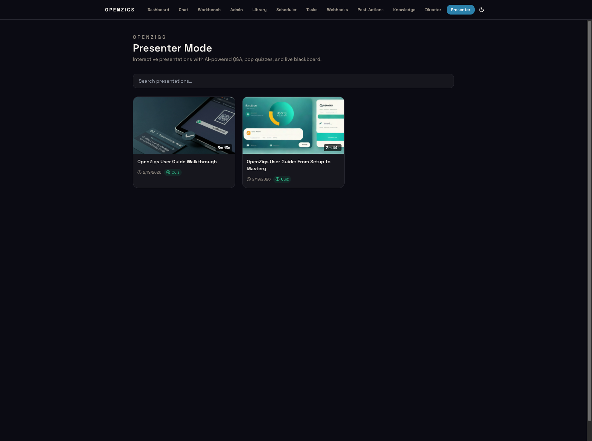 |
| Room (Host View) | 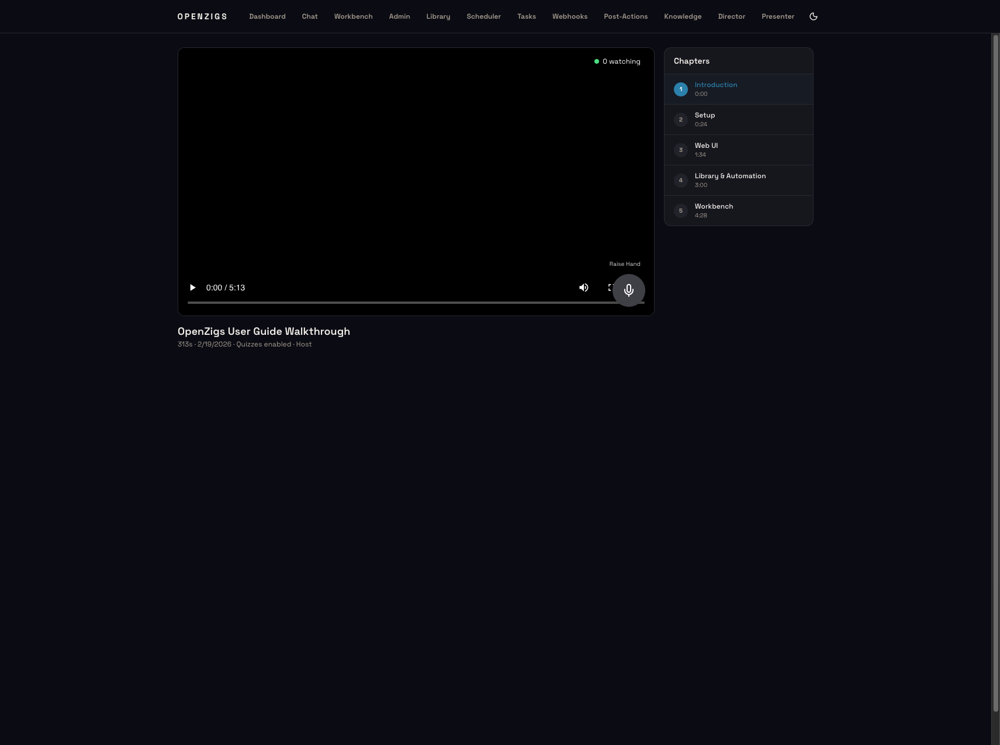 |
| Invite Expired | 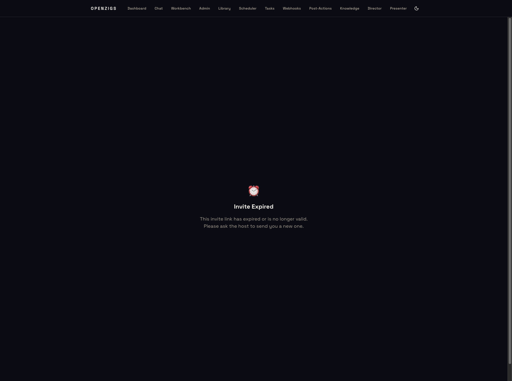 |
| Access Denied (403) | 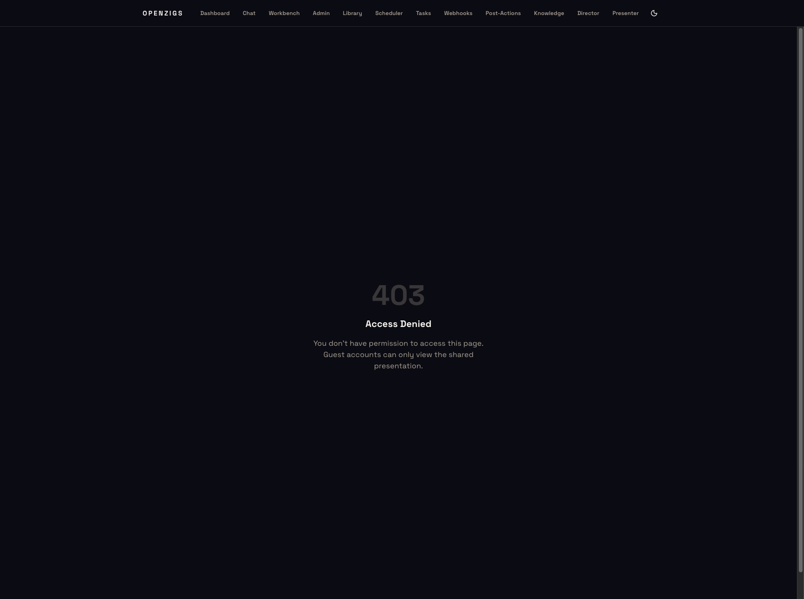 |

#### Generating an Invite Link

Hosts generate invite links via the REST API:

```bash
curl -X POST http://localhost:3000/api/presentations/<id>/invite \
  -H "Authorization: Bearer <token>" \
  -H "Content-Type: application/json" \
  -d '{"displayName": "Alice"}'
```

Response:

```json
{
  "inviteUrl": "http://localhost:3001/invite/<jwt>",
  "expiresAt": "2025-07-19T12:00:00.000Z"
}
```

Share the `inviteUrl` with guests. The link is valid for 24 hours.

#### Guest Invite Flow

1. Guest opens the invite URL (`/invite/<token>`)
2. The invite page calls `GET /api/invite/redeem?token=<jwt>`
3. The backend verifies the JWT, sets `guest_token` and `is_guest` HttpOnly cookies
4. Guest is redirected to `/room/<presentationId>`
5. RBAC middleware restricts guests to `/room/*`, `/invite/*`, `/403`, and `/invite-expired` routes

If the token is expired or invalid, the guest is redirected to `/invite-expired` or `/403`.

#### Room Page

The room page (`/room/[id]`) provides:

- **Synchronized video player** — Host play/pause/seek actions sync all guests within a 1.5s drift tolerance
- **Member count pill** — Shows number of participants in the room
- **Voice peers indicator** — Shows connected P2P voice peers count
- **Push-to-Talk button** — Floating button for voice input (hold-to-talk or click-toggle)
- **Blackboard overlay** — Q&A answers broadcast to all participants with "Asked by …" attribution
- **Transcription preview** — Live speech-to-text preview during voice input

#### Host vs Guest Controls

| Action | Host | Guest |
|---|---|---|
| Play / Pause / Seek | ✅ Controls synced to room | ❌ Read-only (synced from host) |
| Raise Hand (Q&A) | ✅ | ✅ |
| Push-to-Talk (Voice) | ✅ | ✅ |
| Generate Invite Links | ✅ | ❌ |

#### Push-to-Talk

The PTT button supports two interaction modes:

1. **Hold-to-talk** — Press and hold; release to stop recording
2. **Click-toggle** — Click once to start, click again to stop

Audio is chunked every 3 seconds and sent via `room:audio_chunk` binary Socket.IO events. The server forwards chunks to the STT sidecar and streams transcription previews back.

#### Multiplayer REST API

| Method | Path | Auth | Description |
|---|---|---|---|
| `POST` | `/api/presentations/:id/invite` | Admin | Generate a 24h invite JWT link |
| `GET` | `/api/invite/redeem` | Public | Redeem invite token, sets guest cookies |

#### Multiplayer Socket.IO Events

| Event | Direction | Payload | Description |
|---|---|---|---|
| `room:join` | client → server | `{ roomId, displayName }` | Join a room |
| `room:leave` | client → server | — | Leave current room |
| `room:announce_peer` | client → server | `{ peerId }` | Announce PeerJS peer ID to room |
| `room:peers_updated` | server → client | `{ peerIds: string[] }` | Updated list of peer IDs in room |
| `host:play` | client → server | `{ currentTime }` | Host play (host-only) |
| `host:pause` | client → server | `{ currentTime }` | Host pause (host-only) |
| `host:seek` | client → server | `{ currentTime }` | Host seek (host-only) |
| `room:playback_sync` | server → client | `{ action, currentTime }` | Broadcast playback state to guests |
| `room:audio_chunk` | client → server | `Binary (≤2MB)` | Audio chunk for STT processing |
| `room:transcription_preview` | server → client | `{ text, speakerName }` | Live transcription text |

#### PeerJS Signaling

The PeerJS signaling server is embedded in the Express backend at `/peerjs` (key: `openzigs`). Client config:

```javascript
new Peer({ path: "/peerjs", key: "openzigs" })
```

For PeerJS signaling and WebSocket details behind a reverse proxy, see [Cloudflare Tunnel for Multiplayer](cloudflare-tunnel-multiplayer.md).

#### Multiplayer Configuration

```json
{
  "presenter": {
    "inviteSecret": ""
  }
}
```

If `inviteSecret` is empty, a random 64-byte hex secret is **auto-generated on first startup and persisted** to `~/.openzigs/config.json`. This means:

- You do **not** need to manually configure a secret — one is created automatically
- The secret survives server restarts (it's saved to the config file)
- Invite links generated before a restart remain valid
- If you need to rotate the secret (invalidating all outstanding invite links), delete the `presenter.inviteSecret` key from `~/.openzigs/config.json` and restart

Invite links are JWT tokens signed with HS256 using this secret. Each link includes an expiration claim (default: 24 hours, configurable via `ttlHours` when generating the invite). The link becomes invalid after expiry — guests must request a new invite from the host.

#### Cloudflare Tunnel Setup for Presenter Mode

When running OpenZigs behind a Cloudflare Tunnel, invite links need to point to a public domain instead of `localhost`. The recommended setup uses **two routes on a single tunnel**: one for the backend (Telegram / API) and one for the Next.js UI (guests). Both run through the same `cloudflared` connector — no extra daemon needed.

```
Guest browser
  │
  ├─ /invite/..., /room/...  ──► presenter.example.com ──► localhost:3001 (Next.js)
  │                                    │
  │                             Next.js rewrites proxy:
  │                             /api/*       → localhost:3000
  │                             /socket.io/* → localhost:3000
  │
  └─ Telegram webhook (unchanged) ── openzigs.example.com ──► localhost:3000 (Express)
```

All guest traffic flows through the **same origin** (`presenter.example.com`). The Next.js rewrite layer proxies API and Socket.IO internally — no cross-origin cookie issues, no CORS problems.

##### Prerequisites

| Requirement | Purpose |
|---|---|
| **Cloudflare account** | Free tier is sufficient |
| **Domain added to Cloudflare** | e.g. `example.com` managed via Cloudflare DNS |
| **Existing tunnel running** | At least one `cloudflared` service already connected (e.g. `openzigs.example.com → localhost:3000`) |

##### Step 1 — Add a second published application to your existing tunnel

> If you are setting up a brand-new tunnel, first follow the [Create a tunnel (dashboard)](https://developers.cloudflare.com/cloudflare-one/connections/connect-networks/get-started/create-remote-tunnel/) guide to get your initial route running before continuing here.

1. Log in to [Cloudflare One](https://one.dash.cloudflare.com/)
2. Navigate to **Networks → Connectors → Cloudflare Tunnels**
3. Find your tunnel and click **Edit**
4. Open the **Published application routes** tab — your existing route (e.g. `openzigs.example.com → localhost:3000`) will be listed
5. Click **Add a published application**
6. Fill in the new route:
   - **Subdomain:** `presenter`
   - **Domain:** select your domain from the dropdown
   - **Service Type:** `HTTP`
   - **URL:** `localhost:3001`
7. Click **Save**

Your tunnel now has two routes:

| Public Hostname | Service | Purpose |
|---|---|---|
| `openzigs.example.com` | `http://localhost:3000` | Backend API + Telegram webhook (unchanged) |
| `presenter.example.com` | `http://localhost:3001` | Guest presenter UI (new) |

##### Step 2 — Configure environment variables

Both the backend `.env` and the UI's `.env` (or `.env.local`) need to be updated.

**Backend (`.env` in project root):**

```bash
# Leave NEXT_PUBLIC_OPENZIGS_API_BASE empty = same-origin mode.
# Guest API and Socket.IO calls use relative paths (/api/...) which
# Next.js rewrites proxy to localhost:3000 internally.
NEXT_PUBLIC_OPENZIGS_API_BASE=

# Copy your token from ~/.openzigs/config.json → auth.token
NEXT_PUBLIC_OPENZIGS_TOKEN=<your-token>

# Copy from ~/.openzigs/config.json → presenter.inviteSecret
PRESENTER_INVITE_SECRET=<your-invite-secret>

# Tell the backend the public URL of the presenter UI (used in invite link generation)
OPENZIGS_UI_ORIGIN=https://presenter.example.com
```

> **Where do these values come from?**
> - `NEXT_PUBLIC_OPENZIGS_TOKEN` — auto-generated on first run and saved to `~/.openzigs/config.json` under `auth.token`. Read it with: `cat ~/.openzigs/config.json | python3 -c "import json,sys; d=json.load(sys.stdin); print(d['auth']['token'])"`
> - `PRESENTER_INVITE_SECRET` — auto-generated on first run and saved to `~/.openzigs/config.json` under `presenter.inviteSecret`. Read it with the same approach under `d['presenter']['inviteSecret']`.
> - Both are created automatically if missing — you never need to generate them manually.

##### Step 3 — Set the Base URL in Admin panel

1. Open `http://localhost:3001/admin`
2. Scroll to the **Presenter Mode** section
3. Set **Base URL** to: `https://presenter.example.com`
4. Save — restart the backend to apply

This tells the backend what public URL to embed in generated invite links.

##### Step 4 — Rebuild the UI

```bash
cd ui && npx next build
```

Then restart both services:
```bash
# Terminal 1 — backend
pnpm dev

# Terminal 2 — UI
cd ui && pnpm dev       # development
# OR: cd ui && npx next start   # production
```

##### Step 5 — Verify

1. Create a presentation and generate an invite link from the Presenter page (**Invite to Watch**)
2. The invite URL should be: `https://presenter.example.com/invite/<jwt>`
3. Open the link in incognito or on a different device
4. You should see "Joining presentation…" then land in the room at `https://presenter.example.com/room/<id>`

##### Preventing Unauthenticated Traffic

By default, anyone who can reach `presenter.example.com` can attempt to load the UI. OpenZigs has built-in protection at two layers:

| Layer | What it does |
|---|---|
| **Next.js middleware** | Guests are restricted to `/invite/*`, `/room/*`, `/403`, and `/invite-expired`. All other routes (admin, chat, scheduler, workbench) return a 403 page. |
| **Socket.IO `room:join`** | Cryptographically verifies the guest JWT cookie (HS256). A guest can only join the specific room their invite was scoped to. |

If you want to add a Cloudflare-level gate in front of `presenter.example.com` to block all unauthenticated requests before they reach your Mac:

1. In **Cloudflare One → Access controls → Applications**, click **Add an application → Self-hosted**
2. Set the application domain to `presenter.example.com`
3. Add an **Allow** policy — for example, allow **Everyone** (to keep it open) or restrict to specific email domains / IP ranges if you want tighter control
4. Save — Cloudflare Access will now issue application tokens to approved users. Users without a valid token are blocked at the Cloudflare edge and never reach `localhost:3001`

> **Note:** Cloudflare Access sits in front of everything on `presenter.example.com`, including the `/invite/*` pages. If you use Access, you need to add a **Bypass** or **Service Auth** policy for the `/invite/*` path so guests can redeem their invite link without needing a Cloudflare login.

##### Docker Compose (Production)

If you use Docker Compose, the tunnel sidecar is already defined in `docker-compose.yml`. Set the `TUNNEL_TOKEN` environment variable:

```bash
# .env
TUNNEL_TOKEN=your-cloudflare-tunnel-token
```

```bash
docker compose up -d agent tunnel
```

The tunnel sidecar automatically proxies to the `agent` container. The second hostname (`presenter.example.com → localhost:3001`) is configured in the Cloudflare dashboard — no changes to `docker-compose.yml` are needed.

##### Troubleshooting Invite Links Behind Tunnel

| Symptom | Cause | Fix |
|---|---|---|
| Invite URL says `localhost:3001` | `baseUrl` not set in Admin → Presenter Mode | Set **Base URL** to `https://presenter.example.com` and restart backend |
| "Invite Link Invalid" error | `PRESENTER_INVITE_SECRET` in `.env` doesn't match `~/.openzigs/config.json` | Copy the value from `~/.openzigs/config.json → presenter.inviteSecret` into `.env` |
| Link works once then fails | Cookie `sameSite` issue | Ensure tunnel uses HTTPS — cookies set the `Secure` flag automatically on HTTPS origins |
| Invite link expired | JWT TTL exceeded (default 24h) | Generate a new invite; use `ttlHours` for longer-lived links (max 168h / 7 days) |
| 403 on `/room/...` | `NEXT_PUBLIC_OPENZIGS_API_BASE` set to a value | Leave it **empty** in `.env` so API calls use relative paths proxied by Next.js rewrites |

### A/V Chat (Full Duplex Camera & Mic)

> **Epic #12** — Adds full-duplex video and audio chat to multiplayer watch parties. Participants see each other's webcam feeds in a video grid while the host's Voice Pipe mixes all audio for real-time AI transcription.

#### Overview

A/V Chat extends the multiplayer room with three capabilities:

1. **Camera & Mic Toggle** — Each participant captures their local camera and microphone via `useMediaDevices`. Tracks start muted; toggle buttons in the video grid control visibility/audio independently.
2. **Mesh Video Network** — `useVoiceRoom` establishes a PeerJS WebRTC mesh connecting up to **5 participants** (including the host). Peer discovery happens via Socket.IO (`room:announce_peer` → `room:peers_updated`).
3. **Voice Pipe (Host Only)** — When a guest raises their hand (Q&A mode), the host's `useVoicePipe` hook mixes all audio sources (local mic + remote peers) through a Web Audio API `AudioContext`, records the mix via `MediaRecorder` in 3-second chunks, and emits `room:audio_chunk` events for STT processing.

#### Video Grid

The `<VideoGrid />` component renders participant tiles in a responsive layout:

| Participants | Layout |
|---|---|
| 1 | Full width |
| 2 | Side-by-side |
| 3–4 | 2×2 grid |
| 5 | 3+2 rows |

Each tile shows:
- Video feed (via `srcObject` on `<video>`)
- "You" label for the local tile
- Remote peer ID for others
- Muted mic indicator when audio is off

The grid appears in a collapsible sidebar panel on both host and guest pages. Click the member count pill to show/hide it.

#### Bandwidth & Limitations

- **Max 5 participants** — The WebRTC mesh topology sends N-1 streams per participant. Beyond 5, upstream bandwidth becomes prohibitive.
- **Cloudflare Tunnel** — WebRTC data channels and TURN fallbacks may have limited throughput through Cloudflare Tunnels. STUN servers (`stun.l.google.com`) handle NAT traversal for direct peer connections.
- **Media defaults** — Video captures at 320×240 (ideal) to minimize bandwidth. Audio uses the browser's default codec.

#### Hooks Reference

| Hook | Purpose |
|---|---|
| `useMediaDevices(options?)` | Captures local camera/mic stream. Returns `stream`, `isAudioMuted`, `isVideoMuted`, `toggleAudio()`, `toggleVideo()`, `releaseStream()`. |
| `useVoiceRoom(presentationId, localStream)` | PeerJS mesh network. Returns `peerIds`, `remoteStreams`, `isMuted`, `toggleMic()`, `raiseHand()`, `lowerHand()`, `cleanup()`. |
| `useVoicePipe(presentationId, isHost, isRecording, localStream, remoteStreams)` | Host-only audio mixer. Connects all sources to a `MediaStreamDestination`, records chunks, emits `room:audio_chunk`. Returns `isActive`, `stopPipe()`. |

---

## Configuration Reference

All configuration lives in `config/default.json`. Environment variables are interpolated using `${VAR_NAME}` syntax.

| Key | Type | Default | Description |
|---|---|---|---|
| `server.port` | number | `3000` | HTTP listen port. |
| `logging.level` | string | `"info"` | Winston log level. |
| `auth.mode` | string | `"local"` | Auth strategy. |
| `auth.rateLimit.windowMs` | number | `60000` | Rate-limit window (ms). |
| `auth.rateLimit.max` | number | `10` | Max failed auth attempts per window. |
| `messaging.accessControl.mode` | string | `"open"` | `"open"`, `"allowlist"`, or `"blocklist"`. |
| `personality.mode` | string | `"append"` | System prompt mode: `"append"` merges your personality with SDK defaults, `"replace"` fully overrides the system prompt. |
| `channels.telegram.enabled` | boolean | `false` | Enable Telegram channel. |
| `channels.discord.enabled` | boolean | `false` | Enable Discord channel. |
| `channels.web.enabled` | boolean | `true` | Enable Web Chat channel. |
| `tasks.maxConcurrent` | number | `2` | Maximum parallel background agent tasks (1–10). Adjustable at runtime via Admin UI or API. |
| `session.historyWindow` | number | `20` | Max conversation turns retained in JSONL audit log for admin views. Does **not** affect LLM context (the SDK manages multi-turn context natively). |
| `session.maxToolsPerRequest` | number | `30` | Max tools sent per LLM request (1–128). Adjustable at runtime via Admin UI or `PUT /api/admin/session/config`. |
| `session.dynamicToolLoading` | boolean | `false` | Enable intent-based tool filtering (experimental). |
| `session.infiniteSessions.enabled` | boolean | `true` | Enable automatic context compaction for long conversations. |
| `session.infiniteSessions.backgroundCompactionThreshold` | number | `0.80` | Context usage threshold (0-1) at which background compaction begins. |
| `session.infiniteSessions.bufferExhaustionThreshold` | number | `0.95` | Context usage threshold (0-1) at which forced compaction occurs to prevent failures. |
| `tunnel.enabled` | boolean | `false` | Enable the embedded Cloudflare Tunnel. Set to `false` (default) when using the Docker sidecar pattern. |
| `tunnel.mode` | string | `"quick"` | `"quick"` or `"named"`. Only applies when `tunnel.enabled` is `true`. |
| `copilot.provider` | object \| null | `null` | BYOK provider config. See [BYOK Provider](#byok-provider-bring-your-own-key). |
| `copilot.defaultReasoningEffort` | string | `"medium"` | Default reasoning effort: `"low"`, `"medium"`, `"high"`, `"xhigh"`. |
| `copilot.defaultWorkingDirectory` | string \| null | `null` | Default working directory path for tool operations. |

**Environment variables for MCP sidecars** (typically set in `docker-compose.yml`):

| Variable | Default | Description |
|---|---|---|
| `MCP_LINKEDIN_URL` | `http://linkedin-mcp-server:5101` | LinkedIn MCP sidecar URL. |
| `MCP_TWITTER_URL` | `http://twitter-mcp-server:5102` | Twitter/X MCP sidecar URL. |
| `MCP_FACEBOOK_URL` | `http://facebook-mcp-server:5103` | Facebook MCP sidecar URL. |
| `MCP_WORD_URL` | `http://word-mcp-server:5201` | Office Word MCP sidecar URL. |
| `MCP_MARKITDOWN_URL` | `http://markitdown-mcp-server:5301` | MarkItDown file converter URL. |
| `MCP_GMAIL_URL` | `http://gmail-mcp-server:5302` | Gmail MCP sidecar URL. |
| `MCP_DATABASE_URL` | `http://database-mcp-server:5303` | JDBC Database MCP sidecar URL. |
| `MCP_GITHUB_URL` | `http://github-mcp-server:5304` | GitHub MCP sidecar URL. |
| `GITHUB_PERSONAL_ACCESS_TOKEN` | — | GitHub PAT for the GitHub MCP server. |
| `JDBC_URL` | — | JDBC connection string for the Database MCP server. |
| `DB_PASSWORD` | — | Database password. |

---

## Advanced Examples: Combining Capabilities

This section demonstrates real-world workflows that combine multiple features — model overrides, reasoning effort, prompt chaining, custom agents, scheduled automation, and interactive clarifications — to showcase the full power of the platform.

---

### Example 1: Multi-Model Reasoning Chain (Chat)


Use a reasoning model for planning, then a fast model for execution — all in one conversation.

**Chat transcript:**

```
You: I need to refactor the authentication module in my project. The code is in /home/user/project/src/auth/.
     Use high reasoning to analyze the architecture first, then generate the refactored code.

[Model: o4-mini | Reasoning: high]

Agent: I'll analyze the architecture with deep reasoning first.

     [calls read-file: /home/user/project/src/auth/index.ts]
     [calls list-directory: /home/user/project/src/auth/]
     [calls read-file: /home/user/project/src/auth/middleware.ts]

     Analysis complete. The current auth module has three issues:
     1. Token validation is duplicated across 4 files
     2. The session store uses synchronous file I/O
     3. Rate limiting is hardcoded instead of configurable

     I'll now spawn a coding agent with gpt-4.1 to implement the refactored code
     based on this analysis.

     [calls spawn-agent:
       goal: "Refactor the auth module at /home/user/project/src/auth/ based on
              the following analysis: (1) Extract token validation into a shared
              validateToken() utility, (2) Replace sync file I/O with async
              session store, (3) Make rate limiting configurable via config.json"
       model: "gpt-4.1"
       notify_user: true
     ]

     Background task started. The coding agent (gpt-4.1) is implementing the
     refactored code. You'll be notified when it completes.
```

**What's happening:**

| Step | Model | Reasoning | Purpose |
|------|-------|-----------|---------|
| 1. Architecture analysis | `o4-mini` | `high` | Deep reasoning identifies structural problems |
| 2. Code generation | `gpt-4.1` | *(default)* | Fast, cost-efficient code output via `spawn-agent` |

**Key takeaway:** Select `o4-mini` with high reasoning in the Chat UI for the analysis phase, then let the agent delegate to `gpt-4.1` for the implementation. You get the best of both models.

---

### Example 2: Prompt Templates Calling Other Prompts

Compose reusable prompt templates that chain together via the LLM's tool-calling loop. Each prompt can target a different model.

**Step 1 — Create the building-block prompts in the Library:**

| Prompt Name | Content | Preferred Tools |
|-------------|---------|-----------------|
| `research-topic` | `Research the topic "{{topic}}" thoroughly. Find at least 5 credible sources and summarize key findings with citations.` | `web-search`, `browser-navigate` |
| `write-article` | `Write a {{length}}-word article about the following research:\n\n{{research}}\n\nUse a {{tone}} tone. Include an introduction, 3-5 sections with subheadings, and a conclusion.` | `read-file`, `write-file` |
| `review-content` | `Review the following article for factual accuracy, grammar, and readability. Provide specific suggestions:\n\n{{content}}` | `read-file` |

**Step 2 — Use the chain in Chat:**

```
You: I need a blog post about quantum computing breakthroughs in 2025.
     First, run the prompt "research-topic" with topic="quantum computing
     breakthroughs 2025". Then take that output and run "write-article"
     with length=1500 and tone=conversational. Finally, run "review-content"
     on the result.

Agent: I'll chain these prompts together.

     [calls run-prompt: name="research-topic",
      variables={"topic": "quantum computing breakthroughs 2025"}]

     Research complete. Key findings from 5 sources: ...

     [calls run-prompt: name="write-article",
      variables={"research": "<research output>", "length": "1500",
                  "tone": "conversational"}]

     Article drafted (1,487 words). Writing to file...

     [calls write-file: /home/user/blog/quantum-2025.md]

     [calls run-prompt: name="review-content",
      variables={"content": "<article text>"}]

     Review complete:
     - ✅ Factually accurate (all claims verified against sources)
     - ⚠️ Paragraph 3 could be split for readability
     - ⚠️ Consider adding a concrete example in the "Error Correction" section
```

**Step 3 — Automate the chain with a scheduled job:**

Create a scheduled job in the Scheduler UI that runs this workflow automatically:

| Field | Value |
|-------|-------|
| **Name** | `weekly-blog-research` |
| **Cron** | `0 9 * * 1` (Monday 9 AM) |
| **Action** | Prompt |
| **Prompt** | See below |
| **Model** | `gpt-4.1` |
| **Auto-Approve Tools** | `web-search, browser-navigate, write-file` |

**Job prompt:**

```
Run the following prompts in sequence:

1. Run prompt "research-topic" with topic="AI industry news this week"
2. Take the research output and run prompt "write-article" with
   length=2000 and tone=professional
3. Save the article to /home/user/blog/weekly-ai-digest.md
4. Run prompt "review-content" on the saved article
5. If the review finds issues, revise the article and save again

This is an autonomous job — complete all steps without human intervention.
```

**Key takeaway:** Prompts are composable building blocks. The LLM chains them by calling `run-prompt` repeatedly, passing output from one as input variables to the next. Each prompt can also carry its own `preferredTools` to scope tool access.

---

### Example 3: Multi-Model Orchestration with `orchestrate-agents`

Fan out to multiple models in parallel, each optimized for a different task, then aggregate results.

**Chat transcript:**

```
You: I'm evaluating whether to migrate our API from Express to Fastify.
     Use orchestrate-agents to research this from three angles simultaneously,
     using the best model for each task.

Agent: I'll dispatch three specialized agents in parallel.

     [calls orchestrate-agents:
       agents: [
         {
           goal: "Benchmark Express vs Fastify performance. Find recent
                  benchmarks (2024-2025), compare request throughput, latency
                  p99, and memory usage under load. Use web-search.",
           model: "gpt-4.1"
         },
         {
           goal: "Analyze the migration effort from Express to Fastify. Review
                  the codebase at /home/user/api/src/ and identify: (1) number
                  of route handlers, (2) middleware that needs rewriting,
                  (3) Express-specific patterns with no Fastify equivalent.
                  Provide an estimated effort in developer-days.",
           model: "o4-mini"
         },
         {
           goal: "Research Fastify's ecosystem maturity. Check: plugin count on
                  npm, TypeScript support quality, community activity (GitHub
                  stars, recent commits, open issues), and production adoption
                  by notable companies.",
           model: "gpt-4.1"
         }
       ],
       aggregation_prompt: "Compile the three analyses into an executive summary
         with a recommendation table: Performance | Migration Effort | Ecosystem.
         Include a final GO / NO-GO recommendation with justification.",
       timeout_seconds: 300
     ]

     ┌─────────────────────────────────────────────────────────┐
     │ Agent 1 (gpt-4.1): Performance benchmarks         ✅   │
     │ Agent 2 (o4-mini):  Migration effort analysis      ✅   │
     │ Agent 3 (gpt-4.1): Ecosystem research              ✅   │
     └─────────────────────────────────────────────────────────┘

     Executive Summary: Express → Fastify Migration Assessment

     | Dimension        | Finding                              | Score |
     |------------------|--------------------------------------|-------|
     | Performance      | 2.3x throughput improvement           | ✅ GO |
     | Migration Effort | ~12 dev-days for 47 routes            | ⚠️    |
     | Ecosystem        | 350+ plugins, excellent TS support    | ✅ GO |

     Recommendation: **GO** — Performance gains justify the 12-day investment...
```

**Why different models?**

| Agent | Model | Rationale |
|-------|-------|-----------|
| Benchmarks | `gpt-4.1` | Fast web search and data summarization |
| Migration analysis | `o4-mini` | Needs deep reasoning to analyze code patterns |
| Ecosystem research | `gpt-4.1` | Broad web research, no deep reasoning needed |

---

### Example 4: Custom Agent with Interactive Clarifications

Custom agents can ask clarifying questions before proceeding. This example shows a security audit agent that asks the user to specify scope.

**Setup — define the agent in Admin → Custom Agents:**

| Field | Value |
|-------|-------|
| **Name** | `security-auditor` |
| **Display Name** | Security Auditor |
| **Description** | Analyzes code for vulnerabilities and suggests hardening measures |
| **System Prompt** | `You are a senior security engineer. Before starting an audit, always ask the user to clarify the scope (which directories, what threat model, and compliance framework). Use the interactive clarification feature to present options.` |
| **Tools** | `read-file`, `list-directory`, `shell-execute`, `web-search` |
| **Auto-Invoke** | ✅ Enabled (`infer: true`) |

**Chat transcript:**

```
You: @security-auditor Audit the authentication code in my project at
     /home/user/project/src/

Agent (Security Auditor): Before I begin, I need to understand the scope.

     ┌─────────────────────────────────────────────────┐
     │ What compliance framework should I audit against?│
     │                                                  │
     │ ○ OWASP Top 10 (Web application security)      │
     │ ○ SOC 2 (Enterprise compliance)                 │
     │ ○ PCI DSS (Payment card industry)               │
     │ ○ Custom / General best practices               │
     │                                                  │
     │ Or type a custom framework: [____________]       │
     │                                                  │
     │                            [Submit]    ████░ 45s │
     └─────────────────────────────────────────────────┘

You: [selects "OWASP Top 10"]

Agent (Security Auditor): Auditing against OWASP Top 10. Scanning...

     [calls list-directory: /home/user/project/src/auth/]
     [calls read-file: /home/user/project/src/auth/login.ts]
     [calls read-file: /home/user/project/src/auth/session.ts]
     [calls shell-execute: grep -rn "eval\|exec\|innerHTML" src/]

     Security Audit Report — OWASP Top 10
     ─────────────────────────────────────

     🔴 A01:2021 Broken Access Control
        • session.ts:42 — No CSRF token validation on state-changing endpoints

     🟡 A02:2021 Cryptographic Failures
        • login.ts:18 — bcrypt rounds set to 8 (recommend ≥12)

     🟢 A03:2021 Injection — No issues found
     ...
```

**Key takeaway:** The `@security-auditor` mention routes to the custom agent. The `infer: true` setting means the SDK could also auto-delegate security-related questions to this agent without an explicit mention. Interactive clarifications let the agent gather structured input mid-conversation with a 60-second timeout.

---

### Example 5: File Attachments + Reasoning for Code Review

Attach files directly in the Chat UI and combine with high reasoning for thorough analysis.

**Chat transcript:**

```
[Attachments: 📎 src/api/handlers.ts  📎 src/api/middleware.ts]
[Model: o4-mini | Reasoning: high]

You: Review these two files for performance issues and race conditions.
     Focus on the database query patterns and async error handling.

Agent: Analyzing both attached files with extended reasoning...

     [Reading: src/api/handlers.ts (247 lines)]
     [Reading: src/api/middleware.ts (89 lines)]

     Performance & Concurrency Review
     ═════════════════════════════════

     🔴 Critical: Race condition in handlers.ts lines 78-92
        The `updateUserBalance()` function reads the balance, modifies it,
        and writes it back without a transaction or optimistic lock. Under
        concurrent requests, two updates can read the same stale value:

        // Current (unsafe):
        const balance = await db.getBalance(userId);
        await db.setBalance(userId, balance + amount);

        // Recommended (transaction with row lock):
        await db.transaction(async (tx) => {
          const balance = await tx.getBalance(userId, { forUpdate: true });
          await tx.setBalance(userId, balance + amount);
        });

     🟡 Performance: N+1 query in handlers.ts lines 134-148
        The user list endpoint fetches all users, then loops to fetch each
        user's profile. Replace with a JOIN or batch query.

     🟢 middleware.ts: Error handling looks correct — async errors are
        properly caught and forwarded to the error handler.
```

**How it works:**
1. Click the 📎 button in the Chat input (or drag files onto the drop zone) to attach up to 10 files.
2. Attached files are sent to the Copilot SDK as `SdkAttachment` objects — the SDK reads file contents automatically.
3. Select a reasoning model (`o4-mini`, `o3-mini`) and set reasoning effort to `high` for thorough analysis.
4. The model receives both the file contents and your prompt, combining deep reasoning with full file context.

---

### Example 6: Fully Autonomous Scheduled Pipeline

A production-ready example: a nightly data pipeline that runs without human intervention, using auto-approved tools, multi-model orchestration, and prompt templates.

**Step 1 — Create the prompts:**

| Name | Content |
|------|---------|
| `extract-metrics` | `Query the database for {{metric_type}} metrics from the last {{period}}. Use the db-query tool. Return raw JSON data.` |
| `generate-report` | `Generate a Markdown report from the following data:\n\n{{data}}\n\nInclude: executive summary, trend analysis with percentage changes, and anomaly flags for any metric that deviated >2σ from the 30-day mean. Save to {{output_path}}.` |

**Step 2 — Create the scheduled job:**

| Field | Value |
|-------|-------|
| **Name** | `nightly-metrics-pipeline` |
| **Cron** | `0 2 * * *` (2 AM daily) |
| **Model** | `gpt-4.1` |
| **Auto-Approve Tools** | `db-query, read-file, write-file, shell-execute, spawn-agent, orchestrate-agents` |

**Job prompt:**

```
You are an autonomous data pipeline agent. Execute the following steps:

1. Use orchestrate-agents to gather metrics in parallel:
   - Agent 1 (model: gpt-4.1): Run prompt "extract-metrics" with
     metric_type="revenue" and period="24 hours"
   - Agent 2 (model: gpt-4.1): Run prompt "extract-metrics" with
     metric_type="user_engagement" and period="24 hours"
   - Agent 3 (model: gpt-4.1): Run prompt "extract-metrics" with
     metric_type="system_performance" and period="24 hours"

2. Combine all three datasets and run prompt "generate-report" with
   output_path="/data/reports/daily-metrics-{{date}}.md"

3. Run shell command: git -C /data/reports add . && git commit -m
   "Daily metrics report $(date +%Y-%m-%d)" && git push

Complete all steps autonomously. Do not wait for human input.
```

**Execution flow (2:00 AM):**

```
Scheduler fires → TaskEngine.submit()
  └─ TaskWorker dequeues → LLM executes
       ├─ orchestrate-agents (3 parallel sub-agents)
       │   ├─ Agent 1: db-query → revenue data          [auto-approved]
       │   ├─ Agent 2: db-query → engagement data        [auto-approved]
       │   └─ Agent 3: db-query → performance data       [auto-approved]
       │
       ├─ run-prompt "generate-report" → Markdown report
       │   └─ write-file → /data/reports/daily-metrics-2025-07-15.md
       │                                                 [auto-approved]
       │
       └─ shell-execute → git add, commit, push          [auto-approved]
```

**Key features used:**
- **Auto-approved tools**: `db-query`, `write-file`, and `shell-execute` bypass the approval queue — the audit log records each as `tool_auto_approved`.
- **Prompt templates**: Reusable `extract-metrics` and `generate-report` prompts keep the job definition clean.
- **Multi-agent parallel execution**: Three data extraction agents run concurrently for speed.
- **Autonomous end-to-end**: No human in the loop — ideal for off-hours pipelines.

---

### Example 7: BYOK Provider with Local Ollama for Private Data


Run sensitive workloads entirely on your local network using Ollama, then switch back to Copilot for general tasks.

**Step 1 — Configure Ollama in Admin → Model Configuration:**

| Field | Value |
|-------|-------|
| **Provider** | Ollama |
| **Base URL** | `http://localhost:11434` |
| **API Key** | *(leave blank — Ollama doesn't require one)* |

Click **Test Connection** to verify Ollama is reachable, then **Save**.

**Step 2 — Chat with your private data:**

```
[Provider badge shows: 🏷️ Ollama]
[Attachments: 📎 /data/confidential/q2-financials.xlsx]

You: Analyze these Q2 financial results. Identify the three highest-growth
     product lines and flag any revenue anomalies.

Agent (via Ollama - llama3.3): Analyzing Q2 financial data locally...

     [calls convert-to-markdown: /data/confidential/q2-financials.xlsx]
     [calls read-file: converted output]

     Q2 Financial Analysis
     ═════════════════════

     Top 3 Growth Product Lines:
     1. Cloud Services: +34% QoQ ($12.4M → $16.6M)
     2. API Platform: +28% QoQ ($8.1M → $10.4M)
     3. Enterprise Support: +19% QoQ ($5.2M → $6.2M)

     ⚠️ Anomaly: Hardware division revenue dropped 42% — investigate
     potential reporting error or delayed shipments.
```

**Step 3 — Switch back to Copilot for non-sensitive work:**

Navigate to Admin → Model Configuration → click **Clear Provider** to revert to GitHub Copilot. The provider badge disappears, and subsequent messages route through the Copilot SDK.

**Key takeaway:** BYOK providers let you keep sensitive data processing on-premises while still using Copilot for general-purpose tasks. Switch providers at runtime — no restart required. All cached SDK sessions are cleared on provider change.

---

### Example 8: Session Continuity with Infinite Context

Long-running research sessions that survive context window limits and server restarts.

**Chat transcript (over several hours):**

```
[Session: abc-123 | Context: ░░░░░░░░░░ 12% | Turns: 1 | Age: just now]

You: Let's research the history of type systems in programming languages.
     Start with the lambda calculus foundations.

Agent: The formal foundations begin with Alonzo Church's lambda calculus
       in the 1930s...

     [... 45 minutes of deep conversation, reading papers, taking notes ...]

[Session: abc-123 | Context: ████████░░ 82% | Turns: 34 | Age: 47m]
[🔄 Compacting context in background...]
[✅ Context compacted]

[Session: abc-123 | Context: ████░░░░░░ 38% | Turns: 34 | Age: 48m]

You: Now compare the type systems of Haskell, Rust, and TypeScript
     based on everything we've discussed.

Agent: Drawing from our earlier discussion of the Hindley-Milner
       foundations and the evolution through ML and System F...

     [The agent retains the full thread of the conversation despite
      the context window being compacted — key concepts and findings
      are preserved while verbose intermediate steps are summarized]
```

**What's happening behind the scenes:**

| Event | Context Usage | Action |
|-------|--------------|--------|
| Conversation starts | 0% | New SDK session created |
| Turn 20 | 60% | Normal operation |
| Turn 30 | 80% | Background compaction threshold reached — SDK compacts older context |
| Post-compaction | ~38% | Older turns summarized, recent turns preserved verbatim |
| Turn 50 | 75% | Conversation continues naturally |
| Turn 60 | 80% | Another compaction cycle |

**Session resumption after restart:**

```
[Server restarts]
[Session: abc-123 | Resumed ✅ | Context: 42% | Turns: 60]

You: Where were we? Can you summarize what we covered about
     dependent types?

Agent: In our earlier discussion, we covered dependent types in the
       context of Idris and Agda...
```

The SDK's `resumeSession()` API restores the session state. If the session has expired, a new session is created — the JSONL audit log preserves the conversation history for reference.

---

### Example 9: Custom Agent with its Own MCP Server

Define a custom agent that brings its own tools via a dedicated MCP server — useful for domain-specific tooling.

**Configuration (Admin → Custom Agents or `~/.openzigs/config.json`):**

```json
{
  "copilot": {
    "customAgents": [
      {
        "name": "k8s-ops",
        "displayName": "Kubernetes Ops Agent",
        "description": "Manages Kubernetes clusters with kubectl and helm",
        "prompt": "You are a Kubernetes operations expert. Use your dedicated k8s tools (via your MCP server) and the standard shell tools to manage clusters. Always check current state before making changes. Explain what you're about to do before executing destructive operations.",
        "tools": ["shell-execute", "read-file"],
        "infer": true,
        "mcpServers": {
          "kubectl-mcp": {
            "type": "stdio",
            "command": "npx",
            "args": ["-y", "@example/kubectl-mcp-server"],
            "env": {
              "KUBECONFIG": "/home/user/.kube/config"
            }
          }
        }
      }
    ]
  }
}
```

**Chat transcript:**

```
You: @k8s-ops What pods are failing in the production namespace?

Agent (Kubernetes Ops): Checking pod status in production...

     [calls kubectl-get-pods: namespace=production, status=Failed]

     3 pods are in a failing state:

     | Pod | Status | Restarts | Last Error |
     |-----|--------|----------|------------|
     | api-server-7b4d | CrashLoopBackOff | 12 | OOMKilled |
     | worker-3a1c | Error | 3 | Exit code 137 |
     | cache-9f2e | ImagePullBackOff | 0 | Image not found |

     The api-server and worker pods are running out of memory.
     The cache pod has an image reference issue.

     Want me to investigate the resource limits, or should I fix
     the image reference for the cache pod first?
```

**Key takeaway:** The `mcpServers` field on a custom agent gives it access to tools that only that agent can use — other agents and the primary model don't see them. This keeps the tool namespace clean and lets you create purpose-built agents with specialized tooling.

---

### Quick Reference: Feature Combinations

| I want to... | Features to combine |
|---|---|
| Analyze code deeply, then generate fixes cheaply | Reasoning model (`o4-mini`, high effort) → `spawn-agent` with `gpt-4.1` |
| Run a multi-source research report on a schedule | Scheduler + `orchestrate-agents` + auto-approve tools |
| Chain reusable prompt templates | Library prompts + `run-prompt` tool (LLM calls it sequentially) |
| Process sensitive data locally | BYOK Ollama provider + file attachments |
| Create a domain expert agent | Custom agent + dedicated MCP server + specific tool allowlist |
| Never lose context in long sessions | Infinite sessions (enabled by default) + session context bar monitoring |
| Get structured input during a workflow | Interactive clarifications (choices + free-text + 60s timeout) |
| Review files without copy-pasting | File attachments (📎 button or drag-and-drop) + reasoning model |
| Run a nightly pipeline end-to-end | Scheduler + prompt chaining + `orchestrate-agents` + auto-approve |
| Delegate automatically to specialists | Custom agents with `infer: true` |

---

## AI-Assisted Configuration (Workflow Wizard)

OpenZigs includes a **Workflow Wizard** — an interactive conversational assistant that guides you step-by-step through creating prompts, scheduled jobs, webhooks, and custom agents.

### How It Works

1. **Start** — In the Chat, describe what you want to create. The AI detects intent and activates the Wizard persona.
2. **Guided Questions** — The Wizard asks one question at a time, suggesting sensible defaults.
3. **Preview Card** — Once all details are gathered, a structured **Workflow Preview Card** appears in the chat showing the complete configuration.
4. **Confirm / Edit / Test Run** — Click **Confirm** to save, **Edit** to change a field, or **Test Run** (for scheduled jobs) to preview what would happen without executing.


### Preview Card Actions

| Action | Description |
|---|---|
| **Confirm** | Persists the configuration (creates the prompt, job, webhook, or agent). |
| **Edit** | Returns to the conversation so you can change specific fields. |
| **Test Run** | (Scheduled jobs only) Shows a dry-run preview of the job's output. |

### The `create-prompt` Tool

A dedicated MCP tool for creating prompt templates with duplicate-name protection:

```
Tool: create-prompt (risk: high)
Inputs:
  name        — Unique prompt name
  content     — Prompt template with {{variable}} placeholders
  description — Optional description
  tags        — Optional tag array
  variables   — Optional variable metadata array
  systemPrompt — When true, adds "system-prompt" tag
```

Unlike the existing `save-prompt` (which is an upsert), `create-prompt` rejects duplicate names to prevent accidental overwrites during wizard flows.

### The `workflow-wizard` Tool

The AI uses this tool to present structured preview cards:

```
Tool: workflow-wizard (risk: low)
Inputs:
  type    — "prompt" | "scheduled-job" | "webhook" | "agent"
  name    — Human-readable name
  summary — One-line description
  config  — Key-value configuration to preview
```

---

## Dry-Run & Job Testing

Before running a scheduled job for real, you can test it safely with dry-run mode.

### Dry Run from the UI

Each job card in the **Scheduler** page now has a **🧪 Dry Run** button alongside the existing **▶ Run** button. Clicking it shows a preview panel below the job card with exactly what the job would do — without executing anything or incrementing run counts.


### Dry Run via MCP Tools

Two MCP tools support dry-run workflows:

**`schedule-job` with `dry_run: true`**
```json
{
  "name": "nightly-report",
  "cronExpression": "0 22 * * *",
  "actionType": "prompt",
  "actionPayload": { "promptName": "daily-summary" },
  "dry_run": true
}
```
Returns a preview of the job configuration without saving it.

**`test-job`**
```json
{ "id": "job-abc123" }
```
Takes an existing job ID and returns a dry-run preview of its current configuration.

### Dry Run via API

```bash
curl -X POST http://localhost:3000/api/admin/jobs/JOB_ID/run?dry_run=true \
  -H "Authorization: Bearer YOUR_TOKEN"
```

Returns the job preview JSON without triggering execution.

---

## Enterprise Webhooks

Webhooks let external systems (CI/CD, monitoring, third-party services) trigger OpenZigs actions via HTTP POST requests.

### Creating a Webhook


1. Navigate to **Admin → Webhooks** (or `/admin/webhooks`).
2. Click **+ New Webhook**.
3. Configure:
   - **Name** — Descriptive label (e.g., `github-deploy-hook`).
   - **Action** — `prompt` (executes a saved prompt) or `goal` (sends a natural-language goal to the agent).
   - **Prompt Name** or **Goal** — The target action.
   - **Rate Limit** — Max requests per minute (default: 60).
   - **Allowed IPs** — Optional comma-separated IP allowlist.
4. Click **Create Webhook**.


5. **Save the API key** — it's shown only once.


### Triggering a Webhook

```bash
curl -X POST http://localhost:3000/api/webhooks/trigger \
  -H "Authorization: Bearer whk_YOUR_API_KEY" \
  -H "Content-Type: application/json" \
  -d '{"topic": "deployment", "environment": "production"}'
```

The JSON body is passed as prompt variables (for `prompt` actions) or task context (for `goal` actions).

### Authentication Methods

| Method | Headers Required |
|---|---|
| **Bearer Token** | `Authorization: Bearer whk_...` |
| **HMAC Signature** | `X-Webhook-Id: WEBHOOK_ID` + `X-Webhook-Signature: SHA256_HEX` |

### Security Features

- **API Key Hashing** — Keys are stored as SHA-256 hashes; plaintext is never persisted.
- **Timing-Safe Comparison** — Prevents timing attacks on key/signature validation.
- **IP Allowlisting** — Restrict which IPs can trigger the webhook.
- **Rate Limiting** — Per-webhook rate limits (default 60/min).
- **Key Rotation** — Rotate API keys from the UI without deleting the webhook.
- **HMAC-SHA256 Verification** — Webhook payloads are verified using standard HMAC-SHA256 with the raw request body.

### Managing Webhooks

| Action | UI | API |
|---|---|---|
| List all | Webhooks page | `GET /api/admin/webhooks` |
| Create | + New Webhook form | `POST /api/admin/webhooks` |
| Toggle | Toggle switch | `POST /api/admin/webhooks/:id/toggle` |
| Rotate key | 🔄 Rotate Key button | `POST /api/admin/webhooks/:id/rotate-key` |
| Delete | Delete button | `DELETE /api/admin/webhooks/:id` |

---

## Self-Aware Documentation

The AI can answer questions about OpenZigs itself — its architecture, configuration, tools, and features — using the built-in documentation tools.

### How It Works


The `query-documentation` tool searches the project's markdown documentation and JSON config files by topic keyword. The AI can find relevant sections from:

- **ARCHITECTURE.md** — System design, tool catalog, security model.
- **USER_GUIDE.md** — Usage instructions, configuration reference.
- **TELEGRAM_SETUP.md** — Channel setup guides.
- **default.json / tools.json** — Configuration files.

### Example Questions

- *"How do tool risk levels work?"*
- *"What's the architecture of the approval queue?"*
- *"How do I configure Telegram?"*
- *"What MCP tools are available?"*

### Documentation Expert Agent

A custom agent named `documentation-expert` is pre-configured in `config/agents.json` with `infer: true`. When the AI detects a question about OpenZigs itself, it can automatically delegate to this specialist agent.

---

## Sentinel — Autonomous System Monitor

Sentinel is a background daemon that continuously monitors the health of your OpenZigs instance. It watches task success rates, detects stuck or slow tasks, audits prompt quality, and delivers daily digest reports — all without manual intervention.

### Enabling Sentinel

Sentinel is enabled by default. You can configure it in the Admin panel or in your config:

```json
{
  "sentinel": {
    "enabled": true
  }
}
```

Or toggle it live from the Admin UI:

1. Navigate to **Admin** → **Sentinel Monitor**
2. Click **Enable**


### What Sentinel Monitors

- **Task health**: Success rates, consecutive failures, queue depth
- **Orphaned tasks**: Tasks running longer than 30 minutes
- **Slow tasks**: Tasks that took longer than 5 minutes
- **Prompt quality**: Samples recent user prompts and scores them for clarity and token efficiency
- **RAG knowledge base health**: LanceDB accessibility, ingestion service state, and ingestion queue depth

### Alerts

Sentinel generates real-time alerts delivered via Socket.IO to the Admin UI:

| Alert | Priority | Description |
|---|---|---|
| Consecutive Failures | Critical | 3+ tasks failed in a row |
| Queue Depth | Warning | Task queue exceeds 10 items |
| Orphaned Task | Warning | A task has been running > 30 min |
| Success Rate Drop | Critical | Success rate below 50% |
| RAG DB Unreachable | Critical | LanceDB knowledge base is unreachable |
| RAG Ingestion Down | Warning | RAG ingestion service is not running (auto-restart attempted) |
| RAG Queue Depth | Warning | RAG ingestion queue exceeds threshold (default: 100) |

Alerts include automatic deduplication — critical alerts have a configurable cooldown (default: 5 minutes for critical, 30 minutes for warnings).

#### Multi-Channel Alert Routing

Alerts can be sent to multiple channels simultaneously. By default, alerts go to the Admin UI (`"admin"` channel). You can add external messaging channels:

```json
{
  "sentinel": {
    "notifyChannels": ["admin", "telegram", "discord"],
    "criticalCooldownMinutes": 5,
    "warningCooldownMinutes": 30
  }
}
```

- **`admin`**: Socket.IO to the web dashboard (always recommended)
- **External channels** (e.g., `telegram`, `discord`): Only **critical** alerts are routed to external channels to avoid notification fatigue
- Cooldown timers are per-alert-type and configurable at runtime

### Daily Digest

Once per day (default 9:00 AM), Sentinel generates a summary of:

- Tasks completed, failed, and cancelled
- Overall success rate
- Token burn analysis (total, average per task, top consumer)
- Prompt quality scores (if audit ran)
- **Per-prompt recommendations** with improvement suggestions and rewrites
- Alert count for the period

View past digests in the **Admin** → **Sentinel Monitor** → **Digest History** section. Each digest card shows an expandable **Prompt Improvements** section with score badges (🟢 ≥8, 🟡 ≥5, 🔴 <5), specific suggestions, and suggested rewrites for low-scoring prompts.

#### Downloading Digests

Click the **Download** button in the Digest History section to download the latest digest as a Markdown file. This file is also auto-generated at `~/.openzigs/sentinel/status.md` when `persistMarkdownDigest` is enabled (default: `true`).

```bash
# Or fetch via API
curl http://localhost:3001/api/admin/sentinel/digest-markdown -o sentinel-digest.md
```

#### Digest Retention

Old digest entries are automatically pruned. Configure the retention window with `digestRetentionDays` (default: 30 days).

### Scheduler Configuration

Sentinel uses node-cron v4 with support for timezone-aware scheduling and overlap prevention:

```json
{
  "sentinel": {
    "timezone": "America/New_York",
    "noOverlap": true,
    "maxRandomDelayMs": 5000
  }
}
```

- **`timezone`**: IANA timezone for cron schedules (default: `"UTC"`)
- **`noOverlap`**: Prevents a cron job from firing if the previous execution is still running (default: `true`)
- **`maxRandomDelayMs`**: Native cron jitter in milliseconds (0 disables native jitter; uses manual jitter via `jitterMinutes` instead)

### Running a Check Manually

Click **Run Check Now** in the Sentinel panel, or use the API:

```bash
curl -X POST http://localhost:3001/api/admin/sentinel/run-now
```

### Configuration Options

| Key | Default | Description |
|---|---|---|
| `enabled` | `true` | Enable/disable Sentinel |
| `model` | `gpt-4o-mini` | Model used for prompt audits |
| `checkIntervalMinutes` | `15` | How often to run task health checks |
| `jitterMinutes` | `15` | Random delay (up to N minutes) added after each check interval |
| `digestHour` | `9` | Hour of day (0-23) for daily digest |
| `auditHour` | `2` | Hour of day (0-23) for prompt audit |
| `consecutiveFailureThreshold` | `3` | Failures before critical alert |
| `queueDepthThreshold` | `10` | Queue depth before warning |
| `persistMarkdownDigest` | `true` | Write digest to `status.md` file |
| `markdownDigestPath` | `null` | Custom path for `status.md` (default: `~/.openzigs/sentinel/status.md`) |
| `digestRetentionDays` | `30` | Days to keep digest history before pruning |
| `notifyChannels` | `["admin"]` | Channels to send alerts to (`"admin"`, `"telegram"`, `"discord"`, etc.) |
| `criticalCooldownMinutes` | `5` | Deduplication cooldown for critical alerts |
| `warningCooldownMinutes` | `30` | Deduplication cooldown for warning alerts |
| `timezone` | `"UTC"` | IANA timezone for cron schedules |
| `noOverlap` | `true` | Prevent overlapping cron executions |
| `maxRandomDelayMs` | `0` | Native cron jitter in milliseconds (0 = use manual jitter) |

---

## Knowledge Manager — Local Knowledge Base (RAG)

The Knowledge Manager provides a **Retrieval-Augmented Generation (RAG)** pipeline that indexes local files (Markdown, code, text, JSON, etc.) into an embedded vector database and exposes them to the AI via the `search-knowledge` tool. This lets the AI ground its responses in your own documentation, notes, and code — without sending anything to external services.

### How It Works

1. **Ingest**: Files in your knowledge directory (`~/.openzigs/knowledge/` by default) are scanned, chunked, and embedded.
2. **Watch**: A file watcher (chokidar) detects changes, additions, and deletions in real time.
3. **Search**: The `search-knowledge` MCP tool performs semantic vector search against the index.
4. **Dedup**: Content hashing (SHA-256) ensures unchanged files are not re-indexed.

### Setting Up the Knowledge Directory

Create the knowledge directory and drop files into it:

```bash
mkdir -p ~/.openzigs/knowledge
# Copy your docs, notes, code snippets, etc.
cp -r ~/my-project/docs ~/.openzigs/knowledge/
cp ~/notes/*.md ~/.openzigs/knowledge/
```

The service automatically indexes all supported files on startup and watches for changes.

### Supported File Types

| Extension | Source Type |
|---|---|
| `.md` | Markdown |
| `.txt` | Text |
| `.pdf` | PDF (text + OCR fallback for scanned PDFs) |
| `.docx` | Word document (DOCX) |
| `.xlsx`, `.xls` | Excel spreadsheet |
| `.jpg`, `.jpeg`, `.png`, `.tiff`, `.tif`, `.bmp`, `.webp`, `.gif` | Image OCR |
| `.mp4`, `.mp3`, `.wav`, `.m4a`, `.webm`, `.ogg`, `.flac` | Media transcription |
| `.json` | JSON |
| `.csv` | CSV |
| `.html` | HTML |
| `.py` | Code (Python) |
| `.ts`, `.js` | Code (TypeScript/JavaScript) |
| `.go` | Code (Go) |
| `.rs` | Code (Rust) |
| `.java` | Code (Java) |
| `.c`, `.cpp`, `.h` | Code (C/C++) |
| `.rb` | Code (Ruby) |
| `.sh`, `.bash` | Code (Shell) |
| `.yaml`, `.yml` | YAML |
| `.toml` | TOML |
| `.xml` | XML |
| `.sql` | SQL |
| `.r` | Code (R) |
| `.swift` | Code (Swift) |
| `.kt` | Code (Kotlin) |

If **Media** appears as unavailable in the Converters tab, the usual causes are:

1. `ffmpeg` is not installed or not on `PATH`.
2. `whisper-node` model files are missing.

For local development, run:

```bash
pnpm exec whisper-node download
```

### Using the `search-knowledge` Tool

The `search-knowledge` tool is **always-on** — the AI can use it in any conversation without explicit enabling. It accepts:

- **`query`** (required): Natural language search query
- **`limit`** (optional): Maximum results to return (default: 10)
- **`mode`** (optional): Search strategy — `"hybrid"` (default), `"vector"` (semantic only), or `"fts"` (keyword only)

**Search modes explained:**

| Mode | When to Use |
|---|---|
| **`hybrid`** (default) | Best for most queries. Combines semantic understanding with exact keyword matching via reciprocal rank fusion. Results appearing in both vector and FTS results get a relevance boost. |
| **`vector`** | Conceptual queries where you want semantically similar content, even if it doesn't share exact keywords. Example: "how does authentication work?" |
| **`fts`** | Exact keyword searches for specific terms, function names, or error messages. Example: "CORS_ALLOWED_ORIGINS", "handleAuthCallback" |

Example AI interaction:

> **You**: What does our deployment guide say about rollback procedures?
>
> **AI**: *(automatically calls search-knowledge with "deployment rollback procedures")* Based on your knowledge base, the deployment guide at `docs/deployment.md` describes the following rollback procedure…

### Automatic Content Ingestion

The knowledge base automatically ingests content from across the platform — you don't need to manually copy files. Everything the system creates is searchable:

| Content Type | When Ingested | What's Stored |
|---|---|---|
| **Gallery assets** (images, videos, audio, music) | When a media job completes, file is uploaded, or cloud image is generated | Prompt, model, tags, filename, media URL for inline playback |
| **Presentations** | When a Director render completes | Transcript text, chapters, duration, mode |
| **Director narration** | When a render finishes | Narration lines from the timeline |
| **Social media replies** | When Social Brain sends an auto-reply | Incoming message + generated reply |
| **Scheduled job results** | When a scheduled job executes | Job name, timestamp, output |

When you **delete** a gallery asset, it's automatically removed from the knowledge base too.

### Content Categories & Filtering

The `search-knowledge` tool supports two additional optional parameters for targeted search:

- **`category`**: Filter by content type — `"media"`, `"document"`, `"presentation"`, `"social"`, `"system"`, `"conversation"`
- **`visibility`**: Filter by access level — `"public"`, `"internal"`, `"private"`

**Example: Finding songs in the knowledge base**

> **You**: Show me all the songs I've generated.
>
> **AI**: *(calls search-knowledge with query "songs music audio", category "media")* Here are your generated audio tracks:
>
> 🎵 **cinematic-electronic-dark.mp3** — "cinematic, electronic, dark" (ace-step)
> [Inline audio player appears]
>
> 🎵 **matchering.mp3** — "ambient electronic" (ace-step)
> [Inline audio player appears]

**Example: Finding images by prompt**

> **You**: Show me the logo images I created for CIMIQ.
>
> **AI**: *(calls search-knowledge with query "CIMIQ logo", category "media")* Here are your CIMIQ logo images:
>
> 

### Visibility & Privacy

To prevent sensitive data from leaking into social media auto-replies, the knowledge base has three visibility levels with **hierarchical access control**:

| Level | Chat Access | Social Auto-Reply Access | Example Content |
|---|---|---|---|
| **Public** | ✅ | ✅ | Gallery assets, published content |
| **Internal** | ✅ | ❌ | Personal documents, presentations, system events |
| **Private** | Admin only | ❌ | Sensitive configuration, credentials |

**Hierarchical filtering**: Visibility levels are ordered `public < internal < private`. When the AI searches with `visibility: "internal"`, it sees both **public** and **internal** items — but never **private** items. A `public`-level search only returns public items. This hierarchy prevents accidental information leakage while ensuring broader-scoped queries still include lower-visibility content.

Social Brain auto-replies **only** search public content, ensuring your private documents and system events never appear in social media responses.

### Inline Media Playback in Chat

When the AI finds media assets from the knowledge base, it can render them inline:

- **Images**: Displayed directly with click-to-expand lightbox and download
- **Audio**: Compact inline player with play/pause, progress bar, and download
- **Video**: Preview thumbnail with play overlay, click opens full-size lightbox with controls

This means you can ask "play me that song I generated" and hear it right in the chat interface.

### Knowledge Manager UI

Navigate to **Knowledge** in the top nav bar to access the Knowledge Manager page.


#### Overview Tab

Displays index statistics:

- **Total Documents**: Number of indexed files
- **Total Chunks**: Number of text chunks in the vector database
- **Source Types**: Breakdown of indexed file types

#### Documents Tab

Lists all indexed documents with:

- File path, source type, chunk count, and last-indexed timestamp
- **Re-index** button per document to force re-ingestion
- **Remove** button to delete a document from the index
- **Re-index All** button to rebuild the entire index

#### Search Tab

Interactive semantic search interface:

1. Enter a natural language query
2. View ranked results with relevance scores (percentage badges)
3. Each result shows the source file, heading context, and matching text chunk

### API Endpoints

All knowledge endpoints are under `/api/admin/knowledge`:

| Method | Path | Description |
|---|---|---|
| `GET` | `/stats` | Index statistics (documents, chunks, source types) |
| `GET` | `/documents` | List all indexed documents |
| `POST` | `/search` | Semantic search (`{ "query": "...", "limit": 10 }`) |
| `POST` | `/reindex` | Re-index all documents |
| `POST` | `/reindex/:documentId` | Re-index a specific document |
| `DELETE` | `/documents/:documentId` | Remove a document from the index |
| `GET` | `/config` | Current knowledge configuration |
| `PUT` | `/config` | Update knowledge configuration (`directory`, `watchEnabled`, `mediaModel`, `searchMode`, `minScore`) |

### Configuration Options

You can change the knowledge directory, search mode, and other settings from the Admin UI:

1. Navigate to **Admin** → **Knowledge Base**
2. Update settings:
   - **Knowledge Directory** — path to watch for files
   - **Live File Watching** — enable/disable real-time change detection
   - **Whisper Model** — audio/video transcription quality (tiny.en → large-v1)
   - **Search Mode** — hybrid (recommended), vector, or full-text
   - **Minimum Score Threshold** — filter out low-relevance results (slider, 0–100%)
3. Click **Save**

Changes apply immediately (no server restart required). When the directory changes, OpenZigs clears the current index and re-scans the new directory.

Configure the knowledge base in your config file (`~/.openzigs/config.json`):

```json
{
  "knowledge": {
    "directory": "~/.openzigs/knowledge",
    "chunkSize": 1000,
    "chunkOverlap": 200,
    "maxResults": 10,
    "watchEnabled": true,
    "mediaModel": "base.en",
    "searchMode": "hybrid",
    "minScore": 0.25
  }
}
```

| Key | Default | Description |
|---|---|---|
| `directory` | `~/.openzigs/knowledge` | Directory to watch and index |
| `chunkSize` | `1000` | Maximum characters per text chunk |
| `chunkOverlap` | `200` | Character overlap between consecutive chunks |
| `maxResults` | `10` | Default number of search results |
| `watchEnabled` | `true` | Enable real-time file watching |
| `mediaModel` | `"base.en"` | Whisper model for audio/video transcription |
| `searchMode` | `"hybrid"` | Default search mode: `"vector"`, `"fts"`, or `"hybrid"` |
| `minScore` | `0.25` | Minimum similarity score (0–1) to include in results. 0 = no threshold. |

### Architecture Notes

- **Embedding**: Uses Hugging Face Transformers.js with the `all-MiniLM-L6-v2` sentence transformer (~23MB, 384-dimensional vectors). Falls back to deterministic FNV-1a hashing if the model fails to load. Input text is truncated at word boundaries (~2000 chars) to respect the model's 512-token context window.
- **Vector Store**: [LanceDB](https://lancedb.com/) embedded database stored at `~/.openzigs/knowledge-db/` with both IVF-PQ vector index and native FTS index.
- **Vector Index Rebuild**: The IVF-PQ index is automatically rebuilt when the dataset grows by ≥50% since the last build, with a minimum threshold of 256 rows. This ensures search quality scales with your knowledge base.
- **Hybrid Search**: Default mode combines vector (semantic) and full-text (keyword) search using Reciprocal Rank Fusion (k=60). Results in both lists get a score boost.
- **FTS Index**: Full-text search uses stemming, stop-word removal, and positional indexing. The FTS index rebuild is debounced (2-second window) to avoid quadratic cost during bulk ingestion. After a directory scan completes, the index is explicitly flushed.
- **Chunking**: Markdown-aware splitting that preserves heading context. Headings are extracted and stored as metadata for each chunk. Chunk overlap snaps to word boundaries to avoid splitting mid-word.
- **Change Detection**: SHA-256 content hashing — files are only re-indexed when their content actually changes. A fast mtime + file size pre-check avoids unnecessary file reads. Document metadata is persisted to disk so the hash check survives server restarts.
- **Visibility Hierarchy**: Access levels are hierarchical — a `public` search only returns public items, while an `internal` search returns both public and internal items. This prevents accidental data leakage across visibility boundaries.

---

## Social Brain — Unified Social Inbox & CRM

> **📖 Comprehensive Setup Guide:** For step-by-step platform setup, Cloudflare Tunnel configuration, curl testing commands, and troubleshooting, see the dedicated [Social Brain Guide](SOCIAL_BRAIN_GUIDE.md).

The Social Brain at `/social` provides a unified inbox for managing DMs and comments across 7 social platforms — **Instagram**, **Facebook**, **Twitter/X**, **YouTube**, **LinkedIn**, **Reddit**, and **TikTok** — with AI-powered auto-replies, a built-in CRM, comment-to-DM automation, and cross-platform content publishing.

Each platform has a dedicated native MCP server with tools for posting, reading, analytics, DMs, and comment management. See the [Social Media Posting](#social-media-posting) section for publishing details, and the [Social Brain Guide](SOCIAL_BRAIN_GUIDE.md) for comprehensive setup and troubleshooting.

### Ingestion Modes — Webhook vs Polling

Each platform ingests messages via either **webhooks** (platform pushes events to your server) or **polling** (OpenZigs periodically fetches new data via API). Some platforms support both:

| Platform | Webhook | Polling | Default | Notes |
|----------|---------|---------|---------|-------|
| Twitter/X | ✅ | ✅ | Polling | Webhook requires Account Activity API setup |
| YouTube | — | ✅ | Polling | No webhook API available |
| Reddit | — | ✅ | Polling | No webhook API available |
| LinkedIn | — | ✅ | Polling | Polling only (no webhook support) |
| TikTok | ✅ | — | Webhook | Webhook-only |
| Facebook | ✅ | ✅ | **Polling** | **Use polling** — webhooks require Meta App Review |
| Instagram | ✅ | ✅ | **Polling** | **Use polling** — webhooks require Meta App Review |

For platforms that support both modes (Facebook, Twitter, Instagram), you can switch between them using the **mode dropdown** on each platform card in the Settings tab. The mode is saved to `~/.openzigs/config.json` automatically. A server restart is required for the mode change to take effect.

> **Why polling over webhooks for Meta (Facebook/Instagram)?** Meta does not deliver webhook events to apps in development mode. If your Meta app is not published and approved via App Review, webhooks will not function. Polling works immediately without any app approval — it uses the respective MCP server (`fb-mcp` for Facebook, `ig-mcp` for Instagram) to periodically fetch posts and their comments. This captures all comments from any user, not just app admins or testers.

> **Need help setting up platform APIs?** Use the **Social Setup Wizard** skill in chat — it uses browser automation and the Secret Vault to walk you through each platform's developer portal step by step. See the [Social Brain Guide — AI-Assisted Platform Setup](SOCIAL_BRAIN_GUIDE.md#ai-assisted-platform-setup-setup-wizard-agent) for details.

**Configuring the poll interval:**

```json
{
  "socialBrain": {
    "connections": {
      "facebook": { "enabled": true, "mode": "polling", "pollIntervalSeconds": 120 },
      "instagram": { "enabled": true, "mode": "polling", "pollIntervalSeconds": 120 }
    }
  }
}
```

### Dashboard Tab

The dashboard shows key metrics at a glance:

| Stat | Description |
|---|---|
| **Total Contacts** | All contacts across connected platforms |
| **Messages (24h)** | Inbound and outbound messages in the last 24 hours |
| **Active Handoffs** | Conversations escalated to a human operator |
| **Automation Triggers** | Total times automation rules have fired |

Below the stats, a **Connected Platforms** section shows the status of each integrated platform.

### CRM Tab

The CRM provides a paginated contact database with:

- **Search** — Filter contacts by username, display name, or platform.
- **Platform filter** — Show contacts from a specific platform only.
- **Contact detail drawer** — Click a contact to view their full profile: tags, notes, message history, and handoff controls.
- **Tag management** — Add or remove tags on any contact for segmentation.
- **Notes** — Update a contact's notes inline.
- **Export** — Download all contacts as a CSV file.

### Automations Tab

Create keyword-based and regex-based automation rules that trigger DM responses when users comment on your posts:

| Field | Description |
|---|---|
| **Name** | Rule display name |
| **Platform** | Target platform (e.g., `instagram`) |
| **Keywords** | Comma-separated trigger words (word-boundary, case-insensitive match) |
| **DM Template** | Message template with `{{username}}`, `{{keyword}}`, `{{post_id}}`, `{{comment_text}}` interpolation |
| **DM Delay** | Seconds to wait before sending the DM (0 = immediate) |
| **Max Triggers/User** | Rate limit per user per rule |
| **Auto-Tag** | Automatically tag contacts who trigger the rule |
| **Use AI Reply** | Toggle to enable AI-generated comment replies instead of static templates |
| **AI Reply Context** | Business context for the AI to use when generating replies (e.g., product info, pricing) |

**AI Rule Generation** — Click the **AI Generate** button to describe what you want in plain English and have the AI create a complete rule with keywords, templates, and settings. Requires Copilot SDK authentication.

**Follow-Up Sequences** — Expand any rule to view and manage timed follow-up DM steps. Add steps with configurable delays (e.g., 1hr, 24hr) and message templates for drip campaigns.

The **Automation Log** shows a live feed of every rule trigger with timestamp, contact, and action taken.

### Leads Tab

The Leads tab shows contacts who have shared their email or phone number during DM conversations. The `LeadCaptureService` automatically extracts email addresses and phone numbers from incoming messages.

- **Platform filter** — Filter leads by source platform
- **Table view** — Username, platform, email, phone, and capture date
- **Empty state** — "No leads captured yet" when no lead data exists

### Analytics Tab

The Analytics tab provides conversation and engagement statistics across all connected platforms:

- **Summary cards** — Total conversations, messages, automations fired, and active contacts
- **Per-platform breakdown** — Message counts, contact counts, and automation trigger counts broken down by platform
- **Date filtering** — Filter analytics by time period via the API (`?since=` parameter)

### Activity Tab

A real-time feed of all inbound and outbound messages across platforms, with direction badges and platform icons.

**Approval Queue** — When "Require Approval" is enabled, AI-generated replies appear at the top of the Activity tab in a "Pending Approval" section with orange highlights. For each pending reply you can:
- **Approve** — Send the AI-generated reply as-is
- **Edit & Approve** — Modify the reply text in an inline editor, then send
- **Reject** — Discard the reply without sending

Status badges include: `received` (blue), `auto_replied` (green), `escalated` (yellow), `pending_approval` (orange), `rejected` (red).

### AI-Powered Auto-Reply (Brain Engine)

When a DM arrives, the Social Brain engine:

1. Searches the knowledge base (hybrid RAG) for relevant context.
2. Loads the last 5 messages of conversation history.
3. Sends the context + message to the LLM with a social-media-specific system prompt.
4. Parses the JSON response for `reply`, `confidence`, and `escalate` fields.
5. If confidence > 0.7, auto-sends the reply. Otherwise, escalates to a human operator.

**AI Comment Replies** — When enabled in Settings ("AI Reply Settings" → "AI Comment Replies"), comments that don't match any keyword automation rule are also routed through the Brain Engine. The Brain generates a public-appropriate reply using the post's caption and knowledge base context.

**Approval Queue** — When "Require Approval" is enabled, AI-generated replies (both DM and comment) are held with `pending_approval` status for human review. Pending replies appear in the Activity tab's approval queue. See the [Approval Queue section](SOCIAL_BRAIN_GUIDE.md#approval-queue) in the Social Brain Guide.

### Manual Reply

You can send manual replies directly from the CRM contact detail panel. Click a contact, type your message in the "Type a reply..." input at the bottom of their message history, and click Send (or press Enter). Manual replies are stored with `source: "manual_reply"` metadata.

### Push Notifications

Enable real-time push notifications for incoming messages and comments:

1. Navigate to Settings tab → "Notification Settings"
2. Toggle "Enable Push Notifications"
3. Enable specific channels: **Telegram**, **Discord**, or **Web** (Socket.IO)

When enabled, alerts are pushed to configured Telegram admin chats and/or Discord notification channels when new messages arrive or AI replies need approval.

### Human Handoff

When the AI cannot confidently respond (or the user requests human help), the conversation is escalated:

- A handoff thread is created in the configured channel.
- The contact's CRM record is updated with `handoff_status: active`.
- Admin replies in the thread are forwarded back to the user.
- Close the handoff from the CRM contact detail drawer when resolved.

### MCP Tools

5 Social Brain MCP tools are available in chat:

| Tool | Risk | Description |
|---|---|---|
| `social-crm-lookup` | 🟢 low | Search CRM contacts by username, platform, or tags |
| `social-crm-history` | 🟢 low | Get message history for a specific contact |
| `social-crm-tag` | 🟢 low | Add or remove a tag on a CRM contact |
| `social-close-handoff` | 🟡 medium | Close an active human handoff for a contact |
| `social-brain-stats` | 🟢 low | Get Social Brain dashboard statistics |

### REST API

```bash
# Get dashboard stats
curl http://localhost:3000/api/social/stats

# List contacts (paginated)
curl "http://localhost:3000/api/social/contacts?page=1&pageSize=25"

# Export contacts as CSV
curl http://localhost:3000/api/social/contacts/export -o contacts.csv

# Create an automation rule
curl -X POST http://localhost:3000/api/social/rules \
  -H "Content-Type: application/json" \
  -d '{"name":"Welcome DM","platform":"instagram","enabled":true,"keywords":"[\"hello\",\"hi\"]","dm_template":"Hey {{username}}! How can I help?"}'

# AI-generate a rule from a description
curl -X POST http://localhost:3000/api/social/rules/generate \
  -H "Content-Type: application/json" \
  -d '{"description":"Capture leads asking about pricing","platform":"instagram"}'

# List all rules
curl http://localhost:3000/api/social/rules

# Manage follow-up steps
curl http://localhost:3000/api/social/rules/<ruleId>/follow-ups
curl -X POST http://localhost:3000/api/social/rules/<ruleId>/follow-ups \
  -H "Content-Type: application/json" \
  -d '{"stepOrder":0,"delaySeconds":3600,"messageTemplate":"Following up, {{username}}!"}'

# Get captured leads
curl http://localhost:3000/api/social/leads
curl "http://localhost:3000/api/social/leads?platform=instagram"

# Get analytics
curl http://localhost:3000/api/social/analytics
curl "http://localhost:3000/api/social/analytics?since=2026-03-01T00:00:00Z"

# Get recent activity
curl http://localhost:3000/api/social/activity

# Close a handoff
curl -X POST http://localhost:3000/api/social/handoff/<contactId>/close \
  -H "Content-Type: application/json" \
  -d '{"resolution":"Issue resolved"}'

# Approval queue
curl http://localhost:3000/api/social/approvals
curl http://localhost:3000/api/social/approvals/count
curl -X POST http://localhost:3000/api/social/approvals/<messageId>/approve
curl -X POST http://localhost:3000/api/social/approvals/<messageId>/reject
curl -X POST http://localhost:3000/api/social/approvals/<messageId>/edit \
  -H "Content-Type: application/json" \
  -d '{"content":"Edited reply text"}'

# Send manual reply
curl -X POST http://localhost:3000/api/social/contacts/<contactId>/reply \
  -H "Content-Type: application/json" \
  -d '{"content":"Hello from the team!"}'
```

### Webhook Integration

Platform webhooks are received at `POST /api/social/webhooks/:platform`. For Instagram, the endpoint handles Meta's webhook verification (`GET` with `hub.verify_token`) and incoming message/comment events (`POST`).

### Socket.IO Events

| Event | Direction | Description |
|---|---|---|
| `social:reply` | Server → Client | AI auto-reply sent to a contact |
| `social:escalate` | Server → Client | Conversation escalated to human |
| `social:pending_approval` | Server → Client | AI reply held for human approval |
| `social:comment_reply` | Server → Client | AI auto-replied to a comment |
| `social:new_message` | Server → Client | New inbound DM received |
| `social:new_comment` | Server → Client | New inbound comment received |
| `social:handoff:created` | Server → Client | New handoff thread created |
| `social:handoff:resolved` | Server → Client | Handoff closed |
| `social:rule:triggered` | Server → Client | Automation rule fired |

### Platform Webhook Setup

Each social platform requires webhook registration so OpenZigs can receive comments and DMs in real time. You need a **publicly reachable URL** — either via a Cloudflare Tunnel (production) or ngrok (development).

**Your webhook endpoint:** `https://<your-domain>/api/social/webhooks/:platform`

#### Environment Variables

Add these to your `.env` file:

```dotenv
# ── Social Brain ──
SOCIAL_WEBHOOK_VERIFY_TOKEN=your-random-secret-string  # Used to verify webhook subscriptions
INSTAGRAM_ACCESS_TOKEN=your-instagram-user-access-token # Required for IG post context enrichment + adapter activation
FACEBOOK_PAGE_TOKEN=your-facebook-page-access-token    # Required for FB post context enrichment + adapter activation
FACEBOOK_APP_ID=your-facebook-app-id                   # Shared by Instagram and Facebook MCP servers
FACEBOOK_APP_SECRET=your-facebook-app-secret            # Shared by Instagram and Facebook MCP servers
```

> **Tip:** Generate a random verify token with `openssl rand -hex 32`.

> **Important:** The ingestion adapters for Instagram and Facebook are only activated when their respective env vars (`INSTAGRAM_ACCESS_TOKEN`, `FACEBOOK_PAGE_TOKEN`) are set. Without them, webhooks will still be received but won't be processed through the automation pipeline.

#### Cloudflare Tunnel & Webhooks

All social webhook endpoints are served on the same Express server (port 3000) as the rest of OpenZigs. **No separate tunnel routes or ingress rules are needed** — the same Cloudflare Tunnel that handles Telegram webhooks also handles social platform webhooks.

Webhook URLs follow the pattern: `https://<your-domain>/api/social/webhooks/:platform`

Example webhook URLs for a tunnel hostname of `agent.example.com`:

| Platform | Webhook URL |
|----------|-------------|
| Instagram | `https://agent.example.com/api/social/webhooks/instagram` |
| Facebook | `https://agent.example.com/api/social/webhooks/facebook` |
| Twitter | `https://agent.example.com/api/social/webhooks/twitter` |
| TikTok | `https://agent.example.com/api/social/webhooks/tiktok` |
| Telegram | `https://agent.example.com/telegram/webhook` |

All routes go through the same tunnel → same origin (`localhost:3000`). In quick mode, replace the hostname with your `trycloudflare.com` URL.

#### Instagram (Meta Graph API)

1. Go to the [Meta Developer Console](https://developers.facebook.com/apps/).
2. Open your app (or create one: **Business** type → add **Instagram** product).
3. Navigate to **Instagram → Webhooks** in the left sidebar.
4. Click **Subscribe to events** and enable:
   - `messages` — receives DMs (parsed by `InstagramAdapter` from `entry[].messaging[]`)
   - `comments` — receives comment events (parsed from `entry[].changes[{field:"comments"}]`)
5. Set the **Callback URL** to:
   ```
   https://<your-domain>/api/social/webhooks/instagram
   ```
6. Set the **Verify Token** to the same value as `SOCIAL_WEBHOOK_VERIFY_TOKEN` in your `.env`.
7. Click **Verify and Save** — Meta will send a `GET` request with `hub.verify_token` and `hub.challenge`; OpenZigs responds automatically.
8. Under **Instagram → API Setup**, generate a **User Access Token** with these permissions:
   - `instagram_basic`
   - `instagram_manage_comments`
   - `instagram_manage_messages`
   - `pages_show_list`, `pages_read_engagement` (for the business account)
9. Copy the token and set it as `INSTAGRAM_ACCESS_TOKEN` in your `.env`.

> **Post context enrichment:** When a comment arrives, `InstagramApiClient` fetches the post's caption, permalink, and media type via `GET https://graph.instagram.com/v19.0/{media_id}?fields=id,caption,media_type,media_url,timestamp,permalink,username`. This is cached for 24 hours. Without this token, the adapter won't be activated, so no webhook processing occurs.

> **24-hour DM window:** Instagram restricts sending DMs to users who have messaged you within the last 24 hours. DMs sent via `send_dm` to users outside this window will fail.

#### Facebook Page (Meta Graph API)

1. In the same [Meta Developer Console](https://developers.facebook.com/apps/) app, add the **Facebook Login** and **Webhooks** products.
2. Navigate to **Webhooks** in the left sidebar.
3. Select **Page** from the dropdown and subscribe to:
   - `feed` — receives Page post comments (parsed by `FacebookAdapter` from `entry[].changes[{field:"feed", value.item:"comment"}]`)
   - `messages` — receives Messenger DMs (parsed from `entry[].messaging[]`)
4. Set the **Callback URL** to:
   ```
   https://<your-domain>/api/social/webhooks/facebook
   ```
5. Set the **Verify Token** to the same value as `SOCIAL_WEBHOOK_VERIFY_TOKEN` in your `.env`.
6. Click **Verify and Save**.
7. Generate a **Page Access Token** via the Graph Explorer or your app's OAuth flow with these permissions:
   - `pages_show_list`, `pages_read_engagement`, `pages_read_user_content`
   - `pages_messaging` (for Messenger DMs)
   - `pages_manage_posts` (for publishing)
8. Copy the token and set it as `FACEBOOK_PAGE_TOKEN` in your `.env`.

> **Post context enrichment:** When a comment arrives, `FacebookApiClient` fetches the post via `GET https://graph.facebook.com/v19.0/{post_id}?fields=id,message,type,created_time,from,permalink_url`. This is cached for 24 hours.

> **Messenger 24-hour window:** Facebook Messenger uses Page-Scoped IDs (PSIDs). Like Instagram, DMs can only be sent to users who messaged within the last 24 hours.

> **Same Meta App, different webhooks:** Instagram and Facebook can share the same Meta App but require separate webhook subscriptions — Instagram subscribes to the **Instagram** object, Facebook subscribes to the **Page** object. Both use the same `SOCIAL_WEBHOOK_VERIFY_TOKEN`.

#### Twitter / X

1. Go to the [X Developer Portal](https://developer.x.com/en/portal/dashboard).
2. Create or open a project with **OAuth 2.0** enabled.
3. Navigate to **Products → Premium → Account Activity API** (or the free webhook tier if eligible).
4. Register a webhook URL:
   ```
   https://<your-domain>/api/social/webhooks/twitter
   ```
5. Subscribe to your user's activity events (DMs, mentions).
6. Authentication credentials should be set in environment variables for the Twitter MCP sidecar.

#### TikTok

1. Register at the [TikTok Developer Portal](https://developers.tiktok.com/).
2. Create an app and request the **Comment** and **Direct Message** scopes.
3. Under **Webhooks**, add:
   ```
   https://<your-domain>/api/social/webhooks/tiktok
   ```
4. TikTok sends a verification challenge similar to Meta.

#### Generic / Other Platforms

For platforms without native webhook support (Reddit, YouTube), use the **polling adapter**:

```typescript
import { GenericPollAdapter } from "./channels/social/social-ingestion.js";

const redditAdapter = new GenericPollAdapter("reddit", async (since) => {
  // Fetch new comments/messages from Reddit API since the given timestamp
  return [];
});
socialIngestion.registerAdapter(redditAdapter);
socialIngestion.startPolling("reddit", 60); // poll every 60 seconds
```

#### Local Development (ngrok)

For local testing without a tunnel:

```bash
# Start ngrok tunnel to your dev server
ngrok http 3000

# Copy the HTTPS URL (e.g., https://abc123.ngrok.io)
# Use it as the webhook callback URL in the platform developer console
```

### DM Template Variables

The following variables are available in comment-to-DM automation templates:

| Variable | Description |
|---|---|
| `{{username}}` | The commenter's username |
| `{{keyword}}` | The keyword that triggered the rule |
| `{{post_id}}` | The platform media/post ID |
| `{{comment_text}}` | The full comment text |
| `{{post_caption}}` | The post's caption text (requires platform access token) |
| `{{post_url}}` | The post's permalink URL (requires platform access token) |

**Example template:**

```
Hey {{username}}! Saw your comment on our post about "{{post_caption}}". Check your DMs for more details!
```

---

## Troubleshooting

| Symptom | Likely Cause | Fix |
|---|---|---|
| "GITHUB_CLIENT_ID is required" | Missing env var. | Add `GITHUB_CLIENT_ID` to `.env`. |
| Model selector is empty | SDK not authenticated. | Run `pnpm setup` to complete device auth. |
| "Connection refused" from browser-read | Chrome not running with `--remote-debugging-port`. | Launch Chrome with the flag. See [Chrome DevTools Setup](#chrome-devtools-setup). |
| "Shell command not allowed" | Command not in allowlist. | Add the command to the shell tool's allowlist in the tool catalog. |
| Telegram bot not responding | Token missing or tunnel not running. | Check `TELEGRAM_BOT_TOKEN` and ensure the `tunnel` Docker service is running (`docker compose up -d tunnel`). |
| "Unauthorized" on API calls | Missing or invalid auth token. | Include `Authorization: Bearer <token>` header. The token is in `~/.openzigs/config.json`. |
| Social media tool returns "ECONNREFUSED" | MCP sidecar container not running. | Start the relevant sidecar: `docker compose up -d linkedin-mcp-server`. |
| Scheduled job not firing | Scheduler not started or job disabled. | Check job status with `list-jobs` tool or `GET /api/jobs`. Ensure `enabled: true`. |
| "fetch failed" on Word/Calendar tools | Word or Calendar MCP sidecar not reachable. | Verify the sidecar is running: `docker compose ps word-mcp-server`. |
| Gmail auth errors | Missing or expired OAuth credentials. | Re-run `npx @gongrzhe/server-gmail-autoauth-mcp auth`. Ensure `gcp-oauth.keys.json` is in `~/.gmail-mcp/`. |
| `db-query` returns "connection refused" | Database MCP server not running or JDBC_URL incorrect. | Check `JDBC_URL` env var and ensure the database is reachable from Docker. |
| GitHub tools return 401 | Invalid or expired PAT. | Regenerate your GitHub Personal Access Token and update `GITHUB_PERSONAL_ACCESS_TOKEN`. |
| Agent not using expected tools | `maxToolsPerRequest` too low; tool got excluded. | Increase the tool limit in Admin → Task Engine → Tool Limit slider or via `PUT /api/admin/session/config`. Use skills to auto-scope tools, or check if the tool should be added to ESSENTIAL_TOOLS. |
| Model hallucinating tool calls | Too many tools sent, or model calling a tool that was excluded. | Reduce `maxToolsPerRequest`, use skill-scoped sessions, or switch to a stronger model (e.g., `gpt-4.1`). OpenAI recommends under 20 tools per request for best accuracy. |
| Skill tools requiring approval | Skill's tools not in auto-approve list. | Use the `!` trigger or `[Using X skill]` prefix — skill tools are auto-approved during interactive sessions. For background tasks, ensure the task's `allowedTools` includes the skill's tools. |
| MarkItDown returns empty content | File not accessible inside container. | Ensure the file path is within the mounted volume (`/workdir` inside the container). |
| Voice TTS not working | Missing Google Cloud credentials. | Set `GOOGLE_APPLICATION_CREDENTIALS` env var to your service account JSON key file path. See [Enabling Voice Features](#enabling-voice-features). |
| Wake word not responding | Web Speech API not supported in browser. | Use Chrome, Edge, or Brave. Firefox does not support the Web Speech API. |

### Copilot CLI Troubleshooting

When the underlying GitHub Copilot CLI fails to start, every chat and `listModels()` call throws an error containing the literal marker `Copilot SDK is unavailable`, followed by the underlying detail (e.g. `Copilot CLI start timed out after 10000ms` or `unknown option '--headless'`). The full underlying error is also written to the server log under `category: "system"`.

**(a) What the error means.** The Copilot SDK could not spawn or talk to its bundled `copilot` CLI. The most common causes are:
- The CLI binary is missing from `node_modules/@github/copilot-sdk/...` (re-run `pnpm install`).
- The bundled CLI is incompatible with the SDK version (re-install or update the SDK).
- A timeout on first start because the machine was busy or offline.
- Authentication is missing (run `pnpm setup` to complete the device-flow auth).

**(b) How the SDK bundles its CLI.** Per [github/copilot-sdk#984](https://github.com/github/copilot-sdk/issues/984), `@github/copilot-sdk` ships its own copy of the `copilot` CLI inside the package and invokes it as a subprocess. This is why the user's `npm i -g @github/copilot` global install does **not** affect the SDK's behavior — only the bundled binary matters. Do not pin a specific CLI version in your own code; the SDK manages that.

**(c) Restart endpoint.** After fixing the underlying problem (e.g. re-running `pnpm install`), call `POST /api/admin/copilot/restart` to reset the wrapper's `startFailed` state and re-attempt startup without restarting the whole server. Response body:

```json
{ "ok": true, "started": true }
```

On failure:

```json
{ "ok": false, "started": false, "error": "Copilot CLI start timed out after 10000ms" }
```

The endpoint requires the same admin auth as the rest of `/api/admin`. Background tasks that hit the unavailability error are deferred (not failed) — they are returned to the queue with an `awaiting_copilot_until` timestamp 30 seconds in the future and will resume automatically once the SDK is healthy again.

**(d) Configurable timeout.** The first `client.start()` call has a default timeout of 10 seconds. To override, set `copilot.startTimeoutMs` in `~/.openzigs/config.json` (Zod-validated to `1000…120000`):

```json
{
  "copilot": {
    "startTimeoutMs": 30000
  }
}
```

Use a higher value on slow machines or when running inside a container with cold-start latency. Use a lower value to surface unavailability faster in CI.

## Secret Vault — Zero-Trust Credential Storage

The Secret Vault provides AES-256-GCM encrypted local storage for passwords, API keys, and other credentials. Secrets are stored at `~/.openzigs/vault.enc` with `0600` permissions (owner-read/write only).

### Security Architecture

The vault implements a **reference-token pattern** that ensures plaintext secrets never appear in:

- Chat history or session JSONL files
- Audit logs
- Socket.IO events
- Tool call arguments visible to the LLM

Instead, the AI sees only opaque reference tokens like `{{SECRET:a1b2c3d4-...}}`. The actual plaintext is resolved at the **last possible moment** inside the `browser-navigate` handler, right before simulating keyboard input.

### Getting Started

1. **Open Admin → Secret Vault** panel in the UI
2. **Create** a new vault by entering a master password (min 8 characters)
3. **Add secrets** — each secret has a label, value, and optional service/username metadata
4. The vault **auto-locks** on server shutdown; unlock it each session

### Using Secrets in Chat

Ask the agent to fill in a login form:

```
Log into github.com with my GitHub credentials
```

The agent will:
1. Call `list-secrets` to discover available credentials
2. Call `get-secret` with the matching label → receives `{{SECRET:uuid}}`
3. Call `browser-navigate` with `action: "type"` and `text: "{{SECRET:uuid}}"`
4. The browser handler resolves the token to plaintext and types it character-by-character

### MCP Tools

| Tool | Risk Level | Description |
|---|---|---|
| `get-secret` | medium | Look up a secret by label, returns `{{SECRET:uuid}}` reference token |
| `list-secrets` | low | List all stored secret labels (no values exposed) |

### Configuration

Add to `~/.openzigs/config.json`:

```json
{
  "vault": {
    "enabled": true,
    "vaultPath": "~/.openzigs/vault.enc"
  }
}
```

### API Reference

| Method | Endpoint | Description |
|---|---|---|
| GET | `/api/admin/vault/status` | Check if vault exists and is unlocked |
| POST | `/api/admin/vault/initialize` | Create a new vault (body: `{ masterPassword }`) |
| POST | `/api/admin/vault/unlock` | Unlock with master password |
| POST | `/api/admin/vault/lock` | Lock the vault |
| POST | `/api/admin/vault/change-password` | Change master password |
| GET | `/api/admin/vault/secrets` | List all secrets (metadata only) |
| POST | `/api/admin/vault/secrets` | Add a secret (body: `{ label, value, service?, username? }`) |
| PATCH | `/api/admin/vault/secrets/:id` | Update a secret |
| DELETE | `/api/admin/vault/secrets/:id` | Delete a secret |

### Browser Stealth Mode

The browser automation includes anti-bot detection evasion that runs automatically on every page navigation. This patches common fingerprint leaks:

- `navigator.webdriver` set to `false`
- `chrome.runtime` shim injected
- Realistic `navigator.plugins` and `navigator.languages`
- WebGL vendor/renderer spoofing
- Permissions API notifications bypass

The Chrome profile is now persistent at `~/.openzigs/chrome-profile/` (previously used a temp directory), preserving cookies and session state across server restarts.

---

## Security Hardening

OpenZigs includes multiple layers of security controls to protect against the OWASP Top 10 threats.

### Cloudflare Access (Edge Authentication)

When running behind a Cloudflare Tunnel, **Cloudflare Access is mandatory**. Without it, your admin UI and every API endpoint are reachable by anyone who discovers your hostname.

Access must be configured before the tunnel is brought online. See [Securing the Tunnel with Cloudflare Access](#securing-the-tunnel-with-cloudflare-access) for the full setup. The short version:

```bash
# Automated setup via script (no hardcoded credentials — prompts interactively)
bash scripts/setup-cloudflare-access.sh
```

**What Access protects:** All routes except explicitly bypassed paths (webhooks, OAuth callbacks, health check, worker callbacks). The bypass paths are still secured by app-level mechanisms (HMAC, workerSecret, JWT).

**What the authenticated browser experience looks like:** Navigate to your domain → Cloudflare login page → enter your email → receive one-time PIN → access granted for 24 h.

### Cloudflare Access JWT Validation (Defense-in-Depth)

In addition to the edge-level Cloudflare Access policies, the server can validate `CF-Access-JWT-Assertion` tokens server-side. This provides defense-in-depth: even if Access policies are misconfigured at the Cloudflare dashboard level, the server independently verifies JWT signatures, expiry, and audience claims.

To enable, add these fields to `~/.openzigs/config.json`:

```json
{
  "tunnel": {
    "cfAccessTeamDomain": "openzigs",
    "cfAccessAudience": "your-application-audience-tag"
  }
}
```

- `cfAccessTeamDomain` — Your Cloudflare Access team name (the subdomain of `cloudflareaccess.com`). If not set, JWT validation is skipped (existing behavior preserved).
- `cfAccessAudience` — The Application Audience Tag from your CF Access dashboard. Can be a string or an array of strings for multiple applications.

Direct/localhost requests (without CF headers) bypass this validation entirely, so local development is unaffected.

### API Authentication

All API routes (except `/health` and public webhook triggers) require Bearer token authentication:

```bash
curl -H "Authorization: Bearer <token>" http://localhost:3000/api/admin/tools
```

Set the token in `~/.openzigs/config.json` under `auth.token`, or via the `OPENZIGS_TOKEN` environment variable. The UI passes its token via `NEXT_PUBLIC_OPENZIGS_TOKEN`.

Socket.IO connections also require authentication — the token is passed in the handshake `auth` object.

### CORS & Origin Restriction

CORS is restricted to explicit allowed origins:
- The UI origin (`OPENZIGS_UI_ORIGIN` or `http://localhost:3001`)
- `http://localhost:3000` and `http://localhost:3001`
- Additional origins via `OPENZIGS_CORS_ORIGINS` (comma-separated)

### Rate Limiting

A global rate limit of 100 requests per 15-minute window per IP is applied to all routes. Per-webhook rate limits are also enforced (default 60/min).

### Content Security Policy

Helmet CSP directives include:
- `frame-ancestors: 'none'` — Prevents clickjacking via iframe embedding
- `script-src: 'self'` — Only same-origin scripts
- `object-src: 'none'` — Blocks Flash/plugin embeds
- `base-uri: 'self'` — Prevents base tag hijacking

### Input Validation & Size Limits

- **JSON body limit**: 1 MB (prevents memory exhaustion via large payloads)
- **Chat messages**: 10,000 characters max
- **Brand voice samples**: 10,000 characters per sample
- **Prompt templates**: 100,000 characters max
- **Task inputs**: 50,000 characters max
- **File uploads**: 25 MB per file, 10 files max, restricted to safe MIME types

### Trust Proxy Configuration

By default, `trust proxy` is disabled. If running behind a reverse proxy (nginx, Cloudflare), enable it in config:

```json
{
  "server": {
    "trustProxy": true
  }
}
```

When disabled, `X-Forwarded-For` headers are ignored, preventing IP spoofing.

### Post-Action Sandboxing

Custom post-action scripts run with a restricted environment — only `PATH`, `HOME`, `LANG`, and `TERM` are inherited (plus `OPENZIGS_CONFIG_*` variables). Server environment variables like API keys are not leaked.

### SSRF Protection

Webhook URLs are validated before fetch:
- Private IP ranges (10.x, 172.16-31.x, 192.168.x, 127.x) are blocked
- Cloud metadata endpoints (169.254.169.254) are blocked
- Only `http:` and `https:` protocols are allowed

### Error Redaction

Internal filesystem paths are stripped from error responses. 500 errors return a generic "Internal server error" message to prevent information disclosure.

---

## Telegram Notifications for Async Jobs

Long-running jobs — image/video/music generation, video renders, and LoRA character training — can send you a Telegram message when they finish or fail, even if you've closed the browser tab.

### How to Enable

Toggle the **Notify via Telegram** switch (paper-plane icon) that appears near the submit button for each supported surface:

| Surface | Location |
|---|---|
| Gallery Studio / Media generation | In the generation form, next to the submit button |
| Music Studio — Smart Remix Lab | Below the Analyze button |
| Director Mode — Review & Produce | Between the vision analysis toggle and the render quality settings |
| Characters — LoRA Training | Next to the Start Training button |

The toggle is off by default. Enable it for individual jobs as needed.

### Requirements

1. A Telegram bot must be configured: `TELEGRAM_BOT_TOKEN` environment variable (or `channels.telegram.botToken` in `~/.openzigs/config.json`).
2. The bot must have sent at least one message to the target chat, or `channels.telegram.adminUserId` must be set as the fallback destination.

### Agentic Use

When asking the AI agent to generate media, you can request a notification:
> "Create a 4-second video of a sunset and send me a Telegram when it's done."

The agent will automatically set `notify_via_telegram: true` on the job (see the Media Director and Remix Engineer skill guides).

---

## Firecrawl SEO Tools

OpenZigs includes a self-hosted **Firecrawl** integration for comprehensive website SEO auditing, competitive monitoring, and knowledge base ingestion. Firecrawl is a powerful web crawler that handles JavaScript rendering, anti-bot bypass, and large-scale site crawling.

### Architecture Overview

The SEO tools follow a **three-layer architecture**:

1. **Firecrawl** (self-hosted Docker sidecar) — Pure web crawling; returns HTML/Markdown content
2. **MCP Tools** (TypeScript handlers) — All SEO analysis logic is deterministic code (audits, scoring, issue detection)
3. **LLM** — Interprets user intent, calls the appropriate tools, and summarizes results

This design means Firecrawl has **no embedded LLM instructions** — you don't need to configure agents, skills, or sub-agents. The SEO analysis runs as pure TypeScript code on your server.

### Setup

1. **Start the Firecrawl sidecar** (5 Docker containers: api, redis, playwright-service, postgres, rabbitmq):

   ```bash
   docker compose -f docker-compose.firecrawl.yml up -d
   ```

2. **Enable in config** — Add to `~/.openzigs/config.json`:

   ```json
   {
     "firecrawl": {
       "enabled": true,
       "url": "http://localhost:3002"
     }
   }
   ```

   Or enable via **Admin → Settings** in the UI.

3. **Verify** — Check Firecrawl health: `curl http://localhost:3002/`

### Available Tools

| Tool | Description |
|---|---|
| `seo-site-audit` | Full-site SEO audit: crawls up to 500 pages, analyzes titles, meta descriptions, headings, images, links, and performance |
| `seo-schema-generator` | Generate JSON-LD structured data for 9 Schema.org types (Article, Product, LocalBusiness, FAQPage, HowTo, Recipe, Event, Organization, BreadcrumbList) |
| `seo-meta-generator` | AI-powered title & meta description generator — produces 3 variants each with character counts, pixel width estimates, and SERP preview data |
| `knowledge-ingest-website` | Crawl a website and ingest pages into the local knowledge base for RAG queries |
| `competitive-monitor-add` | Add a competitor domain to the monitoring list |
| `competitive-monitor-snapshot` | Take a point-in-time snapshot of a competitor's SEO metrics. Supports `extractSchema` for structured data extraction |
| `competitive-monitor-report` | Generate a comparison report across tracked competitors with field-level content diffs |
| `competitive-monitor-list` | List all tracked competitor domains |
| `web-extract` | Extract structured data from any URL using Firecrawl + LLM. Supports built-in templates (contacts, pricing, jobs, products) or custom JSON schemas. Results saved to SQLite |
| `web-map` | Discover all URLs on a site without scraping content. Groups URLs by path section. Supports subdomain inclusion and keyword search filtering |

### Using the SEO Suite

All crawl and SEO features are consolidated into a single **SEO Suite** page at `/seo`. Navigate to **Automation → SEO Suite** in the nav bar.

The page has **8 modes** accessible via a horizontal mode selector at the top, and **9 dashboard tabs**: Overview, Audit, Links, Content, Performance, History, Export, **Schema**, and **Meta Gen**.

#### Advanced SEO Features (v3)

The SEO Suite includes several advanced analysis and generation features:

- **Social Meta Audit** — Automatically checks every audited page for Open Graph (`og:title`, `og:description`, `og:image`, `og:url`, `og:type`) and Twitter Card tags. Missing tags surface as errors/warnings in the Audit tab.
- **Content Freshness** — Extracts publish and modified dates from JSON-LD structured data and rates each page as Fresh (<6 months), Aging (6–12 months), Stale (>12 months), or Unknown. View in the **Content** tab.
- **Lighthouse Optimizations** — After running Core Web Vitals analysis, each page card in the **Performance** tab shows actionable optimization opportunities (e.g., "Eliminate render-blocking resources — save ~1.5s") extracted from PageSpeed Insights.
- **Content Ideas (PAA)** — "People Also Ask" questions from competitor discovery SERP data are surfaced in the **Content** tab as content topic suggestions.
- **Internal Linking Suggestions** — TF-IDF keyword overlap analysis suggests internal cross-links between pages, prioritizing orphan and deeply-nested pages. View in the **Links** tab.
- **Schema Generator** — The **Schema** tab lets you generate JSON-LD structured data for 9 Schema.org types: Article, Product, LocalBusiness, FAQPage, HowTo, Recipe, Event, Organization, and BreadcrumbList. Dynamic form based on required/optional fields, with live JSON-LD preview and copy-to-clipboard.
- **AI Meta Generator** — The **Meta Gen** tab uses AI to generate 3 optimized title variants (<60 chars) and 3 description variants (<160 chars) for a target keyword. Shows character counts, pixel width estimates, truncation warnings, and a Google-style SERP preview.
- **SERP Preview** — Realistic Google search result preview component with truncation indicators, used throughout the Meta Generator panel.

#### Mode Reference

##### Site Audit

Run a full-site SEO audit analyzing titles, meta descriptions, headings, images, links, and performance.

| Field | Description |
|-------|-------------|
| **Website URL** | The site to audit (e.g., `https://example.com`) |
| **Max Pages** | Number of pages to crawl (default: 50, max: 500) |
| **Max Depth** | How many links deep to follow (default: 3) |
| **Model** | LLM to summarize findings |

**Results:** The AI agent calls `seo-site-audit` and streams a summary into the chat. Detailed reports are saved to `~/.openzigs/seo-reports/{domain}/` as Markdown and PDF. The SEO Dashboard tabs (see below) populate with structured data from the audit.

**Requires:** Firecrawl sidecar

##### Gap Analysis

Compare your page against the top-ranking competitors for a target keyword. Identifies content gaps, missing keywords, SERP feature opportunities, and structural weaknesses.

| Field | Description |
|-------|-------------|
| **Target URL** | The page to analyze (e.g., `https://example.com/my-blog-post`) |
| **Target Keyword** | The search term to compete for |
| **Search Provider** | `auto`, `brave`, or `firecrawl-search` |
| **Orchestration Mode** | `standard` (single agent), `session` (SDK subagents), or `task` (TaskEngine fan-out) |
| **Export PDF** | Generate a PDF report |
| **Model** | LLM for analysis |

**Results:** Streams a competitive gap analysis into the chat with keyword coverage tables, content depth comparison, and prioritized recommendations. When PDF export is enabled, a report is saved to `~/.openzigs/seo-reports/`.

**Does NOT require Firecrawl** — uses web search APIs.

##### Competitors

Track competitor domains over time with point-in-time snapshots and comparison reports.

| Action | Fields | Description |
|--------|--------|-------------|
| **Add** | URL, Name | Register a competitor domain for tracking |
| **Discover** | URL | Auto-discover competitors from your latest site audit keywords |
| **Snapshot** | URL, Max Pages | Crawl a competitor and save current SEO metrics |
| **Report** | (none) | Generate a comparison report across all tracked competitors |
| **List** | (none) | Show all tracked competitor domains |

**Discover Competitors**

The **Discover** action automatically finds competitor domains by analyzing the keywords extracted from your most recent site audit:

1. **Prerequisites:** Run a Site Audit first — discovery uses the keyword data from your latest audit snapshot.
2. **API Key Required:** Requires a Serper.dev API key (`SERPER_API_KEY`) or Brave Search API key (`BRAVE_API_KEY`) set in your environment variables. Without one, an error message is shown.
3. **How it works:** The pipeline aggregates TF-IDF keyword scores across all audited pages, selects the top 10 keywords, and searches Google/Brave SERPs for each. Competitor domains are deduplicated, ranked by how many of your keywords they appear for (frequency score), and sorted by best SERP position.
4. **Results table:** Shows each discovered domain with its best ranking position, the keywords it ranks for (as badges), and a frequency score.
5. **Add to Monitoring:** Select competitors via checkboxes and click "Add Selected to Monitoring" to start tracking them with snapshots and comparison reports.

**Results:** Competitor data is stored in `~/.openzigs/competitors/` with timestamped snapshots. Reports stream into the chat with field-level content diffs and trend analysis.

**Requires:** Firecrawl sidecar (for audit), Serper.dev or Brave Search API key (for discovery)

##### Extract

Scrape and extract structured data from any website using built-in templates or custom JSON schemas.

| Field | Description |
|-------|-------------|
| **Website URL** | Page(s) to extract from |
| **Template** | `contacts`, `pricing`, `jobs`, `products`, or `custom` |
| **JSON Schema** | Custom schema (when template = `custom`) |
| **Prompt** | Optional LLM guidance for extraction |
| **Max Pages** | Pages to scrape (default: 1) |
| **Scroll for content** | Scroll page to load lazy content before extraction |
| **Wait for dynamic** | Wait for JS-rendered content to load |

**Results:** Extracted data streams into the chat as structured tables. Results are also saved to SQLite for later retrieval.

**Requires:** Firecrawl sidecar

##### Leads

Extract contact information (names, emails, phone numbers, titles) from websites.

| Field | Description |
|-------|-------------|
| **Website URL** | Site to scan for contacts |
| **Max Pages** | Pages to crawl (default: 50) |

**Results:** Contact information streams into the chat as a formatted table.

**Requires:** Firecrawl sidecar

##### Prices

Monitor product prices over time with snapshots, comparisons, and history.

| Action | Fields | Description |
|--------|--------|-------------|
| **Snapshot** | URL, Label, Scroll to load | Capture current prices from a product page |
| **Compare** | URL | Compare latest snapshot to previous |
| **History** | URL | Show price change history |
| **List** | (none) | List all tracked products |

**Results:** Price data is stored in SQLite. Snapshots and comparisons stream into the chat.

**Requires:** Firecrawl sidecar

##### Dataset

Convert a website into a structured dataset for training data, research, or knowledge bases.

| Field | Description |
|-------|-------------|
| **Website URL** | Site to crawl |
| **Max Pages** | Pages to include (default: 50) |
| **Max Depth** | Crawl depth (default: 3) |
| **Output Format** | `Markdown` (individual .md files), `JSONL` (chunked for ML training), or `CSV` (tabular) |
| **Include paths** | Comma-separated URL patterns to include (e.g., `/docs, /blog`) |
| **Exclude paths** | Comma-separated URL patterns to exclude (e.g., `/admin, /login`) |

**Results:** Dataset files are saved to `~/.openzigs/datasets/{domain}/{timestamp}/` with a `manifest.json` containing metadata (page count, total characters, file list). A summary streams into the chat.

**Requires:** Firecrawl sidecar

##### Ingest

Crawl a website and ingest pages into the local knowledge base for RAG (Retrieval-Augmented Generation) queries.

| Field | Description |
|-------|-------------|
| **Website URL** | Site to ingest |
| **Max Pages** | Pages to crawl (default: 50) |
| **Max Depth** | Crawl depth (default: 3) |
| **Category** | Knowledge base category (default: `document`) |
| **Visibility** | `internal` or `public` |

**Results:** Pages are chunked, embedded, and stored in the local knowledge base. A summary of ingested pages and any failures streams into the chat. Ingested content is then available for RAG queries in the Chat.

**Requires:** Firecrawl sidecar

#### Crawl Progress

When any Firecrawl-based mode is running, the **Crawl Progress Panel** appears at the top of the page showing real-time progress:

- **Site URL** being crawled
- **Pages completed / total** with a live progress bar
- **Status** — running, completed, or failed

Progress is tracked via both webhook callbacks and polling. If Firecrawl webhooks are configured (default), page-by-page progress updates appear in real time. Otherwise, progress updates every few seconds as the poll loop reports Firecrawl's status.

- **Elapsed time** — A live timer counts seconds since the crawl started and freezes at the final duration when the crawl finishes.
- **Cancel button** — Stop a running crawl at any time. The cancel button sends a cancellation request scoped to the client that initiated the crawl (other users' crawls cannot be cancelled).
- **Error accordion** — Expand the error section to see per-URL failure details (status codes and messages).

> **Note:** The Run button is disabled with a warning banner if Firecrawl is unavailable. Start the sidecar with: `docker compose -f docker-compose.firecrawl.yml up -d`

#### Site Structure Tree

After a Site Audit completes, the Overview tab displays a **Site Structure Tree** — a collapsible, hierarchical visualization of the crawled site's URL paths. Each node shows its URL segment, and expanding a node reveals its children. This helps identify deep pages, orphan content, and structural issues at a glance.

#### Export Enhancements

The Export tab now includes:

- **Google Sheets export** — Export audit data directly to a Google Sheet (requires Sheets API credentials).
- **Branded PDF** — Customize PDF reports with your company logo, company name, and brand color. Set these in the Export dialog before generating.

#### Dashboard Tabs

Below the mode selector and form, the SEO Dashboard provides a **7-tab interface** showing structured data from your most recent audit:

| Tab | Icon | What it shows |
|-----|------|-------------|
| **Overview** | 🔍 | Site Health Score (0-100 circular gauge) + Recent Trends chart |
| **Audit** | ⚠️ | Detailed issue list grouped by severity (Errors, Warnings, Info) with per-page breakdown |
| **Links** | 🔗 | Link statistics + D3 force-directed graph visualization showing internal link structure |
| **Content** | 📄 | Duplicate content groups + thin content pages (<300 words) |
| **Performance** | ⏱️ | Core Web Vitals metrics (LCP, CLS, TBT, FCP, SI, TTI) with good/needs-improvement/poor ratings |
| **History** | 📊 | Past audit snapshots with score trends and regression detection |
| **Export** | 📥 | Download reports as CSV, JSON, or PDF |

> The dashboard tabs populate after running a **Site Audit**. Other modes (Gap Analysis, Extract, etc.) stream results directly into the Chat.

### Output Reports

The `seo-site-audit` tool generates detailed reports saved to `~/.openzigs/seo-reports/{domain}/`:

- **Markdown report** (`audit-{domain}-{timestamp}.md`) — Human-readable with full details
- **PDF report** (`audit-{domain}-{timestamp}.pdf`) — Formatted for sharing/archiving

Reports include:
- Page-by-page SEO scores (title, meta, headings, images, links)
- Site-wide issue detection (duplicate titles, missing descriptions, broken links)
- Category breakdowns (Critical, High, Medium, Low issues)
- Actionable recommendations

### Health Score

The Health Score is computed from weighted issue severity:

```
Health Score = 100 - sum(issues × weight)
```

| Severity | Weight | Impact |
|----------|--------|--------|
| Critical | 10 | Missing title, broken navigation |
| High | 3 | Missing meta description, duplicate titles |
| Medium | 1 | Missing alt text, thin content |
| Low | 0.25 | Minor optimizations |

**Score Ranges:**
- **75-100** (Green) — Excellent: Site is well-optimized
- **50-74** (Yellow) — Good: Some issues need attention
- **0-49** (Red) — Poor: Significant SEO problems

### Content Analysis

The **Content** tab shows:

- **Duplicate Groups** — Pages with >85% content similarity (SimHash-based detection)
  - Recommendations: Merge pages, add canonical tags, or noindex duplicates
- **Thin Content** — Pages with fewer than 300 words
  - Consider expanding content or consolidating with related pages

### Export Formats

Download audit reports in three formats:

| Format | Best For |
|--------|----------|
| **CSV** | Importing into spreadsheets, bulk analysis, custom processing |
| **JSON** | Programmatic access, API integrations, custom tooling |
| **PDF** | Sharing with stakeholders, archiving, client reports |

Export buttons are disabled until you run your first audit.

### Core Web Vitals

The `core-web-vitals` MCP tool fetches performance metrics from Google PageSpeed Insights:

- **LCP** (Largest Contentful Paint), **CLS** (Cumulative Layout Shift), **TBT** (Total Blocking Time)
- **FCP** (First Contentful Paint), **SI** (Speed Index), **TTI** (Time to Interactive)
- Metrics are rated as good/needs-improvement/poor against Google's thresholds
- Results are cached for 24 hours to respect API rate limits
- Batch mode available for auditing multiple URLs

### Content Quality Analysis

The site audit now includes content quality analysis:

- **Duplicate Detection** — SimHash-based similarity detection identifies pages with >85% content overlap, with recommendations (merge, canonical, noindex)
- **Thin Content** — Flags pages with fewer than 300 words
- **Keyword Density** — Top 5 keywords per page for content optimization

### Link Analysis

Advanced link analysis runs automatically during site audits:

- **Broken Links** — Detects 4xx/5xx responses across all crawled pages
- **Redirect Chains** — Identifies chains with 3+ hops and redirect loops
- **Link Depth** — BFS traversal from homepage calculates click depth for each page
- **Orphan Pages** — Pages with zero incoming internal links

### Example Prompts

```
"Run an SEO audit on https://example.com with a max of 100 pages"

"Crawl the docs at https://docs.example.com and add them to my knowledge base under the 'api-docs' category"

"Add competitor.com to my competitive monitoring list as 'Main Competitor'"

"Take a snapshot of competitor.com and compare it to last month's baseline"

"Generate a competitive analysis report for all tracked domains"

"Extract all product names and prices from https://shop.example.com using the pricing template"

"Extract contacts from https://example.com/team using the contacts template"

"Map all URLs on https://docs.example.com to see the site structure"

"Use web-extract to get job listings from https://example.com/careers with the jobs template"
```

### Troubleshooting

| Issue | Solution |
|---|---|
| "Firecrawl is not configured" banner | Run `docker compose -f docker-compose.firecrawl.yml up -d` and enable in config |
| 400 error on audit | Check that Firecrawl containers are healthy: `docker compose -f docker-compose.firecrawl.yml ps` |
| Slow crawls | Reduce `maxPages` or `maxDepth`; Firecrawl renders JS pages which takes time |
| Missing pages | Some sites block crawlers — try reducing concurrency or adding delays |

### Firecrawl Search Tool

The `firecrawl-search` MCP tool provides direct web search via Firecrawl's self-hosted search engine (DuckDuckGo-backed — no API key required).

**Parameters:**

| Parameter | Type | Default | Description |
|---|---|---|---|
| `query` | string (required) | — | Search query string |
| `limit` | number | 5 | Number of results to return (max 20) |
| `lang` | string | — | Language code (e.g., `en`) |
| `country` | string | — | Country code (e.g., `us`) |

**Example prompts:**

```
"Use firecrawl-search to find recent articles about Next.js server components"
"Search the web using firecrawl for 'machine learning optimization techniques' with 10 results"
```

The `web-search` tool also uses Firecrawl as an automatic fallback when `BRAVE_API_KEY` is not configured and the Firecrawl Docker sidecar is running. The fallback chain is: **Brave Search → Firecrawl search**.

### Webhook Mode

Firecrawl async operations (crawl, batch scrape) support a webhook callback mode for faster completion notification instead of polling.

**Config:** Set `firecrawl.useWebhooks` in `~/.openzigs/config.json`:

```json
{
  "firecrawl": {
    "enabled": true,
    "useWebhooks": true
  }
}
```

| Option | Type | Default | Description |
|---|---|---|---|
| `firecrawl.useWebhooks` | boolean | `true` | When `true`, async Firecrawl jobs use webhook callbacks for instant completion notification. When `false`, falls back to polling the Firecrawl status API every 2 seconds. |

Webhooks are internal-only (`localhost`), HMAC-signed, and require no additional configuration beyond enabling Firecrawl.

---

## Airtable & Google Sheets Integration

OpenZigs provides 16 MCP tools for reading and writing data in **Airtable** bases and **Google Sheets** spreadsheets. Credentials are stored securely in the Secret Vault.

### Setup

#### Airtable

1. Create a [Personal Access Token](https://airtable.com/create/tokens) with scopes: `data.records:read`, `data.records:write`, `schema.bases:read`.
2. Save it via the Admin panel (**Admin → Integrations → Airtable**) or directly in the Secret Vault with label `airtable-api-key`.
3. Test the connection — the panel calls `listBases()` to verify access.

#### Google Sheets

**Option A — API Key** (read-only access to public spreadsheets):
1. Create an API key in the [Google Cloud Console](https://console.cloud.google.com/apis/credentials).
2. Enable the Google Sheets API and Google Drive API.
3. Save it via **Admin → Integrations → Google Sheets** or Secret Vault with label `google-sheets-api-key`.

**Option B — OAuth2** (full read/write access to private spreadsheets):
1. Create an OAuth2 client in the Google Cloud Console (type: Web Application).
2. Save the client ID and client secret via the Admin panel.
3. Click "Connect Google Account" to complete the OAuth2 flow.
4. Tokens are auto-refreshed — no manual renewal needed.

### Available Tools

#### Airtable Read Tools (low risk)

| Tool | Description |
|---|---|
| `airtable-list-bases` | Lists all accessible Airtable bases with IDs and names |
| `airtable-list-tables` | Lists tables in a base with field summaries |
| `airtable-read-records` | Reads records with `filterByFormula`, sort, pagination, view selection, and field filtering |
| `airtable-list-views` | Lists views in a table |
| `airtable-get-fields` | Returns field metadata (name, type, options) for a table |

**Airtable Formula Examples:**
```
"Find all records where Status is Active"
→ filterByFormula: {Status}='Active'

"Get records created this week"
→ filterByFormula: IS_AFTER(CREATED_TIME(), DATEADD(TODAY(), -7, 'days'))

"Find contacts at Acme Corp with email"
→ filterByFormula: AND({Company}='Acme Corp', {Email}!='')
```

#### Airtable Write Tools (medium risk — triggers approval in interactive mode)

| Tool | Description |
|---|---|
| `airtable-create-records` | Creates 1–10 records in a table (batch) |
| `airtable-update-records` | Updates 1–10 existing records (supports `typecast` for auto-conversion) |
| `airtable-delete-records` | Deletes 1–10 records by ID |

#### Google Sheets Read Tools (low risk)

| Tool | Description |
|---|---|
| `sheets-list-spreadsheets` | Lists recent/accessible spreadsheets (with optional search query) |
| `sheets-read-range` | Reads cell values from A1-notation range (e.g., `Sheet1!A1:D10`), returns markdown table |
| `sheets-get-metadata` | Returns spreadsheet metadata: sheet names, row/column counts, named ranges |

**A1 Notation Examples:**
```
Sheet1!A1:D10     — cells A1 through D10 on Sheet1
Sheet1!A:A        — entire column A
Sheet1!1:3        — rows 1 through 3
'My Sheet'!B2:E   — range on a sheet with spaces in the name
```

#### Google Sheets Write Tools (medium risk — triggers approval in interactive mode)

| Tool | Description |
|---|---|
| `sheets-write-range` | Writes values to a specific range (supports `USER_ENTERED` for formula evaluation) |
| `sheets-append-rows` | Appends rows after the last row with data |
| `sheets-create-spreadsheet` | Creates a new spreadsheet (returns ID and URL) |
| `sheets-create-sheet` | Adds a new sheet tab to an existing spreadsheet |
| `sheets-format-cells` | Applies formatting (bold, colors, borders, number format) via batchUpdate |

### Data Output Integration

The `site-to-dataset` and `lead-extract` tools support an optional `outputTo` parameter to write extracted data directly to Airtable or Sheets:

```
"Crawl example.com and export the dataset to my Airtable base"
→ site-to-dataset with outputTo: { type: "airtable", baseId: "appXXX", tableIdOrName: "Leads" }

"Extract leads from this page and append to my Google Sheet"
→ lead-extract with outputTo: { type: "sheets", spreadsheetId: "1ABC...", range: "Sheet1" }
```

If the output destination fails, extracted data is still returned as text (graceful degradation).

### Rate Limits

| Service | Limit | Enforcement |
|---|---|---|
| Airtable | 5 requests/second per base | Client-side token-bucket queue |
| Google Sheets | 60 requests/minute per user | Client-side sliding-window queue |

Both clients implement exponential backoff on 429 responses.

### Configuration

```json
{
  "integrations": {
    "airtable": { "enabled": true },
    "sheets": { "enabled": true }
  }
}
```

Admin API endpoints:
- `PUT /api/admin/integrations/airtable` — Save Airtable credentials
- `PUT /api/admin/integrations/sheets` — Save Sheets credentials
- `POST /api/admin/integrations/airtable/test` — Test Airtable connection
- `POST /api/admin/integrations/sheets/test` — Test Sheets connection

### Troubleshooting

| Symptom | Fix |
|---|---|
| "Airtable API key not configured" | Save your Personal Access Token via Admin → Integrations or Secret Vault |
| 403 on Airtable read | Your token lacks the required scopes — regenerate with `data.records:read` and `schema.bases:read` |
| "Google Sheets credentials not configured" | Save an API key or complete OAuth2 flow via Admin → Integrations |
| 403 on Sheets read | For API key auth, the spreadsheet must be publicly shared. Use OAuth2 for private spreadsheets. |
| Rate limit errors (429) | The client auto-retries with backoff. For bulk operations, reduce batch size or add delays. |

---

## Pinterest SEO Engine

The Pinterest SEO Engine provides tools for trend discovery, keyword research, account analytics, and pin-level SEO analysis — including extraction of Pinterest's hidden annotation keywords that drive algorithmic distribution.

For a deep-dive into how the pipeline works under the hood, see [PINTEREST_SEO_ENGINE.md](PINTEREST_SEO_ENGINE.md).

---

## TikTok Content Publishing

OpenZigs integrates with TikTok's **official API v2** for content publishing, video listing, and user analytics. The MCP server provides 8 tools:

| Tool | Description |
|---|---|
| `tiktok_get_user_info` | Fetch profile info and stats for the connected account |
| `tiktok_list_videos` | List recent videos with metadata |
| `tiktok_query_videos` | Query specific videos by ID |
| `tiktok_query_creator_info` | Get creator info for content posting eligibility |
| `tiktok_post_video` | Post a video (via URL) with caption, privacy, and settings |
| `tiktok_post_photo` | Post photos (via URLs) with caption and settings |
| `tiktok_get_post_status` | Check the publish status of a submitted post |
| `tiktok_refresh_token` | Manually refresh the access token |

### Setup — TikTok Developer App

1. Go to [developers.tiktok.com/apps](https://developers.tiktok.com/apps/) and sign in with your TikTok developer account
2. Click **Create app** → set type to **Other**, ownership to **Individual**
3. Under **Products**, add:
   - **Login Kit** (grants `user.info.basic` scope)
   - **Content Posting API** — enable the **Direct Post** toggle
4. Under **Scopes**, add: `user.info.profile`, `user.info.stats`, `video.list`
5. Under **Platform** → **Web**, set the redirect URI to:
   ```
   http://localhost:3000/api/tiktok/oauth/callback
   ```
6. Copy the **Client Key** and **Client Secret** from the app overview

### Connect via Admin Panel

1. Open the **Admin** page → expand the **TikTok** section
2. Click **Configure OAuth App** and paste your Client Key + Client Secret → **Save**
3. Click **Connect with TikTok** — you'll be redirected to TikTok's login page
4. Log in with the TikTok account you want to publish from (this is your personal/creator TikTok account, not your developer account)
5. Authorize the app → you'll be redirected back to Admin with a success toast
6. Access and refresh tokens are saved automatically

### Important Notes

- **Token expiry**: Access tokens expire every 24 hours. Refresh tokens are valid for 365 days. Use the Refresh Token button in Admin or the `tiktok_refresh_token` tool.
- **Unaudited apps**: Until your TikTok app passes review, all published posts will only be visible in **private mode** to the posting account.
- **Rate limits**: 6 requests/minute per user access token for content posting.
- **PKCE**: The OAuth flow uses PKCE (S256) as required by TikTok's API.

### Getting Your Pinterest API Credentials

Because OpenZigs is self-hosted, **each user must register their own Pinterest developer app** and generate their own access token. There is no shared OAuth flow — the token in your `.env` authenticates as your personal Pinterest account.

#### Step 1 — Create a Pinterest App

1. Go to [developers.pinterest.com/apps](https://developers.pinterest.com/apps) and sign in
2. Click **Create app** → give it a name (e.g. "OpenZigs") and set the app type to **Web**
3. Your app starts in **Trial access** mode, which is enough for initial setup

#### Step 2 — Generate an Access Token (Trial)

1. Inside your app, click **Generate token**
2. On the scopes page, enable **all available scopes** (read + write for all entities):
   - `ads:read` / `ads:write`
   - `billing:read` / `billing:write`
   - `biz_access:read` / `biz_access:write`
   - `boards:read` / `boards:write` / `boards:read_secret` / `boards:write_secret`
   - `catalogs:read` / `catalogs:write`
   - `pins:read` / `pins:write` / `pins:read_secret` / `pins:write_secret`
   - `user_accounts:read` / `user_accounts:write`
3. Copy the generated `pina_...` token into your `.env`:
   ```
   PINTEREST_ACCESS_TOKEN=pina_YOUR_TOKEN_HERE
   ```
4. Trial tokens expire after **24 hours** — regenerate as needed until you upgrade to Standard access

#### Step 3 — Apply for Standard (Extended) Access

Trial access rate-limits most endpoints. To remove these limits and get persistent tokens:

1. In your app dashboard, click **Upgrade access**
2. Fill in the form:
   - **Video demo**: Record a short video showing: OpenZigs authenticating with your Pinterest token, running the Pinterest tools in chat, and rendering analytics in the dashboard. Use `.mp4`, under 2 GB.
   - **App name**: Your app name (e.g. "OpenZigs")
   - **Company name**: Your name or company
   - **Company website**: Your instance URL or personal site
   - **Privacy policy**: Link to your privacy policy (required — add one if self-hosting)
   - **App purpose**: "Tool for internal use, Automation"
   - **Use cases**: Check **Pin creation & scheduling** and **Reporting**
3. Submit and wait for Pinterest review (typically a few business days)

Once approved, your app gets Standard tier access with higher rate limits and non-expiring tokens.

> **Note:** Pinterest's API access tiers (Trial → Standard → Advanced) are tied to your developer app registration, not to OpenZigs itself. Every OpenZigs user must complete this process for their own Pinterest account.

### Environment Variables

| Variable | Required | Description |
|---|---|---|
| `PINTEREST_ACCESS_TOKEN` | Yes | Pinterest API v5 bearer token (`pina_...`) |
| `PINTEREST_AD_ACCOUNT_ID` | For Pinterest keyword metrics | Pinterest ad account ID for keyword volume buckets (e.g. "10K-100K") |
| `DATAFORSEO_LOGIN` | For exact keyword volumes | DataForSEO account email. Provides precise monthly search volumes sourced from Google Ads data — the highest-fidelity volume source in the pipeline. |
| `DATAFORSEO_PASSWORD` | For exact keyword volumes | DataForSEO API password. Without this, the tool falls back to Google Suggest signals (High/Medium/Low). |

### MCP Tools

| Tool | Description |
|---|---|
| `pinterest-trends` | Fetch trending keywords by region with WoW/MoM/YoY growth and 52-week time series |
| `pinterest-keyword-metrics` | Get search volume, competition level, and bid ranges for specific keywords |
| `pinterest-analytics` | Account-level metrics (impressions, saves, clicks) or top-performing pins over a date range |
| `pinterest-seo-analyze` | Analyze individual pins or batches: extracts annotation keywords, calculates a Pin Score (0–100), and generates SEO recommendations |
| `pinterest-boards` | List all boards on your Pinterest account (via API v5 direct) |
| `pinterest-pins` | List pins on a specific board or all account pins (via API v5 direct) |

### Pin Score

The Pin Score is a composite 0–100 metric based on:
- **Title** (0–20 pts): Present and ≤100 characters
- **Description** (0–25 pts): 100–500 characters for full credit
- **Link** (10 pts): Destination URL present
- **Alt text** (10 pts): Accessibility text present
- **Media type** (5 pts): Image or video
- **Annotation density** (0–30 pts): 5+ annotation keywords = full credit

### Annotation Keywords

Pinterest assigns hidden "interest" keywords to every pin — these annotations drive the recommendation algorithm. The `pinterest-seo-analyze` tool extracts them via five resilient strategies tried in order: PWS data, script tags, meta tags, og-title suffix parsing, and `/ideas/` breadcrumb URL extraction (the only strategy that works on unauthenticated competitor pages). Including annotation keywords in your pin description significantly increases reach.

### Keyword Volume Data (DataForSEO)

Annotation keywords extracted from analyzed pins are automatically enriched with search volume data through a three-tier waterfall:

1. **Pinterest Ads API** (requires `PINTEREST_AD_ACCOUNT_ID`) — Pinterest-native volume buckets
2. **DataForSEO** (requires `DATAFORSEO_LOGIN` + `DATAFORSEO_PASSWORD`) — exact monthly search volumes from Google Ads data
3. **Google Suggest** (free, no key required) — approximate High/Medium/Low signal as a fallback

The Keyword Opportunities table in each SEO report shows which source provided each keyword's data. DataForSEO is recommended for precise volume numbers; without it the engine still functions using Google Suggest estimates.

### Pinterest Marketer Skill

The **Pinterest Marketer** skill (`📌`) orchestrates multi-step Pinterest workflows:

1. **Trend-Driven Campaign** — Discover trends → research keywords → generate optimized pin descriptions
2. **Blog-to-Pin Repurposing** — Read article content → extract key points → create pin-ready copy with SEO keywords
3. **SEO Audit** — Analyze existing pins → identify optimization gaps → generate improvement recommendations
4. **Competitor Analysis** — Analyze competitor pins → extract their annotation keywords → find content gaps

Example chats:
```
[Using Pinterest Marketer skill] Use the pinterest-trends tool to find trending topics related to home decor for the US market. Show me the full results.
```

```
[Using Pinterest Marketer skill] Use the pinterest-keyword-metrics tool to get search volume data for these keywords: "home office decor", "minimalist bedroom", "boho living room". Country: US.
```

```
[Using Pinterest Marketer skill] Use the pinterest-analytics tool to get account analytics for the last 30 days. Show impressions, engagements, and top pin performance.
```

```
[Using Pinterest Marketer skill] Use the pinterest-seo-analyze tool to analyze this pin for SEO: https://www.pinterest.com/pin/1106478202218332610/ — score its title, description, and hashtags.
```

```
[Using Pinterest Marketer skill] Run Workflow 2: Blog-to-Pin Repurposing. Extract content from this blog post: https://sawsonskates.com/easy-diy-bedside-table/ — then find matching Pinterest trends and keywords. Generate 3 pin title/description variants optimized for Pinterest SEO.
```

```
[Using Pinterest Marketer skill] Generate a Pinterest pin image using submit-media-job. Create a 1000x1500 pin image with this prompt: "Minimalist home office workspace with white desk, indoor plant, and natural lighting — Pinterest aesthetic, overhead shot". Use txt2img type.
```

> **Note**: Reports are automatically saved to `~/.openzigs/pinterest-reports/` as Markdown files with timestamps.

### Admin Panel

The **Pinterest SEO** section on the Admin page (`/admin`) shows:
- **Connection status** — Whether `PINTEREST_ACCESS_TOKEN` is configured
- **Account stats** — Impressions, clicks, saves, engagement (last 30 days)
- **Trending keywords** — Current top trends with growth percentages

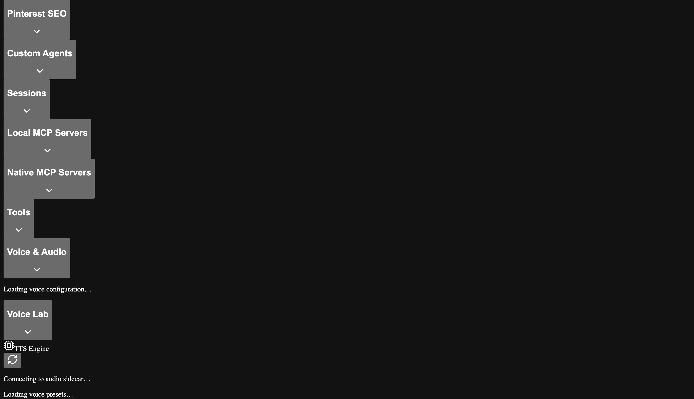

### Weekly Digest (Telegram)

When Telegram is configured, the `PinterestDigestService` can send a weekly performance digest with impressions, pin clicks, saves, and engagement metrics. Trigger via scheduled job or directly from chat.

---

## Research & Content Synthesis Engine

The Research & Content Synthesis Engine enables autonomous multi-source research, inline-cited document generation, and optional media creation — all orchestrated by the **Research Synthesizer** skill (🔬).

### Quick Start

1. Navigate to `/workbench`.
2. Click the **Research** button (🔬 microscope icon) in the toolbar.

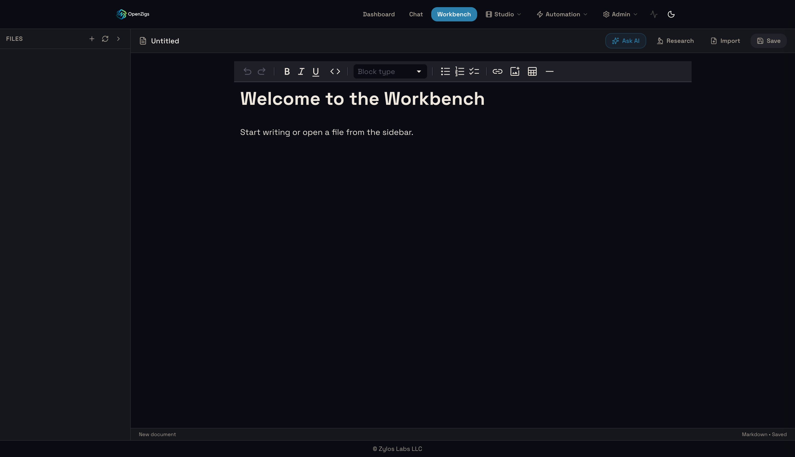

3. Fill the Research & Generate dialog:

| Field | Required | Description |
|---|---|---|
| **Topic** | Yes | The research subject (e.g., "AI coding assistants in 2026") |
| **Slant / Angle** | No | Editorial perspective (e.g., "from a cost perspective") |
| **Web articles** | No | Number of web sources to research (1–20, default 5) |
| **YouTube videos** | No | Number of YouTube sources to research (0–20, default 3) |
| **Generate images** | No | Create AI-generated illustrations for the document |
| **Generate video** | No | Create an AI-generated summary video |

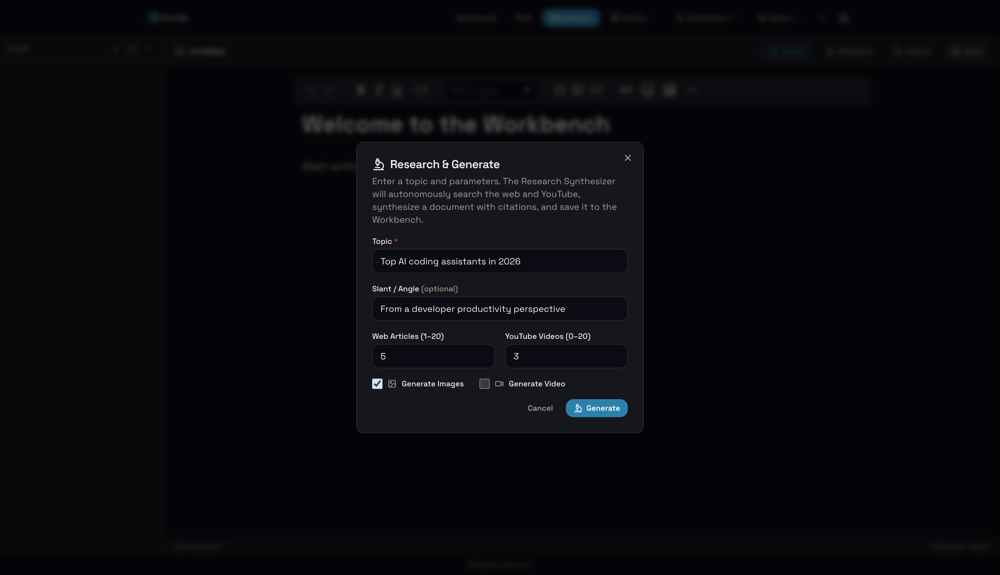

4. Click **Generate**. The agent executes a 6-phase autonomous workflow.

### Workflow Phases

| Phase | What happens | Tools used |
|---|---|---|
| 1. Parameter Extraction | Parses topic, slant, source counts from your request | — |
| 2. Web Research | Searches and reads web articles on the topic | `web-search` |
| 3. YouTube Research | Finds and analyzes relevant YouTube videos | `youtube-search-videos`, `youtube-get-video-details` |
| 4. Content Synthesis | Produces a structured, inline-cited Markdown document | `write-file` |
| 5. Media Generation | (Optional) Generates images/video based on document content | `submit-media-job`, `get-job-status`, `save-draft-media` |
| 6. Bibliography & Save | Appends a numbered bibliography and saves to disk | `write-file` |

### MCP Tools

| Tool | Risk | Description |
|---|---|---|
| `save-draft-media` | 🟡 medium | Copies generated media (images, video, audio) to `~/.openzigs/files/drafts/<project_id>/` |

The skill also uses `web-search`, `youtube-search-videos`, `youtube-get-video-details`, `submit-media-job`, `get-job-status`, `query-gallery-assets`, `read-file`, and `write-file`.

### YouTube Order Parameter

The `youtube-search-videos` tool now supports an `order` parameter for controlling result sorting:

| Value | Description |
|---|---|
| `relevance` | (default) Best match for query |
| `date` | Newest first |
| `viewCount` | Most viewed first |
| `rating` | Highest rated first |
| `title` | Alphabetical by title |

### Example Prompts

```
Research the top AI coding assistants in 2026 with 8 web articles
and 5 YouTube videos.
```

```
Compare cloud hosting providers from a cost perspective and generate
comparison images.
```

```
Write a comprehensive report on renewable energy trends using web and
YouTube sources, then generate a summary video.
```

### Draft Media Storage

Generated media from research sessions is saved to:
```
~/.openzigs/files/drafts/<project_id>/
    ├── ai-coding-assistants-hero.png
    ├── comparison-chart.png
    └── summary-video.mp4
```

If no `project_id` is specified, files save to `~/.openzigs/files/drafts/default/`.

---

## SEO Gap Analysis Engine

The SEO Gap Analysis Engine compares your page's content against top-ranking competitors for a given keyword, producing a comprehensive Markdown report with metrics, keyword gaps, and actionable recommendations.

### Quick Start

#### From Chat

Ask the agent directly:

```
Analyze the SEO gaps for https://mysite.com/blog/best-coffee-makers targeting "best coffee makers"
```

Or use the `seo-analyst` agent for a dedicated SEO analysis session.

#### From Workbench

1. Navigate to `/workbench`.
2. Click the **SEO** button (🔍 search icon) in the toolbar.
3. Fill the SEO Analysis dialog:

| Field | Required | Description |
|---|---|---|
| **Target URL** | Yes | The page URL to analyze |
| **Target Keyword** | Yes | The primary search keyword to compare against |
| **Search Provider** | No | `auto` (default), `serper`, or `brave` |
| **Model** | No | LLM model for enhanced analysis |

4. Click **Analyze**. The agent fetches your page, discovers competitors, and generates a gap report.

### How It Works

| Step | What happens |
|---|---|
| 1. Fetch Target | Downloads and parses your page HTML |
| 2. Discover Competitors | Searches the keyword via Serper.dev (or Brave) for top 5 results |
| 3. Extract Content | Uses cheerio to extract headings, body text, and metadata from each page |
| 4. Compute Metrics | TF-IDF keywords (via natural), Flesch-Kincaid readability, word counts |
| 5. Generate Report | Produces a Markdown report with comparison tables and Mermaid charts |
| 6. Save | Writes the report to `~/.openzigs/seo-reports/` |

### MCP Tools

| Tool | Risk | Description |
|---|---|---|
| `seo-gap-analysis` | � medium | Full SEO gap analysis pipeline |
| `seo-extract-content` | 🟡 medium | Extract structured content metrics from a single URL |

### Configuration

**Serper.dev API Key** (recommended — provides PAA, related searches, featured snippet data):

Set the `SERPER_API_KEY` environment variable, or add to `~/.openzigs/config.json`:

```json
{
  "seo": {
    "serperApiKey": "your-serper-api-key"
  }
}
```

**Brave Search** (fallback): Set `BRAVE_API_KEY` environment variable.

### Viewing Reports

Reports are saved as Markdown files in `~/.openzigs/seo-reports/` with the naming pattern:

```
<domain>-<keyword-slug>-<YYYY-MM-DD>.md
```

These files are visible in the Workbench file sidebar (under the `seo-reports` directory) and can be opened directly in the editor.

### Configurable Workbench Directories

The Workbench file sidebar shows configurable directories. Defaults include:

- `~/.openzigs/research/`
- `~/.openzigs/pinterest-reports/`
- `~/.openzigs/seo-reports/`

Manage via the admin API:

```
GET  /api/admin/workbench/directories
PUT  /api/admin/workbench/directories  { "directories": ["~/.openzigs/research", "~/.openzigs/custom-dir"] }
```

Or add to `~/.openzigs/config.json` under `workbench.directories`.

---

## Media Queue & Asset Gallery

The Media Queue is a push-based distributed job system for generating images, videos, and music across networked GPU nodes. Jobs are dispatched to workers asynchronously — the worker accepts the job immediately (HTTP 202) and POSTs a completion callback back to the primary Mac when done. The Asset Gallery provides a visual interface for browsing, filtering, and managing all generated and uploaded media.

### Gallery Page

Navigate to **Gallery** in the top navigation bar. The page shows:

- **Queue Stats Bar** — Live counts of Pending, Dispatched, Processing, Complete, and Failed jobs, updated every 5 seconds
- **Worker Nodes** — 3-column status grid showing all worker nodes:
  - **Image Gen (FluxQ)** — Mac Mini network node (port 5005), with Activate/Unload for VRAM control
  - **Video Gen (LTX-2)** — M2 Pro network node (port 5007), with Activate/Unload for VRAM control. Default model: LTX-2 Distilled Q4 (~19 GB, audio+video). Optional LTX-2.3 Q4 available (~41 GB download).
  - **Music Gen (ACE-Step)** — Independent localhost sidecar (port 5009), no VRAM buttons needed
  - Each card shows a reachability dot (green = online, red = offline), loaded model name, and "Generating..." spinner when busy
- **Asset Grid** — All generated and uploaded assets displayed as cards with thumbnails
- **Filters** — Filter by type (Images, Videos, Audio) and source (Generated, Uploaded, Director)
- **Preview** — Click any asset to open a full-screen lightbox for viewing images or playing videos
- **Actions** — Download, tag, or delete assets from the card overlay

### Gallery Studio

Click **Create Asset** on the Gallery page to open the inline creation studio. Five generation modes are available:

| Mode | Description | Key Controls |
|---|---|---|
| **Text → Image** | Generate an image from a text prompt | Width, Height, Steps, Guidance, Seed, Character (LoRA), ControlNet Strength |
| **Image → Image** | Transform an uploaded image with a prompt | Source image upload, Strength (0–1), Steps, Guidance |
| **Text → Video** | Generate a video clip with optional synchronized audio from a text prompt | Frames (max 97), FPS, computed Duration display, Audio toggle, Pipeline (distilled/dev/dev-two-stage/dev-two-stage-hq), Tiling mode, Model selection, Duration (4–16s), Presets |
| **Image → Video** | Animate an uploaded image with a motion prompt and optional audio | Source image upload, Frames, FPS, Duration, Audio toggle, Pipeline, Tiling mode |
| **Text → Music** | Generate music from a text description | Duration (10–300s), Inference Steps (8–27, default 20), Instrumental toggle, Lyrics textarea, Seed |

All jobs are submitted to the queue via **Submit to Queue** and processed by the appropriate worker node.

#### Video Engine Controls

When in **Text → Video** or **Image → Video** mode, the following advanced controls are available:

- **Pipeline Selector** — Choose the generation pipeline:
  - *Distilled* — Fast 2-stage pipeline (~2 min, good quality)
  - *Dev* — CFG-guided photorealistic pipeline (~10 min, highest quality)
  - *2-Stage* — Two-stage denoising pipeline
  - *2-Stage HQ* — High-quality two-stage variant
- **Audio Toggle** — Enable synchronized audio generation. Adds ~30% generation time. Automatically disabled when effective frame count exceeds 97 (the memory-safe limit for audio+video on 32GB M2 Pro). A tooltip explains the reason when disabled.
- **VAE Tiling Mode** — Controls spatial/temporal chunking during VAE decode:
  - *Auto* — Let the engine decide based on resolution
  - *None* — No tiling (fastest but may OOM at high resolution)
  - *Default* — Standard tiling
  - *Aggressive* — Maximum chunking (safest for 32GB, recommended)
  - *Conservative* — Minimal tiling
- **AI Enhance Prompt** — Uses the text encoder to expand and refine your prompt before generation.
- **Model Selector** — Choose from available LTX model variants with displayed memory requirements.
- **Preset Picker** — Load or save parameter presets:
  - Built-in presets: *Quick Draft*, *Standard*, *High Quality*
  - Save custom presets with a name for quick reuse

#### Multi-Segment Video Duration

The **Duration** selector enables video generation beyond the 4-second hardware limit:

| Duration | Segments | Generation Time |
|---|---|---|
| 4s | 1 | ~2 min (distilled) |
| 8s | 2 | ~4–5 min |
| 12s | 3 | ~6–8 min |
| 16s | 4 | ~8–10 min |

When a duration longer than 4s is selected:
1. The job is decomposed into N × 4-second segment sub-jobs
2. Each segment chains to the next using the last frame as an init_image for visual continuity
3. After all segments complete, they are stitched together with 0.5-second crossfade transitions
4. If audio is enabled, it is generated once on the final stitched video (not per-segment)
5. Progress is reported as "Segment N/M" with an aggregate percentage

---

## Lip Sync (Talking Head Pipeline)

The Lip Sync feature uses ByteDance's [LatentSync](https://github.com/bytedance/LatentSync) model to generate realistic lip movements on AI-generated videos. Combined with TTS and video generation, this powers an end-to-end **Talking Head** pipeline: type text, get a lip-synced video.

### How It Works

The Talking Head pipeline chains three stages:

1. **Speech** — F5-TTS converts your text to speech using a selected voice
2. **Video** — LTX-2 generates a video from your prompt (e.g., "a person speaking to camera")
3. **Lip Sync** — LatentSync conditions on the audio to animate the lips in the generated video

### Setup (macOS — Apple Silicon)

The LatentSync sidecar runs on port 5008 using the MPS backend (FP32):

```bash
# Install and start the lip sync sidecar (M2 Pro or better recommended)
./scripts/setup-lipsync-node.sh

# Verify it's running
curl http://localhost:5008/health
```

**Requirements**: macOS with Apple Silicon, ~18GB free RAM, Python 3.10+, ffmpeg.

### Setup (Windows/WSL — NVIDIA CUDA)

The CUDA variant runs on port 5010 using FP16:

```bash
# Install all CUDA sidecars (including lip sync)
./sidecars/setup-cuda-sidecars.sh

# Start CUDA sidecars
./sidecars/start-cuda-sidecars.sh

# Or manage individually with cuda-ctl:
./scripts/cuda-ctl.sh lipsync setup
./scripts/cuda-ctl.sh lipsync start
./scripts/cuda-ctl.sh lipsync stop
./scripts/cuda-ctl.sh lipsync status
```

**Requirements**: NVIDIA GPU with 8GB+ VRAM, CUDA 11.8+, Python 3.10+, ffmpeg.

### Using Talking Head Mode in Gallery Studio

1. Navigate to **Gallery → Create Asset**
2. Select the **Talking Head** mode (Mic icon with "LatentSync" badge)
3. Fill in:
   - **Speech Text** — The dialogue your character will speak
   - **Voice** — Select a TTS voice from the dropdown
   - **Video Prompt** — Describe the video (e.g., "a woman speaking to camera in a modern office")
4. Optionally expand **Lip Sync Settings** to adjust:
   - **Model Version** — v1.5 (faster) or v1.6 (higher quality)
   - **Inference Steps** — 10–50 (default 20; more = better quality, slower)
   - **Guidance Scale** — 1.0–3.0 (default 1.5; controls fidelity to audio)
   - **DeepCache** — Enable for ~30% speed boost with minimal quality loss
5. Click **Submit** — progress shows "Speech → Video → Lip Sync" stage progression

### Applying Lip Sync to Existing Videos

You can also submit a standalone lip sync job via the Queue API:

```bash
curl -X POST http://localhost:3000/api/queue/jobs \
  -H "Content-Type: application/json" \
  -d '{
    "type": "lipsync",
    "payload": {
      "prompt": "lip sync",
      "video_base64": "<base64-encoded-mp4>",
      "audio_base64": "<base64-encoded-wav>",
      "model": "latentsync-v1.6",
      "inference_steps": 20,
      "guidance_scale": 1.5,
      "enable_deep_cache": true
    }
  }'
```

### `media-ctl.sh` Lip Sync Commands

```bash
# Check lipsync sidecar status
./scripts/cuda-ctl.sh lipsync status

# Start lipsync sidecar
./scripts/cuda-ctl.sh lipsync start

# Stop lipsync sidecar
./scripts/cuda-ctl.sh lipsync stop

# Full setup (install dependencies + model)
./scripts/cuda-ctl.sh lipsync setup
```

### Performance

| Device | Speed | Notes |
|---|---|---|
| M2 Pro (36GB) | ~8–15 sec per second of video | FP32. Sequential with LTX (shared memory). |
| RTX 3080 (10GB) | ~3–8 sec per second of video | FP16. Can run alongside other sidecars. |

### Limitations

- **30-second max duration** — LatentSync quality degrades on longer clips
- **FP32 required on MPS** — MPS does not support FP16 for this model; requires full precision
- **Sequential execution on M2 Pro** — LTX and LatentSync cannot coexist in memory; automatic unload/reload adds ~5–10 seconds
- **Face required** — Input video must show a clear face; "no face detected" errors mean the face isn't visible or is too small

### Troubleshooting

| Symptom | Cause | Fix |
|---|---|---|
| Black frames in output | FP16 being used on MPS | Ensure the MPS fork is installed (uses FP32) |
| "No face detected" error | Face not visible in video | Use a video with a clear, forward-facing face |
| OOM crash | Both models loaded | Memory coordination should handle this; restart sidecars |
| Sidecar unreachable | Not installed/running | Run `setup-lipsync-node.sh` or `cuda-ctl.sh lipsync start` |
| Pipeline completes without lip sync | Sidecar down during pipeline | Pipeline degrades gracefully; check sidecar health |

### Security & Ethics Notice

Lip-synced video generation is **deepfake-adjacent technology**. Use responsibly:

- **Do not** use to impersonate real people without consent
- **Do not** create misleading content presented as genuine
- Generated content should be clearly labeled as AI-generated
- Consider adding visible watermarks to lip-synced output
- Review your organization's acceptable use policy before deploying

---

### Character Lab (LoRA Training & Identity Consistency)

The Character Lab lets you create persistent character identities backed by LoRA (Low-Rank Adaptation) fine-tuning. Once trained, characters can be injected into any image generation to maintain consistent identity across shots.

**Navigate to Studio → Characters** (or `/characters`).

#### Creating a Character

1. Click **+ New Character**
2. Fill in:
   - **Character Name** — A human-readable label (e.g., "Alice")
   - **Trigger Word** — A unique token used in prompts to activate the character identity (e.g., `ALICE_TOK`). Use ALL_CAPS with `_TOK` suffix by convention.
   - **LoRA Scale** — Controls how strongly the character identity is applied (0.1–1.5, default 0.8). Higher values = stronger likeness but may reduce prompt flexibility.
3. Click **Create**

#### Uploading Reference Photos

Select a character from the list, then use the **Upload Photos** button in the detail panel. Requirements:

- **Minimum 5 photos** required before training can begin
- **Maximum 20 photos** per upload batch
- **Maximum 20 MB** per photo
- Accepted formats: JPEG, PNG, WebP
- Use varied angles, lighting, and expressions for best results

#### Training a LoRA

Once you have at least 5 reference photos uploaded:

1. Configure training parameters in the detail panel:
   - **Training Steps** — Number of fine-tuning iterations (default: 1000). More steps = stronger identity but risk of overfitting.
   - **Learning Rate** — Optimizer step size (default: 0.0001). Lower values train more carefully.
   - **LoRA Rank** — Dimension of the LoRA adapter (default: 4). Higher rank captures more detail but uses more VRAM.
2. Click **Start Training**
3. The character status changes through: `pending` → `training` → `ready` (or `failed`)

Training runs as a background subprocess using `mflux-train` (DreamBooth method). Progress is monitored automatically — the character status updates when training completes.

#### Using Characters in Gallery Studio

Once a character reaches **ready** status, it appears in the Gallery Studio's **Character** dropdown:

1. Open **Gallery → Create Asset**
2. Select your character from the **Character** dropdown
3. Include the character's trigger word in your prompt (e.g., "A photo of ALICE_TOK standing in a garden")
4. Optionally adjust **ControlNet Strength** (0–1) for pose control
5. Submit to queue — the LoRA weights are automatically injected during generation

#### Character API

```bash
# List all characters
curl http://localhost:3000/api/characters

# Create a character
curl -X POST http://localhost:3000/api/characters \
  -H "Content-Type: application/json" \
  -d '{"name": "Alice", "triggerWord": "ALICE_TOK", "loraScale": 0.8}'

# Upload reference photos
curl -X POST http://localhost:3000/api/characters/<id>/photos \
  -F "photos=@photo1.jpg" -F "photos=@photo2.jpg"

# Start training
curl -X POST http://localhost:3000/api/characters/<id>/train \
  -H "Content-Type: application/json" \
  -d '{"steps": 1000, "learningRate": 0.0001, "loraRank": 4}'

# Delete a character
curl -X DELETE http://localhost:3000/api/characters/<id>
```

### Queue API Examples

**Submit a text-to-image job:**
```bash
curl -X POST http://localhost:3000/api/queue/jobs \
  -H "Content-Type: application/json" \
  -d '{
    "type": "txt2img",
    "payload": {
      "prompt": "a sunset over mountains",
      "width": 1024, "height": 1024,
      "num_steps": 4, "guidance": 3.5
    }
  }'
```

**Submit a text-to-video job:**
```bash
curl -X POST http://localhost:3000/api/queue/jobs \
  -H "Content-Type: application/json" \
  -d '{
    "type": "txt2video",
    "payload": {
      "prompt": "slow dolly shot of a forest at dawn",
      "num_frames": 97, "fps": 24,
      "width": 768, "height": 512
    }
  }'
```

**Submit a text-to-music job:**
```bash
curl -X POST http://localhost:3000/api/queue/jobs \
  -H "Content-Type: application/json" \
  -d '{
    "type": "txt2music",
    "payload": {
      "prompt": "Dreamy lo-fi hip hop beat with vinyl crackle and soft piano chords, 90 BPM",
      "duration_seconds": 30,
      "steps": 20,
      "instrumental": true
    }
  }'
```

**Submit a voice2voice job:**
```bash
curl -X POST http://localhost:3000/api/queue/jobs \
  -H "Content-Type: application/json" \
  -d '{
    "type": "voice2voice",
    "payload": {
      "prompt": "Voice conversion: artist_name",
      "source_asset_id": "<gallery-asset-id>",
      "voice_model": "artist_name",
      "pitch_shift": 0,
      "index_rate": 0.75,
      "vocal_volume": 1.0,
      "instrumental_volume": 1.0,
      "output_format": "wav"
    }
  }'
```

**Check queue stats:**
```bash
curl http://localhost:3000/api/queue/jobs/stats
# → {"pending":2,"dispatched":0,"processing":0,"complete":0,"failed":0}
```

**List gallery assets:**
```bash
curl http://localhost:3000/api/queue/assets
# → {"assets":[...],"total":5}
```

**Delete a pending job:**
```bash
curl -X DELETE http://localhost:3000/api/queue/jobs/<job-id>
```

### Configuration & Networking

**Required for multi-Mac setups:** The primary Mac's LAN IP must be reachable by the worker nodes for completion callbacks. Set `QUEUE_CALLBACK_URL` in your `.env` to point at the primary Mac:

```dotenv
# LAN IP of the primary openzigs machine — required so remote workers
# can POST their completion callback back across the LAN.
# Without this, the server auto-detects the LAN IP at startup, but
# setting it explicitly is more reliable in multi-NIC environments.
QUEUE_CALLBACK_URL=http://192.168.1.50:3000/api/queue/complete
```

If unset, the server auto-detects the first non-loopback IPv4 via `os.networkInterfaces()` and logs the resolved URL at startup. **Note:** For local sidecars (music sidecar on `localhost`), `QueueMaster` automatically rewrites the callback URL to use `localhost` so the sidecar can reach back without relying on the LAN IP.

#### Tunnel-Aware Callbacks (Recommended for Multi-Mac)

If LAN connectivity between your server and worker nodes is unreliable (WiFi AP isolation, firewalls, or cross-network setups), enable the embedded Cloudflare Tunnel. When the tunnel connects, the QueueMaster **automatically switches** its callback URL to the public tunnel URL — no manual `QUEUE_CALLBACK_URL` override needed.

1. Install `cloudflared` on the **server machine** (where openzigs runs):

   ```bash
   brew install cloudflared
   ```

2. Enable quick tunnel mode in `~/.openzigs/config.json`:

   ```json
   {
     "tunnel": {
       "enabled": true,
       "mode": "quick"
     }
   }
   ```

3. Restart the openzigs server. On startup, the tunnel connects and logs the public URL:

   ```
   Public URL: https://xxx-yyy-zzz.trycloudflare.com
   [QueueMaster] Callback URL changed: http://192.168.x.x:3000/api/queue/complete → https://xxx-yyy-zzz.trycloudflare.com/api/queue/complete
   ```

Worker nodes (image-gen, LTX video, music) will now POST completion callbacks through Cloudflare's edge network instead of through the LAN. This means:

- **Workers don't need to be on the same network** as the server
- **WiFi AP isolation** is completely bypassed
- **Firewall rules** between machines are irrelevant
- If the tunnel disconnects, callbacks automatically fall back to the LAN IP

> **Note:** Quick mode generates a random `trycloudflare.com` URL on each restart. For persistent URLs, use named mode with a Cloudflare account (see [Cloudflare Tunnel](#cloudflare-tunnel)).

### Music Studio

Navigate to **http://localhost:3001/music-studio** to access the AI Music Studio.

The Music Studio provides a full **Voice2Voice pipeline** that converts the vocal timbre of any audio track using [Seed-VC](https://github.com/Plachtaa/seed-vc) — a zero-shot voice conversion model that requires no training. The pipeline runs in three stages:

1. **Stem Separation** — Demucs v4 (`htdemucs_ft`) separates vocals from instrumentals
2. **Voice Conversion** — Seed-VC converts the isolated vocals using a short reference audio clip (1–25 seconds)
3. **Final Mixdown** — pydub recombines the converted vocals with the instrumental stem

Seed-VC supports both **speech** and **singing voice** conversion modes. Models are automatically downloaded from HuggingFace (`Plachta/Seed-VC`) on first use — no manual model setup required.

#### Voice Reference Management

Before running Voice2Voice, upload one or more **voice references** — short audio clips (1–25 seconds) of the target voice:

1. **Upload** — In the Voice2Voice control panel, click "Upload Reference" and select an audio file. Give it a descriptive name (e.g., "Deep Baritone", "Soprano Opera").
2. **Preview** — Click the play button next to any reference to audition it.
3. **Manage** — Rename or delete references from the control panel. References are stored at `~/.openzigs/voice-references/`.

Voice references are automatically trimmed and normalized on upload to ensure consistent quality.

#### Using Music Studio

1. **Load audio tracks** — Click any audio asset in the "Audio Assets" panel to load it into the waveform viewer. You can load multiple tracks for comparison.
2. **Select source** — Choose the source audio track from the "Source Track" dropdown in the control panel.
3. **Select voice reference** — Choose a previously uploaded voice reference clip.
4. **Choose mode** — Toggle between **Singing** (preserves pitch contour, 44.1 kHz) and **Speech** (natural spoken voice, 22 kHz).
5. **Adjust pitch** — Use the pitch shift slider (-12 to +12 semitones) to transpose the vocals.
6. **Advanced settings** — Expand to adjust diffusion steps (higher = better quality, slower), vocal/instrumental volumes, and output format.
7. **Submit** — Click "Start Voice2Voice" to queue the job. Pipeline progress is shown in real-time with stage indicators.

#### Waveform DAW View

The waveform viewer uses **wavesurfer.js v7** to render interactive audio waveforms:
- **Transport controls** — Play/Pause/Restart with synchronized multi-track playback
- **Per-track mute** — Solo or mute individual tracks
- **Interactive seeking** — Click anywhere on a waveform to seek to that position
- **Multi-track support** — Load source, result, and comparison tracks simultaneously

#### Real-Time Effects Chain

The **Effects Rack** provides a live Web Audio processing chain applied during playback:

- **10-Band EQ** — Low shelf, 8 peaking bands, high shelf for precise tonal shaping
- **Stereo Pan** — Full left/right stereo placement
- **Compressor** — Dynamics compression with threshold, ratio, attack, and release controls
- **Distortion** — Waveshaper-based overdrive/saturation
- **Reverb** — Convolution reverb with synthetic impulse response and wet/dry mix
- **Speed Control** — Playback rate adjustment with vibe-based presets (Chill, Normal, Hype, Hyper)

All effects are processed in real-time via the Web Audio API — changes are heard instantly without re-rendering.

#### Music Studio Sidecar Setup

The Music Studio requires a Python sidecar running on port 5010:

```bash
# Automated setup (recommended)
./install.sh   # Includes Music Studio venv + dependency installation

# Manual setup
cd sidecars/music-studio
python3.10 -m venv .venv    # Python 3.10+ required
source .venv/bin/activate
pip install -r requirements.txt
python server.py
```

Seed-VC models (~2 GB) are downloaded automatically from HuggingFace on first voice conversion request. No manual model placement is needed.

**Polling fallback for asymmetric networks:** If callback delivery fails (e.g., router AP/client isolation where the worker Mac cannot reach the primary Mac), the system automatically falls back to polling. Every tick, `QueueMaster` polls `GET /job-result/{job_id}` on any worker with a job dispatched more than 3 minutes ago. FluxQ stores results in memory for up to 100 jobs; results are deleted after the primary Mac acknowledges them. This means jobs will always complete even if push callbacks are blocked at the network layer.

Configure worker endpoints in `config/default.json` under the `queue` section:

```json
{
  "queue": {
    "nodes": {
      "mac-mini": { "host": "http://192.168.1.61:5005", "token": "<fluxq-token>" },
      "m2-pro":   { "host": "http://localhost:5007",    "token": "<ltx-token>" }
    },
    "tickIntervalMs": 3000
  }
}
```

#### Smart Remix Lab

The Music Studio page has a second tab — **AI Remix Lab** — that lets you upload any audio track, split it into 6 stems, analyze BPM/key, replace individual instruments using AI, and auto-master the final mix.

##### How It Works

1. **Analyze & Split** — Select an audio asset from the gallery and click "Analyze & Split". The sidecar runs Demucs `htdemucs_6s` to separate the track into **6 stems**: vocals, drums, bass, guitar, piano, and other. It also detects BPM (via librosa tempo) and musical key (via Krumhansl-Schmuckler profiles).

2. **Stem Dashboard** — Each stem appears as a row with:
   - **Volume slider** (0–200%) — Adjust the stem's level in the final mix
   - **Mute toggle** — Completely exclude a stem
   - **AI Replace** — Open a modal to replace the stem's instrument with one of 10 SoundFont-based instruments

3. **AI Replace** — The melody preservation engine:
   - Extracts MIDI from the audio stem using basic-pitch
   - Renders the MIDI using a SoundFont via FluidSynth
   - Applies post-processing (Chorus + Reverb) via Pedalboard
   - Preserves the original melody while changing the instrument timbre

4. **Vibe Panel** — Choose an auto-mastering preset:
   - **Punchy Pop** — Hard compression on drums/bass, bright vocal EQ
   - **Warm Lo-Fi** — Low-pass filter + subtle saturation
   - **Cinematic & Wide** — Lush reverb + stereo chorus
   - **Raw** — No processing, clean volume-only mix

5. **Mix & Master** — Combines all stems with your volume/mute/vibe settings. The mixer applies automatic headroom gain staging (−3 dB per doubling of active stems) to prevent clipping, then auto-masters using matchering (reference-based) or ITU-R BS.1770 LUFS normalization (fallback to −14 LUFS for streaming platforms) with a brick-wall limiter.

6. **Save to Gallery** — After mastering, click "Save to Gallery" to upload the final mix back to your audio assets for use in other pipelines (Voice2Voice, Director, etc.).

##### Available Instruments for AI Replace

| ID | Label |
|---|---|
| `80s_analog_synth` | 80s Analog Synth |
| `slap_bass` | Slap Bass |
| `grand_piano` | Grand Piano |
| `electric_guitar` | Electric Guitar |
| `acoustic_guitar` | Acoustic Guitar |
| `strings_ensemble` | Strings Ensemble |
| `brass_section` | Brass Section |
| `flute` | Flute |
| `organ` | Organ |
| `marimba` | Marimba |

##### SoundFont Setup

Place `.sf2` files in `~/.openzigs/soundfonts/`:
```
~/.openzigs/soundfonts/
  80s_analog_synth.sf2
  slap_bass.sf2
  grand_piano.sf2
  ...
```

##### Reference Tracks for Auto-Mastering

Place reference WAV files in `~/.openzigs/remix-references/` for matchering:
```
~/.openzigs/remix-references/
  punchy_pop.wav
  warm_lofi.wav
  cinematic_wide.wav
```

If no reference file is found for the selected vibe, the system falls back to LUFS normalization at -14 LUFS.

### Worker Sidecar Setup (M2 Pro)

The video generation worker runs as a Python FastAPI sidecar on Apple Silicon. It uses the [CharafChnioune/mlx-video](https://github.com/CharafChnioune/mlx-video) fork of mlx-video which supports both DISTILLED (fast) and DEV (photorealistic) pipelines.

**Quick setup:**

```bash
# Install from repo
cd sidecars/worker
pip install -r requirements.txt
python server.py  # Starts on port 5007

# Or use media-ctl.sh (recommended)
./scripts/media-ctl.sh ltx start     # starts via launchctl + applies sysctl GPU tuning
./scripts/media-ctl.sh ltx status    # check health
./scripts/media-ctl.sh ltx generate  # quick test (9-frame DEV pipeline)
```

**Dedicated install (recommended for separate hardware):**

```bash
# On the video generation Mac
mkdir ~/ltx-worker && cd ~/ltx-worker
python3 -m venv .venv && source .venv/bin/activate
pip install fastapi uvicorn httpx
pip install git+https://github.com/CharafChnioune/mlx-video.git

# Copy server.py from repo
cp /path/to/openzigs/sidecars/worker/server.py .

# Create .env with M2-specific tuning (see below)
cat > .env << 'EOF'
MLX_MAX_OPS_PER_BUFFER=1
MLX_CACHE_LIMIT_MB=4096
MLX_WIRED_LIMIT_MB=20480
LTX_TE_PARAM_EVAL_CHUNK=4
LTX_PARAM_EVAL_CHUNK=6
LTX_EVAL_INTERVAL=8
LTX_TE_MAX_LENGTH=128
LTX_CONNECTOR_HEADS_CHUNK=6
PYTHONUNBUFFERED=1
LTX_SECRET_TOKEN=your-secret-token-here
LTX_MODEL_REPO=AITRADER/ltx2-distilled-4bit-mlx
EOF
```

**Pipeline selection:**

| Pipeline | Quality | Speed (33 frames) | Max Resolution (M2 Pro 32GB) |
|---|---|---|---|
| `distilled` | Good (stylized) | ~2 minutes | 768×512 |
| `dev` | Photorealistic | ~10 minutes | 512×320 |

The DEV pipeline uses classifier-free guidance (CFG) which produces significantly higher quality output but doubles VRAM usage. On M2 Pro 32GB, the DEV pipeline is limited to 512×320 resolution — 768×512 will crash due to GPU memory limits.

> **M2 GPU Workaround:** M2-family chips have a known Metal GPU timeout bug. The `MLX_MAX_OPS_PER_BUFFER=1` env var and the chunked `mx.eval()` patches in mlx-video work around this. M3+ chips don't need these workarounds.

**Managing services with media-ctl.sh:**

```bash
# Start/stop services
./scripts/media-ctl.sh ltx start        # start LTX worker (with sysctl GPU tuning)
./scripts/media-ctl.sh flux start       # start FluxQ image sidecar

# Switch between image and video gen (shared VRAM)
./scripts/media-ctl.sh switch ltx       # unload FluxQ, prepare for video
./scripts/media-ctl.sh switch flux      # unload LTX, load FluxQ model

# Test video generation
./scripts/media-ctl.sh ltx generate dev "A cat in a garden, photorealistic"

# Sync server.py from repo to install dir
./scripts/media-ctl.sh ltx sync
./scripts/media-ctl.sh ltx restart
```

See [Configuration & Networking](#configuration--networking) above for how to configure worker endpoints and the callback URL.

### Music Generation Sidecar Setup (ACE-Step 1.5)

The music generation sidecar runs as a Python HTTP server wrapping [ACE-Step 1.5](https://github.com/ACE-Step/ACE-Step-1.5) for local AI music generation. It supports Apple Silicon (MPS/Metal) and CUDA.

**Quick setup:**

```bash
# 1. Install Python 3.11 (required — ACE-Step enforces ==3.11.*)
brew install python@3.11

# 2. Clone the ACE-Step Apple Silicon fork (provides the uv-managed runtime)
git clone --depth 1 https://github.com/clockworksquirrel/ace-step-apple-silicon.git ~/ace-step-apple-silicon
cd ~/ace-step-apple-silicon && uv sync

# 3. Set up the sidecar HTTP wrapper
cd /path/to/openzigs/sidecars/music
/opt/homebrew/bin/python3.11 -m venv .venv && source .venv/bin/activate
pip install -r requirements.txt

# 4. Start the sidecar (default port 5009)
python server.py
```

> **Note:** Both the local repo clone (step 2) and the pip venv (step 3) are required. The sidecar imports `AceStepHandler` and `generate_music()` directly from the cloned repo (added to `sys.path`), so `ACESTEP_DIR` must point to the clone (default: `~/ace-step-apple-silicon`). Model weights (~4–8 GB) are downloaded automatically from HuggingFace on first generation request.

> **Troubleshooting:** If you see `name 'logger' is not defined` on startup, the installed `diffusers==0.36.0` has a bug in `torchao_quantizer.py` where `logger` is used before it is defined. The sidecar venv's copy of that file needs the `logger = logging.get_logger(__name__)` line moved above the `_update_torch_safe_globals()` call at module level. This is a one-time fix to the venv file.

**Environment variables:**

| Variable | Default | Description |
|---|---|---|
| `PORT` | `5009` | HTTP server port |
| `MUSIC_GEN_AUTH_TOKEN` | _(none)_ | Bearer token for API authentication |
| `ACESTEP_REPO` | `ACE-Step/ACE-Step-1.5` | Model repository |

**Admin configuration:**

Navigate to **Admin → Music Generation Node** to configure:

- **Local Process** — Sidecar runs on the same machine (localhost:5009)
- **Network Node** — Point to a remote machine running the sidecar (URL + auth token)
- **Test Connection** — Verify the sidecar is reachable and returns model/device info

**Music prompt tips:**

- Include genre, BPM, instruments, and mood: `"Upbeat electronic dance track, 128 BPM, energetic synth leads, punchy drums"`
- Use the **AI Enhance** button in Gallery Studio to refine prompts for ACE-Step's tag-based format. The enhancer returns:
  - **Enhanced Prompt** — Comma-separated descriptive tags optimized for ACE-Step's caption encoder
  - **Suggested Lyrics** — Properly structured lyrics using ACE-Step's bracketed section format (`[Verse 1]`, `[Chorus]`, etc.)
  - **Suggested Parameters** — Auto-tuned `music_steps` (8–27) and `duration_seconds` based on prompt complexity
- Adjust **Inference Steps** (8–27, default 20) to balance speed vs quality: lower values generate faster, higher values produce more detailed audio
- For vocal tracks, add structured lyrics with `[Verse]`, `[Chorus]`, `[Bridge]` tags
- Check the **Instrumental** toggle for pure instrumental output

**Model variants:**

| Model | Steps | Speed (30s, M2 Pro) | Quality |
|---|---|---|---|
| `acestep-v15-turbo` | 8 | ~45 seconds | Good (fast iteration) |
| `acestep-v15-sft` | 32 | ~3 minutes | High (final output) |

## Running a local LLM with vLLM (Epic #888)

For users with **2x 12 GB consumer NVIDIA GPUs** (e.g., 2x RTX 3060) who want production-grade local LLM throughput at ~12-20 tokens/sec, OpenZigs ships an opt-in vLLM tensor-parallel sidecar.

### What you get

- **OpenAI-compatible** `/v1/chat/completions` endpoint at `http://127.0.0.1:8000`.
- **Default model:** Qwen 2.5 14B Instruct (AWQ 4-bit, ~9 GB on disk).
- **Allow-list of 5 vetted models** selectable from Admin -> Local vLLM (TP=2): Qwen 14B / Gemma 2 9B / Mistral Nemo 12B / Qwen 32B / Mixtral 8x7B (all AWQ-quantised).
- **Auto-BYOK:** on next server boot, the agent will detect the running vLLM, generate an API key, and configure itself to use it. No manual config edits.
- **Backpressure protection:** the in-process queue caps at 8 in-flight requests so the orchestrator can shed load instead of OOM-ing.

### Setup (one-time)

```sh
# 1. Install (pulls Docker image, generates API key in ~/.openzigs/vllm-api-key with mode 0600)
bash sidecars/vllm/install.sh

# 2. Tell start-cuda-sidecars to make room for vLLM (this DISABLES image-gen / lipsync / sadtalker)
echo 'OPENZIGS_ENABLE_VLLM=1' >> ~/.openzigs/.env.cuda

# 3. Enable auto-detect in your config
cat >> ~/.openzigs/config.json <<'EOF'
{ \"llm\": { \"localVllm\": { \"enabled\": true } } }
EOF

# 4. Start it from the admin UI: Admin -> Local vLLM (TP=2) -> Start
```

### Important: vLLM and FLUX cannot coexist

The vLLM sidecar claims **both GPUs (indices 0 and 1)**. FLUX image generation also wants those GPUs. The system enforces this both at boot (`start-cuda-sidecars.sh` skips image-gen / lipsync / sadtalker when `OPENZIGS_ENABLE_VLLM=1`) and at runtime (`GpuCoordinator` returns HTTP 409 if you try to start one while the other holds the lock).

To switch from FLUX to vLLM: stop image-gen, set the env var, start vLLM. To switch back: stop vLLM via the admin panel, unset the env var, restart sidecars.

### Stress-test the SLO

```sh
python scripts/gpu-stress-test.py --scenario vllm
```

Fires 8 concurrent chat completions (mixed 256 / 1024 / 2048-token contexts). Exits non-zero if any request returns below 8 tokens/sec, which on 2x 12 GB usually means the wrong model size or a paging-thrash situation.

See [docs/MULTI_GPU.md](MULTI_GPU.md#vllm-dual-gpu-tp2) for the full operational guide, conflict policy, and Ollama-vs-vLLM comparison.

