# User Guide

## Prerequisites

Before you begin, ensure the following are installed and available:

| Requirement | Version | Purpose |
|---|---|---|
| **Node.js** | 22+ | Runtime for the agent server. |
| **pnpm** | 10+ | Package manager. |
| **Docker Desktop** | Latest | Runs the agent, Cloudflare Tunnel sidecar, and MCP server sidecars in containers. Required for the full stack. |
| **Docker Compose** | v2+ | Orchestrates multi-container deployments (bundled with Docker Desktop). |
| **GitHub Copilot Subscription** | Individual or Business | Required for SDK access. The agent authenticates via OAuth device flow using `@github/copilot-sdk`. |
| **Chrome** | Any recent version | Required only if you use the `browser-read` or `browser-navigate` tools. |

**Knowledge converter prerequisites (Local Knowledge Base):**

| Requirement | Purpose |
|---|---|
| **ffmpeg** | Required for media converter (`.mp4`, `.mp3`, etc.) to extract 16kHz WAV audio before transcription. |
| **ImageMagick** + **Ghostscript** | Required for scanned PDF OCR fallback (render PDF pages to images). |
| **Whisper model files** (`whisper-node`) | Required for media transcription. Install with `pnpm exec whisper-node download`. |

**Optional API keys:**

| Key | Purpose |
|---|---|
| `BRAVE_API_KEY` | Enables the `web-search` tool (Brave Search API). |
| `TELEGRAM_BOT_TOKEN` | Connects the Telegram messaging channel. |
| `DISCORD_BOT_TOKEN` | Connects the Discord messaging channel. |
| `GITHUB_CLIENT_ID` | OAuth app client ID for the device-flow authentication. |
| `TUNNEL_TOKEN` | Cloudflare Tunnel token for the Docker sidecar (production). |

**MCP Sidecar prerequisites (optional — only needed if using social or document tools):**

| Requirement | Purpose |
|---|---|
| **Python 3.10+** | Some MCP servers (LinkedIn, Twitter, Facebook, MarkItDown) are Python-based. |
| **Java 17+ / JBang** | Required for the JDBC Database MCP server. [Install JBang](https://www.jbang.dev/download/). |
| **LinkedIn / Twitter / Facebook / Pinterest API credentials** | Required by respective MCP sidecars. Passed via environment variables in `docker-compose.yml`. |
| **Google Cloud OAuth credentials** | Required for Gmail MCP server. Create an OAuth app in Google Cloud Console. |
| **GitHub Personal Access Token** | Required for GitHub MCP server. Create at github.com/settings/tokens. |

---

## Installation

### 1. Clone the Repository

```bash
git clone https://github.com/mgcronin/openzigs.git
cd openzigs
```

### 2. Install Dependencies

```bash
pnpm install
```

### 3. Configure Environment

Create a `.env` file at the repository root. Use the following template and fill in the values relevant to your setup:

```dotenv
# ── Required ──
GITHUB_CLIENT_ID=your-github-oauth-client-id

# ── Optional: Brave Search ──
BRAVE_API_KEY=your-brave-api-key

# ── Optional: Messaging Channels ──
TELEGRAM_BOT_TOKEN=your-telegram-bot-token
DISCORD_BOT_TOKEN=your-discord-bot-token

# ── Optional: Chrome DevTools ──
CHROME_DEBUG_HOST=localhost
CHROME_DEBUG_PORT=9222

# ── Optional: Cloudflare Tunnel (Docker sidecar) ──
TUNNEL_TOKEN=your-cloudflare-tunnel-token

# ── Optional: MCP Sidecar URLs (set automatically by docker-compose.yml) ──
# MCP_LINKEDIN_URL=http://linkedin-mcp-server:5101
# MCP_TWITTER_URL=http://twitter-mcp-server:5102
# MCP_FACEBOOK_URL=http://facebook-mcp-server:5103
# MCP_PINTEREST_URL=http://pinterest-mcp-server:5104
# MCP_WORD_URL=http://word-mcp-server:5201

# ── Optional: Personal Assistant MCP Servers ──
# GMAIL_OAUTH_PATH=~/.gmail-mcp/gcp-oauth.keys.json
# GITHUB_PERSONAL_ACCESS_TOKEN=ghp_your_token_here
# JDBC_URL=jdbc:postgresql://localhost:5432/mydb
# DB_PASSWORD=your-db-password

# ── Server ──
PORT=3000
```

### 4. Start the Server

**Development mode (with auto-reload):**

```bash
# Terminal 1: Start the backend
pnpm dev

# Terminal 2: Start the Next.js UI
cd ui && pnpm dev
```

**Production build:**

```bash
pnpm build
pnpm start

# Build and serve the UI separately
cd ui && pnpm build && pnpm start
```

**Docker (recommended for production):**

```bash
docker compose up -d
```

The backend API starts at **http://localhost:3000** and the Next.js UI at **http://localhost:3001** by default. Access the UI at `http://localhost:3001`.

---

## First-Time Authentication

On first launch, the agent must authenticate with GitHub Copilot:

1. Run the interactive setup wizard:

   ```bash
   pnpm setup
   ```

2. The CLI prints a device code and a URL:

   ```
   Visit: https://github.com/login/device
   Enter code: ABCD-1234
   ```

3. Open the URL in your browser, enter the code, and authorize the application.

4. Once authorized, the token is saved to `~/.openzigs/auth.json` with restricted file permissions (`0600`).

You only need to do this once. The token persists across restarts.

---

## Using the Web UI

The OpenZigs UI is a **Next.js** application with a navigation bar providing access to five pages:

| Page | URL | Purpose |
|---|---|---|
| **Dashboard** | `/` | System snapshot, pending approvals, audit log |
| **Chat** | `/chat` | AI chat with streaming, model selection, approval overlays |
| **Workbench** | `/workbench` | Rich Markdown editor with file browser for drafting and editing documents |
| **Admin** | `/admin` | Channel config, sidecar management, tool toggles, env status |
| **Library** | `/library` | Saved prompt templates with `{{variable}}` interpolation |
| **Scheduler** | `/scheduler` | Cron-based job scheduling with prompt linking and model overrides |
| **Tasks** | `/tasks` | Monitor background agent tasks, sub-agents, and scheduled work |
| **Post-Actions** | `/admin/post-actions` | Create and manage custom post-action types for pipeline stages |
| **Webhooks** | `/admin/webhooks` | Create and manage inbound webhooks for external integrations |

### Chat

1. Navigate to **http://localhost:3001/chat**.

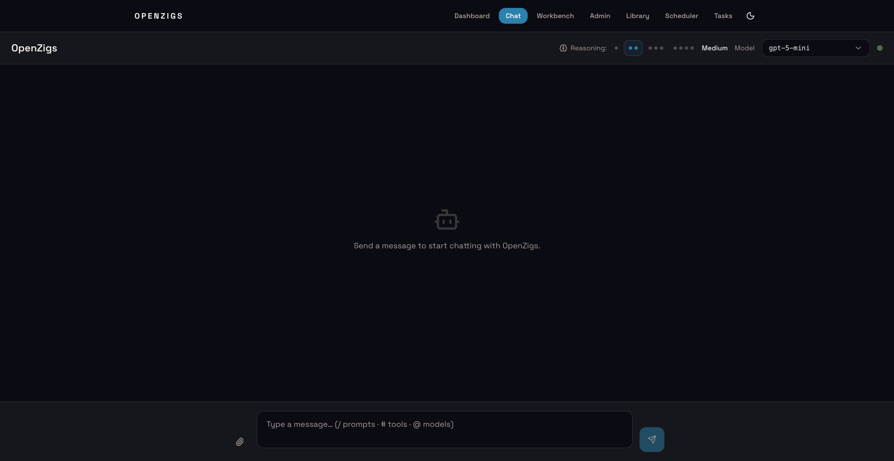

2. The chat interface includes:
   - A **model selector** dropdown in the header.
   - A **reasoning effort selector** (dot-based radio buttons) — visible only when a reasoning-capable model is selected (e.g., `o1`, `o3`, `o4-mini`).
   - A **provider badge** — shows when a non-Copilot BYOK provider is active.
   - A **context fuel gauge** — compact progress bar showing real-time context window usage (green → yellow → orange → red). Pulses during context compaction. Hover for exact token count.
   - A **connection indicator** (green = connected).
   - A **session context bar** below the header showing session ID, context gauge, turn count, session age, and compaction status.
   - A **message input** area at the bottom with **IntelliSense autocomplete**, **file attachment button**, and **drag-and-drop file zone**.

3. Type a message and press **Enter** (or click **Send**).

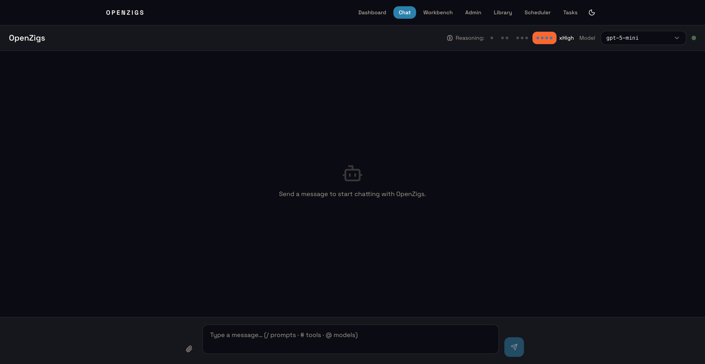

4. The assistant responds in real time via streaming — text appears word-by-word as the model generates it.

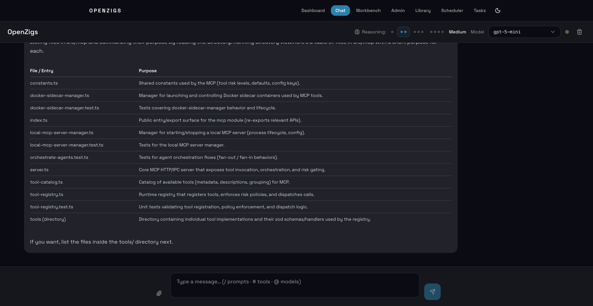

5. During execution, the agent may display an **interactive clarification prompt** — either a set of radio-button choices or a free-text input — to gather additional information before continuing.

### Smart Input (IntelliSense Autocomplete)

The chat input features trigger-based autocomplete for fast access to tools, saved prompts, and models. Type a trigger character to open the autocomplete popover:

| Trigger | Category | What it shows |
|---------|----------|---------------|
| `/` | Prompts | Saved prompt templates from the Library |
| `#` | Tools | All enabled MCP tools by name |
| `@` | Models | Available Copilot models |

**Keyboard shortcuts:**

| Key | Action |
|-----|--------|
| `/`, `#`, `@` | Open autocomplete (after whitespace or at start of input) |
| ↑ / ↓ | Navigate the autocomplete list |
| Enter | Select the highlighted item |
| Escape | Dismiss the popover |
| Arrow Up (at start of input, no popover) | Scroll through command history |
| Arrow Down (in history mode) | Navigate forward in history |
| Shift + Enter | Insert a new line |

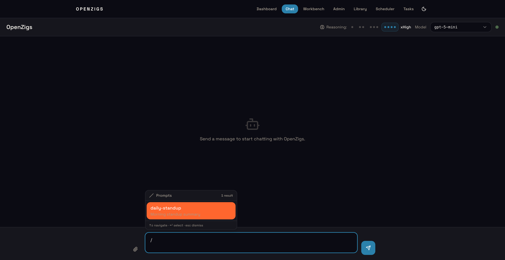

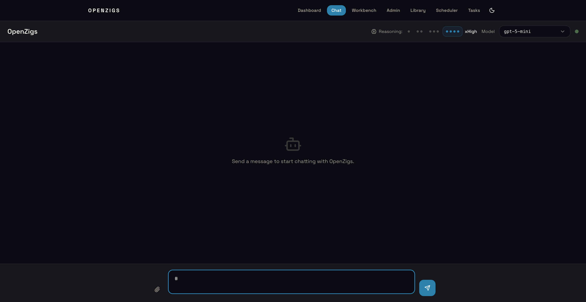

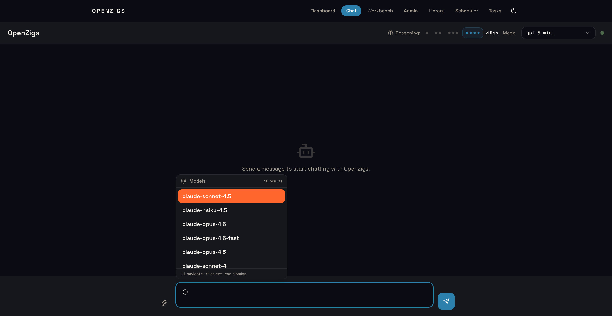

When you select an item from the autocomplete, its name is inserted into the input field. For example, typing `#web-` and selecting `web-search` inserts `web-search` at the cursor position.

### Approval Prompts

If the agent calls a high-risk tool (e.g., writing a file or running a shell command), an approval overlay appears:

- **Tool name** and **explanation** are shown.
- Click **Approve** to allow the action, or **Deny** to block it.
- The first approval (from any connected channel) wins.

### Dashboard

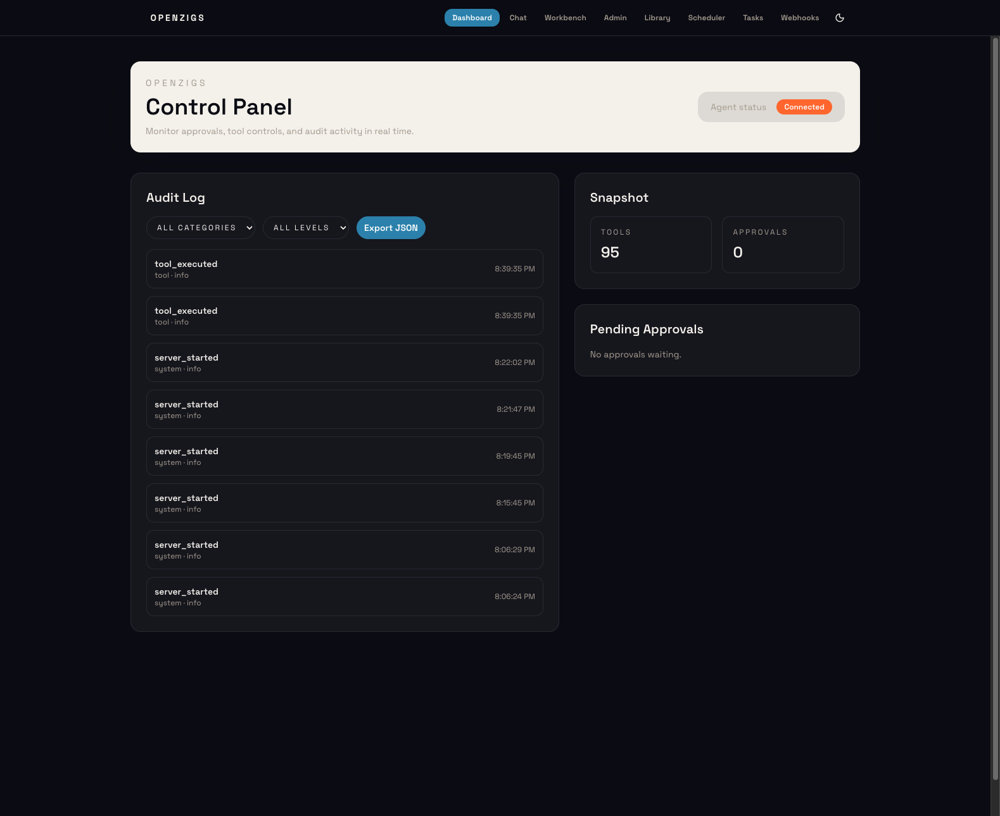

The dashboard at `/` provides:

- **Snapshot stats** — total enabled tools, pending approvals, active sessions.
- **Pending approvals** — approve or deny high-risk tool calls inline.
- **Audit log** — filterable log of tool calls, auth events, and system changes with CSV export.

### Admin

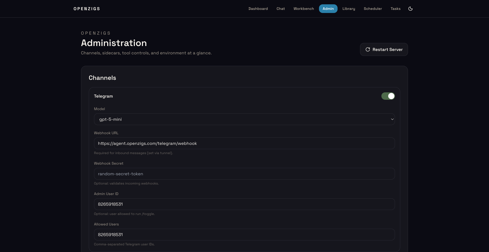

The admin page at `/admin` consolidates all configuration:

- **Channels** — Configure Telegram and Discord tokens, toggle channels on/off, select default model.
- **AI Personality** — Configure the system instruction and optional pre/post prompts, or disable injection globally. Set the **mode** to `append` (merge your personality with SDK defaults) or `replace` (fully override the system prompt with your personality text). A warning banner is displayed when replace mode is selected, and the prompt preview reflects the selected mode.
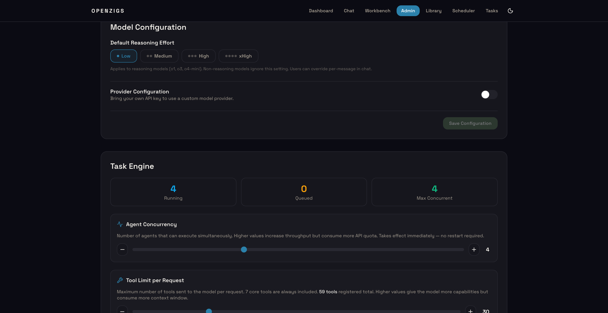

- **Model Configuration** — Set the default reasoning effort (Low / Medium / High / xHigh) for reasoning models. Enable **BYOK (Bring Your Own Key)** to configure a custom provider (OpenAI, Azure, Anthropic, Ollama, or Custom) with base URL, API key (masked by default), and optional Azure API version. Test the connection before saving, or clear the provider to revert to GitHub Copilot.
- **Task Engine** — Adjust the maximum concurrent background agents (1–10) at runtime, view live queue stats (running, queued, concurrency limit). Configure the **tool limit per request** (1–128) to control how many tools are sent to the LLM in each call — see [Tool Limit Configuration](#tool-limit-configuration) below.
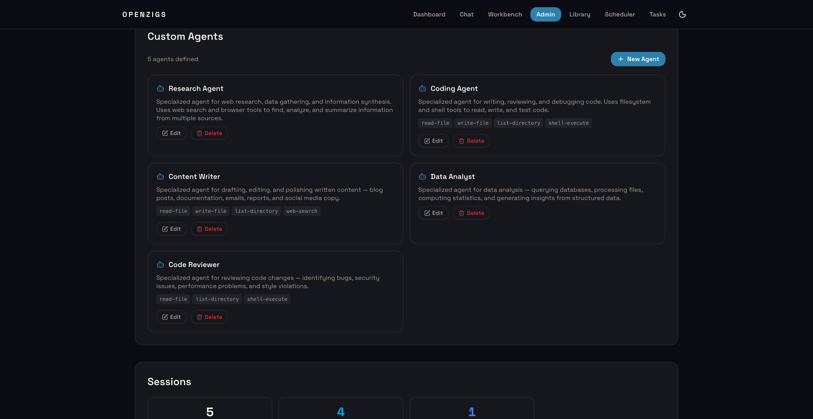

- **Custom Agents** — Create, edit, and delete custom agent archetypes. Each agent has a name (identifier), display name, description, system prompt, tool allowlist (multi-select grouped by category), and auto-invoke toggle. Agents are displayed as cards with tool badges and infer indicators.

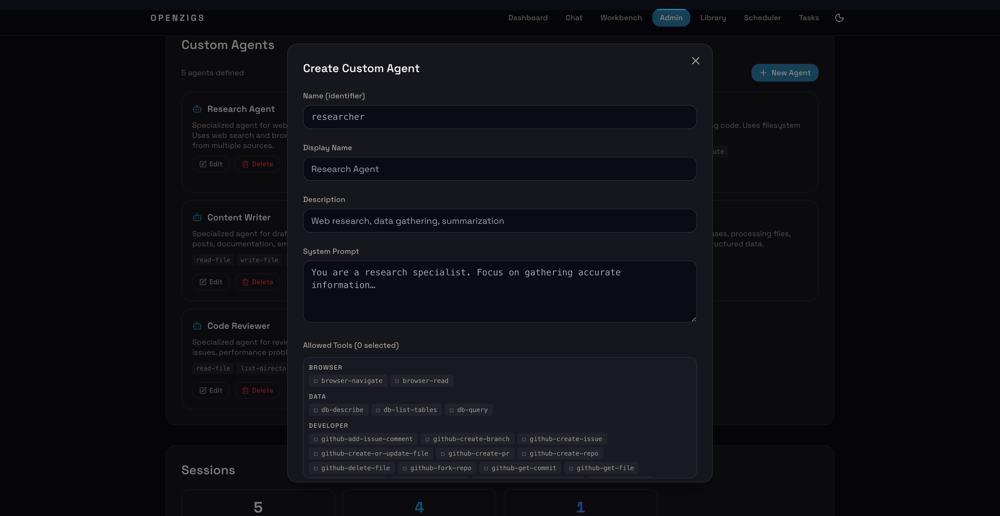
- **MCP Sidecars** — View Docker sidecar status (running, credentials missing, offline), manage credentials, restart containers, toggle per-tool within each sidecar.
- **Local MCP Servers** — View status of locally-running MCP servers (MarkItDown, Database, GitHub).
- **Native MCP Servers** — Define and manage native MCP server connections. Supports Local (stdio), HTTP, and SSE transport types. Local servers are configured with a command, arguments, working directory, and environment variables (sensitive values are masked). HTTP/SSE servers are configured with a URL and optional headers. Each server has a configurable timeout.
- **Tools** — Toggle any tool on/off, view risk level badges (🟢 low, 🟡 medium, 🔴 high), grouped by category. Each tool also has a **🔓/🔒 global approval lock** toggle — see [Global Tool Approval Lock](#global-tool-approval-lock).

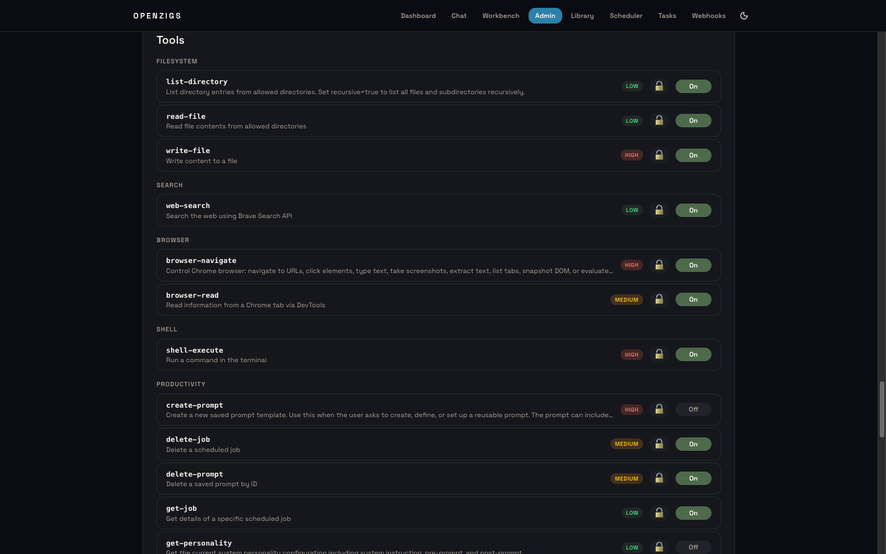

- **Environment** — Status grid showing which environment variables are configured vs. missing.

### Library (Saved Prompts)

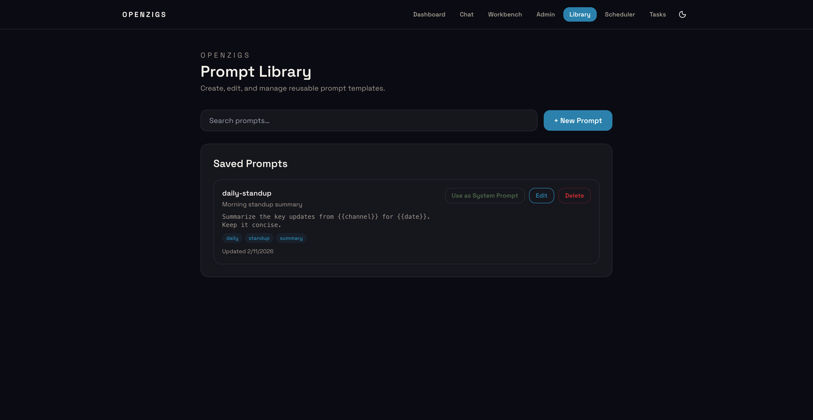

The library at `/library` provides a visual interface for managing saved prompt templates:

- **Create** new prompts with name, content, and tags.
- **Edit** existing prompts inline.
- **Search** prompts by name, content, or tags.
- **Variable preview** — `{{variable}}` placeholders are highlighted and listed.
- **Preferred Tools** — Restrict which tools a prompt can use via a ToolMultiSelect dropdown grouped by category. When set, only the selected tools (plus always-on tools) are available during execution.
- **Pipeline Stages** — Attach a multi-stage pipeline to any prompt. When the prompt is executed by the scheduler, stages run sequentially (or in parallel groups) with per-stage prompts, tool restrictions, model overrides, timeouts, auto-approve tools, and optional post-actions (e.g., "create GitHub issues from findings").
- **Use as System Prompt** — Apply any saved prompt as the active system instruction in the AI Personality panel.
- **Export** — Download any prompt as a portable `.openzigs-template.json` file for sharing across instances.
- **Import** — Upload a `.openzigs-template.json` file via the Import Wizard to add a shared template to your library.
- **Delete** with confirmation.

#### Pipeline Stages on Prompts

Any saved prompt can optionally carry pipeline stages, turning it from a simple template into a full multi-stage workflow. This is configured directly in the Library editor — no need to create a separate scheduler job.

**How to add stages:**

1. Open the Library at **http://localhost:3001/library**.
2. Click **+ New Prompt** (or **Edit** on an existing prompt).
3. Scroll to the **Pipeline Stages** section (collapsed by default).
4. Click to expand. If the prompt already has stages, the section auto-expands with a stage count badge.
5. Choose a creation mode:
   - **🧙 Workflow Wizard** — Describe your goal in plain English; AI auto-generates the stages.
   - **🔧 Manual Editor** — Build the pipeline yourself using the visual React Flow editor.
6. Each stage supports:
   - **Name** — Display label for the stage.
   - **Prompt** — Instructions for the LLM at this stage. Supports `{{variable}}` interpolation.
   - **Tools** — Multi-select for tools available to this stage (grouped by category).
   - **Auto-Approve Tools** — Tool selector (multi-select) specifying which tools bypass approval gating for this stage. Select specific tools from the stage's tool list, or leave empty to require approval for all.
   - **Timeout** — Max execution time in seconds (default: 300).
   - **Post-Action** — Deterministic action after stage completion. Action types are loaded dynamically from the Post-Action Registry (see below).
7. Click **Save Prompt** to persist the stages.

#### Post-Action Registry (Plugin System)

Post-actions are deterministic actions that run after a pipeline stage completes (e.g., create GitHub issues, send a webhook). Instead of hardcoding action types in the UI, openzigs uses a **Post-Action Registry** — a plugin system where each action type is registered with a JSON Schema describing its configuration, enabling the UI to render dynamic config forms for any action.

**Built-in post-action types:**

| Type | Category | Description |
|------|----------|-------------|
| `create-github-issues` | Integrations | Parse stage output for findings and create GitHub issues. Config: `owner`, `repo`, `labels`, `minSeverity`, `maxIssues`. |
| `send-webhook` | Notifications | POST/PUT the stage output to a webhook URL. Config: `url`, `method`, `includeOutput`. |

**How it works:**

1. At server startup, `registerBuiltinPostActions()` registers all built-in action types with the global `postActionRegistry`.
2. The UI fetches available types via `GET /api/admin/post-actions`, which returns each type's label, description, category, icon, and `configSchema`.
3. The pipeline editor renders a dynamic form based on the `configSchema` — field types (string, number, boolean, array), labels, defaults, enums, and constraints are all driven by the schema.
4. When a stage executes, the engine calls `postActionRegistry.execute(action, stageOutput)`, which delegates to the registered handler.

**REST API — List registered post-actions:**

```bash
curl http://localhost:3000/api/admin/post-actions
# Returns: { "actions": [{ "type": "create-github-issues", "label": "...", "configSchema": {...} }, ...] }
```

**Creating custom post-actions (UI):**

Navigate to **http://localhost:3001/admin/post-actions** to create custom post-action types without writing code. See [Custom Post-Actions (Settings Page)](#custom-post-actions-settings-page) below for full details.

**Registering a custom post-action (code):**

```typescript
import { postActionRegistry } from "./tasks/post-action-registry.js";

postActionRegistry.register({
  type: "slack-notify",
  label: "Slack Notification",
  description: "Send stage results to a Slack channel via incoming webhook.",
  category: "Notifications",
  icon: "slack",
  configSchema: {
    type: "object",
    properties: {
      webhookUrl: { type: "string", title: "Webhook URL", placeholder: "https://hooks.slack.com/..." },
      channel: { type: "string", title: "Channel", default: "#general" },
      mentionOnFailure: { type: "boolean", title: "Mention @here on failure", default: false },
    },
    required: ["webhookUrl"],
  },
  handler: async (stageOutput, config) => {
    // Your implementation here
    return JSON.stringify({ ok: true, channel: config.channel });
  },
});
```

**Stage and tool count badges** appear on saved prompt cards in the list, giving you a quick visual indicator of which prompts are simple templates vs. full pipelines.

**MCP tools:** The `save-prompt` and `update-prompt` MCP tools also support `stages` and `preferredTools` parameters, allowing the AI to create pipeline-enabled prompts programmatically.

**REST API:**

```bash
# Create a prompt with pipeline stages
curl -X POST -H "Authorization: Bearer <token>" \
  -H "Content-Type: application/json" \
  -d '{
    "name": "code-review-pipeline",
    "content": "Review code for {{project}}",
    "stages": [
      {
        "name": "clone-and-read",
        "prompt": "Read the source files for {{project}}",
        "tools": ["read-file", "list-directory"]
      },
      {
        "name": "review",
        "prompt": "Review the code for bugs, security issues, and style",
        "tools": ["read-file", "web-search"],
        "autoApproveTools": ["read-file"],
        "postAction": {
          "type": "create-github-issues",
          "config": { "owner": "acme", "repo": "app", "minSeverity": "medium" }
        }
      }
    ],
    "preferredTools": ["read-file", "list-directory", "web-search"]
  }' \
  http://localhost:3000/api/prompts

# Update stages (set to null to remove)
curl -X PUT -H "Authorization: Bearer <token>" \
  -H "Content-Type: application/json" \
  -d '{"stages": null}' \
  http://localhost:3000/api/prompts/<id>
```

#### Custom Post-Actions (Settings Page)

The Post-Actions settings page at `/admin/post-actions` provides a UI for creating custom post-action types without writing code. Custom actions appear automatically in the pipeline stage editor's post-action dropdown alongside built-in types.

**How to create a custom post-action:**

1. Navigate to **http://localhost:3001/admin/post-actions**.
2. Click **+ New Post-Action**.
3. Fill in the required fields:
   - **Type** — Unique slug identifier (e.g., `custom-slack-notify`).
   - **Label** — Human-readable label shown in dropdowns.
   - **Description** — What the action does.
   - **Category** — Grouping category (default: "Custom").
4. Choose a creation mode:
   - **Template** — Use a pre-built template:
     - **Webhook** — Generic HTTP sender. Configure default URL, HTTP method, and whether to include stage output.
     - **Script** — Shell command. Stage output is piped to stdin; config values are passed as `OPENZIGS_CONFIG_*` environment variables.
   - **Advanced** — Define custom config fields (string, number, boolean, array) and a script body. The fields appear as a dynamic form in the stage editor.
5. Click **Create** to save. The action is immediately available in all pipeline editors.

**Managing custom post-actions:**

- **Edit** — Click the **Edit** button on any custom action card to modify its configuration.
- **Delete** — Click **Delete** and confirm to remove a custom action.
- **Built-in actions** — Shown as read-only cards; these cannot be edited or deleted.

**REST API — Custom post-action CRUD:**

```bash
# List custom post-action definitions
curl http://localhost:3000/api/admin/post-actions/custom

# Create a custom webhook post-action
curl -X POST -H "Content-Type: application/json" \
  -d '{
    "type": "slack-webhook",
    "label": "Slack Webhook",
    "description": "Send stage output to a Slack channel",
    "templateType": "webhook",
    "templateConfig": {
      "url": "https://hooks.slack.com/services/...",
      "method": "POST",
      "includeOutput": true
    }
  }' \
  http://localhost:3000/api/admin/post-actions/custom

# Update a custom post-action
curl -X PUT -H "Content-Type: application/json" \
  -d '{"label": "Slack Webhook (Updated)"}' \
  http://localhost:3000/api/admin/post-actions/custom/slack-webhook

# Delete a custom post-action
curl -X DELETE http://localhost:3000/api/admin/post-actions/custom/slack-webhook
```

**Persistence:** Custom post-action definitions are stored in `~/.openzigs/custom-post-actions.json` and survive server restarts. On startup, all custom actions are automatically re-registered with the global post-action registry.

#### Exporting & Importing Templates

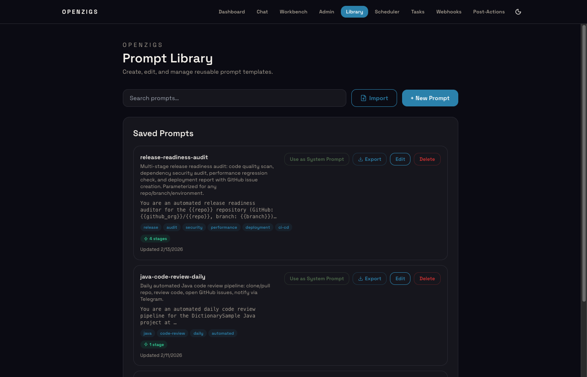

The Library supports exporting and importing prompt templates as portable `.openzigs-template.json` files. This makes it easy to share workflows between OpenZigs instances or distribute curated templates to a team.

##### Exporting a Template

1. Open the Library at **http://localhost:3001/library**.
2. Find the prompt you want to export.
3. Click the **⬇ Export** button on the prompt card.
4. A `.openzigs-template.json` file is downloaded to your browser.

The exported file contains the full prompt definition — name, description, template content, tags, preferred tools, and pipeline stages. Environment-specific values in post-action configurations (e.g., GitHub repo owner/name, webhook URLs) are automatically **tokenized** into `{{placeholder}}` markers so the template is safe to share without leaking credentials.

##### Importing a Template

1. Open the Library at **http://localhost:3001/library**.
2. Click the **Import** button in the header (next to "+ New Prompt").
3. The **Import Wizard** opens with three steps:

   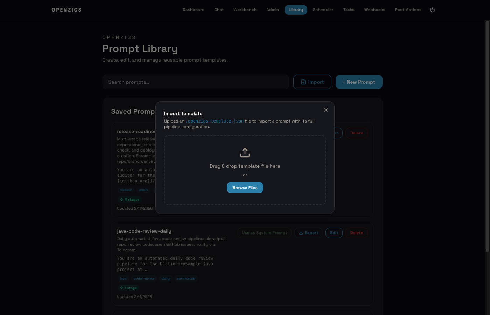

   **Step 1 — Upload:**
   - Drag and drop a `.openzigs-template.json` file onto the drop zone, or click **Browse** to select a file.
   - The wizard validates the file format and shows any errors.

   **Step 2 — Preview & Configure:**
   - Review the prompt name, description, stage count, and tags.
   - If the template contains placeholders (tokenized environment values), fill in the required values for your instance (e.g., your GitHub org/repo, your webhook URL).
   - Click **Import Template** to proceed.

   **Step 3 — Success:**
   - A confirmation screen shows the imported prompt name.
   - Click **Close** to dismiss the wizard and see the new prompt in your library.

If a prompt with the same name already exists, the imported template is automatically renamed with an "(imported)" suffix.

##### REST API — Template Export & Import

```bash
# Export a prompt as a template file
curl -H "Authorization: Bearer <token>" \
  http://localhost:3000/api/admin/prompts/1/export \
  -o my-template.openzigs-template.json

# Analyze a template before importing (pre-validation)
curl -X POST -H "Authorization: Bearer <token>" \
  -H "Content-Type: application/json" \
  -d @my-template.openzigs-template.json \
  http://localhost:3000/api/admin/templates/analyze

# Import a template with placeholder values
curl -X POST -H "Authorization: Bearer <token>" \
  -H "Content-Type: application/json" \
  -d '{
    "template": { ... },
    "placeholders": {
      "stage_0_config.owner": "my-org",
      "stage_0_config.repo": "my-repo"
    }
  }' \
  http://localhost:3000/api/admin/templates/import
```

### Scheduler

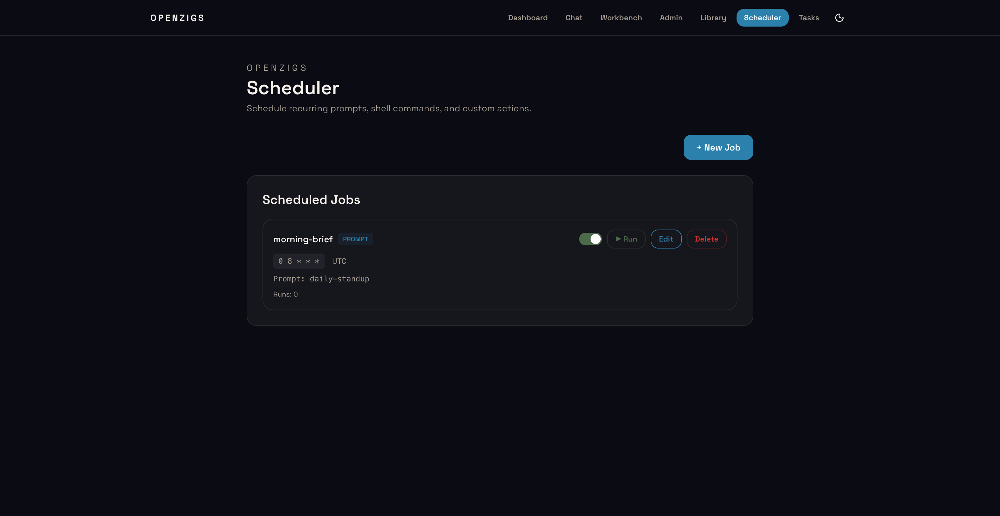

The scheduler at `/scheduler` manages cron-based automated jobs:

- **Create** jobs with name, cron expression, and action (prompt, shell command, pipeline, or custom).
- **Prompt linking** — link a job to a saved prompt from the Library.
- **Model selection** — optionally choose a model override per prompt or pipeline job.
- **AI Scheduler Assistant** — describe the schedule in plain English and auto-fill fields (uses `gpt-5-mini`).
- **Cron preview** — visual breakdown of minute, hour, day, month, weekday fields.
- **Enable/disable** individual jobs with toggle switches.
- **Run Now** — trigger any job immediately with the ▶ Run button, bypassing the cron schedule.
- **Auto-Approve Tools** — for prompt/shell/custom jobs, specify tool names that bypass approval gating. For **pipeline jobs**, auto-approve tools are **automatically derived** from the union of all stage-level tool restrictions — any tool a stage uses is auto-approved during scheduled runs.

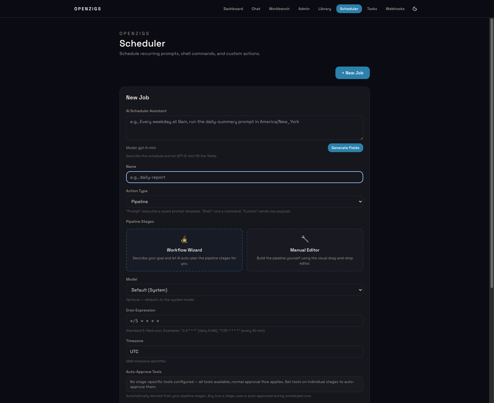
- **Live execution events** via Socket.IO — see when jobs fire in real time.

#### Multi-Model Agent Chaining

When using the `orchestrate-agents` tool (available to prompt-type jobs), you can assign **different models to each sub-agent** in the orchestration. For example, use `gpt-4o-mini` for cheap read-only analysis and `gpt-4.1` for complex code generation — all within a single scheduled job.

Each agent in the `orchestrate-agents` array accepts an optional `model` field and `auto_approve_tools` array, giving you fine-grained control over cost, capability, and autonomy per sub-agent.

#### Per-Run Approval Overrides

Approval overrides let specific tools run without human confirmation during scheduled or agent-spawned tasks. This is critical for **autonomous workflows** where no human is present to approve.

**How it works:**
1. Set `autoApproveTools` on a scheduled job or pass `auto_approve_tools` when spawning/orchestrating agents.
2. When the task executes and invokes a listed tool, the hooks layer skips the approval queue and immediately allows execution.
3. An audit log entry (`tool_auto_approved`) is recorded for every auto-approved invocation.
4. Tools **not** in the auto-approve list still follow normal approval gating.

#### Pipeline Jobs (Visual Workflow Builder)

The scheduler supports **pipeline** as a job action type. A pipeline job executes a multi-stage agent workflow where each stage runs sequentially (or in parallel groups) with its own prompt, tool restrictions, and optional model override.

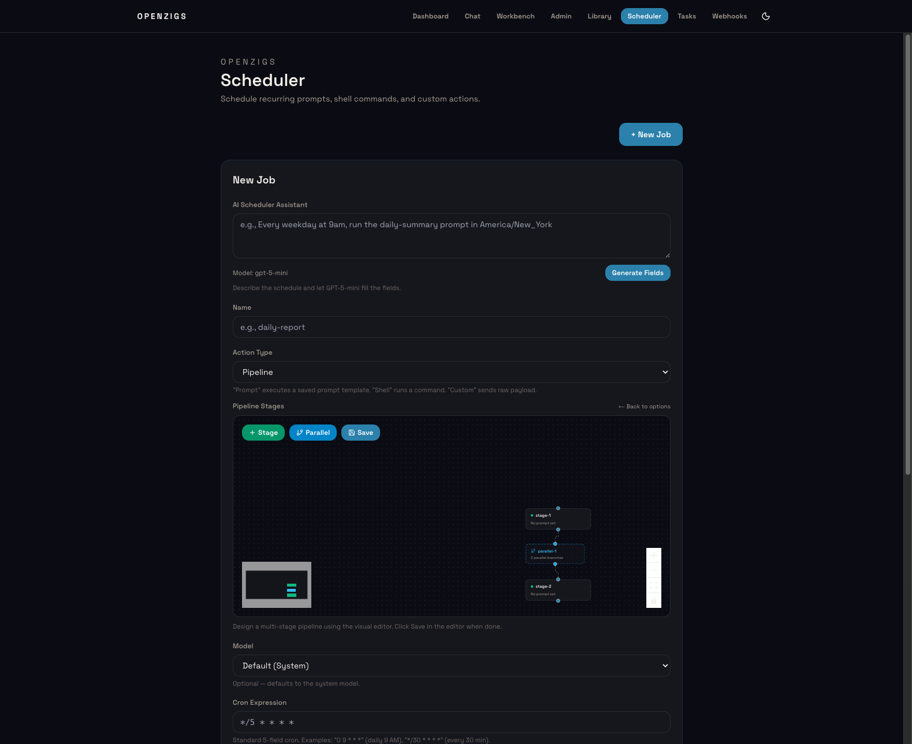

**Creating a pipeline job:**

1. In the New Job form, select **Pipeline** as the action type.
2. A **Wizard/Manual chooser** appears:
   - **🧙 Workflow Wizard** — Describe your goal in plain English and let AI auto-plan the pipeline stages.
   - **🔧 Manual Editor** — Build the pipeline yourself using the visual drag-and-drop editor.


3. In the **Manual Editor**, the Visual Pipeline Editor canvas (powered by React Flow) provides:
   - **+ Stage** button — Adds a prompt stage (single LLM agent step).
   - **+ Parallel** button — Adds a parallel group (multiple stages running concurrently).
   - **MiniMap** (bottom-left) — Overview of the full pipeline graph.
   - **Controls** (bottom-right) — Zoom, fit view, toggle interactivity.
4. Click any node to open the **Stage Editor** sidebar:
   - **Name** — Display label for the stage.
   - **Prompt** — The instruction sent to the LLM. Supports a prompt selector (press `/` to search saved prompts).
   - **Tools** — Multi-select dropdown with tools grouped by category (Browser, Developer, Documents, Filesystem, Productivity, Search, Shell). The dropdown renders as a portal overlay for full visibility.
   - **Timeout** — Maximum execution time in seconds (default: 300).
5. Connect nodes by dragging from output handles (bottom) to input handles (top).
6. Click **Save** when done. The pipeline must have at least 2 stages to create the job.

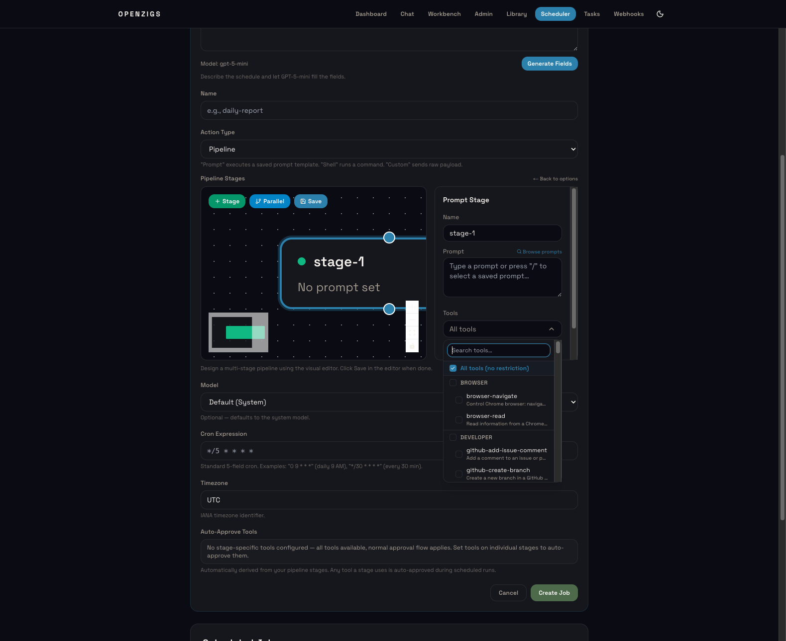

**Model selection:** Pipeline jobs now include a **Model** selector below the editor, allowing you to choose an LLM model override for the entire pipeline (e.g., `claude-sonnet-4`, `gpt-5`). This applies to all stages unless individual stages specify a model.

**Auto-derived auto-approve:** When stages have specific tool restrictions, the pipeline job's auto-approve list is **automatically derived** from the union of all stage tools. For example, if stage-1 uses `browser-navigate, list-directory, shell-execute`, those 3 tools are automatically auto-approved for the pipeline job's scheduled runs.

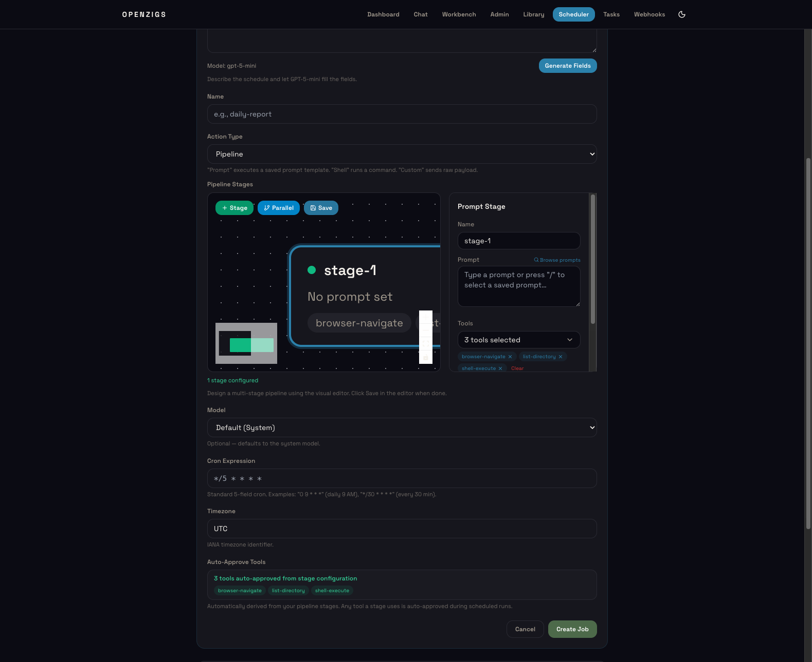

**Recursive pipelines:** Parallel groups can contain nested stages or further parallel groups, up to 4 levels deep. This allows complex fan-out/fan-in patterns.

**Pipeline Planner (Auto-Plan):** The **Workflow Wizard** provides an AI-assisted pipeline creation flow:

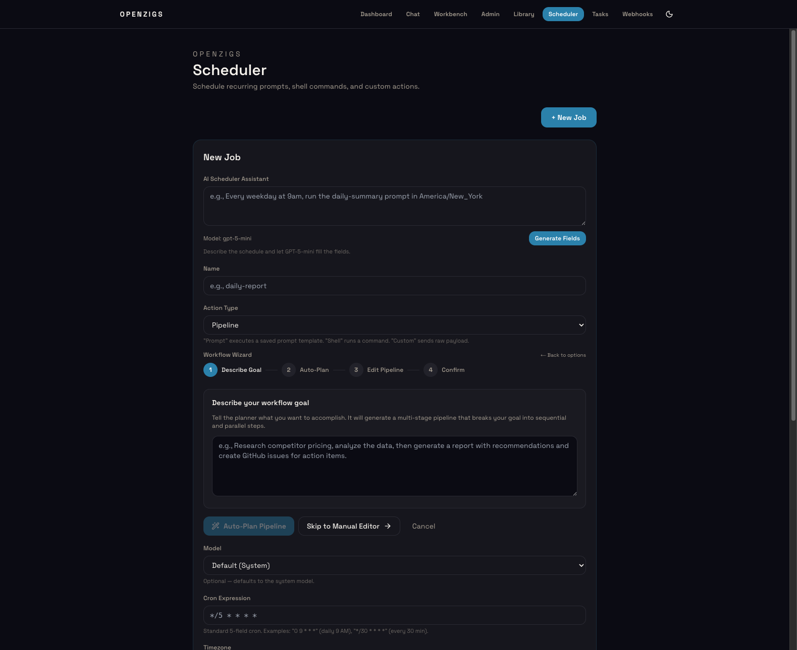

1. Select **🧙 Workflow Wizard** from the chooser.
2. Describe your goal in plain English (e.g., "Research competitors, analyze their pricing, and draft a comparison report").
3. Click **Auto-Plan Pipeline** — the system calls the Pipeline Planner Agent (`POST /api/admin/pipeline/plan`) which generates a structured pipeline definition.
4. Review the AI's rationale and the generated pipeline in the visual editor.
5. Make adjustments if needed, then confirm to create the pipeline.
6. You can also click **Skip to Manual Editor** at any time to switch to manual mode.

#### Global Tool Approval Lock

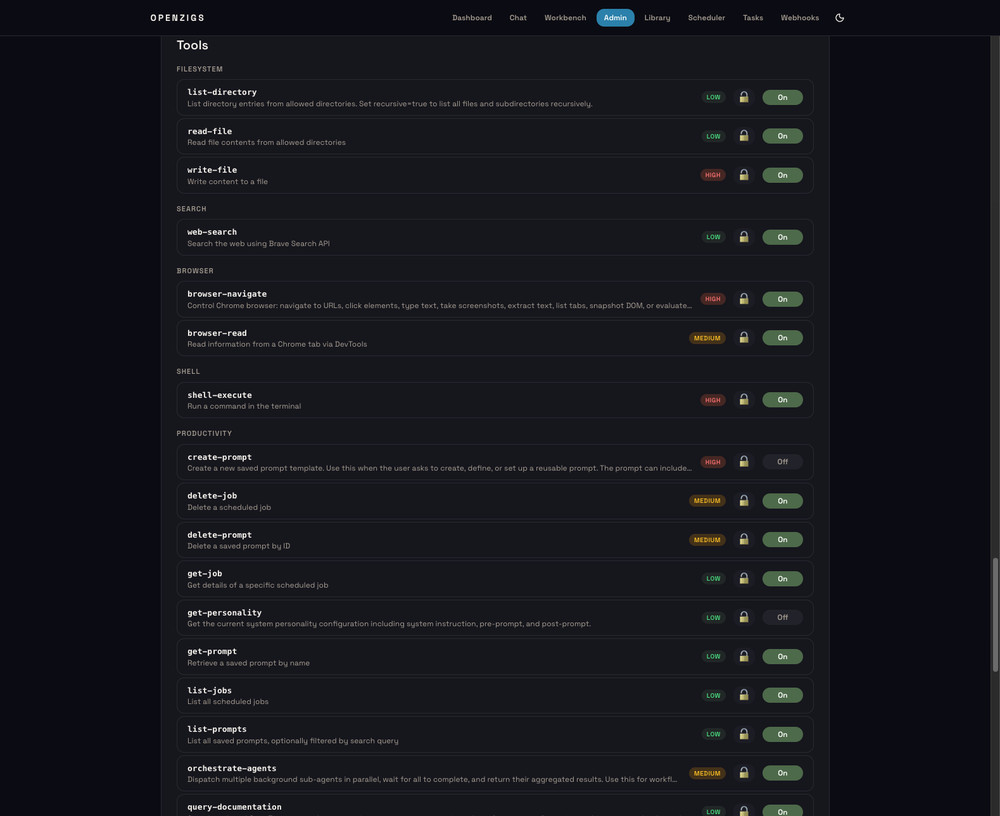

Administrators can set a **global approval lock** on any tool from the Admin → Tools panel. When a tool is locked:

- A 🔒 icon appears on the tool card. Click it to toggle the lock.
- **Locked tools always require human approval**, even if they appear in a task's `autoApproveTools` list or the interactive auto-approve context.
- This provides an admin-level safety mechanism for dangerous tools (e.g., `shell-execute`, `write-file`) that cannot be bypassed by any automation.

To toggle a lock via the API:

```bash
# Lock a tool
curl -X POST -H "Authorization: Bearer <token>" \
  -H "Content-Type: application/json" \
  -d '{"required": true}' \
  http://localhost:3000/api/admin/tools/shell-execute/global-approval

# Unlock a tool
curl -X POST -H "Authorization: Bearer <token>" \
  -H "Content-Type: application/json" \
  -d '{"required": false}' \
  http://localhost:3000/api/admin/tools/shell-execute/global-approval
```

### Workbench (Project Editor)

The Workbench at `/workbench` is a rich Markdown editor for drafting documents, notes, and content — powered by [MDXEditor](https://mdxeditor.dev/).

**Layout:**

| Area | Description |
|------|-------------|
| **File sidebar** (left) | Recursive file tree browser. Click folders to expand, click files to open. |
| **Editor** (center) | WYSIWYG Markdown editor with formatting toolbar. |
| **Status bar** (bottom) | Active file path and save state ("Modified" / "Saved"). |

**Toolbar actions:**

| Button | Action |
|--------|--------|
| Undo / Redo | Step through edit history |
| **B** *I* U | Bold, italic, underline toggles |
| `</>` | Inline code toggle |
| Block type | Switch between paragraph, headings (H1–H6), and quote |
| Lists | Ordered and unordered list toggles |
| Link | Insert or edit a hyperlink |
| Image | Insert an image by URL |
| Table | Insert a Markdown table |
| Horizontal rule | Insert a thematic break (`---`) |

**Code blocks:** The editor supports syntax-highlighted code blocks via CodeMirror for JavaScript, TypeScript, TSX, JSX, CSS, HTML, JSON, Python, Bash, SQL, and plain text.

**File management:**

- **Open a file:** Click any file in the sidebar to load its content into the editor.
- **New file:** Click the **+** button in the sidebar header. The editor resets to a blank document.
- **Save:** Click the **Save** button in the toolbar or press **Cmd+S** (macOS) / **Ctrl+S** (Windows/Linux). If no file is open, you'll be prompted for a file path.
- **Import document:** Click the **Import** button in the toolbar to open the Import Document dialog. Browse the file tree, select a document (Word, PDF, PowerPoint, Excel, HTML, images, or audio), and click **Import**. The file is converted to Markdown via the MarkItDown MCP tool and loaded into the editor as a new unsaved document.
- **Refresh:** Click the **↻** button in the sidebar header to reload the file tree.
- **Collapse sidebar:** Click the **›** button to collapse the sidebar to a narrow icon strip.

**Importing documents:**

The Import Document feature converts non-Markdown files into editable Markdown directly in the Workbench. It uses the LLM + the `convert-to-markdown` MCP tool (powered by [Microsoft MarkItDown](https://github.com/microsoft/markitdown)) to transform documents on the fly.

| Supported format | Extensions |
|------------------|------------|
| **Office documents** | `.docx`, `.pptx`, `.xlsx` |
| **PDF** | `.pdf` |
| **Web/text** | `.html`, `.htm`, `.rtf`, `.csv`, `.tsv`, `.epub` |
| **Images** (OCR) | `.jpg`, `.jpeg`, `.png`, `.gif`, `.bmp`, `.tiff`, `.webp` |
| **Audio** (transcription) | `.mp3`, `.wav`, `.m4a`, `.ogg` |

After import, the converted Markdown is loaded into the editor with a suggested file path (the original filename with a `.md` extension). The document is marked as unsaved — press **Cmd+S** to save it.

> **Prerequisite:** The MarkItDown MCP sidecar (`markitdown-mcp-server`) must be running. Start it via `docker compose up -d markitdown-mcp-server`.

**Keyboard shortcuts:**

| Key | Action |
|-----|--------|
| Cmd/Ctrl + S | Save the current file |
| Standard Markdown shortcuts | Bold (`**`), italic (`*`), code (`` ` ``), headings (`#`), lists (`-`) via Markdown shortcut plugin |

**Unsaved changes:** An amber dot appears next to the file name when you have unsaved edits. The status bar also shows "Modified" until you save.

**File path sandbox:** The Workbench uses the same `allowedDirs` sandbox as the MCP filesystem tools. You can only browse and edit files within the allowed directories (by default: the project root, home directory, and temp directories).

**Environment variable:** Set `NEXT_PUBLIC_WORKBENCH_ROOT` to change the default root directory for the file sidebar (defaults to `.`, the project root).

### Tasks (Background Agents)

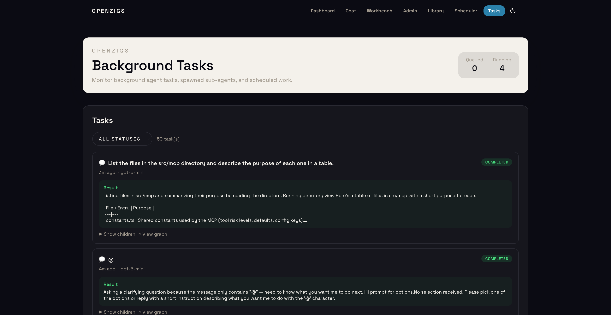

The Tasks page at `/tasks` provides real-time monitoring of background agent tasks:

- **Queue stats** — live counters showing queued and running task counts.
- **Task list** — all tasks with status badges (queued, running, completed, failed, cancelled), trigger type (chat, cron, agent), model, and depth.
- **Status filter** — filter by task status.
- **Cancel** — cancel queued or running tasks.
- **Results / errors** — view task output or error details inline.
- **Child tasks** — expand a task to see its spawned sub-tasks (recursive chaining).
- **Real-time updates** — Socket.IO pushes update the list when tasks complete or fail.
- **Token cost badges** — each task card displays a color-coded badge showing total token consumption.
- **Visual workflow graph** — click **◇ View graph** on any task to see a full interactive DAG (directed acyclic graph) of the task tree.

#### Token Cost Badges


Each task card shows a **Token Cost Badge** next to the status badge, indicating how many tokens the task consumed. The badge is color-coded by total token count:

| Token Count | Color | Meaning |
|---|---|---|
| < 10,000 | 🟢 Green | Lightweight task — minimal token usage. |
| 10,000–50,000 | 🟡 Yellow | Moderate usage. |
| 50,000–200,000 | 🟠 Orange | Heavy usage — complex task with many tool calls. |
| > 200,000 | 🔴 Red | Very expensive task — consider optimizing. |

Hover over the badge to see a tooltip with the input/output token breakdown. Token usage is only available for completed or failed tasks; queued and running tasks show no badge until they finish.

**Token usage API:**

```bash
# Get token usage for a specific task
curl -H "Authorization: Bearer <token>" http://localhost:3000/api/tasks/<id>/usage

# Get aggregate token summary for recent tasks
curl -H "Authorization: Bearer <token>" http://localhost:3000/api/tasks/usage/summary?hours=24
```

### Visual Workflow Graph

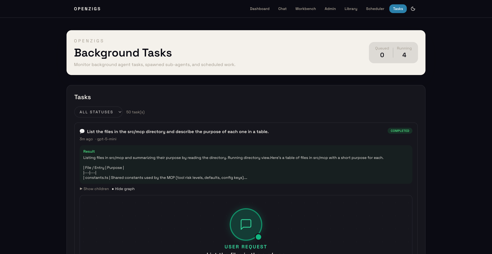

The task graph provides an interactive visualisation of a task and all its descendants, powered by React Flow and dagre layout.

**How to use:**

1. Navigate to the **Tasks** page at `/tasks`.
2. Find a task that has spawned sub-agents (any task created via `spawn-agent` or `orchestrate-agents`).
3. Click **◇ View graph** to expand the DAG below that task card.
4. The graph renders all tasks as nodes, connected by edges showing parent-child relationships.

**Node features:**

| Element | Description |
|---------|-------------|
| Status dot | Color-coded (🟡 queued, 🔵 running, 🟢 completed, 🔴 failed, ⚪ cancelled). Running nodes pulse. |
| Trigger icon | 💬 chat, ⏰ cron, 🤖 agent |
| Goal text | The task's goal, truncated to 2 lines |
| Model | The model used for execution (shown at bottom) |
| Duration | Time from creation to completion |
| Result/Error | One-line preview of output or error |

**Graph controls:**

| Control | Action |
|---------|--------|
| Mouse drag | Pan the graph |
| Scroll wheel | Zoom in/out |
| Bottom-right controls | Zoom buttons, fit view |
| Bottom-left minimap | Overview of full graph, draggable viewport |

**Animated edges:** Edges to running tasks are animated with a dashed stroke to indicate active execution.

The graph auto-refreshes every 10 seconds to reflect status changes.

**How background tasks are created:**

1. **spawn-agent tool** — During a conversation, the AI can call the `spawn-agent` MCP tool to delegate long-running work to a background sub-agent.
2. **Scheduled jobs** — Prompt-type scheduled jobs are automatically submitted as background tasks via the TaskEngine.
3. **Chat messages** — Every routed chat message is also tracked as an immediate-mode task for observability.

**Recursive chaining:** Sub-agents can themselves call `spawn-agent` to create nested sub-tasks, up to a configurable depth limit (default: 5 levels). Each level tracks its parent and depth.

**REST API:**

```bash
# List all tasks  
curl -H "Authorization: Bearer <token>" http://localhost:3000/api/tasks

# Get queue stats
curl -H "Authorization: Bearer <token>" http://localhost:3000/api/tasks/stats

# Get a specific task
curl -H "Authorization: Bearer <token>" http://localhost:3000/api/tasks/<id>

# Get children of a task
curl -H "Authorization: Bearer <token>" http://localhost:3000/api/tasks/<id>/children

# Cancel a task
curl -X POST -H "Authorization: Bearer <token>" http://localhost:3000/api/tasks/<id>/cancel
```

---

## Advanced: Agent Chaining Patterns

The **Recursive Agent Chaining** system lets you orchestrate multi-step, long-running workflows by composing background sub-agents. Under the hood, the agent uses the `spawn-agent` MCP tool to create independent `AgentTask` entries in the SQLite queue. Each task executes asynchronously via the `TaskWorker`, persists its result to the database, and notifies you when it completes — even if you close the browser.

This section covers three real-world patterns that demonstrate how to unlock chaining in practice.

### 1. The "Fire and Forget" Pattern (Chat → Background)

**When to use:** You want a thorough answer to a complex question, but you don't want to sit and watch the chat stream for several minutes.

**Example prompt (in Chat):**

```
Research the history of the weirdest V8 engines ever made. This will take a while,
so please run it in the background and notify me when done.
```

**What happens:**

| Step | Component | Action |
|------|-----------|--------|
| 1 | **MessageRouter** | Receives your message and streams it to the LLM as an immediate-mode task. |
| 2 | **LLM** | Recognizes the "background" intent and calls the `spawn-agent` tool instead of answering inline. |
| 3 | **`spawn-agent` tool** | Creates a new `AgentTask` with `trigger: "agent"`, `mode: "background"`, and `notifyOnComplete: true`. The task is inserted into the SQLite `agent_tasks` queue. |
| 4 | **Chat** | Returns immediately: *"Background task started: Research the history of the weirdest V8 engines ever made. You'll be notified when it completes."* |
| 5 | **TaskWorker** | Polls the queue, dequeues the task, and executes it via `CopilotWrapper.chat()` with a structured prompt built from the task's `goal` and `context`. |
| 6 | **NotificationDispatcher** | On completion, pushes a `task:notification` Socket.IO event to the UI, sends a message to the originating channel (Web Chat, Telegram, or Discord), and appends the result to the session JSONL. |

**Tracking:** Navigate to **http://localhost:3001/tasks** to see real-time status. The task appears with a 🤖 agent trigger icon, a `running` badge, and updates to `completed` (with the full result) or `failed` (with the error) when done.

**Key detail:** The task persists in SQLite. If you close your browser, shut your laptop, or even restart the server, the result is waiting for you when you come back. The notification is delivered the next time you connect.

---

### 2. The "Morning Briefing" Pattern (Cron → Parallel Agents)

**When to use:** You have a scheduled job that needs to gather information from multiple independent sources in parallel, then synthesize the results.

**Setup:** Create a scheduled job via the Scheduler UI at `/scheduler` (or the `schedule-job` tool):

| Field | Value |
|-------|-------|
| **Name** | `morning-briefing` |
| **Cron** | `0 6 * * *` (6:00 AM daily) |
| **Action** | Prompt |
| **Prompt** | *(see below)* |

**Job prompt:**

```
You are the Chief of Staff. Your job is to prepare a morning briefing.

Spawn three separate background agents to research the following topics in parallel:
1. "Summarize the top 5 AI and machine learning news stories from the last 24 hours."
2. "Get the current prices of Bitcoin, Ethereum, and Solana. Include 24h change percentages."
3. "What is the weather forecast for New York City today? Include temperature, precipitation, and wind."

Once all three agents complete, compile their reports into a single concise briefing document.
```

**What happens:**

```
6:00 AM — Scheduler fires
  └─ TaskEngine.submit(trigger: "cron", mode: "background")
       └─ TaskWorker dequeues → LLM executes the prompt
            ├─ spawn-agent → "AI News"       (Depth 1, child task #1)
            ├─ spawn-agent → "Crypto Prices"  (Depth 1, child task #2)
            └─ spawn-agent → "Local Weather"  (Depth 1, child task #3)
```

| Task | Trigger | Depth | Status |
|------|---------|-------|--------|
| `morning-briefing` (root) | ⏰ cron | 0 | Running — waiting for children |
| `AI News` | 🤖 agent | 1 | Queued → Running → Completed |
| `Crypto Prices` | 🤖 agent | 1 | Queued → Running → Completed |
| `Local Weather` | 🤖 agent | 1 | Queued → Running → Completed |

The three child tasks execute independently and in parallel (up to `maxConcurrent: 2` at a time). Each child's result is returned to the root agent's LLM context via the `spawn-agent` tool response. The root agent then compiles the results into a final briefing.

**Viewing in the Tasks UI:** The root task shows a **▶ Expand** button. Clicking it reveals the three child tasks with their individual statuses, results, and timing. Each child is linked to the parent via `parentTaskId`.

**Notification:** When the root task completes, the `NotificationDispatcher` sends the compiled briefing to the configured notification channel.

---

### 3. The "Manager-Worker" Pattern (Recursive Depth)

**When to use:** You have a multi-phase task where each phase depends on the output of the previous one — a pipeline of specialists.

**Example prompt (in Chat):**

```
Build a Python script that scrapes product pricing from example.com.
Break this into phases: first write a spec, then write the code based on the spec.
Run each phase as a separate background agent.
```

**What happens — a three-level task tree:**

```
Root Agent (Depth 0) — "Build a Python pricing scraper"
  │
  ├─ spawn-agent → Spec Writer (Depth 1)
  │    goal: "Write a technical specification for a Python script that scrapes
  │           product pricing from example.com. Include: target URLs, data fields
  │           to extract, output format (CSV), error handling strategy, and
  │           rate-limiting approach."
  │    context: "This spec will be handed to a coding agent to implement."
  │
  │    ┌─ Spec Writer completes with the spec document
  │    │
  │    └─ spawn-agent → Coder (Depth 2)
  │         goal: "Implement the following specification as a Python script."
  │         context: [the full spec from Depth 1]
  │
  │         └─ Coder completes with the Python script
  │
  └─ Root agent receives the final script → task marked completed
```

**Task tree in the UI:**

| Task | Depth | Parent | Status |
|------|-------|--------|--------|
| Build a Python pricing scraper | 0 | — | Completed |
| ↳ Write technical specification | 1 | *(root)* | Completed |
| &nbsp;&nbsp;&nbsp;&nbsp;↳ Implement the specification | 2 | *(spec writer)* | Completed |

**How depth tracking works:**

1. When the root agent calls `spawn-agent`, the tool handler reads the current task's `depth` (0) and creates the child at `depth + 1` (1).
2. When the Spec Writer agent calls `spawn-agent`, the child is created at `depth + 1` (2).
3. The `TaskRepository` enforces `TASK_LIMITS.maxDepth` (default: **5**). If an agent at depth 5 attempts to spawn a child, the tool returns an error: *"Maximum task depth exceeded."*
4. Additional safeguards: each parent can have at most **10 children** (`maxChildren`), and each session is limited to **20 spawns per minute** (`maxRatePerMinute`).

**Visualizing the tree:** On the `/tasks` page, click the root task's **▶ Expand** button to see its children. Click a child to expand further. Each level shows the task's goal, status badge, model, result preview, and timing.

---

### Chaining Reference

#### `spawn-agent` Tool Parameters

| Parameter | Type | Required | Default | Description |
|-----------|------|----------|---------|-------------|
| `goal` | string | Yes | — | The instruction for the sub-agent. Be specific and self-contained. |
| `context` | string | No | `""` | Additional data passed to the sub-agent's prompt (e.g., output from a previous step). |
| `notify_user` | boolean | No | `true` | Send a notification to the originating channel when the task completes or fails. |
| `model` | string | No | *(server default)* | Model override for the sub-agent (e.g., `gpt-4.1`, `claude-sonnet-4`). |

#### `orchestrate-agents` Tool Parameters

The `orchestrate-agents` tool provides a **fan-out / fan-in** pattern: it dispatches multiple sub-agents in parallel, waits for all to finish (or timeout), and optionally aggregates their results via a Copilot call.

| Parameter | Type | Required | Default | Description |
|-----------|------|----------|---------|-------------|
| `agents` | array | Yes | — | Array of 1–10 agent definitions, each with `goal` (string, required) and optional `context` (string). |
| `aggregation_prompt` | string | No | — | If provided, a final Copilot call synthesizes the agent outputs into a single deliverable. |
| `timeout_seconds` | number | No | `300` | Maximum time to wait for all agents (30–600 seconds). |

**When to use `orchestrate-agents` vs `spawn-agent`:**

| Scenario | Tool | Why |
|----------|------|-----|
| Fire-and-forget background work | `spawn-agent` | You don't need the result inline — the notification arrives later. |
| Parallel research with combined report | `orchestrate-agents` | You need all results before producing a deliverable. |
| Sequential pipeline (spec → code) | `spawn-agent` (chained) | Each step depends on the previous one. |
| Multi-source comparison | `orchestrate-agents` | Fan-out to N sources, aggregate into a comparison table. |

**Example prompt:**

```
Compare the pricing of AWS, GCP, and Azure for a 3-node Kubernetes cluster.
Use orchestrate-agents to research all three in parallel, then combine the
findings into a comparison table.
```

**What happens:**

```
Root Agent (Chat)
  └─ orchestrate-agents(
       agents: [
         { goal: "Research AWS EKS pricing for 3-node cluster" },
         { goal: "Research GCP GKE pricing for 3-node cluster" },
         { goal: "Research Azure AKS pricing for 3-node cluster" },
       ],
       aggregation_prompt: "Create a comparison table of pricing across providers"
     )
       ├─ Agent 1: AWS research (background task)
       ├─ Agent 2: GCP research (background task)
       └─ Agent 3: Azure research (background task)
       
       [All 3 complete → Copilot aggregation call → comparison table returned to chat]
```

#### Safeguard Limits

| Limit | Default | Description |
|-------|---------|-------------|
| Max recursion depth | **5** | Maximum nesting levels (root = 0, first child = 1, etc.). |
| Max children per parent | **10** | Maximum sub-tasks a single agent can spawn. |
| Max spawns per minute | **20** | Rate limit per session to prevent runaway loops. |

#### Task Lifecycle

```
queued → running → completed
                 → failed
         → cancelled (user-initiated via API or UI)
```

Tasks that are `queued` or `running` can be cancelled from the Tasks UI or via the REST API:

```bash
curl -X POST -H "Authorization: Bearer <token>" \
  http://localhost:3000/api/tasks/<task-id>/cancel
```

#### Persistence Guarantees

- All tasks are persisted in the SQLite `agent_tasks` table with WAL mode.
- Task results survive server restarts, browser closures, and network disconnections.
- Notifications are delivered via Socket.IO on reconnect and/or pushed to the originating messaging channel (Telegram, Discord).
- Session JSONL logs include task completion events for full audit traceability.

---

## Session Lifecycle & Infinite Context

OpenZigs uses the GitHub Copilot SDK's **native session management** for multi-turn conversations. This means the SDK maintains conversation context automatically — no manual history reconstruction.

### How It Works

1. **Long-Lived Sessions** — When you chat, OpenZigs creates an SDK session tied to your conversation ID and caches it. Subsequent messages reuse the same session, so the AI remembers what you said.
2. **Session Resumption** — If the server restarts, OpenZigs attempts to resume your session via the SDK's `resumeSession()` API. If that fails (e.g., the session expired), a new session is created automatically.
3. **Infinite Sessions** — Enabled by default. When the conversation grows long, the SDK automatically compacts older context in the background, preventing context window exhaustion without losing the thread of the conversation.
4. **Session Cleanup** — When you click "New Chat" in the web UI, the cached SDK session is destroyed, freeing resources and starting fresh.

### Configuration

In `config/default.json`:

```json
{
  "session": {
    "historyWindow": 20,
    "maxToolsPerRequest": 30,
    "dynamicToolLoading": false,
    "infiniteSessions": {
      "enabled": true,
      "backgroundCompactionThreshold": 0.80,
      "bufferExhaustionThreshold": 0.95
    }
  }
}
```

| Setting | Default | Description |
|---|---|---|
| `infiniteSessions.enabled` | `true` | Enable automatic context compaction for long conversations. |
| `infiniteSessions.backgroundCompactionThreshold` | `0.80` | Start compacting in the background when context usage reaches 80%. |
| `infiniteSessions.bufferExhaustionThreshold` | `0.95` | Force compaction when context usage reaches 95% (prevents hard failures). |
| `historyWindow` | `20` | Number of events retained in the JSONL audit log for admin views. Does **not** affect the LLM context (the SDK manages that natively). |

### Background Tasks

Background tasks (sub-agents, scheduled jobs) use **ephemeral sessions** — each task gets its own short-lived session that is not cached or reused. This is by design: background tasks are independent, self-contained operations.

---

## Tool Limit Configuration

OpenZigs registers 90+ MCP tools, but sending all of them to the LLM in every request wastes context window tokens and can degrade response quality. The **tool limit** controls how many tools are included per LLM call.

### Why It Matters

Each tool schema consumes **~100-300 tokens** in the model's context window. With 91 tools, that's **9,000-27,000 tokens** used before any conversation happens. This can cause:

- **Reduced conversation capacity** — fewer tokens available for chat history and responses.
- **Hallucinated tool calls** — weaker models may "invent" tool calls with incorrect parameters when overwhelmed with schemas.
- **Slower responses** — more input tokens = longer processing time.

The Copilot SDK itself has **no hard tool limit**, but the underlying models do (e.g., OpenAI supports up to 128 functions per request).

### Always-On Tools

**7 critical tools** are always included regardless of the cap:

`read-file`, `list-directory`, `web-search`, `browser-navigate`, `shell-execute`, `spawn-agent`, `orchestrate-agents`

These tools are essential for core agent functionality and will never be silently dropped.

### Admin UI

Navigate to **http://localhost:3001/admin** and find the **Tool Limit per Request** slider in the Task Engine panel:

- **Range:** 1–128 tools
- **Default:** 30
- **±5 buttons** for quick adjustment
- **Current stats** displayed: total registered tools, always-on count
- **Immediate effect** — changes apply to the next LLM request without restarting the server

The setting is persisted to `~/.openzigs/config.json` under `session.maxToolsPerRequest`.

### REST API

```bash
# Read current session config
curl -H "Authorization: Bearer <token>" http://localhost:3000/api/admin/session/config
# Response: { "maxToolsPerRequest": 30, "totalTools": 91, "alwaysOnCount": 7 }

# Update the tool limit
curl -X PUT -H "Authorization: Bearer <token>" \
  -H "Content-Type: application/json" \
  -d '{"maxToolsPerRequest": 50}' \
  http://localhost:3000/api/admin/session/config
```

### Recommendations

| Scenario | Suggested Limit | Why |
|---|---|---|
| Default / general use | **30** | Balances capability vs. context budget. |
| Lightweight chat only | **15-20** | Faster responses, more room for conversation history. |
| Full-featured (all sidecars active) | **50-80** | Ensures sidecar tools are included. |
| Maximum coverage | **128** | All tools included — monitor for quality degradation. |

---

## Per-Entity Tool Scoping

Beyond the global tool limit, OpenZigs supports **per-entity tool scoping** — restricting which tools are available for a specific scheduled job, saved prompt, or chat message. This lets you lock down a job to only the tools it needs, or give a prompt access to a curated toolset.

### How It Works

Each entity (job, prompt, or message) can declare an allowlist of tool names. When the entity executes, only those tools (plus the 7 always-on tools) are sent to the LLM. If no allowlist is set, the full enabled toolset is used as before.

**Resolution algorithm:**

1. Start with the entity's tool allowlist (e.g., `["web-search", "read-file"]`).
2. Merge in the 7 always-on tools (`read-file`, `list-directory`, `web-search`, `browser-navigate`, `shell-execute`, `spawn-agent`, `orchestrate-agents`).
3. Filter to only tools currently enabled in the `ToolRegistry`.
4. Pass the resulting set to the LLM — no other tools are visible.

### Scheduled Jobs (`allowedTools`)

Restrict a cron job to a specific set of tools:

```bash
# Create a job scoped to web-search and read-file only
curl -X POST -H "Authorization: Bearer <token>" \
  -H "Content-Type: application/json" \
  -d '{
    "name": "news-digest",
    "cron": "0 7 * * *",
    "action": "prompt",
    "promptText": "Find the top 5 AI news stories from today",
    "allowedTools": ["web-search", "read-file"]
  }' \
  http://localhost:3000/api/jobs

# Update a job to change its allowed tools
curl -X PUT -H "Authorization: Bearer <token>" \
  -H "Content-Type: application/json" \
  -d '{"allowedTools": ["web-search", "browser-navigate", "read-file"]}' \
  http://localhost:3000/api/jobs/1

# Clear tool scoping (use all enabled tools)
curl -X PUT -H "Authorization: Bearer <token>" \
  -H "Content-Type: application/json" \
  -d '{"allowedTools": null}' \
  http://localhost:3000/api/jobs/1
```

When a scoped job executes, only the listed tools plus always-on tools are sent to the LLM. This is useful for security-sensitive jobs (e.g., a reporting job that should never call `shell-execute`) or for reducing token consumption on simple jobs.

### Saved Prompts (`preferredTools`)

Attach a preferred toolset to a saved prompt template:

```bash
# Create a prompt with preferred tools
curl -X POST -H "Authorization: Bearer <token>" \
  -H "Content-Type: application/json" \
  -d '{
    "name": "code-review",
    "content": "Review the code in {{file}} for security issues",
    "preferredTools": ["read-file", "list-directory", "shell-execute"]
  }' \
  http://localhost:3000/api/prompts

# Update preferred tools
curl -X PUT -H "Authorization: Bearer <token>" \
  -H "Content-Type: application/json" \
  -d '{"preferredTools": ["read-file", "web-search"]}' \
  http://localhost:3000/api/prompts/1

# Clear preferred tools
curl -X PUT -H "Authorization: Bearer <token>" \
  -H "Content-Type: application/json" \
  -d '{"preferredTools": null}' \
  http://localhost:3000/api/prompts/1
```

The `resolveWithTools()` method returns both the interpolated prompt text and its preferred tools, making it easy for callers to scope tool access when executing a prompt.

### Web Chat Messages (`tools`)

The web chat Socket.IO interface accepts an optional `tools` array per message:

```javascript
// Client-side: send a message with tool scoping
socket.emit('chat:message', {
  content: 'Search for the latest TypeScript release notes',
  model: 'gpt-4.1',
  tools: ['web-search', 'browser-navigate']
});
```

When `tools` is provided, only those tools (plus always-on tools) are available for that specific message. This is useful for building UI controls that let users restrict tool access per-message — for example, a "search only" mode or a "code only" mode.

### Scoping Summary

| Entity | Field | API | Effect |
|--------|-------|-----|--------|
| Scheduled Job | `allowedTools` | `POST/PUT /api/jobs` | Restricts tools when the job fires |
| Saved Prompt | `preferredTools` | `POST/PUT /api/prompts` | Attaches tool preferences to the prompt |
| Chat Message | `tools` | Socket.IO `chat:message` | Restricts tools for that single message |

All three scopes follow the same resolution: **entity allowlist ∪ always-on tools ∩ enabled tools**.

> **Tip:** For a deeper analysis of tool selection strategies, token costs, and future plans, see [docs/rfc-tool-selection-strategy.md](rfc-tool-selection-strategy.md).

---

## Interactive Clarifications

During a conversation, the AI agent may need additional information from you before continuing — for example, to choose between multiple options or confirm a detail. When this happens, a **clarification prompt** appears inline in the chat.

### How It Works

1. The agent encounters an ambiguous situation during tool execution.
2. A styled prompt card appears in the chat with a question — either a set of **radio-button choices** or a **free-text input** (or both).
3. Select a choice or type your answer, then click **Submit** (or press **Enter** in the text field).
4. The prompt transitions to an "Answered" state showing your response, and the agent continues execution.

### Timeout

If you don't respond within **60 seconds**, the prompt shows a "Timed out" state and the agent auto-skips the clarification, continuing with a best-effort default. A countdown bar above the Submit button shows remaining time. This prevents conversations from hanging indefinitely.

### Background Tasks

Background tasks (sub-agents, scheduled jobs) **never** prompt for clarifications. They automatically skip all input requests so they can run unattended. If a background task encounters an ambiguous situation, it proceeds with the default behavior instead of blocking.

### Messaging Channels

Interactive clarifications are currently supported only in the **Web Chat** UI. Telegram and Discord channels auto-skip clarification prompts. Support for these channels is planned for a future release.

---

## Model Selection

The Chat page includes a model selector in the header bar.

1. Click the dropdown to see available models (fetched from the Copilot SDK).
2. Select a model. Your choice is:
   - **Applied immediately** to the next message you send.
   - **Persisted** to `config/user.json` so it survives page refreshes.

You can also set the default model from the **Admin** page under the Channels panel.

Available models depend on your Copilot subscription. Common options include:

| Model | Description |
|---|---|
| `gpt-4.1` | Default. Strong general-purpose reasoning. |
| `claude-sonnet-4` | Anthropic's Claude, available through Copilot. |

---

## File Attachments

When using the Web Chat, you can attach files and directories to your messages for the AI to reference during its response. Attachments are passed to the Copilot SDK alongside the prompt and provide the model with file contents or directory structure context.

### Supported Attachment Types

| Type | Description |
|---|---|
| `file` | A single file — the SDK reads its content and makes it available to the model. |
| `directory` | A directory path — the SDK provides the directory's structure as context. |
| `selection` | A code selection — a highlighted range within a file (with optional `startLine` / `endLine`). |

### Socket.IO Interface

Include a `files` array in the `chat:message` event:

```javascript
socket.emit('chat:message', {
  content: 'Review this code for bugs',
  files: [
    { type: 'file', path: '/home/user/project/src/app.ts', displayName: 'app.ts' },
    { type: 'directory', path: '/home/user/project/src' },
    { type: 'selection', path: '/home/user/project/src/utils.ts', startLine: 10, endLine: 25 }
  ]
});
```

### Working Directory

A **working directory** sets the base path for all tool operations (file reads, shell commands, etc.) during a conversation. You can set it per-message or as a server-wide default.

**Per-message** (Socket.IO):

```javascript
socket.emit('chat:message', {
  content: 'List all TypeScript files',
  workingDirectory: '/home/user/my-project'
});
```

**Server-wide default** (config):

```json
{
  "copilot": {
    "defaultWorkingDirectory": "/home/user/projects/main"
  }
}
```

Per-message values override the server default.

---

## Reasoning Effort

Reasoning effort controls how deeply the model reasons through a problem before responding. Higher effort produces more thorough answers at the cost of latency and token usage. This setting is passed to the Copilot SDK's `reasoningEffort` parameter.

| Level | Behavior |
|---|---|
| `low` | Quick responses, minimal reasoning. Good for simple lookups. |
| `medium` | Balanced (default). Suitable for most tasks. |
| `high` | Extended reasoning. Better for complex code generation, debugging, and planning. |
| `xhigh` | Maximum reasoning. Best for difficult multi-step problems, architecture design, and thorough analysis. |

### Configuration

**Admin API:**

```bash
# Get current model config
curl -H "Authorization: Bearer <token>" http://localhost:3000/api/admin/models/config

# Set reasoning effort
curl -X PUT -H "Authorization: Bearer <token>" \
  -H "Content-Type: application/json" \
  -d '{"reasoningEffort": "high"}' \
  http://localhost:3000/api/admin/models/config
```

**Config file** (`config/default.json` or `~/.openzigs/config.json`):

```json
{
  "copilot": {
    "defaultReasoningEffort": "high"
  }
}
```

Changes take effect on the next LLM request without restarting the server.

---

## Context Fuel Gauge

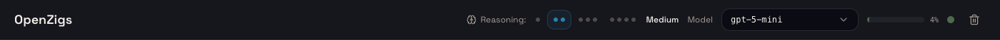

The chat header includes a **Context Fuel Gauge** — a compact progress bar that shows real-time context window usage as the conversation progresses. It sits between the model selector and the connection indicator.

### Color States

| Context Usage | Color | Meaning |
|---|---|---|
| 0–50% | 🟢 Green | Plenty of context remaining. |
| 50–75% | 🟡 Yellow | Context filling up — consider starting a new chat soon. |
| 75–90% | 🟠 Orange | Context window nearly full. |
| 90–100% | 🔴 Red | Context critical — compaction imminent or in progress. |

### Features

- **Percentage display** — Shows the fill ratio as a percentage (e.g., "42%").
- **Token count tooltip** — Hover over the gauge to see the exact token count (e.g., "53,760 tokens").
- **Compaction indicator** — The gauge pulses with an amber glow when the SDK is actively compacting context in the background.
- **Auto-reset** — The gauge resets to 0% when you click "New Chat" to clear the session.

### How It Works

The gauge subscribes to real-time `context:usage` Socket.IO events emitted by the server whenever the Copilot SDK reports token consumption. The fill ratio is calculated as:

$$\text{fillRatio} = \frac{\text{inputTokens}}{\text{contextWindow}}$$

The context window size is determined by the currently selected model (e.g., 128K for GPT-4o, 200K for Claude Sonnet 4, 1M for GPT-4.1).

---

## Session Context Bar

The Chat page displays a **session context bar** below the header, providing real-time visibility into the current session's state.

### Indicators

| Indicator | Description |
|---|---|
| **Session ID** | Truncated session ID with a copy-to-clipboard button. Click to copy the full ID. |
| **Context Gauge** | Colored progress bar showing context window usage (0–100%). Colors transition from green → amber → orange → red as usage increases. Pulses when above 80%. |
| **Turn Count** | Number of conversation turns in the current session. |
| **Session Age** | Relative time since session creation (e.g., "5m ago", "2h ago"). |
| **Compaction Spinner** | Appears when background context compaction is in progress. Disappears when compaction completes. |

### Context Thresholds

| Usage | Color | Meaning |
|---|---|---|
| 0–60% | 🟢 Green | Normal — plenty of context remaining. |
| 60–80% | 🟡 Amber | Context filling up. |
| 80–95% | 🟠 Orange | Compaction will start soon (pulsing animation). |
| 95–100% | 🔴 Red | Context nearly full — may block requests. |

### Socket Events

The context bar updates via the following real-time Socket.IO events:

| Event | Direction | Payload |
|---|---|---|
| `session:status` | Server → Client | `{ sessionId, contextUsage, turnCount, createdAt, isResumed, compactionActive, infiniteSessionsEnabled }` |
| `compaction:start` | Server → Client | *(empty)* — triggers a toast notification and spinner |
| `compaction:complete` | Server → Client | *(empty)* — triggers a toast notification and hides spinner |

---

## BYOK Provider (Bring Your Own Key)

OpenZigs supports connecting to alternative LLM providers via the Copilot SDK's **provider** configuration. This allows you to use your own API keys with OpenAI-compatible endpoints, Azure OpenAI, Anthropic, or Ollama.

### Supported Provider Types

| Provider | Description |
|---|---|
| `openai` | OpenAI API or any OpenAI-compatible endpoint (e.g., Together AI, Fireworks, local vLLM). |
| `azure` | Azure OpenAI Service with optional API version. |
| `anthropic` | Anthropic Claude API (direct access, not through Copilot). |
| `ollama` | Local Ollama instance for running open-weight models. |

### Configuration

**Admin API:**

```bash
# Set an OpenAI-compatible provider
curl -X PUT -H "Authorization: Bearer <token>" \
  -H "Content-Type: application/json" \
  -d '{
    "provider": {
      "type": "openai",
      "baseUrl": "https://api.openai.com/v1",
      "apiKey": "sk-..."
    }
  }' \
  http://localhost:3000/api/admin/models/config

# Set Ollama (local)
curl -X PUT -H "Authorization: Bearer <token>" \
  -H "Content-Type: application/json" \
  -d '{
    "provider": {
      "type": "ollama",
      "baseUrl": "http://localhost:11434"
    }
  }' \
  http://localhost:3000/api/admin/models/config

# Clear provider (revert to GitHub Copilot)
curl -X PUT -H "Authorization: Bearer <token>" \
  -H "Content-Type: application/json" \
  -d '{"provider": null}' \
  http://localhost:3000/api/admin/models/config
```

**Config file** (`config/default.json` or `~/.openzigs/config.json`):

```json
{
  "copilot": {
    "provider": {
      "type": "openai",
      "baseUrl": "https://api.openai.com/v1",
      "apiKey": "sk-your-key"
    }
  }
}
```

### Provider Fields

| Field | Type | Required | Description |
|---|---|---|---|
| `type` | string | Yes | Provider type: `openai`, `azure`, `anthropic`, `ollama`. |
| `baseUrl` | string | Yes | API base URL. |
| `apiKey` | string | No | API key (used for `openai`, `azure`, `anthropic`). |
| `bearerToken` | string | No | Alternative to `apiKey` — passed as Bearer token. |
| `wireApi` | string | No | OpenAI only: `"openai"` or `"anthropic"` wire format. |
| `azure.apiVersion` | string | No | Azure only: API version string (e.g., `"2024-02-15-preview"`). |

> **Note:** Changing the provider clears all cached SDK sessions. The next message will create a fresh session with the new provider.

---

## Custom Agents (Hierarchical Sub-Agents)

OpenZigs supports native hierarchical agents via the Copilot SDK's `customAgents` API. Custom agents are specialized sub-agents that the primary model can delegate to for domain-specific tasks. Each agent has its own system prompt, tool access, and identity.

### Default Agent Archetypes

OpenZigs ships with five built-in agent archetypes defined in `config/agents.json`:

| Name | Display Name | Description |
|------|-------------|-------------|
| `researcher` | Research Agent | Deep web research and analysis with full tool access |
| `coder` | Code Agent | Code generation and file operations (read-file, write-file, list-directory, shell-execute) |
| `writer` | Writing Agent | Content writing and editing (read-file, write-file, list-directory, web-search) |
| `analyst` | Data Analyst | Data analysis and visualization with full tool access |
| `reviewer` | Code Reviewer | Code review and quality assurance (read-file, list-directory, shell-execute) |

### Configuration

Add custom agents in your user config (`~/.openzigs/config.json`) or `config/default.json` under `copilot.customAgents`:

```json
{
  "copilot": {
    "customAgents": [
      {
        "name": "security-auditor",
        "displayName": "Security Auditor",
        "description": "Specialized in security analysis and vulnerability assessment",
        "prompt": "You are an expert security auditor. Analyze code for vulnerabilities, review dependencies, and suggest hardening measures.",
        "tools": ["read-file", "list-directory", "shell-execute", "web-search"],
        "infer": false
      }
    ]
  }
}
```

User-configured agents override default archetypes when they share the same `name`. Agents not overridden are kept from`config/agents.json`.

### Agent Definition Fields

| Field | Type | Required | Description |
|-------|------|----------|-------------|
| `name` | string | Yes | Unique agent identifier (used for delegation). |
| `displayName` | string | Yes | Human-readable label shown in responses. |
| `description` | string | No | Brief description of the agent's specialty. |
| `prompt` | string | Yes | System prompt defining the agent's behavior. |
| `tools` | string[] \| null | No | Tool allowlist for this agent (`null` = all tools). |
| `infer` | boolean | No | Whether the SDK infers when to delegate to this agent. |
| `mcpServers` | object | No | Per-agent MCP server connections (see Native MCP Servers below). |

### Admin API

```bash
# List all custom agents
curl http://localhost:3000/api/admin/agents

# Add a new agent
curl -X POST http://localhost:3000/api/admin/agents \
  -H "Content-Type: application/json" \
  -d '{"name":"qa","displayName":"QA Agent","prompt":"You test software."}'

# Replace all agents
curl -X PUT http://localhost:3000/api/admin/agents \
  -H "Content-Type: application/json" \
  -d '{"agents":[...]}'

# Remove an agent
curl -X DELETE http://localhost:3000/api/admin/agents/qa
```

### Per-Chat Override

Custom agents can also be specified per-chat call via the `customAgents` option. Per-call agents merge with defaults — agents with the same `name` are overridden, new agents are appended.

---

## Native MCP Servers

OpenZigs supports native MCP (Model Context Protocol) server connections via the Copilot SDK's built-in `mcpServers` API. This is the recommended way to connect external MCP servers — it replaces the legacy subprocess-based `LocalMcpServerManager`.

### Configuration

Add native MCP servers in `~/.openzigs/config.json` or `config/default.json` under `copilot.nativeMcpServers`:

```json
{
  "copilot": {
    "nativeMcpServers": {
      "my-database": {
        "type": "stdio",
        "command": "npx",
        "args": ["-y", "@modelcontextprotocol/server-postgres"],
        "env": { "DATABASE_URL": "postgresql://localhost:5432/mydb" }
      },
      "remote-tools": {
        "type": "http",
        "url": "https://mcp.example.com/tools",
        "headers": { "Authorization": "Bearer ${MCP_API_KEY}" }
      }
    }
  }
}
```

### Server Types

| Type | Transport | Required Fields | Description |
|------|-----------|----------------|-------------|
| `stdio` | Subprocess | `command` | Spawns a local process communicating via stdin/stdout |
| `local` | Subprocess | `command` | Alias for `stdio` |
| `http` | HTTP | `url` | Connects to an HTTP-based MCP server |
| `sse` | Server-Sent Events | `url` | Connects to an SSE-based MCP server |

### Server Definition Fields

| Field | Type | Applies To | Description |
|-------|------|-----------|-------------|
| `type` | string | All | Server type: `"stdio"`, `"local"`, `"http"`, or `"sse"` |
| `command` | string | stdio/local | Command to spawn (e.g., `"npx"`, `"uvx"`, `"python3"`) |
| `args` | string[] | stdio/local | Command arguments |
| `env` | object | stdio/local | Environment variables for the subprocess |
| `cwd` | string | stdio/local | Working directory for the subprocess |
| `url` | string | http/sse | Server URL |
| `headers` | object | http/sse | HTTP headers (e.g., auth tokens) |
| `tools` | string[] | All | Tool allowlist (only expose these tools from the server) |
| `timeout` | number | All | Connection timeout in milliseconds |

### Admin API

```bash
# List configured native MCP servers
curl http://localhost:3000/api/admin/native-mcp-servers

# Replace all native MCP servers
curl -X PUT http://localhost:3000/api/admin/native-mcp-servers \
  -H "Content-Type: application/json" \
  -d '{"servers":{"my-server":{"type":"stdio","command":"npx","args":["-y","my-mcp-server"]}}}'

# Test a native MCP server config without saving
curl -X POST http://localhost:3000/api/admin/native-mcp-servers/test \
  -H "Content-Type: application/json" \
  -d '{"serverName":"my-server","server":{"type":"stdio","command":"npx","args":["-y","my-mcp-server"]}}'
```

### MCP Connection Wizard (Admin UI)

Native MCP servers are now managed through a step-by-step wizard in **Admin → Native MCP Servers**:

1. **Step 1:** Choose server type (`Stdio`, `HTTP`, or `SSE`) and enter server name.
2. **Step 2:** Fill type-specific fields (command/args/env/cwd or url/headers) and timeout.
3. **Step 3:** Run **Test Connection** to validate connectivity and preview discovered tools.

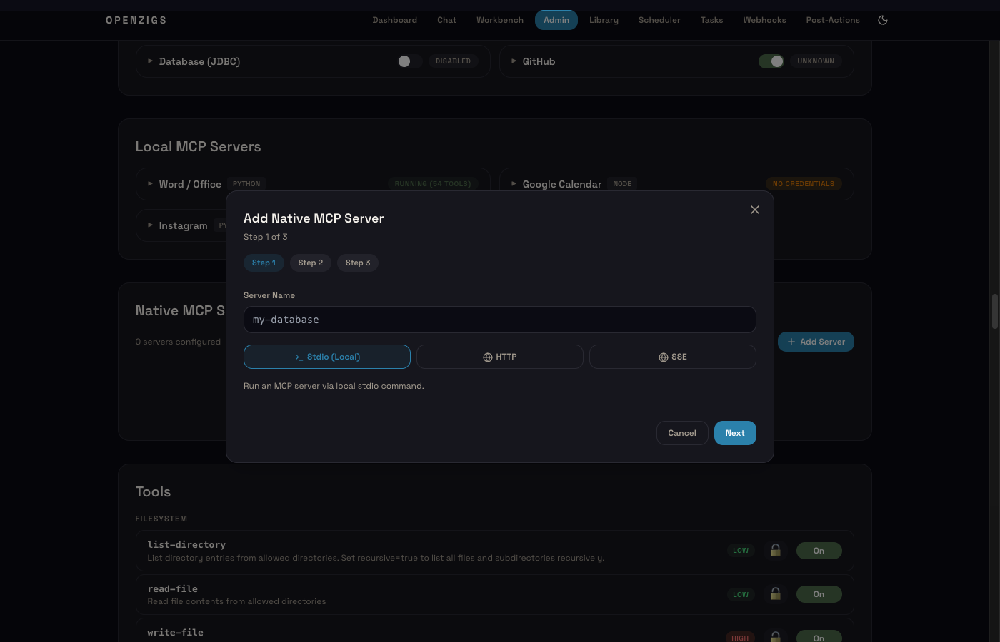
You can save without testing via **Skip Test**, but testing is recommended because successful tests populate discovered tool metadata shown in the Tools panel.

### System Busy Guard (Safe-Swap)

To avoid interrupting active workloads, MCP server config updates are blocked while tasks are running:

- Backend guard: `PUT/POST/DELETE /api/admin/native-mcp-servers*` returns `409` when `running + queued > 0`.
- UI guard: Add/Edit/Remove controls are disabled and an amber lock banner appears with running/queued counts.

When unlocked, config changes proceed normally.

### Auto-Discovered MCP Tools

After a successful connection test, discovered MCP tools appear in **Admin → Tools** under categories formatted as:

- `USER MCP: <SERVER-NAME>`

These entries are shown with a plug icon and can be toggled via `mcp:<server>:<tool>` identifiers. If a server is disconnected, the category shows a disconnected marker and the Native MCP card offers a **Reconnect** action.

> **Note:** Native MCP servers are managed by the Copilot SDK at the session level. Changing server configuration clears cached SDK sessions, so OpenZigs applies a busy guard to prevent swaps during active task execution. The `LocalMcpServerManager` path remains available for legacy local servers, but native MCP is the preferred path for new integrations.

---

## Enabling and Disabling Tools

Tools can be managed via the **Admin** page at `/admin` or via the REST API. Each tool can be toggled independently.

### Admin UI

Navigate to **http://localhost:3001/admin** and scroll to the **Tools** section. Tools are grouped by category (`filesystem`, `search`, `browser`, `shell`, `productivity`, `social`, `documents`, `personal`, `data`, `developer`). Each tool shows its risk level badge and a toggle switch.

For MCP sidecar tools, expand a sidecar card and use the per-tool toggles to enable or disable individual tools within that server.

### REST API

#### List All Tools

```bash
curl -H "Authorization: Bearer <token>" http://localhost:3000/api/tools | jq
```

Returns tools grouped by category (`filesystem`, `search`, `browser`, `shell`, `productivity`, `social`, `documents`), each showing `name`, `riskLevel`, and `enabled` status.

### Toggle a Tool

```bash
# Disable shell-execute
curl -X POST \
  -H "Authorization: Bearer <token>" \
  -H "Content-Type: application/json" \
  -d '{"enabled": false}' \
  http://localhost:3000/api/tools/shell-execute/toggle

# Enable it again
curl -X POST \
  -H "Authorization: Bearer <token>" \
  -H "Content-Type: application/json" \
  -d '{"enabled": true}' \
  http://localhost:3000/api/tools/shell-execute/toggle
```

Toggle state is persisted to `config/tools.json`. Disabled tools are **not** passed to the Copilot SDK; the model cannot call them.

---

## Connecting Telegram

For the full, step-by-step Telegram setup (including Cloudflare Tunnel and access control), see [docs/TELEGRAM_SETUP.md](docs/TELEGRAM_SETUP.md).

1. Create a Telegram bot via [@BotFather](https://t.me/BotFather) and copy the token.

2. Set the token in your `.env`:

   ```dotenv
   TELEGRAM_BOT_TOKEN=123456:ABCdefGHIjklMNOpqrSTUvwxYZ
   ```

3. Enable the Telegram channel in `config/default.json`:

   ```json
   {
     "channels": {
       "telegram": {
         "enabled": true,
         "token": "${TELEGRAM_BOT_TOKEN}"
       }
     }
   }
   ```

4. **If you need webhooks** (e.g., for production or non-polling mode), enable the Cloudflare Tunnel:

   ```json
   {
     "tunnel": {
       "enabled": true,
       "mode": "quick"
     }
   }
   ```

   The agent prints the public URL on startup. Set the `webhookUrl` in your config to this URL + `/telegram/webhook`.

5. Restart the server. Send a message to your bot in Telegram — the agent responds.

### Access Control

Restrict which Telegram users can interact with the agent:

```json
{
  "channels": {
    "telegram": {
      "allowedUsers": ["123456789", "987654321"]
    }
  }
}
```

When `allowedUsers` is non-empty, only those Telegram user IDs may send messages. Everyone else receives "Unauthorized."

---

## Connecting Discord

1. Create a Discord application at the [Discord Developer Portal](https://discord.com/developers/applications).
2. Add a bot and copy the token.

3. Set the token in your `.env`:

   ```dotenv
   DISCORD_BOT_TOKEN=your-discord-bot-token
   ```

4. Enable the Discord channel in `config/default.json`:

   ```json
   {
     "channels": {
       "discord": {
         "enabled": true,
         "token": "${DISCORD_BOT_TOKEN}",
         "allowedGuilds": ["your-guild-id"]
       }
     }
   }
   ```

5. Invite the bot to your server using the OAuth2 URL from the Developer Portal.

6. Restart the server. DM the bot or mention it in a channel — the agent responds.

---

## Chrome DevTools Setup

The `browser-read` tool connects to a running Chrome instance via the Chrome DevTools Protocol. This is required if you want the agent to read web page content.

1. Launch Chrome with remote debugging:

   ```bash
   # macOS
   /Applications/Google\ Chrome.app/Contents/MacOS/Google\ Chrome \
     --remote-debugging-port=9222

   # Linux
   google-chrome --remote-debugging-port=9222

   # Windows
   start chrome --remote-debugging-port=9222
   ```

2. Set the environment variables (default values shown):

   ```dotenv
   CHROME_DEBUG_HOST=localhost
   CHROME_DEBUG_PORT=9222
   ```

3. If running the agent in Docker, Chrome runs on the host machine and the agent reaches it via `host.docker.internal:9222`.

---

## Docker Usage

### Full Stack (Recommended)

```bash
docker compose up -d
```

This starts the complete stack:

| Service | Description | Port |
|---|---|---|
| `agent` | OpenZigs agent server | 3000 |
| `tunnel` | Cloudflare Tunnel sidecar | — (proxies to `agent:3000`) |
| `linkedin-mcp-server` | LinkedIn MCP sidecar | 5101 |
| `twitter-mcp-server` | Twitter/X MCP sidecar | 5102 |
| `facebook-mcp-server` | Facebook MCP sidecar | 5103 |
| `pinterest-mcp-server` | Pinterest MCP sidecar | 5104 |
| `word-mcp-server` | Office Word MCP sidecar | 5201 |
| `markitdown-mcp-server` | MarkItDown file converter | 5301 |
| `gmail-mcp-server` | Gmail MCP sidecar | 5302 |
| `database-mcp-server` | JDBC Database MCP sidecar | 5303 |
| `github-mcp-server` | GitHub MCP sidecar | 5304 |

All containers share the `openzigs-network` Docker bridge. The agent communicates with MCP sidecars via HTTP on their internal ports.

### Starting Individual Services

If you only need a subset of services:

```bash
# Agent + tunnel only (no MCP sidecars)
docker compose up -d agent tunnel

# Agent + social media sidecars only
docker compose up -d agent linkedin-mcp-server twitter-mcp-server
```

> **Note:** If an MCP sidecar is not running, the corresponding tools will return connection errors when invoked. The agent does not currently health-check sidecars on startup.

### View Logs

```bash
docker compose logs -f           # All services
docker compose logs -f agent     # Agent only
docker compose logs -f tunnel    # Tunnel only
```

### Stop

```bash
docker compose down
```

### Development with Docker

```bash
docker compose -f docker-compose.yml -f docker-compose.dev.yml up
```

This mounts the source directory for live-reload inside the container.

### Persistence

- **Session data and auth tokens** are stored in `~/.openzigs/` on the host (mounted as a Docker volume).
- **Pinterest OAuth tokens** are persisted in the `pinterest-tokens` Docker volume.
- **SQLite database** (prompts, jobs) is stored inside the agent container at the configured path. Data survives container restarts via the `~/.openzigs/` mount.

---

## Cloudflare Tunnel

The Cloudflare Tunnel provides a public HTTPS URL to reach your local agent. This is required for Telegram webhooks and Discord OAuth redirects.

### Docker Sidecar (Recommended)

In the recommended deployment, `cloudflared` runs as a separate container defined in `docker-compose.yml`. The agent does **not** manage the tunnel process — Docker Compose does.

1. Create a Cloudflare Tunnel in the [Cloudflare Zero Trust dashboard](https://one.dash.cloudflare.com/) and copy the tunnel token.

2. Set the token in your `.env`:

   ```dotenv
   TUNNEL_TOKEN=your-cloudflare-tunnel-token
   ```

3. Ensure the agent's internal tunnel is **disabled** (this is the default):

   ```json
   {
     "tunnel": {
       "enabled": false
     }
   }
   ```

4. Start the stack:

   ```bash
   docker compose up -d
   ```

The `tunnel` service proxies public HTTPS traffic to `http://agent:3000` inside the Docker network. Set your Telegram `webhookUrl` to your Cloudflare hostname (e.g., `https://agent.example.com/telegram/webhook`).

### Embedded Quick Mode (Development)

For local development without Docker, the agent can spawn `cloudflared` as a child process:

```json
{
  "tunnel": {
    "enabled": true,
    "mode": "quick"
  }
}
```

Generates a temporary `https://xxx.trycloudflare.com` URL. No Cloudflare account required.

### Embedded Named Mode (Production without Docker)

```json
{
  "tunnel": {
    "enabled": true,
    "mode": "named",
    "namedTunnel": {
      "credentialsFile": "~/.cloudflared/credentials.json",
      "hostname": "agent.example.com"
    }
  }
}
```

Requires a Cloudflare account with a configured tunnel and DNS record.

---

## Productivity Tools

OpenZigs includes an embedded productivity engine backed by SQLite for saved prompts and cron-based job scheduling.

### Saved Prompts

Save reusable prompt templates with `{{variable}}` interpolation:

```
You: Save a prompt called "daily-standup" with content "Summarize the key updates from {{channel}} for {{date}}"
Agent: ✅ Saved prompt "daily-standup" (id: 1)

You: Run the prompt "daily-standup" with channel=telegram and date=today
Agent: [executes the resolved prompt]
```

**Available tools:** `save-prompt`, `get-prompt`, `list-prompts`, `update-prompt`, `delete-prompt`, `run-prompt`.

**REST API:**

```bash
# List all prompts
curl -H "Authorization: Bearer <token>" http://localhost:3000/api/prompts

# Create a prompt
curl -X POST -H "Authorization: Bearer <token>" \
  -H "Content-Type: application/json" \
  -d '{"name": "greeting", "content": "Hello {{name}}!"}' \
  http://localhost:3000/api/prompts
```

### Scheduled Jobs

Schedule automated cron jobs that the agent executes on a recurring basis:

```
You: Schedule a job called "morning-summary" to run at 8am every day with the action "Summarize yesterday's activity"
Agent: ✅ Scheduled job "morning-summary" (cron: 0 8 * * *)
```

**Available tools:** `schedule-job`, `list-jobs`, `get-job`, `update-job`, `delete-job`, `toggle-job`.

**REST API:**

```bash
# List all jobs
curl -H "Authorization: Bearer <token>" http://localhost:3000/api/jobs

# Toggle a job on/off
curl -X POST -H "Authorization: Bearer <token>" \
  -H "Content-Type: application/json" \
  -d '{"enabled": false}' \
  http://localhost:3000/api/jobs/1/toggle
```

---

## Social Media Tools

Social media tools are powered by **MCP sidecars** — separate Docker containers that the agent communicates with via HTTP.

### Supported Platforms

| Platform | Sidecar Container | Port | Tools |
|---|---|---|---|
| **LinkedIn** | `linkedin-mcp-server` | 5101 | `social-post`, `social-timeline`, `social-profile` |
| **Twitter/X** | `twitter-mcp-server` | 5102 | `social-post`, `social-timeline`, `social-profile` |
| **Facebook** | `facebook-mcp-server` | 5103 | `social-post`, `social-timeline`, `social-profile` |
| **Pinterest** | `pinterest-mcp-server` | 5104 | `social-post`, `social-timeline`, `social-profile`, `pinterest-boards`, `pinterest-pins` |

### Usage

When posting to social media, the agent automatically converts Markdown formatting to platform-native Unicode text. Social platforms do not render Markdown — so `**bold**` becomes 𝗯𝗼𝗹𝗱, `*italic*` becomes 𝑖𝑡𝑎𝑙𝑖𝑐, headings become BOLD UPPERCASE, and links are expanded to `text (url)` format. This conversion happens transparently before posts are dispatched to the MCP sidecars.

```
You: Post "Just shipped a new feature! 🚀" to LinkedIn
Agent: [calls social-post with platform=linkedin] ✅ Posted to LinkedIn

You: Show me my Pinterest boards
Agent: [calls pinterest-boards with action=list] Here are your boards: ...

You: Get my Twitter profile
Agent: [calls social-profile with platform=twitter] Here's your profile: ...
```

### Configuration

Each sidecar requires platform-specific API credentials set as environment variables in `docker-compose.yml`. Refer to the individual MCP server documentation for the required credentials.

Sidecar URLs are passed to the agent via environment variables:

```dotenv
MCP_LINKEDIN_URL=http://linkedin-mcp-server:5101
MCP_TWITTER_URL=http://twitter-mcp-server:5102
MCP_FACEBOOK_URL=http://facebook-mcp-server:5103
MCP_PINTEREST_URL=http://pinterest-mcp-server:5104
```

---

## Document Intelligence Tools

Document tools provide PDF reading, Word document generation, and Google Calendar integration.

### PDF Reading (Built-in)

The `read-pdf` tool runs locally inside the agent (no sidecar needed):

```
You: Read the PDF at /data/report.pdf and summarize it
Agent: [calls read-pdf] Here's a summary of the document: ...
```

### Word Document Creation (MCP Sidecar)

The `create-word-doc` tool proxies to the Word MCP sidecar:

```
You: Create a Word document with a project proposal
Agent: [calls create-word-doc via word-mcp-server] ✅ Document created
```

### Google Calendar (MCP Sidecar)

```
You: What meetings do I have this week?
Agent: [calls calendar-list] Here are your upcoming events: ...

You: Create a meeting called "Sprint Planning" next Monday at 10am
Agent: [calls calendar-create] ✅ Event created
```

---

## Personal Assistant Tools

Personal assistant tools connect OpenZigs to your email, databases, GitHub, and document processing pipelines.

### MarkItDown (Document Converter)

Converts PDF, DOCX, PPTX, XLSX, HTML, images, and audio files into Markdown for LLM consumption.

**Source:** [microsoft/markitdown](https://github.com/microsoft/markitdown)

```
You: Convert /data/report.pdf to markdown
Agent: [calls convert-to-markdown] Here’s the markdown content: ...

You: Summarize the PowerPoint at /data/deck.pptx
Agent: [calls convert-to-markdown, then summarizes] Key points: ...
```

**Setup:**

1. Build the Docker image:
   ```bash
   docker build -t markitdown-mcp:latest -f sidecars/markitdown/Dockerfile .
   ```

2. Enable in `config/default.json`:
   ```json
   { "mcpServers": { "sidecars": { "markitdown": { "enabled": true } } } }
   ```

3. Mount your data directory via Docker volumes so the server can access files.

### Gmail

Read, search, and send emails via Gmail.

**Source:** [GongRzhe/Gmail-MCP-Server](https://github.com/GongRzhe/Gmail-MCP-Server)

```
You: Search my email for messages from john@example.com about invoices
Agent: [calls gmail-search] Found 3 emails: ...

You: Draft a reply to the latest one saying "Thanks, I’ll review this today"
Agent: [calls gmail-draft] ✅ Draft created

You: Send it
Agent: ⚠️ This action requires approval (gmail-send is high-risk)
[Approval overlay appears] Approve / Deny
```

**Setup:**

1. Create a Google Cloud project and enable the Gmail API.
2. Create OAuth 2.0 credentials and download `gcp-oauth.keys.json`.
3. Place credentials:
   ```bash
   mkdir -p ~/.gmail-mcp
   mv gcp-oauth.keys.json ~/.gmail-mcp/
   ```
4. Run initial auth:
   ```bash
   npx @gongrzhe/server-gmail-autoauth-mcp auth
   ```
5. Enable in config:
   ```json
   { "mcpServers": { "sidecars": { "gmail": { "enabled": true } } } }
   ```

> **Security:** `gmail-send` is classified as 🔴 high risk and requires human approval before execution.

### Database (JDBC)

Query any JDBC-compatible database (PostgreSQL, MySQL, SQLite, H2).

**Source:** [quarkiverse/quarkus-mcp-servers](https://github.com/quarkiverse/quarkus-mcp-servers/tree/main/jdbc)

```
You: List all tables in my database
Agent: [calls db-list-tables] Tables: users, orders, products, ...

You: Describe the orders table
Agent: [calls db-describe] Columns: id (int), user_id (int), total (decimal), created_at (timestamp)

You: How many orders were placed last month?
Agent: ⚠️ This action requires approval (db-query is high-risk)
[Approval overlay] SELECT COUNT(*) FROM orders WHERE created_at >= '2026-01-01'
Approve / Deny
```

**Setup:**

1. Install JBang: https://www.jbang.dev/download/
2. Set environment variables:
   ```dotenv
   JDBC_URL=jdbc:postgresql://localhost:5432/mydb
   DB_PASSWORD=your-password
   ```
3. Enable in config:
   ```json
   { "mcpServers": { "sidecars": { "database": { "enabled": true } } } }
   ```

> **Security:** `db-query` is classified as 🔴 high risk. The agent shows the exact SQL query in the approval prompt so you can verify it before execution.

### GitHub

Manage repositories, issues, pull requests, and code search.

**Source:** [github/github-mcp-server](https://github.com/github/github-mcp-server)

```
You: List open issues in mgcronin/openzigs
Agent: [calls github-list-issues] Found 12 open issues: ...

You: Search for files containing "ToolRegistry" in the repo
Agent: [calls github-search-code] Found in 3 files: ...
```

**Setup:**

1. Create a GitHub Personal Access Token at https://github.com/settings/tokens.
2. Set the token:
   ```dotenv
   GITHUB_PERSONAL_ACCESS_TOKEN=ghp_your_token_here
   ```
3. Enable in config:
   ```json
   { "mcpServers": { "sidecars": { "github": { "enabled": true } } } }
   ```

### Granular Tool Control

You can enable an MCP server while disabling specific tools within it. For example, enable Gmail but block sending:

```json
{
  "mcpServers": {
    "sidecars": {
      "gmail": {
        "enabled": true,
        "disabledTools": ["gmail-send"]
      }
    }
  }
}
```

Disabled tools are never sent to the LLM — the model cannot call them. Use the **Admin** page at `/admin` to expand a sidecar card and toggle tools visually.

---

## Configuration Reference

All configuration lives in `config/default.json`. Environment variables are interpolated using `${VAR_NAME}` syntax.

| Key | Type | Default | Description |
|---|---|---|---|
| `server.port` | number | `3000` | HTTP listen port. |
| `logging.level` | string | `"info"` | Winston log level. |
| `auth.mode` | string | `"local"` | Auth strategy. |
| `auth.rateLimit.windowMs` | number | `60000` | Rate-limit window (ms). |
| `auth.rateLimit.max` | number | `10` | Max failed auth attempts per window. |
| `messaging.accessControl.mode` | string | `"open"` | `"open"`, `"allowlist"`, or `"blocklist"`. |
| `personality.mode` | string | `"append"` | System prompt mode: `"append"` merges your personality with SDK defaults, `"replace"` fully overrides the system prompt. |
| `channels.telegram.enabled` | boolean | `false` | Enable Telegram channel. |
| `channels.discord.enabled` | boolean | `false` | Enable Discord channel. |
| `channels.web.enabled` | boolean | `true` | Enable Web Chat channel. |
| `tasks.maxConcurrent` | number | `2` | Maximum parallel background agent tasks (1–10). Adjustable at runtime via Admin UI or API. |
| `session.historyWindow` | number | `20` | Max conversation turns retained in JSONL audit log for admin views. Does **not** affect LLM context (the SDK manages multi-turn context natively). |
| `session.maxToolsPerRequest` | number | `30` | Max tools sent per LLM request (1–128). Adjustable at runtime via Admin UI or `PUT /api/admin/session/config`. |
| `session.dynamicToolLoading` | boolean | `false` | Enable intent-based tool filtering (experimental). |
| `session.infiniteSessions.enabled` | boolean | `true` | Enable automatic context compaction for long conversations. |
| `session.infiniteSessions.backgroundCompactionThreshold` | number | `0.80` | Context usage threshold (0-1) at which background compaction begins. |
| `session.infiniteSessions.bufferExhaustionThreshold` | number | `0.95` | Context usage threshold (0-1) at which forced compaction occurs to prevent failures. |
| `tunnel.enabled` | boolean | `false` | Enable the embedded Cloudflare Tunnel. Set to `false` (default) when using the Docker sidecar pattern. |
| `tunnel.mode` | string | `"quick"` | `"quick"` or `"named"`. Only applies when `tunnel.enabled` is `true`. |
| `copilot.provider` | object \| null | `null` | BYOK provider config. See [BYOK Provider](#byok-provider-bring-your-own-key). |
| `copilot.defaultReasoningEffort` | string | `"medium"` | Default reasoning effort: `"low"`, `"medium"`, `"high"`, `"xhigh"`. |
| `copilot.defaultWorkingDirectory` | string \| null | `null` | Default working directory path for tool operations. |

**Environment variables for MCP sidecars** (typically set in `docker-compose.yml`):

| Variable | Default | Description |
|---|---|---|
| `MCP_LINKEDIN_URL` | `http://linkedin-mcp-server:5101` | LinkedIn MCP sidecar URL. |
| `MCP_TWITTER_URL` | `http://twitter-mcp-server:5102` | Twitter/X MCP sidecar URL. |
| `MCP_FACEBOOK_URL` | `http://facebook-mcp-server:5103` | Facebook MCP sidecar URL. |
| `MCP_PINTEREST_URL` | `http://pinterest-mcp-server:5104` | Pinterest MCP sidecar URL. |
| `MCP_WORD_URL` | `http://word-mcp-server:5201` | Office Word MCP sidecar URL. |
| `MCP_MARKITDOWN_URL` | `http://markitdown-mcp-server:5301` | MarkItDown file converter URL. |
| `MCP_GMAIL_URL` | `http://gmail-mcp-server:5302` | Gmail MCP sidecar URL. |
| `MCP_DATABASE_URL` | `http://database-mcp-server:5303` | JDBC Database MCP sidecar URL. |
| `MCP_GITHUB_URL` | `http://github-mcp-server:5304` | GitHub MCP sidecar URL. |
| `GITHUB_PERSONAL_ACCESS_TOKEN` | — | GitHub PAT for the GitHub MCP server. |
| `JDBC_URL` | — | JDBC connection string for the Database MCP server. |
| `DB_PASSWORD` | — | Database password. |

---

## Advanced Examples: Combining Capabilities

This section demonstrates real-world workflows that combine multiple features — model overrides, reasoning effort, prompt chaining, custom agents, scheduled automation, and interactive clarifications — to showcase the full power of the platform.

---

### Example 1: Multi-Model Reasoning Chain (Chat)

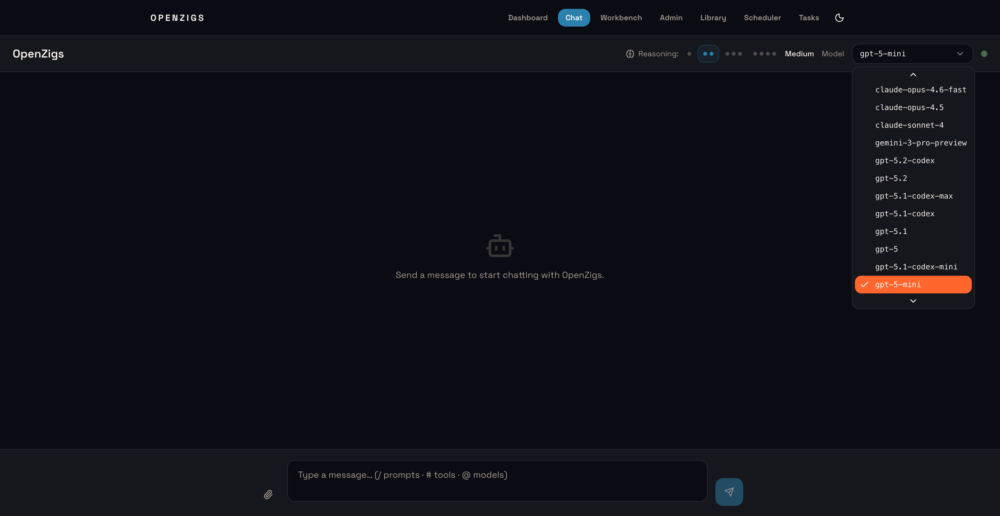

Use a reasoning model for planning, then a fast model for execution — all in one conversation.

**Chat transcript:**

```
You: I need to refactor the authentication module in my project. The code is in /home/user/project/src/auth/.
     Use high reasoning to analyze the architecture first, then generate the refactored code.

[Model: o4-mini | Reasoning: high]

Agent: I'll analyze the architecture with deep reasoning first.

     [calls read-file: /home/user/project/src/auth/index.ts]
     [calls list-directory: /home/user/project/src/auth/]
     [calls read-file: /home/user/project/src/auth/middleware.ts]

     Analysis complete. The current auth module has three issues:
     1. Token validation is duplicated across 4 files
     2. The session store uses synchronous file I/O
     3. Rate limiting is hardcoded instead of configurable

     I'll now spawn a coding agent with gpt-4.1 to implement the refactored code
     based on this analysis.

     [calls spawn-agent:
       goal: "Refactor the auth module at /home/user/project/src/auth/ based on
              the following analysis: (1) Extract token validation into a shared
              validateToken() utility, (2) Replace sync file I/O with async
              session store, (3) Make rate limiting configurable via config.json"
       model: "gpt-4.1"
       notify_user: true
     ]

     Background task started. The coding agent (gpt-4.1) is implementing the
     refactored code. You'll be notified when it completes.
```

**What's happening:**

| Step | Model | Reasoning | Purpose |
|------|-------|-----------|---------|
| 1. Architecture analysis | `o4-mini` | `high` | Deep reasoning identifies structural problems |
| 2. Code generation | `gpt-4.1` | *(default)* | Fast, cost-efficient code output via `spawn-agent` |

**Key takeaway:** Select `o4-mini` with high reasoning in the Chat UI for the analysis phase, then let the agent delegate to `gpt-4.1` for the implementation. You get the best of both models.

---

### Example 2: Prompt Templates Calling Other Prompts

Compose reusable prompt templates that chain together via the LLM's tool-calling loop. Each prompt can target a different model.

**Step 1 — Create the building-block prompts in the Library:**

| Prompt Name | Content | Preferred Tools |
|-------------|---------|-----------------|
| `research-topic` | `Research the topic "{{topic}}" thoroughly. Find at least 5 credible sources and summarize key findings with citations.` | `web-search`, `browser-navigate` |
| `write-article` | `Write a {{length}}-word article about the following research:\n\n{{research}}\n\nUse a {{tone}} tone. Include an introduction, 3-5 sections with subheadings, and a conclusion.` | `read-file`, `write-file` |
| `review-content` | `Review the following article for factual accuracy, grammar, and readability. Provide specific suggestions:\n\n{{content}}` | `read-file` |

**Step 2 — Use the chain in Chat:**

```
You: I need a blog post about quantum computing breakthroughs in 2025.
     First, run the prompt "research-topic" with topic="quantum computing
     breakthroughs 2025". Then take that output and run "write-article"
     with length=1500 and tone=conversational. Finally, run "review-content"
     on the result.

Agent: I'll chain these prompts together.

     [calls run-prompt: name="research-topic",
      variables={"topic": "quantum computing breakthroughs 2025"}]

     Research complete. Key findings from 5 sources: ...

     [calls run-prompt: name="write-article",
      variables={"research": "<research output>", "length": "1500",
                  "tone": "conversational"}]

     Article drafted (1,487 words). Writing to file...

     [calls write-file: /home/user/blog/quantum-2025.md]

     [calls run-prompt: name="review-content",
      variables={"content": "<article text>"}]

     Review complete:
     - ✅ Factually accurate (all claims verified against sources)
     - ⚠️ Paragraph 3 could be split for readability
     - ⚠️ Consider adding a concrete example in the "Error Correction" section
```

**Step 3 — Automate the chain with a scheduled job:**

Create a scheduled job in the Scheduler UI that runs this workflow automatically:

| Field | Value |
|-------|-------|
| **Name** | `weekly-blog-research` |
| **Cron** | `0 9 * * 1` (Monday 9 AM) |
| **Action** | Prompt |
| **Prompt** | See below |
| **Model** | `gpt-4.1` |
| **Auto-Approve Tools** | `web-search, browser-navigate, write-file` |

**Job prompt:**

```
Run the following prompts in sequence:

1. Run prompt "research-topic" with topic="AI industry news this week"
2. Take the research output and run prompt "write-article" with
   length=2000 and tone=professional
3. Save the article to /home/user/blog/weekly-ai-digest.md
4. Run prompt "review-content" on the saved article
5. If the review finds issues, revise the article and save again

This is an autonomous job — complete all steps without human intervention.
```

**Key takeaway:** Prompts are composable building blocks. The LLM chains them by calling `run-prompt` repeatedly, passing output from one as input variables to the next. Each prompt can also carry its own `preferredTools` to scope tool access.

---

### Example 3: Multi-Model Orchestration with `orchestrate-agents`

Fan out to multiple models in parallel, each optimized for a different task, then aggregate results.

**Chat transcript:**

```
You: I'm evaluating whether to migrate our API from Express to Fastify.
     Use orchestrate-agents to research this from three angles simultaneously,
     using the best model for each task.

Agent: I'll dispatch three specialized agents in parallel.

     [calls orchestrate-agents:
       agents: [
         {
           goal: "Benchmark Express vs Fastify performance. Find recent
                  benchmarks (2024-2025), compare request throughput, latency
                  p99, and memory usage under load. Use web-search.",
           model: "gpt-4.1"
         },
         {
           goal: "Analyze the migration effort from Express to Fastify. Review
                  the codebase at /home/user/api/src/ and identify: (1) number
                  of route handlers, (2) middleware that needs rewriting,
                  (3) Express-specific patterns with no Fastify equivalent.
                  Provide an estimated effort in developer-days.",
           model: "o4-mini"
         },
         {
           goal: "Research Fastify's ecosystem maturity. Check: plugin count on
                  npm, TypeScript support quality, community activity (GitHub
                  stars, recent commits, open issues), and production adoption
                  by notable companies.",
           model: "gpt-4.1"
         }
       ],
       aggregation_prompt: "Compile the three analyses into an executive summary
         with a recommendation table: Performance | Migration Effort | Ecosystem.
         Include a final GO / NO-GO recommendation with justification.",
       timeout_seconds: 300
     ]

     ┌─────────────────────────────────────────────────────────┐
     │ Agent 1 (gpt-4.1): Performance benchmarks         ✅   │
     │ Agent 2 (o4-mini):  Migration effort analysis      ✅   │
     │ Agent 3 (gpt-4.1): Ecosystem research              ✅   │
     └─────────────────────────────────────────────────────────┘

     Executive Summary: Express → Fastify Migration Assessment

     | Dimension        | Finding                              | Score |
     |------------------|--------------------------------------|-------|
     | Performance      | 2.3x throughput improvement           | ✅ GO |
     | Migration Effort | ~12 dev-days for 47 routes            | ⚠️    |
     | Ecosystem        | 350+ plugins, excellent TS support    | ✅ GO |

     Recommendation: **GO** — Performance gains justify the 12-day investment...
```

**Why different models?**

| Agent | Model | Rationale |
|-------|-------|-----------|
| Benchmarks | `gpt-4.1` | Fast web search and data summarization |
| Migration analysis | `o4-mini` | Needs deep reasoning to analyze code patterns |
| Ecosystem research | `gpt-4.1` | Broad web research, no deep reasoning needed |

---

### Example 4: Custom Agent with Interactive Clarifications

Custom agents can ask clarifying questions before proceeding. This example shows a security audit agent that asks the user to specify scope.

**Setup — define the agent in Admin → Custom Agents:**

| Field | Value |
|-------|-------|
| **Name** | `security-auditor` |
| **Display Name** | Security Auditor |
| **Description** | Analyzes code for vulnerabilities and suggests hardening measures |
| **System Prompt** | `You are a senior security engineer. Before starting an audit, always ask the user to clarify the scope (which directories, what threat model, and compliance framework). Use the interactive clarification feature to present options.` |
| **Tools** | `read-file`, `list-directory`, `shell-execute`, `web-search` |
| **Auto-Invoke** | ✅ Enabled (`infer: true`) |

**Chat transcript:**

```
You: @security-auditor Audit the authentication code in my project at
     /home/user/project/src/

Agent (Security Auditor): Before I begin, I need to understand the scope.

     ┌─────────────────────────────────────────────────┐
     │ What compliance framework should I audit against?│
     │                                                  │
     │ ○ OWASP Top 10 (Web application security)      │
     │ ○ SOC 2 (Enterprise compliance)                 │
     │ ○ PCI DSS (Payment card industry)               │
     │ ○ Custom / General best practices               │
     │                                                  │
     │ Or type a custom framework: [____________]       │
     │                                                  │
     │                            [Submit]    ████░ 45s │
     └─────────────────────────────────────────────────┘

You: [selects "OWASP Top 10"]

Agent (Security Auditor): Auditing against OWASP Top 10. Scanning...

     [calls list-directory: /home/user/project/src/auth/]
     [calls read-file: /home/user/project/src/auth/login.ts]
     [calls read-file: /home/user/project/src/auth/session.ts]
     [calls shell-execute: grep -rn "eval\|exec\|innerHTML" src/]

     Security Audit Report — OWASP Top 10
     ─────────────────────────────────────

     🔴 A01:2021 Broken Access Control
        • session.ts:42 — No CSRF token validation on state-changing endpoints

     🟡 A02:2021 Cryptographic Failures
        • login.ts:18 — bcrypt rounds set to 8 (recommend ≥12)

     🟢 A03:2021 Injection — No issues found
     ...
```

**Key takeaway:** The `@security-auditor` mention routes to the custom agent. The `infer: true` setting means the SDK could also auto-delegate security-related questions to this agent without an explicit mention. Interactive clarifications let the agent gather structured input mid-conversation with a 60-second timeout.

---

### Example 5: File Attachments + Reasoning for Code Review

Attach files directly in the Chat UI and combine with high reasoning for thorough analysis.

**Chat transcript:**

```
[Attachments: 📎 src/api/handlers.ts  📎 src/api/middleware.ts]
[Model: o4-mini | Reasoning: high]

You: Review these two files for performance issues and race conditions.
     Focus on the database query patterns and async error handling.

Agent: Analyzing both attached files with extended reasoning...

     [Reading: src/api/handlers.ts (247 lines)]
     [Reading: src/api/middleware.ts (89 lines)]

     Performance & Concurrency Review
     ═════════════════════════════════

     🔴 Critical: Race condition in handlers.ts lines 78-92
        The `updateUserBalance()` function reads the balance, modifies it,
        and writes it back without a transaction or optimistic lock. Under
        concurrent requests, two updates can read the same stale value:

        // Current (unsafe):
        const balance = await db.getBalance(userId);
        await db.setBalance(userId, balance + amount);

        // Recommended (transaction with row lock):
        await db.transaction(async (tx) => {
          const balance = await tx.getBalance(userId, { forUpdate: true });
          await tx.setBalance(userId, balance + amount);
        });

     🟡 Performance: N+1 query in handlers.ts lines 134-148
        The user list endpoint fetches all users, then loops to fetch each
        user's profile. Replace with a JOIN or batch query.

     🟢 middleware.ts: Error handling looks correct — async errors are
        properly caught and forwarded to the error handler.
```

**How it works:**
1. Click the 📎 button in the Chat input (or drag files onto the drop zone) to attach up to 10 files.
2. Attached files are sent to the Copilot SDK as `SdkAttachment` objects — the SDK reads file contents automatically.
3. Select a reasoning model (`o4-mini`, `o3-mini`) and set reasoning effort to `high` for thorough analysis.
4. The model receives both the file contents and your prompt, combining deep reasoning with full file context.

---

### Example 6: Fully Autonomous Scheduled Pipeline

A production-ready example: a nightly data pipeline that runs without human intervention, using auto-approved tools, multi-model orchestration, and prompt templates.

**Step 1 — Create the prompts:**

| Name | Content |
|------|---------|
| `extract-metrics` | `Query the database for {{metric_type}} metrics from the last {{period}}. Use the db-query tool. Return raw JSON data.` |
| `generate-report` | `Generate a Markdown report from the following data:\n\n{{data}}\n\nInclude: executive summary, trend analysis with percentage changes, and anomaly flags for any metric that deviated >2σ from the 30-day mean. Save to {{output_path}}.` |

**Step 2 — Create the scheduled job:**

| Field | Value |
|-------|-------|
| **Name** | `nightly-metrics-pipeline` |
| **Cron** | `0 2 * * *` (2 AM daily) |
| **Model** | `gpt-4.1` |
| **Auto-Approve Tools** | `db-query, read-file, write-file, shell-execute, spawn-agent, orchestrate-agents` |

**Job prompt:**

```
You are an autonomous data pipeline agent. Execute the following steps:

1. Use orchestrate-agents to gather metrics in parallel:
   - Agent 1 (model: gpt-4.1): Run prompt "extract-metrics" with
     metric_type="revenue" and period="24 hours"
   - Agent 2 (model: gpt-4.1): Run prompt "extract-metrics" with
     metric_type="user_engagement" and period="24 hours"
   - Agent 3 (model: gpt-4.1): Run prompt "extract-metrics" with
     metric_type="system_performance" and period="24 hours"

2. Combine all three datasets and run prompt "generate-report" with
   output_path="/data/reports/daily-metrics-{{date}}.md"

3. Run shell command: git -C /data/reports add . && git commit -m
   "Daily metrics report $(date +%Y-%m-%d)" && git push

Complete all steps autonomously. Do not wait for human input.
```

**Execution flow (2:00 AM):**

```
Scheduler fires → TaskEngine.submit()
  └─ TaskWorker dequeues → LLM executes
       ├─ orchestrate-agents (3 parallel sub-agents)
       │   ├─ Agent 1: db-query → revenue data          [auto-approved]
       │   ├─ Agent 2: db-query → engagement data        [auto-approved]
       │   └─ Agent 3: db-query → performance data       [auto-approved]
       │
       ├─ run-prompt "generate-report" → Markdown report
       │   └─ write-file → /data/reports/daily-metrics-2025-07-15.md
       │                                                 [auto-approved]
       │
       └─ shell-execute → git add, commit, push          [auto-approved]
```

**Key features used:**
- **Auto-approved tools**: `db-query`, `write-file`, and `shell-execute` bypass the approval queue — the audit log records each as `tool_auto_approved`.
- **Prompt templates**: Reusable `extract-metrics` and `generate-report` prompts keep the job definition clean.
- **Multi-agent parallel execution**: Three data extraction agents run concurrently for speed.
- **Autonomous end-to-end**: No human in the loop — ideal for off-hours pipelines.

---

### Example 7: BYOK Provider with Local Ollama for Private Data

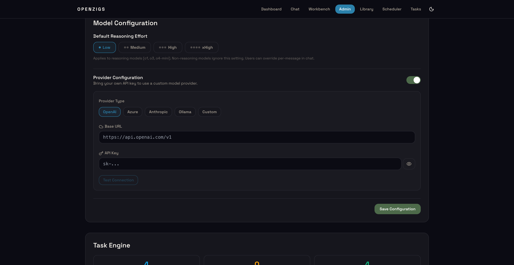

Run sensitive workloads entirely on your local network using Ollama, then switch back to Copilot for general tasks.

**Step 1 — Configure Ollama in Admin → Model Configuration:**

| Field | Value |
|-------|-------|
| **Provider** | Ollama |
| **Base URL** | `http://localhost:11434` |
| **API Key** | *(leave blank — Ollama doesn't require one)* |

Click **Test Connection** to verify Ollama is reachable, then **Save**.

**Step 2 — Chat with your private data:**

```
[Provider badge shows: 🏷️ Ollama]
[Attachments: 📎 /data/confidential/q2-financials.xlsx]

You: Analyze these Q2 financial results. Identify the three highest-growth
     product lines and flag any revenue anomalies.

Agent (via Ollama - llama3.3): Analyzing Q2 financial data locally...

     [calls convert-to-markdown: /data/confidential/q2-financials.xlsx]
     [calls read-file: converted output]

     Q2 Financial Analysis
     ═════════════════════

     Top 3 Growth Product Lines:
     1. Cloud Services: +34% QoQ ($12.4M → $16.6M)
     2. API Platform: +28% QoQ ($8.1M → $10.4M)
     3. Enterprise Support: +19% QoQ ($5.2M → $6.2M)

     ⚠️ Anomaly: Hardware division revenue dropped 42% — investigate
     potential reporting error or delayed shipments.
```

**Step 3 — Switch back to Copilot for non-sensitive work:**

Navigate to Admin → Model Configuration → click **Clear Provider** to revert to GitHub Copilot. The provider badge disappears, and subsequent messages route through the Copilot SDK.

**Key takeaway:** BYOK providers let you keep sensitive data processing on-premises while still using Copilot for general-purpose tasks. Switch providers at runtime — no restart required. All cached SDK sessions are cleared on provider change.

---

### Example 8: Session Continuity with Infinite Context

Long-running research sessions that survive context window limits and server restarts.

**Chat transcript (over several hours):**

```
[Session: abc-123 | Context: ░░░░░░░░░░ 12% | Turns: 1 | Age: just now]

You: Let's research the history of type systems in programming languages.
     Start with the lambda calculus foundations.

Agent: The formal foundations begin with Alonzo Church's lambda calculus
       in the 1930s...

     [... 45 minutes of deep conversation, reading papers, taking notes ...]

[Session: abc-123 | Context: ████████░░ 82% | Turns: 34 | Age: 47m]
[🔄 Compacting context in background...]
[✅ Context compacted]

[Session: abc-123 | Context: ████░░░░░░ 38% | Turns: 34 | Age: 48m]

You: Now compare the type systems of Haskell, Rust, and TypeScript
     based on everything we've discussed.

Agent: Drawing from our earlier discussion of the Hindley-Milner
       foundations and the evolution through ML and System F...

     [The agent retains the full thread of the conversation despite
      the context window being compacted — key concepts and findings
      are preserved while verbose intermediate steps are summarized]
```

**What's happening behind the scenes:**

| Event | Context Usage | Action |
|-------|--------------|--------|
| Conversation starts | 0% | New SDK session created |
| Turn 20 | 60% | Normal operation |
| Turn 30 | 80% | Background compaction threshold reached — SDK compacts older context |
| Post-compaction | ~38% | Older turns summarized, recent turns preserved verbatim |
| Turn 50 | 75% | Conversation continues naturally |
| Turn 60 | 80% | Another compaction cycle |

**Session resumption after restart:**

```
[Server restarts]
[Session: abc-123 | Resumed ✅ | Context: 42% | Turns: 60]

You: Where were we? Can you summarize what we covered about
     dependent types?

Agent: In our earlier discussion, we covered dependent types in the
       context of Idris and Agda...
```

The SDK's `resumeSession()` API restores the session state. If the session has expired, a new session is created — the JSONL audit log preserves the conversation history for reference.

---

### Example 9: Custom Agent with its Own MCP Server

Define a custom agent that brings its own tools via a dedicated MCP server — useful for domain-specific tooling.

**Configuration (Admin → Custom Agents or `~/.openzigs/config.json`):**

```json
{
  "copilot": {
    "customAgents": [
      {
        "name": "k8s-ops",
        "displayName": "Kubernetes Ops Agent",
        "description": "Manages Kubernetes clusters with kubectl and helm",
        "prompt": "You are a Kubernetes operations expert. Use your dedicated k8s tools (via your MCP server) and the standard shell tools to manage clusters. Always check current state before making changes. Explain what you're about to do before executing destructive operations.",
        "tools": ["shell-execute", "read-file"],
        "infer": true,
        "mcpServers": {
          "kubectl-mcp": {
            "type": "stdio",
            "command": "npx",
            "args": ["-y", "@example/kubectl-mcp-server"],
            "env": {
              "KUBECONFIG": "/home/user/.kube/config"
            }
          }
        }
      }
    ]
  }
}
```

**Chat transcript:**

```
You: @k8s-ops What pods are failing in the production namespace?

Agent (Kubernetes Ops): Checking pod status in production...

     [calls kubectl-get-pods: namespace=production, status=Failed]

     3 pods are in a failing state:

     | Pod | Status | Restarts | Last Error |
     |-----|--------|----------|------------|
     | api-server-7b4d | CrashLoopBackOff | 12 | OOMKilled |
     | worker-3a1c | Error | 3 | Exit code 137 |
     | cache-9f2e | ImagePullBackOff | 0 | Image not found |

     The api-server and worker pods are running out of memory.
     The cache pod has an image reference issue.

     Want me to investigate the resource limits, or should I fix
     the image reference for the cache pod first?
```

**Key takeaway:** The `mcpServers` field on a custom agent gives it access to tools that only that agent can use — other agents and the primary model don't see them. This keeps the tool namespace clean and lets you create purpose-built agents with specialized tooling.

---

### Quick Reference: Feature Combinations

| I want to... | Features to combine |
|---|---|
| Analyze code deeply, then generate fixes cheaply | Reasoning model (`o4-mini`, high effort) → `spawn-agent` with `gpt-4.1` |
| Run a multi-source research report on a schedule | Scheduler + `orchestrate-agents` + auto-approve tools |
| Chain reusable prompt templates | Library prompts + `run-prompt` tool (LLM calls it sequentially) |
| Process sensitive data locally | BYOK Ollama provider + file attachments |
| Create a domain expert agent | Custom agent + dedicated MCP server + specific tool allowlist |
| Never lose context in long sessions | Infinite sessions (enabled by default) + session context bar monitoring |
| Get structured input during a workflow | Interactive clarifications (choices + free-text + 60s timeout) |
| Review files without copy-pasting | File attachments (📎 button or drag-and-drop) + reasoning model |
| Run a nightly pipeline end-to-end | Scheduler + prompt chaining + `orchestrate-agents` + auto-approve |
| Delegate automatically to specialists | Custom agents with `infer: true` |

---

## AI-Assisted Configuration (Workflow Wizard)

OpenZigs includes a **Workflow Wizard** — an interactive conversational assistant that guides you step-by-step through creating prompts, scheduled jobs, webhooks, and custom agents.

### How It Works

1. **Start** — In the Chat, describe what you want to create. The AI detects intent and activates the Wizard persona.
2. **Guided Questions** — The Wizard asks one question at a time, suggesting sensible defaults.
3. **Preview Card** — Once all details are gathered, a structured **Workflow Preview Card** appears in the chat showing the complete configuration.
4. **Confirm / Edit / Test Run** — Click **Confirm** to save, **Edit** to change a field, or **Test Run** (for scheduled jobs) to preview what would happen without executing.

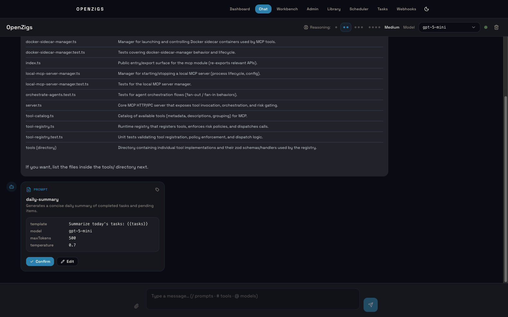

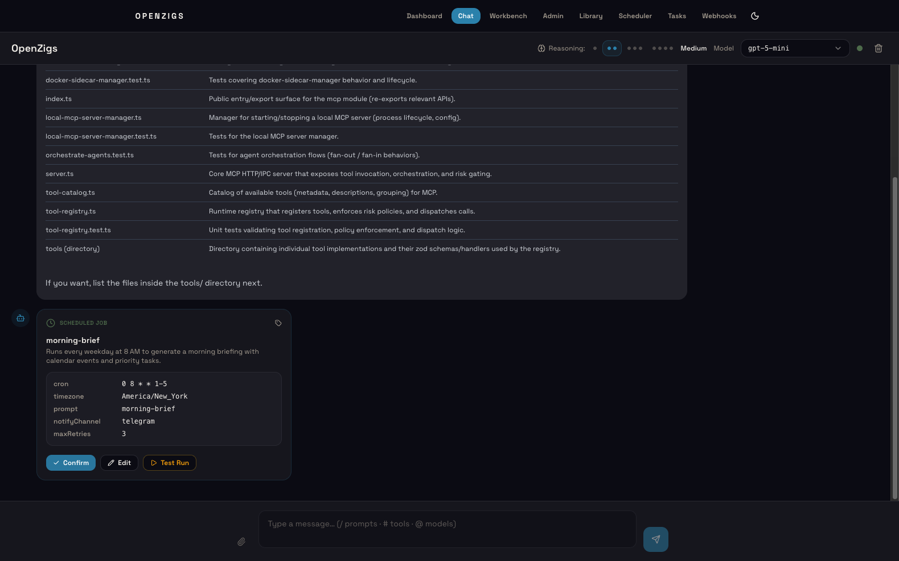

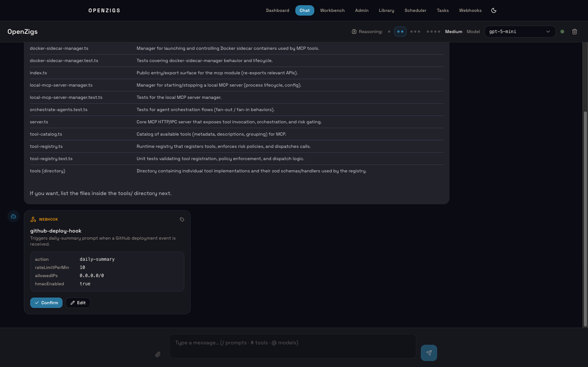

### Preview Card Actions

| Action | Description |
|---|---|
| **Confirm** | Persists the configuration (creates the prompt, job, webhook, or agent). |
| **Edit** | Returns to the conversation so you can change specific fields. |
| **Test Run** | (Scheduled jobs only) Shows a dry-run preview of the job's output. |

### The `create-prompt` Tool

A dedicated MCP tool for creating prompt templates with duplicate-name protection:

```
Tool: create-prompt (risk: high)
Inputs:
  name        — Unique prompt name
  content     — Prompt template with {{variable}} placeholders
  description — Optional description
  tags        — Optional tag array
  variables   — Optional variable metadata array
  systemPrompt — When true, adds "system-prompt" tag
```

Unlike the existing `save-prompt` (which is an upsert), `create-prompt` rejects duplicate names to prevent accidental overwrites during wizard flows.

### The `workflow-wizard` Tool

The AI uses this tool to present structured preview cards:

```
Tool: workflow-wizard (risk: low)
Inputs:
  type    — "prompt" | "scheduled-job" | "webhook" | "agent"
  name    — Human-readable name
  summary — One-line description
  config  — Key-value configuration to preview
```

---

## Dry-Run & Job Testing

Before running a scheduled job for real, you can test it safely with dry-run mode.

### Dry Run from the UI

Each job card in the **Scheduler** page now has a **🧪 Dry Run** button alongside the existing **▶ Run** button. Clicking it shows a preview panel below the job card with exactly what the job would do — without executing anything or incrementing run counts.

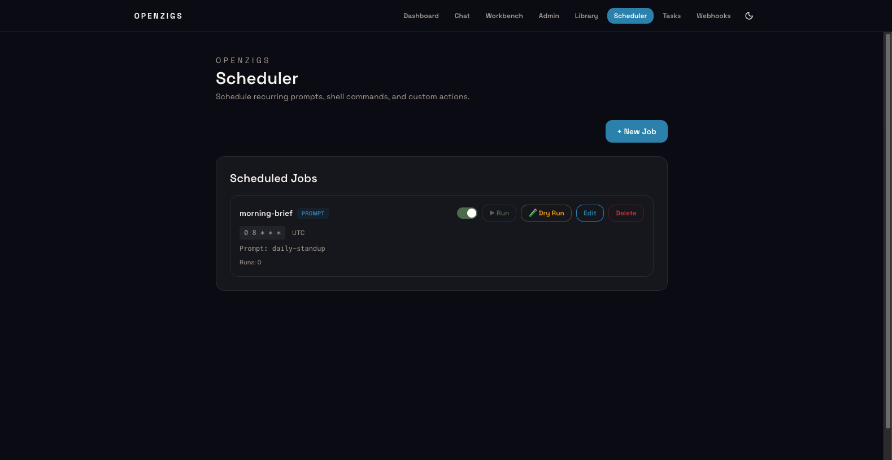

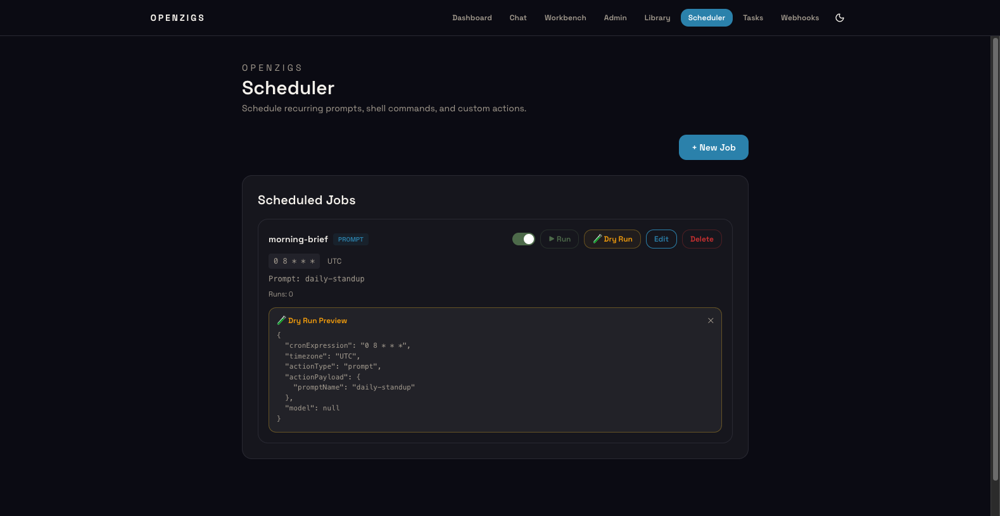

### Dry Run via MCP Tools

Two MCP tools support dry-run workflows:

**`schedule-job` with `dry_run: true`**
```json
{
  "name": "nightly-report",
  "cronExpression": "0 22 * * *",
  "actionType": "prompt",
  "actionPayload": { "promptName": "daily-summary" },
  "dry_run": true
}
```
Returns a preview of the job configuration without saving it.

**`test-job`**
```json
{ "id": "job-abc123" }
```
Takes an existing job ID and returns a dry-run preview of its current configuration.

### Dry Run via API

```bash
curl -X POST http://localhost:3000/api/admin/jobs/JOB_ID/run?dry_run=true \
  -H "Authorization: Bearer YOUR_TOKEN"
```

Returns the job preview JSON without triggering execution.

---

## Enterprise Webhooks

Webhooks let external systems (CI/CD, monitoring, third-party services) trigger OpenZigs actions via HTTP POST requests.

### Creating a Webhook

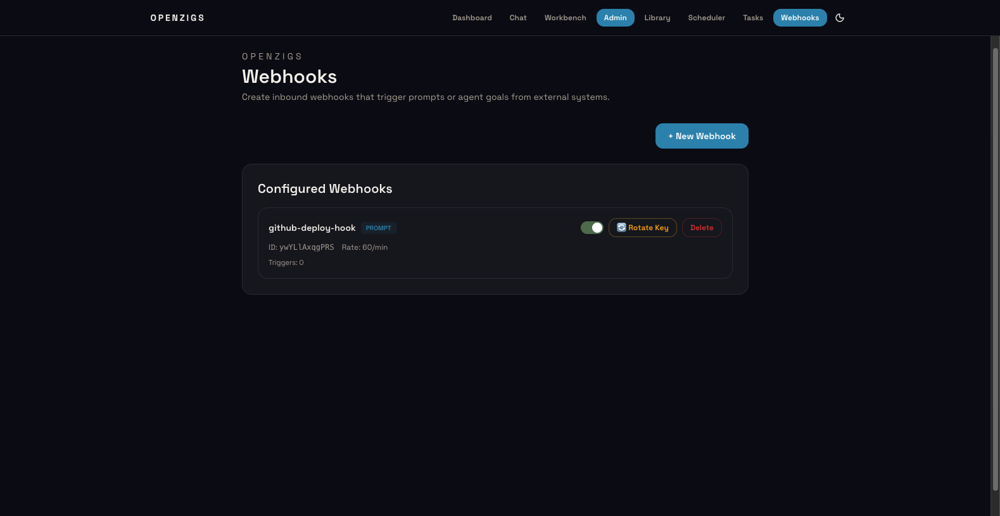

1. Navigate to **Admin → Webhooks** (or `/admin/webhooks`).
2. Click **+ New Webhook**.
3. Configure:
   - **Name** — Descriptive label (e.g., `github-deploy-hook`).
   - **Action** — `prompt` (executes a saved prompt) or `goal` (sends a natural-language goal to the agent).
   - **Prompt Name** or **Goal** — The target action.
   - **Rate Limit** — Max requests per minute (default: 60).
   - **Allowed IPs** — Optional comma-separated IP allowlist.
4. Click **Create Webhook**.

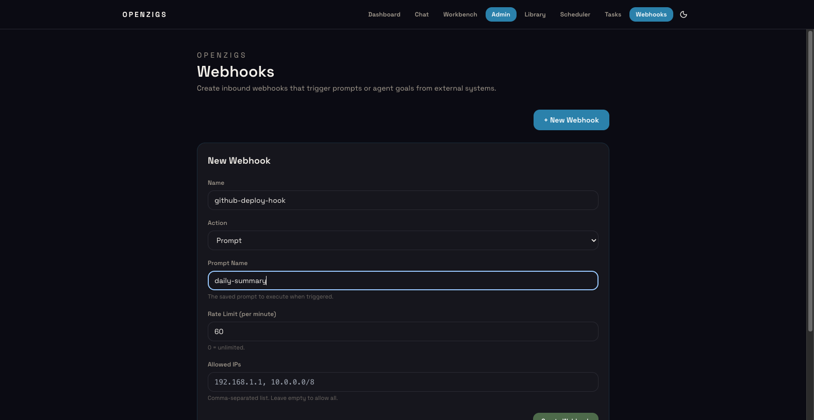

5. **Save the API key** — it's shown only once.

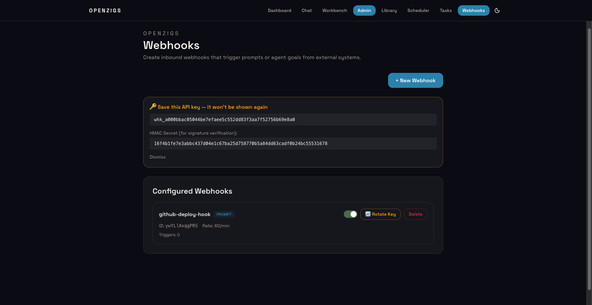

### Triggering a Webhook

```bash
curl -X POST http://localhost:3000/api/webhooks/trigger \
  -H "Authorization: Bearer whk_YOUR_API_KEY" \
  -H "Content-Type: application/json" \
  -d '{"topic": "deployment", "environment": "production"}'
```

The JSON body is passed as prompt variables (for `prompt` actions) or task context (for `goal` actions).

### Authentication Methods

| Method | Headers Required |
|---|---|
| **Bearer Token** | `Authorization: Bearer whk_...` |
| **HMAC Signature** | `X-Webhook-Id: WEBHOOK_ID` + `X-Webhook-Signature: SHA256_HEX` |

### Security Features

- **API Key Hashing** — Keys are stored as SHA-256 hashes; plaintext is never persisted.
- **Timing-Safe Comparison** — Prevents timing attacks on key/signature validation.
- **IP Allowlisting** — Restrict which IPs can trigger the webhook.
- **Rate Limiting** — Per-webhook rate limits (default 60/min).
- **Key Rotation** — Rotate API keys from the UI without deleting the webhook.

### Managing Webhooks

| Action | UI | API |
|---|---|---|
| List all | Webhooks page | `GET /api/admin/webhooks` |
| Create | + New Webhook form | `POST /api/admin/webhooks` |
| Toggle | Toggle switch | `POST /api/admin/webhooks/:id/toggle` |
| Rotate key | 🔄 Rotate Key button | `POST /api/admin/webhooks/:id/rotate-key` |
| Delete | Delete button | `DELETE /api/admin/webhooks/:id` |

---

## Self-Aware Documentation

The AI can answer questions about OpenZigs itself — its architecture, configuration, tools, and features — using the built-in documentation tools.

### How It Works

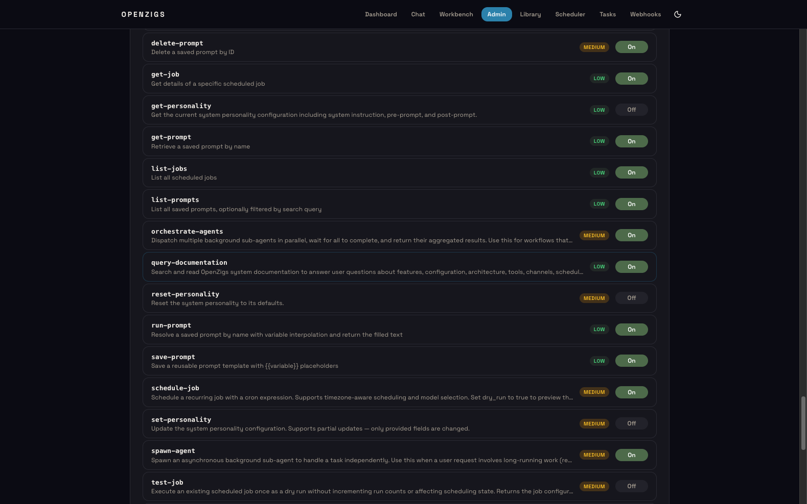

The `query-documentation` tool searches the project's markdown documentation and JSON config files by topic keyword. The AI can find relevant sections from:

- **ARCHITECTURE.md** — System design, tool catalog, security model.
- **USER_GUIDE.md** — Usage instructions, configuration reference.
- **TELEGRAM_SETUP.md** — Channel setup guides.
- **default.json / tools.json** — Configuration files.

### Example Questions

- *"How do tool risk levels work?"*
- *"What's the architecture of the approval queue?"*
- *"How do I configure Telegram?"*
- *"What MCP tools are available?"*

### Documentation Expert Agent

A custom agent named `documentation-expert` is pre-configured in `config/agents.json` with `infer: true`. When the AI detects a question about OpenZigs itself, it can automatically delegate to this specialist agent.

---

## Sentinel — Autonomous System Monitor

Sentinel is a background daemon that continuously monitors the health of your OpenZigs instance. It watches task success rates, detects stuck or slow tasks, audits prompt quality, and delivers daily digest reports — all without manual intervention.

### Enabling Sentinel

Sentinel is disabled by default. Enable it in the Admin panel or in your config:

```json
{
  "sentinel": {
    "enabled": true
  }
}
```

Or toggle it live from the Admin UI:

1. Navigate to **Admin** → **Sentinel Monitor**
2. Click **Enable**

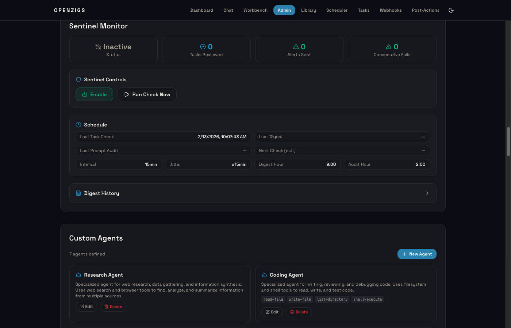

### What Sentinel Monitors

- **Task health**: Success rates, consecutive failures, queue depth
- **Orphaned tasks**: Tasks running longer than 30 minutes
- **Slow tasks**: Tasks that took longer than 5 minutes
- **Prompt quality**: Samples recent user prompts and scores them for clarity and token efficiency

### Alerts

Sentinel generates real-time alerts delivered via Socket.IO to the Admin UI:

| Alert | Priority | Description |
|---|---|---|
| Consecutive Failures | Critical | 3+ tasks failed in a row |
| Queue Depth | Warning | Task queue exceeds 10 items |
| Orphaned Task | Warning | A task has been running > 30 min |
| Success Rate Drop | Critical | Success rate below 50% |

Alerts include automatic deduplication — critical alerts have a configurable cooldown (default: 5 minutes for critical, 30 minutes for warnings).

#### Multi-Channel Alert Routing

Alerts can be sent to multiple channels simultaneously. By default, alerts go to the Admin UI (`"admin"` channel). You can add external messaging channels:

```json
{
  "sentinel": {
    "notifyChannels": ["admin", "telegram", "discord"],
    "criticalCooldownMinutes": 5,
    "warningCooldownMinutes": 30
  }
}
```

- **`admin`**: Socket.IO to the web dashboard (always recommended)
- **External channels** (e.g., `telegram`, `discord`): Only **critical** alerts are routed to external channels to avoid notification fatigue
- Cooldown timers are per-alert-type and configurable at runtime

### Daily Digest

Once per day (default 9:00 AM), Sentinel generates a summary of:

- Tasks completed, failed, and cancelled
- Overall success rate
- Token burn analysis (total, average per task, top consumer)
- Prompt quality scores (if audit ran)
- **Per-prompt recommendations** with improvement suggestions and rewrites
- Alert count for the period

View past digests in the **Admin** → **Sentinel Monitor** → **Digest History** section. Each digest card shows an expandable **Prompt Improvements** section with score badges (🟢 ≥8, 🟡 ≥5, 🔴 <5), specific suggestions, and suggested rewrites for low-scoring prompts.

#### Downloading Digests

Click the **Download** button in the Digest History section to download the latest digest as a Markdown file. This file is also auto-generated at `~/.openzigs/sentinel/status.md` when `persistMarkdownDigest` is enabled (default: `true`).

```bash
# Or fetch via API
curl http://localhost:3001/api/admin/sentinel/digest-markdown -o sentinel-digest.md
```

#### Digest Retention

Old digest entries are automatically pruned. Configure the retention window with `digestRetentionDays` (default: 30 days).

### Scheduler Configuration

Sentinel uses node-cron v4 with support for timezone-aware scheduling and overlap prevention:

```json
{
  "sentinel": {
    "timezone": "America/New_York",
    "noOverlap": true,
    "maxRandomDelayMs": 5000
  }
}
```

- **`timezone`**: IANA timezone for cron schedules (default: `"UTC"`)
- **`noOverlap`**: Prevents a cron job from firing if the previous execution is still running (default: `true`)
- **`maxRandomDelayMs`**: Native cron jitter in milliseconds (0 disables native jitter; uses manual jitter via `jitterMinutes` instead)

### Running a Check Manually

Click **Run Check Now** in the Sentinel panel, or use the API:

```bash
curl -X POST http://localhost:3001/api/admin/sentinel/run-now
```

### Configuration Options

| Key | Default | Description |
|---|---|---|
| `enabled` | `false` | Enable/disable Sentinel |
| `model` | `gpt-4o-mini` | Model used for prompt audits |
| `checkIntervalMinutes` | `15` | How often to run task health checks |
| `jitterMinutes` | `15` | Random delay (up to N minutes) added after each check interval |
| `digestHour` | `9` | Hour of day (0-23) for daily digest |
| `auditHour` | `2` | Hour of day (0-23) for prompt audit |
| `consecutiveFailureThreshold` | `3` | Failures before critical alert |
| `queueDepthThreshold` | `10` | Queue depth before warning |
| `persistMarkdownDigest` | `true` | Write digest to `status.md` file |
| `markdownDigestPath` | `null` | Custom path for `status.md` (default: `~/.openzigs/sentinel/status.md`) |
| `digestRetentionDays` | `30` | Days to keep digest history before pruning |
| `notifyChannels` | `["admin"]` | Channels to send alerts to (`"admin"`, `"telegram"`, `"discord"`, etc.) |
| `criticalCooldownMinutes` | `5` | Deduplication cooldown for critical alerts |
| `warningCooldownMinutes` | `30` | Deduplication cooldown for warning alerts |
| `timezone` | `"UTC"` | IANA timezone for cron schedules |
| `noOverlap` | `true` | Prevent overlapping cron executions |
| `maxRandomDelayMs` | `0` | Native cron jitter in milliseconds (0 = use manual jitter) |

---

## Knowledge Manager — Local Knowledge Base (RAG)

The Knowledge Manager provides a **Retrieval-Augmented Generation (RAG)** pipeline that indexes local files (Markdown, code, text, JSON, etc.) into an embedded vector database and exposes them to the AI via the `search-knowledge` tool. This lets the AI ground its responses in your own documentation, notes, and code — without sending anything to external services.

### How It Works

1. **Ingest**: Files in your knowledge directory (`~/.openzigs/knowledge/` by default) are scanned, chunked, and embedded.
2. **Watch**: A file watcher (chokidar) detects changes, additions, and deletions in real time.
3. **Search**: The `search-knowledge` MCP tool performs semantic vector search against the index.
4. **Dedup**: Content hashing (SHA-256) ensures unchanged files are not re-indexed.

### Setting Up the Knowledge Directory

Create the knowledge directory and drop files into it:

```bash
mkdir -p ~/.openzigs/knowledge
# Copy your docs, notes, code snippets, etc.
cp -r ~/my-project/docs ~/.openzigs/knowledge/
cp ~/notes/*.md ~/.openzigs/knowledge/
```

The service automatically indexes all supported files on startup and watches for changes.

### Supported File Types

| Extension | Source Type |
|---|---|
| `.md` | Markdown |
| `.txt` | Text |
| `.pdf` | PDF (text + OCR fallback for scanned PDFs) |
| `.docx` | Word document (DOCX) |
| `.xlsx`, `.xls` | Excel spreadsheet |
| `.jpg`, `.jpeg`, `.png`, `.tiff`, `.tif`, `.bmp`, `.webp`, `.gif` | Image OCR |
| `.mp4`, `.mp3`, `.wav`, `.m4a`, `.webm`, `.ogg`, `.flac` | Media transcription |
| `.json` | JSON |
| `.csv` | CSV |
| `.html` | HTML |
| `.py` | Code (Python) |
| `.ts`, `.js` | Code (TypeScript/JavaScript) |
| `.go` | Code (Go) |
| `.rs` | Code (Rust) |
| `.java` | Code (Java) |
| `.c`, `.cpp`, `.h` | Code (C/C++) |
| `.rb` | Code (Ruby) |
| `.sh`, `.bash` | Code (Shell) |
| `.yaml`, `.yml` | YAML |
| `.toml` | TOML |
| `.xml` | XML |
| `.sql` | SQL |
| `.r` | Code (R) |
| `.swift` | Code (Swift) |
| `.kt` | Code (Kotlin) |

If **Media** appears as unavailable in the Converters tab, the usual causes are:

1. `ffmpeg` is not installed or not on `PATH`.
2. `whisper-node` model files are missing.

For local development, run:

```bash
pnpm exec whisper-node download
```

### Using the `search-knowledge` Tool

The `search-knowledge` tool is **always-on** — the AI can use it in any conversation without explicit enabling. It accepts:

- **`query`** (required): Natural language search query
- **`limit`** (optional): Maximum results to return (default: 10)
- **`mode`** (optional): Search strategy — `"hybrid"` (default), `"vector"` (semantic only), or `"fts"` (keyword only)

**Search modes explained:**

| Mode | When to Use |
|---|---|
| **`hybrid`** (default) | Best for most queries. Combines semantic understanding with exact keyword matching via reciprocal rank fusion. Results appearing in both vector and FTS results get a relevance boost. |
| **`vector`** | Conceptual queries where you want semantically similar content, even if it doesn't share exact keywords. Example: "how does authentication work?" |
| **`fts`** | Exact keyword searches for specific terms, function names, or error messages. Example: "CORS_ALLOWED_ORIGINS", "handleAuthCallback" |

Example AI interaction:

> **You**: What does our deployment guide say about rollback procedures?
>
> **AI**: *(automatically calls search-knowledge with "deployment rollback procedures")* Based on your knowledge base, the deployment guide at `docs/deployment.md` describes the following rollback procedure…

### Knowledge Manager UI

Navigate to **Knowledge** in the top nav bar to access the Knowledge Manager page.

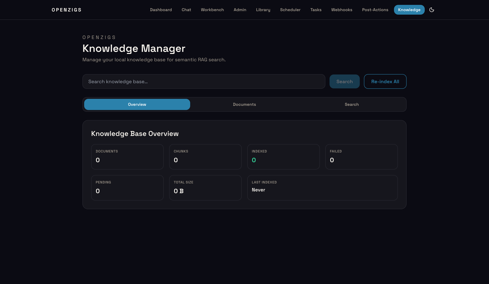

#### Overview Tab

Displays index statistics:

- **Total Documents**: Number of indexed files
- **Total Chunks**: Number of text chunks in the vector database
- **Source Types**: Breakdown of indexed file types

#### Documents Tab

Lists all indexed documents with:

- File path, source type, chunk count, and last-indexed timestamp
- **Re-index** button per document to force re-ingestion
- **Remove** button to delete a document from the index
- **Re-index All** button to rebuild the entire index

#### Search Tab

Interactive semantic search interface:

1. Enter a natural language query
2. View ranked results with relevance scores (percentage badges)
3. Each result shows the source file, heading context, and matching text chunk

### API Endpoints

All knowledge endpoints are under `/api/admin/knowledge`:

| Method | Path | Description |
|---|---|---|
| `GET` | `/stats` | Index statistics (documents, chunks, source types) |
| `GET` | `/documents` | List all indexed documents |
| `POST` | `/search` | Semantic search (`{ "query": "...", "limit": 10 }`) |
| `POST` | `/reindex` | Re-index all documents |
| `POST` | `/reindex/:documentId` | Re-index a specific document |
| `DELETE` | `/documents/:documentId` | Remove a document from the index |
| `GET` | `/config` | Current knowledge configuration |
| `PUT` | `/config` | Update knowledge configuration (`directory`, `watchEnabled`, `mediaModel`, `searchMode`, `minScore`) |

### Configuration Options

You can change the knowledge directory, search mode, and other settings from the Admin UI:

1. Navigate to **Admin** → **Knowledge Base**
2. Update settings:
   - **Knowledge Directory** — path to watch for files
   - **Live File Watching** — enable/disable real-time change detection
   - **Whisper Model** — audio/video transcription quality (tiny.en → large-v1)
   - **Search Mode** — hybrid (recommended), vector, or full-text
   - **Minimum Score Threshold** — filter out low-relevance results (slider, 0–100%)
3. Click **Save**

Changes apply immediately (no server restart required). When the directory changes, OpenZigs clears the current index and re-scans the new directory.

Configure the knowledge base in your config file (`~/.openzigs/config.json`):

```json
{
  "knowledge": {
    "directory": "~/.openzigs/knowledge",
    "chunkSize": 1000,
    "chunkOverlap": 200,
    "maxResults": 10,
    "watchEnabled": true,
    "mediaModel": "base.en",
    "searchMode": "hybrid",
    "minScore": 0.25
  }
}
```

| Key | Default | Description |
|---|---|---|
| `directory` | `~/.openzigs/knowledge` | Directory to watch and index |
| `chunkSize` | `1000` | Maximum characters per text chunk |
| `chunkOverlap` | `200` | Character overlap between consecutive chunks |
| `maxResults` | `10` | Default number of search results |
| `watchEnabled` | `true` | Enable real-time file watching |
| `mediaModel` | `"base.en"` | Whisper model for audio/video transcription |
| `searchMode` | `"hybrid"` | Default search mode: `"vector"`, `"fts"`, or `"hybrid"` |
| `minScore` | `0.25` | Minimum similarity score (0–1) to include in results. 0 = no threshold. |

### Architecture Notes

- **Embedding**: Uses Hugging Face Transformers.js with the `all-MiniLM-L6-v2` sentence transformer (~23MB, 384-dimensional vectors). Falls back to deterministic FNV-1a hashing if the model fails to load.
- **Vector Store**: [LanceDB](https://lancedb.com/) embedded database stored at `~/.openzigs/knowledge-db/` with both IVF-PQ vector index and native FTS index.
- **Hybrid Search**: Default mode combines vector (semantic) and full-text (keyword) search using Reciprocal Rank Fusion (k=60). Results in both lists get a score boost.
- **Chunking**: Markdown-aware splitting that preserves heading context. Headings are extracted and stored as metadata for each chunk.
- **Change Detection**: SHA-256 content hashing — files are only re-indexed when their content actually changes. Document metadata is persisted to disk so the hash check survives server restarts.

---

## Troubleshooting

| Symptom | Likely Cause | Fix |
|---|---|---|
| "GITHUB_CLIENT_ID is required" | Missing env var. | Add `GITHUB_CLIENT_ID` to `.env`. |
| Model selector is empty | SDK not authenticated. | Run `pnpm setup` to complete device auth. |
| "Connection refused" from browser-read | Chrome not running with `--remote-debugging-port`. | Launch Chrome with the flag. See [Chrome DevTools Setup](#chrome-devtools-setup). |
| "Shell command not allowed" | Command not in allowlist. | Add the command to the shell tool's allowlist in the tool catalog. |
| Telegram bot not responding | Token missing or tunnel not running. | Check `TELEGRAM_BOT_TOKEN` and ensure the `tunnel` Docker service is running (`docker compose up -d tunnel`). |
| "Unauthorized" on API calls | Missing or invalid auth token. | Include `Authorization: Bearer <token>` header. The token is in `~/.openzigs/config.json`. |
| Social media tool returns "ECONNREFUSED" | MCP sidecar container not running. | Start the relevant sidecar: `docker compose up -d linkedin-mcp-server`. |
| Scheduled job not firing | Scheduler not started or job disabled. | Check job status with `list-jobs` tool or `GET /api/jobs`. Ensure `enabled: true`. |
| "fetch failed" on Word/Calendar tools | Word or Calendar MCP sidecar not reachable. | Verify the sidecar is running: `docker compose ps word-mcp-server`. |
| Gmail auth errors | Missing or expired OAuth credentials. | Re-run `npx @gongrzhe/server-gmail-autoauth-mcp auth`. Ensure `gcp-oauth.keys.json` is in `~/.gmail-mcp/`. |
| `db-query` returns "connection refused" | Database MCP server not running or JDBC_URL incorrect. | Check `JDBC_URL` env var and ensure the database is reachable from Docker. |
| GitHub tools return 401 | Invalid or expired PAT. | Regenerate your GitHub Personal Access Token and update `GITHUB_PERSONAL_ACCESS_TOKEN`. |
| Agent not using expected tools | `maxToolsPerRequest` too low; tool got excluded. | Increase the tool limit in Admin → Task Engine → Tool Limit slider or via `PUT /api/admin/session/config`. Check if the tool should be added to ALWAYS_ON_TOOLS. |
| Model hallucinating tool calls | Too many tools sent, or model calling a tool that was excluded. | Reduce `maxToolsPerRequest` or switch to a stronger model (e.g., `gpt-4.1`). |
| MarkItDown returns empty content | File not accessible inside container. | Ensure the file path is within the mounted volume (`/workdir` inside the container). |
