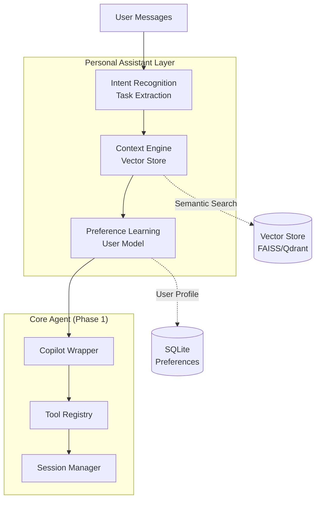

# Epic 2: Personal Assistant Core

**Status:** Planned  
**Target:** Q2 2026  
**Priority:** High

## Overview

Transform OpenZigs from a reactive agent into a proactive Personal Assistant with contextual awareness, task detection, and preference learning capabilities.

## Execution Order

| Phase | Issue | Title | Blocks |
|-------|-------|-------|--------|
| 2.1 | TBD | Contextual Memory System | 2.2, 2.3 |
| 2.2 | TBD | Proactive Task Detection | 2.3 |
| 2.3 | TBD | Preference Learning Engine | - |

## Architecture

## Sub-Issues

### Phase 2.1: Contextual Memory System

- [ ] Vector store integration (FAISS or Qdrant)
- [ ] User preference storage (SQLite schema)
- [ ] Memory injection pipeline
- [ ] Privacy controls (forget commands, retention)

### Phase 2.2: Proactive Task Detection

- [ ] Intent recognition engine
- [ ] Task suggestion UI
- [ ] Calendar integration
- [ ] Smart reminders

### Phase 2.3: Preference Learning

- [ ] User model training
- [ ] Adaptive tool selection
- [ ] Feedback loop

## Epic Success Criteria

| Criterion | Pass Condition |
|-----------|----------------|
| **Memory Retrieval** | <500ms for 10K+ conversation history |
| **Task Extraction** | 80%+ accuracy on sample corpus |
| **Preference Learning** | Model converges within 2 weeks |
| **User Experience** | 50%+ reduction in config time |

## Labels

`epic`, `priority-high`, `personal-assistant`, `memory`
