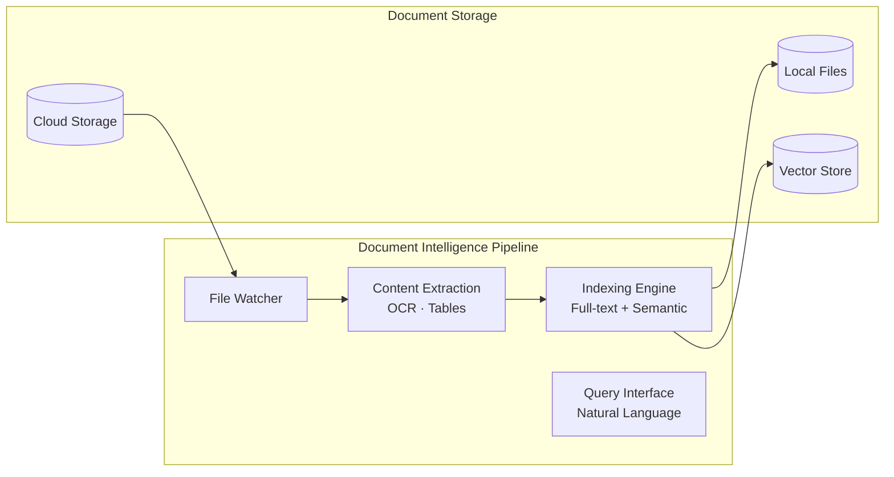

# Epic 3: Advanced Document Intelligence

**Status:** Planned  
**Target:** Q3 2026  
**Priority:** High

## Overview

Full-spectrum document handling with multi-format reading, OCR, semantic search, and intelligent document generation.

## Execution Order

| Phase | Issue | Title | Blocks |
|-------|-------|-------|--------|
| 3.1 | TBD | Multi-Format Document Reading | 3.2, 3.3 |
| 3.2 | TBD | Document Generation & Transformation | 3.3 |
| 3.3 | TBD | Document Search & Knowledge Base | - |

## Architecture



## Sub-Issues

### Phase 3.1: Multi-Format Document Reading

- [ ] OCR support (Tesseract integration)
- [ ] Table extraction and structured parsing
- [ ] Office suite (Excel, PowerPoint, Outlook)
- [ ] Code formats (Jupyter, Markdown, LaTeX)
- [ ] Media files (image analysis, audio transcription)

### Phase 3.2: Document Generation & Transformation

- [ ] Template engine (contracts, reports, proposals)
- [ ] Format conversion pipeline (PDF/Word/Markdown/HTML)
- [ ] Collaborative editing (track changes, version comparison)

### Phase 3.3: Document Search & Knowledge Base

- [ ] Local document indexing (file watcher)
- [ ] Semantic search (vector embeddings)
- [ ] Cloud storage integration (Drive, Dropbox, OneDrive)

## Epic Success Criteria

| Criterion | Pass Condition |
|-----------|----------------|
| **Format Support** | 15+ document formats (read/write) |
| **Search Performance** | <5s for 10K documents |
| **OCR Accuracy** | 95%+ on tables and text |
| **Cloud Sync** | Real-time sync with 3+ providers |

## Technical Stack

```typescript
// New dependencies
import Tesseract from "tesseract.js"; // OCR
import { Whisper } from "whisper-node"; // Audio transcription
import { PDFDocument } from "pdf-lib"; // PDF manipulation
import { GoogleDrive } from "@googleapis/drive"; // Cloud storage
```

## Labels

`epic`, `priority-high`, `documents`, `search`, `ocr`
