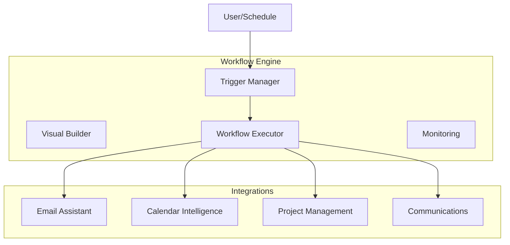

# Epic 4: Productivity Automation

**Status:** Planned  
**Target:** Q4 2026  
**Priority:** High

## Overview

Eliminate repetitive workflows with visual workflow builder, email/calendar automation, and cross-platform integrations.

## Execution Order

| Phase | Issue | Title | Blocks |
|-------|-------|-------|--------|
| 4.1 | TBD | Workflow Orchestration | 4.2, 4.3 |
| 4.2 | TBD | Email & Calendar Automation | 4.3 |
| 4.3 | TBD | Cross-Platform Integration | - |

## Architecture



## Sub-Issues

### Phase 4.1: Workflow Orchestration

- [ ] Visual workflow builder (Web UI)
- [ ] Advanced triggers (cron, events, conditions)
- [ ] Multi-step actions (branching, loops, error handling)

### Phase 4.2: Email & Calendar Automation

- [ ] Email assistant (categorize, draft, extract tasks)
- [ ] Calendar intelligence (auto-decline, optimal scheduling)

### Phase 4.3: Cross-Platform Integration

- [ ] Project management (Jira, Asana, GitHub)
- [ ] Communication (Slack, Teams, Zoom)
- [ ] Finance & expenses (receipt scanning, budgets)

## Epic Success Criteria

| Criterion | Pass Condition |
|-----------|----------------|
| **Workflow Templates** | 100+ pre-built templates |
| **Email Triage** | 75%+ time reduction |
| **Integrations** | 20+ platforms supported |
| **Reliability** | 99%+ workflow success rate |

## Technical Stack

```typescript
// New dependencies
import { Temporal } from "@temporalio/client"; // Workflow engine (optional)
import { Redis } from "ioredis"; // Job queue
import { JiraAPI } from "jira-client";
import { Slack } from "@slack/web-api";
```

## Labels

`epic`, `priority-high`, `automation`, `workflows`, `integrations`
