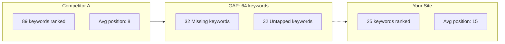

# Research: SEO Gap Analysis Feature
**Date**: 2026-03-27
**Sources**: Local codebase files, Web (Semrush, Ahrefs, Serper.dev), Library docs (Playwright, Cheerio via Context7)
**Used for**: Planning epic for SEO gap analysis feature in OpenZigs

---

## Research Summary

### Sources Consulted
| Source | Type | Key Findings |
|--------|------|-------------|
| `docs/ARCHITECTURE.md` | Local | Full architecture: Copilot SDK, MCP host, native subprocess servers, tool registry with risk/category, approval queue |
| `docs/USER_GUIDE.md` | Local | User-facing features: workbench editor, skills, agents, Pinterest SEO engine, research & content synthesis |
| `src/mcp/tool-registry.ts` | Local | `ToolDefinition` type: name, Zod schema, handler, category (11 categories), riskLevel, source. `registerTool()` pattern |
| `src/mcp/server.ts` | Local | All tool factories imported and registered; 50+ create*Tools factories; dependencies injected via McpServerOptions |
| `config/tools.json` | Local | Enabled tools list with `enabledTools[]`, `customRiskOverrides`, `globalApprovalOverrides` |
| `config/agents.json` | Local | 10 agent archetypes: researcher, coder, writer, analyst, reviewer, doc-expert, wizard, social-setup, scheduled-researcher, scheduled-monitor |
| `src/skills/` | Local | 14 skills with SKILL.md files: content-creator, knowledge-curator, media-director, pinterest-marketer, research-synthesizer, etc. |
| `src/skills/pinterest-marketer/SKILL.md` | Local | Existing Pinterest SEO skill: trend research, annotation extraction, competitive pin analysis, AI image gen, reporting |
| `src/skills/research-synthesizer/SKILL.md` | Local | Autonomous research skill: web search + YouTube ingest + transcription + markdown report + video synthesis |
| `src/browser/` | Local | Chrome launcher with stealth injection (anti-bot evasion scripts), CDP-based, persistent profile at ~/.openzigs/chrome-profile |
| `src/mcp/tools/pinterest-seo-tools.ts` | Local | Existing Pinterest SEO tool: Zod schemas, Pinterest API v5, HTML scraping, 5 annotation strategies, keyword enrichment tiers |
| `docs/PINTEREST_SEO_ENGINE.md` | Local | Full Pinterest pipeline: API + scraping → annotation extraction → score calculation → keyword enrichment → markdown report |
| `src/api/files.ts` | Local | Files API: GET /api/files/list, GET /api/files/content, POST /api/files/save, GET /api/files/serve — sandboxed to allowedDirs |
| `ui/app/workbench/page.tsx` | Local | MDX editor with file sidebar, import (document→markdown), research & generate dialog, ask AI panel |
| `ui/components/workbench/file-sidebar.tsx` | Local | Tree-based file browser using /api/files/list, recursive folder navigation |
| `ui/components/workbench/research-generate-dialog.tsx` | Local | Research dialog: topic, slant, article/YouTube count, image/video/Telegram options; generates step-by-step prompt |
| `src/copilot/copilot-wrapper.ts` | Local | CopilotClient wrapper with defineTool, streaming, infinite sessions, device auth, BYOK providers, SDK-native agents & skills |
| `src/routing/message-router.ts` | Local | Routes messages through Copilot SDK; injects personality, brand voice, tool scoping; supports agent switching |
| `src/tasks/task-engine.ts` | Local | SQLite-backed task queue: submit/complete/fail/cancel; rate limiting; immediate/background modes; event emitter |
| `src/knowledge/` | Local | Full RAG system: chunker, embedder, LanceDB vector store, converters, query classifier, multimodal retriever |
| Semrush blog | Web | Content gap analysis methodology: keyword gaps, LLM prompt visibility, audience research, underperforming content, SERP analysis |
| Ahrefs blog | Web | 5-step content gap process: find keyword gaps, refine/export, import to template, analyze opportunities, implement actions |
| Serper.dev | Web | Google SERP API: $1/1k queries, JSON with organic, knowledgeGraph, peopleAlsoAsk, relatedSearches; 500k+ companies |
| Playwright docs (Context7) | Library | page.textContent(), page.innerText(), $eval, $$eval for content extraction; locator-based methods preferred |
| Cheerio docs (Context7) | Library | cheerio.load(html), $.extract() for structured data, CSS selectors, .text(), .attr(), fromURL() |

---

### Requirements Extracted

#### Functional Requirements

1. **FR-001**: SEO gap analysis tool that compares a user's website/domain against 1–4 competitor domains to find keyword gaps *(Source: Semrush, Ahrefs)*
2. **FR-002**: Extract SERP data for target keywords (organic results, People Also Ask, related searches) from Google Search *(Source: Serper.dev API)*
3. **FR-003**: Scrape and extract article content from competitor pages — headings, word count, readability, meta tags, internal/external links *(Source: Ahrefs, browser/ stealth.ts)*
4. **FR-004**: Generate a structured SEO gap analysis report in Markdown with comparison tables, keyword opportunity scores, and mermaid diagrams *(Source: PINTEREST_SEO_ENGINE.md pattern)*
5. **FR-005**: Save analysis reports to `~/.openzigs/seo-reports/` and make them viewable in the Workbench *(Source: workbench/page.tsx, files API)*
6. **FR-006**: Support "domain-level" gaps (topics competitor covers but you don't) and "page-level" gaps (competitor ranks for more keywords on same topic) *(Source: Ahrefs)*
7. **FR-007**: Keyword metrics enrichment: search volume, keyword difficulty, CPC, trend direction *(Source: Semrush, existing pinterest-seo-tools.ts 3-tier enrichment pattern)*
8. **FR-008**: Content quality scoring per page: word count, heading structure, readability score (Flesch-Kincaid), keyword density, internal link count *(Source: SEO best practices)*
9. **FR-009**: Competitor content extraction via Playwright browser automation with stealth anti-bot evasion *(Source: browser/stealth.ts)*
10. **FR-010**: Background task execution via TaskEngine for long-running analysis of multiple competitor pages *(Source: task-engine.ts)*
11. **FR-011**: Integrate with existing knowledge base (RAG) to store and query SEO analysis results for longitudinal tracking *(Source: knowledge/ system)*
12. **FR-012**: Create an "SEO Analyst" agent archetype that chains seo-gap-* tools for autonomous competitive analysis *(Source: config/agents.json pattern)*
13. **FR-013**: Create an "seo-analyst" skill with SKILL.md defining workflows, tool routing rules, and autonomous execution patterns *(Source: pinterest-marketer/SKILL.md pattern)*

#### Non-Functional Requirements

1. **NFR-001**: Analysis of 4 competitor domains × 10 pages each should complete within 5 minutes in background mode *(Source: TaskEngine background processing)*
2. **NFR-002**: Respect robots.txt and rate-limit scraping to avoid IP bans; use stealth browser profile *(Source: browser/stealth.ts)*
3. **NFR-003**: SERP API usage should be metered/logged for cost tracking *(Source: existing audit logger pattern)*
4. **NFR-004**: Reports must render correctly in the Workbench MDX editor *(Source: workbench/forward-ref-editor.tsx)*

#### Business Rules

1. **BR-001**: Never fabricate SEO metrics — all data must come from actual API/scraping responses (same rule as Pinterest marketer skill) *(Source: pinterest-marketer/SKILL.md)*
2. **BR-002**: Competitor content scraping tools should be classified as "medium" risk level, requiring awareness but not blocking approval for interactive chat *(Source: tool-registry.ts risk classification)*
3. **BR-003**: SERP API key (Serper or Brave) must be configurable via `.env` and optionally stored in the Secret Vault *(Source: USER_GUIDE.md pattern)*

---

### Data Model Insights

**SEO Gap Analysis Report Structure:**
```typescript
interface SeoGapReport {
  id: string;
  createdAt: Date;
  targetDomain: string;
  competitorDomains: string[];
  keywords: KeywordGap[];
  contentGaps: ContentGap[];
  overallScore: number;
  recommendations: string[];
}

interface KeywordGap {
  keyword: string;
  searchVolume: number;
  keywordDifficulty: number;
  cpc?: number;
  targetRank: number | null;      // null = not ranking
  competitorRanks: Record<string, number>;
  opportunity: "missing" | "untapped" | "weak";
  estimatedTraffic: number;
}

interface ContentGap {
  topic: string;
  competitorUrl: string;
  competitorDomain: string;
  wordCount: number;
  headingCount: number;
  readabilityScore: number;
  keywordsTargeted: string[];
  targetHasContent: boolean;
  targetUrl?: string;
  actionRequired: "create" | "improve" | "skip";
}
```

**Integration points with existing schema:**
- SQLite table `seo_reports` (same pattern as `agent_tasks` table) for persistence
- `~/.openzigs/seo-reports/` directory for markdown report output
- Knowledge base integration for storing analysis chunks (LanceDB vectors)

---

### Integration Points

| System | Integration Method | Purpose |
|--------|-------------------|---------|
| **Serper.dev API** | HTTP REST (api.serper.dev) | SERP extraction: organic results, PAA, related searches |
| **Brave Search API** | Existing `web-search` tool | Fallback search when Serper unavailable |
| **Playwright CDP** | Existing `browser-navigate` tool + stealth | Competitor page content scraping |
| **Cheerio** | New dependency (npm) | Server-side HTML parsing without browser overhead |
| **Knowledge Base** | Existing `search-knowledge` tool | Store and query analysis results |
| **Task Engine** | Existing `TaskEngine.submit()` | Background execution of multi-page analysis |
| **Files API** | Existing `/api/files/*` routes | Report storage and Workbench display |
| **Workbench** | Existing MDX editor | View/edit generated reports |
| **Pinterest SEO** | Existing tools for keyword enrichment patterns | Reuse 3-tier keyword enrichment waterfall |

---

### User Roles & Permissions

- **Interactive user**: Can run SEO gap analysis via chat; tools auto-approve at "medium" risk for web scraping in interactive mode
- **Scheduled agent**: Can run periodic competitive monitoring (daily/weekly) via cron scheduler
- **Background task**: Long-running multi-page analysis runs through TaskEngine with async notification

---

### Technology Recommendations

#### Search API: Serper.dev (Recommended Primary)

| Feature | Serper.dev | Brave Search API |
|---------|-----------|-----------------|
| **Data Source** | Google SERPs (real) | Brave's independent index |
| **Pricing** | $1/1k queries (top-up, no subscription) | Free tier (1 query/sec), $5/1k beyond |
| **SERP Features** | organic, knowledgeGraph, PAA, relatedSearches, images, news, maps, shopping | organic, mixed (fewer features) |
| **Speed** | 1-2 seconds | 1-3 seconds |
| **Rate Limit** | 50-300 QPS depending on plan | 1 QPS (free), higher on paid |
| **SEO Relevance** | Google = 92% market share; data matches what users actually see | Independent index may differ from Google |
| **Recommendation** | **Primary API — most SEO-relevant data** | **Fallback / supplement (already integrated)** |

**Why Serper over Brave for SEO**: SEO gap analysis specifically needs *Google* rankings because that's where 92% of search happens. Brave's independent index provides different rankings, making gap detection against Google irrelevant. Serper's structured JSON (with People Also Ask, knowledge graph, sitelinks) is richer for analysis.

#### Recommended npm Packages

| Package | Purpose | Install |
|---------|---------|---------|
| **cheerio** | Server-side HTML parsing (article content extraction without browser) | `pnpm add cheerio` |
| **natural** | NLP toolkit: TF-IDF, tokenizer, stemmer, sentiment | `pnpm add natural` |
| **text-readability** | Flesch-Kincaid, Coleman-Liau, Automated Readability Index | `pnpm add text-readability` |
| **keyword-extractor** | Keyword/keyphrase extraction from text | `pnpm add keyword-extractor` |

**Already available in the project:**
- `marked` — Markdown parsing (used in pinterest-seo-tools.ts)
- `zod` — Schema validation for tool inputs
- Playwright/CDP — Browser automation (chrome-launcher.ts + stealth.ts)
- `better-sqlite3` — SQLite for report persistence
- LanceDB — Vector embeddings for knowledge base integration

#### Architecture Decisions

1. **New MCP tool file**: `src/mcp/tools/seo-gap-tools.ts` — follows the exact pattern of `pinterest-seo-tools.ts`
2. **New skill**: `src/skills/seo-analyst/SKILL.md` — follows pinterest-marketer pattern
3. **New agent**: Add "seo-analyst" to `config/agents.json`
4. **Report output**: `~/.openzigs/seo-reports/<domain>-<date>.md`
5. **SQLite tracking** (optional): New table for longitudinal keyword position tracking (same pattern as pinterest-tracker.ts)
6. **Category**: Use existing `"search"` tool category from `ToolCategory` type

---

### Codebase Architecture — How It All Fits Together

#### Tool Registration Pattern
1. Define Zod schemas for each tool's input
2. Create a `create*Tools()` factory function returning `ToolDefinition[]`
3. Import and call the factory in `src/mcp/server.ts`
4. Each tool has: `name`, `description`, `inputSchema`, `zodSchema`, `handler`, `category`, `riskLevel`
5. Handler returns `{ text: string, isError?: boolean }`

#### Skill Creation Pattern
1. Create directory `src/skills/<skill-name>/`
2. Write `SKILL.md` with YAML frontmatter: `name`, `description`, `allowed-tools`
3. Body contains: Identity section, Core Capabilities, Tool Routing Rules, Autonomous Workflows
4. Skills are auto-discovered by `skill-loader.ts` which scans `src/skills/*/SKILL.md`
5. Skill metadata is loaded into Copilot SDK via `skillDirectories` option

#### Agent Creation Pattern
1. Add entry to `config/agents.json` with: `name`, `displayName`, `description`, `prompt`, `tools[]`, optional `infer`
2. Agents with `tools: null` get all enabled tools; agents with explicit `tools` array get only those + ALWAYS_ON_TOOLS
3. Agent switching happens via `message-router.ts` `sessionAgents` map

#### Workbench File System
- **API**: `src/api/files.ts` — REST routes sandboxed to `allowedDirs` (default: `~/.openzigs/files/`)
- **UI**: `ui/app/workbench/page.tsx` — MDX editor + file sidebar + import + research dialog
- **Paths**: Reports saved to `~/.openzigs/` subdirectories are accessible if the directory is in `allowedDirs`
- **File sidebar**: Lazy-loads subdirectories via `/api/files/list`, renders tree with FolderNode component
- **Import**: Document → Markdown conversion via MarkItDown (Docker sidecar or local uvx)

#### Browser / Scraping Infrastructure
- **Chrome launcher**: `src/browser/chrome-launcher.ts` — finds Chrome binary, launches with remote debugging, persistent profile
- **Stealth scripts**: `src/browser/stealth.ts` — 10+ anti-bot evasion patches (webdriver, plugins, WebGL, permissions, etc.)
- **CDP browser tools**: `browser-navigate` (navigate + screenshot), `browser-read` (extract page content via CDP)
- **Existing scraping**: Pinterest SEO already does HTML scraping with 5 fallback strategies for annotation extraction

#### Existing SEO Patterns (Pinterest)
The Pinterest SEO Engine (`docs/PINTEREST_SEO_ENGINE.md`) is the closest existing analog:
- **Multi-source data**: API + HTML scraping (same pattern needed for SERP API + competitor scraping)
- **Score calculation**: Deterministic 0-100 composite score from metadata factors
- **3-tier keyword enrichment**: Pinterest Ads → DataForSEO → Google Suggest (same waterfall pattern)
- **Report format**: Structured markdown with tables, emoji badges, collapsible JSON details
- **Pin tracker**: SQLite-backed longitudinal tracking (reusable pattern for keyword position tracking)
- **Content Ideas Engine**: Trend-driven idea generation (similar to content gap recommendations)

---

### SEO Analysis Best Practices (2025-2026)

#### Modern Content Gap Analysis Methodology (from Semrush + Ahrefs)

1. **Keyword Gap Analysis**: Compare your domain vs 1-4 competitors; find "Missing" (all competitors rank, you don't) and "Untapped" (some competitors rank, you don't) keywords
2. **LLM/AI Visibility Gaps**: Track which prompts mention competitors but not you in ChatGPT/Claude/Perplexity responses (new in 2025-2026)
3. **Audience Intent Research**: Map keywords to search intent (informational, navigational, transactional, commercial)
4. **Underperforming Content Detection**: Find pages that lost traffic over 90 days — candidates for refresh
5. **SERP Feature Analysis**: Check if competitors appear in featured snippets, PAA, knowledge panels, AI overviews

#### Key Metrics for SEO Gap Scoring

| Metric | Description | Source |
|--------|-------------|--------|
| **Search Volume** | Monthly searches for a keyword | Serper + DataForSEO |
| **Keyword Difficulty** | Competition score (0-100) | DataForSEO / estimation |
| **Content Score** | Composite of word count, headings, readability, keyword density | Local analysis |
| **SERP Position** | Current ranking position (null = not ranking) | Serper SERP results |
| **Traffic Opportunity** | Estimated monthly traffic if ranking in top 3 | Volume × CTR curve |
| **Content Freshness** | Last modified date / publish date | Scraping meta tags |
| **Backlink Gap** | Difference in referring domains (advanced) | Would need Ahrefs/Moz API |
| **E-E-A-T Signals** | Author presence, citations, expertise markers | Content analysis |

#### Report Format Best Practices

Reports should include:
- **Executive Summary**: Top 5 opportunities with estimated traffic impact
- **Keyword Gap Table**: keyword | volume | KD | your rank | competitor ranks | opportunity type
- **Content Gap Cards**: Per-topic cards showing competitor coverage vs. your coverage
- **Mermaid Diagrams**: Competitive position radar chart, keyword opportunity funnel
- **Action Items**: Prioritized list of content to create or improve
- **Keyword Clusters**: Group related keywords by topic/intent

Example Mermaid diagram for competitive positioning:


---

### Improvement Suggestions (Beyond Basic Requirements)

1. **Scheduled Competitive Monitoring**: Cron job that runs weekly SEO gap analysis and sends a digest notification via Telegram/Discord (leverage existing scheduler + notification tools)
2. **Knowledge Base Integration**: Auto-ingest SEO reports into the knowledge base so the agent can answer questions like "What were our top keyword opportunities last month?"
3. **Cross-Platform SEO**: Combine Google gap analysis with existing Pinterest SEO data for a unified content strategy view
4. **AI Content Brief Generator**: After identifying gaps, auto-generate content briefs with target keywords, suggested headings, word count targets, and competitor reference URLs
5. **SERP Feature Tracker**: Track featured snippet ownership over time — detect when competitors capture/lose featured snippets
6. **LLM Visibility Tracking**: Query ChatGPT/Claude/Perplexity APIs for brand mention tracking in AI responses (the emerging "GEO" — Generative Engine Optimization — discipline from Semrush)
7. **Workbench Integration**: Add an "SEO Analysis" button/dialog to the Workbench that lets users trigger analysis directly from the editor while viewing a content page
8. **Bulk Domain Analysis**: Support analyzing an entire site map to find the weakest pages across a domain
9. **Content Refresh Scoring**: Score existing content for "freshness decay" — pages that haven't been updated in 6+ months with declining traffic
10. **Competitor Alert System**: Use Sentinel (autonomous SRE monitor) pattern to alert when a competitor publishes new content in your keyword space

---

### Open Questions

1. **API Key Choice**: Should we default to Serper.dev (Google results) or keep Brave Search as the primary and add Serper as optional? Serper is more SEO-relevant but adds a new API dependency.
2. **Scraping Depth**: How many pages per competitor should the tool analyze in a single run? (Recommended: 10-20 with configurable limit)
3. **Report Storage**: Should reports go in `~/.openzigs/seo-reports/` (new dir) or `~/.openzigs/research/` (existing research dir)?
4. **SQLite Tracking**: Should we add a dedicated `seo_keyword_positions` SQLite table for longitudinal tracking, or store everything as markdown reports?
5. **DataForSEO Integration**: The Pinterest engine already has DataForSEO tier-2 enrichment. Should we reuse that code or keep SEO tools independent?
6. **Rate Limiting**: What's the appropriate rate limit for scraping competitor pages? (Recommended: 2-second delay between requests, max 50 pages per analysis run)

---

### Constraints & Assumptions

- Assumes user has a Serper.dev API key OR Brave Search API key (at minimum one search API)
- Competitor page scraping requires Chrome to be available on the system (existing chrome-launcher infrastructure)
- The Copilot SDK handles the agent loop; we only define tools and let the LLM orchestrate
- Reports must be valid Markdown that renders in the MDX editor (avoid raw HTML, use standard tables/headings)
- The existing Pinterest SEO tool code can be referenced for patterns but should NOT be modified
- Tool definitions follow the existing `ToolDefinition` type with Zod schemas

### Security Considerations

- **SERP API keys**: Must be stored securely (`.env` or Secret Vault), never exposed to frontend
- **User-agent strings**: Scraping must use realistic user-agents; stealth.ts already handles this
- **Rate limiting**: Aggressive scraping can trigger IP bans; enforce configurable delays
- **Path traversal**: Report paths must go through the existing `sanitizePath()` / `isPathAllowed()` guards in files.ts
- **Content injection**: Scraped HTML content must be sanitized before rendering in reports — use text extraction (cheerio .text()) not raw HTML injection
- **Robots.txt**: Consider checking robots.txt before scraping competitor pages (good citizenship, though not legally required)
